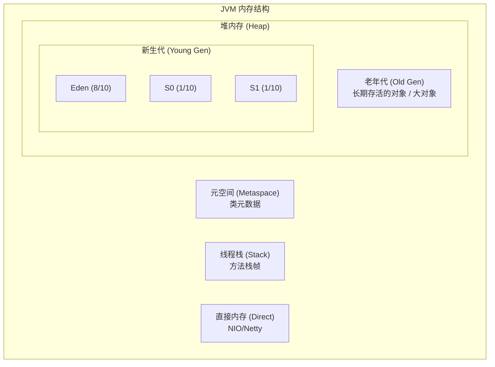

# 【阿里淘天AI二面】JVM调优时，如何查看内存对象的情况？有了解过开源工具吗？

> 来源：阿里巴巴淘天淘工厂 AI应用开发 二面面经（小红书）

## 一、JVM 内存区域回顾



## 二、在线诊断工具：Arthas

### Arthas 是什么

Arthas 是阿里巴巴开源的 Java 在线诊断工具，**无需重启应用**，通过字节码增强技术实时查看JVM状态。

### 核心命令速查

```bash
# 安装与启动
curl -O https://arthas.aliyun.com/arthas-boot.jar
java -jar arthas-boot.jar <pid>

# 1. dashboard — JVM总览（内存、GC、线程一目了然）
[arthas@12345]$ dashboard
# 显示：堆内存使用率、GC次数/耗时、线程状态、CPU使用率

# 2. jvm — 查看JVM详细信息
[arthas@12345]$ jvm
# 显示：JVM版本、内存区域详细大小、GC策略、类加载数量

# 3. heapdump — 导出堆转储文件
[arthas@12345]$ heapdump /tmp/heap.hprof
# 生成heap dump文件，后续用MAT分析

# 4. 查看类加载信息和对象大小
[arthas@12345]$ ognl '@java.lang.Runtime@getRuntime().freeMemory()'
# 通过OGNL表达式查看运行时内存

# 5. profiler — 生成火焰图（CPU或内存分配）
[arthas@12345]$ profiler start --event alloc
# 开始内存分配采样
[arthas@12345]$ profiler stop --format html
# 停止并生成火焰图HTML报告

# 6. vmtool — 查询内存中的对象
[arthas@12345]$ vmtool --action getInstances --className java.lang.String --limit 10
# 查询内存中String对象实例

# 7. watch — 观察方法执行（含返回值和耗时）
[arthas@12345]$ watch com.example.OrderService createOrder returnObj -x 2
# 观察OrderService.createOrder方法的返回值

# 8. trace — 追踪方法调用链耗时
[arthas@12345]$ trace com.example.OrderService createOrder
# 追踪方法内部每个子调用的耗时
```

### Dashboard 输出解读

```
 dashboard
┌──────────────────────────────────────────────────────────┐
│ Memory                     │ GC                          │
│ heap: 2.0G  used: 1.5G     │ gc.ps.scavenge.count: 245   │
│  eden: 800M  used: 750M    │ gc.ps.scavenge.time: 3456ms │ ← 新生代GC(Minor)
│  survivor: 100M used: 45M  │ gc.ps.markSweep.count: 5    │
│  old: 1.1G   used: 705M    │ gc.ps.markSweep.time: 8923ms│ ← 老年代GC(Full)
│ nonheap: 256M used: 180M   │                             │
│ ─────────────────────────  │ ────────────────────────── │
│ 如果old.used持续增长       │ Full GC次数频繁(>5/min)     │
│ 且不下降 → 内存泄漏嫌疑     │ 且耗时长(>1s) → STW严重    │
└──────────────────────────────────────────────────────────┘
```

## 三、JDK 自带工具

### jmap — 堆内存映射

```bash
# 查看堆内存概况
jmap -heap <pid>
# 输出：Eden/Survivor/Old各区大小和使用率

# 查看对象统计（按占用大小排序，找最占内存的类）
jmap -histo <pid> | head -20
# 输出示例：
#  num     #instances         #bytes  class name
#    1:       1234567      123456789  [B  (byte数组)
#    2:        567890       45678901  java.lang.String
#    3:        345678       23456789  java.util.HashMap$Node

# 查看对象统计（只看存活对象）
jmap -histo:live <pid> | head -20
# :live 触发一次Full GC后统计

# 导出heap dump
jmap -dump:format=b,file=/tmp/heap.hprof <pid>
```

### jstack — 线程栈分析

```bash
# 查看线程堆栈（排查死锁、线程阻塞）
jstack <pid>

# 查看线程状态统计
jstack <pid> | grep "java.lang.Thread.State" | sort | uniq -c
# 输出示例：
#    15 RUNNABLE
#     3 BLOCKED       ← 阻塞线程（锁竞争）
#    42 WAITING       ← 等待中的线程
```

### jstat — GC统计

```bash
# 每隔1秒输出GC情况，共10次
jstat -gcutil <pid> 1000 10
# 输出示例：
#   S0     S1     E      O      M     YGC   YGCT   FGC   FGCT
#   0.00  45.23  78.56  65.34  92.1   245   3.456    5   8.923
#                                                 ↑Full GC次数 ↑Full GC总耗时
```

## 四、离线分析工具：MAT (Memory Analyzer Tool)

```
heap.hprof (堆转储文件)
       │
       ▼
┌───────────────────────────────────────────┐
│              MAT 分析流程                   │
│                                           │
│ 1. Leak Suspects Report（泄漏嫌疑报告）    │
│    → 自动分析可能的内存泄漏点               │
│                                           │
│ 2. Dominator Tree（支配树）                │
│    → 按对象保留内存大小排序                 │
│    → 找出"谁占的内存最多"                  │
│                                           │
│ 3. Histogram（直方图）                     │
│    → 按类统计对象数量和大小                 │
│    → 对比Shallow Size vs Retained Size    │
│                                           │
│ 4. Path to GC Roots（GC根引用链）          │
│    → 查看对象为什么没被回收                 │
│    → 找到阻止GC的引用链                    │
└───────────────────────────────────────────┘

关键概念：
  Shallow Size  = 对象自身占用的内存
  Retained Size = 对象被回收后能释放的总内存（包括引用链上的对象）

  Retained Size >> Shallow Size 的对象 → 内存泄漏嫌疑
```

## 五、完整排查流程

```
步骤1：发现异常
  监控告警：Full GC频繁 / OOM / 响应变慢
       │
       ▼
步骤2：在线诊断（Arthas）
  dashboard → 看哪个内存区域不正常
  jmap -histo → 哪个类对象最多
       │
       ▼
步骤3：导出heap dump
  heapdump /tmp/heap.hprof
       │
       ▼
步骤4：离线分析（MAT）
  Dominator Tree → 定位最大的Retained Size对象
  Path to GC Roots → 找引用链
       │
       ▼
步骤5：定位代码
  找到泄漏对象是哪个类 → 对应哪个模块的代码
  Arthas watch/trace → 确认创建/引用的代码位置
       │
       ▼
步骤6：修复 + 验证
  修复后用jstat确认Full GC频率下降
```

## 六、面试加分点

1. **提到Arthas的redefine命令**：可以热更新class文件，不停机修复线上bug
2. **提到Prometheus + Grafana监控**：生产环境应该有JVM监控面板，而不是等出问题再手动排查
3. **提到Shallow Size vs Retained Size的区别**：这是MAT分析的核心概念
4. **提到AI场景的特殊性**：AI应用中模型对象（权重、KV Cache）可能占用大量直接内存，需要特别关注Native Memory
5. **提到JFR(Java Flight Recorder)**：JDK 11+内置的低开销性能采集工具，适合长期运行的生产环境

## 苏格拉底式面试追问

> 这组追问模拟面试官层层逼问，每一问先回答"为什么"，再回答"怎么做"，最后回答"如何证明"。

### 第一层：目标与动机

**Q：线上 JVM 内存涨了你用 Arthas 而不是直接 jmap dump，动机是什么？Arthas 比传统工具强在哪？**

Arthas 不停机、可交互、开销可控。jmap dump 会 STW（全堆转储时暂停应用几秒到几十秒），对生产服务是事故；且 dump 出来的 hprof 是静态快照，不能看对象引用链的变化。Arthas 的 `dashboard`、`heapdump`、`profiler` 命令可以实时看 JVM 状态、按需 dump、抓 CPU/内存火焰图，且 Arthas 是字节码增强，开销 <5%，适合线上持续诊断。动机是"线上不停机诊断"，这是 jmap/jstack 等传统工具做不到的。

### 第二层：证据与定位

**Q：JVM 老年代占用从 40% 涨到 85% 不下来，你怎么用 Arthas 定位是哪个对象在涨？**

三步定位：一是 `dashboard` 看老年代占用趋势和 GC 频率（Full GC 是否在跑但清不掉）；二是 `heapdump` dump 堆，用 MAT 分析 Dominator Tree，找占内存最大的对象类（如发现 `byte[]` 或某业务对象占 3GB）；三是 Arthas 的 `vmtool --action getInstances --className XXX` 直接查某类的实例数量和引用链，看是谁在持有这些对象不释放。常见根因：缓存无上限、大 List 未清理、ThreadLocal 泄漏。

### 第三层：根因深挖

**Q：MAT 显示 `HashMap$Node` 占了 4GB，但这只是个泛型容器，怎么定位里面装的是哪个业务对象？**

用 MAT 的 "List Objects" → "with incoming references"，从 HashMap$Node 反查它的 key/value 类型，再往上追溯是谁持有这个 HashMap。或者用 OQL（Object Query Language）查询：`SELECT * FROM com.xxx.BusinessObject` 看该业务对象有多少实例。如果业务对象实例数和 HashMap$Node 数量对应，确认就是这个业务对象被缓存在 HashMap 里。进一步看 HashMap 的持有者（可能是某个 static 字段或单例），定位到代码里的具体缓存变量。

**Q：那为什么不直接在代码里给所有缓存加上限（如 Guava Cache 的 maximumSize），省得排查？**

加上限是治本但排查仍有价值。一是历史代码里可能有不规范的缓存（裸 HashMap、static List），加上限要逐个改造，排查能快速定位最严重的先修；二是内存泄漏不只在缓存——ThreadLocal 泄漏、大 byte[]（如未释放的序列化结果）、类加载器泄漏（动态生成的 Class）都不是"加缓存上限"能解决的；三是排查能确认根因（是缓存还是别的），避免"加了上限但内存还涨"的误诊。排查和治本不矛盾，排查定位 + 上限预防是组合拳。

### 第四层：方案权衡

**Q：AI 应用里你提到模型对象（权重/KV Cache）占 Native Memory，这块 Arthas 能看吗？不能的话怎么办？**

Arthas 主要看 JVM 堆内对象，Native Memory（DirectByteBuffer、JNI 分配的模型权重）在堆外，Arthas 看不全。AI 应用的模型推理（如 ONNX Runtime、TensorRT）的权重和 KV Cache 常分配在 Direct Memory 或 GPU 显存，不进 JVM 堆。定位这块要用 `jcmd <pid> VM.native_memory`（JDK 11+，需启动时加 `-XX:NativeMemoryTracking=summary`）看 Native 内存分布；GPU 显存用 `nvidia-smi` 看进程占用；DirectByteBuffer 用 `arthas vmtool` 查 DirectByteBuffer 实例。AI 场景的内存排查要跨 JVM 堆和 Native/GPU，比传统 Java 应用复杂。

**Q：为什么不直接把模型推理放 Python 服务（原生支持 GPU/显存管理），而要在 JVM 里趟 Native Memory 的坑？**

看技术栈和架构。如果整个系统是 Java 微服务生态（Spring Cloud、内部 RPC 框架），引入 Python 推理服务要跨语言调用（gRPC/HTTP），增加延迟和运维复杂度。JVM 里跑推理（如通过 JNI 调 ONNX Runtime Java API）能复用现有基础设施。但如果是纯 AI 团队，Python 服务更自然（PyTorch/Transformers 生态）。选型是工程权衡——JVM 生态成熟度 vs Python 的 AI 原生支持。现在趋势是推理用 Python（或 C++ serving 如 Triton），Java 做业务编排，通过 gRPC 解耦。

### 第五层：验证与沉淀

**Q：你怎么证明内存优化真的有效，而不是碰巧那几天流量低没涨？**

上线前后各采 1 周基线：老年代占用 P99、Full GC 频率、堆内存峰值。做流量归一化——把老年代占用除以 QPS（MB/QPS），消除流量波动。如果上线后 MB/QPS 显著下降且 Full GC 频率降低，证明是优化效果。更严格的是压测验证：用相同流量打上线前后两版，对比内存占用曲线，控制变量。

**Q：JVM 内存排查的经验怎么沉淀成团队 SOP？**

固化成"内存问题排查 runbook"：第一步 dashboard 看趋势 → 第二步 heapdump + MAT 找大对象 → 第三步 Arthas vmtool 查引用链 → 第四步定位代码修复。配套 JVM 监控面板（Prometheus + Grafana，老年代占用、GC 频率、Native Memory），设告警（老年代 >80% 持续 5 分钟触发）。沉淀"常见内存泄漏模式库"（缓存无上限/ThreadLocal/类加载器/大 byte[]），新人遇到内存问题按 runbook 走，不依赖个人经验。

## 结构化回答

**30 秒电梯演讲：** JVM调优查看内存对象的核心工具是Arthas——一个线上诊断工具，可以实时查看堆内存中新生代/老年代占用情况、哪些类占用内存最多、对象引用链等。配合jmap、jstack、MAT等工具形成完整的内存分析工具链。

**展开框架：**
1. **Arthas** — 阿里开源的Java在线诊断工具，无需停机，实时查看JVM状态
2. **核心命令** — dashboard(总览)、heapdump(堆转储)、profiler(CPU/内存火焰图)
3. **jmap -histo** — 查看堆中对象统计（按大小/数量排序）

**收尾：** 您想深入聊：Arthas的watch和trace命令有什么区别？


## 视频脚本

> 预计时长：3 分钟 | 由浅入深


| 时间 | 画面/字幕 | 口播台词 | 讲解要点 |
|------|----------|----------|----------|
| 0:00 | 标题卡：JVM调优时，如何查看内存对象的情况？有了解过开… | "JVM内存就像一个仓库——Arthas是仓库的'透视镜'，不用停业(停机)就能看到：哪个货…" | 开场钩子 |
| 0:20 | 核心概念图 | "JVM调优查看内存对象的核心工具是Arthas——一个线上诊断工具，可以实时查看堆内存中新生代/老年代占用情况、哪些类占…" | 核心定义 |
| 0:55 | Arthas示意图 | "Arthas——阿里开源的Java在线诊断工具，无需停机，实时查看JVM状态" | 要点拆解1 |
| 1:30 | 对比/实战案例图 | "对比一下常见误区和工程实践，看真实场景里怎么取舍。" | 实战与对比 |
