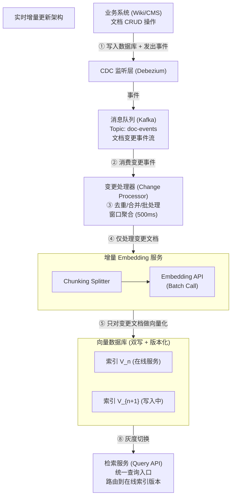

# 【字节面经】业务知识库每天有大量文档新增和修改，如何设计一套实时增量更新方案，使检索结果保持低延迟且一致性可控？

## 一、问题分析：为什么需要增量更新

### 1.1 全量重建的痛点

最简单的方案是定期全量重建向量索引，但这在生产中完全不可行：

| 问题 | 全量重建 | 增量更新 |
|------|---------|---------|
| 百万文档重建耗时 | 4~8 小时 | — |
| 重建期间服务状态 | 需停服或双索引切换 | 持续在线 |
| 更新延迟 | 小时级~天级 | 秒级~分钟级 |
| Embedding API 成本 | 每次全量调用 | 仅调用变更部分 |
| GPU 资源消耗 | 峰值高 | 平稳 |

**核心矛盾：实时性 vs 一致性 vs 吞吐量的三角权衡。**

- 要**实时性**（秒级感知变更）→ 需要高频增量处理
- 要**一致性**（检索结果与源数据一致）→ 需要版本控制和冲突处理
- 要**吞吐量**（百万文档高频变更）→ 需要批处理和异步管道

增量更新的目标是在这三者间找到最优平衡：**有界延迟的最终一致性。**

---

## 二、整体架构设计



---

## 三、核心组件详解

### 3.1 CDC（Change Data Capture）监听层

CDC 是增量更新的**入口**，负责捕获源数据的变更事件。

**方案选择：**

| CDC 方案 | 原理 | 延迟 | 适用场景 |
|---------|------|------|---------|
| **Debezium + Kafka** | 监听数据库 WAL/Binlog | 毫秒级 | PostgreSQL/MySQL，生产首选 |
| **MongoDB Change Stream** | 监听 Oplog | 毫秒级 | MongoDB 原生 |
| **应用层双写** | 业务代码写DB后发事件 | 秒级 | 简单但侵入性强 |
| **定时轮询** | 定期查询 `updated_at` | 分钟级 | 兜底方案 |

**事件格式：**

```json
{
  "event_id": "evt_20240101_001",
  "event_type": "UPDATE",       // INSERT / UPDATE / DELETE
  "document_id": "doc_12345",
  "timestamp": "2024-01-01T10:00:00Z",
  "version": 42,                // 文档版本号（乐观锁）
  "changes": {
    "title": "新标题",
    "content": "更新后的内容..."
  }
}
```

**关键设计：幂等 + 去重。** 同一文档短时间多次修改只取最新版本。

### 3.2 增量 Embedding 服务

核心原则：**只对变更文档做 Embedding，不重复处理未变更内容。**

**优化策略：**

1. **内容哈希去重**：计算文档内容的 hash，如果 hash 未变则跳过
2. **Chunk 级增量**：长文档按 chunk 切分，只重新 Embed 内容变更的 chunk
3. **批量调用**：聚合 500ms 窗口内的变更，批量调用 Embedding API（降低延迟和成本）

```python
import hashlib

def compute_content_hash(content: str) -> str:
    """计算内容哈希用于变更检测"""
    return hashlib.sha256(content.encode()).hexdigest()

def get_changed_chunks(
    doc_id: str,
    new_chunks: List[str],
    old_chunks_hash: Dict[int, str],
) -> List[tuple]:
    """
    Chunk 级增量检测：只返回内容变化的 chunk。
    Returns: [(chunk_index, chunk_text), ...]
    """
    changed = []
    for idx, chunk in enumerate(new_chunks):
        new_hash = compute_content_hash(chunk)
        if old_chunks_hash.get(idx) != new_hash:  # 内容变化
            changed.append((idx, chunk))
    return changed
```

### 3.3 双写索引 + 版本号管理

**双写策略**保证更新期间服务不中断：

```
时间线：
  ──────────────────────────────────────────────────→
       │                    │              │
       ▼                    ▼              ▼
  开始写入 V_{n+1}      V_{n+1} 写完     切换流量到 V_{n+1}
       │                    │              │
  V_n 在线服务          V_n 仍在线       V_{n+1} 在线
  V_{n+1} 写入中        V_{n+1} 就绪     V_n 标记为待删除
```

**版本号机制：**

```python
# 每个文档在向量库中存储版本号
{
    "id": "doc_12345_chunk_0",
    "vector": [0.1, 0.2, ...],
    "metadata": {
        "doc_id": "doc_12345",
        "chunk_index": 0,
        "version": 42,              # 文档版本号
        "content_hash": "abc123",   # 内容哈希
        "embedding_model": "text-embedding-3-large-v1",
        "index_version": "V_2024_01_01_001",  # 索引版本
        "ttl": 86400,               # 旧版本TTL（秒）
        "created_at": "2024-01-01T10:00:00Z"
    }
}
```

### 3.4 一致性保障机制

| 机制 | 说明 | 场景 |
|------|------|------|
| **版本号（Versioning）** | 每次更新递增版本号，查询时只返回最新版本 | 防止读到过期数据 |
| **TTL（Time-To-Live）** | 旧版本数据设置过期时间，自动清理 | 回收存储空间 |
| **墓碑标记（Tombstone）** | 删除操作写入墓碑标记而非直接删除 | 保证删除操作的最终一致性 |
| **定期对账（Reconciliation）** | 定时全量扫描，比对源库与索引差异 | 兜底保障，修复遗漏 |
| **灰度切换** | 新索引先切 10% 流量验证，再逐步全量 | Embedding 模型升级等高风险变更 |

---

## 四、Python 代码实现

### 4.1 完整增量更新 Pipeline

```python
import hashlib
import time
import json
from typing import List, Dict, Optional, Tuple
from dataclasses import dataclass, field
from enum import Enum
from collections import defaultdict


class EventType(Enum):
    INSERT = "INSERT"
    UPDATE = "UPDATE"
    DELETE = "DELETE"


@dataclass
class DocumentEvent:
    """CDC 捕获的文档变更事件"""
    event_id: str
    event_type: EventType
    document_id: str
    version: int
    content: Optional[str] = None        # INSERT/UPDATE 时有值
    timestamp: float = field(default_factory=time.time)
    content_hash: Optional[str] = None    # 内容哈希


class IncrementalIndexManager:
    """
    实时增量索引管理器。
    
    核心流程: CDC事件 → 去重合批 → 增量Embedding → 双写索引 → 灰度切换
    """

    def __init__(
        self,
        vector_db_client,           # 向量库客户端 (Milvus/Qdrant/FAISS)
        embedding_func,             # Embedding 函数
        batch_window_ms: int = 500, # 批处理窗口
        batch_size: int = 32,       # 每批最大文档数
        ttl_seconds: int = 86400,   # 旧版本TTL
    ):
        self.vector_db = vector_db_client
        self.embed = embedding_func
        self.batch_window_ms = batch_window_ms
        self.batch_size = batch_size
        self.ttl_seconds = ttl_seconds

        # 状态管理
        self._latest_version: Dict[str, int] = {}       # doc_id → 最新版本号
        self._content_hashes: Dict[str, str] = {}        # doc_id → 内容哈希
        self._chunk_hashes: Dict[str, Dict[int, str]] = {}  # doc_id → {chunk_idx: hash}
        self._event_buffer: List[DocumentEvent] = []     # 事件缓冲区

    # ==================== 第1步: 接收事件 + 去重 ====================

    def ingest_event(self, event: DocumentEvent) -> None:
        """
        接收 CDC 事件，去重后加入缓冲区。
        同一文档短时间内多次修改只保留最新版本。
        """
        # 版本号检查：丢弃过期事件（乱序到达）
        last_version = self._latest_version.get(event.document_id, 0)
        if event.version <= last_version:
            print(f"[SKIP] 过期事件: doc={event.document_id} "
                  f"event_ver={event.version} ≤ current_ver={last_version}")
            return

        # 内容哈希检查：内容未变则跳过（仅 UPDATE）
        if event.event_type == EventType.UPDATE:
            new_hash = self._compute_hash(event.content)
            if self._content_hashes.get(event.document_id) == new_hash:
                print(f"[SKIP] 内容未变: doc={event.document_id}")
                return
            event.content_hash = new_hash

        # 更新缓冲区：同文档只保留最新事件
        self._event_buffer = [
            e for e in self._event_buffer
            if e.document_id != event.document_id
        ]
        self._event_buffer.append(event)
        self._latest_version[event.document_id] = event.version

    # ==================== 第2步: 批处理刷新 ====================

    def flush(self) -> Dict:
        """
        刷新缓冲区，执行批量增量更新。
        Returns: 处理统计信息
        """
        if not self._event_buffer:
            return {"processed": 0, "skipped": 0, "errors": 0}

        # 取出当前缓冲区
        events = self._event_buffer[:self.batch_size]
        self._event_buffer = self._event_buffer[self.batch_size:]

        stats = {"processed": 0, "skipped": 0, "errors": 0}

        # 分组处理
        inserts_updates = [e for e in events if e.event_type in (EventType.INSERT, EventType.UPDATE)]
        deletes = [e for e in events if e.event_type == EventType.DELETE]

        # 处理插入/更新
        if inserts_updates:
            results = self._process_upserts(inserts_updates)
            stats["processed"] += results["processed"]
            stats["skipped"] += results["skipped"]
            stats["errors"] += results["errors"]

        # 处理删除
        for event in deletes:
            self._process_delete(event)
            stats["processed"] += 1

        return stats

    # ==================== 第3步: 增量 Embedding + 写入 ====================

    def _process_upserts(self, events: List[DocumentEvent]) -> Dict:
        """批量处理 INSERT/UPDATE 事件"""
        stats = {"processed": 0, "skipped": 0, "errors": 0}
        vectors_to_upsert = []

        for event in events:
            try:
                # Chunk 切分
                chunks = self._chunk_document(event.content)

                # Chunk 级增量检测：只重新 Embed 变化的 chunk
                old_chunk_hashes = self._chunk_hashes.get(event.document_id, {})
                changed_chunks = []
                for idx, chunk_text in enumerate(chunks):
                    chunk_hash = self._compute_hash(chunk_text)
                    if old_chunk_hashes.get(idx) != chunk_hash:
                        changed_chunks.append((idx, chunk_text, chunk_hash))

                if not changed_chunks:
                    stats["skipped"] += 1
                    continue

                # 批量 Embedding（只对变化的 chunk）
                chunk_texts = [c[1] for c in changed_chunks]
                embeddings = self.embed(chunk_texts)  # 批量调用

                # 构造写入记录（带版本号）
                for (chunk_idx, chunk_text, chunk_hash), vector in zip(changed_chunks, embeddings):
                    record = {
                        "id": f"{event.document_id}_chunk_{chunk_idx}",
                        "vector": vector,
                        "metadata": {
                            "doc_id": event.document_id,
                            "chunk_index": chunk_idx,
                            "version": event.version,
                            "content_hash": chunk_hash,
                            "content": chunk_text,
                            "updated_at": event.timestamp,
                            "ttl": self.ttl_seconds,
                        },
                    }
                    vectors_to_upsert.append(record)

                # 更新哈希缓存
                new_chunk_hashes = {idx: h for idx, _, h in changed_chunks}
                self._chunk_hashes[event.document_id] = {
                    **old_chunk_hashes,
                    **new_chunk_hashes,
                }
                self._content_hashes[event.document_id] = event.content_hash
                stats["processed"] += 1

            except Exception as e:
                print(f"[ERROR] 处理失败: doc={event.document_id}, error={e}")
                stats["errors"] += 1

        # 批量写入向量库（双写：写入新版本，旧版本靠 TTL 自动过期）
        if vectors_to_upsert:
            self.vector_db.upsert(
                collection=f"docs_v{int(time.time() // 3600)}",  # 按小时版本
                records=vectors_to_upsert,
            )

        return stats

    def _process_delete(self, event: DocumentEvent) -> None:
        """
        处理删除事件：写入墓碑标记（Tombstone），而非直接物理删除。
        旧 chunk 靠 TTL 自动过期，避免删除期间的查询不一致。
        """
        # 方式1: 按前缀批量删除（推荐，向量库原生支持）
        self.vector_db.delete_by_filter(
            collection="docs_current",
            filter_expr=f'doc_id == "{event.document_id}"',
        )

        # 方式2: 写入墓碑标记（延迟删除，保证一致性窗口可控）
        # tombstone = {
        #     "id": f"{event.document_id}_tombstone",
        #     "vector": [0.0] * dim,
        #     "metadata": {
        #         "doc_id": event.document_id,
        #         "deleted": True,
        #         "deleted_at": event.timestamp,
        #         "ttl": self.ttl_seconds,
        #     },
        # }
        # self.vector_db.upsert("docs_current", [tombstone])

    # ==================== 第4步: 定期对账 ====================

    def reconcile(
        self,
        source_doc_ids: set,
        batch_size: int = 1000,
    ) -> Dict:
        """
        定期全量对账：比对源库文档与向量索引的一致性。
        兜底保障，修复增量遗漏。
        """
        # 获取向量库中所有 doc_id
        indexed_doc_ids = set(self.vector_db.list_doc_ids("docs_current"))

        missing = source_doc_ids - indexed_doc_ids       # 源库有但索引没有
        orphaned = indexed_doc_ids - source_doc_ids      # 索引有但源库已删

        print(f"[RECONCILE] 缺失: {len(missing)}, 孤儿: {len(orphaned)}")

        # 修复缺失（重新索引）
        if missing:
            print(f"  重新索引 {len(missing)} 个缺失文档...")

        # 清理孤儿（删除索引中多余的）
        if orphaned:
            for doc_id in orphaned:
                self.vector_db.delete_by_filter(
                    "docs_current", filter_expr=f'doc_id == "{doc_id}"'
                )

        return {"missing": len(missing), "orphaned": len(orphaned)}

    # ==================== 工具方法 ====================

    @staticmethod
    def _compute_hash(text: str) -> str:
        return hashlib.sha256(text.encode()).hexdigest()

    @staticmethod
    def _chunk_document(
        text: str,
        chunk_size: int = 512,
        overlap: int = 50,
    ) -> List[str]:
        """简单滑动窗口切分（生产环境用 RecursiveCharacterTextSplitter）"""
        chunks = []
        start = 0
        while start < len(text):
            end = start + chunk_size
            chunks.append(text[start:end])
            start += chunk_size - overlap
        return chunks if chunks else [text]


# ============ 使用示例 ============

class MockVectorDB:
    """模拟向量数据库客户端"""
    def __init__(self):
        self.data = defaultdict(list)

    def upsert(self, collection, records):
        self.data[collection].extend(records)
        print(f"  [VectorDB] 写入 {len(records)} 条到 {collection}")

    def delete_by_filter(self, collection, filter_expr):
        print(f"  [VectorDB] 从 {collection} 删除: {filter_expr}")

    def list_doc_ids(self, collection):
        return {r["metadata"]["doc_id"] for r in self.data[collection]}


def mock_embed(texts: List[str]) -> List[List[float]]:
    """模拟 Embedding 函数"""
    return [[hash(t) % 100 / 100.0] * 8 for t in texts]  # 伪向量


if __name__ == "__main__":
    manager = IncrementalIndexManager(
        vector_db_client=MockVectorDB(),
        embedding_func=mock_embed,
        batch_window_ms=500,
        batch_size=32,
        ttl_seconds=3600,
    )

    # 模拟 CDC 事件流
    events = [
        DocumentEvent("evt_1", EventType.INSERT, "doc_1", version=1, content="这是第一篇文档的内容"),
        DocumentEvent("evt_2", EventType.INSERT, "doc_2", version=1, content="第二篇文档"),
        DocumentEvent("evt_3", EventType.UPDATE, "doc_1", version=2, content="第一篇文档已更新"),
        DocumentEvent("evt_4", EventType.UPDATE, "doc_1", version=1, content="旧版本乱序到达"),  # 应被跳过
        DocumentEvent("evt_5", EventType.DELETE, "doc_2", version=2),
    ]

    print("=== 接收事件 ===")
    for event in events:
        manager.ingest_event(event)

    print("\n=== 刷新处理 ===")
    stats = manager.flush()
    print(f"\n处理结果: {stats}")
```

### 4.2 灰度切换实现

```python
class GradualIndexSwitcher:
    """
    灰度切换：新索引逐步承接流量，验证无问题后全量切换。
    适用场景: Embedding 模型升级、索引重建等高风险变更。
    """

    def __init__(self, query_router):
        self.router = query_router
        self.switch_stages = [0, 0.1, 0.3, 0.5, 1.0]  # 流量比例
        self.current_stage = 0

    def search(self, query: str, top_k: int = 10) -> List[Dict]:
        """根据灰度比例路由到新旧索引"""
        import random
        if random.random() < self.switch_stages[self.current_stage]:
            # 路由到新索引
            results = self.router.search(query, index="new", top_k=top_k)
        else:
            # 路由到旧索引
            results = self.router.search(query, index="old", top_k=top_k)

        # 在灰度阶段，可以同时查询两个索引做结果对比
        if 0 < self.switch_stages[self.current_stage] < 1.0:
            old_results = self.router.search(query, index="old", top_k=top_k)
            new_results = self.router.search(query, index="new", top_k=top_k)
            overlap = self._compute_overlap(old_results, new_results)
            print(f"[GRAY] 新旧索引重叠率: {overlap:.2%}")
            if overlap < 0.5:  # 重叠率过低告警
                print("[ALERT] 新索引结果差异过大，建议暂停灰度！")

        return results

    def advance_stage(self):
        """推进灰度阶段（手动确认或自动指标驱动）"""
        if self.current_stage < len(self.switch_stages) - 1:
            self.current_stage += 1
            ratio = self.switch_stages[self.current_stage]
            print(f"[SWITCH] 灰度推进到 {ratio:.0%}")
            if ratio == 1.0:
                print("[SWITCH] 全量切换完成，旧索引可下线")

    @staticmethod
    def _compute_overlap(list_a, list_b) -> float:
        ids_a = {r["id"] for r in list_a}
        ids_b = {r["id"] for r in list_b}
        if not ids_a:
            return 0.0
        return len(ids_a & ids_b) / len(ids_a)
```

---

## 五、一致性保障总结

```
                ┌─────────────────────────────────────┐
                │         一致性保障层次                │
                └─────────────────────────────────────┘

  Level 1: 事件层     → CDC 保证变更不丢失 (At-Least-Once)
  Level 2: 版本号     → 乐观并发控制，丢弃过期事件
  Level 3: 内容哈希   → 幂等处理，跳过无变更内容
  Level 4: TTL        → 旧版本自动过期，避免脏读
  Level 5: 墓碑标记   → 删除操作最终一致
  Level 6: 定期对账   → 兜底修复增量遗漏
  Level 7: 灰度切换   → 高风险变更安全验证
```

**延迟特性：**

| 操作类型 | 端到端延迟 | 说明 |
|---------|-----------|------|
| 新增文档 | 2~5 秒 | CDC → Embedding → 写入 |
| 修改文档 | 2~5 秒 | 同上（仅变化的 chunk） |
| 删除文档 | 1~3 秒 | CDC → 墓碑标记/直接删除 |
| 全量对账 | 30~60 分钟 | 定期执行（如每天凌晨） |

---

## 六、面试回答策略

> **面试官想听什么：**
> 1. 你理解增量更新的核心矛盾（实时性 vs 一致性 vs 吞吐量）
> 2. 你能设计完整链路：CDC → 增量 Embedding → 双写索引 → 灰度切换
> 3. 你有一致性保障的多层兜底方案（版本号/哈希/TTL/对账）
> 4. 你考虑了工程细节（幂等、去重、批处理、删除处理）

**一句话总结：** 实时增量更新的核心是 **CDC 监听变更 → 仅对变更文档做增量 Embedding → 双写版本化索引 → 灰度切换 + 多层一致性保障**。通过版本号丢弃过期事件、内容哈希实现幂等、TTL 自动清理旧版本、定期对账兜底修复，实现秒级延迟的有界最终一致性。

## 记忆要点

- 痛点：全量重建慢且耗资源，核心是实时性、一致性与吞吐量的三角权衡。
- 链路：CDC监听变更→Kafka队列→微批聚合→增量Embedding。
- 写入：采用双写与版本化索引，保证旧索引在线服务，新索引后台构建。
- 一致性：追求有界延迟的最终一致性，通过灰度切换无缝上线。

## 苏格拉底式面试追问

> 这组追问模拟面试官层层逼问，每一问先回答"为什么"，再回答"怎么做"，最后回答"如何证明"。

### 第一层：目标与动机

**Q：增量更新你搞了 CDC + Kafka + 微批 + 双写 这么复杂的链路，为什么不直接每天全量重建索引？全量简单可靠。**

实时性不够。知识库每天有大量新增和修改（如产品信息更新、政策变更），如果每天凌晨全量重建，白天更新的内容要等到第二天才检索得到——用户查"今天刚发布的新政策"查不到，体验差且业务不可接受（如客服要实时回答最新政策）。增量更新的目的是"文档变更后秒级/分钟级可检索"，支持业务的实时性需求。全量重建适合"低频更新 + 容忍延迟"的场景（如周更的内部 wiki），高频更新的生产知识库必须增量。

### 第二层：证据与定位

**Q：增量更新后用户反馈"搜不到刚更新的文档"，你怎么定位是 CDC 没捕获、Kafka 堆积、还是索引没生效？**

沿链路分段查。一是 CDC 日志——文档变更是否被 CDC 捕获（看 binlog/变更事件是否到了），如果没到是 CDC 配置或权限问题；二是 Kafka lag——消息是否堆积（消费速度跟不上生产），如果 lag 大是消费者处理慢；三是 Embedding 计算——增量消息是否被消费并计算了 embedding，如果卡在 embedding（GPU 排队）是算力瓶颈；四是索引写入——新向量是否写进了向量库（查向量库是否有该文档的向量），如果没写是写入逻辑 bug。每段都有监控指标（CDC 延迟、Kafka lag、embedding 队列深度、索引写入成功率），看哪里卡住。

### 第三层：根因深挖

**Q：增量更新时，新文档的 embedding 和旧索引混在一起，检索质量反而降了。根因是什么？**

根因可能是"分布漂移"或"索引结构退化"。分布漂移——新文档的内容分布和旧文档差异大（如新增了一个全新领域的文档），旧索引的 ANN 结构（如 HNSW 的图连接）对新数据的导航不准，Recall 降。索引结构退化——HNSW 增量插入时，新向量只和邻近向量建连接，没有全局优化，长期增量后图结构变差（连接不够优），检索效率降。治本：一是定期重建索引（如每周全量重建一次，修正结构退化）；二是增量插入后做局部优化（如对新插入区域重新建连接）；三是监控 Recall，降到阈值触发重建。

**Q：那为什么不直接每次增量都重建整个索引（保证最优结构），省得担心结构退化？**

全量重建慢且影响在线服务。百万文档全量重建 HNSW 要几十分钟到几小时，重建期间要么停服务（不可接受）要么双写（消耗双倍资源）。且高频更新场景（每天几万次变更），每次全量重建成本爆炸。增量更新的优势是"只处理变更部分"（几秒到几分钟），对在线服务影响小。正确策略是"增量为主 + 定期全量重建为辅"——平时增量保证实时性，定期（如每周/每月）全量重建修正结构退化，两者结合。监控 Recall 决定何时触发全量重建。

### 第四层：方案权衡

**Q：你用"双写 + 版本化索引"（旧索引在线服务，新索引后台构建），为什么不直接原地更新（直接改旧索引）？**

原地更新有"一致性风险"。HNSW 等索引不是线程安全的原地修改可能影响正在进行的检索（检索到一半索引变了，结果不一致）。且原地更新失败（如写入异常）会破坏现有索引，没有回滚余地。双写 + 版本化是"蓝绿部署"思路——新索引后台构建（不影响旧索引服务），构建完成后原子切换（指针从 v1 指向 v2），切换失败可回滚到 v1。代价是双倍存储（同时存 v1 和 v2），但保证了零停机和安全回滚。对生产级 RAG，一致性比存储成本重要。

**Q：为什么不直接用支持实时更新的向量库（如 Milvus 的流式写入），省得自己搞双写？**

Milvus/Qdrant 等确实支持流式写入（实时 insert/update），但"实时写入"和"实时可检索"有延迟。Milvus 的写入先进 segement，要 compact 后才完全可检索（compact 期间可能 Recall 波动）。且高频写入时 Milvus 的索引（如 HNSW）会退化，需要定期 rebuild。双写 + 版本化是在应用层控制"何时切换到新索引"，比依赖向量库的内部 compact 更可控。当然，如果团队不想自己维护双写逻辑，用 Milvus 的流式 + 定期 rebuild 也够用，看团队对"一致性精细控制"的要求。

### 第五层：验证与沉淀

**Q：你怎么衡量增量更新方案的"实时性和一致性"，证明它达标？**

定义两个 SLA。实时性：文档变更到可检索的延迟（P99 <5 分钟为达标），监控 CDC 到索引写入的全链路延迟。一致性：新文档的 Recall 与全量重建索引的 Recall 差距（<3% 为达标），定期抽样新文档测 Recall。同时监控"搜不到新文档"的用户反馈率，应 <0.1%。做"变更注入测试"——主动修改一个文档，计时多久后能检索到变更内容，验证端到端延迟。定期（如每月）对比增量索引和全量重建索引的 Recall，差距大则触发全量重建。

**Q：增量更新方案怎么沉淀成 RAG 系统的标配？**

固化成"RAG 增量更新框架"：CDC 适配器（支持 MySQL/PostgreSQL/MongoDB）、Kafka 消费 + 微批聚合、Embedding 计算池（GPU 调度）、双写索引管理（版本切换/回滚）、一致性监控（延迟/Recall）。沉淀"各数据源的 CDC 配置模板""微批大小和频率的经验值""全量重建的触发阈值"，新业务接入数据源即获得实时增量能力。配套索引健康看板（延迟、lag、Recall、索引大小），异常触发告警。

## 结构化回答

**30 秒电梯演讲：** 增量更新 = CDC监听变更 → 增量Embedding → 双写/版本化索引 → 最终一致性保障——就像超市补货。

**展开框架：**
1. **CDC** — CDC(Change Data Capture)监听文档变更
2. **增量** — 增量Embedding(只处理变更文档)
3. **双写策略(** — 双写策略(新索引+旧索引并行)

**收尾：** 您想深入聊：如何处理文档删除的索引清理？


## 视频脚本

> 预计时长：5 分钟 | 由浅入深


| 时间 | 画面/字幕 | 口播台词 | 讲解要点 |
|------|----------|----------|----------|
| 0:00 | 标题卡：业务知识库每天有大量文档新增和修改，如何设计一套… | "就像超市补货——不是每天关门重新盘点(全量重建)，而是有新货到就实时上架(增量更新)，同时…" | 开场钩子 |
| 0:20 | 核心概念图 | "增量更新 = CDC监听变更 → 增量Embedding → 双写/版本化索引 → 最终一致性保障。" | 核心定义 |
| 0:50 | CDC示意图 | "CDC——CDC(Change Data Capture)监听文档变更" | 要点拆解1 |
| 1:30 | 增量示意图 | "增量——增量Embedding(只处理变更文档)" | 要点拆解2 |
| 2:20 | 对比/实战案例图 | "对比一下常见误区和工程实践，看真实场景里怎么取舍。" | 实战与对比 |
| 3:10 | 总结卡 | "记住核心要点。下期我们追问：如何处理文档删除的索引清理？" | 收尾与钩子 |
