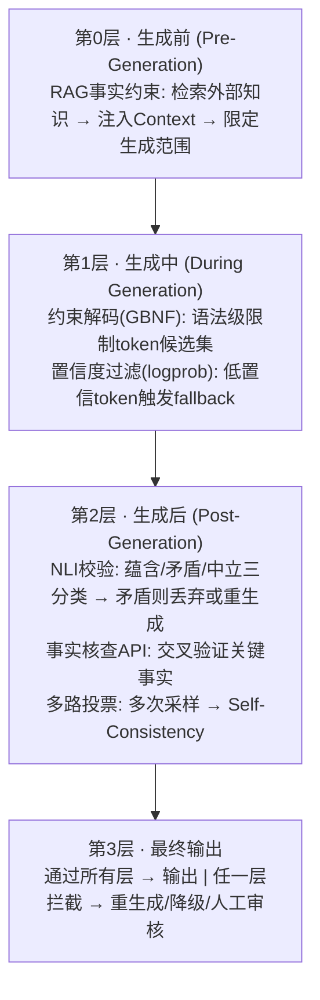

# 【字节面经】除了在 Prompt 中加约束，还有哪些工程手段可以在生成阶段降低模型幻觉？

## 一、问题本质：为什么单靠 Prompt 约束不够

Prompt 约束（如"请基于已知事实回答"、"不知道就说不知道"）本质上是**软引导**——它改变了输出的概率分布，但无法从机制上阻止模型在参数化知识不足时"编造"合理但错误的内容。工程上需要采用**纵深防御（Defense in Depth）**策略，在生成前、生成中、生成后多层设防。



---

## 二、逐层工程手段详解

### 2.1 RAG 事实约束（生成前）

**原理**：通过外部知识库检索相关文档片段，将其注入到 Prompt 的 Context 中，让模型基于检索到的真实信息生成答案，而非依赖参数化记忆。

**核心链路**：`用户Query → 向量检索 → Top-K文档 → 注入Prompt → LLM生成`

```python
import numpy as np
from typing import List

class RAGFactualConstraint:
    """RAG事实约束：检索 + Context注入 + Faithfulness校验"""

    def __init__(self, embed_model, vector_store, llm_client):
        self.embed_model = embed_model
        self.vector_store = vector_store
        self.llm = llm_client

    def retrieve(self, query: str, top_k: int = 5) -> List[str]:
        """向量检索相关文档"""
        query_vec = self.embed_model.encode(query)
        # cosine相似度检索
        scores = [
            (doc, np.dot(query_vec, doc_vec))
            for doc, doc_vec in self.vector_store
        ]
        scores.sort(key=lambda x: -x[1])
        return [doc for doc, _ in scores[:top_k]]

    def generate_with_grounding(self, query: str) -> dict:
        """基于检索事实的约束生成"""
        docs = self.retrieve(query)
        context = "\n---\n".join(docs)

        prompt = f"""请基于以下参考资料回答问题。
要求：
1. 答案必须完全基于参考资料，不得编造
2. 如果参考资料不足以回答，请说"根据已有资料无法回答"
3. 引用来源编号

参考资料：
{context}

问题：{query}
"""
        response = self.llm.generate(prompt)

        # Faithfulness校验：检查生成内容是否忠于Context
        is_grounded = self.verify_grounding(response, context)

        return {
            "answer": response if is_grounded else None,
            "sources": docs,
            "grounded": is_grounded,
        }

    def verify_grounding(self, answer: str, context: str) -> bool:
        """校验答案是否忠于Context（基于NLI）"""
        nli_result = self.nli_check(premise=context, hypothesis=answer)
        # entailment=忠于源，contradiction=矛盾，neutral=无关
        return nli_result["label"] == "entailment"
```

**关键优化点**：
- **HyDE（Hypothetical Document Embedding）**：先让LLM生成假设答案，再用假设答案做检索，提升召回率
- **Re-ranking**：用Cross-Encoder对初检结果精排，过滤噪声文档
- **Context Window控制**：控制注入文档数量，避免Context过长导致"中间遗忘"

### 2.2 约束解码 GBNF（生成中）

**原理**：在解码阶段直接修改token采样逻辑，只允许符合预定义语法规则的token被选中。GBNF（GGML BNF）是llama.cpp使用的语法描述格式，可限制输出为JSON、正则模式等。

```
普通解码: softmax(logits) → 从全部词表采样
约束解码: softmax(logits) → mask(符合语法的token) → 从候选集采样
```

```python
# === llama.cpp + GBNF 约束解码示例 ===

# 1. 定义GBNF语法（限制输出为事实陈述，禁止推测性表述）
gbnf_grammar = r"""
root ::= answer
answer ::= "根据资料，" fact_statement
fact_statement ::= [^\n]+ "\n" source
source ::= "来源：" [0-9]+ ("，" [0-9]+)*
"""

# 2. 加载模型并启用约束解码
from llama_cpp import Llama

llm = Llama(model_path="model.gguf")

def constrained_generate(prompt: str, grammar: str, max_tokens: int = 256):
    """GBNF约束解码：确保输出符合语法规范"""
    response = llm(
        prompt,
        grammar=grammar,         # 关键：传入GBNF语法
        max_tokens=max_tokens,
        temperature=0.3,         # 降低温度减少随机性
        top_p=0.9,
    )
    return response["choices"][0]["text"]


# === Outlines (Python库) 约束解码示例 ===
import outlines

model = outlines.models.transformers("meta-llama/Llama-2-7b-chat-hf")

# 约束输出为布尔判断（仅 yes/no）
@outlines.generate.choice(model, ["yes", "no"])
def fact_check(prompt: str) -> str:
    ...

# 约束输出为正则匹配的字符串
@outlines.generate.regex(model, r"\d{4}-\d{2}-\d{2}")
def extract_date(prompt: str) -> str:
    ...
```

**约束解码对幻觉的作用**：虽然GBNF主要约束**格式**，但可以通过设计语法来限制输出空间。例如限定模型只能从知识库中提取的实体列表中选择，实现"词表级事实约束"。

### 2.3 置信度 LogProb 过滤（生成中）

**原理**：LLM在每个token位置输出logits，经softmax得到各token概率。当模型对生成内容"不确定"时（低logprob），大概率是在编造——可用置信度阈值过滤。

```python
import math
from typing import List

class LogProbFilter:
    """基于token级logprob的置信度过滤"""

    def __init__(self, threshold: float = -1.0, min_avg_prob: float = 0.6):
        self.threshold = threshold       # 单token的logprob阈值
        self.min_avg_prob = min_avg_prob  # 整句平均概率阈值

    def analyze_confidence(self, logprobs: List[dict]) -> dict:
        """分析生成内容的置信度"""
        token_logprobs = [t["logprob"] for t in logprobs]

        # 转换为概率
        token_probs = [math.exp(lp) for lp in token_logprobs]
        avg_prob = sum(token_probs) / len(token_probs)

        # 找出低置信token
        low_confidence_tokens = [
            {"token": t["token"], "logprob": t["logprob"]}
            for t in logprobs
            if t["logprob"] < self.threshold
        ]

        return {
            "avg_probability": avg_prob,
            "low_confidence_count": len(low_confidence_tokens),
            "low_confidence_tokens": low_confidence_tokens,
            "is_reliable": avg_prob >= self.min_avg_prob
                           and len(low_confidence_tokens) == 0,
        }

    def generate_with_filter(self, prompt: str, llm_client) -> str | None:
        """带置信度过滤的生成"""
        response = llm_client.generate(
            prompt, logprobs=True, top_logprobs=5
        )

        analysis = self.analyze_confidence(response.logprobs)

        if not analysis["is_reliable"]:
            print(f"[WARN] 低置信度输出, avg_prob={analysis['avg_probability']:.2f}")
            # 策略1: 拒绝输出，请求用户澄清
            # 策略2: 标注不确定的部分
            # 策略3: 触发RAG补充知识后重生成
            return None

        return response.text
```

### 2.4 多路生成 + 交叉验证 / Self-Consistency（生成中/后）

**原理**：同一问题用不同温度参数多次采样，如果多条生成路径产生一致结论，则该结论更可信；如果分歧大，说明模型不确定，可能存在幻觉。

```python
from collections import Counter
from typing import List

class MultiPathCrossValidation:
    """多路生成 + 交叉验证"""

    def __init__(self, llm_client, n_samples: int = 5):
        self.llm = llm_client
        self.n_samples = n_samples

    def multi_sample(self, prompt: str) -> List[str]:
        """高温多样采样"""
        samples = []
        for i in range(self.n_samples):
            # 交替使用不同温度增加多样性
            temp = 0.3 + 0.15 * i  # 0.3, 0.45, 0.6, 0.75, 0.9
            resp = self.llm.generate(prompt, temperature=temp)
            samples.append(resp.strip())
        return samples

    def cross_validate(self, samples: List[str]) -> dict:
        """交叉验证：提取答案 + 投票"""

        # Step1: 用LLM从每个采样中提取核心答案
        extracted = []
        for sample in samples:
            answer = self.llm.generate(
                f"从以下文本中提取核心结论（一句话）：\n{sample}\n核心结论："
            )
            extracted.append(answer.strip())

        # Step2: 语义聚类（相同含义归为一类）
        clusters = self.semantic_cluster(extracted)

        # Step3: 投票
        votes = Counter()
        for cluster_id, members in clusters.items():
            votes[cluster_id] = len(members)

        best_cluster = votes.most_common(1)[0]
        consensus = clusters[best_cluster[0]][0]  # 取代表答案
        agreement = best_cluster[1] / len(samples)

        return {
            "consensus_answer": consensus,
            "agreement_ratio": agreement,
            "is_consistent": agreement >= 0.6,  # 60%以上一致才可信
            "all_samples": samples,
        }

    def semantic_cluster(self, texts: List[str]) -> dict:
        """基于语义相似度聚类"""
        embeddings = self.llm.encode(texts)
        clusters = {}
        cluster_id = 0
        for i, emb in enumerate(embeddings):
            # 寻找最近的已有簇
            assigned = False
            for cid, members in clusters.items():
                center = members["center"]
                sim = cosine_similarity(emb, center)
                if sim > 0.85:  # 语义相似阈值
                    members["items"].append(texts[i])
                    assigned = True
                    break
            if not assigned:
                clusters[cluster_id] = {"center": emb, "items": [texts[i]]}
                cluster_id += 1
        return {k: v["items"] for k, v in clusters.items()}
```

### 2.5 后处理 NLI 校验（生成后）

**原理**：自然语言推理（NLI）模型判断生成文本（hypothesis）与参考资料（premise）之间的关系：**蕴含（entailment）**=有据可依；**矛盾（contradiction）**=幻觉；**中立（neutral）**=无法判定。

```python
from transformers import pipeline

class NLIVerifier:
    """NLI后处理校验器"""

    def __init__(self):
        # 使用专门的NLI模型
        self.nli = pipeline(
            "text-classification",
            model="MoritzLaurer/DeBERTa-v3-base-MNLI-FEVER",
        )

    def verify_claim(self, claim: str, evidence: str) -> dict:
        """验证单个陈述是否有证据支撑"""
        result = self.nli(
            f"{evidence} [SEP] {claim}",
            top_k=3,  # 返回所有三类的概率
        )

        scores = {r["label"].lower(): r["score"] for r in result}

        if scores.get("entailment", 0) > 0.7:
            verdict = "verified"        # 有据可依
        elif scores.get("contradiction", 0) > 0.5:
            verdict = "hallucination"   # 幻觉
        else:
            verdict = "uncertain"       # 无法判定

        return {
            "claim": claim,
            "verdict": verdict,
            "scores": scores,
        }

    def verify_response(self, response: str, context: str) -> dict:
        """分句校验整个响应"""
        claims = self.split_claims(response)  # 分句
        results = [self.verify_claim(c, context) for c in claims]

        hallucination_count = sum(
            1 for r in results if r["verdict"] == "hallucination"
        )

        return {
            "total_claims": len(claims),
            "verified": sum(1 for r in results if r["verdict"] == "verified"),
            "hallucinations": hallucination_count,
            "is_safe": hallucination_count == 0,
            "details": results,
        }
```

### 2.6 完整多层防御管线

```python
class AntiHallucinationPipeline:
    """多层防幻觉管线：RAG → 约束解码 → NLI校验 → 多路投票 → 置信度过滤"""

    def __init__(self, rag, constrained_llm, nli_verifier, logprob_filter):
        self.rag = rag
        self.llm = constrained_llm
        self.nli = nli_verifier
        self.logprob_filter = logprob_filter

    def run(self, query: str, max_retries: int = 2) -> dict:
        for attempt in range(max_retries + 1):
            result = self._single_pass(query)
            if result["passed"]:
                return result
            print(f"[Attempt {attempt+1}] 校验失败，重试...")

        # 所有重试失败 → 降级策略
        return {
            "answer": "抱歉，无法生成可靠回答。",
            "degraded": True,
            "reason": result.get("failure_reason"),
        }

    def _single_pass(self, query: str) -> dict:
        # Layer 0: RAG检索事实
        rag_result = self.rag.generate_with_grounding(query)
        context = "\n".join(rag_result["sources"])

        # Layer 1: 约束解码 + 置信度过滤
        prompt = self._build_prompt(query, context)
        raw_output, logprobs = self.llm.generate_with_logprobs(prompt)

        confidence = self.logprob_filter.analyze_confidence(logprobs)
        if not confidence["is_reliable"]:
            return {"passed": False, "failure_reason": "low_confidence"}

        # Layer 2: NLI校验
        nli_result = self.nli.verify_response(raw_output, context)
        if not nli_result["is_safe"]:
            return {"passed": False, "failure_reason": "nli_failed"}

        return {
            "passed": True,
            "answer": raw_output,
            "confidence": confidence["avg_probability"],
            "nli_report": nli_result,
            "sources": rag_result["sources"],
        }
```

---

## 三、各手段对比总结

| 手段 | 防御层 | 实现复杂度 | 幻觉降低效果 | 延迟开销 | 适用场景 |
|------|--------|-----------|-------------|---------|---------|
| **RAG事实约束** | 生成前 | 中 | ★★★★ | +200-500ms (检索) | 知识密集型QA |
| **约束解码GBNF** | 生成中 | 中 | ★★★ (格式) | +5-15% 延迟 | 格式约束/实体限制 |
| **LogProb过滤** | 生成中 | 低 | ★★★ | 极小 | 高可靠性场景 |
| **NLI后处理校验** | 生成后 | 中 | ★★★★ | +50-100ms | 事实核查 |
| **多路投票** | 生成中/后 | 高 | ★★★★ | N倍生成延迟 | 数学推理/事实QA |

---

## 四、面试回答要点总结

> **一句话回答**：降低幻觉不能只靠Prompt，需要在**生成前用RAG提供事实依据、生成中用约束解码限制输出空间和置信度过滤拦截低质量输出、生成后用NLI校验和多路投票交叉验证**，构建纵深防御体系。

**关键加分点**：
1. 强调"纵深防御"的工程思维——没有银弹，多层兜底
2. 能说出NLI的具体模型（DeBERTa-MNLI-FEVER）和判断逻辑
3. 提到Self-Consistency（CoT多路投票）在数学/推理任务中的效果
4. 了解logprob阈值设置的经验值和trade-off（精度vs召回）
5. 知道约束解码对格式幻觉有效但对内容幻觉效果有限，需要配合RAG

## 记忆要点

- 本质：Prompt是软引导，防幻觉需多层工程上的纵深防御。
- 生成前：RAG事实约束，检索外部知识注入Context限定范围。
- 生成中：约束解码限制候选Token，结合置信度过滤低概率词。
- 生成后：NLI蕴含矛盾校验，交叉验证事实，结合多次采样投票。

## 苏格拉底式面试追问

> 这组追问模拟面试官层层逼问，每一问先回答"为什么"，再回答"怎么做"，最后回答"如何证明"。

### 第一层：目标与动机

**Q：你把降幻觉拆成"生成前 RAG、生成中约束解码、生成后 NLI 校验"三道防线。为什么不只做最强的一道（如只用 RAG），省得链路复杂？**

单道防线不够。RAG（生成前）能提供事实，但 LLM 可能"看到事实仍编造"（如事实在 prompt 前部、答案在后期生成时被覆盖，lost-in-the-middle），或检索召回了错事实导致 LLM 基于错事实生成。约束解码（生成中）限制输出格式（如 JSON、枚举值），但限制不了"事实对错"——可以约束输出是"是/否"，但约束不了答案该是"是"还是"否"。NLI 校验（生成后）能兜底，但校验模型本身可能误判。三道防线互补：RAG 解决"事实来源"、约束解码解决"输出可控"、NLI 解决"事实一致性"，单道都有盲区，组合才稳。

### 第二层：证据与定位

**Q：用户反馈"答案有幻觉"，你怎么定位是检索没召回（事实缺失）、检索召回了但 LLM 没用（lost-in-the-middle）、还是 LLM 编造（无中生有）？**

三步定位。一是看检索结果——RAG 召回的 top-K 文档里有没有正确事实，没有就是检索问题（embedding 差/query 差），有则进入第二步。二是看 LLM 的 prompt 和生成——把召回文档和 LLM 输入拼起来看，文档在哪个位置（开头/中间/结尾），正确事实是否在 prompt 里，如果在但 LLM 答错了，是 lost-in-the-middle（prompt 太长或事实位置差）；如果事实在 prompt 里且 LLM 明确引用了但改错了，是生成错误。三是看生成内容——LLM 的答案在召回文档里完全找不到对应（无中生有的实体/数字），是 LLM 编造。每类问题治法不同：检索问题改 embedding/加 rerank，lost-in-the-middle 调文档顺序/缩短 prompt，编造加强约束解码。

### 第三层：根因深挖

**Q：LLM 在 prompt 有正确事实时仍编造，根因是什么？是训练数据污染还是 attention 机制缺陷？**

根因是 LLM 的"生成模式"和"检索模式"冲突。LLM 训练时学的是"基于上文续写"（参数化知识），即使 prompt 给了事实，生成时模型仍会混合参数化知识（训练时学的）和上下文知识（prompt 给的），当两者冲突时（prompt 事实和参数化知识不一致），模型倾向信任参数化知识（训练时强化更久），导致"看到事实仍编造"。这叫"知识冲突幻觉"。另一个根因是 attention 稀释——prompt 长时，attention 权重分散，关键事实的 attention 权重低（lost-in-the-middle），生成时"看不到"事实。

**Q：那为什么不直接用"封闭域生成"（只允许 LLM 从召回文档里抽取，禁止自由生成），从根本上杜绝编造？**

封闭域生成（如 extractive QA、只输出文档原文片段）确实能杜绝编造，但牺牲了"综合和推理"能力。很多场景需要 LLM 综合多个文档、做推理（如"对比 A 和 B 产品优劣"），纯抽取做不到。且封闭域生成对检索质量要求极高——如果召回文档不全，LLM 无法补充，答案不完整。折中方案是"约束生成 + 引用强制"——允许 LLM 改写和综合，但强制每个事实点标注引用（如 `[doc1]`），后处理校验引用是否真实存在、答案是否能被引用文档支持（NLI 校验）。这样保留综合能力又约束编造。

### 第四层：方案权衡

**Q：生成后 NLI 校验，你用什么模型做校验？为什么不直接用同一个 LLM 自我校验（让它自己检查答案对不对）？**

同一个 LLM 自我校验不可靠。LLM 对自己生成的错误有"确认偏误"——生成时犯的错，自我审查时仍会犯（尤其是参数化知识导致的幻觉，模型"真心认为"自己是对的）。用独立的 NLI 模型（如 DeBERTa-v3 fine-tune 的 MNLI-FEVER，判断"前提（文档）是否蕴含假设（答案）"），独立于生成模型，没有确认偏误。NLI 模型可以是小模型（几百 M），专门做"前提-假设"一致性判断，精度高且成本低。对高要求场景，NLI 模型 + 人工复核兜底。自我校验可作为"第一道粗筛"（成本低），NLI 作为"第二道精校"。

**Q：为什么不直接微调 LLM 让它"不编造"（如 RLHF 训练诚实性），省得做后处理？**

微调能降低幻觉但无法消除。RLHF 训练"诚实性"（如让模型说"我不知道"而非编造）能减少"无中生有"型幻觉，但对"事实错误"型幻觉（模型自信地答错）效果有限——因为模型的参数化知识本身可能有错（训练数据有噪声），微调难以逐一修正。且微调成本高（数据标注、训练资源），泛化性不确定（微调后在训练分布好，新领域仍可能幻觉）。工程优先级：先用 RAG + 约束解码 + NLI 校验（无需训练，快速见效）把幻觉率降到可接受，再针对高频错误场景做微调进一步优化。微调是"锦上添花"，不是"救命稻草"。

### 第五层：验证与沉淀

**Q：你怎么证明降幻觉方案有效，幻觉率从多少降到多少？怎么量化？**

定义幻觉率指标：用"事实一致性"自动评估（如用 NLI 模型判断答案是否被召回文档支持，contradiction 即幻觉），在标注的 golden set 上跑，算幻觉率（不一致答案/总答案）。三道防线逐层加：基线（无防线）幻觉率如 25%，加 RAG 后 12%，加约束解码 9%，加 NLI 校验 5%。同时做人工抽检（抽 100 个答案人工标注），校准自动评估的准确率。关键是要有 golden set（人工标注"正确答案 + 是否幻觉"），否则无法量化。A/B 测试：线上对照组（无 NLI）vs 实验组（有 NLI），看用户反馈"答案错误"率是否降。

**Q：降幻觉方案怎么沉淀成团队标配？**

封装成"防幻觉中间件"：RAG 召回 + rerank（强制 top-K 包含相关事实）、prompt 模板（事实前置 + 引用强制）、约束解码配置（JSON Schema/枚举白名单）、NLI 校验服务（答案 + 文档 → 一致性分数，低于阈值拦截或重生成）。沉淀"各场景的防线配置"（如客服场景 RAG + NLI 强校验、创意场景弱校验）、"golden set 构建规范"、"幻觉率监控看板"。把"降幻觉"作为 RAG 系统的默认能力，而非可选项，新业务接入即获得基础防幻觉。

## 结构化回答

**30 秒电梯演讲：** 降低幻觉的工程手段包括：RAG事实约束、约束解码、后处理校验、多路生成交叉验证——就像新闻编辑。

**展开框架：**
1. **RAG** — 提供事实依据约束生成
2. **约束解码** — 限制token候选(上下文约束)
3. **后处理** — NLI校验/事实核查API

**收尾：** 您想深入聊：NLI校验的具体实现？


## 视频脚本

> 预计时长：5 分钟 | 由浅入深


| 时间 | 画面/字幕 | 口播台词 | 讲解要点 |
|------|----------|----------|----------|
| 0:00 | 标题卡：除了在 Prompt 中加约束，还有哪些工程手段… | "就像新闻编辑——不能只靠记者自觉(Prompt约束)，还要有事实核查(RAG)、编辑审稿(…" | 开场钩子 |
| 0:20 | 核心概念图 | "降低幻觉的工程手段包括：RAG事实约束、约束解码、后处理校验、多路生成交叉验证。" | 核心定义 |
| 0:50 | RAG示意图 | "RAG——提供事实依据约束生成" | 要点拆解1 |
| 1:30 | 约束解码示意图 | "约束解码——限制token候选(上下文约束)" | 要点拆解2 |
| 2:20 | 对比/实战案例图 | "对比一下常见误区和工程实践，看真实场景里怎么取舍。" | 实战与对比 |
| 3:10 | 总结卡 | "记住核心要点。下期我们追问：NLI校验的具体实现？" | 收尾与钩子 |
