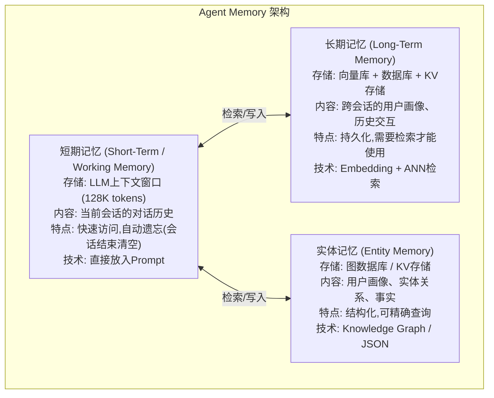

# Agent的Memory如何进行管理？存在哪些地方？

## Memory 分层架构



## 存储方案对比

| 存储类型 | 技术 | 容量 | 查询方式 | 生命周期 | 适用场景 |
|---------|------|------|---------|---------|---------|
| 上下文窗口 | LLM Context | 小(128K) | 直接读取 | 单会话 | 当前对话 |
| 向量库 | Milvus/Chroma | 大 | 语义检索 | 持久 | 对话历史 |
| KV存储 | Redis | 中 | 精确查询 | TTL可控 | 临时状态 |
| 关系数据库 | PostgreSQL | 大 | SQL查询 | 持久 | 结构化数据 |
| 图数据库 | Neo4j | 大 | 图遍历 | 持久 | 实体关系 |
| 文件系统 | JSON/文件 | 大 | 文件读取 | 持久 | 配置/知识 |

## 代码实现

```python
from datetime import datetime
from typing import Optional
import json

class AgentMemory:
    """完整的Agent记忆管理系统"""
    
    def __init__(self, user_id: str):
        self.user_id = user_id
        
        # 短期记忆: 当前会话
        self.short_term: list[dict] = []
        
        # 长期记忆: 向量库 (对话历史)
        self.long_term_store = ChromaStore(collection="conversations")
        
        # 实体记忆: 用户画像 (Redis/JSON)
        self.entity_store = RedisStore(namespace=f"user:{user_id}")
        
        # 摘要记忆: 定期压缩的历史
        self.summary_store = KVStore(namespace=f"summary:{user_id}")
    
    # ===== 短期记忆管理 =====
    
    def add_to_short_term(self, role: str, content: str):
        """添加到短期记忆"""
        self.short_term.append({
            "role": role,
            "content": content,
            "timestamp": datetime.now().isoformat()
        })
        
        # 检查是否需要压缩
        if self._estimate_tokens() > 80000:  # 80K阈值
            self._compress_short_term()
    
    def _compress_short_term(self):
        """压缩短期记忆"""
        # 保留最近10轮
        recent = self.short_term[-20:]
        old = self.short_term[:-20]
        
        if old:
            # 生成摘要
            summary = self._generate_summary(old)
            self.summary_store.set("latest_summary", summary)
            
            # 同时存入长期记忆
            for msg in old:
                self._store_long_term(msg)
        
        self.short_term = [{"role": "system", "content": f"历史摘要: {summary}"}] + recent
    
    # ===== 长期记忆管理 =====
    
    def _store_long_term(self, message: dict):
        """存入长期向量记忆"""
        self.long_term_store.add(
            documents=[message["content"]],
            metadatas=[{
                "user_id": self.user_id,
                "role": message["role"],
                "timestamp": message["timestamp"]
            }],
            ids=[f"msg_{hash(message['content'])}"]
        )
    
    def retrieve_long_term(self, query: str, top_k: int = 5) -> list:
        """从长期记忆检索相关内容"""
        results = self.long_term_store.query(
            query_texts=[query],
            n_results=top_k,
            where={"user_id": self.user_id}
        )
        return results
    
    # ===== 实体记忆管理 =====
    
    def update_entity(self, entity_type: str, key: str, value: str):
        """更新实体记忆(用户画像)"""
        entities = self.entity_store.get_json("entities") or {}
        if entity_type not in entities:
            entities[entity_type] = {}
        entities[entity_type][key] = {
            "value": value,
            "updated_at": datetime.now().isoformat()
        }
        self.entity_store.set_json("entities", entities)
    
    def get_entity(self, entity_type: str, key: str) -> Optional[str]:
        """获取实体记忆"""
        entities = self.entity_store.get_json("entities") or {}
        return entities.get(entity_type, {}).get(key, {}).get("value")
    
    # ===== 上下文构建 =====
    
    def build_context(self, current_query: str) -> str:
        """构建喂给LLM的完整上下文"""
        parts = []
        
        # 1. 实体记忆 (最稳定)
        entities = self.entity_store.get_json("entities") or {}
        if entities:
            parts.append(f"【用户画像】: {json.dumps(entities, ensure_ascii=False)}")
        
        # 2. 历史摘要
        summary = self.summary_store.get("latest_summary")
        if summary:
            parts.append(f"【历史摘要】: {summary}")
        
        # 3. 检索长期记忆中与当前query相关的内容
        relevant = self.retrieve_long_term(current_query, top_k=3)
        if relevant:
            parts.append(f"【相关历史】: {format_results(relevant)}")
        
        # 4. 短期记忆 (最近对话)
        recent = self.short_term[-20:]
        if recent:
            parts.append(f"【最近对话】: {format_messages(recent)}")
        
        return '\n\n'.join(parts)
    
    # ===== 实体自动提取 =====
    
    def _extract_entities(self, message: str):
        """自动从对话中提取实体更新画像"""
        entities_prompt = f"""
从以下用户消息中提取关键信息:
消息: "{message}"

提取格式:
- 姓名/称呼: 
- 偏好/喜好: 
- 职业: 
- 约束/要求: 
(如果没有则留空)
"""
        result = llm.generate(entities_prompt)
        parsed = parse_entities(result)
        
        for entity_type, value in parsed.items():
            if value:
                self.update_entity(entity_type, "latest", value)
```

## Memory vs RAG 的区别

| 维度 | Memory | RAG |
|------|--------|-----|
| 数据来源 | Agent自身的交互历史 | 外部知识库 |
| 更新方式 | 实时写入 | 批量导入 |
| 检索目的 | "之前说过什么" | "知识库里有什么" |
| 生命周期 | 随交互动态更新 | 相对静态 |
| 隐私性 | 用户私有 | 共享知识 |
| 存储结构 | 时序+语义 | 纯语义 |

## 工程实践要点

1. **记忆淘汰策略**: 不是所有信息都值得记住，需要信息价值评估
2. **隐私保护**: 敏感信息加密存储，支持用户"忘记我"
3. **一致性**: 多个记忆层之间的信息不能矛盾
4. **性能**: 长期记忆检索延迟应 < 100ms，用缓存优化
5. **可观测性**: 记忆读写日志可追踪，便于调试

## 记忆要点

- 分层架构：短期记忆放上下文窗口，长期记忆靠向量库持久化。
- 向量检索：长期记忆通过Embedding和ANN检索历史交互。
- 实体记忆：用图或KV数据库存储结构化的用户画像与实体关系。
- 压缩策略：上下文满载时用摘要压缩或时间衰减机制清理低价值信息。

## 苏格拉底式面试追问

> 这组追问模拟面试官层层逼问，每一问先回答"为什么"，再回答"怎么做"，最后回答"如何证明"。

### 第一层：目标与动机

**Q：Agent 记忆你分"短期（上下文窗口）+ 长期（向量库）+ 实体（KV/图）"三层。为什么不只用一层（如全放向量库），省得维护三层架构？**

各层解决不同问题。短期记忆（上下文窗口）解决"当前对话的连贯性"——最近几轮的原文在窗口里，Agent 能精确引用（如"你刚才说的 X"），延迟为零（不需要检索）。长期记忆（向量库）解决"跨对话的历史回忆"——上周的对话存向量库，当前 query 检索召回，但需要 embedding + ANN（延迟 50-100ms）且有召回噪声。实体记忆（KV/图）解决"结构化关键信息"——用户画像、订单状态、实体关系，用精确查询（如 `get_user_preference(user_id)`）而非模糊检索，零噪声。三层互补：短期保连贯、长期保回忆、实体保精准。只放向量库的问题是"短期对话也要检索"（延迟高、可能召回不准）、"结构化信息靠模糊检索"（如查订单状态用向量检索，不如 SQL 精确）。

### 第二层：证据与定位

**Q：用户反馈"Agent 记错了我的信息"（如把用户的订单号搞混）。你怎么定位是实体记忆存错、检索召回了别人的记忆、还是 LLM 生成时编造？**

看各层数据。一是实体记忆——查 KV/图数据库里该用户的实体是否正确（如 `get_order(user_id)` 返回的订单号对不对），如果存错了是写入逻辑 bug（如写入了别人的订单）或更新不及时；二是长期记忆检索——当前 query 检索向量库时，是否召回了其他用户的记忆（user_id 没做过滤，跨用户串数据），检查召回结果的 user_id 字段；三是 LLM 生成——实体和检索都对，但 LLM 生成时"记错"（上下文里是 A，输出成 B），这是 LLM 的幻觉或 attention 问题。治法：实体存错修写入逻辑 + 加一致性校验；检索串数据加 user_id 过滤（向量库的 metadata filter）；LLM 编造加强 prompt 约束（"严格基于检索结果回答"）。

### 第三层：根因深挖

**Q：长期记忆检索经常召回"无关"的历史对话（如用户问订单，召回了上周的闲聊）。根因是什么？**

根因是"embedding 语义匹配不精准"或"缺乏时间/相关性衰减"。embedding 基于语义相似度，但"语义相似"不等于"当前有用"——如用户问"订单状态"，上周的"我下了个订单"语义相似（都涉及订单）但无用（不包含状态信息）。另一个原因是"没有时间衰减"——所有历史记忆的检索权重相同，很久以前的记忆和最近的记忆平等竞争，旧记忆可能"语义巧合"排在前面。治本：一是检索后 rerank（用 cross-encoder 或 LLM 判断"这条记忆对当前 query 有用吗"，过滤无关的）；二是加时间衰减因子（最近的记忆权重高，如 `score × exp(-Δt/τ)`，τ 是时间常数）；三是实体记忆优先（先查结构化实体，向量检索补充）。

**Q：那为什么不直接把所有历史对话都存进 LLM 的上下文（不做长期记忆检索），让 LLM 自己判断哪些有用？**

上下文窗口装不下且质量差。一个用户用了一个月可能有几百轮对话，几十万 token，不可能全塞进上下文（即使 128k 窗口也满）。且 lost-in-the-middle——LLM 对超长上下文的中间信息注意力弱，塞进去也"看不到"。长期记忆检索的价值是"预筛选"——先从海量历史中召回 top-K 最相关的（几十条），只把这 K 条塞进上下文，LLM 在小上下文里高效处理。检索是"用 ANN 的速度换 LLM 的注意力质量"——ANN 毫秒级筛几万条，LLM 只处理精筛的几十条。全塞进去是"让 LLM 在垃圾堆里找东西"，效率和质量都差。

### 第四层：方案权衡

**Q：实体记忆你用 KV 数据库（如 Redis）。为什么不直接用知识图谱（KG）存实体关系，表达力更强？**

KG 表达力强但运维重。KG 能存复杂关系（如"用户 A 的订单 B 包含商品 C，C 的供应商是 D"），支持图查询（如"查所有买过 C 的用户"）。但 KG 的写入和查询复杂（要定义 ontology、维护关系一致性），适合"关系密集"场景（如知识问答、推荐）。Agent 的实体记忆多数是"简单键值"（如用户偏好、订单状态、对话进度），用 KV 库（Redis）足够，读写快（微秒级）、运维简单。只有当 Agent 需要复杂推理（如"基于用户的历史购买推断偏好"）时才上 KG。选型看场景——简单状态用 KV，复杂关系用 KG。也可以混合：KV 存高频读写状态，KG 存静态知识（如产品目录），Agent 按需查询。

**Q：为什么不直接用 LLM 自己管理记忆（让它决定记什么、忘什么），省得写压缩/衰减逻辑？**

LLM 自管理不可靠且贵。让 LLM 判断"这条信息要不要记住"需要额外调用（每轮多一次 LLM 推理，延迟和成本翻倍），且 LLM 的判断不稳定（可能记住无用信息、忘记关键信息）。更关键的是"记忆的存取"需要结构化（按 user_id 存、按 query 取），LLM 不擅长结构化操作（它擅长生成文本，不擅长数据库管理）。正确做法是"规则 + LLM 混合"——规则管结构化（如每轮自动存进向量库、按 user_id 索引），LLM 管"摘要和重要性判断"（如把长对话摘要成关键点存实体库）。规则保证可靠性，LLM 提供智能摘要，各司其职。

### 第五层：验证与沉淀

**Q：你怎么衡量 Agent 记忆系统的效果，证明三层架构比单层好？**

定义指标：一是记忆准确率（memory_accuracy）——Agent 引用历史信息时是否正确（用 golden set 测，如"用户第 1 轮说了 X，第 10 轮 Agent 是否正确引用 X"）；二是记忆召回率（memory_recall）——该回忆的信息是否回忆了（漏回忆导致重复提问）；三是响应延迟（记忆检索的耗时，P99 <100ms）；四是记忆存储成本（向量库/KV 库的存储量）。做消融实验：只用短期（窗口截断）vs 加长期（向量检索）vs 三层全开，对比 memory_accuracy 和 task_success_rate。关键测试：构造"跨对话记忆"场景（如"上周你建议我用方法 A，现在还有效吗"），看 Agent 能否回忆上周的建议。A/B 测试看用户满意度（CSAT）和重复提问率。

**Q：Agent 记忆系统怎么沉淀成框架标配？**

封装成"记忆管理器"：统一接口（`remember(event)`、`recall(query, user_id)`、`get_entity(user_id, key)`），内部自动路由到短期/长期/实体存储。沉淀"各场景的记忆配置"（客服用实体 + 短期、陪伴用长期 + 摘要、代码助手用长期 + 检索）、"摘要 prompt 模板"、"时间衰减参数经验值"（τ 根据场景调）、"rerank 策略"。配套监控（记忆准确率、检索延迟、存储量），异常（准确率降/存储爆）告警。把"分层记忆"作为 Agent 的核心能力，开发者只管调用 `remember`/`recall`，记忆管理由框架保证。

## 结构化回答

**30 秒电梯演讲：** Agent的Memory分为短期记忆(上下文窗口)和长期记忆(外部存储)，通过分层架构在有限资源内最大化信息保留——就像人脑。

**展开框架：**
1. **短期记忆** — 对话历史，存在上下文窗口中，生命周期=单次会话
2. **长期记忆** — 向量库/数据库存储，跨会话持久化
3. **工作记忆** — 从长期记忆中检索出的当前相关上下文

**收尾：** 您想深入聊：Memory和RAG有什么区别？


## 视频脚本

> 预计时长：4 分钟 | 由浅入深


| 时间 | 画面/字幕 | 口播台词 | 讲解要点 |
|------|----------|----------|----------|
| 0:00 | 标题卡：Agent的Memory如何进行管理？存在哪些地… | "就像人脑——短期记忆是"现在正在想的事"(工作记忆, 容量小但快)，长期记忆是"过去的经历…" | 开场钩子 |
| 0:20 | 核心概念图 | "Agent的Memory分为短期记忆(上下文窗口)和长期记忆(外部存储)，通过分层架构在有限资源内最大化信息保留" | 核心定义 |
| 0:50 | 短期记忆示意图 | "短期记忆——对话历史，存在上下文窗口中，生命周期=单次会话" | 要点拆解1 |
| 1:30 | 对比/实战案例图 | "对比一下常见误区和工程实践，看真实场景里怎么取舍。" | 实战与对比 |
| 2:20 | 总结卡 | "记住核心要点。下期我们追问：Memory和RAG有什么区别？" | 收尾与钩子 |
