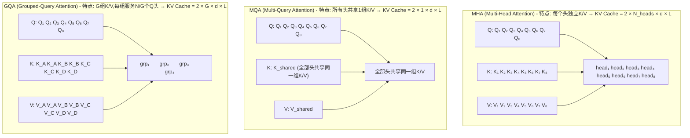

# 请对比MHA、MQA、GQA三种注意力机制的区别

> 来源：字节跳动大模型技术面试二面

## 架构图解



## Trade-off 对比

| 维度 | MHA | GQA (G=8) | MQA |
|------|-----|-----------|-----|
| KV头数 | N (如32) | G (如8) | 1 |
| KV Cache大小 | 1× (基准) | ~1/4 | ~1/32 |
| 推理速度 | 慢 | 快 | 最快 |
| 模型效果 | **最好** | **接近MHA** | 明显下降 |
| 显存占用 | 最高 | 低 | 最低 |
| 代表模型 | GPT-3, BERT | LLaMA-2-70B | PaLM, Falcon |

### KV Cache 影响量化

以 LLaMA-2-70B 为例（80层, 64头, d=128, 序列长度4096）：

```
MHA:  KV Cache = 2 × 80 × 64 × 128 × 4096 × 2(fp16) ≈ 21 GB
GQA:  KV Cache = 2 × 80 ×  8 × 128 × 4096 × 2(fp16) ≈ 2.6 GB  (↓87%)
MQA:  KV Cache = 2 × 80 ×  1 × 128 × 4096 × 2(fp16) ≈ 0.33 GB (↓98%)
```

**在长序列推理场景（如32K context），KV Cache差异可达数十GB**，直接决定能否在单卡上运行。

## 代码实现对比

```python
import torch
import torch.nn as nn

class MultiHeadAttention(nn.Module):
    """标准MHA: N个独立的Q/K/V头"""
    def __init__(self, d_model, n_heads):
        super().__init__()
        self.n_heads = n_heads
        self.d_k = d_model // n_heads
        self.W_q = nn.Linear(d_model, d_model)  # d_model = n_heads × d_k
        self.W_k = nn.Linear(d_model, d_model)
        self.W_v = nn.Linear(d_model, d_model)

class GroupedQueryAttention(nn.Module):
    """GQA: N个Q头, G组K/V (G ≤ N)"""
    def __init__(self, d_model, n_heads, n_kv_heads):
        super().__init__()
        self.n_heads = n_heads          # Q头数 (如32)
        self.n_kv_heads = n_kv_heads    # K/V头数 (如8)
        self.n_rep = n_heads // n_kv_heads  # 每组K/V服务的Q头数 (如4)
        self.d_k = d_model // n_heads
        
        # Q投影: 输出 n_heads × d_k
        self.W_q = nn.Linear(d_model, n_heads * self.d_k)
        # K/V投影: 只输出 n_kv_heads × d_k (参数量更少!)
        self.W_k = nn.Linear(d_model, n_kv_heads * self.d_k)
        self.W_v = nn.Linear(d_model, n_kv_heads * self.d_k)
    
    def forward(self, x):
        B, L, _ = x.shape
        q = self.W_q(x).view(B, L, self.n_heads, self.d_k)
        k = self.W_k(x).view(B, L, self.n_kv_heads, self.d_k)
        v = self.W_v(x).view(B, L, self.n_kv_heads, self.d_k)
        
        # ★ 关键: 将K/V重复扩展到与Q相同的头数
        k = k.repeat_interleave(self.n_rep, dim=1)  # (B, L, n_heads, d_k)
        v = v.repeat_interleave(self.n_rep, dim=1)
        
        # 后续attention计算与MHA相同
        scores = torch.matmul(q, k.transpose(-2, -1)) / (self.d_k ** 0.5)
        # ... softmax, matmul with V
```

## 为什么GQA效果接近MHA？

**关键洞察**：不同注意力头的K/V投影矩阵存在高度相似性。研究表明，MHA中约60-80%的头的K/V表示是冗余的。GQA通过分组共享，恰好去除了这些冗余，同时保持了Query端的多样性。

```
MHA头间K/V相似度矩阵 (LLaMA-2实验):
     H1   H2   H3   H4   H5   H6
H1 [ 1.0  0.82 0.79 0.31 0.28 0.25 ]
H2 [ 0.82 1.0  0.85 0.33 0.30 0.27 ]  ← H1-H3高度相似
H3 [ 0.79 0.85 1.0  0.35 0.29 0.26 ]  ← 可合并为同一组
H4 [ 0.31 0.33 0.35 1.0  0.80 0.78 ]  ← H4-H6高度相似
H5 [ 0.28 0.30 0.29 0.80 1.0  0.82 ]  ← 可合并为同一组
```

## 实际应用选择

| 场景 | 推荐方案 | 原因 |
|------|---------|------|
| 追求最高精度 | MHA | 效果上限最高 |
| 通用大模型 | GQA (G=N/4) | 性价比最优，LLaMA/Qwen/DeepSeek均采用 |
| 极致推理速度 | MQA | KV Cache最小，适合边缘部署 |
| 长文本(32K+) | GQA (G=N/8) | KV Cache节省至关重要 |

**面试加分点**：提到LLaMA-2 70B使用GQA(num_kv_heads=8)而7B/13B仍用MHA；提到vLLM和TensorRT-LLM对GQA做了专门优化；提到GQA是当前开源大模型的事实标准（LLaMA-3、Qwen-2、Mistral、DeepSeek-V2等全部采用）。

## 记忆要点

- KV头数渐变缩：MHA全独立，MQA全共享，GQA分组共享折中两者。
- 显存推理两极化：MQA缓存最小最快但效果掉，MHA效果最好但显存大。
- GQA平衡成主流：按组共享K/V，显存大幅减少且效果逼近MHA，代表LLaMA-2。

## 苏格拉底式面试追问

> 这组追问模拟面试官层层逼问，每一问先回答"为什么"，再回答"怎么做"，最后回答"如何证明"。

### 第一层：目标与动机

**Q：MHA（多头独立 KV）、MQA（全共享 KV）、GQA（分组共享 KV）。为什么需要这三种？直接用 MHA（效果最好）不行吗？**

MHA 效果好但推理贵。MHA 每个头有独立的 K 和 V（如 32 个头，32 组 KV），推理时 KV Cache 存 32 份，显存占用大（长上下文时 KV Cache 比模型权重还大），且 attention 计算要对 32 组 KV 做 attention，计算量大。MQA 把 32 组 KV 共享为 1 组（所有头用同一份 KV），KV Cache 缩小 32 倍，显存和计算大幅下降，但代价是表达力下降（所有头看同样的 K/V，无法关注不同模式），模型质量降（benchmark 掉 2-5%）。GQA 是折中——把 32 个头分成 8 组（每组 4 个头），每组共享 1 份 KV（共 8 份），KV Cache 缩小 4 倍（相比 MHA），质量接近 MHA（掉 <1%）。三者的本质是"KV 头数"的渐变：32（MHA）→ 8（GQA）→ 1（MQA），在显存/速度和质量间权衡。

### 第二层：证据与定位

**Q：你把模型从 MHA 改成 GQA（省显存），推理速度快了但 benchmark 分数掉了 3%。怎么定位是 GQA 本身的精度损失、还是转换过程引入的问题？**

对照实验。一是"原版 MHA 的分数"——如果原版 MHA 是 70 分，GQA 是 67 分，这 3% 是 GQA 的固有损失（KV 共享导致表达力降）。二是"分组数的影响"——GQA 的组数越多（如 16 组而非 8 组），越接近 MHA，精度损失越小；试 GQA-16（16 组）看分数是否回到 69 分，如果是，说明组数太少（8 组）导致损失大，增加组数即可。三是"转换过程问题"——如果 GQA 是从 MHA 蒸馏/转换来的（而非从头训），转换过程可能引入误差，验证方法是"从头训 GQA"（用相同数据训一个原生 GQA 模型），如果从头训的 GQA 分数正常（如 69 分），说明转换过程有问题。3% 的损失在 GQA-8 的正常范围内（论文报告 1-3%），可通过增加训练数据/步数弥补。

### 第三层：根因深挖

**Q：GQA 的 KV 共享为什么"几乎不掉点"（只掉 1%）？按理说共享 KV 会丢失多头多样性，为什么影响这么小？**

根因是"多头 attention 的冗余性"。研究发现 MHA 的多个头高度冗余——很多头学到的 attention 模式相似（如都关注相邻 token、都关注句号），共享 KV 对这些冗余头几乎无影响。真正"独特"的头（学到特殊模式）是少数，GQA 的分组让每个组至少有一个独特的 KV（组间不共享），保留了关键多样性。本质上，MHA 的 32 组 KV 有大量信息冗余（可能 8 组就够表达 32 个头的模式），GQA 去除冗余（8 组 KV 服务 32 个头），精度损失极小但显存大幅节省。这也解释了为什么 MQA（1 组）掉点多——1 组 KV 无法覆盖所有头的多样性需求，而 GQA（8 组）足够覆盖。

**Q：那为什么不直接用更激进的方式省 KV——如低秩分解（把 KV 分解为两个小矩阵的乘积），比 GQA 省更多？**

低秩分解省更多但训练不稳定。低秩分解（如把 $d_k$ 维 KV 分解为 $d_k \times r$ 和 $r \times d_k$ 两个矩阵，$r \ll d_k$）能把 KV Cache 缩小到 $r/d_k$，比 GQA 更激进。但问题：一是表达力损失大——低秩分解强制 KV 在低维空间表达，丢失高频信息，benchmark 掉 5-10%（比 GQA 严重）；二是训练不稳定——低秩矩阵的优化困难（容易陷入鞍点），需要特殊的初始化（如 LoRA 的零初始化）和学习率调整；三是实现复杂——attention kernel 要改（标准 attention 假设 K/V 是完整的，低秩分解要定制 kernel）。GQA 的优势是"只改 KV 的共享方式，不改 KV 的维度"，attention kernel 不变（K/V 还是 $d_k$ 维，只是多个头复用），实现零成本。工程上 GQA 是"最小改动、最大收益"的方案。

### 第四层：方案权衡

**Q：Llama-2 用 GQA（8 组）。为什么选 8 组而非 4 组或 16 组？分组数怎么定？**

分组数是"质量 vs 显存"的权衡。组数越多（如 16 组），越接近 MHA，质量越高但显存节省少（只省 2 倍）；组数越少（如 4 组），越接近 MQA，显存节省多（省 8 倍）但质量降。Llama-2 选 8 组是经验值——在 7B/13B/70B 上，8 组的质量接近 MHA（掉 <1%），显存节省 4 倍（32 头共享 8 组 KV），性价比最优。分组数的确定方法：在目标 benchmark 上 sweep（4/8/16 组），选"质量下降 <1% 的最少组数"（最大化显存节省）。4 组掉 2-3%（可接受但不理想），16 组几乎不掉但省得少。8 组是"甜点"。也与 head 数有关——32 头配 8 组（每组 4 头），64 头配 16 组（每组 4 头），保持每组 4 头是经验值。

**Q：为什么不直接用 MHA + PagedAttention（显存管理优化），省得改模型架构（GQA）？**

MHA + PagedAttention 是"不改架构，优化显存管理"。PagedAttention 消除显存碎片（利用率从 40% 提到 95%），等于变相扩大可用显存，能支持更多并发。但 PagedAttention 不减少 KV Cache 的绝对大小——每个 token 的 KV 仍是 32 组（MHA），只是管理更高效。GQA 从"模型架构"层面减少 KV 组数（32 → 8），绝对大小减少 4 倍。两者不冲突，可以叠加——GQA（减少 KV 组数）+ PagedAttention（高效管理），双重省显存。选型看瓶颈——如果显存够用（小模型/短上下文），MHA + PagedAttention 够了（不改架构，质量最优）；如果显存紧张（大模型/长上下文），上 GQA（减 KV）+ PagedAttention（高效管理）。生产级长上下文场景（如 32k 上下文），两者都用。

### 第五层：验证与沉淀

**Q：你怎么衡量 GQA 相比 MHA 的"性价比"（显存节省 vs 质量损失）？**

定义指标：一是显存节省（KV Cache 大小，MHA 基线 vs GQA，如从 4GB 降到 1GB，省 75%）；二是推理速度（TTFT 和吞吐，显存小了能支持更多并发，吞吐应提升 2-3 倍）；三是质量损失（benchmark 分数，MHA vs GQA，如从 70 分到 69 分，掉 1.4%）；四是"性价比"（吞吐提升 / 质量下降，如吞吐涨 3 倍 / 质量掉 1.4% = 性价比高）。做消融实验：MHA vs GQA-4 vs GQA-8 vs GQA-16 vs MQA，在相同模型和数据上对比显存/速度/质量，画 tradeoff 曲线（Pareto 前沿）。选 Pareto 最优的（如 GQA-8 在质量-显存曲线上最优）。关键验证"质量损失是否可接受"——如果业务对质量敏感（如医疗问答），用 MHA 或 GQA-16；对成本敏感（如闲聊），用 GQA-8 或 MQA。

**Q：KV 头数选择（MHA/MQA/GQA）怎么沉淀成模型选型规范？**

固化成"模型架构选型表"：场景是"质量优先"（医疗/法律）→ MHA 或 GQA-16；场景是"均衡"（通用对话）→ GQA-8（Llama-2 主流）；场景是"极致推理效率"（高并发/边缘部署）→ MQA 或 GQA-4；场景是"长上下文"（32k+）→ GQA-8 + PagedAttention。沉淀"各分组数的显存/质量对照表"（基于 Llama-2 的实测数据）、"GQA 转换方法"（从 MHA 模型蒸馏到 GQA）。把"GQA-8 为默认，按场景调整"作为团队共识，新模型选型不必重复论证。配套监控（推理时 KV Cache 显存占用、benchmark 质量回归），确保 GQA 的质量损失在可控范围。

## 结构化回答

**30 秒电梯演讲：** MHA每个头有独立的Q/K/V，MQA所有头共享一组K/V，GQA介于两者之间——分组共享K/V——像一个公司开会。

**展开框架：**
1. **MHA** — N个Q头 + N个K/V头 → 效果最好但KV Cache最大
2. **MQA** — N个Q头 + 1个K/V头 → KV Cache最小但效果下降
3. **GQA** — N个Q头 + G个K/V头 → 效果接近MHA，KV Cache大幅减少

**收尾：** 您想深入聊：GQA中分组数G应该怎么选？


## 视频脚本

> 预计时长：4 分钟 | 由浅入深


| 时间 | 画面/字幕 | 口播台词 | 讲解要点 |
|------|----------|----------|----------|
| 0:00 | 标题卡：请对比MHA、MQA、GQA三种注意力机制的区别 | "像一个公司开会——MHA是每个部门各派翻译（贵但精准），MQA是所有人共用一个翻译（省资源…" | 开场钩子 |
| 0:20 | 核心概念图 | "MHA每个头有独立的Q/K/V，MQA所有头共享一组K/V，GQA介于两者之间——分组共享K/V" | 核心定义 |
| 0:50 | MHA示意图 | "MHA——N个Q头 + N个K/V头 → 效果最好但KV Cache最大" | 要点拆解1 |
| 1:30 | 对比/实战案例图 | "对比一下常见误区和工程实践，看真实场景里怎么取舍。" | 实战与对比 |
| 2:20 | 总结卡 | "记住核心要点。下期我们追问：GQA中分组数G应该怎么选？" | 收尾与钩子 |
