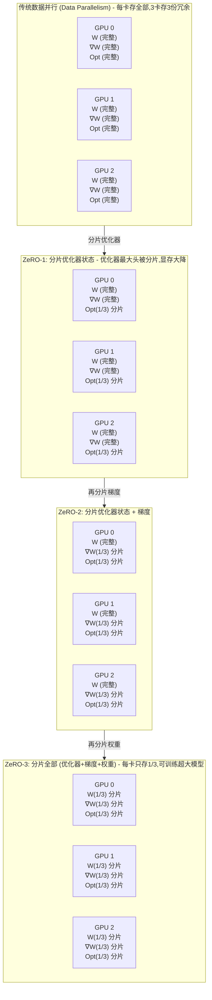

# DeepSpeed ZeRO-1、ZeRO-2和ZeRO-3分别做了哪些优化？

> 来源：字节跳动大模型技术面试二面

## 核心原理图解



## 显存节省量化（14B模型, FP16, AdamW, N=8卡）

以每参数 16 bytes 为基准（权重2B + 梯度2B + 优化器12B）：

```
┌────────────┬───────────────────┬──────────────┬────────────┐
│   策略     │  单卡显存公式      │  14B×8卡(GB) │  vs DP     │
├────────────┼───────────────────┼──────────────┼────────────┤
│ 传统DP     │ 16ψ              │   224        │  1×        │
│ ZeRO-1     │ 4ψ + 12ψ/N       │   58+21=79   │  2.8× 节省 │
│ ZeRO-2     │ 2ψ + 14ψ/N       │   28+24.5=53 │  4.2× 节省 │
│ ZeRO-3     │ 20ψ/N            │   35         │  6.4× 节省 │
└────────────┴───────────────────┴──────────────┴────────────┘

ψ = 参数量 = 14B
```

## 三级策略详解

### ZeRO-1: 优化器状态分片

```python
# 训练流程
# 1. 前向+反向传播（各卡独立，与DP相同）
# 2. 梯度AllReduce（与DP相同）
# 3. ★ 只有对应的优化器分片更新该分片的参数
# 4. 更新后的权重通过AllGather广播

# 通信开销: 与标准DP相同（一个AllReduce）
# 显存节省: 优化器从12ψ降到12ψ/N
```

### ZeRO-2: 梯度分片

```python
# 训练流程
# 1. 前向传播（各卡独立）
# 2. ★ 反向传播后，用Reduce-Scatter代替AllReduce
#    每卡只保留自己负责的梯度分片，其余丢弃
# 3. 对应优化器分片更新参数
# 4. AllGather广播更新后的权重

# 通信开销: Reduce-Scatter + AllGather ≈ AllReduce（基本持平）
# 显存节省: 优化器(12ψ/N) + 梯度(2ψ/N)
```

### ZeRO-3: 权重分片

```python
# 训练流程
# 1. ★ 前向传播前，AllGather需要的权重分片 → 用完释放
# 2. ★ 反向传播前，同样AllGather权重分片
# 3. 反向传播后，Reduce-Scatter梯度
# 4. 优化器更新

# 通信开销: 比DP多约1.5×（额外的权重AllGather）
# 显存节省: (权重+梯度+优化器)/N → 理论无限扩展
```

## 选择策略决策树

```
                    GPU显存够用？
                   /           \
                 是             否
                 |              |
            模型 < 7B?     需要ZeRO
            /        \      /        \
          是         否   是          否
          |          |    |           |
       ZeRO-1     ZeRO-2  ZeRO-3    ZeRO-3
       (最轻)    (推荐)  +CPU Offload +NVMe Offload
                          (ZeRO-Infinity)
```

| 场景 | 推荐 | 原因 |
|------|------|------|
| 多卡小模型 (7B, 8×A100) | ZeRO-1 | 权重小，只分片优化器足够 |
| 多卡中等模型 (14B-30B) | **ZeRO-2** | 性价比最优，通信开销小 |
| 少卡大模型 (70B, 8×A100) | ZeRO-3 | 必须分片权重才能放下 |
| 极端情况 (175B, 单机) | ZeRO-Infinity | 卸载到CPU内存+NVMe |

## 与其他并行策略组合

```
┌──────────────────────────────────────────┐
│   3D Parallelism (TP + PP + DP/ZeRO)     │
│                                          │
│   张量并行 (TP): 层内分模型               │
│   ↑↓ 通信频繁，适合同机NVLink             │
│                                          │
│   流水线并行 (PP): 层间分模型             │
│   ↑↓ 通信少，适合跨机                     │
│                                          │
│   数据并行 (ZeRO): 分训练状态             │
│   ←→ 通信中等，适合所有GPU                │
└──────────────────────────────────────────┘

# 典型配置: 175B模型在384×A100上训练
# TP=8 (同机8卡) × PP=16 (跨16台机器) × DP=3 (数据并行)
# 每个DP组内使用ZeRO-1
```

**面试加分点**：提到ZeRO论文(Rajbhandari et al., 2020)证明ZeRO-3在64卡上训练170B模型时通信开销仅增加约30%；提到ZeRO-Offload将优化器状态卸载到CPU内存；提到FSDP（PyTorch原生）本质是ZeRO-3的实现；提到在实际工程中，ZeRO-2是使用频率最高的配置（性能与显存的最佳平衡）。

## 记忆要点

- ZeRO本质做切分：将数据并行中的冗余状态(优化器/梯度/权重)按GPU切片。
- ZeRO-1切优化器：仅分片优化器状态，省显存最多且通信开销极小。
- ZeRO-3全切分：优化器、梯度、权重全分片，显存省最多但前向需All-Gather通信。

## 苏格拉底式面试追问

> 这组追问模拟面试官层层逼问，每一问先回答"为什么"，再回答"怎么做"，最后回答"如何证明"。

### 第一层：目标与动机

**Q：ZeRO 你说是"把数据并行的冗余状态切分到多卡"。数据并行（DP）本来每卡存完整模型，为什么冗余？切分什么？**

数据并行的冗余在于"每卡都存完整副本"。DP 把 batch 分到多卡（每卡算不同数据），但每卡都存完整的模型权重、梯度、优化器状态（为了各自做反向和更新）。如 4 卡训 7B 模型，每卡都存 7B 的完整状态（16 Bytes/参数 × 7B = 112GB），4 卡共 448GB——其中 336GB 是冗余（4 份相同的状态）。ZeRO 的洞察是"这些状态可以切分"——优化器状态（12 Bytes/参数）按 GPU 切（每卡只存 1/4，ZeRO-1），梯度按 GPU 切（ZeRO-2），权重按 GPU 切（ZeRO-3）。切分后每卡只存一部分状态，用到时再通信聚合。ZeRO-1 把优化器状态切分，每卡优化器状态从 12 降到 3 Bytes/参数，省 75%。ZeRO-3 全切分，每卡只存 1/N 的全部状态，省最多但通信开销大。

### 第二层：证据与定位

**Q：用 ZeRO-3 训练，速度比 ZeRO-1 慢 30%。怎么定位是通信开销（All-Gather 频繁）、还是负载不均（各卡计算量不同）？**

看通信和计算的占比。一是通信统计——用 NCCL 的 profiling 或 PyTorch 的通信追踪，看 All-Gather 和 Reduce-Scatter 的耗时占比，如果通信占总时间的 40%+（ZeRO-1 通常 <20%），是通信开销大（ZeRO-3 的权重 All-Gather 频繁）；二是负载均衡——看各 GPU 的计算时间是否一致（如果某卡明显慢，是负载不均，可能是 batch 划分不均或数据倾斜）；三是 overlap（通信与计算的重叠）——ZeRO 的通信应该和计算 overlap（通信时 GPU 不闲着），如果 overlap 不好（通信阻塞计算），是实现问题（如没用异步通信）。ZeRO-3 慢 30% 多因通信开销（ZeRO-3 的权重 All-Gather 在每次前向和反向都要做，通信量大），优化方法是"增大 batch size"（减少 step 数，减少通信次数）或"激活重计算"（用计算换通信）。

### 第三层：根因深挖

**Q：ZeRO-3 把权重也切分了，前向时需要 All-Gather 聚合权重。为什么这个通信开销不可避免？有没有办法避免？**

权重切分的通信开销是"切分的代价"。ZeRO-3 每卡只存 1/N 的权重，前向计算某层时需要完整权重，必须 All-Gather（从其他卡收集该层的完整权重），算完该层后丢弃（释放显存）。每层都要 All-Gather 一次，层数多则通信频繁。这个通信不可避免——因为"权重切分省显存"和"计算需要完整权重"是矛盾的，切分了就必须聚合。缓解方法：一是 overlap——All-Gather 和上一层的计算重叠（边算上一层边聚合下一层权重），隐藏通信延迟；二是 prefetch——提前聚合未来几层的权重（流水线预取），减少等待；三是分层切分——只切分大层（减少通信次数），小层不切。完全避免通信的方案是"不切权重"（用 ZeRO-1/2，只切优化器状态和梯度），但显存节省少。所以 ZeRO-3 适合"显存极度紧张"（愿意用通信换显存），ZeRO-1 适合"显存够用但要快"。

**Q：那为什么不直接用张量并行（TP，把每层的矩阵乘法切到多卡），也是切模型，省得 ZeRO 的频繁通信？**

TP 和 ZeRO 切的是"不同维度"，各有优劣。TP 切的是"单层矩阵乘法"（如 $Y = XW$，把 W 按列切到多卡，每卡算一部分 $Y$，再 All-Reduce 聚合），通信在"层内"（每层一次 All-Reduce）。ZeRO-3 切的是"模型状态"（权重/梯度/优化器），通信在"层间"（每层前向 All-Gather 权重）。TP 的优势是"通信可以和计算 overlap"（层内的 All-Reduce 可以和下一层的计算重叠），且 TP 不需要切优化器状态（每卡有完整优化器状态但只针对自己的权重分片）。TP 的劣势是"扩展性有限"——TP 的通信量随卡数线性增长（All-Reduce 是 all-to-all），超过 8 卡（单机）通信开销急剧上升。ZeRO 的通信量与卡数关系小（切分粒度更细），扩展到多机（百卡）仍高效。实践中两者结合——机内用 TP（8 卡，NVLink 高速互联），机间用 ZeRO（多机，跨网络），发挥各自优势。

### 第四层：方案权衡

**Q：ZeRO-1/2/3 你怎么选？为什么不直接用 ZeRO-3（省显存最多），按需调整？**

按"显存需求 vs 通信开销"权衡。ZeRO-1 只切优化器状态（省 12 Bytes → 3 Bytes/参数），通信开销极小（只在优化器更新时 Reduce-Scatter 梯度），几乎不影响速度，是"默认选择"——大多数模型用 ZeRO-1 够了。ZeRO-2 加切梯度（省 2 Bytes → 0.5 Bytes/参数），通信略增（反向时 Reduce-Scatter 梯度），速度影响小（<5%），适合"ZeRO-1 显存还不够"。ZeRO-3 全切分（包括权重），显存省最多（每卡只存 1/N 的全部状态），但通信开销大（前向/反向都要 All-Gather 权重），速度慢 20-40%，适合"ZeRO-2 还装不下"（如 70B 模型在少量卡上）。选型原则：从 ZeRO-1 开始，显存不够升级 ZeRO-2，还不够升级 ZeRO-3。不要一上来用 ZeRO-3（不必要慢）。配合 offload（ZeRO-Offload 把优化器状态 offload 到 CPU），进一步省 GPU 显存。

**Q：为什么不直接用 CPU offload（把所有状态放 CPU 内存，GPU 只做计算），省得搞 ZeRO 的复杂切分？**

CPU offload 省显存但通信慢。GPU 和 CPU 之间是 PCIe 互联（带宽约 32GB/s），远慢于 GPU 间 NVLink（约 600GB/s）。把优化器状态 offload 到 CPU，每次更新要从 CPU 读状态、写回 CPU，PCIe 通信成为瓶颈（训练速度慢 3-5 倍）。ZeRO-Offload 是"混合策略"——把优化器状态 offload 到 CPU（省显存），但计算密集的前向/反向留在 GPU（利用 GPU 算力），只通信优化器更新部分（频率低，每 step 一次）。纯 CPU offload（所有状态放 CPU）适合"显存极小"（如单卡训大模型，靠 CPU 内存兜底），但速度极慢（小时级/step）。ZeRO-Offload 是折中（省显存 + 可接受速度）。选型：资源充足用 ZeRO-3（全 GPU），资源紧张用 ZeRO-Offload（部分 CPU），极端情况用纯 CPU offload（极慢但能跑）。

### 第五层：验证与沉淀

**Q：你怎么衡量 ZeRO 的效果，证明"省显存 + 速度可接受"？**

定义指标：一是每卡显存（ZeRO-1/2/3 对比 DP 基线，如 DP 每卡 112GB → ZeRO-3 每卡 30GB，省 73%）；二是训练速度（tokens/s 或 samples/s，ZeRO 应接近 DP，ZeRO-3 慢 20-40% 可接受）；三是"能训的模型规模"（DP 单机能训 7B，ZeRO-3 能训 70B，扩展性）；四是通信开销占比（理想 <30%，超过 50% 说明通信瓶颈）。做对比实验：DP vs ZeRO-1 vs ZeRO-2 vs ZeRO-3，在相同模型和数据上对比显存/速度/扩展性。验证"ZeRO 不影响精度"——ZeRO 是"显存优化"（数学上等价于 DP，只是状态分布不同），训练 loss 和最终精度应与 DP 一致（如果不一致，是实现 bug，如梯度聚合错误）。关键验证"扩展性"——卡数从 4 增到 16 到 64，ZeRO 的速度提升是否接近线性（理想 near-linear scaling）。

**Q：ZeRO 并行策略怎么沉淀成训练框架标配？**

固化成"分布式训练配置模板"：根据模型规模和 GPU 数自动推荐 ZeRO 级别（<7B 用 ZeRO-1、7B-30B 用 ZeRO-2、>30B 用 ZeRO-3）。沉淀"各模型规模的推荐配置"（7B/2卡 ZeRO-1、14B/4卡 ZeRO-2、70B/8卡 ZeRO-3 + TP）、"ZeRO 调参经验"（gradient accumulation steps、communication overlap 开关）。配套监控（每卡显存、通信耗时占比、训练速度），通信占比超 50% 告警（考虑升级网络或调策略）。把"ZeRO 为默认并行策略"作为团队规范，新训练任务按模型规模选 ZeRO 级别，不必重复手动调参。结合 DeepSpeed/Megatron 框架的自动配置，降低分布式训练门槛。

## 结构化回答

**30 秒电梯演讲：** ZeRO通过将训练状态（优化器状态、梯度、权重）分片到多卡上，消除数据并行的冗余存储——数据并行像10个人各自买了同一本教材（冗余）；。

**展开框架：**
1. **ZeRO-1** — 分片优化器状态 → 节省约4倍显存
2. **ZeRO-2** — 分片优化器状态+梯度 → 节省约8倍显存
3. **ZeRO-3** — 分片优化器状态+梯度+权重 → 理论无限扩展

**收尾：** 您想深入聊：ZeRO-3的通信开销有多大？是否值得？


## 视频脚本

> 预计时长：4 分钟 | 由浅入深


| 时间 | 画面/字幕 | 口播台词 | 讲解要点 |
|------|----------|----------|----------|
| 0:00 | 标题卡：DeepSpeed ZeRO-1、ZeRO-2和… | "数据并行像10个人各自买了同一本教材（冗余）；ZeRO-1让大家共用一套教辅（优化器分片）…" | 开场钩子 |
| 0:20 | 核心概念图 | "ZeRO通过将训练状态（优化器状态、梯度、权重）分片到多卡上，消除数据并行的冗余存储" | 核心定义 |
| 0:50 | ZeRO-1示意图 | "ZeRO-1——分片优化器状态 → 节省约4倍显存" | 要点拆解1 |
| 1:30 | 对比/实战案例图 | "对比一下常见误区和工程实践，看真实场景里怎么取舍。" | 实战与对比 |
| 2:20 | 总结卡 | "记住核心要点。下期我们追问：ZeRO-3的通信开销有多大？是否值得？" | 收尾与钩子 |
