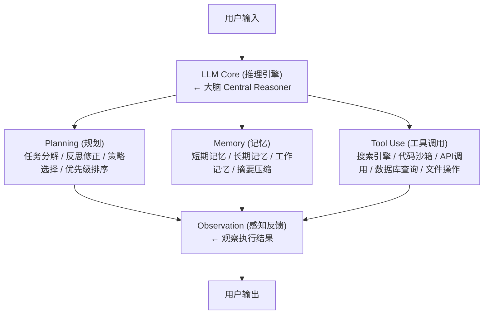

# 一个完整的LLM Agent系统通常由哪些核心模块组成？

> 来源：字节跳动大模型技术面试二面

## Agent 系统架构



## 核心模块详解

### 1. Planning（规划模块）

```python
class PlanningModule:
    """任务规划与分解"""
    
    def plan(self, task: str) -> list:
        """
        ReAct模式: Think → Act → Observe 循环
        Plan-and-Execute模式: 先全局规划再逐步执行
        """
        # Step 1: 任务分解
        steps = self.llm.generate(f"""
        将以下任务分解为可执行的子步骤:
        任务: {task}
        
        输出格式:
        1. [子任务描述]
        2. [子任务描述]
        ...
        """)
        
        return parse_steps(steps)
    
    def reflect(self, action_result: str, original_plan: str):
        """反思: 根据执行结果修正计划"""
        reflection = self.llm.generate(f"""
        上一部执行结果: {action_result}
        原计划: {original_plan}
        
        反思: 这一步成功了吗？需要调整后续计划吗？
        """)
        return reflection
```

```
Planning策略对比:

ReAct (Reasoning + Acting):
  Thought: 用户要查北京天气，我需要调用天气API
  Action: search_weather("北京")
  Observation: 北京今天晴，25°C
  Thought: 获取到天气信息，可以回答了
  Answer: 北京今天晴，气温25°C

Plan-and-Execute:
  Plan: 1.查天气 2.查穿衣建议 3.综合回答
  Execute Step 1: search_weather("北京") → 晴25°C
  Execute Step 2: get_clothing_advice(25) → 薄外套
  Execute Step 3: 综合回答用户

Tree-of-Thoughts (ToT):
  对复杂问题生成多个思维分支
  对每个分支评估可行性
  选择最优路径深入
```

### 2. Memory（记忆模块）

```
┌──────────────────────────────────────────────┐
│              Agent Memory 架构                │
│                                              │
│  ┌──────────┐  ┌──────────┐  ┌──────────┐  │
│  │ 短期记忆  │  │ 工作记忆  │  │ 长期记忆  │  │
│  │(对话历史)│  │(当前任务)│  │(向量检索)│  │
│  └──────────┘  └──────────┘  └──────────┘  │
│                                              │
│  短期: 最近N轮对话 (Context Window)          │
│  工作记忆: 当前任务状态、中间结果              │
│  长期: 向量数据库存储历史交互                 │
└──────────────────────────────────────────────┘
```

```python
class MemoryModule:
    def __init__(self):
        self.short_term = []          # 对话历史
        self.working_memory = {}      # 当前任务状态
        self.long_term_store = None   # 向量数据库
    
    def add_message(self, role, content):
        self.short_term.append({"role": role, "content": content})
        # 滑动窗口: 保持最近K轮
        if len(self.short_term) > 20:
            # 压缩旧消息为摘要
            old = self.short_term[:10]
            summary = self.summarize(old)
            self.short_term = [{"role": "system", "content": summary}] + self.short_term[10:]
    
    def recall(self, query, top_k=5):
        """从长期记忆中检索相关历史"""
        results = self.long_term_store.search(query, top_k=top_k)
        return results
```

### 3. Tool Use（工具调用模块）

```python
class ToolModule:
    """工具注册与调用"""
    
    def __init__(self):
        self.tools = {
            "search": self.web_search,
            "calculate": self.calculator,
            "code_execute": self.code_sandbox,
            "database_query": self.db_query,
        }
        self.tool_schemas = self._generate_schemas()
    
    def call_tool(self, tool_name, **params):
        """通过Function Calling调用工具"""
        if tool_name not in self.tools:
            return {"error": f"Unknown tool: {tool_name}"}
        
        try:
            result = self.tools[tool_name](**params)
            return {"status": "success", "result": result}
        except Exception as e:
            return {"status": "error", "error": str(e)}
```

```
工具调用流程 (Function Calling):

用户: "帮我查一下苹果公司的最新股价"

LLM推理:
  → 识别需要调用 search_stock_price(symbol="AAPL")
  → 返回 tool_call: {name: "search_stock_price", args: {symbol: "AAPL"}}

Agent执行:
  → 调用API获取股价
  → 返回: {price: 178.50, change: +2.3%}

LLM推理:
  → 基于结果生成自然语言回答
  → "苹果公司(AAPL)最新股价为178.50美元，上涨2.3%"
```

### 4. Action/Execution Loop

```
┌──────────────────────────────────────────────┐
│           Agent 主循环 (ReAct Loop)           │
│                                              │
│   ┌──────┐                                   │
│   │START │                                   │
│   └──┬───┘                                   │
│      ▼                                       │
│   ┌──────────┐                              │
│   │ Observe  │ ← 观察用户输入/工具结果        │
│   └────┬─────┘                              │
│        ▼                                     │
│   ┌──────────┐                              │
│   │  Think   │ ← LLM推理: 下一步做什么?      │
│   └────┬─────┘                              │
│        ▼                                     │
│   ┌──────────┐     ┌──────────┐             │
│   │   Act    │────→│ 工具执行  │             │
│   └────┬─────┘     └──────────┘             │
│        ▼                                     │
│   ┌──────────┐                              │
│   │Observe   │ ← 观察执行结果                │
│   └────┬─────┘                              │
│        ▼                                     │
│   ┌──────────┐    完成?                      │
│   │  Done?   │────YES────→ 输出结果          │
│   └────┬─────┘                              │
│       NO│                                    │
│        └──────→ 回到 Think                  │
│                                              │
└──────────────────────────────────────────────┘
```

## 设计要点总结

| 模块 | 设计要点 | 关键挑战 |
|------|---------|---------|
| **LLM Core** | 选择合适模型(推理能力vs成本) | 延迟、成本、上下文长度 |
| **Planning** | 分解粒度适中，避免过深 | 任务复杂度爆炸 |
| **Memory** | 短期滑窗+长期向量+摘要压缩 | 上下文窗口溢出 |
| **Tool Use** | Schema校验+容错重试+超时控制 | 工具调用失败、格式错误 |
| **Action Loop** | 最大循环次数限制+异常处理 | 无限循环、错误传播 |

**面试加分点**：提到LangChain/LangGraph的Agent框架设计；提到AutoGPT/BabyAGI展示了Agent的自主任务分解能力；提到Agent评估框架如AgentBench、τ-bench；提到多Agent系统（如CrewAI、AutoGen）的协作模式——Router/Worker/Critic架构；提到MCP(Model Context Protocol)正在标准化Agent的工具接入层。

## 记忆要点

- 核心架构：LLM Core(大脑)驱动三大核心组件：Planning、Memory、Tool Use
- 闭环系统：核心链路是任务规划→调用工具→观察反馈的循环
- 记忆模块：区分短期记忆(上下文)和长期记忆(向量库检索)
- 规划核心：通过任务分解与多步反思，实现从单一问答到自主行动的跨越

## 苏格拉底式面试追问

> 这组追问模拟面试官层层逼问，每一问先回答"为什么"，再回答"怎么做"，最后回答"如何证明"。

### 第一层：目标与动机

**Q：Agent 架构你说"LLM + Planning + Memory + Tools"。为什么不直接用 LLM（一个 prompt 干所有事），省得搞四个组件？**

单 LLM 无法"自主行动"。LLM 本质是"接收 prompt，输出文本"，它不能"主动调用工具"、"记住跨轮信息"、"规划多步任务"——这些需要外部系统。Planning 让 LLM 能"拆解复杂任务"（如"研究 X"拆成"检索 X → 分析 → 写报告"），单 LLM 一次性生成容易遗漏步骤或逻辑混乱。Memory 让 LLM 能"跨轮/跨对话记住信息"（如用户偏好、历史决策），单 LLM 受上下文窗口限制（历史长了就忘）。Tools 让 LLM 能"与外部世界交互"（如查数据库、调 API、执行代码），单 LLM 只能基于训练数据回答（无法获取实时信息）。四个组件让 LLM 从"只会说"变成"能做事"——Planning 规划怎么做，Memory 记住做过什么，Tools 实际执行，LLM 作为大脑协调。这是 Agent 和 Chatbot 的本质区别。

### 第二层：证据与定位

**Q：Agent 执行任务失败（如"帮我订明天北京的机票"没订成）。你怎么定位是 Planning 拆解错、Tool 调用错、还是 Memory 丢了关键信息？**

看 Agent 的执行 trace。一是 Planning——Agent 是否正确拆解任务（如"订机票"应拆成"查航班 → 选航班 → 填乘客信息 → 支付"），如果拆解漏了步骤（如忘了"选航班"直接跳到支付），是 Planning 问题（prompt 或模型推理能力差）；二是 Tool 调用——每步的工具调用是否正确（如"查航班"工具的参数对不对——出发地、目的地、日期），如果参数错（如日期填错）或选错工具，是 Tool 问题；三是 Memory——Agent 是否记住了关键信息（如"北京"这个目的地是否在后续步骤中保持，还是被遗忘了），如果 Agent 在"选航班"步骤忘了目的地（问了用户多次），是 Memory 问题。通过 trace 的每步输入/输出，定位哪一步开始偏离。关键是要有完整的执行日志（记录每个 Thought/Action/Observation），否则无法定位。

### 第三层：根因深挖

**Q：Planning 你用 ReAct（Thought/Action/Observation 循环）。为什么用 ReAct 而非 Plan-and-Execute（先完整规划再执行）？**

ReAct 更灵活适应"动态环境"。Plan-and-Execute 是"先规划完整步骤，再依次执行"——如规划"步骤1查航班、步骤2选航班、步骤3支付"，然后执行。问题是执行中可能遇到意外（如步骤1查到"无航班"，原计划的步骤2-3 无效），需要重新规划，但 Plan-and-Execute 的静态规划不适应变化。ReAct 是"边思考边执行"——每一步基于前一步的 Observation 决定下一步（Thought: "查到无航班，我应该换日期或目的地" → Action: 换日期查），动态适应环境变化。ReAct 的代价是"每步都要调用 LLM 推理"（成本高、延迟长），而 Plan-and-Execute 只规划一次（便宜）。选型：任务确定（如固定流程的订票）用 Plan-and-Execute（高效），任务不确定（如开放式研究）用 ReAct（灵活）。混合方案：先 Plan（粗规划）再 ReAct（细执行 + 动态调整）。

**Q：那为什么不直接用最强模型（如 GPT-4）做单步推理（一次生成完整的多步计划 + 执行），省得 ReAct 一步步来？**

单次生成多步计划质量差且无法执行工具。一是"计划质量"——LLM 单次生成多步计划时，后面的步骤质量下降（注意力衰减，后面的步骤笼统或不准确），不如逐步推理（每步专注当前决策）；二是"无法执行工具"——工具调用是"先调用，拿结果，再决定下一步"的交互过程，单次生成无法"拿到中间结果"（如生成"查航班 → 航班 CA123 有票 → 订 CA123"，但"CA123 有票"是 LLM 编造的，没实际查），必须 ReAct 循环（实际调用工具拿真实结果）；三是"错误恢复"——单次计划出错（如某步基于错误假设）无法中途纠正，ReAct 每步基于真实 Observation，能及时纠错。所以即使强模型也需要 ReAct（工具调用的本质决定），模型强只是让每步推理更准，不改变"需要循环"的事实。

### 第四层：方案权衡

**Q：Memory 你分"短期（上下文）+ 长期（向量库）"。为什么不直接用长期记忆（全部存向量库，每轮检索），省得维护短期？**

短期记忆（上下文窗口）对"当前对话连贯"不可或缺。长期记忆（向量库检索）有延迟（embedding + ANN，50-100ms）和召回噪声（可能召回不相关的历史）。当前对话的最近几轮必须用短期记忆（直接在上下文里，零延迟、无噪声）保证连贯——如用户说"帮我改一下刚才那个"，Agent 必须知道"刚才那个"是什么（短期记忆里），不能每轮都检索长期记忆（慢 + 可能检索不到"刚才"的精确内容）。长期记忆用于"跨对话回忆"（如上周的对话），短期记忆用于"当前对话连贯"。两者互补：短期保连贯（快、准、容量小），长期保回忆（慢、近似、容量大）。只用长期记忆的问题是"当前对话也要检索"（延迟高、当前对话被当历史检索，不自然）。

**Q：为什么不直接用大窗口模型（如 200k token），把所有历史塞进上下文，省得搞长期记忆检索？**

大窗口贵且有"lost in the middle"。前面多次提到，200k 窗口的模型对中间信息注意力弱（关键信息在中间被忽略），且每次请求传 200k token 成本高（API 费用是短上下文的 10 倍）。长期记忆检索的价值是"预筛选"——从海量历史中召回最相关的 top-K（几十条），只把这 K 条塞进上下文，模型在小上下文里高效处理。大窗口模型适合"单次长输入"（如分析一篇长文档），不适合"持续对话积累历史"（历史不断增长，窗口终会满）。生产 Agent 用"短期（最近几轮）+ 长期（向量库检索相关历史）"，把上下文控制在 8-16k token（高质量区间），而非依赖大窗口硬扛。

### 第五层：验证与沉淀

**Q：你怎么衡量 Agent 的架构是否合理，证明"四组件"比"单 LLM"好？**

定义指标：一是 task_success_rate（端到端任务完成率，Agent 应显著高于单 LLM）；二是 multi-step capability（多步任务的表现，如 5 步以上的复杂任务，Agent 应优于单 LLM）；三是 tool_call_accuracy（工具调用准确率，Agent 应 >90%）；四是 memory_recall_accuracy（记忆回忆准确率，跨轮引用信息的正确率）。做对比实验：单 LLM（一个 prompt 干所有事）vs Agent（四组件），在多步任务测试集上对比 success_rate。关键测试"需要工具的任务"（如"查实时股价"，单 LLM 无法做，Agent 能调工具）和"需要记忆的任务"（如"我刚说的那个数字是多少"，Agent 能从记忆检索）。验证各组件的必要性——去掉 Memory 看跨轮任务是否变差，去掉 Tools 看需要外部信息的任务是否失败，去掉 Planning 看多步任务是否混乱。

**Q：Agent 架构怎么沉淀成框架标配？**

固化成"Agent 框架"：统一的核心循环（Plan → Act → Observe → Reflect）、可插拔的组件（Planning 策略可选 ReAct/Plan-Execute/Mixed、Memory 可选短期/长期/实体、Tools 可注册任意工具）、全链路 trace（每步的输入/输出/耗时）。沉淀"各场景的 Agent 配置"（客服用 ReAct + 短期记忆 + 查询工具、研究助手用 Plan-Execute + 长期记忆 + 搜索工具）、"组件选型指南"（何时用 ReAct vs Plan-Execute、何时用短期 vs 长期）。配套监控（task_success_rate、tool_call_accuracy、平均步数、成本），异常告警。把"四组件架构"作为 Agent 的默认设计，新 Agent 按场景选配置，快速搭建。积累"各组件的最佳实践"（如 Planning 的 prompt 模板、Memory 的压缩策略、Tools 的 Schema 设计）。

## 结构化回答

**30 秒电梯演讲：** LLM Agent = LLM(大脑) + Planning(规划) + Memory(记忆) + Tools(工具) + Action(执行)，让LLM从"只会说"变成"能做事"。

**展开框架：**
1. **Planning** — 任务分解、反思、自我修正
2. **Memory** — 短期(对话历史) + 长期(向量检索/知识库)
3. **Tools** — Function Calling、代码执行、API调用

**收尾：** 您想深入聊：Agent的ReAct和Plan-and-Execute有什么区别？


## 视频脚本

> 预计时长：4 分钟 | 由浅入深


| 时间 | 画面/字幕 | 口播台词 | 讲解要点 |
|------|----------|----------|----------|
| 0:00 | 标题卡：一个完整的LLM Agent系统通常由哪些核心模… | "Agent像一个有手有脚的员工——LLM是大脑（思考），Planning是日程表（分解任务…" | 开场钩子 |
| 0:20 | 核心概念图 | "LLM Agent = LLM(大脑) + Planning(规划) + Memory(记忆) + Tools(工具)…" | 核心定义 |
| 0:50 | Planning示意图 | "Planning——任务分解、反思、自我修正" | 要点拆解1 |
| 1:30 | 对比/实战案例图 | "对比一下常见误区和工程实践，看真实场景里怎么取舍。" | 实战与对比 |
| 2:20 | 总结卡 | "记住核心要点。下期我们追问：Agent的ReAct和Plan-and-Execute有什？" | 收尾与钩子 |
