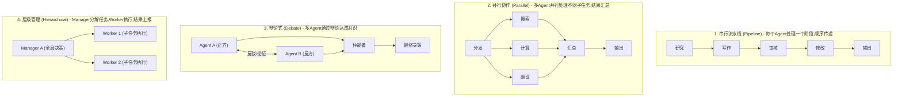

# 多智能体系统中如何设计协同机制？策略冲突时如何解决？

> 来源：字节跳动大模型技术面试二面

## 协同模式全景



## 通信协议设计

### 共享黑板模式 (Blackboard)

```python
class SharedBlackboard:
    """所有Agent共享的状态空间"""
    
    def __init__(self):
        self.state = {
            "task": None,
            "findings": [],      # 各Agent的发现
            "artifacts": {},     # 产出物
            "messages": [],      # Agent间消息
            "conflicts": [],     # 待解决的冲突
        }
        self.lock = threading.Lock()
    
    def write(self, agent_id, key, value):
        with self.lock:
            self.state[key].append({
                "agent": agent_id,
                "value": value,
                "timestamp": time.time()
            })
    
    def read(self, agent_id, key):
        return self.state.get(key, [])
```

### 消息传递模式 (Message Passing)

```python
class MessageBus:
    """Agent间异步消息通信"""
    
    def __init__(self):
        self.queues = {}  # agent_id → message_queue
    
    def send(self, from_id, to_id, message_type, content):
        msg = {
            "from": from_id,
            "to": to_id,
            "type": message_type,  # request/reply/notify/broadcast
            "content": content,
            "timestamp": time.time()
        }
        self.queues[to_id].put(msg)
    
    def broadcast(self, from_id, message_type, content):
        for agent_id in self.queues:
            if agent_id != from_id:
                self.send(from_id, agent_id, message_type, content)
```

## 冲突解决机制

### 场景：两个Agent策略冲突

```
案例: 构建Web应用的Agent系统

Agent-Coder: "应该用REST API，简单直接，快速交付"
Agent-Security: "应该用GraphQL，可以精确控制字段，减少攻击面"

→ 冲突! 两个Agent对技术选型意见不同
```

### 解决方案1：仲裁者 (Arbiter)

```python
class Arbiter:
    """独立的仲裁Agent，基于全局目标做决策"""
    
    def resolve(self, agent_a_proposal, agent_b_proposal, task_context):
        decision = self.llm.generate(f"""
        你是技术仲裁者。两个Agent对以下问题意见不同:
        
        任务目标: {task_context.goal}
        约束条件: {task_context.constraints}
        
        Agent-A提案: {agent_a_proposal}
        理由: {agent_a_proposal.reasoning}
        
        Agent-B提案: {agent_b_proposal}
        理由: {agent_b_proposal.reasoning}
        
        请基于任务目标和约束条件，选择更优方案，或提出折中方案。
        必须给出明确的决策理由。
        """)
        
        return decision
```

### 解决方案2：多数表决 (Voting)

```python
class VotingMechanism:
    """多Agent投票，少数服从多数"""
    
    def resolve(self, proposals, voters):
        votes = {}
        
        for voter in voters:
            # 每个投票Agent独立评估所有提案
            ranking = voter.evaluate(proposals)
            for i, prop in enumerate(ranking):
                votes[prop.id] = votes.get(prop.id, 0) + (len(ranking) - i)
        
        # 得分最高的提案胜出
        winner = max(votes, key=votes.get)
        return winner
```

### 解决方案3：加权评分 (Weighted Scoring)

```python
def weighted_resolution(agent_proposals, evaluation_criteria):
    """
    按多维度加权评分，选最高分方案
    """
    criteria_weights = {
        "feasibility": 0.3,      # 可行性
        "performance": 0.25,     # 性能
        "cost": 0.2,             # 成本
        "maintainability": 0.15, # 可维护性
        "time_to_deliver": 0.1,  # 交付速度
    }
    
    scores = {}
    for proposal in agent_proposals:
        total = 0
        for criterion, weight in criteria_weights.items():
            score = evaluate(proposal, criterion)  # LLM打分1-10
            total += score * weight
        scores[proposal.id] = total
    
    return max(scores, key=scores.get)
```

### 解决方案4：人工介入

```python
def human_escalation(conflict, context):
    """高严重性冲突转人工"""
    severity = assess_severity(conflict)
    
    if severity >= 0.8:
        return {
            "status": "human_required",
            "summary": f"严重冲突需要人工决策:\n{conflict}",
            "options": [p.summary for p in conflict.proposals],
            "context": context
        }
```

## 典型框架对比

| 框架 | 协同模式 | 冲突处理 | 特点 |
|------|---------|---------|------|
| **AutoGen** | 对话式 | 自然语言协商 | 多角色对话，灵活 |
| **CrewAI** | 角色流水线 | Manager裁决 | 角色明确，任务驱动 |
| **MetaGPT** | SOP驱动 | 按SOP规范 | 模拟软件团队SOP |
| **LangGraph** | 图结构 | 条件路由 | 可视化流程控制 |

```python
# CrewAI示例: 角色分工+冲突解决
from crewai import Agent, Task, Crew

researcher = Agent(
    role='技术研究员',
    goal='调研最优技术方案',
    backstory='资深架构师，擅长技术选型',
    tools=[search_tool]
)

coder = Agent(
    role='开发工程师',
    goal='实现高质量代码',
    backstory='全栈开发，注重代码质量',
    tools=[code_executor]
)

manager = Agent(
    role='项目经理',
    goal='协调团队，做出最优决策',
    backstory='经验丰富的技术管理者',
    allow_delegation=True  # ★ 允许委派和仲裁
)

crew = Crew(
    agents=[researcher, coder, manager],
    tasks=[research_task, coding_task],
    process=Process.hierarchical,  # ★ 层级管理: manager做最终决策
    manager_llm='gpt-4'
)
```

## 设计要点

```
多Agent系统设计原则:

1. 角色明确: 每个Agent有清晰的职责边界
2. 通信高效: 避免过度通信导致上下文爆炸
3. 冲突可控: 预设冲突解决机制
4. 可观测: 完整的决策追踪链
5. 容错: 单个Agent失败不影响整体
6. 收敛: 有明确的终止条件和一致性保证

反模式(避免):
✗ Agent数量过多 → 通信开销 > 任务收益
✗ 无冲突解决 → 僵局
✗ 回声室 → Agent间互相强化错误
✗ 无限辩论 → 永不收敛
```

**面试加分点**：提到MetaGPT的SOP(Standard Operating Procedure)理念——用人类团队的协作规范约束Agent行为；提到AutoGen的GroupChat模式支持灵活的多Agent对话；提到Agent数量最优值通常是3-5个，超过10个通信开销急剧上升；提到ChatDev模拟完整软件公司的多Agent协作（CEO→CTO→程序员→测试员）；提到多Agent系统最大的挑战是"评估"——如何判断协作效果是来自协同还是单个Agent的能力。

## 记忆要点

- 四大模式：串行流水线、并行汇总、相互辩论、层级分发管理
- 冲突解决：去中心化靠共识协议，中心化靠Manager一票否决
- 容错机制：心跳监测异常，支持任务重分配，防单点故障阻塞全局
- 防死锁口诀：全局超时必须有，权重冲突必仲裁

## 苏格拉底式面试追问

> 这组追问模拟面试官层层逼问，每一问先回答"为什么"，再回答"怎么做"，最后回答"如何证明"。

### 第一层：目标与动机

**Q：多智能体协同你提四大模式（串行/并行/辩论/层级）。为什么需要四种？直接用串行（最简单）不行吗？**

串行不能覆盖所有协作需求。串行流水线（A 的输出给 B，B 的给 C）适合"线性任务"（如"检索 → 分析 → 写作"），但无法处理"可并行的任务"（如"同时检索多个来源"需要并行模式）或"需要多角度验证的任务"（如"代码审查"需要多个 Agent 从不同角度看，需要辩论模式）。层级模式适合"复杂任务的分层分解"（如 Manager 拆任务给多个 Worker，汇总结果）。四种模式对应不同的协作需求：串行（线性依赖）、并行（独立子任务）、辩论（多角度验证）、层级（分治管理）。选错模式会导致效率低（可并行的串行了，慢）或质量差（该辩论的直接串行，缺多角度）。复杂系统可能混合多种模式（如"层级 Manager 调度多个并行 Worker，Worker 内部串行"）。

### 第二层：证据与定位

**Q：多智能体系统的 E2E 任务成功率低。你怎么定位是某个 Agent 质量差、Agent 间冲突（结果不一致）、还是通信丢消息？**

看各 Agent 的 trace 和系统层指标。一是个体质量——各 Agent 独立执行其子任务的成功率（如 Agent A 检索准确率 90%、Agent B 分析准确率 60%，B 是瓶颈）；二是冲突率（conflict_rate）——并行/辩论模式下，多个 Agent 的结果是否一致（如 3 个 Agent 对"代码是否有 bug"投票，2 个说有、1 个说没有，冲突率高时需仲裁）；三是通信成功率——消息是否正确传递（如 Agent A 的结果没传给 Agent B，B 基于缺失信息决策）。通过 trace 看每个 Agent 的输入/输出，定位是"输入错"（上游传错了）还是"处理错"（Agent 本身能力差）。系统层指标：冲突率（>30% 说明 Agent 间分歧大，需仲裁机制）、通信失败率（>1% 说明消息系统有问题）、各 Agent 的延迟（某个 Agent 慢拖累全局）。

### 第三层：根因深挖

**Q：辩论模式你说"多角度验证"。但如果多个 Agent 都基于同一个有偏差的 base 模型，它们的"多角度"真的独立吗？根因是什么？**

根因是"同质化 Agent 的伪独立性"。如果多个 Agent 是同一个 base 模型 + 不同 prompt（如 Agent A 是"乐观主义者"prompt、Agent B 是"悲观主义者"prompt），它们的"视角"看似不同，但底层是同一个模型（相同的参数化知识、相同的推理偏见），遇到模型本身的盲区（如训练数据缺失的领域）都会犯错，"伪独立"。真正的独立需要"异构 Agent"——不同的 base 模型（如 Agent A 用 GPT-4、Agent B 用 Claude、Agent C 用 Llama），不同模型的训练数据和推理方式不同，盲区不重合，辩论才有"真独立"的价值。但异构 Agent 成本高（多个模型的 API 费用）且运维复杂。折中：同模型 + 差异化 prompt（低成本，伪独立但仍有价值，因为 prompt 引导不同视角）+ 关键场景用异构（如高 stakes 决策用多模型投票）。关键是理解"同模型的辩论只是 prompt 视角的多样性，不是模型能力的多样性"。

**Q：那为什么不直接用最强的模型（如 GPT-4）单次推理，省得多 Agent 辩论？GPT-4 一个模型足够强。**

强模型单次推理仍有错误，辩论能降低错误率。GPT-4 在复杂推理上的错误率约 10-20%（如数学推理、代码 bug 检测），单次推理的答案可能是错的。辩论（多个 Agent 独立推理 + 投票）利用"多路独立性"——如果 3 个独立 Agent 都犯同样错的概率是 $0.1^3 = 0.001$（假设独立），投票后的错误率大幅降低（多数票正确）。这是"集成学习"的思路（多个弱分类器集成成强分类器），应用到 LLM 推理。代价是成本高（辩论需要 N 次推理，N 倍 token）和延迟长（串行辩论）或需要并行（并行辩论的协调成本）。选型看"错误成本"——高 stakes 场景（如医疗诊断、金融决策）值得用辩论降低错误率，低 stakes 场景（如闲聊）单次推理够用。且辩论不只是"重复推理"，而是"多视角"（不同 Agent 从不同角度分析），价值大于简单重复。

### 第四层：方案权衡

**Q：冲突解决你说"中心化 Manager 仲裁 vs 去中心化共识协议"。为什么默认用中心化？**

中心化简单且决策快。中心化 Manager（一个仲裁者）收到冲突后直接决策（如"Agent A 说有 bug、Agent B 说没有，Manager 判断采纳 A"），决策快（一次推理）、逻辑清晰。去中心化共识协议（如 PoW/PoS/Paxos）让多个 Agent 协商达成共识，流程复杂（多轮通信 + 投票）、延迟长。中心化的劣势是"单点故障"（Manager 挂了全挂）和"偏见"（Manager 可能偏向某方），但通过"备用 Manager"（故障转移）和"明确的仲裁规则"（减少主观偏见）缓解。生产系统优先中心化（简单 + 快），只在"不能有中心"（如多方互不信任的场景）或"极高可用"（不能单点故障）时用去中心化。LLM 多 Agent 系统通常用中心化（因为 LLM 推理本身是中心化的，去中心化收益小）。

**Q：为什么不直接用"少数服从多数"投票（而非 Manager 仲裁），更民主？**

投票有效但可能"多数暴政"且需要奇数 Agent。投票（3 个 Agent，多数票胜）简单且无需 Manager，但问题：一是"多数不一定对"——如果 2 个 Agent 犯同样错（如都基于同一模型的盲区），多数票选了错答案，少数的正确 Agent 被否决；二是"需要奇数 Agent"——偶数 Agent 可能平票（2:2），需要加 Manager 仲裁打破平局；三是"无法处理复杂冲突"——简单投票适合"二选一"（是/否），复杂冲突（如 Agent A 说"有 3 个 bug"、Agent B 说"有 5 个 bug"、Agent C 说"有 2 个 bug"）投票无法直接处理（要合并或细化）。Manager 仲裁能处理复杂冲突（Manager 综合各 Agent 的分析，做细致判断），且不受 Agent 数限制。折中：简单二选一用投票（如"代码是否有 bug"），复杂分析用 Manager（如"bug 的具体位置和修复方案"）。

### 第五层：验证与沉淀

**Q：你怎么衡量多智能体协同的效果，证明比单 Agent 好？**

定义指标：一是 E2E task_success_rate（对比单 Agent vs 多 Agent，多 Agent 应更高）；二是 conflict_resolution_rate（冲突被正确解决的比例，用 golden set 验证仲裁结果）；三是协作效率（communication_rounds、E2E 延迟）；四是成本（多 Agent 的 token 消耗是单 Agent 的 N 倍，验证收益是否值成本）。做对比实验：单 Agent vs 串行多 Agent vs 并行多 Agent vs 辩论多 Agent，在相同任务集上对比 success_rate/cost/latency。关键验证"协作的收益"——如果多 Agent 的 success_rate 只比单 Agent 高 2% 但成本涨 5 倍，ROI 为负，不值得。辩论模式特别验证"错误率降低"——在单 Agent 容易错的任务上（如数学推理），辩论的错误率应显著低于单 Agent。A/B 测试线上效果——单 Agent vs 多 Agent 的用户满意度和任务完成率。

**Q：多智能体协同方案怎么沉淀成框架标配？**

固化成"多 Agent 协同框架"：支持四大模式（串行/并行/辩论/层级）可配置组合、中心化 Manager 仲裁 + 投票可切换、心跳监测 + 故障重分配、全链路 trace。沉淀"各任务的协同模式推荐"（代码审查用辩论、研究用并行 + 层级、客服用串行流水线）、"仲裁规则"（何时 Manager 仲裁、何时投票）、"容错配置"（心跳间隔、重试次数、超时）。配套监控（E2E success_rate、conflict_rate、communication_rounds、各 Agent 质量），异常（success 降/冲突高/某 Agent 频繁失败）告警。把"四大模式 + 仲裁 + 容错"作为多 Agent 系统的默认能力，新系统按任务选模式，快速搭建。积累"常见协同模式的性能基线"（如辩论模式成本 3 倍但错误率降 50%），帮助决策何时用多 Agent。

## 结构化回答

**30 秒电梯演讲：** 多智能体协同通过角色分工、通信协议和冲突仲裁机制实现复杂任务分解。冲突解决的核心是引入仲裁者或投票机制——像一个项目组。

**展开框架：**
1. **协同模式** — 串行流水线 / 并行协作 / 辩论式 / 层级管理
2. **通信** — 共享黑板 / 消息传递 / 状态同步
3. **冲突解决** — 仲裁者投票 / 多数表决 / 人工介入

**收尾：** 您想深入聊：如何评估多Agent系统的协作效率？


## 视频脚本

> 预计时长：5 分钟 | 由浅入深


| 时间 | 画面/字幕 | 口播台词 | 讲解要点 |
|------|----------|----------|----------|
| 0:00 | 标题卡：多智能体系统中如何设计协同机制？策略冲突时如何解… | "像一个项目组——有人负责调研(Researcher)、有人负责写码(Coder)、有人负责…" | 开场钩子 |
| 0:20 | 核心概念图 | "多智能体协同通过角色分工、通信协议和冲突仲裁机制实现复杂任务分解。冲突解决的核心是引入仲裁者或投票机制" | 核心定义 |
| 0:50 | 协同模式示意图 | "协同模式——串行流水线 / 并行协作 / 辩论式 / 层级管理" | 要点拆解1 |
| 1:30 | 通信示意图 | "通信——共享黑板 / 消息传递 / 状态同步" | 要点拆解2 |
| 2:20 | 对比/实战案例图 | "对比一下常见误区和工程实践，看真实场景里怎么取舍。" | 实战与对比 |
| 3:10 | 总结卡 | "记住核心要点。下期我们追问：如何评估多Agent系统的协作效率？" | 收尾与钩子 |
