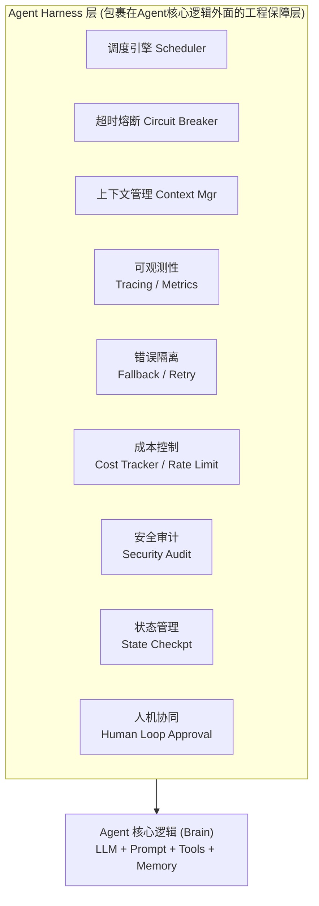

# 什么是 Harness Engineering？Agent Harness 层包含哪些职责？

## 核心概念



## 六大核心职责

### 1. 调度引擎 (Scheduler)

```python
class AgentScheduler:
    def __init__(self, max_concurrent=10, max_queue=1000):
        self.semaphore = asyncio.Semaphore(max_concurrent)
        self.queue = asyncio.Queue(maxsize=max_queue)

    async def run(self, task):
        async with self.semaphore:  # 并发控制
            return await self._execute(task)
```

- **并发控制**：限制同时运行的Agent实例数，防止LLM API被打满
- **优先级队列**：VIP用户优先、实时任务优先于批量任务
- **任务编排**：Pipeline(串行)、Fan-out(并行)、DAG(复杂依赖)

### 2. 超时熔断 (Timeout & Circuit Breaker)

```python
async def execute_with_protection(self, step):
    # 单步超时
    try:
        result = await asyncio.wait_for(step.run(), timeout=30)
    except asyncio.TimeoutError:
        # 超时降级
        return await self.fallback(step)

    # 熔断器：连续失败N次 → 熔断 → 半开探测
    if self.circuit_breaker.is_open:
        return self.cached_result or self.fallback(step)
```

- **三层超时**：单步超时(30s) + 会话超时(120s) + 全局超时(300s)
- **指数退避重试**：失败后1s→2s→4s重试，最多3次
- **熔断器**：连续5次失败 → 熔断60s → 半开探测1次 → 恢复

### 3. 上下文管理 (Context Manager)

```python
class ContextManager:
    def build_context(self, history, max_tokens=8000):
        # Token预算分配
        system_prompt = 1000  # 固定
        tool_results = 2000   # 动态
        history = max_tokens - system_prompt - tool_results

        # 滑动窗口 + 摘要压缩
        if self.token_count(history) > history:
            old = history[:len(history)//2]
            summary = self.summarize(old)  # LLM摘要
            history = [{"role": "system", "content": summary}] + history[len(history)//2:]
```

- **Token预算**：System Prompt + History + Tool Results + Output ≤ Model Context
- **滑动窗口**：保留最近N轮，旧消息摘要压缩
- **动态注入**：根据当前步骤注入相关上下文(如用户画像、会话历史)

### 4. 可观测性 (Observability)

```python
# 全链路Trace
@trace("agent_step")
async def step(self, input):
    with span("llm_call") as s:
        s.set_tag("model", "gpt-4")
        s.set_tag("tokens_in", len(input))
        result = await llm.chat(input)
        s.set_tag("tokens_out", len(result))
        s.set_tag("cost_usd", calculate_cost(...))
    return result
```

- **Trace**：每个Agent步骤记录输入/输出/耗时/token/成本
- **Metrics**：成功率、P50/P99延迟、token消耗、工具调用分布
- **日志**：结构化日志，支持按session_id/user_id查询

### 5. 错误隔离与降级 (Error Isolation & Fallback)

```
工具调用失败 → 降级策略链：
  1. 重试(指数退避, 最多3次)
  2. 备用工具(如API1挂了用API2)
  3. 缓存结果(返回上次成功的类似结果)
  4. 优雅降级(告诉用户"暂时无法查询,但可以...")
  5. 转人工(最终兜底)
```

### 6. 安全与审计

- **PII脱敏**：日志中自动脱敏手机号、身份证等
- **Prompt注入防护**：输入过滤、输出校验
- **操作审计**：记录每个工具调用的参数和结果，支持事后溯源
- **速率限制**：防止单用户滥用(如每分钟最多10次Agent调用)

## 字节内部实践

字节内部的 **Eino** 框架和 **CloudWeGo** 生态就是典型的Harness层实现：
- Eino：Go语言AI编排框架，类似LangGraph的Graph引擎
- CloudWeGo：高性能RPC框架(Kitex) + HTTP框架(Hertz)
- 结合自研LLM网关，实现统一调度、限流、监控

## 记忆要点

- 一句话定义：包裹在Agent核心逻辑(LLM)外面的工程保障层
- 六大核心职责：调度(并发/编排)、熔断(超时/重试)、上下文管理
- 还包含：可观测性(Tracing)、错误隔离兜底、安全审计与人机协同
- 因为LLM API易超时打满，所以Harness层必须实现并发控制与三层超时兜底机制

## 苏格拉底式面试追问

> 这组追问模拟面试官层层逼问，每一问先回答"为什么"，再回答"怎么做"，最后回答"如何证明"。

### 第一层：目标与动机

**Q：Harness 你说是"包裹在 Agent 核心逻辑外的工程保障层"。为什么不把这些保障（超时/重试/熔断）直接写在 Agent 业务代码里，省得单独搞一层？**

单独一层实现"关注点分离"和"复用"。把超时/重试/熔断写在业务代码里的问题：一是耦合——业务逻辑和容错逻辑混在一起，代码难读难维护（每个 Agent 都要写一遍超时/重试）；二是不一致——不同开发者写的容错逻辑不统一（A 写的超时 30 秒、B 写的 60 秒，行为不一致）；三是难演进——容错策略升级（如从简单重试升级到指数退避）要改所有 Agent 代码。Harness 层把这些"横切关注点"（cross-cutting concerns）统一抽取——业务代码只写"调 LLM 生成"（核心逻辑），Harness 负责"超时控制、重试、熔断、trace"（保障逻辑），业务和保障解耦。新 Agent 只写业务逻辑，自动获得 Harness 的保障能力（复用）。且 Harness 的策略可统一调（如全局调超时时间，一处改全部生效）。这是"中间件/装饰器"模式的典型应用——业务核心 + 横切保障分离。

### 第二层：证据与定位

**Q：Agent 线上频繁超时（用户等很久无响应）。你怎么定位是 LLM API 慢、Harness 的超时配置不合理、还是 Agent 逻辑死循环（一直在调工具）？**

看 Harness 的 trace 和超时统计。一是 LLM API 延迟——trace 里每次 LLM 调用的耗时，如果某次 LLM 调用 >60 秒（异常），是 LLM API 慢（服务端问题或网络），Harness 的重试应该触发（重试后仍慢则降级）；二是 Harness 超时配置——如果超时设为 120 秒（太长），用户等 2 分钟才超时，体验差，应调短（如 30 秒）；三是 Agent 死循环——trace 里 Agent 的工具调用次数，如果调了 10+ 次工具（每轮 LLM 调用 + 工具执行），总耗时叠加超时，是死循环（前面讨论过的防死循环机制）。Harness 的 trace 是定位的关键——每步的输入/输出/耗时记录清楚，能精确定位"卡在哪一步"。如果 Harness 没有 trace（只看总超时），无法定位。所以 Harness 的"可观测性"不只是监控，也是排障工具。

### 第三层：根因深挖

**Q：Harness 你提"三层超时兜底"。为什么需要三层？一层全局超时不够吗？**

三层解决不同粒度的超时。一是单次工具调用超时（如 30 秒）——单个工具（如 search、LLM API）卡住时，30 秒后取消该调用，触发重试或降级，不让单个工具拖死整个 Agent；二是单步推理超时（如 60 秒）——Agent 的一个 ReAct 步骤（LLM 推理 + 工具调用 + 结果处理）的总耗时上限，防止单步过久；三是全局任务超时（如 5 分钟）——整个 Agent 任务（可能多步）的总耗时上限，无论中间发生什么，5 分钟后强制结束（返回部分结果或降级）。三层互补：单次工具超时防"单点卡死"，单步超时防"单步过久"（如 LLM 推理慢），全局超时防"整体死循环"。只设全局超时的问题是"不知道哪步超时"（5 分钟到了直接杀，没机会重试或降级中间步骤），三层让每层有机会"局部处理"（单次超时重试、单步超时降级、全局超时兜底）。

**Q：那为什么不直接设一个很短的全局超时（如 30 秒），逼所有步骤都快，省得三层？**

短全局超时会误杀正常的长任务。复杂 Agent 任务（如多轮检索 + 推理 + 生成）正常可能需要 1-2 分钟，30 秒全局超时会强制终止（任务没完成就杀），用户体验差（每次都超时失败）。且全局超时无法"局部处理"——30 秒到了直接杀，无法对慢的步骤做重试或降级（如某次 LLM 调用慢，重试可能快，但全局超时直接杀没机会重试）。三层超时的设计是"细粒度控制 + 粗粒度兜底"——细粒度（单次/单步超时）让局部问题局部处理（重试/降级），粗粒度（全局超时）防整体失控。全局超时设得稍长（如 5 分钟，覆盖正常长任务的最坏情况），让细粒度超时先处理局部问题，全局只兜底"极端失控"。这是"分级容错"的思路，而非"一刀切"。

### 第四层：方案权衡

**Q：Harness 的重试策略你用指数退避（exponential backoff）。为什么不直接固定间隔重试（如每 2 秒重试一次），更简单？**

固定间隔重试会"雪崩"。当 LLM API 短暂过载（如高峰期），如果所有客户端都固定间隔重试（如 2 秒），2 秒后所有重试同时打到服务端（加重过载），服务端更慢，更多超时，更多重试，雪崩。指数退避（如 1s, 2s, 4s, 8s, ...）让重试间隔逐渐增大，分散重试压力（不同客户端的重试时间不同），给服务端"喘息"恢复的时间。加上 jitter（随机抖动，如 1s ± 0.3s），进一步分散重试（避免同步），防止"重试风暴"。指数退避 + jitter 是分布式系统的标准实践（AWS/Google 的重试指南都推荐）。代价是"重试总时间变长"（指数退避的总等待 > 固定间隔），但对"服务端过载"场景更安全（不会加重过载）。Harness 的重试应默认用指数退避 + jitter + 最大重试次数（如 3 次），而非固定间隔。

**Q：为什么不直接用断路器（circuit breaker，连续失败 N 次后停止请求一段时间），省得重试？**

断路器和重试解决不同问题，应该结合。重试解决"瞬时错误"（如网络抖动、短暂超时），重试后可能成功。断路器解决"持续错误"（如服务端挂了），连续失败说明服务端不可用，重试无用且加重负担，断路器"跳闸"（停止请求一段时间），直接降级（不调服务端）。两者结合：先重试（应对瞬时错误），重试都失败且连续多次 → 断路器跳闸（应对持续错误，停止无谓重试），一段时间后断路器"半开"（试探性请求，成功则恢复，失败继续跳闸）。Harness 应同时实现重试 + 断路器——重试处理瞬时错误，断路器处理持续错误，降级作为兜底（重试和断路器都失败时，返回缓存或默认值）。单一机制（只有重试或只有断路器）都不够，生产级 Harness 三者都要。

### 第五层：验证与沉淀

**Q：你怎么衡量 Harness 的效果，证明它"保障了 Agent 的可靠性"？**

定义指标：一是超时率（timeout_rate，触发任一层超时的比例，应 <5%）；二是重试成功率（retry_success_rate，重试后成功的比例，应 >50%，否则重试无意义）；三是降级率（degradation_rate，触发降级的比例，应 <2%，高说明主路径质量差）；四是 P99 延迟（应 <全局超时，如 <5 分钟）；五是 E2E success_rate（含降级后的部分成功，应 >95%）。做"故障注入测试"——故意制造异常（如 mock LLM API 超时、返回错误），看 Harness 是否正确处理（重试 → 断路器 → 降级），验证各层兜底有效。关键验证"降级的质量"——降级后是否返回可用结果（如缓存或默认回答），而非裸错误。监控"各层超时的触发频率"——单次工具超时多（工具质量问题）、单步超时多（LLM 慢）、全局超时多（死循环），针对性优化。

**Q：Harness 怎么沉淀成 Agent 框架标配？**

固化成"Agent Harness 中间件"：默认开启三层超时（工具 30s/单步 60s/全局 5min）、重试（指数退避 + jitter，最多 3 次）、断路器（连续 5 次失败跳闸，30 秒后半开）、降级策略（缓存/默认值/人工接管）、全链路 trace（每步输入/输出/耗时）。沉淀"各场景的超时配置"（客服 30s/研究 5min）、"降级方案库"（各工具的降级备选）、"trace 格式规范"（统一 trace ID，支持跨服务追踪）。配套监控（超时率、重试率、降级率、各层超时分布、trace 可查），异常告警。把"Harness 保障"作为 Agent 服务的默认配置，新 Agent 开发者只写业务逻辑，可靠性由 Harness 保证。积累"常见故障的容错策略"（如 LLM API 限流 → 重试 + 断路器、工具超时 → 降级备用工具），形成策略库。

## 结构化回答

**30 秒电梯演讲：** Harness是包裹在Agent核心逻辑外面的工程化层，负责调度、超时熔断、上下文注入、可观测性、错误隔离等生产级保障——Agent核心逻辑是赛车手，Harness是整辆赛车。

**展开框架：**
1. **调度层** — 任务队列、并发控制、优先级
2. **超时熔断** — 单步超时、全局超时、失败重试
3. **上下文注入** — System Prompt管理、动态上下文窗口

**收尾：** 您想深入聊：你们Agent系统的P99延迟多少？怎么优化的？


## 视频脚本

> 预计时长：5 分钟 | 由浅入深


| 时间 | 画面/字幕 | 口播台词 | 讲解要点 |
|------|----------|----------|----------|
| 0:00 | 标题卡：什么是 Harness Engineering？… | "Agent核心逻辑是赛车手，Harness是整辆赛车——引擎再好，没有刹车(熔断)、仪表盘…" | 开场钩子 |
| 0:20 | 核心概念图 | "Harness是包裹在Agent核心逻辑外面的工程化层，负责调度、超时熔断、上下文注入、可观测性、错误隔离等生产级保障" | 核心定义 |
| 0:50 | 调度层示意图 | "调度层——任务队列、并发控制、优先级" | 要点拆解1 |
| 1:30 | 超时熔断示意图 | "超时熔断——单步超时、全局超时、失败重试" | 要点拆解2 |
| 2:20 | 对比/实战案例图 | "对比一下常见误区和工程实践，看真实场景里怎么取舍。" | 实战与对比 |
| 3:10 | 总结卡 | "记住核心要点。下期我们追问：你们Agent系统的P99延迟多少？怎么优化的？" | 收尾与钩子 |
