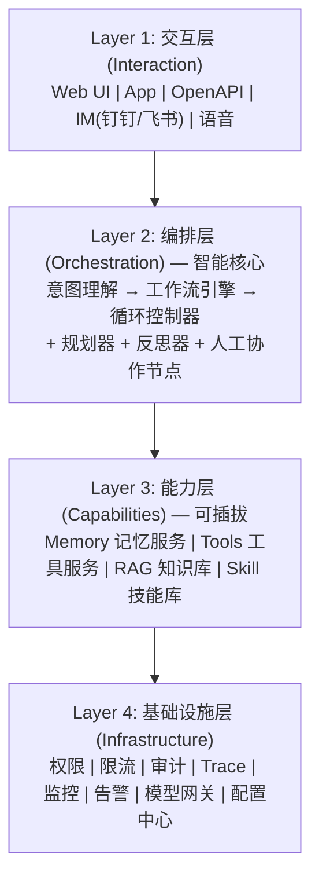

# 生产级 Agent 的架构怎么划分？（记忆、权限、工作流）

## 一、生产级 Agent 四层架构



## 二、记忆子系统（Memory）

### 生产级记忆架构

```
┌─────────────────────────────────────────────────┐
│                Memory Service                    │
├─────────────────────────────────────────────────┤
│  写入路径                                          │
│  请求 → 权限校验 → 去重/合并 → Embedding → 存储    │
├─────────────────────────────────────────────────┤
│  存储分层                                          │
│  ├── Redis: 热数据/短期记忆（ms级）                │
│  ├── 向量DB: 长期记忆（Chroma/Milvus）            │
│  └── 对象存储: 原始文档（S3/OSS）                  │
├─────────────────────────────────────────────────┤
│  读取路径                                          │
│  query → Embedding → 向量检索 → Rerank → 过滤     │
│         → 用户隔离 → 时效性过滤 → 返回              │
└─────────────────────────────────────────────────┘
```

```python
class ProductionMemory:
    def recall(self, user_id, query, top_k=5):
        # 1. 向量检索
        candidates = self.vector_db.search(
            embedding(query), 
            filter={"user_id": user_id},  # 用户隔离
            n_results=top_k * 3  # 多取再rerank
        )
        # 2. 重排序
        ranked = self.reranker.rerank(query, candidates)
        # 3. 时效性过滤
        valid = [m for m in ranked if not m.is_expired()]
        # 4. 重要性加权
        valid.sort(key=lambda m: m.importance * m.recency_score, reverse=True)
        return valid[:top_k]
```

## 三、权限子系统（Permission）

### 三层权限模型

```
┌─────────────────────────────────────────────────┐
│  Layer 1: 身份认证 (Authentication)               │
│  你是谁？—— JWT/API Key/OAuth                     │
├─────────────────────────────────────────────────┤
│  Layer 2: 访问控制 (Authorization)                │
│  你能做什么？—— RBAC/ABAC                         │
│  ├── RBAC: 基于角色（管理员/普通用户/访客）        │
│  └── ABAC: 基于属性（部门+数据敏感度+时间）        │
├─────────────────────────────────────────────────┤
│  Layer 3: 操作审批 (Approval)                     │
│  高危操作谁批准？—— 删除/支付/外发需人工确认      │
└─────────────────────────────────────────────────┘
```

```python
# 权限矩阵示例
PERMISSION_MATRIX = {
    "viewer":   {"query": True,  "write": False, "delete": False},
    "editor":   {"query": True,  "write": True,  "delete": False},
    "admin":    {"query": True,  "write": True,  "delete": "need_approve"},
}

def check_permission(user, action, resource):
    role = get_role(user, resource)
    perm = PERMISSION_MATRIX[role].get(action.type, False)
    if perm == "need_approve":
        return await request_approval(user, action)
    return perm
```

## 四、工作流引擎（Workflow）

### 工作流 vs Agent 决策

```
确定性工作流（Workflow）：
  固定路径：A → B → C → D
  适用：流程固定、可预测的业务（如订单处理）

Agent动态决策（Agentic）：
  动态路径：A → LLM决定 → {B或C或D} → ...
  适用：需要灵活判断的场景（如客服咨询）

混合模式（生产推荐）：
  大框架用工作流（稳定性）+ 关键节点用Agent（灵活性）
```

### LangGraph 风格的工作流定义

```python
from langgraph.graph import StateGraph

# 定义状态
class AgentState(TypedDict):
    messages: list
    user_id: str
    needs_human: bool

# 构建图
graph = StateGraph(AgentState)
graph.add_node("understand", understand_intent)
graph.add_node("plan", plan_steps)
graph.add_node("execute", execute_tools)
graph.add_node("human_review", human_checkpoint)
graph.add_node("respond", generate_response)

# 定义流转（含条件分支）
graph.add_edge("understand", "plan")
graph.add_conditional_edges(
    "execute",
    lambda s: "human_review" if s["needs_human"] else "respond"
)
graph.add_edge("human_review", "respond")

app = graph.compile(checkpointer=memory)  # 支持中断恢复
```

## 五、基础设施：稳定性保障

### 模型网关（LLM Gateway）

```python
class LLMGateway:
    """统一模型调用入口，支持路由/降级/限流"""
    def call(self, prompt, **kwargs):
        # 1. 模型路由（按任务复杂度选模型）
        model = self.router.select(prompt, budget=self.budget)
        # 2. 限流
        if not self.rate_limiter.acquire(user):
            raise RateLimitError()
        # 3. 调用（带降级）
        try:
            return self.providers[model].call(prompt)
        except (Timeout, Overload):
            # 降级到备用模型
            return self.providers["fallback"].call(prompt)
```

### 全链路可观测

```python
# 每个Agent执行生成完整Trace
trace = {
    "trace_id": "abc123",
    "user_id": "u1",
    "goal": "查询订单状态",
    "spans": [
        {"name": "understand", "duration_ms": 200, "model": "gpt-4o-mini"},
        {"name": "tool_call:query_order", "duration_ms": 350, "status": "ok"},
        {"name": "respond", "duration_ms": 800, "model": "gpt-4"},
    ],
    "total_tokens": 1200,
    "cost_usd": 0.012,
    "status": "success"
}
# 用于：故障定位 / 性能优化 / 成本分析 / Bad Case挖掘
```

## 六、面试加分点

1. **强调"分层解耦"**：智能层（编排）与基础设施层（安全/监控）分离，才能独立迭代
2. **混合架构**：纯 Agent 不稳定，纯工作流不灵活，生产推荐"工作流骨架 + Agent 节点"
3. **提"中断恢复"**：长任务（如人工审核）要支持 checkpoint，这是 LangGraph 的核心能力

## 记忆要点

- 四层架构：交互层、编排层（智能核心）、能力层（可插拔）、基础设施层
- 记忆系统读取路径：向量检索 → 多取重排（Rerank） → 时效性/重要性加权过滤
- 生产级重点：记忆需用户隔离防越权，工具用RAG按需召回防Token超限
- 基础设施：必须包含权限、限流、全链路Trace和监控告警体系


## 苏格拉底式面试追问

> 这组追问模拟面试官层层逼问，每一问先回答"为什么"，再回答"怎么做"，最后回答"如何证明"。

### 第一层：目标与动机

**Q：生产级 Agent 架构你分四层（交互、编排、能力、基础设施），为什么不直接做成单层（一个 Agent 类里塞所有逻辑）？单层不是更简单吗？**

单层在 Demo 阶段简单，但在生产阶段不可维护。四层分层的核心是"关注点分离"——交互层（用户接入：API/WebSocket/IM）会频繁变（接新渠道），编排层（决策大脑：LLM+prompt+循环）随模型/策略演进，能力层（记忆/工具/知识）随业务扩展，基础设施层（安全/监控）相对稳定。如果揉成单层，改交互层（如接飞书）会动到编排逻辑，改 LLM 模型会动到工具配置，每次改动全量回归。分层后每层独立演进、独立测试，通过接口解耦，改一层不影响其他层。这是复杂系统演进的工程必然，不是过度设计。

### 第二层：证据与定位

**Q：四层架构上线后，一次请求延迟突然从 2 秒涨到 8 秒，你怎么定位是哪层的瓶颈？**

跨层 trace + 分段计时。在每层入口/出口打时间戳：交互层（接收请求→转发编排）、编排层（LLM forward+循环）、能力层（工具调用/记忆检索/知识库 RAG）、基础设施层（安全校验/日志）。看哪段耗时占比异常。常见瓶颈：1）编排层 LLM forward——如果是首 token 慢，是 LLM 推理框架（vLLM/SGLang）问题，看 GPU 利用率；2）能力层 RAG——检索慢可能是向量库索引膨胀或召回 top_k 过大；3）能力层工具——外部 API 延迟（如调第三方搜索 API 慢）；4）基础设施安全——敏感词扫描大 context 慢。trace 能精确定位到"哪一层的哪一次调用慢"，而非靠猜。

### 第三层：根因深挖

**Q：四层架构里，"编排层"和"能力层"的边界经常模糊——比如"查询改写"算编排（决策）还是能力（检索的前置处理）？你怎么划分？**

按"是否涉及 LLM 的任务级决策"划分。编排层是"Agent 的认知决策"——做什么任务、调什么工具、何时停止，是 LLM 基于用户意图的推理。能力层是"执行具体功能"——查询改写、向量检索、记忆存储，是确定性或半确定性的功能模块。查询改写（把用户口语化问题改写成适合检索的 query）属于能力层——它是检索模块的前置处理，有固定逻辑（同义词扩展/HyDE），不是 Agent 的任务决策。但如果"查询改写"是 LLM 自主决定"要不要改写、怎么改写"（Agent 思考后决策），那这次决策属于编排层、改写执行属于能力层。判别标准：这个操作是"规则/固定流程驱动"（能力层）还是"LLM 基于上下文推理决策"（编排层）。

**Q：基础设施层（安全/监控）放在最底层，但安全校验（如 prompt injection 检测）要在编排层 LLM forward 前做，这不是矛盾吗？**

不矛盾，"分层"是逻辑职责划分，不是物理调用顺序。基础设施层提供"安全能力"（prompt injection 检测器、敏感词过滤、权限校验），但它的调用时机由编排层决定——编排层在 forward LLM 前调用安全层的检测接口。类比 Web 开发：数据库在数据层，但 SQL 查询的调用时机由业务逻辑层决定。所以基础设施层是"提供横切能力的服务"，通过中间件/拦截器模式注入到编排层的调用链中。物理上安全检测器是独立服务（基础设施层运维），逻辑上在编排层 pipeline 的特定阶段（pre-forward）被调用。分层是"职责归属"，不是"调用顺序"。

### 第四层：方案权衡

**Q：四层架构听起来规范，但小团队（3-5 人）做 Agent，要不要严格按四层？会不会过度工程？**

按规模渐进，不一开始就分四层。小团队阶段一（Demo/POC）：单层或两层（编排+工具），快速验证业务可行性；阶段二（小流量上线）：加基础设施层（安全+监控），保证线上可运维；阶段三（规模化）：完整四层，能力层独立（记忆服务/RAG 服务），支撑多 Agent 共享。过度分层的风险：1）接口设计成本——层间接口要定义清楚，小团队花在"定义接口"的时间可能超过业务开发；2）部署复杂度——四层意味着多个服务，运维成本高。所以分层要匹配团队规模和业务阶段，3 人团队强行分四层是过度工程，但 20 人团队不分层会乱。

**Q：四层架构里"能力层"包含了记忆/工具/知识库，这三个能不能再合并成"能力服务"一个模块，减少层数？**

不建议合并，因为三者的演进节奏和SLA 要求不同。1）记忆——强一致性（读写要事务性，避免记忆丢失），低延迟（每轮都要检索），用 Redis+向量库；2）知识库（RAG）——最终一致性（文档更新后检索几秒内生效即可），中延迟（检索+rerank 几百 ms），用专用向量数据库；3）工具——外部依赖（调用第三方 API），延迟不可控（几百 ms 到几秒），要配超时和降级。三者合并成一个服务，任一组件故障（如工具 API 挂了）会拖垮整个能力服务，隔离性差。分开后各自独立部署、独立扩缩容、独立故障隔离。所以能力层内部要按 SLA 和演进节奏再细分，不是合并。

### 第五层：验证与沉淀

**Q：你怎么验证四层架构的接口设计是合理的，而不是"层间耦合依然严重"的伪分层？**

用"独立替换测试"。尝试把某一层替换成新实现（如把记忆层从 Redis 换成 Postgres），看其他层要不要改。如果只改记忆层的实现+配置，其他层零改动，说明接口解耦良好（真分层）；如果换记忆层要动编排层代码（如编排层直接用了 Redis 的数据结构），说明层间耦合（伪分层）。再测"独立部署"——把能力层单独部署到另一台机器，通过 RPC 调用，看 Agent 是否正常工作。能独立部署且性能可接受，说明分层到位。这两个测试比"画架构图看是否分层"更硬核——真正的分层是"可替换、可独立部署"，不是"代码按目录分了文件夹"。

**Q：生产级 Agent 的四层架构怎么沉淀成团队的 Agent 平台底座，让每个 Agent 直接用？**

固化成平台基础设施：1）交互层网关——统一接入 API/WebSocket/IM，新 Agent 只注册路由不用重写接入；2）编排层引擎——基于 LangGraph 的图引擎 + LLM 调用抽象，新 Agent 定义图节点即可；3）能力层服务——记忆服务、RAG 服务、工具注册中心做成独立微服务，Agent 通过 SDK 调用；4）基础设施层中间件——安全（prompt injection 检测/敏感词/权限）、监控（trace/指标/告警）做成横切中间件，Agent 自动接入。新 Agent 开发时只写"业务逻辑（prompt+工具+流程）"，四层基础设施由平台提供，从 0 到上线的人天从 60 降到 5。这套平台底座是团队 Agent 规模化的前提。

## 结构化回答

**30 秒电梯演讲：** 生产级Agent架构按四层划分——交互层(用户接入)、编排层(决策大脑)、能力层(记忆/工具/知识)、基础设施层(安全/监控)。每层独立演进，通过接口解耦。

**展开框架：**
1. **四层架构** — 交互层/编排层/能力层/基础设施层
2. **编排层是智能** — 编排层是智能核心（LLM+控制循环）
3. **能力层是可插拔的** — 能力层是可插拔的（记忆/工具/知识独立部署）

**收尾：** 您想深入聊：微服务化怎么拆？——按能力拆（Memory服务/Tool服务/RAG服务独立部署）？


## 视频脚本

> 预计时长：5 分钟 | 由浅入深


| 时间 | 画面/字幕 | 口播台词 | 讲解要点 |
|------|----------|----------|----------|
| 0:00 | 标题卡：生产级 Agent 的架构怎么划分？（记忆、权限… | "像大型企业组织架构——前台(交互)、管理层(编排)、业务部门(能力)、行政IT(基础设施)…" | 开场钩子 |
| 0:20 | 核心概念图 | "生产级Agent架构按四层划分——交互层(用户接入)、编排层(决策大脑)、能力层(记忆/工具/知识)、基础设施层(安全/…" | 核心定义 |
| 0:50 | 四层架构示意图 | "四层架构——交互层/编排层/能力层/基础设施层" | 要点拆解1 |
| 1:30 | 编排层是智能示意图 | "编排层是智能——编排层是智能核心（LLM+控制循环）" | 要点拆解2 |
| 2:20 | 对比/实战案例图 | "对比一下常见误区和工程实践，看真实场景里怎么取舍。" | 实战与对比 |
| 3:10 | 总结卡 | "记住核心要点。下期我们追问：微服务化怎么拆？——按能力拆（Memory服务/Tool服务？" | 收尾与钩子 |
