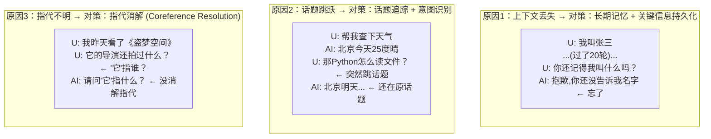

# 多轮对话的连贯性如何保持？

## 一、连贯性破坏的三大原因



## 二、保持连贯的三大机制

### 机制 1：上下文管理（防丢失）

```python
class CoherentContextManager:
    """保证关键信息不丢失"""
    
    def __init__(self):
        self.key_facts = {}  # 持久化的关键信息
        self.recent_window = []  # 滑动窗口
    
    def extract_key_facts(self, turn):
        """从对话中提取应持久化的关键信息"""
        facts = self.llm.extract(
            f"从以下对话提取关键信息（姓名/偏好/需求/决定）:\n{turn}"
        )
        # 例: {"user_name": "张三", "topic": "Python"}
        self.key_facts.update(facts)
    
    def build_context(self, current_query):
        """组装上下文，保证关键信息在"""
        context = []
        
        # 关键事实始终注入（防丢失）
        if self.key_facts:
            context.append({
                "role": "system",
                "content": f"已知信息: {self.key_facts}"
            })
        
        # 最近对话窗口
        context.extend(self.recent_window[-6:])
        
        # 检索相关历史
        relevant = self.memory.retrieve(current_query, top_k=3)
        context.extend([{"role": "system", 
                        "content": f"[相关历史]{m}"} for m in relevant])
        
        return context
```

### 机制 2：话题追踪（防跳跃）

```python
class TopicTracker:
    """追踪当前话题，识别话题切换"""
    
    def __init__(self):
        self.current_topic = None
        self.topic_history = []
    
    def update(self, user_message):
        """识别当前消息的话题"""
        # LLM判断：是新话题还是延续旧话题
        analysis = self.llm.analyze(
            f"当前话题: {self.current_topic}\n"
            f"用户消息: {user_message}\n"
            f"判断: 延续当前话题 / 切换到新话题 / 指代旧话题"
        )
        
        if analysis.is_topic_switch:
            # 记录旧话题，更新新话题
            self.topic_history.append(self.current_topic)
            self.current_topic = analysis.new_topic
        elif analysis.references_old_topic:
            # 指代旧话题，需要恢复上下文
            old = self.find_topic(analysis.referenced_topic)
            return {"type": "resume", "topic": old}
        
        return {"type": "continue", "topic": self.current_topic}
```

### 机制 3：指代消解（防不明）

```python
class CoreferenceResolver:
    """消解"他/她/它/这个/那个"等指代词"""
    
    def resolve(self, user_message, context):
        """把指代词替换为具体指代对象"""
        # 检测是否有未消解的指代
        has_pronoun = self.detect_pronoun(user_message)
        # 例: "它的导演" → 检测到"它"
        
        if not has_pronoun:
            return user_message
        
        # LLM结合上下文消解
        resolved = self.llm.resolve(
            f"对话历史: {context}\n"
            f"用户消息: {user_message}\n"
            f"请消解消息中的指代词（他/它/这个）"
        )
        # 例: "它的导演" → "《盗梦空间》的导演"
        
        return resolved
```

## 三、主动连贯机制

### 追问确认（不确定时）

```python
def handle_ambiguous(user_message, context):
    """不确定用户意图时，主动确认而非猜测"""
    if is_ambiguous(user_message, context):
        return {
            "type": "clarify",
            "response": "你是想问A还是B？"
        }
    # 不确定的"它"宁可问清楚，不要答错
```

### 话题切换提示

```python
def handle_topic_switch(new_topic, old_topic):
    """话题切换时，自然过渡"""
    return f"好的，我们聊{new_topic}。（之前我们在讨论{old_topic}，"
           f"需要的话可以随时回到那个话题）"
```

### 上下文回溯

```python
def handle_reference_to_old(reference, topic_history):
    """用户指代很久以前的话题"""
    # 找到相关历史
    old_context = find_in_history(reference, topic_history)
    # 注入上下文
    return {
        "type": "resume",
        "context": old_context,
        "response": f"你是指之前聊的{old_context.topic}吧？"
    }
```

## 四、连贯性评估

```
┌──────────────────────────────────────────────┐
│              连贯性评估维度                      │
├──────────────────────────────────────────────┤
│                                                │
│  1. 指代正确率                                  │
│     "它/他/这个"被正确理解的次数/总次数          │
│                                                │
│  2. 话题连续性                                  │
│     话题切换是否自然，无突兀跳跃                  │
│                                                │
│  3. 信息一致性                                  │
│     多轮间事实陈述是否矛盾                       │
│                                                │
│  4. 上下文利用率                                │
│     回复是否参考了之前的对话内容                  │
│                                                │
│  5. 任务推进性                                  │
│     多轮对话是否在推进任务（而非原地打转）        │
│                                                │
└──────────────────────────────────────────────┘

评估方法：
  - 人工评估（1-5分连贯性评分）
  - LLM-as-Judge（让强模型评估连贯性）
  - 自动指标（指代消解F1/话题追踪准确率）
```

## 五、常见不连贯场景与修复

| 场景 | 表现 | 修复 |
|------|------|------|
| 忘记用户信息 | "你叫什么？" 反复问 | 关键信息持久化 |
| 话题突兀 | 用户聊天气AI回Python | 话题追踪+意图识别 |
| 指代失败 | "它是什么？" 答非所问 | 指代消解 |
| 自相矛盾 | 前面说A后面说B | 一致性校验 |
| 原地打转 | 反复问同样问题 | 进度追踪+去重 |

## 六、面试加分点

1. **三大原因 + 三大对策**：结构化回答，体现体系
2. **强调"主动确认"**：不确定时追问比猜测更好——宁可慢一点也要连贯
3. **提"话题追踪"**：很多人忽略这点，但它是长对话连贯的关键

## 记忆要点

- 破坏连贯三主因：早期上下文丢失、突发话题跳跃、多轮指代不明（如“它”指代谁）
- 上下文防丢：LLM实时抽取核心事实存入系统提示词，结合记忆库按需检索历史
- 话题与指代：使用话题追踪器记录并识别跳转，利用LLM执行指代消解还原代词主语


## 苏格拉底式面试追问

> 这组追问模拟面试官层层逼问，每一问先回答"为什么"，再回答"怎么做"，最后回答"如何证明"。

### 第一层：目标与动机

**Q：多轮连贯性靠"上下文管理+话题追踪+指代消解"三招，为什么这三个就够？对话里还有别的影响连贯性的因素吗？**

这三招覆盖"连贯性"的三个核心断裂点。1）上下文断裂——忘了之前说过的话（上下文管理解决）；2）话题断裂——不知道当前在聊哪个话题/聊到哪了（话题追踪解决）；3）指代断裂——"他/它/那个"指代不清（指代消解解决）。其他因素：4）语气/角色断裂——Agent 突然换语气或角色（靠 system prompt 固定角色解决）；5）逻辑断裂——前后回复逻辑矛盾（靠一致性检测解决）；6）情感断裂——无视用户情绪变化（靠情感分析解决）。所以这三招是"信息连贯"的核心，语气/逻辑/情感是"风格/逻辑连贯"的补充，全套做才完整。但多数场景三招够用，后三个是锦上添花。

### 第二层：证据与定位

**Q：Agent 回复"前言不搭后语"（用户问 A 它答 B），怎么定位是上下文丢了、话题追踪错、还是指代没消解？**

看具体表现。1）如果回复完全偏离当前话题（如聊订单它回天气）——话题追踪错（误判当前话题）；2）如果回复相关但"忘了"前面的约束（如用户说"便宜的"它推荐贵的）——上下文丢了（约束没保留）；3）如果回复把"他"理解错对象（如用户说"他"指朋友，Agent 理解成另一个人）——指代消解失败。定位方法：看当前轮的 context 里"话题/约束/指代对象"是否正确，哪项错就是哪招失效。还要看是否 LLM 自身推理错（context 对但 LLM 没正确推理），区分"输入对输出错"（LLM 问题）和"输入就错"（连贯性机制问题）。

### 第三层：根因深挖

**Q：话题追踪（知道当前聊哪个话题、聊到哪了）具体怎么实现？是靠 LLM 每轮判断，还是用分类模型？**

两者结合。1）LLM 判断——每轮对话后让 LLM 提取"当前话题 + 话题进度"（如"话题=退货流程，进度=用户已申请待审核"），写入会话状态，下一轮 LLM 看这个状态保持连贯；优点是灵活（能处理复杂话题转换），缺点是成本（每轮额外 LLM 调用）；2）分类模型——训练一个话题分类器（如意图分类，输入 query 输出话题标签如"退货/咨询/投诉"），轻量快速，适合话题明确的场景；3）混合——分类模型做粗分类（识别大话题），LLM 做细追踪（话题内的进度和转换）。实务：固定业务场景（如客服）用分类器（话题有限，分类器准），开放域对话用 LLM（话题动态，分类器覆盖不了）。

**Q：指代消解（"他/它/那个"指谁）在多轮对话里最难，因为指代对象可能在几轮前。怎么做好长跨度指代消解？**

核心是"把指代对象显式记录在会话状态里"。1）实体追踪——每轮提取对话里的实体（人名/物名/概念），存入"实体表"（如 {user_friend: "小明", order: "#12345"}），指代词"他"优先匹配最近的男性实体（"小明"）；2）共指消解——用模型（如 LLM 或专门的核心ference resolution 模型）判断"他"指代哪个实体，结合性别/单复数/语义约束；3）长跨度——如果指代对象在 5 轮前，context 可能截断了，要从会话状态的实体表里恢复（而非依赖 context 里的原文）。验证：构造含长跨度指代的测试集（如第 1 轮提"小明"，第 8 轮问"他怎样了"），看 Agent 是否正确指代。

### 第四层：方案权衡

**Q：多轮连贯性的三招都要做，开销不小（每轮可能额外调 LLM 做话题追踪/指代消解），怎么平衡连贯性和成本？**

按业务对"连贯性"的要求分级。1）高要求（如专业咨询/客服）——全套三招 + 额外 LLM 调用，成本可接受（连贯性差会导致用户体验差、流失）；2）中等要求（如闲聊助手）——轻量版（话题追踪用分类器而非 LLM，指代消解用规则+小模型，上下文管理用滑动窗口），成本可控；3）低要求（如单次问答）——不做连贯性管理（单轮无需连贯）。分级后，高要求场景的额外成本是值得的（连贯性带来的用户留存价值 > 成本），低要求场景不强求。还可以"选择性增强"——检测到"潜在断裂"（如检测到指代词"他"）时才触发指代消解，非每轮都做，降成本。

**Q：连贯性靠 context 管理（带历史）是最直接的，为什么还要单独搞话题追踪和指代消解？context 带够了 LLM 自己不会推理吗？**

LLM 在 context 足够时能自己追踪话题和消解指代，但有上限。1）context 截断——长对话的早期信息被截断，LLM 看不到，无法追踪/消解（必须靠外部状态恢复）；2）attention 稀释——即使 context 里有，长 context 下 LLM 的 attention 可能没聚焦到关键信息（如指代对象在 context 中间，被稀释），导致"信息在那但没用"；3）复杂指代——多个候选指代对象时（如对话里出现过 3 个男性），LLM 可能选错，专门的指代消解模块（结合更多约束/规则）更准。所以 context 管理（让信息可得）+ 话题追踪/指代消解（让信息被正确使用）是两层保障，互补而非冗余。

### 第五层：验证与沉淀

**Q：你怎么衡量多轮对话的连贯性，而不是"感觉还算连贯"的模糊判断？**

设计连贯性评测集和指标。1）评测集——构造含特定断裂风险的对话（长跨度指代/话题转换/早期约束），每个对话人工标注"正确回复应该体现的连贯要素"（如应该指代 X、应该遵守约束 Y）；2）指标——指代消解准确率（正确识别指代对象的比例）、约束遵守率（遵守早期约束的比例）、话题连贯性（回复是否切题，用 LLM-as-Judge 评分）；3）用户体感——连贯性投诉率（用户反馈"答非所问/忘了我说过什么"的比例），应 <5%。三个层面交叉验证，连贯性达阈值（指代准确率 >85%、约束遵守率 >90%）才算合格。

**Q：多轮连贯性的三招怎么沉淀成框架能力？**

封装成 CoherenceManager 组件：1）上下文管理（复用 ContextManager）——分层截断/摘要/检索；2）话题追踪——内置分类器（粗分类）+ LLM（细追踪）双模式，自动记录话题状态；3）指代消解——实体追踪表 + 共指消解模型，自动解析指代词；4）一致性检测——检测当前回复与前轮的矛盾（embedding/规则），矛盾时告警或重答。开发者配置"连贯性级别（高/中/低）"，框架自动启用对应强度的三招。这套写入团队对话框架 SOP，新对话系统接入即具备连贯性保障，不重写追踪/消解逻辑。

## 结构化回答

**30 秒电梯演讲：** 多轮连贯性=让Agent"记得之前说过什么、在聊什么"。靠上下文管理(不丢关键信息)+话题追踪(知道聊到哪)+指代消解(他/它指谁)三招保证。

**展开框架：**
1. **三大原因** — 上下文丢失/话题跳跃/指代不明
2. **对策** — 上下文管理+话题追踪+指代消解
3. **主动机制** — 追问确认+话题切换提示

**收尾：** 您想深入聊：怎么检测不连贯？——LLM评估+话题偏离检测+指代未消解检测？


## 视频脚本

> 预计时长：4 分钟 | 由浅入深


| 时间 | 画面/字幕 | 口播台词 | 讲解要点 |
|------|----------|----------|----------|
| 0:00 | 标题卡：多轮对话的连贯性如何保持？ | "像聊天——连贯就是接得住话，你提"那个电影"我知道指上次聊的，不会突兀跳话题。" | 开场钩子 |
| 0:20 | 核心概念图 | "多轮连贯性=让Agent"记得之前说过什么、在聊什么"。靠上下文管理(不丢关键信息)+话题追踪(知道聊到哪)+指代消解(…" | 核心定义 |
| 0:50 | 三大原因示意图 | "三大原因——上下文丢失/话题跳跃/指代不明" | 要点拆解1 |
| 1:30 | 对比/实战案例图 | "对比一下常见误区和工程实践，看真实场景里怎么取舍。" | 实战与对比 |
| 2:20 | 总结卡 | "记住核心要点。下期我们追问：怎么检测不连贯？——LLM评估+话题偏离检测+指代未消解检测？" | 收尾与钩子 |
