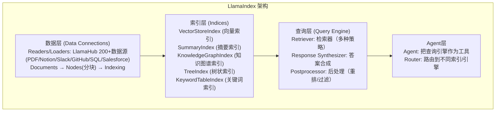

# LlamaIndex 在 RAG 系统中的架构？

## 一、LlamaIndex 定位

```
LlamaIndex = 专注"数据"的LLM框架

核心理念：连接你的数据与LLM
  你的数据(PDF/DB/API/网页) → LlamaIndex → LLM

vs LangChain:
  LangChain: 通用LLM应用框架（Agent/对话/RAG/工具都做）
  LlamaIndex: 数据/RAG专精（索引/检索/查询做到极致）
```

## 二、核心架构



## 三、LlamaIndex 的 RAG 优势

### 1. 丰富的数据连接器

```python
from llama_hub import (
    PDFReader, NotionPageReader, GitHubRepoReader,
    SlackReader, SalesforceReader, DatabaseReader
)

# LlamaHub有200+数据源连接器
# 几乎所有常见数据源都有现成的Reader
docs = NotionPageReader(integration_token="...").load_data(page_ids=[...])
```

### 2. 多种索引类型

```python
from llama_index import (
    VectorStoreIndex,     # 向量索引（最常用）
    SummaryIndex,         # 遍历所有节点（适合全量问答）
    KnowledgeGraphIndex,  # 知识图谱（多跳推理）
    TreeIndex,            # 树状索引（长文档摘要）
)

# 不同索引适合不同场景
# 可以组合使用
```

### 3. 灵活的检索器

```python
from llama_index import (
    VectorIndexRetriever,      # 向量检索
    BM25Retriever,             # 关键词检索
    QueryFusionRetriever,      # 多查询融合
)

# 混合检索（LlamaIndex原生支持）
hybrid_retriever = QueryFusionRetriever(
    retrievers=[vector_retriever, bm25_retriever],
    similarity_top_k=5,
    mode="reciprocal_rerank"  # RRF融合
)
```

### 4. 高级查询引擎

```python
from llama_index import (
    RetrieverQueryEngine,
    SubQuestionQueryEngine,  # 子问题分解
    RouterQueryEngine,       # 路由到不同引擎
    FLAREQueryEngine,        # 前瞻+回顾的迭代检索
)

# SubQuestionQueryEngine: 复杂问题分解
engine = SubQuestionQueryEngine.from_defaults(query_engine_tools=[
    Tool(engine=sales_engine, name="销售数据"),
    Tool(engine=hr_engine, name="人事数据"),
])
# "对比销售和人事的离职率" → 分解为两个子问题分别查
```

## 四、LlamaIndex vs LangChain（RAG 场景）

| 维度 | LangChain | LlamaIndex |
|------|-----------|------------|
| **数据连接器** | 多但分散 | LlamaHub更全更专业 |
| **索引类型** | 主要是向量 | 向量/摘要/图/树多种 |
| **检索器** | 基础 | 更丰富(融合/子问题/路由) |
| **RAG深度** | 中 | 深（专精） |
| **Agent能力** | 强 | 中 |
| **生态** | 大 | RAG圈更专业 |

```
选型建议：
  重RAG（知识库/文档问答）→ LlamaIndex
  重Agent（工具调用/多步推理）→ LangChain/LangGraph
  两者结合：LlamaIndex做检索，LangChain做编排
```

## 五、面试加分点

1. **定位区别**：LangChain 通用，LlamaIndex 专注 RAG——各有所长
2. **索引多样性**：LlamaIndex 不只是向量索引，还有图/树/摘要——这是深度优势
3. **数据连接器**：LlamaHub 200+数据源，企业数据接入更方便

## 记忆要点

- 核心定位：专注“数据连接”的RAG专精框架（LangChain偏通用综合）
- 三层核心架构：数据层(200+数据连接器) → 索引层(多结构索引) → 查询层(检索合成)
- 五大索引结构：向量、摘要、知识图谱(多跳)、树状、关键词，满足不同检索推理需求


## 苏格拉底式面试追问

> 这组追问模拟面试官层层逼问，每一问先回答"为什么"，再回答"怎么做"，最后回答"如何证明"。

### 第一层：目标与动机

**Q：LlamaIndex 是"RAG 专用手术刀"（专注 RAG），LangChain 是"瑞士军刀"（通用），为什么 RAG 场景要用 LlamaIndex 而非 LangChain？**

因为专注带来深度。1）数据接入——LlamaIndex 原生支持 100+ 数据源（数据库/API/文件/应用），且深度（如支持 SQL 知识图谱/文档层级），LangChain 也有 Loader 但广度深度不如；2）索引构建——LlamaIndex 提供多种索引（向量/树/关键词/知识图谱/多模态），且针对 RAG 优化（如树的层级索引适合长文档），LangChain 的索引抽象更基础；3）检索优化——LlamaIndex 内置高级检索（如递归检索/子问题检索/多文档检索），RAG 专用优化深，LangChain 要自己组合；4）抽象贴合——LlamaIndex 的抽象（Index/Query Engine/Response Synthesizer）专为 RAG 设计，贴合 RAG 流程，LangChain 的 Chain 更通用（也做 Agent/其他）。所以重 RAG 场景（如企业知识库/文档问答）LlamaIndex 深度优，通用场景（Agent/多工具）LangChain 广度优。

### 第二层：证据与定位

**Q：用 LlamaIndex 搭的 RAG 效果不对（召回差/答案错），怎么定位是 LlamaIndex 用错还是底层（embedding/LLM）问题？**

绕过框架直测。1）embedding——直接用 embedding 模型编码 query/文档，算相似度，看是否合理（相关文档相似度高于不相关的），不合理是 embedding 问题；2）LLM——直接调 LLM（给同样检索结果+prompt），看输出对不对，错是 LLM 问题；3）LlamaIndex 组件——如果底层对但 LlamaIndex 应用错，查 LlamaIndex 配置（如 Index 类型选错/Query Engine 参数错/Response Synthesizer 的 prompt 错），用 LlamaIndex 的 debug 模式打印中间步骤；4）数据——检查文档是否正确加载/解析/分块（如 PDF 解析丢内容/分块碎了）。定位方法：从底层往外测（embedding/LLM→LlamaIndex 组件→应用），找第一层出错的。常见根因：Index 类型不适配（如该用树索引用了向量）、Query Engine 的 retriever 参数错（如 similarity_top_k 太小）、Response Synthesizer 没用好检索结果。

### 第三层：根因深挖

**Q：LlamaIndex 的 Query Engine 是核心（查询引擎），不同 Query Engine（如 RetrieverQueryEngine/SubQuestionQueryEngine/RecursiveQueryEngine）怎么选？**

按 query 特性选。1）RetrieverQueryEngine——单次检索+生成，适合"简单 query"（如"X 的价格"，一次检索够），基础通用；2）SubQuestionQueryEngine——把复杂 query 拆成多个子问题，分别查询再综合，适合"复合 query"（如"对比 X 和 Y 的优缺点"，拆成"X 优缺点""Y 优缺点"分别查，再综合对比）；3）RecursiveQueryEngine——递归查询（先查高层，信息不够再深入查子节点），适合"层级文档"（如"手册的某章节细节"，先查章节索引定位，再查该章节的详细块）；4）路由——用 RouterQueryEngine 让 LLM 选 query engine（简单 query 走 Retriever，复合走 SubQuestion），动态适配。选型：简单用 Retriever，复合用 SubQuestion，层级用 Recursive，混合用 Router。原则：按 query 复杂度和文档结构选，匹配查询模式。

**Q：LlamaIndex 的"高级检索"（如递归检索/子问题检索）比基础检索好，但更复杂，什么时候值得用？**

按 query 复杂度和效果要求。1）基础检索——简单 query（单意图/单文档）用基础（向量检索 top-K），够用且简单；2）递归检索——文档有层级（如手册的章-节-段）且 query 要深入细节时用（先粗检索定位章节，再细检索该章节块），召回准（不漏细节）；3）子问题检索——复合 query（多意图/需对比）用（拆子问题分别查，综合），召回全（每个方面都查到）；4）值不值得——高级检索效果好但复杂（实现+调试+延迟），简单 query 用是大材小用（基础够），复杂 query 才值得（基础召回不全）。判断：query 简单/效果要求中→基础；query 复杂/效果要求高→高级。实务：默认基础（覆盖简单），检测到复杂 query（分类器/LLM 判断）升级到高级，按需分配复杂度。

### 第四层：方案权衡

**Q：LlamaIndex 和 LangChain 都能做 RAG，选哪个？能否混用？**

按场景侧重选，可混用。1）重 RAG——企业知识库/文档问答/数据分析等以检索为核心的场景，LlamaIndex 深度优（索引/检索/查询引擎专为 RAG），选 LlamaIndex；2）通用/Agent——多工具 Agent/复杂工作流/非 RAG 为主的场景，LangChain 广度优（Agent/Chain 生态全），选 LangChain；3）混用——RAG 部分（检索/索引）用 LlamaIndex，Agent 编排/工具调用用 LangChain，两者互补（LlamaIndex 的 QueryEngine 可作为 LangChain 的工具），但混用要处理两套抽象（学习成本）；4）选型简化——如果团队熟 LangChain，全用 LangChain（RAG 够用，虽不如 LlamaIndex 深）；如果 RAG 是核心且要极致优化，用 LlamaIndex。原则：RAG 核心用 LlamaIndex，通用用 LangChain，混用看团队和场景。

**Q：LlamaIndex 专注 RAG 深度好，但"专注"也意味着 Agent/工具调用等不如 LangChain，RAG+Agent 混合场景怎么办？**

组合或选通用框架。1）LlamaIndex 的 Agent——LlamaIndex 也有 Agent 能力（如可以定义工具让 Agent 调用 QueryEngine），虽然不如 LangChain 深但够用，RAG+轻量 Agent 用 LlamaIndex 一站式；2）LangChain+LlamaIndex——RAG 用 LlamaIndex（QueryEngine），作为工具接入 LangChain Agent，Agent 编排用 LangChain，两者各取所长（但两套抽象）；3）选通用——如果 Agent 重（多工具/复杂工作流），用 LangChain 的 RAG（虽不如 LlamaIndex 深但统一抽象），简化技术栈；4）权衡——RAG 深度（LlamaIndex）vs 技术栈统一（LangChain），按 RAG 重要性选。实务：RAG 核心+轻 Agent 用 LlamaIndex（一站式），RAG+重 Agent 用 LangChain（统一）或混用（各取所长）。

### 第五层：验证与沉淀

**Q：你怎么衡量 LlamaIndex 是否选对（相比 LangChain/自己写，RAG 效果和开发效率）？**

AB 对比。1）开发效率——同 RAG 需求，用 LlamaIndex vs LangChain vs 自己写的搭建时间，LlamaIndex 在 RAG 场景应最快（专用组件）；2）效果——同评估集，三者的 Recall@K/答案准确率，LlamaIndex 在 RAG 应持平或更好（专用优化）；3）维护——LlamaIndex 的抽象/依赖 vs 其他，维护成本对比；4）灵活——LlamaIndex 的限制（RAG 专注，Agent 弱）vs 其他。综合：RAG 场景开发快+效果好+维护可接受+灵活够 = LlamaIndex 选对。如果场景偏 Agent（非 RAG），LlamaIndex 的 Agent 弱可能不合适，LangChain 更好。

**Q：LlamaIndex 的使用经验怎么沉淀成团队的 RAG 开发能力？**

建团队 RAG 规范：1）最佳实践——文档化 LlamaIndex 各场景用法（如 Index 类型选择/Query Engine 选型/Response Synthesizer 调优），新人按手册；2）组件封装——把常用 RAG 模式封装（如"企业知识库 QueryEngine"含混合检索+rerank+引用），复用；3）模板——RAG 项目模板（含数据接入/索引/检索/生成/评估），脚手架搭建；4）评估集成——LlamaIndex 应用接评估集（RAGAS/自建），持续评估；5）案例库——真实 RAG 案例（如"企业文档问答用 LlamaIndex"），经验复用。这套写入团队 RAG 开发 SOP，让"用 LlamaIndex 搭 RAG"从"每人摸索"变成"规范+复用"，标准化高效产出。

## 结构化回答

**30 秒电梯演讲：** LlamaIndex是专注RAG的框架，在"数据接入/索引构建/检索优化"上比LangChain更深。如果说LangChain是"瑞士军刀"，LlamaIndex是"RAG专用手术刀"。

**展开框架：**
1. **定位** — 专注数据框架/RAG
2. **核心** — 数据连接/索引/查询引擎
3. **优势** — RAG相关功能更深更全

**收尾：** 您想深入聊：LlamaIndex能做Agent吗？——能，但不如LangChain/LangGraph？


## 视频脚本

> 预计时长：4 分钟 | 由浅入深


| 时间 | 画面/字幕 | 口播台词 | 讲解要点 |
|------|----------|----------|----------|
| 0:00 | 标题卡：LlamaIndex 在 RAG 系统中的架构？ | "LangChain像多功能瑞士军刀(啥都能干)，LlamaIndex像专业手术刀(RAG这…" | 开场钩子 |
| 0:20 | 核心概念图 | "LlamaIndex是专注RAG的框架，在"数据接入/索引构建/检索优化"上比LangChain更深。如果说…" | 核心定义 |
| 0:50 | 定位示意图 | "定位——专注数据框架/RAG" | 要点拆解1 |
| 1:30 | 对比/实战案例图 | "对比一下常见误区和工程实践，看真实场景里怎么取舍。" | 实战与对比 |
| 2:20 | 总结卡 | "记住核心要点。下期我们追问：LlamaIndex能做Agent吗？——能，但不如Lang？" | 收尾与钩子 |
