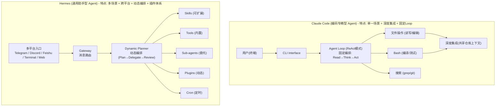

# 对比Claude Code和Hermes在设计模式上的区别

## 🎯 本质

两个Agent框架服务于不同场景：Claude Code专为**编码场景**优化（确定性流程+深度集成），Hermes专为**通用助手场景**设计（灵活编排+跨平台）。设计模式的差异源于场景约束的不同。

## 🧒 费曼类比

Claude Code = F1赛车（在赛道上极致性能，配件高度定制化）；Hermes = 多功能越野车（不同地形灵活切换，可加装各种配件）。

## 📊 架构对比图



## 🔧 核心设计差异

### 1. 编排策略（Orchestration）

| 维度 | Claude Code | Hermes |
|------|-------------|--------|
| **编排模式** | 固定ReAct Loop | 动态Plan→Delegate→Review |
| **流程确定性** | 高（每次都走Think→Act循环） | 灵活（根据任务复杂度选择策略） |
| **并行能力** | 有限（单线程编码） | 强（subagent并行委派） |
| **错误恢复** | 自动重试+修正 | 升级+回退+人工介入 |

### 2. 工具集成

```python
# Claude Code: 深度集成少数工具
tools = {
    'file_read': '整个仓库的文件读取',
    'file_write': '精确的文件编辑(diff-based)',
    'bash': '编译/测试/lint一体化',
    'search': 'ripgrep代码搜索'
}
# 工具之间共享上下文(如当前文件、仓库结构)

# Hermes: 广度集成多种工具集
toolsets = {
    'terminal': 'Shell命令执行',
    'browser': 'Playwright浏览器自动化',
    'web': 'Web搜索+页面提取',
    'github': 'GitHub MCP',
    'feishu': '飞书文档操作',
    'spotify': '音乐控制',
    'homeassistant': '智能家居',
    # ...通过Plugins/Skills无限扩展
}
# 工具之间通过Agent上下文松耦合
```

### 3. 扩展性设计

```
Claude Code 扩展:
  CLAUDE.md → 项目级指令注入
  Slash Commands → 自定义命令
  (扩展性相对有限，聚焦编码)

Hermes 扩展:
  Skills/ → 可复用的工作流知识 (markdown)
  Plugins/ → 第三方功能模块
  MCP Servers → 外部工具协议
  Cron Jobs → 定时任务
  Sub-agents → 并行任务委派
  (高度可扩展，设计为平台)
```

### 4. 场景适配

| 场景 | Claude Code | Hermes |
|------|-------------|--------|
| **代码编写/调试** | ⭐⭐⭐⭐⭐ 深度优化 | ⭐⭐⭐ 可用但非专精 |
| **多平台交互** | ⭐ 不支持 | ⭐⭐⭐⭐⭐ 核心能力 |
| **定时任务** | ⭐ 不支持 | ⭐⭐⭐⭐⭐ 内置Cron |
| **Web自动化** | ⭐ 不支持 | ⭐⭐⭐⭐ 浏览器集成 |
| **多Agent协作** | ⭐ 不支持 | ⭐⭐⭐⭐ Sub-agent委派 |

## 💡 例子：处理同一个任务的差异

**任务："修复项目中的一个bug并提交PR"**

**Claude Code流程**：
```
1. 读取bug描述 → 分析代码 → 定位问题
2. 编辑文件(precise diff) → 运行测试
3. 测试通过 → git commit → git push
   (全程在终端内闭环完成)
```

**Hermes流程**：
```
1. 接收消息(可能来自飞书/Telegram)
2. Plan: 拆分为"定位bug" + "修复代码" + "提交PR"
3. Delegate: spawn subagent处理代码修复
4. 同时: 用GitHub MCP创建PR描述
5. 消息通知用户: "PR已创建: <link>"
6. 设置Cron: 定时检查CI状态
   (跨平台+多工具+并行)
```

## ❓ 苏格拉底式面试追问

1. **"为什么Claude Code不做跨平台？是技术限制还是产品选择？"**
   → 产品选择。聚焦编码场景做到极致，跨平台会稀释深度集成的价值。这是"专精 vs 通用"的经典取舍

2. **"Hermes的动态编排具体是怎么实现的？"**
   → Planner模块分析任务→选择策略(直接执行/拆分委派/定时调度)→Executor执行→Review验证。核心是任务复杂度路由

3. **"如果让你设计一个新的Agent框架，你会选择哪种模式？"**
   → 取决于目标场景。如果是垂直领域(如数据分析)，选Claude Code模式做深度集成；如果是通用平台，选Hermes模式做生态扩展

4. **"这两种框架在安全性设计上有什么区别？"**
   → Claude Code: 依赖仓库权限(分支保护/CI门禁) → Hermes: 分级权限(操作白名单+审批流+跨profile隔离)

## 结构化回答

**30 秒电梯演讲：** Claude Code是"编译时确定流程+IDE深度集成"的编码Agent，Hermes是"运行时动态决策+多平台通信"的通用Agent。前者像自动挡汽车(路线确定，操作简化)，后者像越野车(路线灵活，适应复杂地形)。

**展开框架：**
1. **Claude Code** — 单一场景(编码) + 深度集成(IDE/REPL) + 编排可控(Fixed Loop)
2. **Hermes** — 多场景(通用) + 多平台(消息/终端/浏览器) + 动态编排(Planner-Executor)
3. **设计哲学差异** — 专精 vs 通用 / 确定性 vs 灵活性

**收尾：** 您想深入聊：如果让Hermes支持编码场景，需要做哪些改造？


## 视频脚本

> 预计时长：5 分钟 | 由浅入深


| 时间 | 画面/字幕 | 口播台词 | 讲解要点 |
|------|----------|----------|----------|
| 0:00 | 标题卡：对比Claude Code和Hermes在设计模… | "Claude Code像F1赛车的精密调校——在赛道(代码仓库)上追求极致性能；…" | 开场钩子 |
| 0:20 | 核心概念图 | "Claude Code是"编译时确定流程+IDE深度集成"的编码Agent，Hermes是"运行时动态决策+多平台通信"…" | 核心定义 |
| 0:50 | Claude Code示意图 | "Claude Code——单一场景(编码) + 深度集成(IDE/REPL) + 编排可控(Fixed Loop)" | 要点拆解1 |
| 1:30 | Hermes示意图 | "Hermes——多场景(通用) + 多平台(消息/终端/浏览器) + 动态编排(Planner-Executor)" | 要点拆解2 |
| 2:20 | 对比/实战案例图 | "对比一下常见误区和工程实践，看真实场景里怎么取舍。" | 实战与对比 |
| 3:10 | 总结卡 | "记住核心要点。下期我们追问：如果让Hermes支持编码场景，需要做哪些改造？" | 收尾与钩子 |
