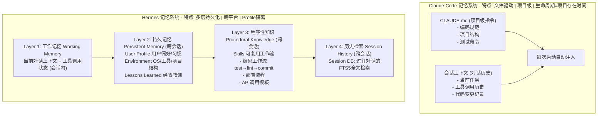

# Claude Code和Hermes在记忆系统上的差别

## 🎯 本质

两种记忆系统反映了不同的使用模式：Claude Code聚焦**项目级上下文**（轻量文件驱动），Hermes构建**多层级持久体系**（跨会话跨平台）。

## 🧒 费曼类比

Claude Code = 项目文件夹上的便利贴（每次打开项目就看到，简单有效）；Hermes = 个人笔记本+云端同步（分用户偏好/环境/工作/技能多分区，走到哪带到哪）。

## 📊 记忆系统对比



## 🔧 核心差异详解

### 1. 生命周期对比

| 记忆类型 | Claude Code | Hermes | 生命周期 |
|---------|-------------|--------|---------|
| **项目指令** | CLAUDE.md | Skills + Config | 永久（文件存在） |
| **用户偏好** | 不持久化 | Memory(user) | 永久（跨会话） |
| **环境信息** | 不持久化 | Memory(memory) | 永久（跨会话） |
| **会话上下文** | 对话历史 | Session上下文 | 会话内 |
| **历史搜索** | 不支持 | Session DB(FTS5) | 永久（可检索） |

### 2. 触发机制对比

```python
# Claude Code: 被动注入
# 启动时自动读取CLAUDE.md → 注入System Prompt
# 会话中不主动记忆(除非用户手动写入CLAUDE.md)

# Hermes: 主动+被动
# 被动: 每轮注入Memory + Skills
# 主动: Agent可以自行写入Memory
def hermes_memory_flow():
    # 每轮对话开始
    system_prompt += load_memory(user_profile)
    system_prompt += load_memory(environment)
    system_prompt += load_relevant_skills(task)
    
    # 对话过程中
    if user_says_remember_something:
        memory.add(target='user', content=...)
    
    if discovered_new_environment_fact:
        memory.add(target='memory', content=...)
    
    if complex_workflow_succeeded:
        skill_manage(action='create', ...)
```

### 3. 记忆隔离

```
Claude Code: 单一上下文，无隔离需求(单用户单项目)

Hermes: 多Profile隔离
~/./profiles/
  ├── default/     ← 默认profile
  │   ├── memories/
  │   ├── skills/
  │   └── cron/
  ├── work/        ← 工作profile(不同记忆/技能)
  │   ├── memories/
  │   └── skills/
  └── personal/    ← 个人profile
      └── memories/
```

### 4. 记忆管理的取舍

| 维度 | Claude Code(简单) | Hermes(复杂) | 取舍 |
|------|-------------------|-------------|------|
| 实现复杂度 | 低(文件读取) | 高(多层存储+检索) | 简单=可靠 |
| 跨会话能力 | 弱(只CLAUDE.md) | 强(全量持久化) | 强=用户体验好 |
| Token开销 | 低(只注入1文件) | 高(注入多层记忆) | 低=成本低 |
| 适用场景 | 单一编码场景 | 多平台长期助手 | 不同场景不同需求 |

## 💡 例子

**场景：用户连续3天使用Agent处理不同任务**

**Claude Code**：
- Day 1: 编码任务A → 使用CLAUDE.md中的项目规范 → 结束
- Day 2: 编码任务B → 同样的CLAUDE.md → 不知道Day 1做过什么
- Day 3: 非编码任务 → 不支持（只能在终端编码场景）

**Hermes**：
- Day 1: 记住"用户偏好用pytest" + 记住"项目用Docker部署"
- Day 2: 自动应用偏好 + 回忆Day 1的工作(通过Session Search)
- Day 3: 飞书上收到消息 → 用记忆中的项目信息回答 → 创建定时任务

## ❓ 苏格拉底式面试追问

1. **"Hermes的记忆系统会不会越来越臃肿，影响性能？"**
   → 需要记忆衰减机制：定期评估记忆价值(频率×重要度)，淘汰低价值条目。Memory有字数上限(如2200 chars)

2. **"不同场景需要不同的记忆设计，能具体举例吗？"**
   → 编码Agent：需要记住项目结构和编码规范(文件级足够) → 客服Agent：需要记住用户画像和历史工单(需DB+检索) → 运维Agent：需要记住告警模式和处理经验(需时序+关联)

3. **"记忆和RAG知识库有什么区别？"**
   → 记忆 = Agent自身经验的积累(个性化、动态更新) → RAG = 外部知识的检索(通用性、静态为主) → 两者互补：记忆指导"怎么做"，RAG提供"知道什么"

4. **"如果记忆中有错误信息怎么办？"**
   → 记忆校验机制：定期审查 + 用户可手动删除 + Agent发现矛盾时主动更新 + Skill版本管理

## 结构化回答

**30 秒电梯演讲：** Claude Code的记忆是"项目级文件注入"(CLAUDE.md)，轻量但局限在单仓库；Hermes的记忆是"多层级持久化系统"(Memory+Skill+Session+Config)，跨会话跨平台但管理复杂。

**展开框架：**
1. **Claude Code** — 项目级CLAUDE.md + 会话上下文 → 轻量、文件驱动
2. **Hermes** — Memory(持久) + Skills(程序性) + Session(会话) + Profile(隔离) → 多层
3. **设计维度** — 生命周期(临时/持久) + 粒度(全局/项目/会话) + 触发(主动/被动)

**收尾：** 您想深入聊：Agent的记忆应该永远保留吗？什么时候应该遗忘？


## 视频脚本

> 预计时长：5 分钟 | 由浅入深


| 时间 | 画面/字幕 | 口播台词 | 讲解要点 |
|------|----------|----------|----------|
| 0:00 | 标题卡：Claude Code和Hermes在记忆系统上… | "Claude Code像便利贴——贴在项目文件夹上，每次打开就看到，简单有效但只在这一个地…" | 开场钩子 |
| 0:20 | 核心概念图 | "Claude Code的记忆是"项目级文件注入"(CLAUDE.md)，轻量但局限在单仓库；Hermes的记忆是"多层级…" | 核心定义 |
| 0:50 | Claude Code示意图 | "Claude Code——项目级CLAUDE.md + 会话上下文 → 轻量、文件驱动" | 要点拆解1 |
| 1:30 | Hermes示意图 | "Hermes——Memory(持久) + Skills(程序性) + Session(会话) + Profile(隔离) → 多层" | 要点拆解2 |
| 2:20 | 对比/实战案例图 | "对比一下常见误区和工程实践，看真实场景里怎么取舍。" | 实战与对比 |
| 3:10 | 总结卡 | "记住核心要点。下期我们追问：Agent的记忆应该永远保留吗？什么时候应该遗忘？" | 收尾与钩子 |
