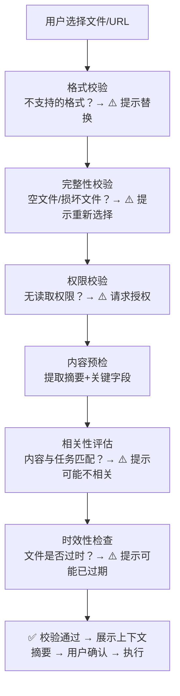

# 【月之暗面面经】如果用户给了错误的文件上下文，前端怎样尽早发现并提示？

## 一、上下文错误的常见类型

| 错误类型 | 示例 | 影响 | 检测难度 |
|---------|------|------|---------|
| 格式不支持 | 给了.doc但Agent只支持.md/.pdf | 直接失败 | 容易 |
| 文件为空 | 0KB的文件 | AI无法提取信息 | 容易 |
| 权限缺失 | 没有目录读取权限 | 无法索引 | 容易 |
| 内容过期 | 用了2022年的报告分析2024年市场 | 结果不准确 | 中等 |
| 语言不匹配 | 给了日文文件但要求中文分析 | 翻译质量差 | 中等 |
| 格式混乱 | PDF是扫描件而非文字版 | OCR可能出错 | 中等 |
| 内容不相关 | 给了菜谱文件要求做代码审查 | 完全跑题 | 困难 |
| 文件损坏 | PDF损坏无法打开 | 直接失败 | 容易 |

## 二、前置校验流水线



## 三、上下文摘要展示

```
┌──────────────────────────────────────────────────────────────────┐
│  📋 执行前确认                                                     │
├──────────────────────────────────────────────────────────────────┤
│                                                                  │
│  任务：分析竞品定价策略                                            │
│                                                                  │
│  📥 引用的素材（3个）：                                            │
│                                                                  │
│  ┌──────────────────────────────────────────────────────────┐   │
│  │ 📄 竞品分析报告Q3.pdf                       ✅ 格式正确    │   │
│  │ 摘要：2024年Q3季度竞品市场分析报告                          │   │
│  │ 关键字段：                                                │   │
│  │   • 产品：Notion, 飞书, 语雀                              │   │
│  │   • 定价：$0-$15/人/月                                    │   │
│  │ ⚠️ 时效提醒：此文件是Q3报告(3个月前)，Q4数据可能有变化       │   │
│  │ [ 更换为最新文件 ]                                        │   │
│  ├──────────────────────────────────────────────────────────┤   │
│  │ 🌐 https://notion.so/pricing              ✅ 可访问      │   │
│  │ 摘要：Notion定价页面，4个套餐                              │   │
│  ├──────────────────────────────────────────────────────────┤   │
│  │ 📸 竞品截图.png                             ✅ 格式正确    │   │
│  │ OCR：飞书首页突出"免费"标签                                │   │
│  └──────────────────────────────────────────────────────────┘   │
│                                                                  │
│  ⚠️ 注意事项：                                                   │
│  • Q3报告可能不包含最新的Q4数据，结果可能有时效性偏差              │
│  • 建议补充最新的定价页面URL                                      │
│                                                                  │
│  Token预估：8,420 / 128,000 (6.6%)                              │
│                                                                  │
│  [ 确认执行 ]  [ 补充素材 ]  [ 替换过期文件 ]  [ 取消 ]          │
└──────────────────────────────────────────────────────────────────┘
```

## 四、校验器实现

```typescript
class ContextValidator {
  async validate(input: AgentInput): Promise<ValidationResult> {
    const issues: ValidationIssue[] = [];
    
    for (const ref of input.inputRefs) {
      // 1. 格式校验
      const formatIssue = this.checkFormat(ref);
      if (formatIssue) issues.push(formatIssue);
      
      // 2. 完整性校验
      const integrityIssue = await this.checkIntegrity(ref);
      if (integrityIssue) issues.push(integrityIssue);
      
      // 3. 权限校验
      const permissionIssue = await this.checkPermission(ref);
      if (permissionIssue) issues.push(permissionIssue);
      
      // 4. 内容预检
      const contentSummary = await this.summarize(ref);
      
      // 5. 相关性评估
      const relevanceIssue = this.checkRelevance(contentSummary, input.rawInput);
      if (relevanceIssue) issues.push(relevanceIssue);
      
      // 6. 时效性检查
      const freshnessIssue = this.checkFreshness(ref);
      if (freshnessIssue) issues.push(freshnessIssue);
    }
    
    return {
      passed: issues.every(i => i.severity !== 'blocker'),
      issues,
      summaries: contentSummaries,
    };
  }
  
  // 相关性评估——检查文件内容是否与任务相关
  private checkRelevance(summary: string, taskInput: string): ValidationIssue | null {
    const relevance = this.computeRelevance(summary, taskInput);
    
    if (relevance < 0.3) {
      return {
        severity: 'warning',
        type: 'irrelevant-content',
        message: `此文件内容可能与任务不相关（相关度 ${Math.round(relevance * 100)}%）`,
        suggestion: '确认此文件是否正确，或更换更相关的文件',
      };
    }
    
    return null;
  }
  
  // 时效性检查
  private checkFreshness(ref: InputRef): ValidationIssue | null {
    if (ref.metadata?.createdAt) {
      const age = Date.now() - ref.metadata.createdAt;
      const daysOld = age / (1000 * 60 * 60 * 24);
      
      if (daysOld > 90) {
        return {
          severity: 'warning',
          type: 'stale-content',
          message: `此文件创建于${Math.round(daysOld)}天前，内容可能已过时`,
          suggestion: '考虑更新为最新的数据源',
        };
      }
    }
    
    return null;
  }
}
```

## 五、快速替换流程

```typescript
// 用户发现问题后，可以快速替换素材
async function quickReplace(oldRefId: string): Promise<void> {
  // 弹出文件选择器
  const newPath = await showFilePicker({
    title: '替换文件',
    buttonLabel: '选择替换文件',
    properties: ['openFile'],
  });
  
  if (newPath) {
    // 校验新文件
    const validation = await validator.validateFile(newPath);
    
    if (validation.passed) {
      // 替换引用
      contextStore.replaceRef(oldRefId, {
        uri: newPath,
        summary: validation.summary,
      });
      
      toast.success('文件已替换');
    } else {
      toast.error(`新文件校验失败：${validation.issues[0].message}`);
    }
  }
}
```

## 六、常见坑

- **不做前置校验直接执行**：AI跑了几分钟后才发现文件格式不对，浪费时间
- **只报错不引导**：提示"文件格式不支持"但不提供替换建议
- **不展示内容摘要**：用户不知道文件里有什么，无法判断是否选对了
- **忽略时效性**：用了过期数据做分析，结果不准确但用户不知道原因

## 记忆要点

- 两步校验机制：硬校验拦截致命错（格式不支持、空文件、无权限），软校验提示语义错（过期、跑题）。
- 前置流水线设计：选文件后立即执行格式、完整性、权限校验，避免错误流转到云端推理才报错。
- 内容相关性预检：提取摘要和关键字段，利用小模型快速判断文件内容与Prompt是否匹配。
- 兜底安全保护：针对格式混乱（如扫描件PDF）或文件损坏等难以读取的情况，必须提前预警。

## 苏格拉底式面试追问

> 这组追问模拟面试官层层逼问，每一问先回答"为什么"，再回答"怎么做"，最后回答"如何证明"。

### 第一层：目标与动机

**Q：为什么要在 AI 执行前做前置校验，而不是直接让 AI 跑——AI 跑完发现不对再重跑不行吗？**

因为"事后重跑"的成本远高于"前置校验"的成本。一个 AI 任务的执行成本包括：索引提取时间（5-30 秒）+ 云端推理 Token 消耗（约 1-5 万 token，合几毛到几块钱）+ 用户等待时间（几十秒到几分钟）。如果因为文件格式不对或内容过期导致结果错误，这些成本全部浪费，重跑还要再付一次。前置校验的成本是：本地格式检查（<100ms）+ 完整性检查（<500ms）+ 摘要提取（1-2 秒），总计约 3 秒，且完全不消耗云端 Token。所以"花 3 秒校验省下几十秒的重跑和 Token 成本"，ROI 极高。更重要的是用户体验——用户等了 2 分钟拿到错误结果会愤怒，但在执行前 3 秒被提示"文件过期了要不要换"，用户只觉得"幸好提前发现了"。前置校验的本质是把"Garbage In Garbage Out"的失败从"事后昂贵的重跑"前移到"事前廉价的拦截"。

### 第二层：证据与定位

**Q：你怎么定位"AI 结果不好是因为输入上下文有问题"还是"模型能力不足"？**

用"上下文消融实验"定位。当 AI 结果不好时，做三组对照测试：(1) 原始输入重跑——如果结果仍然不好，排除随机性；(2) 替换可疑素材重跑——如果之前提示"Q3 报告可能过期"，换成 Q4 报告后结果变好，定位为素材过期问题；(3) 精简上下文重跑——只保留最相关的素材移除其他，如果结果变好，定位为"素材不相关导致注意力分散"。如果三组测试后结果都不变，才是模型能力问题。前置校验系统应该自动记录这些诊断信号——当用户报告"结果不好"时，系统回溯该任务的校验报告，查看是否有 warning（如"文件过期""相关度低"），有则优先怀疑上下文问题。这比让用户自己猜"是不是文件选错了"高效得多。校验报告本质上是一个"诊断快照"，把事后排查从"黑盒猜测"变成"基于证据的定位"。

### 第三层：根因深挖

**Q：为什么校验要分"硬校验（blocker）"和"软校验（warning）"两级，而不是统一用一个"通过/不通过"的阈值？**

因为"错误的影响程度"和"用户的决策权"不同。硬校验（格式不支持、文件损坏、无权限）是"AI 肯定跑不了"的致命错误，必须拦截执行——这类错误没有商量余地，用户必须修复后才能继续。软校验（文件过期、内容可能不相关、语言不匹配）是"AI 能跑但结果可能不好"的语义风险——这类风险应该告知用户，但决策权在用户：他可能确实想用 Q3 的报告（如做历史对比分析），强行拦截会阻碍合法用途。统一用一个阈值（如"所有校验项必须通过才能执行"）的问题：要么阈值过严（软校验也拦截，用户被频繁阻断体验差），要么阈值过松（硬校验也不拦截，AI 跑了必然失败浪费成本）。两级分类的本质是"按错误的确定性分级"——确定会失败的（硬）强制拦截，可能会影响质量的（软）让用户知情决策。

**Q：那如果用户对软校验的 warning 一律无视（"我知道可能过期但我不在乎"），为什么不在多次无视后强制拦截？**

因为"用户无视 warning"恰恰说明 warning 的信息价值不足，解法是优化 warning 的展示而非强制拦截。用户无视 warning 通常有两种原因：(1) warning 太多太啰嗦——每次执行前弹 5 个 warning（过期+不相关+语言+格式混乱+大小偏大），用户全部忽略，解法是按风险排序只展示 Top 1-2 个最关键的；(2) warning 不准——系统提示"文件可能不相关"但实际上相关度 0.7（不算低），用户发现 warning 误报后就不再信任任何 warning，解法是调整阈值并附带置信度（"相关度 0.7，略低于建议阈值 0.8，仅供参考"）。强制拦截会让用户的合法操作被阻断（"我真的要用这个旧文件"），产生更强的挫败感。正确做法是"软校验 + 影响追踪"——记录用户无视了哪个 warning 后结果是否真的不好，用数据反馈校准 warning 的准确性（如果某个 warning 被无视后 90% 的情况结果没问题，说明这个 warning 是误报，应该移除或降低严重级别）。

### 第四层：方案权衡

**Q：相关性评估你用"小模型计算内容与任务的相关度"，为什么不直接让大模型（执行任务的那个）自己判断相关性？**

因为"用大模型判断相关性"违背了前置校验的"低成本快速反馈"目标。大模型（如执行任务的 GPT-4 级模型）每次调用约 2-5 秒 + 数千 Token 成本，如果用它做相关性预检，相当于在执行前先跑一次推理，前置校验的延迟和成本优势全部丧失。小模型（如 embedding 模型或轻量分类器）计算相关度只需 100-500ms 且几乎零成本（本地推理），适合做高频的前置校验。具体方案：用 embedding 模型把文件摘要和任务描述分别编码为向量，计算余弦相似度作为相关度分数——这个操作在本地 <200ms 完成。如果相关度低于阈值（如 0.3），提示 warning"内容可能与任务不相关"。大模型的判断力确实更强，但它的价值体现在"执行任务"这个核心环节，不应该浪费在"前置预检"这种辅助环节。小模型的相关度判断虽然不如大模型精确，但作为 warning（非 blocker）足够用——即使误报，用户无视即可，不会阻断执行。

**Q：那如果小模型的相关度判断经常误报（把相关文件判为不相关），为什么不换回大模型保证准确性？**

因为"误报"和"漏报"的代价不对称，优化方向应该是"降低误报率"而非"换大模型"。相关性 warning 是软校验，误报（相关文件被判为不相关）的代价只是用户多点一次"忽略"，可接受；漏报（不相关文件没被检测出来）的代价是 AI 跑了无关内容导致结果差。所以优化重点是降低误报而非追求绝对准确。降低误报的方法：(1) 调高阈值——从 0.3 调到 0.4，只有极低相关度才 warning，减少边缘案例的误报；(2) 多维度判断——不只看 embedding 相似度，还看关键词重合度（如任务提到"竞品定价"，文件里有没有"pricing""价格"等词），多维度交叉确认后才 warning；(3) 按任务类型校准——代码审查任务和文档分析任务的相关度分布不同，分别用不同阈值。换大模型的代价是"每次前置校验多花 3 秒 + Token 成本"，而优化小模型的方法可以把误报率降到 5% 以下（可接受范围），成本远低于换大模型。所以根因是"用对的方法优化小模型，而非用贵的模型解决准确性"。

### 第五层：验证与沉淀

**Q：你怎么证明"前置校验"真的降低了失败率，而不是只是增加了用户的操作步骤？**

用两个对偶指标验证：(1) 执行失败率 = AI 任务执行后结果不可用（用户重跑或取消）的比例——前置校验上线后应显著下降，因为格式错误、文件损坏等致命问题在执行前就被拦住了；(2) 校验拦截率 = 前置校验拦截（硬校验 blocker）或警告（软校验 warning）的次数 / 总校验次数——如果拦截率 >5%，说明校验系统确实发现了大量真实问题（这些问题在无校验方案中会导致执行失败）。还要看"软校验转化率"——用户看到 warning 后实际修改了素材的比例，如果 >30%，说明 warning 是有价值的（用户认可问题存在并采取行动）；如果 <5%，说明 warning 误报多需要优化。A/B 测试时对照组无前置校验（直接执行），实验组有前置校验，跑两周后对比执行失败率——如果实验组低 40% 以上，就证明校验有效。

**Q：怎么让团队在新增 Agent 时，自觉接入前置校验流水线，而不是直接让 Agent 执行（跳过校验）？**

把前置校验做成"任务执行框架"的强制环节。第一，TaskRunner.execute() 的内部流程固定为"校验→执行"，开发者不能跳过校验直接执行——Agent 的 execute 函数只在校验通过后被调用，校验不通过时框架自动拦截并展示校验结果，Agent 根本拿不到执行权；第二，校验器是声明式配置——Agent 在注册时声明 acceptedInputs（接受的文件格式）和 permissions（需要的权限），框架自动据此生成校验器，开发者不需要手写校验逻辑；第三，自定义校验项通过钩子注入——如果某 Agent 有特殊校验需求（如"PPT 模板必须包含封面页"），通过 validateCustom() 钩子注入，框架在标准校验后自动调用，开发者只写自定义部分；第四，CI 做"无校验执行"检测——扫描代码中是否有绕过 TaskRunner 直接调 execute 的路径（如 agent.execute() 被直接调用而非通过 runner），发现则 CI 失败。这样前置校验就从"可选规范"变成了"框架强制流程"。

## 结构化回答

**30 秒电梯演讲：** 很多AI结果不好不是模型不行，而是上下文一开始就错了。前端越早暴露问题后面越省事——执行前展示引用文件摘要和关键字段、对缺失权限/空文件/异常格式做前置校验、提示用户上下文可能不完整或过期、允许快速替换文件或补充链接。

**展开框架：**
1. **在执行前展** — 在执行前展示引用文件摘要和关键字段
2. **对缺失权限** — 对缺失权限、空文件或异常格式做前置校验
3. **提示用户当** — 提示用户当前上下文可能不完整或过期

**收尾：** 您想深入聊：如果桌面端要接文件、网页和本地目录，你先画哪套权限边界？


## 视频脚本

> 预计时长：4 分钟 | 由浅入深


| 时间 | 画面/字幕 | 口播台词 | 讲解要点 |
|------|----------|----------|----------|
| 0:00 | 标题卡：如果用户给了错误的文件上下文，前端怎样尽早发现并… | "就像厨师做菜前先检查食材——如果发现鸡蛋过期了、盐用完了，会先告诉你"这些食材可能影响菜品…" | 开场钩子 |
| 0:20 | 核心概念图 | "很多AI结果不好不是模型不行，而是上下文一开始就错了。前端越早暴露问题后面越省事——执行前展示引用文件摘要和关键字段、对…" | 核心定义 |
| 0:50 | 在执行前展示意图 | "在执行前展——在执行前展示引用文件摘要和关键字段" | 要点拆解1 |
| 1:30 | 对比/实战案例图 | "对比一下常见误区和工程实践，看真实场景里怎么取舍。" | 实战与对比 |
| 2:20 | 总结卡 | "记住核心要点。下期我们追问：如果桌面端要接文件、网页和本地目录，你先画哪套权限边界？" | 收尾与钩子 |
