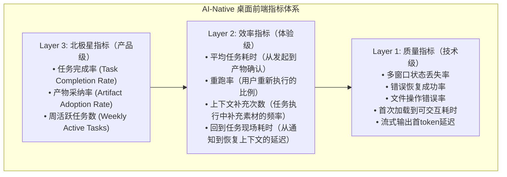

# 【月之暗面面经】你会用哪些指标判断桌面 AI 产品前端做得好不好？

## 一、核心指标体系



## 二、关键指标详解

### 1. 任务完成率（Task Completion Rate）

```
任务完成率 = 状态为"done"的任务数 / 总发起任务数

健康值：> 85%
警戒值：< 70%

按维度拆分：
  按Agent类型：代码生成 92% | PPT生成 78% | 数据分析 85%
  按任务复杂度：简单 95% | 中等 82% | 复杂 65%
  按产物类型：文本 94% | 表格 88% | 站点 75% | PPT 72%
```

### 2. 产物采纳率（Artifact Adoption Rate）

```
产物采纳率 = 被确认/导出的产物数 / AI生成的总产物数

健康值：> 70%
警戒值：< 50%

关键子指标：
  • 完全采纳率：用户不做任何修改直接接受 → 反映AI质量
  • 编辑后采纳率：用户修改后接受 → 反映编辑体验
  • 拒绝率：用户完全拒绝 → 反映AI质量问题
  • 局部采纳率：用户只接受部分变更 → 反映diff体验
```

### 3. 重跑率（Rerun Rate）

```
重跑率 = 用户重新执行的任务数 / 总完成任务数

健康值：< 15%
警戒值：> 30%

重跑原因拆分：
  • AI质量问题（结果不对）：40%
  • 上下文问题（素材不对）：30%
  • 参数问题（设置不对）：20%
  • 格式问题（导出格式不对）：10%
```

### 4. 上下文补充次数（Context Augmentation Count）

```
平均每个任务用户补充上下文的次数

健康值：< 1.5 次
警戒值：> 3 次

高补充次数说明：
  → 用户不确定需要哪些素材
  → 前置校验没做好
  → AI的上下文理解能力不足
```

## 三、指标埋点设计

```typescript
// 核心事件埋点
interface AnalyticsEvents {
  // 任务生命周期
  'task.created': { taskId: string; agentType: string; inputCount: number };
  'task.started': { taskId: string; estimatedDuration: number };
  'task.progress': { taskId: string; phase: string; progress: number };
  'task.completed': { taskId: string; duration: number; artifactCount: number };
  'task.failed': { taskId: string; phase: string; error: string };
  
  // 产物交互
  'artifact.previewed': { artifactId: string; kind: string };
  'artifact.edited': { artifactId: string; editType: 'full' | 'partial' };
  'artifact.accepted': { artifactId: string; acceptanceType: 'full' | 'partial' | 'rejected' };
  'artifact.exported': { artifactId: string; format: string };
  'artifact.regenerated': { artifactId: string; scope: 'full' | 'partial' };
  
  // 上下文交互
  'context.added': { taskId: string; sourceType: string };
  'context.removed': { taskId: string; sourceId: string };
  'context.replaced': { taskId: string; oldType: string; newType: string };
  'context.validated': { taskId: string; issueCount: number };
  
  // 回看路径
  'notification.clicked': { taskId: string; delayFromNotification: number };
  'task.revisited': { taskId: string; timeSinceCompleted: number };
  
  // 多窗口
  'window.opened': { windowId: string; purpose: string };
  'window.conflict': { artifactId: string; resolution: string };
}
```

## 四、指标看板设计

```
┌──────────────────────────────────────────────────────────────────┐
│  📊 AI桌面产品前端健康度看板                      2024-01-15      │
├──────────────────────────────────────────────────────────────────┤
│                                                                  │
│  ┌─── 北极星 ──────────────────────────────────────────────┐    │
│  │                                                        │  │
│  │  任务完成率         产物采纳率        周活跃任务数        │  │
│  │  ┌────────┐       ┌────────┐       ┌────────┐         │  │
│  │  │ 87.3%  │       │ 72.1%  │       │  3,421 │         │  │
│  │  │ ↑2.1%  │       │ ↑5.3%  │       │ ↑12%   │         │  │
│  │  │ ✅ 良好 │       │ ⚠️ 关注 │       │ ✅ 增长 │         │  │
│  │  └────────┘       └────────┘       └────────┘         │  │
│  └────────────────────────────────────────────────────────┘    │
│                                                                  │
│  ┌─── 效率指标 ────────────────────────────────────────────┐    │
│  │                                                        │  │
│  │  平均任务耗时    重跑率      上下文补充次数   回到现场耗时│  │
│  │  3分42秒        12.5%       1.3次/任务      2.1秒      │  │
│  │  ↓15%           ↓3%         ✅ 良好          ✅ 快速    │  │
│  └────────────────────────────────────────────────────────┘    │
│                                                                  │
│  ┌─── 按Agent拆分 ─────────────────────────────────────────┐    │
│  │                                                        │  │
│  │  Agent类型      完成率    采纳率    重跑率    平均耗时   │  │
│  │  代码生成       92%       85%       8%        2分15秒   │  │
│  │  PPT生成        78%       58%       22%       5分30秒   │  │
│  │  数据分析       85%       75%       15%       4分12秒   │  │
│  │  网站生成       75%       62%       25%       6分45秒   │  │
│  │                                                        │  │
│  │  ⚠️ PPT和网站生成的采纳率偏低，建议优化产物质量           │  │
│  └────────────────────────────────────────────────────────┘    │
│                                                                  │
└──────────────────────────────────────────────────────────────────┘
```

## 五、常见坑

- **只看DAU和停留时长**：这些是娱乐应用指标，不能反映工具型产品的真实价值
- **不拆分维度看**：整体完成率85%可能掩盖了某类Agent只有50%的问题
- **忽略重跑率**：任务"完成"了但用户不满意不断重跑，实际上体验很差
- **不追踪上下文补充**：用户反复补充素材说明前置校验没做好，但如果不追踪就发现不了

## 记忆要点

- 三层指标体系：北极星指标看业务（采纳率/完成率），体验指标看效率（重跑率/耗时），技术指标看质量。
- 核心北极星：任务完成率（健康>85%）和产物采纳率（健康>70%）最直接反映AI价值。
- 关键负向指标：重跑率（健康<15%）直接暴露AI结果不好用或上下文引入错误。
- 桌面端专属指标：多窗口状态丢失率、长任务失败恢复率、文件操作错误率决定端上体验底线。

## 苏格拉底式面试追问

> 这组追问模拟面试官层层逼问，每一问先回答"为什么"，再回答"怎么做"，最后回答"如何证明"。

### 第一层：目标与动机

**Q：为什么桌面 AI 产品不看 DAU 和停留时长，非要用"任务完成率"和"产物采纳率"作为北极星指标？DAU 高难道不说明产品好吗？**

因为桌面 AI 产品是"工作工具"而非"娱乐应用"，两者的价值模型完全不同。娱乐应用（如短视频）的价值是"占用用户时间"——DAU 高、停留时长长说明用户沉迷，产品成功。工作工具的价值是"帮用户省时间"——如果用户为了完成一个任务在你的产品里待了 30 分钟（停留时长长），但最终产物不可用（采纳率低），这个停留时长是"痛苦的挣扎"而非"价值创造"，DAU 高反而说明"用户被迫反复回来重试"。任务完成率（进入 done 状态的比例 >85%）直接反映"AI 能不能把事做完"；产物采纳率（用户确认/导出的产物比例 >70%）直接反映"做出来的东西用户能不能用"。这两个指标把"产品价值"锚定在"实际工作成果"上，而非"用户触达频次"上。DAU 只适合作为辅助指标（看用户规模），不能作为工作工具的北极星——一个 DAU 高但采纳率低的产品，本质是"用户来了但做不成事"，留存必然崩塌。

### 第二层：证据与定位

**Q：你怎么定位"产物采纳率低"是 AI 生成质量问题，还是编辑/Diff 体验差导致用户不愿意采纳？**

用采纳漏斗 + 编辑行为数据定位。产物采纳漏斗：AI 生成 → 用户预览 → 用户编辑（可选）→ 用户采纳/拒绝。在每一步埋点：(1) 预览率 = 用户点了预览的产物数 / 生成的产物数，如果预览率低说明产物展示不够吸引或用户不关心；(2) 编辑后采纳率 = 用户编辑后采纳的产物数 / 编辑过的产物数，如果这个率高（如 80%+）但完全采纳率低，说明 AI 质量接近但用户需要微调——是编辑体验的问题（Diff/局部接受不够好用）；(3) 完全拒绝率 = 用户直接拒绝的产物数 / 总产物数，如果这个率高（>30%）说明 AI 生成质量确实差，与编辑体验无关。还要看"编辑耗时"——如果用户编辑一个产物超过 5 分钟才采纳，说明产物离可用差太远（AI 质量问题）；如果编辑 30 秒就采纳，说明 AI 质量好只是小修小补（正常）。综合这些数据就能区分"AI 质量差"（完全拒绝率高、编辑耗时长）和"编辑体验差"（编辑后采纳率低、局部接受使用率低）。

### 第三层：根因深挖

**Q：为什么重跑率是关键负向指标，它比"任务失败率"更能反映问题吗？**

因为"任务失败率"只看"AI 是否报错"，而"重跑率"看"用户是否满意"——两者的差距正是 AI 产品最棘手的"隐性失败"。任务失败率统计的是 status=failed 的任务，这些是 AI 明确报错（如网络超时、格式不支持）的显性失败，容易检测和修复。但重跑率统计的是"AI 说完成了（status=done）但用户不满意重新执行"的任务——这些任务在系统看来是"成功的"（没报错），但在用户看来是"失败的"（结果不能用）。这类隐性失败是 AI 产品体验的隐形杀手：任务完成率显示 90%（很好看），但重跑率 35%（用户疯狂重试），实际"一次满意率"只有 90%×(1-35%)=58.5%——远没有完成率看起来那么好。重跑率的另一个价值是"原因可拆分"——重跑原因分为 AI 质量（40%）、上下文问题（30%）、参数问题（20%）、格式问题（10%），每个原因指向不同的改进方向。只看任务失败率会漏掉 70% 的隐性失败（上下文和参数导致的重跑不会被系统标记为失败），所以重跑率是比失败率更敏感的体验温度计。

**Q：那如果用户重跑是因为"想看看 AI 能不能给出不同结果"（探索性重跑），为什么要把所有重跑都算作负向指标？**

因为"探索性重跑"和"不满意重跑"的区分可以通过行为数据做出来，不需要把所有重跑混为一谈。区分方法：(1)看重跑时的输入是否变化——如果用户重跑时修改了输入参数或换了素材，是"不满意重跑"（尝试修复）；如果输入完全不变直接重跑，可能是"探索性重跑"（看 AI 的不同输出）；(2)看前一次产物是否被拒绝——如果用户先拒绝了前一次产物再重跑，是"不满意重跑"；如果用户保留了前一次产物（没拒绝）又跑了一次，是"探索性重跑"（对比多个版本）；(3)看重跑后是否采纳了某一次——如果重跑后采纳了，说明是"迭代优化"（合理的重跑）；如果重跑多次都不采纳，是"不满意死循环"（负向信号）。基于这些区分，可以把重跑率拆分为"迭代重跑率"（合理，不计入负向）和"失败重跑率"（负向），只把后者作为警报指标。所以根因不是"重跑率本身有问题"，而是"要细分重跑动机，只把失败重跑算作负向"——粗放地把所有重跑算负向会导致指标失真。

### 第四层：方案权衡

**Q：指标按 Agent 类型拆分（代码生成 92% / PPT 生成 78%），为什么不看整体汇总值来简化看板？**

因为"整体汇总值"会掩盖个别 Agent 的严重问题，导致优化方向错误。举例：整体任务完成率 85%（看起来达标），但拆分后发现代码生成 92%（优秀）、PPT 生成 78%（不达标）、网站生成 75%（不达标）——整体值被代码生成的优秀拉高，掩盖了 PPT 和网站生成的问题。如果只看整体值，团队会认为"完成率已经 85%，没问题"，但实际上 PPT 和网站用户一直在经历 22-25% 的失败率。拆分的价值是"定位瓶颈"——整体值告诉你"平均水平"，拆分值告诉你"哪里是短板"。优化资源应该投向短板（PPT 和网站生成），而非已经达标的代码生成。按产物类型拆分的另一个价值是"横向对比"——如果 PPT 生成的重跑率 22% 而文本生成的重跑率 8%，说明 PPT 这种结构化产物的 AI 能力不足，需要针对性优化（如更好的 PPT 模板、更精确的布局算法）。汇总值完全无法提供这种定位能力。

**Q：那如果拆分维度太多（按 Agent 类型 × 产物类型 × 任务复杂度 × 用户分群），看板变成几十个指标，为什么不只看 Top 3 指标避免信息过载？**

因为"只看 Top 3"和"看板展示几十个指标"是两个不同层面的问题，解法是"分层展示"而非"砍指标"。看板设计采用"下钻式"：第一层只展示北极星 Top 3（任务完成率、产物采纳率、重跑率）+ 趋势箭头，让管理者一眼看总体健康度；第二层在某个指标异常时点击下钻，看按 Agent 类型的拆分（定位是哪个 Agent 拖了后腿）；第三层再下钻到具体 Agent 的产物类型和复杂度拆分（定位是该 Agent 的哪种产物/哪种复杂度有问题）。这样日常只看 Top 3（无信息过载），出问题时逐层下钻定位根因（不缺细节）。砍指标的代价是"出问题时无法定位"——如果只看整体完成率 85%，不知道是哪个 Agent 的问题，团队只能盲目优化所有 Agent，效率极低。所以根因是"展示策略要分层（Top 3 → 拆分 → 细节）"，而非"减少指标采集"——所有维度的指标都要采集和计算，只是展示时按需展开。

### 第五层：验证与沉淀

**Q：你怎么证明"这套指标体系"真的帮团队发现了问题并驱动了改进，而不是只是好看的数字看板？**

用"指标驱动决策"的闭环验证。追踪三个信号：(1) 指标触发的改进动作数——每月基于指标异常发起的优化项目数量（如"PPT 采纳率 <60% 触发了 PPT 模板优化项目"），如果每月有 3+ 个改进动作由指标驱动，说明指标体系有效；(2) 改进后的指标变化——优化项目落地后，对应指标是否在 2-4 周内显著改善（如 PPT 采纳率从 58% 提升到 72%），如果改善则验证了"指标准确定位了问题"；(3) 指标与用户留存的关联——任务完成率和采纳率高的用户，留存率是否显著高于低完成率/采纳率的用户（如果高采纳率用户的次周留存 >80%，低采纳率 <30%），这验证了指标与真实价值的因果关系。如果三个信号都成立，说明指标体系不仅是"看板"而是"改进引擎"。如果指标体系上线半年后没有任何改进动作由它触发，说明指标没有 actionable 性（团队看了不知道该做什么），需要重新设计。

**Q：怎么让团队在开发新功能时，自觉把新功能接入指标埋点，而不是等功能上线后才发现"没有数据可看"？**

把指标埋点做成"功能开发流程"的强制环节。第一，功能 PR 模板包含"指标埋点"必填项——开发者提 PR 时必须声明"这个功能影响哪些指标、新增了哪些埋点事件"，不填不能合并；第二，埋点事件通过声明式 SDK 自动采集——开发者只需在功能代码里调 analytics.track('task.completed', { taskId, ... })，SDK 自动补齐通用字段（时间戳、用户 ID、会话 ID），降低埋点成本；第三，CI 做"无埋点功能"检测——扫描新增的 UI 组件和业务逻辑，如果有用户可交互的功能但没有对应的 analytics.track 调用，CI 警告（不阻塞但提醒）；第四，指标验收——功能上线前在 Staging 环境跑一遍完整流程，验证核心指标（完成率、采纳率）能正确采集到数据，没有数据的功能不允许上线。这样指标埋点就从"事后补"变成了"开发时必须做"，功能上线即有数据可看。

## 结构化回答

**30 秒电梯演讲：** 桌面AI产品好不好不是看DAU，而是看任务完成率、回到任务现场的效率和产物采纳率。要关注用户是否经常重新补上下文或重跑整单，多窗口任务丢失率和错误恢复率也重要，指标要能按产物类型拆开看。

**展开框架：**
1. **任务完成率** — 任务完成率、回到任务现场的效率和产物采纳率是核心
2. **看用户是否** — 看用户是否经常重新补上下文或重跑整单
3. **多窗口任务** — 多窗口任务丢失率和错误恢复率也重要

**收尾：** 您想深入聊：如果桌面端要接文件、网页和本地目录，你先画哪套权限边界？


## 视频脚本

> 预计时长：4 分钟 | 由浅入深


| 时间 | 画面/字幕 | 口播台词 | 讲解要点 |
|------|----------|----------|----------|
| 0:00 | 标题卡：你会用哪些指标判断桌面 AI 产品前端做得好不好… | "就像评价一把厨刀——不是看它每天被拿起来多少次（DAU），而是看用它切菜是否一次成功（完成…" | 开场钩子 |
| 0:20 | 核心概念图 | "桌面AI产品好不好不是看DAU，而是看任务完成率、回到任务现场的效率和产物采纳率。要关注用户是否经常重新补上下文或重跑整…" | 核心定义 |
| 0:50 | 任务完成率示意图 | "任务完成率——任务完成率、回到任务现场的效率和产物采纳率是核心" | 要点拆解1 |
| 1:30 | 对比/实战案例图 | "对比一下常见误区和工程实践，看真实场景里怎么取舍。" | 实战与对比 |
| 2:20 | 总结卡 | "记住核心要点。下期我们追问：如果桌面端要接文件、网页和本地目录，你先画哪套权限边界？" | 收尾与钩子 |
