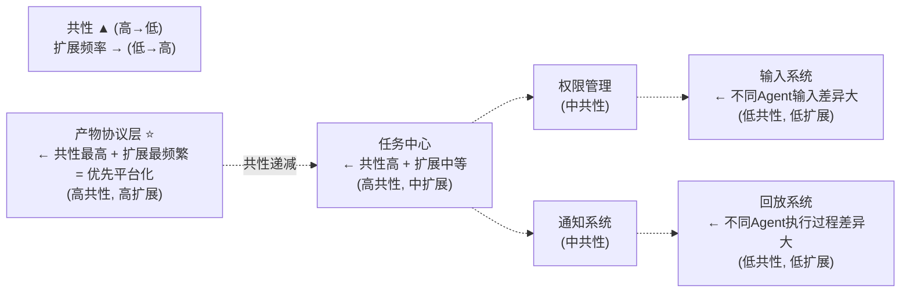

# 【月之暗面面经】如果产品要扩到更多桌面能力，哪层前端架构最该先做成平台？

## 一、平台化优先级分析



**结论：产物协议层应该最先平台化。**

## 二、产物协议平台化设计

### 产物对象模型（统一标准）

```typescript
// 所有产物必须实现的接口
interface Artifact {
  id: string;
  taskId: string;
  
  // 类型标识（平台注册的产物类型）
  kind: string;                // 在产物类型注册表中注册
  
  // 内容（统一容器）
  content: ArtifactContent;
  
  // 版本
  version: number;
  
  // 状态
  status: ArtifactStatus;
  
  // 落地信息
  exportInfo?: ExportInfo;
}

// 内容容器——支持不同格式
interface ArtifactContent {
  format: 'json' | 'html' | 'markdown' | 'binary' | 'text';
  data: string | object | ArrayBuffer;
  encoding?: string;
}
```

### 产物类型注册表

```typescript
// 产物类型注册——新Agent注册新产物类型
class ArtifactTypeRegistry {
  private types: Map<string, ArtifactTypeSpec> = new Map();
  
  register(spec: ArtifactTypeSpec) {
    this.types.set(spec.kind, spec);
  }
  
  get(kind: string): ArtifactTypeSpec | undefined {
    return this.types.get(kind);
  }
}

// 每种产物类型提供：渲染器 + 编辑器 + 导出器 + Diff器
interface ArtifactTypeSpec {
  kind: string;                 // 'site' / 'ppt' / 'sheet' / 'chart'
  displayName: string;
  icon: string;
  
  // 渲染器——如何预览产物
  renderer: {
    component: Vue.Component;   // 预览组件
    thumbnail?: Vue.Component;  // 缩略图组件
  };
  
  // 编辑器——如何编辑产物
  editor?: {
    component: Vue.Component;   // 编辑组件
    capabilities: string[];     // 支持的编辑能力
  };
  
  // 导出器——如何导出产物
  exporters: ArtifactExporter[];
  
  // Diff器——如何比较两个版本
  differ?: ArtifactDiffer;
  
  // 校验器——如何验证产物内容
  validator?: ArtifactValidator;
}
```

### 平台层架构图

```
┌──────────────────────────────────────────────────────────────────┐
│                    产物协议平台层                                   │
├──────────────────────────────────────────────────────────────────┤
│                                                                  │
│  ┌─────────────────────────────────────────────────────────┐    │
│  │                   产物管理器（Artifact Manager）           │    │
│  │                                                         │    │
│  │  • 创建/读取/更新/删除产物                                │    │
│  │  • 版本管理                                              │    │
│  │  • 状态机管理                                            │    │
│  └────────────────────────┬────────────────────────────────┘    │
│                           │                                      │
│         ┌─────────────────┼─────────────────┐                   │
│         │                 │                 │                   │
│  ┌──────┴──────┐  ┌──────┴──────┐  ┌──────┴──────┐            │
│  │  渲染器      │  │  编辑器      │  │  导出器      │            │
│  │  Registry   │  │  Registry   │  │  Registry   │            │
│  └──────┬──────┘  └──────┬──────┘  └──────┬──────┘            │
│         │                │                 │                   │
│    ┌────┴────┐      ┌────┴────┐       ┌────┴────┐              │
│    │Site渲染 │      │Site编辑 │       │HTML导出 │              │
│    │PPT渲染  │      │PPT编辑  │       │PPTX导出 │              │
│    │Sheet渲染│      │Sheet编辑│       │XLSX导出 │              │
│    │Chart渲染│      │Chart编辑│       │PNG导出  │              │
│    └─────────┘      └─────────┘       └─────────┘              │
│                                                                  │
└──────────────────────────────────────────────────────────────────┘
```

## 三、新Agent接入示例

```typescript
// 新增"思维导图"产物类型
artifactRegistry.register({
  kind: 'mindmap',
  displayName: '思维导图',
  icon: '🧩',
  
  renderer: {
    component: MindmapPreview,     // 自定义预览组件
    thumbnail: MindmapThumbnail,
  },
  
  editor: {
    component: MindmapEditor,       // 自定义编辑组件
    capabilities: ['add-node', 'edit-text', 'rearrange', 'collapse'],
  },
  
  exporters: [
    { format: 'png', handler: exportMindmapPNG },
    { format: 'svg', handler: exportMindmapSVG },
    { format: 'json', handler: exportMindmapJSON },
  ],
  
  differ: {
    compare: diffMindmap,           // 自定义Diff算法
    render: renderMindmapDiff,
  },
  
  validator: {
    validate: validateMindmapStructure,
  },
});

// 注册完成后，产物面板、任务中心、回放页自动支持思维导图
// 不需要修改任何共用模块
```

## 四、平台化的收益

```
平台化前：                          平台化后：
                                    
新增Agent需要：                      新增Agent需要：
  ❌ 写产物对象定义                    ✅ 注册产物类型spec
  ❌ 写产物预览组件                    ✅ （已由renderer提供）
  ❌ 写产物编辑组件                    ✅ （已由editor提供）
  ❌ 写导出逻辑                        ✅ （已由exporter提供）
  ❌ 写Diff逻辑                        ✅ （已由differ提供）
  ❌ 改产物面板组件                    ✅ （自动支持新类型）
  ❌ 改任务中心                        ✅ （自动支持新类型）
  ❌ 改回放页                          ✅ （自动支持新类型）
                                    
工时：1-2周                          工时：1-2天
```

## 五、常见坑

- **先平台化输入系统**：输入差异大，强行统一会导致灵活性丧失，应后做
- **产物类型硬编码**：在共用组件里 `if (kind === 'site')` 判断，违反开闭原则
- **渲染器耦合业务逻辑**：渲染器应该纯展示，不包含Agent业务逻辑
- **没有注册表机制**：新增类型需要改多处代码，而非只注册一次

## 记忆要点

- 平台化优先级结论：产物协议层共性最高且扩展最频繁，必须最先做成平台
- 核心解法：抽取统一的Artifact对象模型，沉淀通用结构化内容容器
- 扩展机制：建立产物类型注册表，新Agent只需动态注册新产物Spec
- 对比优势：任务与权限层共性中等，输入与回放层差异大故暂缓平台化

## 苏格拉底式面试追问

> 这组追问模拟面试官层层逼问，每一问先回答"为什么"，再回答"怎么做"，最后回答"如何证明"。

### 第一层：目标与动机

**Q：为什么"产物协议层"是最该先平台化的，而不是"任务中心"或"权限管理"？它们不也是所有 Agent 共用的吗？**

因为平台化的优先级取决于"共性 × 扩展频率"，产物协议层在这两个维度都最高。共性维度：所有 Agent 无论做什么（代码生成/PPT/网站/表格），最终产出都是某种类型的产物对象——产物是所有 Agent 的最大公约数；任务中心虽然也共用，但不同 Agent 的任务流程差异较大（代码审查是同步快速任务、网站生成是异步长任务），共性不如产物层。扩展频率维度：产品演进中新增产物类型的频率最高（从文档→PPT→网站→思维导图→流程图...），每次新增产物类型都要做预览/编辑/导出/Diff 四件套；任务中心和权限管理的扩展频率低（任务状态机稳定后很少改，权限分层模型也是稳定的）。产物层"共性最高 + 扩展最频繁"，平台化后每次新增产物类型只需注册一个 ArtifactTypeSpec（1-2 天），不做平台化则每次新增要改产物面板、任务中心、回放页等多个共用模块（1-2 周）。所以产物层平台化的 ROI 最高，应该最先投入。

### 第二层：证据与定位

**Q：你怎么定位"新 Agent 接入成本高"是因为产物层没平台化，还是因为其他层（任务/权限/输入）的问题？**

用"接入工时拆解"定位。新 Agent 接入的总工时按模块分解：(1) 产物相关（写产物定义、预览组件、编辑组件、导出逻辑、Diff 逻辑）——如果这部分占比 >50%，说明产物层没平台化是主要瓶颈；(2) 任务相关（写任务状态管理、进度更新、失败处理）——如果占比高，说明任务层需要平台化；(3) 权限相关（写权限声明、授权流程）——如果占比高，说明权限层需要优化；(4) 输入相关（写输入解析、参数校验）——如果占比高，说明输入层需要统一。横向对比多个 Agent 的接入工时：如果所有 Agent 都在"产物相关"模块花最多时间（如 5 个 Agent 平均花 60% 工时写产物四件套），确认产物层是最大瓶颈。如果某个 Agent 的"输入相关"工时异常高（其他 Agent 花半天，它花 3 天），说明该 Agent 的输入特殊性强（需要定制解析器），属于输入层差异大的合理成本，而非平台化不足。

### 第三层：根因深挖

**Q：为什么产物层平台化的核心是"产物类型注册表 + 统一 Artifact 对象模型"，而不是"做一个万能渲染器"适配所有产物？**

因为"万能渲染器"是一个不可能实现的目标——不同产物类型（站点 HTML/PPT JSON/表格/图表）的渲染逻辑差异太大，强行统一会导致渲染器充满 if-else 分支，违反开闭原则。站点产物要用 iframe 渲染 HTML、PPT 产物要用幻灯片组件渲染 JSON、表格产物要用表格组件渲染行列数据——这三者的渲染逻辑没有共性，"万能渲染器"只能退化成"根据类型调不同渲染器"的分支逻辑，本质上还是每个产物类型各写一个渲染器，只是多了一层无用的抽象。注册表 + 统一对象模型的价值在于"统一的是接口契约，差异的是实现"：Artifact 对象模型统一了所有产物的外层结构（id/kind/content/version/status），注册表定义了每种产物类型必须实现的接口（renderer/editor/exporter/differ），但每种产物类型的渲染实现完全自由（站点用 iframe、PPT 用幻灯片组件）。这样新增产物类型只需实现接口并注册，不修改任何共用代码——这是开闭原则（对扩展开放、对修改封闭）的标准实践。万能渲染器的根因错误是"把接口和实现混为一谈"，以为统一接口就要统一实现。

**Q：那如果不同产物类型的"编辑器"有共性（如都有"撤销/重做""保存""导出"按钮），为什么不把这些共性抽到"万能编辑器基类"里？**

因为"撤销/重做/保存/导出"这些操作确实有共性，应该抽到基类——但这不等于"万能编辑器"，而是"编辑器能力基类（BaseEditor）"。正确的做法是分层抽象：(1) BaseEditor 提供通用能力（撤销/重做栈、保存逻辑、导出触发、快捷键处理），所有产物编辑器继承它获得通用能力；(2) 每种产物类型继承 BaseEditor 后实现自己的"内容编辑逻辑"（站点编辑器实现 HTML 元素编辑、PPT 编辑器实现幻灯片编辑）。这样共性能力（撤销/重做）在基类实现一次，差异能力（内容编辑）在子类各自实现。这与"万能渲染器"的区别是：BaseEditor 抽象的是"操作能力"（所有编辑器都有撤销），而非"内容渲染"（不同编辑器渲染不同内容）。所以"编辑器基类"是合理的抽象（操作能力有共性），"万能渲染器"是不合理的抽象（渲染逻辑无共性）。关键区分点："操作能力"可以统一（所有编辑器都用 Ctrl+Z 撤销），"内容逻辑"不能统一（HTML 和 PPT 的编辑方式完全不同）。

### 第四层：方案权衡

**Q：产物层平台化你用"注册表 + Spec 声明"的方式，为什么不直接做"配置化"（用一个 JSON/YAML 配置文件描述产物类型，零代码接入）？**

因为"纯配置化"无法覆盖产物类型的所有差异——渲染器、编辑器、导出器、Diff 器都是有逻辑的代码组件，不可能用 JSON 配置描述。"配置化"只适用于"声明式 UI"（如表单的 schema 驱动渲染），但产物预览和编辑是"命令式 UI"（要处理用户交互、状态管理、异步操作），必须写代码。注册表 + Spec 的方式是"声明与实现的结合"：Spec 的声明部分（kind/displayName/icon/acceptedFormats）用配置描述（这部分可以做成 JSON），Spec 的实现部分（renderer/editor/exporter/differ）用代码组件（必须写 Vue 组件）。这比"纯配置化"多做了一步（写组件），但覆盖了配置化无法覆盖的交互逻辑。比"无平台化"少做了很多步（不用改共用模块、不用写任务中心适配），接入成本从周级降到天级。纯配置化的另一个问题是"表达能力有限"——如果产物类型有特殊逻辑（如思维导图的折叠展开、流程图的连线拖拽），配置文件无法描述这些交互，最终还是要写代码，"配置化"变成了"配置 + 代码"的混合，不如直接用 Spec 声明 + 代码实现清晰。

**Q：那如果团队想要"零代码接入新产物类型"（如让非工程师通过配置文件加产物），为什么不追求这个极致目标？**

因为"零代码接入产物"是一个伪需求——产物类型的核心价值在于其渲染和编辑体验，这必然需要工程实现。即使配置文件能声明"新产物叫 timeline，图标是时钟"，但没有渲染器组件它无法预览（时间轴怎么画），没有编辑器组件它无法编辑（怎么拖拽时间节点），没有导出器它无法导出（导出成什么格式）。所以"零代码接入"的产物是一个只有名字和图标的空壳，对用户毫无价值。真正有意义的"低代码接入"是"脚手架生成 + 少量定制"：开发者跑 `npm run new-artifact-type timeline`，脚手架自动生成 BaseEditor 子类骨架、渲染器骨架、导出器骨架、注册代码，开发者填入 timeline 特有的渲染逻辑（如用 SVG 画时间轴）和编辑逻辑（如拖拽事件处理），1-2 天完成接入。这比"零代码"多了写代码的步骤，但产物是真正可用的。所以根因是"产物类型的价值在于实现而非声明，追求零代码接入是追求了错误的目标"——正确的极致目标是"脚手架 + 继承基类让接入成本最小化"，而非"完全不写代码"。

### 第五层：验证与沉淀

**Q：你怎么证明"产物协议层平台化"真的降低了扩展成本，新增产物类型确实更快了？**

用工时和代码量指标验证：(1) 新增产物类型的平均工时——平台化前（每个 Agent 自己写产物四件套）通常 1-2 周，平台化后（注册 Spec + 实现渲染器）应降到 1-3 天，工时降低 70%+；(2) 新增产物类型的代码量——平台化前约 2000-3000 行（含共用模块的修改），平台化后约 500-800 行（仅 Spec + 渲染器组件），代码量降低 70%+；(3) 新增产物类型时修改共用模块的次数——平台化前每次新增都要改产物面板/任务中心/回放页（修改 3-5 个共用文件），平台化后应为 0 次（只注册不改共用代码，开闭原则达成）。收集平台化前后各新增 3-5 个产物类型的数据对比，如果三项指标都显著改善，就证明平台化有效。还要看一个定性指标：团队是否敢于快速实验新产物类型——平台化前因为接入成本高，团队会对新增产物类型犹豫（"值不值得花两周做"）；平台化后因为成本低，团队更愿意快速验证（"花两天试试，不行就砍"），创新速度提升。

**Q：怎么让团队在新增产物类型时，自觉走"注册表 + Spec"的平台化路径，而不是自己在某个 Agent 目录下写一套独立的产物逻辑？**

把"平台化路径"做成"产物类型注册的唯一合法路径"。第一，产物面板、任务中心、回放页等共用组件只从 ArtifactTypeRegistry 读取产物类型信息——没有注册的产物类型在这些共用组件中完全不显示（无法预览/编辑/导出），开发者想绕过注册自己写产物 UI 就无法接入共用基础设施；第二，Artifact 对象的类型系统强约束——所有产物必须是 Artifact 类型（有 id/taskId/kind/content/version/status），不符合的类型在 TypeScript 编译时报错，开发者无法用自定义类型替代；第三，脚手架 CLI 是唯一创建产物类型的入口——`npm run new-artifact-type` 自动生成符合 Spec 的骨架代码和注册逻辑，开发者照着填，手写注册代码反而比用脚手架费劲；第四，Code Review 加硬规则——禁止在 Agent 目录下出现渲染器/编辑器/导出器组件（这些必须放在产物类型注册目录），Agent 目录只允许有 adapter.ts（业务逻辑），违反则 review 不通过。这样平台化路径就从"推荐方案"变成了"唯一可运行方案"。

## 结构化回答

**30 秒电梯演讲：** 如果产品要扩到更多桌面能力，最该先做成平台的是产物协议层——它是所有Agent、所有产物类型和所有交互模式的交汇点。把产物对象模型、产物渲染器、产物编辑器和产物导出器统一成平台能力。

**展开框架：**
1. **统一产物对** — 统一产物对象模型是最先该平台化的
2. **产物渲染** — 产物渲染/编辑/导出做成可扩展的渲染器注册表
3. **新Agent** — 新Agent接入只需注册产物类型和适配器

**收尾：** 您想深入聊：如果桌面端要接文件、网页和本地目录，你先画哪套权限边界？


## 视频脚本

> 预计时长：5 分钟 | 由浅入深


| 时间 | 画面/字幕 | 口播台词 | 讲解要点 |
|------|----------|----------|----------|
| 0:00 | 标题卡：如果产品要扩到更多桌面能力，哪层前端架构最该先做… | "就像建购物中心——先建好商铺标准（产物协议：统一面积/水电接口/消防规范）、公共区域（产物…" | 开场钩子 |
| 0:20 | 核心概念图 | "如果产品要扩到更多桌面能力，最该先做成平台的是产物协议层——它是所有Agent、所有产物类型和所有交互模式的交汇点。把产…" | 核心定义 |
| 0:50 | 统一产物对示意图 | "统一产物对——统一产物对象模型是最先该平台化的" | 要点拆解1 |
| 1:30 | 产物渲染示意图 | "产物渲染——产物渲染/编辑/导出做成可扩展的渲染器注册表" | 要点拆解2 |
| 2:20 | 对比/实战案例图 | "对比一下常见误区和工程实践，看真实场景里怎么取舍。" | 实战与对比 |
| 3:10 | 总结卡 | "记住核心要点。下期我们追问：如果桌面端要接文件、网页和本地目录，你先画哪套权限边界？" | 收尾与钩子 |
