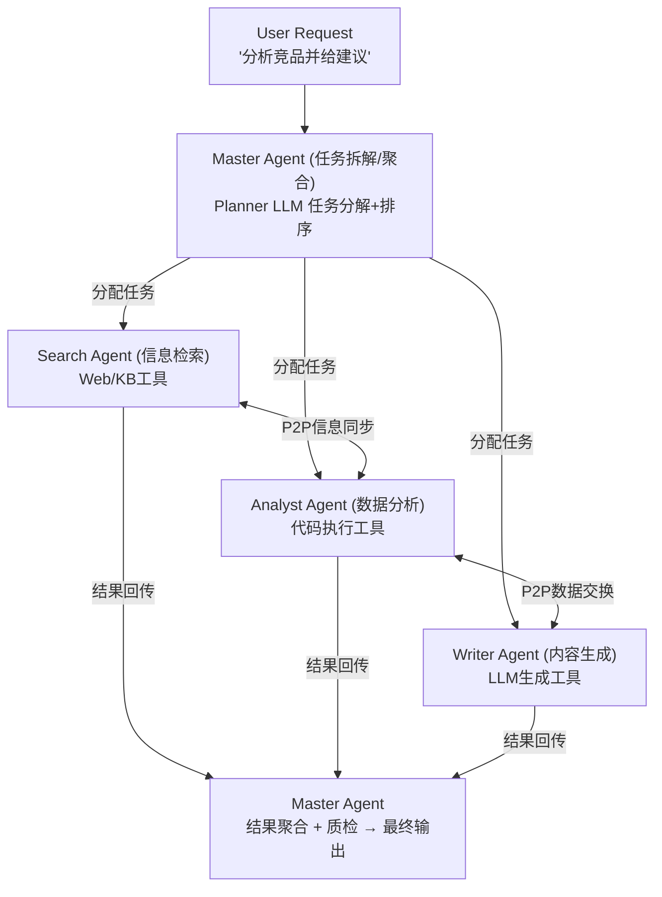

# 【美团面经】你的Agent项目用的是什么架构？master加sub Agent还是workflow？为什么这么选型？

## 一、选型决策：不是二选一，而是混合架构

面试官给的选项——master+sub 还是 workflow——本身是一个**伪二选一**。实际生产系统中，我们采用的是**混合架构**：

- **任务级（Task Level）**：master+sub 模式。主控Agent负责任务拆解、子Agent调度和最终结果聚合。
- **信息级（Information Level）**：子Agent之间可以直接P2P通信，不需要事事回传master中转。

### 选型第一性原理

> **架构选型 = f(任务不确定性)**

| 任务特征 | 推荐架构 | 原因 |
|---------|---------|------|
| 流程固定、步骤确定 | **Workflow**（如LangChain Chain） | 无需动态决策，编排简单可复现 |
| 任务开放、步骤不确定 | **Master+Sub** | 需要主控动态拆解和调度 |
| 既有确定性骨架又有不确定性细节 | **混合架构** ✅ | 骨架用workflow保稳定，细节用master保灵活 |

Agent面向的是**开放式用户请求**（如"帮我分析竞品并给建议"），步骤无法预先编排，因此不能纯workflow；但全用master+sub又会导致主控成为瓶颈——所以最终选择**混合架构**。

## 二、混合架构全景图



**两层通信**：
- **实线箭头（任务级）**：Master ↔ Sub，控制流（分配任务、回收结果）
- **虚线箭头（信息级）**：Sub ↔ Sub，数据流（直接传递中间结果，不经Master）

## 三、为什么子Agent之间要P2P？

| 通信路径 | 纯Master中转 | P2P直连 |
|---------|-------------|--------|
| Search→Analyst | Search回传Master→Master转发给Analyst（2跳+2次LLM调用） | Search直接发给Analyst（1跳，0次额外LLM调用） |
| 延迟 | 高（Master成为瓶颈） | 低 |
| Master负载 | 每条消息都要LLM处理 | 只处理任务级控制消息 |
| 可扩展性 | Agent越多Master越堵 | Agent越多P2P越自然 |

**类比**：项目组里PM负责任务分配和结果汇报（master+sub），但前端需要后端的API定义时，直接找后端对接口（P2P），而不是把请求提给PM再由PM转达给后端。

## 四、Python代码实现

```python
from __future__ import annotations
import asyncio
from dataclasses import dataclass, field
from typing import Any, Optional

# ============================================================
# 基础通信：Agent间消息总线（支持Master→Sub 和 Sub→Sub）
# ============================================================
@dataclass
class Message:
    sender: str
    receiver: str          # "master" / agent_name / "broadcast"
    msg_type: str          # "task" / "result" / "sync" / "error"
    payload: Any
    trace_id: str = ""     # 任务追踪ID

class MessageBus:
    """轻量级异步消息总线，支持点对点和广播"""
    def __init__(self):
        self._queues: dict[str, asyncio.Queue] = {}

    def register(self, name: str):
        self._queues[name] = asyncio.Queue()

    async def send(self, msg: Message):
        if msg.receiver == "broadcast":
            for name, q in self._queues.items():
                if name != msg.sender:
                    await q.put(msg)
        else:
            await self._queues[msg.receiver].put(msg)

    async def recv(self, name: str) -> Message:
        return await self._queues[name].get()


# ============================================================
# Agent基类
# ============================================================
class BaseAgent:
    def __init__(self, name: str, bus: MessageBus):
        self.name = name
        self.bus = bus
        self.bus.register(name)

    async def _send(self, receiver: str, msg_type: str, payload: Any, trace_id: str = ""):
        await self.bus.send(Message(self.name, receiver, msg_type, payload, trace_id))

    async def _recv(self) -> Message:
        return await self.bus.recv(self.name)

    async def run(self):
        raise NotImplementedError


# ============================================================
# Master Agent：任务拆解 + 调度 + 聚合
# ============================================================
class MasterAgent(BaseAgent):
    def __init__(self, bus: MessageBus, sub_agents: list[str]):
        super().__init__("master", bus)
        self.sub_agents = sub_agents

    async def _plan(self, user_request: str) -> list[dict]:
        """调用LLM进行任务拆解（简化示例）"""
        # 实际用LLM: prompt = f"将以下任务拆解为子任务: {user_request}"
        return [
            {"id": "t1", "agent": "search",  "action": "search_competitors", "params": {"domain": "外卖"}},
            {"id": "t2", "agent": "analyst", "action": "analyze_data",       "params": {}, "depends_on": "t1"},
            {"id": "t3", "agent": "writer",  "action": "write_report",       "params": {}, "depends_on": "t2"},
        ]

    async def run(self):
        # 1. 接收用户请求
        user_msg = await self._recv()
        print(f"[Master] 收到请求: {user_msg.payload}")

        # 2. 任务拆解
        tasks = await self._plan(user_msg.payload)
        print(f"[Master] 拆解为 {len(tasks)} 个子任务")

        # 3. 调度执行（按依赖顺序）
        results = {}
        for task in tasks:
            dep = task.get("depends_on")
            if dep and dep in results:
                # 把上游结果作为参数传给当前子Agent
                task["params"]["upstream_result"] = results[dep]

            # 分配任务给子Agent
            await self._send(task["agent"], "task", task, trace_id=user_msg.trace_id)

            # 等待子Agent完成回传
            result_msg = await self._recv()
            results[result_msg.payload["task_id"]] = result_msg.payload["data"]
            print(f"[Master] 收到 {result_msg.sender} 的结果")

        # 4. 聚合输出
        final_output = self._aggregate(results)
        print(f"[Master] 最终输出: {final_output[:100]}...")

    def _aggregate(self, results: dict) -> str:
        return str(results)


# ============================================================
# Search Agent（子Agent，可与Analyst P2P通信）
# ============================================================
class SearchAgent(BaseAgent):
    def __init__(self, bus: MessageBus):
        super().__init__("search", bus)

    async def run(self):
        while True:
            msg = await self._recv()
            if msg.msg_type == "task":
                task = msg.payload
                print(f"[Search] 执行搜索: {task['action']}")

                # 执行搜索（简化）
                search_result = {"competitors": ["美团", "饿了么"], "data": "搜索结果..."}

                # ===== P2P信息级通信 =====
                # 搜索结果直接发给Analyst，不等Master中转
                await self._send("analyst", "sync",
                                 {"from_task": task["id"], "search_data": search_result},
                                 trace_id=msg.trace_id)
                print(f"[Search] → P2P直接发送数据给 Analyst")

                # 任务级结果回传给Master
                await self._send("master", "result",
                                 {"task_id": task["id"], "data": search_result})


# ============================================================
# Analyst Agent（子Agent，接收P2P数据 + P2P转发给Writer）
# ============================================================
class AnalystAgent(BaseAgent):
    def __init__(self, bus: MessageBus):
        super().__init__("analyst", bus)

    async def run(self):
        p2p_cache = {}  # 缓存P2P收到的数据
        while True:
            msg = await self._recv()

            if msg.msg_type == "sync":
                # 接收P2P数据（来自Search）
                p2p_cache[msg.sender] = msg.payload
                print(f"[Analyst] ← P2P收到来自 {msg.sender} 的数据")

            elif msg.msg_type == "task":
                task = msg.payload
                print(f"[Analyst] 执行分析: {task['action']}")

                analysis = {"insights": "竞品分析结论...", "data": p2p_cache}

                # P2P发给Writer
                await self._send("writer", "sync",
                                 {"analysis": analysis}, trace_id=msg.trace_id)
                print(f"[Analyst] → P2P直接发送分析结果给 Writer")

                # 任务级回传
                await self._send("master", "result",
                                 {"task_id": task["id"], "data": analysis})


# ============================================================
# Writer Agent
# ============================================================
class WriterAgent(BaseAgent):
    def __init__(self, bus: MessageBus):
        super().__init__("writer", bus)

    async def run(self):
        p2p_cache = {}
        while True:
            msg = await self._recv()
            if msg.msg_type == "sync":
                p2p_cache[msg.sender] = msg.payload
                print(f"[Writer] ← P2P收到来自 {msg.sender} 的数据")
            elif msg.msg_type == "task":
                report = f"基于{p2p_cache}生成报告..."
                await self._send("master", "result",
                                 {"task_id": msg.payload["id"], "data": report})


# ============================================================
# 启动
# ============================================================
async def main():
    bus = MessageBus()
    master  = MasterAgent(bus, ["search", "analyst", "writer"])
    search  = SearchAgent(bus)
    analyst = AnalystAgent(bus)
    writer  = WriterAgent(bus)

    # 启动所有子Agent（持续监听）
    sub_tasks = [
        asyncio.create_task(search.run()),
        asyncio.create_task(analyst.run()),
        asyncio.create_task(writer.run()),
    ]
    # 启动Master
    master_task = asyncio.create_task(master.run())

    # 模拟用户发消息
    await bus.send(Message("user", "master", "task",
                           "分析竞品并给出策略建议", "trace-001"))

    # 等待Master完成
    await master_task

asyncio.run(main())
```

## 五、关键设计要点总结

1. **任务级走Master**：任务分配、结果回收、错误处理由Master统一管理，保证控制流清晰
2. **信息级走P2P**：Search→Analyst→Writer的数据传递直接P2P，减少Master的LLM调用次数（省Token省延迟）
3. **消息总线解耦**：所有通信通过MessageBus，Agent之间无直接引用，方便替换和扩展
4. **trace_id贯穿全链路**：每个任务有唯一追踪ID，便于调试和日志关联
5. **容错设计**：子Agent超时 → Master降级重试或切换备用Agent

> **一句话总结**：混合架构 = 任务级master+sub保证控制力 + 信息级P2P保证效率。既不是纯workflow的死板，也不是纯master-slave的瓶颈，而是根据通信层级选择最合适的拓扑。

## 记忆要点

- 选型定调：因为单一模式有瓶颈，所以选用Workflow加Master的混合架构
- Workflow优势：应对流程固定的场景，因为步骤无需动态决策所以编排极稳定
- Master+Sub优势：应对任务开放场景，因为主控能动态拆解调度所以灵活度高
- 通信机制优化：子Agent间采用P2P直连通信，因为免去主控中转所以极大降低延迟


## 苏格拉底式面试追问

> 这组追问模拟面试官层层逼问，每一问先回答"为什么"，再回答"怎么做"，最后回答"如何证明"。

### 第一层：目标与动机

**Q：你的 Agent 用了 Workflow + Master+Sub 的混合架构，为什么不统一用一种？混合不是增加了维护成本吗？**

因为两类任务的特征不同：工单查询/退款计算这种步骤固定的任务，Workflow 的确定性高、可调试、token 消耗可预测；而"用户描述一个模糊需求让 Agent 自主拆解"这种开放任务，必须靠 Master 动态规划。统一用 Workflow 会让开放任务被硬编码的分支锁死，统一用 Master+Sub 会让固定任务多消耗 3-5 倍 token 和延迟。混合架构的维护成本是值得的——固定任务走 Workflow 通道，开放任务走 Master 通道，由路由层分流。

### 第二层：证据与定位

**Q：你怎么判断某个任务是"固定"还是"开放"，路由层用什么决策？**

路由层用规则 + 轻量分类模型两段式：1) 规则层先匹配意图关键词和工具白名单（如"查订单"必走 Workflow）；2) 规则没命中的走一个 1.5B 的分类模型，输出 `workflow_prob` vs `agent_prob`，置信度 > 0.85 才分流，否则默认走 Master（保底灵活）。验证用线上 A/B 看 task_success_rate 和平均 step 数，路由准确率要求 > 92%。

### 第三层：根因深挖

**Q：Master Agent 在拆解复杂任务时偶尔会漏步骤，根因是规划能力不够还是上下文丢了？**

要分两类看：1) 如果是固定应该有的步骤被漏（比如退款流程漏了"校验是否在退款窗口"），是 Planner 的 prompt 缺少 SOP 约束，根因在 Prompt；2) 如果是依赖前面执行结果的步骤被漏（比如查询结果返回后才需要的分支），是上下文窗口里中间结果被压缩掉了，根因在 Memory。区分方法：看 trace 里 Planner 调用时的 input context 是否包含必要的前置结果。

**Q：既然上下文可能丢，为什么不直接把所有历史结果都塞进 Planner 的 prompt？**

会爆 token 且引入噪声。一个 10 步任务，每步结果平均 500 token 就是 5000 token，加上工具 schema 和系统提示，很容易超过 8K 有效上下文。更关键的是 LLM 在长上下文里有"中间遗忘"问题（lost in the middle），塞太多反而漏关键信息。正确做法是 Memory 层做"按需召回"——只把当前步骤相关的前置结果检索出来拼进 prompt。

### 第四层：方案权衡

**Q：Master+Sub 之间用 P2P 直连通信，万一某个 Sub 挂了，整个任务会卡死，怎么权衡可用性？**

P2P 直连确实比"全部经过 Master 中转"延迟低，但单点故障会扩散。解法是 P2P + 超时熔断：每个 Sub 调用设 30s 超时，失败后由发起方回退到 Master 重新调度（Master 知道所有 Sub 的健康状态）。本质是"正常路径走 P2P 求快，异常路径回退 Master 求稳"。同时 Master 周期性心跳检测所有 Sub 的健康，把挂掉的 Sub 从调度池剔除。

**Q：为什么不直接用消息队列（Kafka/Redis Stream）做 Sub 间异步通信，天然解耦？**

消息队列适合"不要求实时响应"的场景，但 Agent 的多步任务是强依赖的——A 必须等 B 的结果才能继续。走消息队列会引入"轮询/回调"的额外延迟（典型 +200ms），而且状态管理变复杂（要存 correlation_id）。Agent 链路里 P2P 同步调用 + 超时熔断，比消息队列更适合。

### 第五层：验证与沉淀

**Q：混合架构上线后，怎么证明它比纯 Master+Sub 更优？**

两组对比：1) 成本对比——同样 10 万任务量，纯 Master 的 token 消耗 vs 混合架构的 token 消耗（Workflow 部分用模板不带 LLM），混合应该低 40-60%；2) 延迟对比——固定任务 Workflow 通道的 P99 vs 同任务走 Master 的 P99，Workflow 应该快 2-3 倍。同时看 task_success_rate 不能下降（混合架构的复杂度不能牺牲成功率）。沉淀为架构 ADR + 路由准确率监控看板，每周 review 路由错配的 case。

## 结构化回答


**30 秒电梯演讲：** 就像项目组——PM负责任务拆解，前端后端QA各负责专项，但前后端可以直接沟通不用事事绕回PM。

**展开框架：**
1. **主控负责任务** — 主控负责任务级调度
2. **Agent** — 子Agent负责信息级同步
3. **非纯mast** — 非纯master-slave

**收尾：** 子Agent之间直接通信的协议是什么？


## 视频脚本

> 预计时长：5 分钟 | 由浅入深


| 时间 | 画面/字幕 | 口播台词 | 讲解要点 |
|------|----------|----------|----------|
| 0:00 | 标题卡：你的Agent项目用的是什么架构？master加… | "就像项目组——PM负责任务拆解，前端后端QA各负责专项，但前后端可以直接沟通不用事事绕回…" | 开场钩子 |
| 0:20 | 核心概念图 | "混合架构：主控Agent负责任务拆解和结果聚合，多个专项子Agent各负责一个垂直能力域，子Agent之间可直接通信。" | 核心定义 |
| 0:50 | 主控负责任示意图 | "主控负责任——主控负责任务级调度" | 要点拆解1 |
| 1:30 | 子Agent示意图 | "子Agent——子Agent负责信息级同步" | 要点拆解2 |
| 2:20 | 对比/实战案例图 | "对比一下常见误区和工程实践，看真实场景里怎么取舍。" | 实战与对比 |
| 3:10 | 总结卡 | "记住核心要点。下期我们追问：子Agent之间直接通信的协议是什么？" | 收尾与钩子 |
