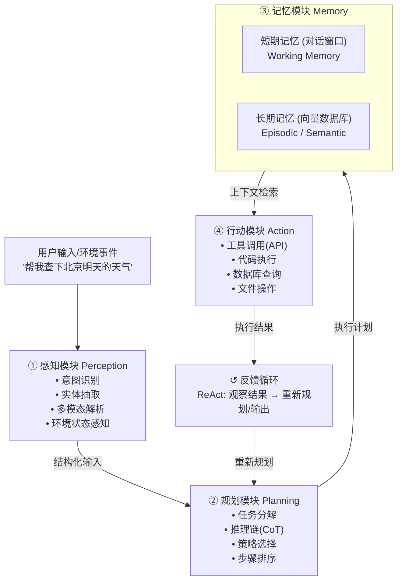

# 【美团面经】简述Agent的基本架构组成，并解释其与传统LLM Chain的区别

## 一、Agent的基本架构：四大核心模块

一个完整的Agent系统由**感知（Perception）、规划（Planning）、记忆（Memory）、行动（Action）** 四大模块构成，它们形成一个**闭环决策循环**：



### 2.1 感知模块（Perception）——Agent的眼睛

感知模块负责**将原始输入转化为结构化的内部表示**。

| 能力 | 说明 | 示例 |
|------|------|------|
| 意图识别 | 判断用户要做什么 | "查天气" → intent=search_weather |
| 实体抽取 | 提取关键参数 | "北京" → location, "明天" → date |
| 多模态解析 | 理解图片/音频/视频 | 截图 → UI元素描述 |
| 环境感知 | 获取系统当前状态 | 当前时间、用户位置、会话上下文 |

### 2.2 规划模块（Planning）——Agent的大脑

规划模块是Agent**区别于简单调用的核心**。它负责将复杂目标分解为可执行的步骤序列。

常见策略：
- **CoT（Chain-of-Thought）**：线性思维链，逐步推理
- **ToT（Tree-of-Thought）**：树状搜索，支持分支探索和回溯
- **ReAct**：推理与行动交替（Think→Act→Observe循环）
- **Plan-and-Execute**：先全局规划再逐步执行，可动态调整

### 2.3 记忆模块（Memory）——Agent的海马体

| 记忆类型 | 存储介质 | 时间跨度 | 作用 |
|---------|---------|---------|------|
| **短期记忆（Working）** | LLM上下文窗口 | 单次会话 | 当前对话轮次、中间推理结果 |
| **情景记忆（Episodic）** | 向量数据库 | 跨会话 | 历史交互记录（"上次帮我订了咖啡"） |
| **语义记忆（Semantic）** | 知识库/RAG | 持久 | 事实知识（"公司请假制度"） |
| **程序记忆（Procedural）** | 系统提示词/技能库 | 持久 | 执行方法（"如何调用搜索API"） |

### 2.4 行动模块（Action）——Agent的双手

行动模块负责**执行具体操作并与外部世界交互**：

```python
# 典型的工具调用示例（function calling）
tools = [
    {"name": "web_search",       "description": "搜索互联网信息"},
    {"name": "code_interpreter", "description": "执行Python代码"},
    {"name": "database_query",   "description": "查询业务数据库"},
    {"name": "send_email",       "description": "发送邮件通知"},
]
# Agent根据规划结果，自主决定调用哪些工具、传什么参数
```

## 二、Agent vs LLM Chain：根本区别是决策权归属

### 核心分水岭：谁决定下一步？

```
LLM Chain（预编排）：
  用户 → [LLM生成] → [格式化] → [调用API-A] → [LLM总结] → 输出
         ▲ 固定管道，每一步都是开发者写死的
         ▲ LLM只是管道中的"计算单元"

Agent（自主决策）：
  用户 → [感知] → [规划] → [执行] → [观察] → [再规划] → ... → 输出
         ▲ 循环结构，下一步做什么由LLM自己决定
         ▲ LLM是"决策中枢"，拥有控制流主权
```

### 详细对比表

| 维度 | LLM Chain | Agent |
|------|-----------|-------|
| **控制流** | 开发者预定义，固定DAG | LLM自主决定，动态循环 |
| **决策权** | 在开发者（人） | 在AI（LLM） |
| **执行路径** | 每次执行相同步骤 | 根据中间结果动态调整 |
| **步骤数** | 固定（N步） | 不确定（直到完成或终止） |
| **错误处理** | 预设的try/catch | 自主重试/换策略/请求帮助 |
| **类比** | 火车——轨道铺好，引擎只管跑 | 自动驾驶——自己决定走哪条路 |
| **适用场景** | 流程明确的任务（翻译、摘要） | 开放式任务（分析、决策、探索） |
| **可控性** | 高（每步可审计） | 中（需设guardrail） |
| **延迟** | 可预测（固定步骤） | 不可预测（循环次数不定） |
| **典型实现** | LangChain Chain、LCEL | LangGraph、AutoGen、CrewAI |
| **终止条件** | 管道执行完即终止 | LLM判断任务完成或达最大轮次 |

### 代码对比：同一个任务，两种实现

```python
# ============================================================
# 任务：用户提问 → 搜索 → 分析 → 生成回答
# ============================================================

# ---- LLM Chain方式：步骤写死，LLM不参与流程决策 ----
def llm_chain_pipeline(question: str):
    """每一步都是开发者硬编码的，LLM只负责内容生成"""
    # Step 1: 搜索（固定执行）
    search_result = web_search(question)
    # Step 2: 分析（固定执行）
    analysis = llm.generate(f"分析以下内容: {search_result}")
    # Step 3: 生成回答（固定执行）
    answer = llm.generate(f"基于分析结果回答问题: {analysis}")
    return answer
    # ❌ 如果搜索结果为空怎么办？如果需要多次搜索怎么办？
    # ❌ Chain无法自主决定——只能开发者预先写好所有分支


# ---- Agent方式：LLM自主决定下一步 ----
def agent_loop(question: str, max_steps: int = 10):
    """LLM在循环中自主决策：要不要搜索？搜什么？搜够了没有？"""
    messages = [{"role": "user", "content": question}]
    tools = [web_search, code_execute, database_query]

    for step in range(max_steps):
        # LLM决定下一步：是调用工具还是直接回答
        decision = llm.generate(
            messages=messages,
            tools=tools,
            system_prompt="你是一个自主Agent，根据需要选择工具完成任务"
        )

        if decision.is_final_answer:
            return decision.content       # LLM判断任务完成

        # LLM选择了某个工具 → 执行
        result = decision.tool.execute(decision.tool_args)

        # 将结果加入上下文 → LLM观察后决定下一步
        messages.append({"role": "tool", "content": result})

    return "达到最大步数限制"
    # ✅ 如果第一次搜索不够，LLM会自主发起第二次搜索
    # ✅ 如果发现需要查数据库，LLM会自主切换工具
```

### 自主性光谱

```
自主性 ←─────────────────────────────────────────────→ 高

  LLM Call      LLM Chain      Router Chain        Agent         AutoGPT
  (单次调用)     (固定管道)      (有限分支)         (自主循环)     (完全自主)
     │              │               │                 │              │
  "翻译这段"    "搜索→摘要→输出"  "分类后选管道"    "自己决定做什么"  "自己定义目标"
     │              │               │                 │              │
  无工具         内置工具         内置工具          可选工具        自创工具
```

## 三、面试回答要点总结

1. **Agent四模块**：感知（解析输入）→ 规划（推理决策）→ 记忆（上下文管理）→ 行动（工具执行），形成闭环
2. **与LLM Chain的本质区别**：决策权归属——Chain是开发者预编排的管道，Agent是LLM自主决策的循环
3. **不是替代关系**：LLM Chain适合确定性任务（高效可控），Agent适合不确定性任务（灵活自主）。生产系统中往往**混合使用**——主干用Chain保稳定，分支用Agent保灵活
4. **记忆系统是分水岭之一**：Chain通常无状态或仅有对话窗口，Agent具备短期+长期记忆体系

> **一句话总结**：Agent = 感知+规划+记忆+行动的自主决策闭环；LLM Chain = 预定义管道中嵌入LLM计算单元。分水岭是——**谁拥有"下一步做什么"的决策权**。

## 记忆要点

- 四大架构模块：感知、规划、记忆、行动共同组成Agent闭环决策循环
- 与传统对比：传统LLM Chain是无状态单次流水线，而Agent是有记忆的动态自循环
- 记忆机制：依赖短期上下文窗口与长期向量检索库，实现多轮状态感知
- 行动机制：Agent能自主调用外部API与代码执行环境，而非仅生成文本


## 苏格拉底式面试追问

> 这组追问模拟面试官层层逼问，每一问先回答"为什么"，再回答"怎么做"，最后回答"如何证明"。

### 第一层：目标与动机

**Q：Agent 和 LLM Chain 的区别，到底是"有没有循环"还是"决策权归属"？为什么这个区分重要？**

本质是决策权归属。LLM Chain 是开发者预先定义好每一步用哪个工具、什么顺序，LLM 只负责每一步的内容生成；Agent 是 LLM 自己决定"下一步做什么、用哪个工具、何时停止"。循环（ReAct 的 Thought-Action-Observation 循环）只是 Agent 的表现形式，不是本质——一个没有循环但由 LLM 选择工具的系统也是 Agent。这个区分重要，因为决策权归属决定了可预测性：Chain 可调试、可测试，Agent 灵活但需要更多的护栏（guardrails）和可观测性。

### 第二层：证据与定位

**Q：线上 Agent 偶尔出现"明明一个工具调用就能解决，却绕了 5 步"，你怎么定位是规划问题还是工具描述问题？**

看 trace 的每一步 Thought。1) 如果 Thought 里 LLM 明确提到正确的工具但最终选了别的，是工具选择阶段的问题（可能是工具 schema 的 description 写得有歧义，被 LLM 误判）；2) 如果 Thought 一开始就没提到正确工具，是规划/感知阶段的问题（可能用户意图没被正确解析，或工具列表没被召回）。具体用 tool_call_success_rate 按"是否一步到位"分桶统计。

### 第三层：根因深挖

**Q：你发现是工具描述写得太相似导致 LLM 选错，根因到底是什么——是描述写得差还是 LLM 能力不够？**

通常是描述写得差。LLM 选工具靠的是工具 name + description + parameters schema 的语义匹配，如果"search_order"和"query_order"的 description 高度相似（都写"查订单信息"），LLM 必然混淆。根因是工具的语义边界没设计清楚。改进方向：每个工具的 description 必须写清"什么时候用"和"什么时候不用"，参数用 enum 约束取值范围。

**Q：那为什么不直接用更大的模型（比如 70B）来提升工具选择能力，而要花精力写工具描述？**

两个原因：1) 成本——70B 的单次推理成本是 7B 的 8-10 倍，Agent 多步调用会放大这个差距；2) 描述不清时大模型也会错——如果两个工具的 description 完全一样，175B 也分不清。写清楚工具描述是"提升信号"，换大模型是"提升信噪比"，前者收益更直接且不增加运行成本。正确顺序是先优化描述，描述优化到极限（准确率 90%）再考虑换模型。

### 第四层：方案权衡

**Q：Agent 的"自主决策"听起来很强大，为什么不在所有环节都让 Agent 自主？**

因为自主 = 不可预测。在涉及金额、权限、不可逆操作的环节（退款、删除数据、提现），Agent 自主决策的风险太高。这些环节必须用 Workflow 固定流程 + 人工审批断点。Agent 的自主性应该用在"探索、规划、信息聚合"这类可逆、可重试的环节。这是 Agent vs Workflow 的核心权衡：可逆性高的任务给 Agent，不可逆的任务给 Workflow。

**Q：那如果业务方坚持要 Agent 全自主（说这样体验更好），你怎么说服他？**

用故障成本量化。算一笔账：一次错误退款的直接损失（资金）+ 申诉成本 + 信任损失，对比 Agent 自主 vs Workflow+审批的延迟差（通常 30s vs 5s）。如果单次错误损失 > 100 元，而审批延迟导致的用户流失 < 1%，显然审批更划算。再给一个折中：低金额（< 50 元）全自主，高金额走审批，用阈值动态切换。

### 第五层：验证与沉淀

**Q：你怎么衡量一个系统到底是 Agent 还是 Chain——有没有量化指标？**

看"步骤决策的熵"。统计同一类任务下，工具调用序列的分布：如果 95% 的任务走完全相同的工具序列，熵接近 0，本质是 Chain；如果工具序列分散在多种组合，熵高，是 Agent。另一个指标是"平均自主决策次数"——任务过程中 LLM 主动选择工具/分支的次数。沉淀为 Agent 成熟度评估表：自主决策占比、可预测性熵、护栏触发率三个维度，用来判断系统该往 Agent 还是 Chain 方向收敛。

## 结构化回答


**30 秒电梯演讲：** LLM Chain就像火车轨道铺好的AI是引擎但方向人定，Agent就像自动驾驶汽车AI自己决定走哪条路。

**展开框架：**
1. **感知模块解析** — 感知模块解析输入
2. **规划模块推理** — 规划模块推理决策
3. **记忆模块上下** — 记忆模块上下文管理

**收尾：** ReAct模式和Agent有什么关系？


## 视频脚本

> 预计时长：4 分钟 | 由浅入深


| 时间 | 画面/字幕 | 口播台词 | 讲解要点 |
|------|----------|----------|----------|
| 0:00 | 标题卡：简述Agent的基本架构组成，并解释其与传统… | "LLM Chain就像火车轨道铺好的AI是引擎但方向人定，Agent就像自动驾驶汽车AI自…" | 开场钩子 |
| 0:20 | 核心概念图 | "Agent由感知、规划、记忆、行动四大模块构成。与LLM Chain的根本区别在于决策权在AI还是在人。" | 核心定义 |
| 0:50 | 感知模块解示意图 | "感知模块解——感知模块解析输入" | 要点拆解1 |
| 1:30 | 对比/实战案例图 | "对比一下常见误区和工程实践，看真实场景里怎么取舍。" | 实战与对比 |
| 2:20 | 总结卡 | "记住核心要点。下期我们追问：ReAct模式和Agent有什么关系？" | 收尾与钩子 |
