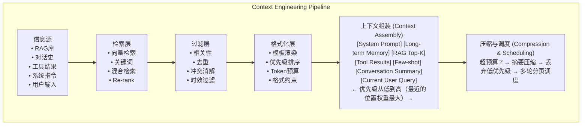

# 【美团面经】上下文工程是什么？解决了什么问题？

## 一句话回答

> 上下文工程（Context Engineering）是对输入给 LLM 的**所有信息进行系统化设计、组织、压缩和调度**的工程实践。它解决四个核心问题：① **窗口限制**——token 物理上限下的信息取舍；② **信息组织**——排列顺序影响推理准确率超 30%；③ **冲突与优先级**——当多个来源信息矛盾时如何消歧；④ **记忆分层**——短期对话与长期知识的调度策略。本质是**有限带宽下的信息最优编码**——LLM 上下文窗口就是一条带宽有限的通信信道，上下文工程就是信源编码。

---

## 一、为什么需要上下文工程

### 1.1 问题的根源

LLM 的工作原理是「给定上下文，预测下一个 token」。这意味着**上下文就是模型的全部世界**。然而上下文窗口是有限的：

| 模型 | 上下文窗口 | 约等于 |
|------|-----------|--------|
| GPT-4o | 128K tokens | ~96K 英文单词 / ~200页 |
| Claude 3.5 | 200K tokens | ~150K 单词 / ~500页 |
| Gemini 1.5 Pro | 1M tokens | ~750K 单词 / 几本书 |

即使用 Gemini 的 1M 窗口，塞满上下文也面临三个致命问题：

1. **"Lost in the Middle"** —— 中间位置的信息被忽略（NeurIPS 2023 证实）
2. **噪声稀释** —— 无关信息降低关键信息的注意力权重
3. **成本爆炸** —— 每次调用按输入 token 计费，128K tokens 一次约 $0.50+

### 1.2 传统方案 vs 上下文工程

| 维度 | 传统做法（堆Prompt） | 上下文工程 |
|------|---------------------|-----------|
| 信息来源 | 全部塞进 Prompt | 动态检索 + 按需注入 |
| 信息组织 | 随意排列 | 优先级排序 + 结构化 |
| 窗口溢出 | 截断尾部 | 摘要压缩 + 分层调度 |
| 信息冲突 | 无处理 | 明确优先级声明 |
| 评估 | 人工看效果 | 量化指标（信噪比、召回率） |

---

## 二、上下文工程架构



---

## 三、核心问题一：窗口限制与信息压缩

### 3.1 Token 预算管理

```python
import tiktoken
from dataclasses import dataclass
from typing import Optional

@dataclass
class ContextBlock:
    """上下文的一个信息块"""
    content: str
    source: str           # "system" | "rag" | "memory" | "tool" | "user"
    priority: int         # 1=最高, 10=最低
    tokens: int = 0       # 自动计算

    def __post_init__(self):
        enc = tiktoken.encoding_for_model("gpt-4")
        self.tokens = len(enc.encode(self.content))


class ContextManager:
    """上下文预算管理器：确保组装的Prompt不超过Token限制"""

    def __init__(self, max_tokens: int = 8000, reserve_for_output: int = 1000):
        self.max_input = max_tokens - reserve_for_output
        self.blocks: list[ContextBlock] = []

    def add_block(self, content: str, source: str, priority: int):
        self.blocks.append(ContextBlock(content, source, priority))

    def assemble(self) -> str:
        """按优先级排序，在Token预算内组装上下文"""
        # 1. 按优先级排序（高优先级先放入）
        self.blocks.sort(key=lambda b: b.priority)

        # 2. 贪心填充：优先级高的先放
        selected = []
        total = 0
        for block in self.blocks:
            if total + block.tokens <= self.max_input:
                selected.append(block)
                total += block.tokens
            elif block.priority <= 2:
                # 高优先级但太长：做摘要压缩
                compressed = self._compress(block, self.max_input - total)
                if compressed:
                    selected.append(compressed)
                    total += compressed.tokens

        # 3. 组装为最终文本（优先级最低的在前，最高的在后）
        parts = [b.content for b in selected]
        return "\n\n---\n\n".join(parts)

    def _compress(self, block: ContextBlock, budget: int) -> Optional[ContextBlock]:
        """对过长的高优先级信息块做LLM摘要压缩"""
        if budget < 200:
            return None  # 预算太小不值得压缩
        # 调用LLM做摘要
        summary = llm_summarize(block.content, max_tokens=budget)
        return ContextBlock(summary, f"{block.source}(摘要)", block.priority)

# 使用
ctx = ContextManager(max_tokens=8000)
ctx.add_block(SYSTEM_PROMPT, "system", priority=1)      # 系统指令：必留
ctx.add_block(rag_results, "rag", priority=3)           # RAG检索：重要
ctx.add_block(conversation_history, "memory", priority=4) # 对话历史：中等
ctx.add_block(tool_output, "tool", priority=5)          # 工具结果：次要

final_prompt = ctx.assemble()  # 保证不超Token预算
```

### 3.2 对话历史压缩策略

```python
class ConversationCompressor:
    """多轮对话历史压缩：近精远粗"""

    def compress_history(self, messages: list[dict], strategy: str = "sliding") -> list[dict]:
        if strategy == "sliding":
            # 滑动窗口：保留最近N轮 + 最早1轮
            return self._sliding_window(messages, keep_recent=6)
        elif strategy == "summary":
            # 摘要压缩：旧轮次摘要 + 近轮次原文
            return self._summary_compress(messages, split_at=8)
        elif strategy == "hybrid":
            # 混合：摘要 + 关键实体保留
            return self._hybrid_compress(messages)

    def _summary_compress(self, messages: list[dict], split_at: int) -> list[dict]:
        """早期对话压缩为摘要，近期保留原文"""
        if len(messages) <= split_at:
            return messages

        old = messages[:-split_at]   # 早期 → 摘要
        recent = messages[-split_at:] # 近期 → 原文

        summary = llm_summarize(
            "\n".join(f"{m['role']}: {m['content']}" for m in old),
            instruction="提炼关键信息：用户意图、已确认的事实、待解决的问题"
        )
        return [
            {"role": "system", "content": f"[对话摘要]\n{summary}"},
            *recent
        ]
```

---

## 四、核心问题二：信息组织与优先级

### 4.1 "Lost in the Middle" 问题

研究表明，LLM 对上下文开头和结尾的信息关注度远高于中间位置：

```
注意力权重分布：
  高 ████████████░░░░░░░░████████████  高
  低 ░░░░░░░░░░░░████████░░░░░░░░░░░░  低
     └─── 开头 ───┤ 中间 ├─── 结尾 ───┘

  策略：最重要的信息放在开头和结尾，次要信息放中间
```

### 4.2 结构化信息注入

```python
def format_context_blocks(blocks: list[ContextBlock]) -> str:
    """用XML标签结构化信息区块，提升模型解析准确率"""
    sections = []

    # 按来源分组
    for source in ["system", "memory", "rag", "tool"]:
        matching = [b for b in blocks if b.source == source]
        if matching:
            content = "\n\n".join(b.content for b in matching)
            sections.append(f"<{source}_context>\n{content}\n</{source}_context>")

    # 用户查询放最后（最高注意力位置）
    user_query = next((b for b in blocks if b.source == "user"), None)
    if user_query:
        sections.append(f"<current_query>\n{user_query.content}\n</current_query>")

    return "\n\n".join(sections)
```

### 4.3 优先级冲突声明

当 RAG 检索结果和系统指令冲突时，必须明确优先级：

```python
CONFLICT_RESOLUTION_PROMPT = """
当以下信息出现冲突时，按优先级处理：
1. [系统指令]（最高优先级）—— 安全规则和行为准则
2. [当前用户查询] —— 用户的直接需求
3. [工具调用结果] —— 实时数据（覆盖历史记忆）
4. [RAG检索结果] —— 知识库事实
5. [对话历史] —— 上下文延续（最低优先级）

如果检索结果与系统指令矛盾，以系统指令为准。
"""
```

---

## 五、核心问题三：记忆分层

### 5.1 三层记忆架构

```
┌─────────────────────────────────────────────────┐
│            工作记忆（Working Memory）              │  ← 当前对话窗口
│           • 最近 5-10 轮对话原文                   │     直接在 Context 中
│           • 当前用户输入                           │
│           • 工具调用结果                           │
├─────────────────────────────────────────────────┤
│            短期记忆（Short-term Memory）           │  ← 会话级别
│           • 对话摘要                              │     摘要后注入
│           • 已确认的用户偏好                       │
│           • 本轮任务的关键实体                     │
├─────────────────────────────────────────────────┤
│            长期记忆（Long-term Memory）            │  ← 跨会话持久化
│           • 用户画像（历史偏好、行为模式）           │     RAG 检索注入
│           • 知识库（文档、FAQ）                    │
│           • 向量数据库（语义检索）                  │
└─────────────────────────────────────────────────┘
```

### 5.2 记忆管理代码实现

```python
from datetime import datetime, timedelta
from dataclasses import dataclass, field
import json

@dataclass
class MemoryItem:
    content: str
    memory_type: str       # "fact" | "preference" | "entity" | "summary"
    importance: float      # 0.0-1.0
    created_at: datetime
    last_accessed: datetime
    access_count: int = 0
    embedding: list = field(default_factory=list)


class MemoryManager:
    """三层记忆管理器"""

    def __init__(self, vector_store):
        self.working: list[dict] = []        # 工作记忆：原始对话
        self.short_term: list[MemoryItem] = []  # 短期记忆：本轮摘要
        self.long_term = vector_store         # 长期记忆：向量库

    def add_message(self, role: str, content: str):
        """添加到工作记忆"""
        self.working.append({"role": role, "content": content})
        # 工作记忆溢出时触发摘要
        if len(self.working) > 20:
            self._consolidate()

    def _consolidate(self):
        """将工作记忆固化为短期记忆摘要"""
        old_msgs = self.working[:-6]  # 保留最近6轮
        summary = llm_summarize(
            "\n".join(f"{m['role']}: {m['content']}" for m in old_msgs),
            instruction="提取关键事实、用户偏好和重要实体"
        )
        # 写入短期记忆
        self.short_term.append(MemoryItem(
            content=summary,
            memory_type="summary",
            importance=0.8,
            created_at=datetime.now(),
            last_accessed=datetime.now()
        ))
        # 工作记忆只保留最近部分
        self.working = self.working[-6:]

    def retrieve_context(self, query: str) -> dict:
        """根据当前查询检索相关记忆"""
        # 1. 工作记忆：全部注入（最近上下文）
        working_ctx = self.working.copy()

        # 2. 短期记忆：全部注入（本轮关键信息）
        short_ctx = [m.content for m in self.short_term]

        # 3. 长期记忆：语义检索 Top-K
        long_ctx = self.long_term.search(query, top_k=5)

        return {
            "working_memory": working_ctx,
            "short_term": short_ctx,
            "long_term": long_ctx,
        }

    def persist(self):
        """会话结束时将重要短期记忆写入长期记忆"""
        for item in self.short_term:
            if item.importance > 0.6:
                self.long_term.upsert(
                    content=item.content,
                    metadata={"type": item.memory_type}
                )
```

---

## 六、核心问题四：信息质量评估

### 6.1 上下文质量指标

| 指标 | 含义 | 测量方法 |
|------|------|---------|
| **信噪比（SNR）** | 有用信息 / 总Token | 人工标注有用段落比例 |
| **召回率** | 关键信息是否被包含 | 对 golden answer 做逆向验证 |
| **冲突率** | 矛盾信息占比 | 自动检测相互否定的陈述 |
| **冗余率** | 重复信息占比 | 语义去重后 token 减少比例 |
| **新鲜度** | 信息时效性 | 检查时间戳是否过期 |

### 6.2 信噪比量化

```python
class ContextQualityScorer:
    """上下文质量评估器"""

    def score(self, assembled_prompt: str, expected_answer: str) -> dict:
        total_tokens = count_tokens(assembled_prompt)

        # 1. 信噪比：用LLM判断每段是否与最终回答相关
        blocks = assembled_prompt.split("\n\n---\n\n")
        relevant = 0
        for block in blocks:
            if llm_judge_relevance(block, expected_answer):
                relevant += count_tokens(block)
        snr = relevant / total_tokens if total_tokens > 0 else 0

        # 2. 冗余率：语义去重
        unique_tokens = self._dedup_tokens(blocks)
        redundancy = 1 - unique_tokens / total_tokens

        return {
            "snr": f"{snr:.1%}",              # 信噪比
            "redundancy": f"{redundancy:.1%}",  # 冗余率
            "total_tokens": total_tokens,
            "block_count": len(blocks),
        }
```

---

## 七、实战：完整上下文组装流水线

```python
class ContextEngineeringPipeline:
    """端到端上下文工程流水线"""

    def __init__(self, llm, vector_store, max_tokens: int = 8000):
        self.memory = MemoryManager(vector_store)
        self.budget = ContextManager(max_tokens)
        self.scorer = ContextQualityScorer()

    async def run(self, user_query: str) -> str:
        # 1. 检索层：RAG + 长期记忆
        rag_results = await self.memory.long_term.search(user_query, top_k=5)
        memory_ctx = self.memory.retrieve_context(user_query)

        # 2. 过滤层：去重 + 冲突消解
        filtered = self._filter_and_dedup(rag_results, memory_ctx)

        # 3. 格式化层：结构化组装
        self.budget.add_block(SYSTEM_PROMPT, "system", priority=1)
        self.budget.add_block(filtered["memory"], "memory", priority=2)
        self.budget.add_block(filtered["rag"], "rag", priority=3)
        self.budget.add_block(user_query, "user", priority=1)  # 最高优先级

        # 4. 预算管理：压缩 + 排序
        prompt = self.budget.assemble()

        # 5. 质量检查
        # quality = self.scorer.score(prompt, expected="")

        # 6. 调用LLM
        response = await llm.chat(prompt)

        # 7. 更新记忆
        self.memory.add_message("user", user_query)
        self.memory.add_message("assistant", response)

        return response
```

---

## 八、面试高频追问

### Q1: 上下文窗口满了怎么处理？

**答：** 分三步：① **摘要压缩**——将早期对话用 LLM 压缩为摘要，近期对话保留原文（近精远粗策略）；② **优先级丢弃**——按优先级丢弃低价值块（如过期的工具结果、冗余的 RAG 文档）；③ **分页调度**——将信息分成多个 chunk，通过多轮对话逐页处理（类似数据库分页查询）。极端情况下可使用 MapReduce 模式：分块处理后再汇总。

### Q2: 如何衡量上下文质量？

**答：** 核心指标是**信噪比**（Signal-to-Noise Ratio）——有用信息占上下文总量的比例。测量方法：对 golden answer 做逆向分析，标记上下文中哪些段落对最终回答有贡献，有贡献的 token / 总 token = SNR。生产中还可监控：准确率（与 golden set 对比）、延迟（token 越多越慢）、成本（token 直接关联费用）。SNR > 60% 是健康线。

### Q3: 上下文工程和 RAG 的关系？

**答：** RAG 是上下文工程的**一个子模块**。RAG 解决的是「从海量知识中检索相关文档」，而上下文工程解决的是「把所有来源的信息（RAG结果 + 对话历史 + 工具结果 + 系统指令 + 用户输入）整合成最优的上下文」。类比：RAG 是食材采购，上下文工程是完整厨房管理——包括采购、洗切、搭配、烹饪顺序、上菜节奏。一个没有上下文工程的 RAG 系统只是把所有检索结果堆进 Prompt，效果远不如经过过滤、排序、压缩、结构化的系统。

### Q4: 上下文工程和 Attention 机制有什么联系？

**答：** Attention 机制是上下文工程的**理论基础**。Attention 权重本质上就是模型对上下文中各 token 的分配权重——上下文工程就是通过**优化输入信息排列**来引导 Attention 权重向关键信息倾斜。例如「Lost in the Middle」现象的本质是 Attention 对中间位置衰减；XML 标签结构化能提升 Attention 对区块边界的感知。理解 Attention 机制能指导我们设计更有效的上下文结构。

## 记忆要点

- 一句话定义：对所有输入LLM的信息进行系统化设计、调度与压缩的工程实践。
- 解决四大痛点：窗口物理限制、信息组织排序、多源冲突消歧、短长期记忆分层调度。
- 因为LLM存在“中间迷失”和噪声稀释效应，所以不能全塞Prompt，必须动态检索与结构化。
- 本质隐喻：有限带宽下的信息最优编码，即LLM信道下的信源编码。


## 苏格拉底式面试追问

> 这组追问模拟面试官层层逼问，每一问先回答"为什么"，再回答"怎么做"，最后回答"如何证明"。

### 第一层：目标与动机

**Q：上下文工程（Context Engineering）和提示词工程（Prompt Engineering）有什么本质区别？为什么要单独提"上下文工程"？**

Prompt Engineering 关注"怎么写好一段 prompt"，是静态的、单次的；Context Engineering 关注"在一次多步任务中，每一步该把什么信息喂给模型"，是动态的、工程化的。后者要解决的问题包括：上下文超长怎么压缩、中间结果怎么取舍、历史记忆怎么召回、工具 schema 何时挂载。单独提上下文工程是因为 Agent 系统里 token 预算和注意力是稀缺资源，工程化管理上下文比优化单条 prompt 的收益大得多。

### 第二层：证据与定位

**Q：你的 Agent 在多步任务第 7 步突然忘了第 2 步的关键信息，怎么定位是上下文被截断了还是 LLM 注意力丢失？**

看第 7 步调用 LLM 时的实际 input token 数和完整 context。1) 如果 input token 接近 context window 上限且有截断痕迹（用 tokenizer 数原始上下文 vs 实际传入），是工程层截断；2) 如果 input token 远低于上限（比如只用了 4K / 32K），是 LLM 的 lost in the middle 注意力衰减。验证方法：把第 2 步的关键信息移到 context 的末尾（最近位置），看第 7 步是否恢复记忆——如果恢复，确认是注意力位置偏差。

### 第三层：根因深挖

**Q：上下文工程里压缩历史消息（用摘要替代原始消息）会丢失细节，这个损失的根因是摘要算法不好还是信息本身就该丢？**

要看丢失的是什么信息。1) 如果丢的是"用户明确说过的约束"（如"金额不超过 1000"），是摘要算法的问题——摘要时没识别出这是硬约束；2) 如果丢的是"中间步骤的工具调用日志"，是合理的丢失——这些日志对后续决策价值低。根因判断方法：对摘要前后做 diff，分类丢失的内容是"决策相关"还是"过程噪声"。好的摘要算法应该保留"用户意图、关键约束、未完成的子任务"三类信息。

**Q：既然摘要会丢信息，为什么不直接用支持 1M context 的模型（如 Gemini）全量塞进去？**

三个问题：1) 成本——1M token 的单次调用成本极高，多步任务会放大；2) 延迟——长 context 的 prefill 延迟线性增长，1M token 的首 token 延迟可能到 30s+；3) 注意力衰减——长 context 的 recall@position 实测呈 U 型曲线，中间位置的信息检索准确率显著低于首尾。超长 context 是"装得下但看不清"，摘要 + 按需召回是"少而精"，后者效果通常更好。

### 第四层：方案权衡

**Q：上下文工程要做"按需召回"，但召回本身要一次额外的 embedding 检索，增加延迟，怎么权衡？**

权衡点是"召回延迟 vs 主 LLM 调用的 token 节省"。embedding 检索（向量库 top-K）的延迟通常 20-50ms，而少塞 2000 token 节省的主 LLM 推理延迟可能 500ms+（取决于模型）。所以按需召回在大多数情况下是净收益。例外是"上下文很短且固定"的场景（< 2000 token），直接全塞比召回更快更准。决策公式：如果 full_context_token > 4000 且 query 频繁变化，用召回；否则全塞。

**Q：为什么不直接把所有历史用 RAG 索引，主 LLM 调用时实时检索，而要维护"短期上下文 + 长期记忆"两套？**

因为两类信息的访问模式不同。短期上下文（当前任务的最近几步）是"必读"的，每次都要全量带上；长期记忆是"按需"的，只有相关时才检索。如果都走 RAG，短期上下文的召回率无法保证 100%（embedding 相似度不等于任务相关性），关键信息可能漏召。两套机制是"确定性优先"（短期全量）+ "效率优先"（长期检索）的分工。

### 第五层：验证与沉淀

**Q：你怎么量化上下文工程的优化效果？**

三个核心指标：1) context_token_efficiency = decision_relevant_token / total_input_token，越高越好（理想 > 60%）；2) multi_step_consistency——同一任务多步推理时关键信息的一致性（用 probe 问题在第 N 步检测第 1 步的信息是否还在）；3) tool_call_accuracy_at_step_N——第 N 步的工具调用准确率，间接反映上下文质量。沉淀为上下文质量监控看板，每次 prompt 或 Memory 策略变更必须跑回归。

## 结构化回答


**30 秒电梯演讲：** 就像厨师备菜——不是把所有食材扔进锅里，而是洗切搭配好按上菜顺序放去掉坏叶。

**展开框架：**
1. **RAG** — 窗口长度限制用RAG检索加重排序加摘要
2. **信息组织影响** — 信息组织影响推理准确率超30%
3. **信息冲突与优** — 信息冲突与优先级声明

**收尾：** 上下文窗口满了怎么处理？


## 视频脚本

> 预计时长：5 分钟 | 由浅入深


| 时间 | 画面/字幕 | 口播台词 | 讲解要点 |
|------|----------|----------|----------|
| 0:00 | 标题卡：上下文工程是什么？解决了什么问题？ | "就像厨师备菜——不是把所有食材扔进锅里，而是洗切搭配好按上菜顺序放去掉坏叶。" | 开场钩子 |
| 0:20 | 核心概念图 | "上下文工程是对输入给模型的所有信息进行系统化设计组织压缩和调度的工程实践。" | 核心定义 |
| 0:50 | 窗口长度限制示意图 | "窗口长度限制——窗口长度限制用RAG检索加重排序加摘要" | 要点拆解1 |
| 1:30 | 信息组织影响示意图 | "信息组织影响——信息组织影响推理准确率超30%" | 要点拆解2 |
| 2:20 | 对比/实战案例图 | "对比一下常见误区和工程实践，看真实场景里怎么取舍。" | 实战与对比 |
| 3:10 | 总结卡 | "记住核心要点。下期我们追问：上下文窗口满了怎么处理？" | 收尾与钩子 |
