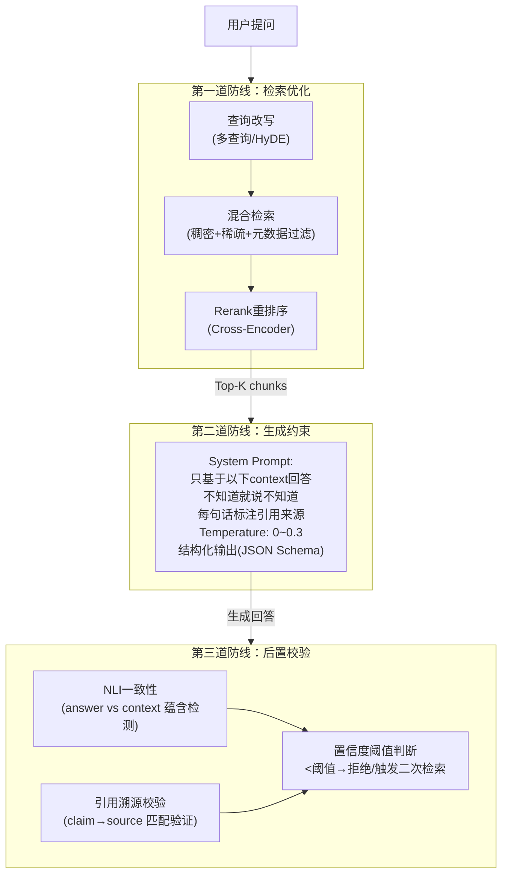

# 如何限制RAG幻觉？

## 🎯 本质

RAG幻觉 = LLM在检索上下文不足/不相关时，用自身参数知识"编造"内容。限制幻觉需要**检索→生成→校验**三道防线。

## 🧒 费曼类比

开卷考试中学生翻到错误页码 → 凭记忆编答案。限制幻觉 = 翻对页（检索优化）+ 只抄书上的（生成约束）+ 老师检查出处（后置校验）。

## 📊 架构图



## 🔧 专业详解

### 1. 检索层优化（减少"无据可依"）

| 技术 | 原理 | 效果 |
|------|------|------|
| **混合检索** | 稠密向量(语义) + 稀疏BM25(关键词) + 融合排序 | 兼顾语义理解和精确匹配 |
| **查询改写** | Multi-Query(多角度生成查询) / HyDE(假设性文档) | 提升召回覆盖面 |
| **Rerank重排序** | Cross-Encoder对query-chunk对精排 | Top-K精度提升20-30% |
| **元数据过滤** | 按时间/来源/类别预过滤 | 减少噪声chunk |
| **父子文档分块** | 检索子块(精确) → 返回父块(完整上下文) | 解决分块断裂问题 |

### 2. 生成层约束（让模型"不敢编"）

```python
SYSTEM_PROMPT = """你是一个严谨的知识助手。请遵循：
1. 只基于<context>中的内容回答问题
2. 如果<context>中没有相关信息，直接说"根据现有资料，我无法回答这个问题"
3. 每个事实陈述后用[1][2]标注来源chunk编号
4. 不要编造、推测或补充context以外的信息
5. 对于数字、日期、人名等实体，必须直接引用原文

<context>
{retrieved_chunks}
</context>
"""
# 关键参数
generation_config = {
    "temperature": 0.1,   # 低温减少随机性
    "top_p": 0.9,
    "max_tokens": 512,    # 限制长度避免发散
}
```

### 3. 后置校验层（"编了也拦住"）

```python
# NLI (Natural Language Inference) 一致性校验
from sentence_transformers import CrossEncoder

nli_model = CrossEncoder('cross-encoder/nli-deberta-v3-base')

def check_faithfulness(answer: str, context: str) -> float:
    """
    返回 answer 被 context 蕴含的概率
    >0.8: 忠实  | 0.5~0.8: 存疑  | <0.5: 可能幻觉
    """
    # 逐句拆分answer，每句单独校验
    sentences = split_sentences(answer)
    scores = []
    for sent in sentences:
        result = nli_model.predict([(context, sent)])
        # [entailment, neutral, contradiction]
        scores.append(result[0])  # entailment概率
    return min(scores)  # 最差的一句决定整体

# 工程实践：低于阈值触发兜底
faith_score = check_faithfulness(answer, context)
if faith_score < 0.5:
    return "抱歉，我无法确认这个问题的答案，建议联系人工客服。"
```

### 4. 评估指标（RAGAS框架）

| 指标 | 含义 | 目标 |
|------|------|------|
| **Faithfulness** | 答案中每个claim是否可从context推导 | >0.95 |
| **Answer Relevancy** | 答案是否直接回答了问题 | >0.85 |
| **Context Precision** | 检索的context中有多少是相关的 | >0.80 |
| **Context Recall** | 回答问题所需信息是否都在context中 | >0.85 |

## 💻 代码示例：完整的防幻觉Pipeline

```python
class HallucinationGuardedRAG:
    def __init__(self):
        self.retriever = HybridRetriever(
            dense_model="bge-large-zh",
            sparse_model="bm25",
            reranker="bge-reranker-large",
            top_k=5
        )
        self.llm = LLM(model="gpt-4o", temperature=0.1)
        self.nli_checker = NLIChecker()
    
    def answer(self, query: str) -> dict:
        # Step 1: 检索
        chunks = self.retriever.retrieve(query, top_k=5)
        context = "\n".join([f"[{i}] {c.text}" for i, c in enumerate(chunks)])
        
        # Step 2: 检查是否有足够上下文
        if self._context_relevance(query, chunks) < 0.3:
            return {"answer": "知识库中未找到相关信息", "status": "no_context"}
        
        # Step 3: 生成
        prompt = self._build_prompt(query, context)
        answer = self.llm.generate(prompt)
        
        # Step 4: 后置校验
        faith = self.nli_checker.check(answer, context)
        if faith < 0.5:
            return {"answer": "生成内容未能通过事实校验", "status": "blocked", 
                    "raw": answer, "faith_score": faith}
        
        return {"answer": answer, "status": "ok", "faith_score": faith,
                "sources": [c.metadata for c in chunks]}
```

## 💡 例子

**场景**：客服RAG系统中，用户问"你们的退款政策是什么？"

- **无防护**：LLM编了一个"7天无理由退款"（实际可能是15天，或不同品类不同政策）
- **有防护**：
  - 检索到退款政策文档(3个chunk) → Prompt约束只基于文档回答 → NLI校验答案确实来自文档 → 输出"根据退款政策，电子商品支持7天，实体商品支持15天[1][2]"

## ❓ 苏格拉底式面试追问

1. **"你说检索质量好了就不会幻觉了，但如果知识库本身有错误信息呢？"**
   → 引出知识库质量管理、冲突检测、版本控制等话题

2. **"NLI校验模型本身也会出错，你怎么保证校验的准确性？"**
   → 引出多重校验、集成方法、人工抽样审核等

3. **"如果用户问的是开放性问题，比如'你觉得这个产品怎么样'，怎么防幻觉？"**
   → 区分事实型问题(严格约束) vs 意见型问题(标注主观性)的不同处理策略

## 结构化回答

**30 秒电梯演讲：** RAG幻觉 = LLM在检索到的上下文不足或不相关时，用自身参数知识"编造"看似合理但实际错误的内容。限制幻觉 = 从检索质量、生成约束、后置校验三道防线层层过滤。

**展开框架：**
1. **检索层** — 提升召回率(混合检索+重排序)、过滤低相关chunk、查询改写
2. **生成层** — Prompt约束(只基于context回答)、温度调低、结构化输出
3. **后置层** — 事实一致性校验(NLI)、引用溯源、置信度阈值过滤

**收尾：** 您想深入聊：检索召回率已经90%了，为什么还会有幻觉？


## 视频脚本

> 预计时长：4 分钟 | 由浅入深


| 时间 | 画面/字幕 | 口播台词 | 讲解要点 |
|------|----------|----------|----------|
| 0:00 | 标题卡：如何限制RAG幻觉？ | "想象你是一个开卷考试的学生。如果你翻到的参考页码不对（检索失败），你可能凭记忆瞎编答案（幻…" | 开场钩子 |
| 0:20 | 核心概念图 | "RAG幻觉 = LLM在检索到的上下文不足或不相关时，用自身参数知识"编造"看似合理但实际错误的内容。限制幻觉 = 从检…" | 核心定义 |
| 0:50 | 检索层示意图 | "检索层——提升召回率(混合检索+重排序)、过滤低相关chunk、查询改写" | 要点拆解1 |
| 1:30 | 对比/实战案例图 | "对比一下常见误区和工程实践，看真实场景里怎么取舍。" | 实战与对比 |
| 2:20 | 总结卡 | "记住核心要点。下期我们追问：检索召回率已经90%了，为什么还会有幻觉？" | 收尾与钩子 |
