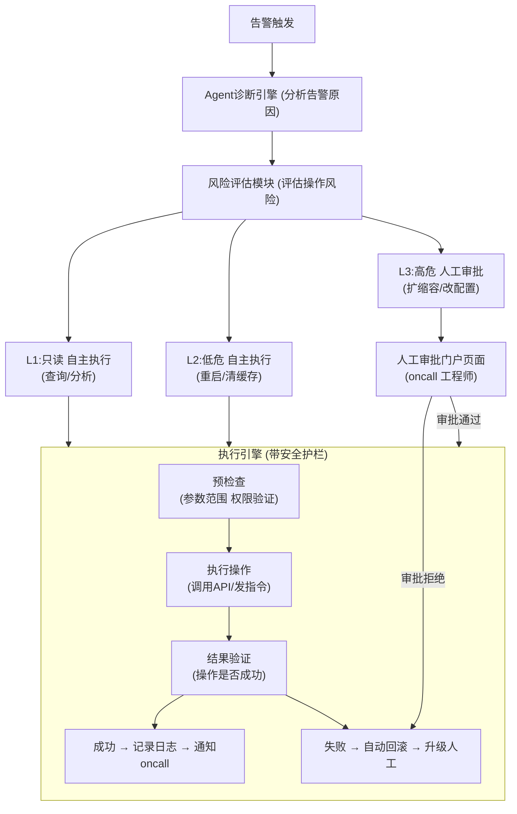

# 告警Agent如何控制风险，人工在哪一步介入？

## 🎯 本质

分级权限 + Human-in-the-Loop(HITL) + 回滚能力 = 安全的告警Agent。核心是**按操作风险等级划分Agent自主权限**。

## 🧒 费曼类比

医院实习医生：能自己开检查单（低风险自主），手术方案必须主任签字（高风险审批），所有操作写病历（审计日志）。

## 📊 架构图



## 🔧 专业详解

### 风险分级体系

| 等级 | 操作类型 | Agent权限 | 人工介入点 | 示例 |
|------|---------|----------|-----------|------|
| **L1 只读** | 查询/分析/诊断 | 完全自主 | 无需介入 | 查日志、看监控、分析指标 |
| **L2 低危写** | 可逆操作 | 自主执行+日志 | 执行后通知 | 重启Pod、清理缓存、调整限流阈值 |
| **L3 高危写** | 影响面大 | 需审批 | 执行前审批 | 扩缩容、修改配置、切流量 |
| **L4 不可逆** | 删除/下线 | 禁止执行 | 完全人工 | 删除数据库、下线服务、清空队列 |

### 三种Human-in-the-Loop模式

```python
class AlertAgent:
    def handle_alert(self, alert):
        # Step 1: 诊断
        diagnosis = self.diagnose(alert)
        
        # Step 2: 生成修复方案
        plan = self.generate_plan(diagnosis)
        
        # Step 3: 风险评估
        risk_level = self.assess_risk(plan)
        
        if risk_level == 'L1':  # 只读，直接执行
            return self.execute(plan, mode='auto')
        
        elif risk_level == 'L2':  # 低危写，先执行后通知
            result = self.execute(plan, mode='auto')
            self.notify_oncall(f"[AUTO] 已执行: {plan}", result)
            return result
        
        elif risk_level == 'L3':  # 高危写，需审批
            approval = self.request_approval(plan, alert, diagnosis)
            if approval.approved:
                # Approval模式: 人工确认后才执行
                return self.execute(plan, mode='supervised')
            else:
                return {"status": "rejected", "reason": approval.reason}
        
        elif risk_level == 'L4':  # 不可逆，禁止
            self.notify_oncall(f"[BLOCKED] 检测到高危操作: {plan}")
            return {"status": "blocked", "plan": plan}
```

### 安全护栏设计

```python
class SafetyGuardrail:
    """Agent操作安全护栏"""
    
    # 操作白名单
    ALLOWED_ACTIONS = {
        'restart_pod': {'max_replicas': 5, 'require_approval': False},
        'clear_cache': {'max_keys': 10000, 'require_approval': False},
        'scale_up': {'max_factor': 2.0, 'require_approval': True},
        'modify_config': {'allowed_keys': ['timeout', 'retry'], 'require_approval': True},
        # delete_database: NOT IN LIST → 禁止
    }
    
    def validate(self, action: str, params: dict) -> bool:
        if action not in self.ALLOWED_ACTIONS:
            return False  # 不在白名单 = 禁止
        
        rule = self.ALLOWED_ACTIONS[action]
        
        # 参数范围校验
        if action == 'scale_up':
            if params.get('factor', 0) > rule['max_factor']:
                return False  # 扩容不能超过2倍
        
        if action == 'restart_pod':
            if params.get('replicas', 0) > rule['max_replicas']:
                return False
        
        return True
    
    def pre_snapshot(self, action, params):
        """执行前创建快照，用于回滚"""
        return self.create_rollback_point(action, params)
    
    def rollback(self, snapshot):
        """执行失败后自动回滚"""
        self.restore_snapshot(snapshot)
```

### 人工介入的具体时机

```
告警 → 诊断 → 方案生成 → [风险评级]
                                │
                ┌───────────────┼───────────────┐
                │               │               │
            L1/L2            L3              L4
            自主执行      人工审批门          禁止+通知
                              │
                    ┌─────────┼─────────┐
                    │                   │
                审批通过             审批拒绝/超时
                执行操作             升级到oncall
                    │
              ┌─────┼─────┐
              │           │
           成功        失败
           → 记录      → 自动回滚
           → 通知      → 升级人工
```

## 💡 例子

**真实案例：数据库连接池告警**

1. 告警：`DB连接池使用率95%`
2. Agent诊断：活跃连接数激增，来源是订单服务的慢查询
3. 方案生成：`restart_pod(订单服务, replicas=2)` + `scale_up(DB, factor=1.5)`
4. 风险评级：
   - `restart_pod` → L2（低危可逆）→ 自主执行
   - `scale_up DB` → L3（高危影响存储）→ 人工审批
5. 人工介入：oncall工程师收到审批通知，查看Agent的诊断报告 → 批准扩容
6. 执行 + 验证：扩容后连接池降到60% → 成功 → 记录日志

## ❓ 苏格拉底式面试追问

1. **"人工审批需要多久？如果oncall不在线怎么办？"**
   → 设置审批超时(如15min)→ 超时后升级到二级oncall → 或自动降级为保守方案(如只重启不扩容)

2. **"Agent会不会被恶意告警欺骗，执行了不该执行的操作？"**
   → 告警来源验证(签名/白名单) + 操作白名单限制 + 参数范围校验 + 审计日志可溯源

3. **"多个Agent同时处理不同告警，操作之间会不会冲突？"**
   → 操作锁(同一资源同时只能被一个Agent操作) + 操作队列(串行化高危操作) + 冲突检测

4. **"如何评估Agent是否应该获得更高的自主权限？"**
   → 累计Shadow模式运行数据 → 统计准确率/误操作率/回滚率 → 达到阈值后逐步放权

## 结构化回答

**30 秒电梯演讲：** 告警Agent的风险控制核心是"分级权限+人在回路(Human-in-the-Loop)"——按操作风险等级划分Agent的自主权限，高风险操作必须经人工审批后执行，低风险操作可自主执行但留审计日志。

**展开框架：**
1. **风险分级** — 只读(自主) → 低危写(自主+日志) → 高危写(人工审批) → 不可逆(禁止)
2. **人工介入点** — 高风险操作前的审批门 + 执行失败后的升级 + 定期审计
3. **安全护栏** — 操作白名单 + 参数范围限制 + 回滚机制

**收尾：** 您想深入聊：人工审批会拖慢处理速度，怎么平衡效率和安全性？


## 视频脚本

> 预计时长：5 分钟 | 由浅入深


| 时间 | 画面/字幕 | 口播台词 | 讲解要点 |
|------|----------|----------|----------|
| 0:00 | 标题卡：告警Agent如何控制风险，人工在哪一步介入？ | "就像医院的实习医生——可以自己开常规检查单(低风险自主)，但手术方案必须主治医生签字(高风…" | 开场钩子 |
| 0:20 | 核心概念图 | "告警Agent的风险控制核心是"分级权限+人在回路(Human-in-the-Loop)"——按操作风险等级划分…" | 核心定义 |
| 0:50 | 风险分级示意图 | "风险分级——只读(自主) → 低危写(自主+日志) → 高危写(人工审批) → 不可逆(禁止)" | 要点拆解1 |
| 1:30 | 人工介入点示意图 | "人工介入点——高风险操作前的审批门 + 执行失败后的升级 + 定期审计" | 要点拆解2 |
| 2:20 | 对比/实战案例图 | "对比一下常见误区和工程实践，看真实场景里怎么取舍。" | 实战与对比 |
| 3:10 | 总结卡 | "记住核心要点。下期我们追问：人工审批会拖慢处理速度，怎么平衡效率和安全性？" | 收尾与钩子 |
