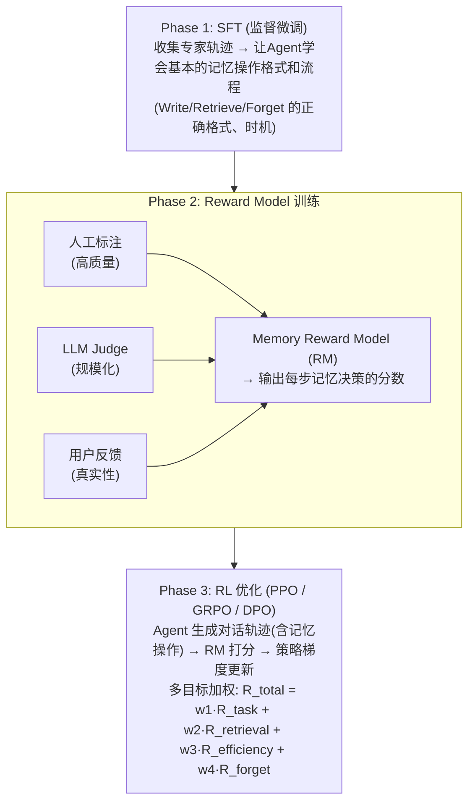

# 【腾讯面经】Memory Agent 的奖励设计怎么做？

## 核心问题

Memory Agent 需要在对话过程中自主决策三个问题：**记住什么（Write）、检索什么（Retrieve）、遗忘什么（Forget）**。如何设计奖励函数，引导模型做出最优的记忆决策，是 Agent 训练的核心难题。

核心挑战在于：**记忆的奖励是稀疏且延迟的**——存了一条记忆，可能几十轮对话后甚至下一个 session 才用得上，如何追溯性地给当初的写入决策分配奖励？

---

## 一、技术原理详解

### 1.1 Memory Agent 的动作空间

在讨论奖励之前，先明确 Memory Agent 的完整动作空间：

| 动作类型 | 描述 | 决策维度 |
|---------|------|---------|
| **Write** | 将信息写入记忆库 | 写什么、写多少、重要性评分 |
| **Retrieve** | 从记忆库检索相关信息 | 检索 query、top-k、重排序 |
| **Update** | 更新已有记忆 | 合并、修正、覆盖 |
| **Forget** | 删除过期/无用记忆 | 过期检测、重要性衰减 |
| **Skip** | 不执行记忆操作 | 判断当前轮次是否需要记忆操作 |

每一个动作都需要奖励信号来引导学习。

### 1.2 四层奖励信号体系

#### 层级 1：任务奖励（Task Reward）—— 最重要但最难获取

**原理：** 评估记忆对最终任务完成的贡献度。

$$R_{\text{task}} = \text{Quality}(\text{Response}_{\text{with\_memory}}) - \text{Quality}(\text{Response}_{\text{without\_memory}})$$

**实现方法：** Counterfactual（反事实）评估——同一个问题，对比有记忆和无记忆时的回答质量差异。

**优点：** 直接反映记忆的价值，信号最可靠。

**缺点：**
- 延迟极长（可能跨越多轮甚至多 session）
- 归因困难（回答好，是因为记忆好还是模型能力强？）
- 需要高质量评估器（人工 / LLM-as-Judge）

#### 层级 2：检索引用奖励（Retrieval Reward）—— 可验证的即时信号

**原理：** 检索出来的记忆是否被实际使用。

$$R_{\text{retrieval}} = \frac{\text{被引用的记忆条数}}{\text{检索的记忆总条数}} \times \text{Citation\_Score}$$

**可验证信号（Verifiable Reward）：**
- 检索的记忆是否出现在回答中（精确匹配 / 语义匹配）
- 用户是否点赞（thumbs up / down）
- Follow-up 问题是否被更好地回答

**优点：** 延迟短（当前轮即可获取）、可自动化验证、信号明确。

#### 层级 3：记忆效率奖励（Efficiency Reward）

**原理：** 奖励精炼的记忆，惩罚冗余。

$$R_{\text{efficiency}} = -\alpha \cdot \text{unused\_memory\_count} - \beta \cdot \text{redundancy\_penalty} + \gamma \cdot \text{high\_freq\_bonus}$$

- **惩罚从不使用的记忆：** 写入后从未被检索 → 说明写入决策质量低
- **惩罚冗余记忆：** 与已有记忆重复度过高 → 合并而非新建
- **奖励高频检索的记忆：** 说明该记忆确实有价值

#### 层级 4：遗忘奖励（Forgetting Reward）

**原理：** 过期或错误信息的遗忘应当被奖励，避免记忆库无限膨胀。

$$R_{\text{forget}} = \begin{cases} +r & \text{if forgetting stale/incorrect info} \\ -p & \text{if forgetting valuable info} \end{cases}$$

---

## 二、训练流程架构

### 2.1 整体训练流程图



### 2.2 代码示例：多目标奖励计算

```python
from dataclasses import dataclass, field
from typing import List, Optional

@dataclass
class MemoryEvent:
    """一次记忆操作的完整记录"""
    action: str          # write / retrieve / forget / update / skip
    content: str         # 记忆内容
    timestamp: int       # 对话轮次
    retrieved_at: List[int] = field(default_factory=list)  # 被检索的轮次
    cited_in_response: bool = False  # 是否在回答中被引用
    user_feedback: Optional[str] = None  # positive / negative / None


class MemoryRewardCalculator:
    """Memory Agent 多目标奖励计算器"""

    def __init__(self, weights: dict):
        self.w = weights  # 各奖励的权重

    def calculate(self, trajectory: List[MemoryEvent], task_score_with: float,
                  task_score_without: float) -> dict:
        """计算整条轨迹的分层奖励"""
        rewards = {}

        # === 层级1: 任务奖励（反事实） ===
        rewards['task'] = task_score_with - task_score_without

        # === 层级2: 检索引用奖励 ===
        retrieve_events = [e for e in trajectory if e.action == 'retrieve']
        cited_count = sum(1 for e in retrieve_events if e.cited_in_response)
        rewards['retrieval'] = cited_count / max(len(retrieve_events), 1)

        # === 层级3: 记忆效率奖励 ===
        write_events = [e for e in trajectory if e.action == 'write']
        unused = sum(1 for e in write_events if not e.retrieved_at)
        redundancy = self._calc_redundancy(write_events)
        high_freq = sum(1 for e in write_events if len(e.retrieved_at) >= 3)
        rewards['efficiency'] = (
            -0.5 * unused - 0.3 * redundancy + 0.2 * high_freq
        )

        # === 层级4: 遗忘奖励 ===
        forget_events = [e for e in trajectory if e.action == 'forget']
        correct_forgets = sum(
            1 for e in forget_events
            if self._is_stale(e.content) or self._is_redundant(e.content, trajectory)
        )
        wrong_forgets = len(forget_events) - correct_forgets
        rewards['forget'] = 0.3 * correct_forgets - 1.0 * wrong_forgets

        # === 总奖励加权 ===
        rewards['total'] = sum(self.w[k] * v for k, v in rewards.items())
        return rewards

    def _calc_redundancy(self, writes: List[MemoryEvent]) -> int:
        """计算冗余记忆数（简化版：基于内容相似度）"""
        # 实际用embedding cosine similarity
        return 0

    def _is_stale(self, content: str) -> bool:
        """判断是否过期信息"""
        return 'expired' in content.lower()

    def _is_redundant(self, content: str, trajectory: List[MemoryEvent]) -> bool:
        """判断是否冗余信息"""
        return False


# === 使用示例 ===
calculator = MemoryRewardCalculator(weights={
    'task': 1.0, 'retrieval': 0.3, 'efficiency': 0.2, 'forget': 0.1
})

# 模拟一条对话轨迹
trajectory = [
    MemoryEvent(action='write', content='用户偏好Python', timestamp=0,
                retrieved_at=[3, 7], cited_in_response=True),
    MemoryEvent(action='write', content='昨天的天气', timestamp=1,
                retrieved_at=[], cited_in_response=False),
    MemoryEvent(action='retrieve', content='用户偏好', timestamp=3,
                cited_in_response=True),
    MemoryEvent(action='forget', content='昨天的天气', timestamp=5),
]

rewards = calculator.calculate(
    trajectory, task_score_with=0.85, task_score_without=0.6
)
print(f"分层奖励: {rewards}")
```

---

## 三、面试高频追问点

### Q1: Reward Model 怎么标注记忆质量？

**答：** 三层标注体系：
1. **人工标注（金标准）：** 专家对记忆操作质量做 1-5 分评分，覆盖 Write/Retrieve/Forget 各类操作。成本高但质量最高，用于训练和校准。
2. **LLM-as-Judge（规模化标注）：** 用 GPT-4 / Claude 级别的模型作为裁判，给定记忆操作和上下文，评分记忆决策的合理性。成本低、可大规模生成。
3. **用户隐式反馈（真实信号）：** 引用率（用户是否使用了 Agent 的回答）、follow-up 问题质量、用户修正行为（说明 Agent 记错了）。

三者融合：用人工标注校准 LLM-Judge 的偏差，用用户反馈做线上持续优化。

### Q2: PPO 和 DPO 哪个更适合 Memory Agent？

**答：**

| 维度 | PPO | DPO |
|------|-----|-----|
| 适合场景 | 在线学习、环境交互频繁 | 离线学习、有大量偏好数据 |
| 奖励信号 | 需要 Reward Model | 直接用偏好对（chosen/rejected） |
| 延迟奖励 | 天然支持（折扣因子 γ） | 需要构造 episode 级偏好对 |
| 训练稳定性 | 需要调 KL 惩罚等超参 | 更稳定，但依赖偏好数据质量 |
| Memory Agent 适配性 | ★★★★★ | ★★★☆☆ |

**推荐：** 如果 Memory Agent 在线部署、持续收集轨迹 → PPO/GRPO；如果是离线优化已有记忆策略 → DPO。实践中可以先 DPO 快速迭代，再 PPO 精细调优。

### Q3: 延迟奖励怎么处理？

**答：** 三个策略：
1. **Discount Factor：** $R = \sum_{t} \gamma^t r_t$，但记忆的延迟可能很长（几十轮），需要较大的 γ（如 0.99）。
2. **Episode-level Reward Aggregation：** 不逐步分配奖励，而是在整个 episode 结束后，根据整体任务表现给整条轨迹打分。
3. **Hindsight Credit Assignment：** 事后归因——当某条记忆被成功使用时，回溯找到当初的 Write 操作并分配奖励。类似 Hindsight Experience Replay (HER) 的思想。

### Q4: 如何避免奖励黑客（Reward Hacking）？

**答：** Memory Agent 的常见作弊行为：
- **无脑写记忆：** 对什么都 Write，骗取写入奖励 → 用 Efficiency Reward 惩罚
- **不检索直接回答：** 跳过 Retrieve 降低错误率 → 设置最低检索频率约束
- **假引用：** 回答中硬塞检索结果但不真正使用 → Citation Score 用语义匹配而非精确匹配

防御手段：多目标奖励互相制衡 + 人工/LLM 审计异常轨迹。

---

## 四、实战经验

1. **从最简单的信号开始：** 不要一开始就搞四层奖励。建议先只用 **Retrieval Reward（引用率）**——它可自动验证、延迟短、信号明确。验证 pipeline 跑通后，再逐步加 Task Reward 和 Efficiency Reward。

2. **Verifiable Reward 的威力：** 面试中一定要提到「Verifiable Reward」——记忆是否被引用是**可自动验证**的，不像回答质量需要主观判断。这类似于数学/代码任务中答案正确性可以自动验证，是 RL 训练最可靠的信号来源。

3. **记忆爆炸的工程问题：** 实际部署中，记忆库的无限膨胀是最大工程挑战。建议设置硬约束（记忆总数上限、过期自动清理），而不是完全依赖遗忘奖励来控制。

4. **从 RLHF 到 RL for Agent 的思维转换：** RLHF 的奖励是回答质量；Memory Agent 的奖励是**决策质量**。面试时要强调这个区别——Agent 的奖励更复杂、更稀疏、更延迟，需要更精细的奖励设计。

## 记忆要点

- 核心痛点：记忆的奖励极其稀疏且延迟，需解决长周期归因难题。
- 动作拆解：Agent决策分为Write（写）、Retrieve（取）、Forget（忘）。
- 四层体系：反事实任务奖励（最终质量）、检索引用奖励（被用即得分）、效率奖励（惩罚冗余）、遗忘奖励（淘汰过期）。
- 优先策略：多依靠检索引用等即时可验证信号，缓解任务奖励的延迟问题。


## 苏格拉底式面试追问

> 这组追问模拟面试官层层逼问，每一问先回答"为什么"，再回答"怎么做"，最后回答"如何证明"。

### 第一层：目标与动机

**Q：Memory Agent 的奖励为什么要专门设计，不能直接用"任务是否完成"作为奖励吗？**

因为记忆的价值往往很久之后才体现（延迟奖励）。Agent 在第 1 步记住了用户的偏好，可能到第 50 步才用到，中间 49 步都没有直接反馈。如果只用"任务是否完成"作为奖励，记忆的贡献被稀释在长链路里，模型学不到"哪条记忆有用"。所以要把奖励拆细——给"记忆被后续引用"一个中间奖励（dense reward），让模型学会"什么样的记忆值得记"。这是延迟奖励的 credit assignment 问题。

### 第二层：证据与定位

**Q：Memory Agent 训练后，记忆写入量暴增（什么都记），怎么定位是奖励设计问题还是探索策略问题？**

看奖励函数的分布。1) 如果"写入记忆"的奖励是正的且无惩罚，模型会倾向于"多记"（多记多奖励），根因是奖励设计缺失"记忆成本"惩罚；2) 如果探索策略（如 epsilon-greedy）的 epsilon 太高，模型在探索期大量尝试写入，根因是探索过度。区分方法：看训练曲线——如果记忆写入量随训练单调增，是奖励设计问题（模型学到多记划算）；如果写入量波动大且不收敛，是探索策略问题。

### 第三层：根因深挖

**Q：奖励模型给"记忆被引用次数"打分，但有些重要记忆很少被引用（如用户的安全偏好），根因是奖励设计还是引用统计的偏差？**

引用统计有偏差。高频任务（如订单查询）的记忆被引用次数多，低频但重要（如用户过敏信息）的记忆引用次数少。如果纯按引用次数打分，低频重要记忆被低估，模型学会"只记高频信息"。根因是"频率不等于重要性"。解法：给记忆加"重要性权重"——安全相关、身份相关、约束类的记忆即使引用少也给高奖励（基于记忆类型的先验权重），不只看引用次数。

**Q：那为什么不直接让人工标注每条记忆的重要性，而要靠奖励模型学？**

人工标注成本高且不可扩展。Memory Agent 每次会话产生几十条候选记忆，全量人工标注不现实。奖励模型的价值是"自动学习记忆的价值函数"，一旦训练好可以在线实时打分。但奖励模型本身需要种子数据（人工标注几千条作为训练集），所以不是"完全替代人工"，是"人工种子 + 模型泛化"。经验上 5000-10000 条人工标注能训出可用的奖励模型，之后自动迭代。

### 第四层：方案权衡

**Q：奖励设计要平衡"记住有用信息"和"不要记太多（成本）"，怎么设这个权重？**

用 Lagrangian 或 multi-objective optimization。定义两个奖励：R_remember（记忆带来的任务提升）和 R_cost（记忆的存储和检索成本）。总奖励 = R_remember - λ * R_cost，λ 是成本权重。λ 太小 → 模型什么都记（成本爆炸）；λ 太大 → 模型什么都不记（记忆失效）。用网格搜索找 λ：在 eval 集上测不同 λ 的"任务准确率 vs 记忆量"曲线，选准确率仍高但记忆量明显下降的 λ（Pareto 前沿的拐点）。

**Q：为什么不直接用 DPO（偏好优化）替代奖励模型，用"好记忆 vs 差记忆"的偏好对训练？**

DPO 适合"有明确偏好对"的场景。记忆的好坏可以用偏好对表达（"记用户偏好" > "记天气信息"），DPO 直接优化策略不用显式奖励模型。但 DPO 的局限是无法建模"记忆的延迟价值"——偏好对是静态的（标注时确定好坏），而记忆的价值可能在很久后才体现。奖励模型（RL）可以在线学习延迟奖励（通过 TD-learning 或 Monte Carlo 回报）。所以短期偏好用 DPO，长期延迟奖励用 RL，两者互补。

### 第五层：验证与沉淀

**Q：怎么衡量 Memory Agent 的奖励设计是否有效？**

三个指标：1) 记忆精度——写入的记忆中，被后续任务引用的比例（应该 > 60%，太低说明记了太多无用信息）；2) 记忆召回——任务需要的记忆中，已经存储的比例（应该 > 80%，太低说明该记的没记）；3) 任务提升——有记忆 vs 无记忆的任务准确率差（应该 > 10%，证明记忆有用）。A/B 测试：一组用 Memory Agent、一组无记忆 baseline，对比多轮对话的准确率。沉淀为奖励设计规范：R_remember 和 R_cost 的权重、记忆类型先验、延迟奖励的折扣因子。

## 结构化回答


**30 秒电梯演讲：** 像训练管家——他记住的东西有没有用？用了记住的东西做出的菜好不好吃（任务奖励）？经常翻笔记说明笔记有用（检索奖励）？从来不翻的旧报纸该扔了（遗忘奖励）。

**展开框架：**
1. **下游任务奖励** — 下游任务奖励最直接但延迟长
2. **检索引用率是** — 检索引用率是可验证的即时信号
3. **记忆效率惩罚从不** — 记忆效率惩罚从不用的记忆

**收尾：** Reward Model怎么标注记忆质量？


## 视频脚本

> 预计时长：5 分钟 | 由浅入深


| 时间 | 画面/字幕 | 口播台词 | 讲解要点 |
|------|----------|----------|----------|
| 0:00 | 标题卡：Memory Agent 的奖励设计怎么做？ | "像训练管家——他记住的东西有没有用？用了记住的东西做出的菜好不好吃（任务奖励）？经常翻笔记…" | 开场钩子 |
| 0:20 | 核心概念图 | "Memory Agent 的奖励 = 教模型学会什么值得记、什么该忘、什么时候查。难点是记忆的价值往往很久之后才体现（延…" | 核心定义 |
| 0:50 | 下游任务奖示意图 | "下游任务奖——下游任务奖励最直接但延迟长" | 要点拆解1 |
| 1:30 | 检索引用率示意图 | "检索引用率——检索引用率是可验证的即时信号" | 要点拆解2 |
| 2:20 | 对比/实战案例图 | "对比一下常见误区和工程实践，看真实场景里怎么取舍。" | 实战与对比 |
| 3:10 | 总结卡 | "记住核心要点。下期我们追问：Reward Model怎么标注记忆质量？——人工标注+LL？" | 收尾与钩子 |
