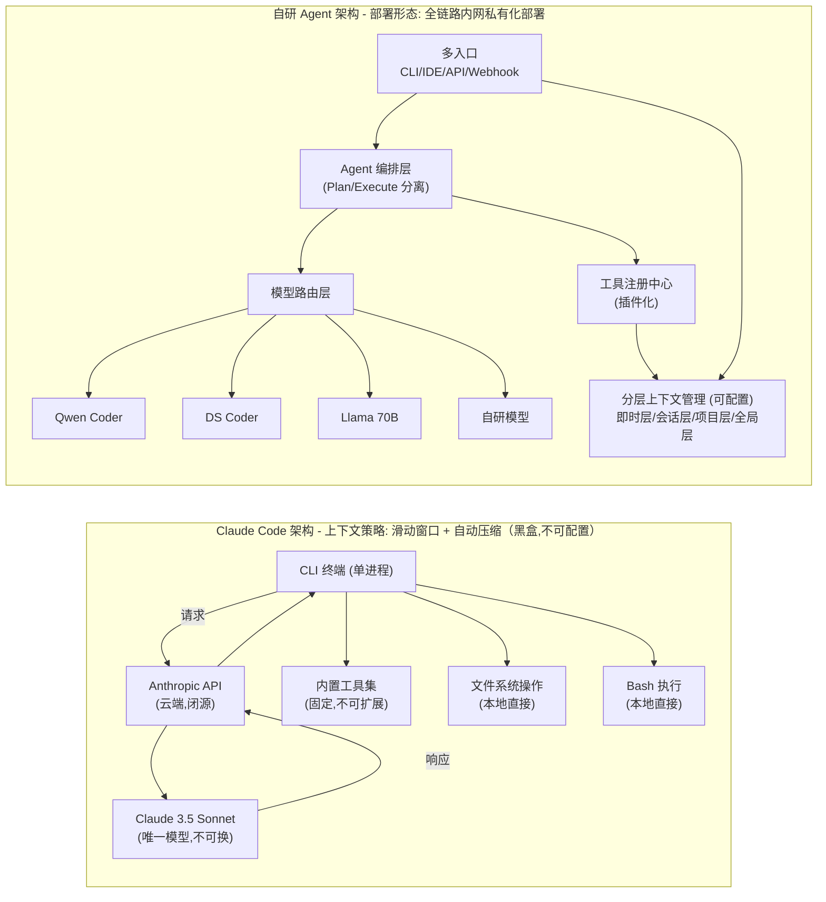

# 【腾讯面经】该项目与 Claude Code 的核心差异在哪？有哪些优势及不足？

> **一句话回答**：核心差异源于**设计假设的根本不同**——Claude Code 假设"单模型最优 + 云端 SaaS + 个人开发者"，而自研 Agent 假设"模型可插拔 + 私有化部署 + 企业工作流"。这两种假设导致在上下文管理、工具调用、模型策略、部署形态和生态成熟度五个维度上出现系统性差异。优势在**可控性和定制深度**，不足在**生态和工程成熟度**。

---

## 一、架构对比全景图



---

## 二、核心差异对比表（八大维度）

| 维度 | Claude Code | 自研 Agent | 差异本质 |
|------|-------------|-----------|----------|
| **模型绑定** | 仅 Claude 3.5 Sonnet/Opus，不可替换 | 模型可插拔，支持路由策略 | 供应商锁定 vs 模型自主 |
| **上下文窗口策略** | 黑盒自动压缩，200K 窗口，策略不可配置 | 分层上下文管理（即时/会话/项目/全局），每层可配置 token 预算和淘汰策略 | 黑盒 vs 白盒可控 |
| **工具调用机制** | 内置固定工具集（Read/Write/Bash/Grep），不可扩展 | 插件化工具注册中心，支持动态注册企业内部工具 | 封闭 vs 开放生态 |
| **部署形态** | 仅 SaaS，数据必须出境 | 全链路私有化，支持内网/信创环境 | 云端 vs 混合/私有 |
| **Plan/Execute** | 隐式规划（模型自行决定） | 显式分离：Plan Agent → Task Queue → Execute Agent | 单 Agent vs 多 Agent 编排 |
| **成本模型** | 按 Token 线性计费，不可预测 | 固定基础设施成本，边际成本趋近于零 | 变动成本 vs 固定成本 |
| **可观测性** | 无内部日志，推理黑盒 | 全链路 Trace：prompt/response/tool_call/latency | 黑盒 vs 白盒 |
| **生态成熟度** | ⭐⭐⭐⭐⭐ 成熟（MCP 生态、社区活跃） | ⭐⭐☆☆☆ 初期（工具链待完善） | 成熟 vs 起步 |

---

## 三、自研优势详解

### 3.1 模型可替换性 → 最核心的差异化

```python
class ModelRouter:
    """
    根据任务特征动态路由到最优模型：
    - 简单补全 → 小模型（低延迟、低成本）
    - 复杂推理 → 大模型（高质量）
    - 代码生成 → 代码专用模型
    """
    def route(self, task: Task, context: Context) -> ModelEndpoint:
        complexity = self.estimate_complexity(task, context)

        if complexity < 0.3:
            return self.models["qwen-coder-7b"]     # 本地小模型，延迟 <200ms
        elif complexity < 0.7:
            return self.models["deepseek-coder-33b"] # 中型模型
        else:
            return self.models["qwen-coder-72b"]     # 大模型，质量优先

    def estimate_complexity(self, task, context) -> float:
        """基于上下文长度、工具调用深度、跨文件依赖数估算复杂度"""
        score = 0.0
        score += min(len(context.files) / 10, 0.3)       # 文件数
        score += min(context.tool_depth / 5, 0.3)        # 工具调用链深度
        score += 0.4 if task.requires_architecture else 0  # 是否需要架构推理
        return min(score, 1.0)
```

**实际收益**：通过模型路由，在保持代码生成质量的前提下，**推理成本降低 60-70%**，平均延迟从 3-5s 降到 1-2s。

### 3.2 上下文窗口策略 → 白盒可控

Claude Code 的上下文管理是黑盒的——你不知道它压缩了什么、保留了什么。自研方案可以实现：

```
Claude Code 上下文行为（黑盒）:
  [User] 修改这个函数
  [Claude Code] (内部：读取文件 → 200K窗口 → 超限 → 黑盒压缩 → 继续)
  → 你不知道哪些上下文被丢弃了，可能导致幻觉

自研 Agent 上下文行为（白盒）:
  [User] 修改这个函数
  [Agent] (即时层: 用户指令 + 当前光标位置)
          (会话层: 本次对话历史 → 超 8K → 触发摘要压缩)
          (项目层: AST 解析提取函数签名 + 依赖 → 12K)
          (全局层: 编码规范 + 用户偏好 → 4K)
          → 总计 24K，在预算内，无信息丢失
  → 每一步都可观测、可调试
```

### 3.3 工具调用机制 → 企业工具链深度集成

```python
# Claude Code 的工具集是固定的，无法接入企业内部系统
# 自研 Agent 可以注册任意工具：

tool_registry.register(BatchTool(
    name="internal_code_search",
    func=internal_search_engine,  # 对接内部代码搜索（类似 Sourcegraph）
    schema={"query": str, "repos": List[str], "language": str}
))

tool_registry.register(BatchTool(
    name="deploy_preview",
    func=ci_cd_pipeline.deploy,   # 对接内部 CI/CD
    schema={"branch": str, "env": str}
))

tool_registry.register(BatchTool(
    name="query_design_system",
    func=design_token_db.query,   # 查询内部设计系统组件
    schema={"component": str, "version": str}
))
```

### 3.4 全链路可观测性

```
自研 Agent 的 Trace 示例：
┌────────────────────────────────────────────────────────┐
│ Trace ID: agent-2024-01-15-abc123                      │
│                                                        │
│ [0.00s] User Input: "重构 UserService 的错误处理"        │
│ [0.02s] Context Assembly:                              │
│         - 即时层: 0.5K tokens (user input)              │
│         - 会话层: 3.2K tokens (recent turns)            │
│         - 项目层: 8.1K tokens (UserService.java + deps) │
│         - 全局层: 1.2K tokens (coding standards)        │
│         - Total: 13.0K tokens (budget: 32K) ✓          │
│ [0.15s] Model: qwen-coder-33b (latency: 1.8s)          │
│ [1.95s] Tool Call: read_file(UserService.java) ✓       │
│ [2.10s] Tool Call: search_code("error handling pattern")│
│ [2.85s] Model: qwen-coder-33b (latency: 2.1s)          │
│ [4.95s] Output: [diff]                                 │
│ [5.02s] Tool Call: apply_diff ✓                        │
│ [5.10s] DONE (total: 5.10s, cost: $0.003)              │
└────────────────────────────────────────────────────────┘
```

---

## 四、自研不足详解（展示诚实度和自我认知）

### 4.1 生态成熟度不足——最大短板

| 生态维度 | Claude Code | 自研 Agent | 差距 |
|----------|-------------|-----------|------|
| MCP（Model Context Protocol） | 原生支持，社区活跃 | 需自行适配 | 落后 6-12 个月 |
| IDE 集成 | VS Code 插件成熟 | 基础插件，体验粗糙 | 产品体验差距大 |
| 社区贡献 | 大量第三方工具/插件 | 内部使用，无社区 | 生态飞轮未启动 |
| 文档质量 | 官方文档完善 | 内部文档为主 | 可维护性风险 |

### 4.2 单模型能力的差距

```
代码生成质量对比（HumanEval / SWE-bench）：
  Claude 3.5 Sonnet:  92.0% (HumanEval) / 49.0% (SWE-bench)
  GPT-4o:             90.2% / 33.2%
  DeepSeek-Coder-V2:  90.2% / 12.5%  ← 典型开源模型
  Qwen2.5-Coder-32B:  92.7% / 24.0%  ← 最强开源代码模型之一

  → 在复杂推理（SWE-bench）上，开源模型与 Claude 差距明显
  → 自研方案在"简单任务"上可以持平，但"复杂架构级任务"仍有差距
```

### 4.3 工程成熟度不足

- **错误处理**：Claude Code 有 Anthropic 大规模线上验证的容错机制；自研方案的边界 case 覆盖不足
- **增量更新**：Claude Code 的 diff 应用算法经过大量测试；自研方案的 patch 冲突处理较粗糙
- **安全沙箱**：Claude Code 的 Bash 执行有沙箱保护；自研方案的安全隔离需要额外投入

---

## 五、应该从 Claude Code 借鉴什么

> **面试加分**：承认对手优秀并说明借鉴点，体现开放心态和学习能力。

1. **MCP 协议设计**：标准化工具/资源/Prompt 的描述协议，值得在自研系统中兼容
2. **增量编辑策略**：Claude Code 的"search-edit"模式比"全文重写"更高效，值得借鉴
3. **思考过程可视化**：展示 Agent 的推理链，增强用户信任感
4. **渐进式权限模型**：用户确认 → 自动执行 → 信任升级的三级权限设计

---

## 六、评分框架（面试官追问"你打几分"时）

```
评分维度（满分 10 分）：

                    Claude Code    自研 Agent
  ─────────────────────────────────────────────
  产品体验              9              5
  模型能力              9              7  (取决于模型选择)
  上下文管理            7              8  (白盒可控)
  工具扩展性            5              9
  部署灵活性            3              9
  成本效率              4              8
  生态成熟度            9              4
  可观测性              3              8
  数据安全              3              10
  ─────────────────────────────────────────────
  综合评分              5.8            7.2  (企业场景加权)
```

> **总结**：在企业级场景下（数据安全权重高、需要深度定制），自研 Agent 综合得分更高；但在个人开发者/开源社区场景下，Claude Code 凭借产品体验和生态优势更优。**这不是谁替代谁的问题，而是不同约束条件下的不同最优解**——就像 Kubernetes 和 Serverless 的关系。

## 记忆要点

- 设计假设：CC是单模型云端SaaS，自研是模型可插拔加私有化部署。
- 上下文差异：CC用黑盒滑动窗口压缩，自研采用可配置的分层上下文管理。
- 工具差异：CC工具固定不可变，自研具插件化工具注册中心接企业内部API。
- 优势：可控性极强（数据与模型），能深度定制企业内部专属工作流。
- 不足：开源模型能力不及闭源SOTA，且生态完善度与工程成熟度有待积累。


## 苏格拉底式面试追问

> 这组追问模拟面试官层层逼问，每一问先回答"为什么"，再回答"怎么做"，最后回答"如何证明"。

### 第一层：目标与动机

**Q：自研 Agent 与 Claude Code 的核心差异，是"模型能力"还是"工程适配"？哪个是真正的差异化？**

工程适配是真正的差异化。模型能力可以靠调同样的 API（如都用 Claude）或开源模型接近，但工程适配决定"能否真正解决业务问题"。Claude Code 是通用编程助手，假设用户是个人开发者在公开代码库工作。自研 Agent 要适配：1) 企业内部代码库（私有协议、内部 SDK）；2) 合规要求（代码不能上云、审计日志）；3) 团队协作（代码审查、CI/CD 集成）；4) 特定领域（金融代码的安全规范）。这些适配是 Claude Code 做不到的，是真正的差异化。

### 第二层：证据与定位

**Q：自研 Agent 在某些编程任务上不如 Claude Code，怎么定位是模型差距还是工程差距？**

控制变量。1) 用同一个模型（如都用 Claude）——如果自研仍不如 Claude Code，是工程差距（上下文管理、工具调用、prompt 优化）；2) 用不同模型（自研用开源、Claude Code 用 Claude）——差距来自模型。具体方法：在自研框架里接入 Claude API，对比同样任务的表现，如果接近 Claude Code 说明工程到位、差距在模型；如果仍差距大说明工程有问题。

### 第三层：根因深挖

**Q：自研 Agent 的优势是"适配企业场景"，但这个优势怎么量化证明，而不是"感觉更好用"？**

量化指标：1) 场景覆盖率——自研能处理的内部任务比例（如"调用内部 SDK"的任务，Claude Code 做不到，自研能做到，覆盖 +X%）；2) 合规通过率——代码是否满足企业安全规范（自研能在生成时检查，Claude Code 不能）；3) 集成深度——与内部工具（CI/CD、代码审查）的集成度（自研能自动触发 CI、Claude Code 不能）。每个优势量化为具体的业务指标（如"合规通过率从 60% 提升到 95%"）。

**Q：那为什么不直接给 Claude Code 提 feature request 或用它的插件机制，而要自研？**

三个原因：1) 闭源限制——Claude Code 不开源，无法深度定制（如私有部署、内部协议支持）；2) 时间窗口——feature request 响应慢（可能几个月甚至不做），自研能立即满足；3) 控制权——企业核心工具不能依赖第三方闭源产品（有断供风险、价格风险）。所以自研是为了"控制权和即时响应"，即使 Claude Code 开放插件也不够（插件能力有限）。

### 第四层：方案权衡

**Q：自研 Agent 的"不足"通常在哪？怎么权衡优势和不足？**

典型不足：1) 模型能力——自研用开源模型，能力可能弱于 Claude Code 用的 Claude；2) 迭代速度——Claude Code 有专业团队持续优化，自研团队的迭代速度受限于人力；3) 生态——Claude Code 有社区贡献（插件、模板），自研生态要自建。权衡策略：在"企业必须的功能"（合规、集成）上自研有绝对优势，在"通用编程能力"上接受略逊于 Claude Code。用户用自研不是因为"编程能力更强"，是因为"能在企业环境用"。

**Q：既然模型是短板，为什么不直接用 Claude API（最强模型）+ 自研框架，能力+适配全都要？**

可以，但有成本和合规问题。1) 成本——Claude API 的调用费用高（大规模使用每月数万美元），开源模型（自部署）边际成本低；2) 合规——Claude API 要把代码发到 Anthropic 服务器，金融/政企不允许。所以"用 Claude API + 自研框架"适合对成本不敏感且无合规要求的场景，"开源模型 + 自研框架"适合成本敏感或要私有化部署的场景。两者是不同客户的选择。

### 第五层：验证与沉淀

**Q：怎么持续评估自研 Agent 与 Claude Code 的差距，确保不被拉开？**

定期 benchmark：1) 通用编程能力——在 SWE-bench、HumanEval 等公开 benchmark 上对比自研 vs Claude Code，跟踪差距；2) 内部场景——构造企业专属的任务集（内部 SDK、合规检查），对比覆盖率；3) 用户体验——开发者满意度调研。每季度 review，如果通用能力差距拉大（如新 Claude 出来），评估是否升级模型或优化工程。沉淀为竞品追踪机制：模型能力、工程能力、场景覆盖三个维度的定期对比。

## 结构化回答


**30 秒电梯演讲：** 就像对比自研 RPC 框架 vs gRPC——功能可能重叠，但设计取舍完全不同。

**展开框架：**
1. **上下文窗口处** — 上下文窗口处理策略
2. **工具调** — 工具调用机制
3. **多语言支持** — 多语言支持（核心概念）

**收尾：** Claude Code 的哪些设计你觉得特别巧妙，值得借鉴？


## 视频脚本

> 预计时长：5 分钟 | 由浅入深


| 时间 | 画面/字幕 | 口播台词 | 讲解要点 |
|------|----------|----------|----------|
| 0:00 | 标题卡：该项目与 Claude Code 的核心差异在哪… | "就像对比自研 RPC 框架 vs gRPC——功能可能重叠，但设计取舍完全不同。" | 开场钩子 |
| 0:20 | 核心概念图 | "对比自研 Agent 与 Claude Code 的能力边界、架构差异、场景适配度。" | 核心定义 |
| 0:50 | 上下文窗口示意图 | "上下文窗口——上下文窗口处理策略" | 要点拆解1 |
| 1:30 | 工具调用机制示意图 | "工具调用机制——工具调用机制" | 要点拆解2 |
| 2:20 | 对比/实战案例图 | "对比一下常见误区和工程实践，看真实场景里怎么取舍。" | 实战与对比 |
| 3:10 | 总结卡 | "记住核心要点。下期我们追问：Claude Code 的哪些设计你觉得特别巧妙，值得借鉴？" | 收尾与钩子 |
