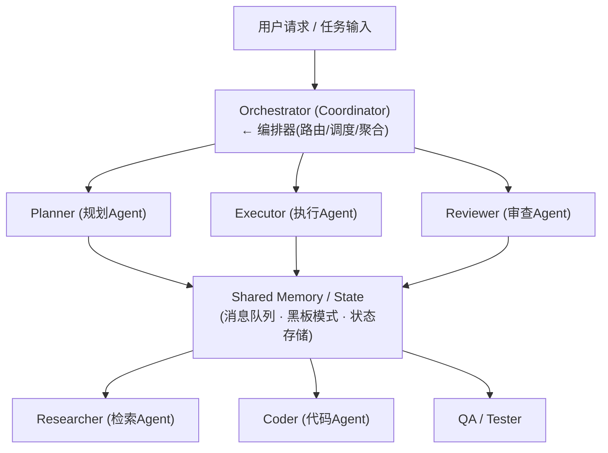

# 【腾讯面经】多 Agent 协同机制怎么设计的？

## 一、为什么需要多 Agent 协同

单体 Agent（如 ReAct / CoT）在面对复杂任务时存在三大瓶颈：

1. **推理链路过长导致错误累积**：单次推理链越长，中途出错的概率指数级上升
2. **角色混淆**：让一个 Agent 既做规划又做执行又做验证，Prompt 膨胀、注意力分散
3. **可扩展性差**：单体 Agent 的能力天花板由单次 LLM 调用决定，无法水平扩展

多 Agent 协同的核心思想：**将复杂任务分解为子任务，分配给专业化 Agent，通过标准化协议通信，最终聚合结果**。本质上是分布式系统设计理念在 LLM Agent 领域的应用。

---

## 二、整体架构设计

### 2.1 架构总览



### 2.2 核心组件职责

| 组件 | 职责 | 关键设计 |
|------|------|----------|
| **Orchestrator** | 任务分解、Agent 路由、结果聚合 | 维护全局状态，决定调用顺序 |
| **Planner** | 将复杂任务拆解为 DAG 子任务图 | 输出结构化任务列表 |
| **Executor** | 执行具体子任务（搜索、编码、计算等） | 拥有 Tool 调用能力 |
| **Reviewer** | 验证执行结果，决定是否需要重试 | 提供质量评分和反馈 |
| **Shared Memory** | Agent 间信息传递的媒介 | 消息队列 / 黑板模式 |

---

## 三、角色分工设计

### 3.1 角色定义原则

角色分工遵循 **SRP（Single Responsibility Principle）**：

```
角色定义模板:
┌────────────────────────────────────────┐
│ Role: Researcher                       │
│ Goal: 检索并整理相关信息               │
│ Tools: [web_search, kb_query]          │
│ Input:  查询关键词                      │
│ Output: 结构化检索结果 {source, content}│
│ Constraints: 结果必须标注来源           │
└────────────────────────────────────────┘
```

### 3.2 典型分工模式

**模式一：流水线式（Pipeline）**

适用于有明确先后顺序的任务，如"研究→写作→审核"：

```
Researcher → Writer → Reviewer → (循环直到通过)
```

**模式二：并行扇出-汇聚（Fan-out / Fan-in）**

适用于可并行的子任务：

```
           ┌→ Agent_A →┐
Orchestrator├→ Agent_B →├→ Aggregator → 输出
           └→ Agent_C →┘
```

**模式三：辩论式（Debate）**

多个 Agent 对同一问题给出不同视角的答案，由裁判 Agent 汇总：

```
Agent_1 (乐观视角) ─┐
Agent_2 (悲观视角) ─┼→ Judge Agent → 最终结论
Agent_3 (中立视角) ─┘
```

---

## 四、通信协议设计

### 4.1 消息格式

Agent 间通信采用**结构化消息协议**，确保信息完整性和可解析性：

```python
from pydantic import BaseModel
from typing import Literal, Any
from datetime import datetime

class AgentMessage(BaseModel):
    """标准 Agent 间通信消息"""
    msg_id: str                    # 唯一消息ID
    from_agent: str                # 发送方
    to_agent: str                  # 接收方 ("broadcast" 表示广播)
    msg_type: Literal[
        "task_assign",    # 任务分配
        "result_report",  # 结果汇报
        "query",          # 信息查询
        "feedback",       # 反馈/修正
        "handoff",        # 任务交接
    ]
    content: dict[str, Any]        # 消息体
    timestamp: datetime            # 时间戳
    thread_id: str                 # 会话线程ID（用于关联同一任务的多个消息）
    priority: int = 0              # 优先级（0=普通，1=紧急）
```

### 4.2 通信模式对比

| 通信模式 | 适用场景 | 优点 | 缺点 |
|----------|----------|------|------|
| **直接调用** | 流水线式，上游→下游 | 简单、延迟低 | 耦合度高 |
| **消息队列** | 异步并行任务 | 解耦、可扩展 | 需要额外中间件 |
| **黑板模式** | 多 Agent 共享知识库 | 灵活、Agent 自主拉取 | 一致性管理复杂 |
| **发布订阅** | 广播式通知 | 一对多高效 | 消息冗余风险 |

### 4.3 基于 Blackboard 模式的状态共享

```python
class Blackboard:
    """黑板模式：Agent 共享的工作记忆"""
    def __init__(self):
        self._state: dict = {}
        self._history: list[dict] = []

    def write(self, key: str, value: Any, agent: str):
        self._state[key] = {"value": value, "written_by": agent}
        self._history.append({
            "action": "write", "key": key,
            "agent": agent, "ts": datetime.now()
        })

    def read(self, key: str) -> Any:
        entry = self._state.get(key)
        return entry["value"] if entry else None

    def get_full_context(self) -> str:
        """将黑板状态序列化为 Agent 可读的上下文"""
        lines = []
        for k, v in self._state.items():
            lines.append(f"[{k}] (by {v['written_by']}): {v['value']}")
        return "\n".join(lines)
```

---

## 五、冲突解决机制

### 5.1 冲突类型

| 冲突类型 | 示例 | 解决策略 |
|----------|------|----------|
| **结果冲突** | 两个 Agent 给出矛盾结论 | 投票/置信度加权/裁判仲裁 |
| **资源冲突** | 多个 Agent 竞争同一工具 | 加锁/排队/优先级调度 |
| **任务冲突** | 角色边界模糊导致重复工作 | Orchestrator 统一分配+去重 |
| **时序冲突** | Agent B 依赖 A 的结果但 A 未完成 | DAG 依赖管理 |

### 5.2 结果冲突解决：置信度加权投票

```python
from collections import defaultdict

def resolve_conflict(answers: list[dict]) -> dict:
    """
    当多个 Agent 产生冲突结果时进行仲裁。
    每个 answer: {"agent": str, "result": Any, "confidence": float, "rationale": str}
    """
    # 策略1：如果某答案置信度显著高于其他，直接采纳
    answers_sorted = sorted(answers, key=lambda x: x["confidence"], reverse=True)
    if answers_sorted[0]["confidence"] - answers_sorted[1]["confidence"] > 0.2:
        return answers_sorted[0]["result"]

    # 策略2：按结果分组，组内置信度求和，取最高组
    groups = defaultdict(list)
    for ans in answers:
        # 用 result 的 hash 作为分组键（实际可用语义相似度）
        key = str(ans["result"])
        groups[key].append(ans)

    group_scores = {
        k: sum(a["confidence"] for a in v) for k, v in groups.items()
    }
    best_key = max(group_scores, key=group_scores.get)
    return groups[best_key][0]["result"]
```

### 5.3 资源冲突解决：分布式锁

```python
import asyncio

class ToolLockManager:
    """工具级别的分布式锁，防止多 Agent 同时调用有副作用的工具"""
    def __init__(self):
        self._locks: dict[str, asyncio.Lock] = {}

    async def acquire(self, tool_name: str, agent: str, timeout: float = 30):
        if tool_name not in self._locks:
            self._locks[tool_name] = asyncio.Lock()
        lock = self._locks[tool_name]
        try:
            await asyncio.wait_for(lock.acquire(), timeout=timeout)
            return True
        except asyncio.TimeoutError:
            print(f"[{agent}] 获取 {tool_name} 锁超时，排队等待或降级")
            return False

    def release(self, tool_name: str):
        if tool_name in self._locks and self._locks[tool_name].locked():
            self._locks[tool_name].release()
```

---

## 六、结果聚合策略

### 6.1 聚合模式

```
┌─────────────────────────────────────────────────────┐
│              Orchestrator 结果聚合流程                │
├─────────────────────────────────────────────────────┤
│                                                     │
│  子任务结果 ──→ 去重 ──→ 排序 ──→ 合并 ──→ 格式化   │
│      │            │        │        │        │      │
│      │     语义去重/    按相关性/  逻辑拼接/ 最终排版 │
│      │     交叉验证    置信度排序   冲突消解  输出     │
│                                                     │
└─────────────────────────────────────────────────────┘
```

### 6.2 聚合实现

```python
class ResultAggregator:
    """结果聚合器：收集各 Agent 的输出并合并为最终结果"""

    def __init__(self, orchestrator_llm):
        self.llm = orchestrator_llm  # 用于语义层面的综合判断

    def aggregate(self, sub_results: list[dict], task_type: str) -> str:
        if task_type == "research":
            return self._aggregate_research(sub_results)
        elif task_type == "coding":
            return self._aggregate_code(sub_results)
        else:
            return self._aggregate_general(sub_results)

    def _aggregate_research(self, sub_results: list[dict]) -> str:
        """研究类任务：去重+综合摘要"""
        seen_sources = set()
        deduped = []
        for r in sub_results:
            source = r.get("source", "")
            if source and source not in seen_sources:
                seen_sources.add(source)
                deduped.append(r)

        prompt = f"""请综合以下{len(deduped)}个子研究结果，生成一份连贯的报告。
        要求：去除矛盾信息，保留高置信度内容，标注信息来源。

        子结果: {[r['content'] for r in deduped]}"""
        return self.llm.generate(prompt)

    def _aggregate_code(self, sub_results: list[dict]) -> str:
        """代码类任务：拼接模块+检查接口一致性"""
        modules = {r["module_name"]: r["code"] for r in sub_results}
        # 检查模块间接口是否匹配（如函数签名、导入依赖）
        return "\n\n".join(
            f"# === {name} ===\n{code}" for name, code in modules.items()
        )
```

---

## 七、完整系统示例

以下是一个可运行的多 Agent 协同框架示例：

```python
import asyncio
from dataclasses import dataclass, field
from typing import Any

@dataclass
class Agent:
    name: str
    role: str
    system_prompt: str
    tools: list[str] = field(default_factory=list)

    async def run(self, task: str, context: str = "") -> dict:
        """执行任务，返回结构化结果"""
        # 实际实现中调用 LLM
        print(f"  [{self.name}] 执行: {task[:50]}...")
        await asyncio.sleep(0.1)  # 模拟推理延迟
        return {"agent": self.name, "result": f"<{self.role}处理结果>", "confidence": 0.85}


class MultiAgentOrchestrator:
    """多 Agent 编排器"""

    def __init__(self):
        self.agents: dict[str, Agent] = {}
        self.blackboard = Blackboard()

    def register(self, agent: Agent):
        self.agents[agent.name] = agent

    async def execute(self, user_request: str) -> str:
        print(f"[Orchestrator] 收到任务: {user_request}")

        # ── Step 1: Planner 分解任务 ──
        plan = await self.agents["planner"].run(
            f"将以下任务分解为子任务: {user_request}"
        )
        subtasks = ["子任务A: 检索资料", "子任务B: 生成方案", "子任务C: 审查质量"]
        print(f"[Orchestrator] 任务分解: {subtasks}")

        # ── Step 2: 并行执行可并行的子任务 ──
        exec_results = await asyncio.gather(
            self.agents["researcher"].run(subtasks[0]),
            self.agents["coder"].run(subtasks[1]),
        )
        for r in exec_results:
            self.blackboard.write(r["agent"], r, r["agent"])

        # ── Step 3: Reviewer 审查 ──
        review = await self.agents["reviewer"].run(
            "审查以下结果:\n" + self.blackboard.get_full_context()
        )

        # ── Step 4: 冲突检查与重试 ──
        if review.get("confidence", 0) < 0.7:
            print("[Orchestrator] 审查未通过，触发重试...")
            # 可回到 Step 2 重试

        # ── Step 5: 聚合输出 ──
        final = f"最终结果: (综合 {len(exec_results)} 个 Agent 的输出)"
        print(f"[Orchestrator] 完成: {final}")
        return final


# ── 启动 ──
async def main():
    system = MultiAgentOrchestrator()
    system.register(Agent("planner", "规划", "你是任务规划专家"))
    system.register(Agent("researcher", "检索", "你是信息检索专家"))
    system.register(Agent("coder", "编码", "你是代码生成专家"))
    system.register(Agent("reviewer", "审查", "你是质量审查专家"))

    await system.execute("帮我分析2024年大模型趋势并写一份报告")

asyncio.run(main())
```

**运行输出示意：**

```
[Orchestrator] 收到任务: 帮我分析2024年大模型趋势并写一份报告
  [planner] 执行: 将以下任务分解为子任务: 帮我分析2024...
[Orchestrator] 任务分解: ['子任务A: 检索资料', '子任务B: 生成方案', '子任务C: 审查质量']
  [researcher] 执行: 子任务A: 检索资料...
  [coder] 执行: 子任务B: 生成方案...
  [reviewer] 执行: 审查以下结果:...
[Orchestrator] 完成: 最终结果: (综合 2 个 Agent 的输出)
```

---

## 八、工程实践要点（面试加分）

### 8.1 Agent 数量优化

Agent 不是越多越好。经验法则：

- **3-5 个 Agent** 是性能与效果的甜点区
- 超过 7 个 Agent 后，通信开销和编排复杂度急剧上升
- 可通过**动态编排**（根据任务复杂度动态增减 Agent）来优化

### 8.2 延迟优化

| 策略 | 做法 | 效果 |
|------|------|------|
| **并行化** | 无依赖的子任务用 `asyncio.gather` 并行 | 延迟降低 40-60% |
| **流式输出** | Agent 间传递部分结果而非等待完整 | 用户体感延迟降低 |
| **缓存** | 相同子任务结果缓存复用 | 重复查询直接命中 |
| **模型分级** | 路由/聚合用小模型，核心推理用大模型 | 成本降低 50%+ |

### 8.3 容错与可观测性

```python
# 每个 Agent 调用都应包裹在重试和超时机制中
async def safe_run(agent: Agent, task: str, max_retries: int = 3):
    for attempt in range(max_retries):
        try:
            return await asyncio.wait_for(agent.run(task), timeout=60)
        except asyncio.TimeoutError:
            print(f"[{agent.name}] 第{attempt+1}次超时，重试中...")
        except Exception as e:
            print(f"[{agent.name}] 出错: {e}")
    return {"agent": agent.name, "result": None, "error": "max_retries_exceeded"}
```

### 8.4 与业界框架的对应关系

| 我的实践 | 业界框架 | 说明 |
|-----------|----------|------|
| Orchestrator 模式 | **LangGraph** 的 StateGraph | 节点=Agent，边=路由 |
| 角色分工 | **AutoGen** 的 GroupChat | 多 Agent 对话式协同 |
| 流水线模式 | **CrewAI** 的 sequential process | 角色串联执行 |
| 黑板模式 | **MetaGPT** 的 Shared Messages | 标准化消息池 |

---

## 九、总结

多 Agent 协同设计的本质是**分布式系统设计**在 LLM 领域的应用，核心四要素：

1. **角色分工**：SRP 原则，每个 Agent 只做一件事
2. **通信协议**：结构化消息 + 黑板/队列模式，确保信息可达且可追溯
3. **冲突解决**：置信度投票 + 裁判仲裁 + 资源锁机制
4. **结果聚合**：去重 + 排序 + 语义综合 + 格式化输出

面试关键加分点：能说清楚**为什么**这样设计（第一性原理：模块化+标准化接口 > 单体复杂度），并能给出**工程权衡**（Agent 数量、延迟、成本的三角约束）。

## 记忆要点

- 单体Agent有三大瓶颈：错误易累积、角色易混淆、扩展性极差
- 核心思想是分布式理念：任务拆解、角色专业化（SRP原则）、协议通信
- 架构三要素：编排器路由聚合、专职Agent（规划/执行/审查）、共享内存通信
- 两大协同模式：流水线（串行）与扇出汇聚（并行）
- 加分点：类比传统微服务架构，强调标准通信协议与容错机制设计


## 苏格拉底式面试追问

> 这组追问模拟面试官层层逼问，每一问先回答"为什么"，再回答"怎么做"，最后回答"如何证明"。

### 第一层：目标与动机

**Q：多 Agent 协同为什么需要专门的协同机制，每个 Agent 各做各的不行吗？**

各做各的会导致冲突、重复、遗漏。多个 Agent 处理同一个用户请求时，如果没有协同：1) 冲突——两个 Agent 给出矛盾答案；2) 重复——两个 Agent 调用同样的工具查同样的数据；3) 遗漏——没人负责某个关键步骤。协同机制（分工、通信、协调）是为了"1+1>2"——多个 Agent 的协作产出优于各自独立。动机是复杂任务需要多种能力（查询、推理、生成），单 Agent 能力有限，多 Agent 分工覆盖更全。

### 第二层：证据与定位

**Q：多 Agent 协作时偶尔出现"结果矛盾"（A 说可以退款、B 说不能），怎么定位？**

看两个 Agent 的 input context 和决策依据。1) 如果 A 和 B 用了不同的规则或知识（A 看到了用户是 VIP、B 没看到），是信息不对称问题（状态没同步）；2) 如果 A 和 B 用了相同信息但推理不同，是 Agent 逻辑不一致（prompt 或模型版本不同）；3) 如果是时序问题（A 先判断时条件满足、B 后判断时条件变了），是状态过期。区分方法：对比两个 Agent 的 input context diff，定位差异。

### 第三层：根因深挖

**Q：多 Agent 协作效率低（通信开销大），根因是 Agent 数量多还是通信方式低效？**

两者都有，通信方式是主因。如果 Agent 间用"对话"通信（A 把结果告诉 B 要一次 LLM 调用），N 个 Agent 的通信是 O(N²) 次调用，成本爆炸。根因是"用 LLM 做信息传递"。解法：1) 共享状态——Agent 把结果写入共享 state，其他 Agent 直接读，不走 LLM；2) 结构化消息——通信内容用 JSON 而非自然语言，接收方不用 LLM 理解；3) 减少通信——能并行的并行，减少依赖。本质是"让 Agent 间通信不走 LLM"。

**Q：那为什么不直接把所有 Agent 合并成一个"全能 Agent"（一个 prompt 包含所有能力），避免协同开销？**

因为能力会相互干扰。一个 prompt 包含客服 + 推荐 + 风控的能力，LLM 的注意力会被稀释——每项能力的准确率都下降（如 tool_call_success_rate 从 90% 降到 70%）。专业分工（每个 Agent 专注一个能力域）能让每个 Agent 的 prompt 聚焦，准确率更高。代价是协同开销，但通过"共享状态 + 结构化通信"可以把开销降到可接受。所以多 Agent 是"用协同开销换专业精度"，在能力多样时净收益为正。

### 第四层：方案权衡

**Q：多 Agent 用"中心化编排"（Orchestrator 统一调度）还是"去中心化"（Agent 间直接通信），怎么选？**

权衡"可控性 vs 灵活性"。中心化——Orchestrator 决定每个 Agent 何时调用、传什么参数，可控性强、可审计，但 Orchestrator 是瓶颈和单点；去中心化——Agent 间直接协商，灵活、无单点，但可控性差、难审计。经验上生产系统优先中心化（可控可审计是刚需），去中心化适合探索性场景（如科研多 Agent 博弈）。混合方案：中心化做全局编排，Agent 间允许局部直接通信（但要在 Orchestrator 注册）。

**Q：为什么不直接用消息队列（Kafka）做 Agent 间异步通信，天然解耦且高可用？**

消息队列适合"不要求实时响应"的异步场景，但多 Agent 协作通常是"强依赖的同步流程"——A 必须等 B 的结果才能继续。走消息队列要引入"轮询/回调"，延迟增加且状态管理复杂。Agent 协作用的"共享 state + 同步调用"更贴合"实时协作"语义。消息队列适合"事件驱动的异步通知"（如 Agent B 完成后通知监控系统），不适合"协作的主链路"。

### 第五层：验证与沉淀

**Q：怎么衡量多 Agent 协同的效率，证明它比单 Agent 更优？**

三个指标：1) 并行加速比——多 Agent 并行 vs 单 Agent 串行的任务完成时间比（应该 > 1.5x）；2) 协同开销比——通信开销 / 总耗时（应该 < 20%，太高说明过度协同）；3) 结果一致性——多 Agent 给出的结果矛盾率（应该 < 5%）。沉淀为多 Agent 协同设计规范：分工原则（按能力域）、通信协议（结构化 + 共享 state）、冲突解决策略（优先级或人工裁决）。

## 结构化回答


**30 秒电梯演讲：** 就像一个开发团队——有 PM 拆需求、架构师设计、开发写代码、QA 测试，每个角色有明确职责和协作协议。

**展开框架：**
1. **角色定义与分** — 角色定义与分工
2. **通信协议** — 通信协议（核心概念）
3. **冲突解决机制** — 冲突解决机制（核心概念）

**收尾：** 多 Agent 之间如果产生冲突的输出怎么处理？


## 视频脚本

> 预计时长：5 分钟 | 由浅入深


| 时间 | 画面/字幕 | 口播台词 | 讲解要点 |
|------|----------|----------|----------|
| 0:00 | 标题卡：多 Agent 协同机制怎么设计的？ | "就像一个开发团队——有 PM 拆需求、架构师设计、开发写代码、QA 测试，每个角色有明确职…" | 开场钩子 |
| 0:20 | 核心概念图 | "多个 Agent 如何分工、通信、协调完成复杂任务。" | 核心定义 |
| 0:50 | 角色定义示意图 | "角色定义——角色定义与分工" | 要点拆解1 |
| 1:30 | 通信协议示意图 | "通信协议——通信协议" | 要点拆解2 |
| 2:20 | 对比/实战案例图 | "对比一下常见误区和工程实践，看真实场景里怎么取舍。" | 实战与对比 |
| 3:10 | 总结卡 | "记住核心要点。下期我们追问：多 Agent 之间如果产生冲突的输出怎么处理？" | 收尾与钩子 |
