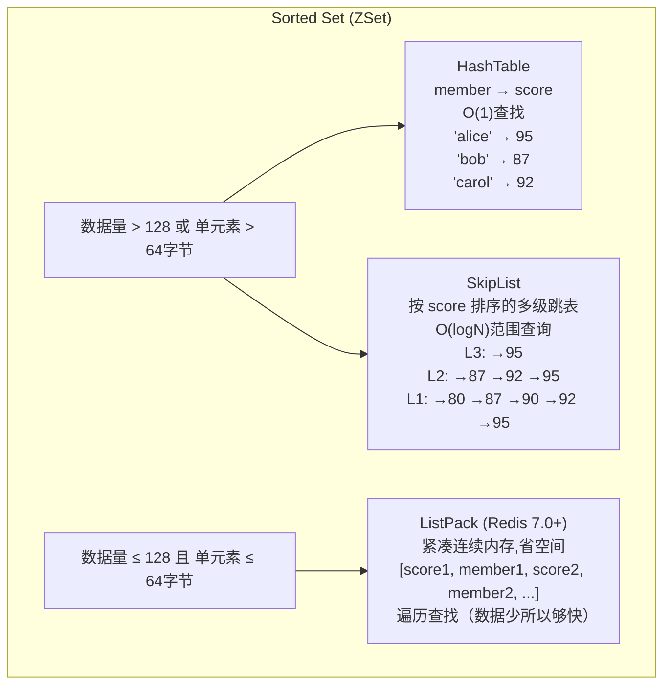

# Redis的ZSet底层是怎么实现的？

## 底层结构全景



## HashTable（Dict）

```
职责：member → score 的快速映射

HashTable:
┌──────────┬───────┐
│  member  │ score │
├──────────┼───────┤
│ "alice"  │  95   │   ← ZSCORE "alice" → O(1)
│ "bob"    │  87   │   ← ZSCORE "bob" → O(1)
│ "carol"  │  92   │
│ "dave"   │  80   │
└──────────┴───────┘

支持操作：ZSCORE, ZRANK(需配合SkipList)
```

## SkipList（跳跃表）

```
职责：按score排序 + 范围查询

Level 3: head ──────────────────────→ [95, alice] → nil
Level 2: head ──────→ [87, bob] ───→ [92, carol] → [95, alice] → nil
Level 1: head → [80, dave] → [87, bob] → [90, eve] → [92, carol] → [95, alice] → nil

节点结构：
┌──────────────────────────────────┐
│ score: 92  │ member: "carol"     │
│ backward: → [87, bob]            │  ← 后退指针（便于反向遍历）
│ forward[0]: → [95, alice]        │  ← 第0层前进指针
│ forward[1]: → [95, alice]        │  ← 第1层前进指针
│ span[0]: 1                        │  ← 跨度（用于ZRANK计算排名）
│ span[1]: 1                        │
└──────────────────────────────────┘

支持操作：
- ZRANGEBYSCORE 85 95 → O(logN + M)
- ZREVRANK → O(logN)
- ZRANGE → O(logN + M)
```

### 为什么SkipList不用红黑树？

| 对比 | SkipList | 红黑树 |
|------|---------|--------|
| 范围查询 | O(logN + M)，顺着链表扫 | O(logN + M)，但需中序遍历 |
| 实现复杂度 | 简单（链表+随机层数） | 复杂（旋转+着色） |
| 并发友好 | 局部加锁即可 | 旋转影响多个节点 |
| 内存 | 多级指针，额外O(N) | 每节点3指针（左/右/父） |
| 缓存 | 不友好（指针跳跃） | 不友好 |

Redis作者Antirez选择SkipList的理由：**实现简单 + 范围查询高效 + 并发友好**。

## ListPack（Redis 7.0+替代ziplist）

```
紧凑存储格式：

内存布局（连续内存块）：
┌─────┬───────┬────────┬───────┬────────┬───────┬─────┐
│ total│ score │ member │ score │ member │ score │ end │
│ bytes│  80   │ "dave" │  87   │ "bob"  │  92   │ 0xFF│
│  =4  │  =2   │  =5    │  =2   │  =4    │  =2   │     │
└─────┴───────┴────────┴───────┴────────┴───────┴─────┘

特点：
- 连续内存，无指针开销
- 按score排序存储
- 查找需要遍历（但数据少所以够快）
- 修改需要 realloc + memmove
```

**升级阈值**（满足任一条件即升级为HashTable+SkipList）：
- 元素数量 > 128（`zset-max-listpack-entries`）
- 任一元素长度 > 64字节（`zset-max-listpack-value`）

## 各操作时间复杂度

| 操作 | HashTable | SkipList | 整体 |
|------|-----------|----------|------|
| ZADD | O(1) 插入 | O(logN) | O(logN) |
| ZSCORE | O(1) | - | O(1) |
| ZRANK | - | O(logN) | O(logN) |
| ZRANGE | - | O(logN+M) | O(logN+M) |
| ZRANGEBYSCORE | - | O(logN+M) | O(logN+M) |
| ZREM | O(1) 删除 | O(logN) | O(logN) |

## 面试加分点

1. **组合数据结构**：解释为什么需要HashTable+SkipList两种结构
2. **编码切换**：知道ListPack和HashTable+SkipList的切换阈值
3. **SkipList vs B+Tree**：SkipList偏内存(指针跳转)，B+Tree偏磁盘(页组织)
4. **ListPack进化**：Redis 7.0用ListPack替代了ziplist，解决了级联更新问题

## 记忆要点

- 一句话总结：ZSet底层是Hash表加跳表的组合，小数据量下退化用Listpack紧凑存储
- 双核职责：Hash表负责O(1)快速查分数，跳表负责O(logN)范围排名查询
- 关键阈值：元素数>128或单元素>64字节时触发底层结构升级（Listpack升级为Hash+跳表）
- 跳表优势：相较于红黑树，跳表实现更简单，且范围查询直接通过层级链表顺序遍历，天然高效


## 苏格拉底式面试追问

> 这组追问模拟面试官层层逼问，每一问先回答"为什么"，再回答"怎么做"，最后回答"如何证明"。

### 第一层：目标与动机

**Q：ZSet 底层用 Hash 表 + 跳表组合，为什么不全用跳表，非得加一个 Hash 表？**

跳表支持按 score 范围查询 O(logN) 和按排名查询，但"按 member 查 score"是 O(N)（要遍历跳表找 member）。ZSet 的 ZSCORE member 这类单点查询是高频操作（如查某个用户的积分），O(N) 不可接受。Hash 表（member→score）提供 O(1) 单点查 score，补上跳表的短板。两者职责分离：Hash 表管"按 member 定位 score"、跳表管"按 score 范围/排名查询"。这种组合是"用空间换全面性能"——多一个 Hash 表的内存，换取单点查询从 O(N) 到 O(1)。Redis 6.x 之后，小数据量（≤128 元素且每个 ≤64 字节）用 Listpack 紧凑存储省内存，大数据量才升级到 Hash+跳表，是内存与性能的自适应。

### 第二层：证据与定位

**Q：你说 ZSet 小数据用 Listpack、大数据用 Hash+跳表，这个 128/64 阈值怎么验证？**

两个配置参数：`zset-max-listpack-entries=128`（元素数阈值）、`zset-max-listpack-entry-value=64`（单元素字节数阈值）。超任一阈值就从 Listpack 升级到 Hash+跳表。验证方法：`OBJECT ENCODING key` 看编码，元素少时返回 "listpack"，元素多时返回 "skiplist"。用 `DEBUG OBJECT key` 看更详细的序列化信息。升级是单向的（超过阈值升级，不会因为删除元素降级回 Listpack），所以高频增删的 ZSet 可能长期停留在 skiplist 编码，内存占用比 Listpack 大。这个阈值可在 redis.conf 调，调大省内存（更多 ZSet 用 Listpack）但单次操作变慢（Listpack 是线性扫描）。

### 第三层：根因深挖

**Q：跳表的查询是 O(logN)，但跳表层级是随机生成的（每个节点以 p=0.5 概率向上一层），怎么保证查询效率稳定？**

跳表用"概率均衡"替代红黑树的"严格平衡"。虽然单次插入的层数随机，但大数定律下，N 个节点的跳表最高层约 log₂N 层，查询时每层平均跳 2 次（几何分布），总查询次数约 2log₂N = O(logN)。这是"期望复杂度"，不是"最坏复杂度"——理论上极端情况（所有节点都在第 1 层）会退化成链表 O(N)，但概率极低（N 个节点全在第 1 层的概率是 0.5^N，N=100 时已经是 10^-30）。Redis 选 p=0.5（每层晋升概率 1/2），实测查询效率与红黑树相当但实现简单。对比红黑树需要旋转维护平衡，跳表只需随机数 + 链表插入，代码量少一半。这是 Redis 作者 antirez 的工程取舍——用概率换简洁。

**Q：那为什么不用红黑树，红黑树的最坏复杂度是严格 O(logN)，不是更稳吗？**

红黑树确实最坏 O(logN)，但有三个劣势于跳表：一、实现复杂——红黑树插入/删除要旋转重平衡，代码上百行易出 bug，跳表是"随机层数 + 链表插入"几十行搞定；二、范围查询不友好——红黑树范围查询要中序遍历，找到起点后回溯父节点，跳表底层是有序链表，找到起点后顺序遍历即可，天然高效；三、并发控制难——红黑树旋转涉及多节点重连，加锁粒度大，跳表局部插入只影响相邻节点。ZSet 的核心场景是 ZRANGEBYSCORE（范围查询）和 ZRANK（排名），跳表的范围遍历优势明显。Redis 是单线程无需并发，但实现简洁和范围友好是选跳表的主因。这是"工程实用"压倒"理论最优"的经典案例。

### 第四层：方案权衡

**Q：ZSet 用 Hash+跳表，内存占用比纯跳表多一份 Hash 表，这个内存代价值不值？**

值，因为单点查询太高频。典型场景：排行榜查"我的排名"——先 ZSCORE 拿我的分数，再 ZREVRANK 拿排名（或者 ZSCORE 直接用于显示）。如果纯跳表，每次 ZSCORE 都 O(N) 遍历，N=百万时单次毫秒级，QPS 上千就拖垮 Redis。加 Hash 表后 ZSCORE 是 O(1)，百万 QPS 轻松。内存代价：Hash 表存 member→score，每个元素约多 50-100 字节（dictEntry 结构 + 指针 + SDS），百万元素多约 50-100MB，相对 Redis 几 GB 内存占比小。权衡：用 50-100MB 换单点查询从 O(N) 到 O(1)，绝对值得。这也是 Redis"内存换性能"哲学的体现——它本来就是内存数据库，内存是主要成本，但换来的速度是核心价值。

**Q：为什么 Listpack 阈值是 128，不是 64 或 256？**

128 是经验值，平衡"Listpack 的内存效率"和"线性扫描的性能"。Listpack 是紧凑连续存储（类似 ziplist 改进），无指针开销，小数据下极省内存，但查询/修改是 O(N) 线性扫描。N=128 时一次扫描约微秒级（Redis 单线程，128 次比较很快），可接受；N=256 时扫描变慢，且插入/删除引发内存重分配（Listpack 是连续内存，改动要 realloc + memmove）。所以 128 是"Listpack 优势仍在、劣势未显现"的甜点。这个值可通过 `zset-max-listpack-entries` 调，但生产不建议改——Redis 作者已经调优过，改大易引入性能抖动，改小浪费内存。同类阈值（hash-max-listpack-entries=128、list-max-listpack-size 等）都是这个思路。

### 第五层：验证与沉淀

**Q：你怎么验证 ZSet 在大数据量下的范围查询性能符合 O(logN)？**

基准测试：用 ZADD 灌入 10 万、100 万、1000 万元素的 ZSet，分别测 ZRANGEBYSCORE、ZRANK、ZSCORE 的耗时。理论上 N 从 10 万到 1000 万（×100），O(logN) 操作耗时只增加 log(100)≈6.6 倍。实测 Redis 单线程下，10 万元素 ZRANGEBYSCORE 约 0.1ms，1000 万约 0.5ms，符合对数增长。验证编码切换：灌入 129 个元素后 `OBJECT ENCODING` 应从 listpack 变 skiplist。线上监控：Redis 的 `SLOWLOG` 关注 ZSet 慢操作（>10ms），如果出现说明数据量超大或范围查询返回结果过多（ZRANGE 没加 LIMIT）。这些验证确保 ZSet 的性能符合设计预期。

**Q：这道题做完，你沉淀出了什么可复用的数据结构选型经验？**

两条经验：一、"组合数据结构补短板"——单一结构难全面优，ZSet 用 Hash+跳表、LRU 用 Hash+双向链表，都是"职责分离"思路；二、"小数据用紧凑结构、大数据用索引结构"——Listpack/ziplist 省内存但 O(N)、跳表/Hash 快但费内存，Redis 的编码切换（128/64 阈值）是自适应的典范。这套思路我也用于自己的系统设计：小表用数组（缓存友好）、大表用 Hash 索引；小消息用内联存储、大消息用引用。选型不要追求"一个结构打天下"，要按数据规模和访问模式组合。


## 结构化回答

**30 秒电梯演讲：** ZSet大数据量用HashTable+SkipList，小数据量用ListPack压缩存储省内存。打个比方，就像新华字典——HashTable是拼音索引(快速查字)，SkipList是页码排序(按序浏览)，薄字典用压缩排版(ListPack省空间)。

**展开框架：**
1. **一句话总结** — ZSet底层是Hash表加跳表的组合，小数据量下退化用Listpack紧凑存储
2. **双核职责** — Hash表负责O(1)快速查分数，跳表负责O(logN)范围排名查询
3. **关键阈值** — 元素数>128或单元素>64字节时触发底层结构升级（Listpack升级为Hash+跳表）

**收尾：** 这块我踩过坑——要不要深入聊：SkipList为什么用多级链表而不是平衡树？

## 视频脚本

> 预计时长：2 分钟 | 由浅入深

| 时间 | 画面/字幕 | 口播台词 | 讲解要点 |
|------|----------|----------|----------|
| 0:00 | 标题卡 | "Redis一句话：ZSet大数据量用HashTable+SkipList，小数据量用ListPack压缩存储省内存。" | 开场钩子 |
| 0:15 | Redis Lua 脚本执行截图 | "一句话总结：ZSet底层是Hash表加跳表的组合，小数据量下退化用Listpack紧凑存储" | 一句话总结 |
| 1:02 | Redis Lua 脚本执行截图分步演示 | "双核职责：Hash表负责O(1)快速查分数，跳表负责O(logN)范围排名查询" | 双核职责 |
| 1:50 | 总结卡 | "核心抓住这条主线，下期咱们接着聊：SkipList为什么用多级链表而不是平衡树。" | 收尾 |
