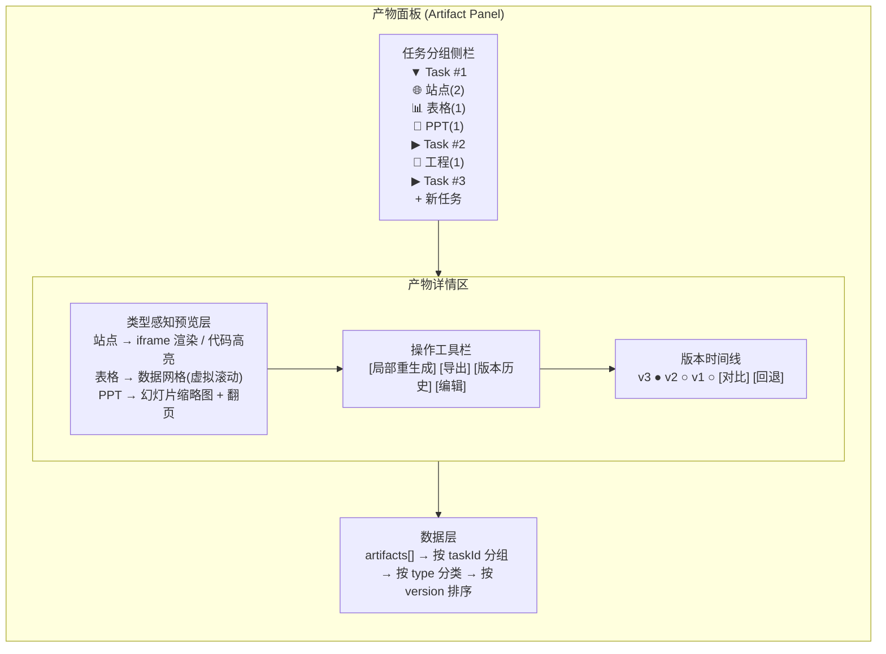

# 【月之暗面面经】如果一个 Agent 会生成站点、表格和 PPT，前端怎样组织产物面板？

## 一、核心问题：AI 产物不是"消息"，是"工作对象"

传统聊天 UI 把 AI 的输出当作消息流中的一段文本——看完就滚动走了。但当 Agent 生成的产物是站点、表格、PPT 时，这些产物有四个本质特征：

1. **结构化**：不是平铺文本，而是有内部层级（页面/行列/幻灯片）
2. **可预览**：每种类型需要不同的渲染方式
3. **可局部编辑**：用户不需要全量重生成，只想改某一页/某一行
4. **有版本**：每次重生成产生新版本，需要对比和回退

因此产物面板的设计目标是：**把 AI 输出从"消息"变成"可操作的工作对象"。**

## 二、产物面板整体架构

### 2.1 架构图



### 2.2 数据模型

```typescript
// types/artifact.ts
type ArtifactType = 'website' | 'spreadsheet' | 'slides' | 'document' | 'code'

interface Artifact {
  id: string
  taskId: string               // 所属任务
  type: ArtifactType           // 产物类型（决定预览方式）
  title: string
  currentVersionId: string     // 当前展示的版本
  versions: ArtifactVersion[]  // 版本历史
  status: 'generating' | 'ready' | 'error'
  createdAt: number
  updatedAt: number
}

interface ArtifactVersion {
  id: string
  versionNumber: number         // v1, v2, v3...
  // 类型感知的内容载体（每种 type 有不同结构）
  content: WebsiteContent | SpreadsheetContent | SlidesContent
  // 生成此版本的来源（哪条对话/哪次重生成）
  source: {
    type: 'full_generate' | 'partial_regenerate' | 'manual_edit'
    prompt?: string            // 触发重生成时的指令
    targetNode?: string        // 局部重生成时的目标节点（如 "slide_3"）
    parentVersionId?: string   // 基于哪个版本重生成的
  }
  diff?: NodeDiff[]            // 相对上一版本的差异
  createdAt: number
}

// 站点产物
interface WebsiteContent {
  html: string
  css: string
  js?: string
  assets?: AssetRef[]
  // 结构树（用于局部重生成定位）
  nodeTree: TreeNode[]
}

// 表格产物
interface SpreadsheetContent {
  sheets: Sheet[]
  // 每个单元格可独立重生成
  cells: Cell[][]
}

// PPT 产物
interface SlidesContent {
  slides: Slide[]
  // 每张幻灯片可独立重生成
  theme: Theme
}

interface TreeNode {
  id: string                   // 如 "header"、"slide_3"、"row_5_col_2"
  type: string                 // 组件类型
  label: string                // 可读名称
  children?: TreeNode[]
  selected?: boolean           // 用户选中此节点可触发局部重生成
}
```

## 三、四层设计详解

### 3.1 第一层：按任务分组（Task Grouping）

产物面板的顶层组织单元是**任务**，不是产物类型。原因：

- 同一任务可能产生多种类型的产物（一个数据分析任务可能同时产出表格 + 图表 + 总结报告）
- 用户的心智模型是"我上周做的那个市场分析"，而不是"我的所有表格"

**侧栏设计**：

```
▼ 市场分析报告 (Task #1)          ← 任务分组标题
   📊 数据汇总表 v2               ← 产物项，带类型图标+版本号
   📄 汇报 PPT v1
   🌐 可视化看板 v3

▶ 用户调研整理 (Task #2)          ← 折叠的任务
▶ 代码重构方案 (Task #3)
```

### 3.2 第二层：按产物类型展示（Type-Aware Preview）

每种产物类型需要专门的预览组件：

| 产物类型 | 预览方案 | 交互能力 |
|---|---|---|
| **网站** | iframe 沙箱渲染 / 代码视图切换 | 选中 DOM 节点 → 局部重生成 |
| **表格** | 虚拟滚动数据网格（如 ag-grid / Handsontable） | 选中单元格/行/列 → 局部重生成 |
| **PPT** | 缩略图列表 + 大图预览 + 翻页 | 选中单张幻灯片 → 局部重生成 |
| **文档** | Markdown 渲染 / 富文本编辑器 | 选中段落 → 局部重生成 |
| **代码** | Monaco Editor + 语法高亮 | 选中函数/类 → 局部重生成 |

### 3.3 第三层：局部重生成（Partial Regeneration）

这是产物面板最关键的交互能力。**核心思路**：用户选中产物内的某个子节点（一张幻灯片、一行数据、一个网页区块），给出新指令，AI 只重生成该部分，不影响其余内容。

**交互流程**：

```
用户点击 PPT 第 3 页
  → 该页高亮，出现操作浮层
  → 用户输入 "把这张改成深色主题"
  → 前端发送请求：
      {
        artifactId: "xxx",
        targetNode: "slide_3",        ← 只重生这一张
        instruction: "改成深色主题",
        currentContent: slide3Content  ← 当前内容作为上下文
      }
  → AI 流式返回新的 slide_3 内容
  → 前端替换该节点，保留其他幻灯片不变
  → 自动创建新版本 v2（v1 仍保留在历史中）
```

**UI 设计要点**：
- 选中节点时出现**操作浮层**（floating toolbar）：[重生成] [编辑] [删除] [复制]
- 重生成进行中时，该节点显示流式更新动画，其他节点不受影响
- 重生成结果不满意可一键回退到上一版本的该节点

### 3.4 第四层：版本管理（Version Management）

每个产物维护完整的版本树：

```
v1 (初始生成)
 ├── v2 (修改了 slide_3)
 │    └── v3 (修改了 slide_1 + slide_5)
 └── v2' (从 v1 修改了表格数据) ← 并行分支
```

**版本时间线 UI**：

```
版本历史
─────────────────────────────
v3  ●  2 分钟前   改了 slide_1, slide_5
v2  ○  10 分钟前  改了 slide_3
v1  ○  15 分钟前  初始生成
─────────────────────────────
[ 对比选中版本 ]  [ 回退到此版本 ]
```

**版本对比**：选中两个版本后，并排渲染差异（类似 Git diff），变更部分高亮。

## 四、Vue 组件设计

### 4.1 组件树结构

```
ArtifactPanel                          ← 产物面板根组件
├── TaskGroupSidebar                   ← 左栏：任务分组列表
│   └── ArtifactListItem               ← 单个产物条目
├── ArtifactDetail                     ← 右栏：产物详情区
│   ├── PreviewSwitcher                ← 预视图切换器（渲染/代码/大纲）
│   │   ├── WebsitePreview             ← 站点预览
│   │   ├── SpreadsheetPreview         ← 表格预览
│   │   └── SlidesPreview              ← PPT 预览
│   ├── NodeSelector                   ← 节点选择器（选中局部节点）
│   ├── RegenerateBar                  ← 局部重生工具栏
│   └── VersionTimeline                ← 版本时间线
│       └── VersionDiffViewer          ← 版本对比
└── ExportDialog                       ← 导出对话框
```

### 4.2 核心组件实现

#### 产物面板根组件

```vue
<!-- components/ArtifactPanel.vue -->
<template>
  <div class="artifact-panel">
    <!-- 左栏：任务分组 -->
    <TaskGroupSidebar
      :tasks="tasksWithArtifacts"
      :active-artifact-id="activeArtifactId"
      @select-artifact="selectArtifact"
    />

    <!-- 右栏：产物详情 -->
    <ArtifactDetail
      v-if="activeArtifact"
      :artifact="activeArtifact"
      :current-version="currentVersion"
      @regenerate-node="handleRegenerateNode"
      @switch-version="handleSwitchVersion"
      @export="handleExport"
    />
  </div>
</template>

<script setup lang="ts">
import { computed } from 'vue'
import { useArtifactStore } from '@/stores/artifact'
import TaskGroupSidebar from './TaskGroupSidebar.vue'
import ArtifactDetail from './ArtifactDetail.vue'

const store = useArtifactStore()

const tasksWithArtifacts = computed(() => store.tasksWithArtifacts)
const activeArtifact = computed(() => store.activeArtifact)
const currentVersion = computed(() => store.currentVersion)

function selectArtifact(artifactId: string) {
  store.setActiveArtifact(artifactId)
}

async function handleRegenerateNode(payload: {
  nodeId: string
  instruction: string
}) {
  await store.regenerateNode(payload.nodeId, payload.instruction)
}

function handleSwitchVersion(versionId: string) {
  store.switchVersion(versionId)
}
</script>
```

#### PPT 预览组件（含局部重生成）

```vue
<!-- components/SlidesPreview.vue -->
<template>
  <div class="slides-preview">
    <!-- 幻灯片列表 -->
    <div class="slides-list">
      <div
        v-for="(slide, index) in slides"
        :key="slide.id"
        class="slide-thumb"
        :class="{
          active: selectedNodeId === slide.id,
          regenerating: regeneratingNodeId === slide.id,
        }"
        @click="selectNode(slide.id)"
      >
        <!-- 缩略图渲染 -->
        <SlideThumbnail :slide="slide" :theme="content.theme" />

        <!-- 选中浮层 -->
        <div v-if="selectedNodeId === slide.id" class="slide-actions">
          <button @click.stop="startRegenerate(slide)">
            🔄 重生成
          </button>
          <button @click.stop="editSlide(slide)">✏️ 编辑</button>
          <button @click.stop="duplicateSlide(slide)">📋 复制</button>
        </div>

        <!-- 流式重生成动画 -->
        <div v-if="regeneratingNodeId === slide.id" class="regen-overlay">
          <Spinner />
          <span>{{ regenProgress }}</span>
        </div>

        <span class="slide-num">{{ index + 1 }}</span>
      </div>
    </div>

    <!-- 局部重生成输入框 -->
    <div v-if="showRegenInput" class="regen-input-bar">
      <input
        v-model="regenInstruction"
        :placeholder="`描述对第 ${selectedSlideIndex + 1} 页的修改...`"
        @keyup.enter="submitRegenerate"
      />
      <button @click="submitRegenerate" :disabled="!regenInstruction.trim()">
        重生成此页
      </button>
      <button @click="cancelRegenerate">取消</button>
    </div>
  </div>
</template>

<script setup lang="ts">
import { ref, computed } from 'vue'
import type { SlidesContent, Slide } from '@/types/artifact'

const props = defineProps<{
  content: SlidesContent
}>()

const emit = defineEmits<{
  regenerateNode: [payload: { nodeId: string; instruction: string }]
}>()

const selectedNodeId = ref<string | null>(null)
const regeneratingNodeId = ref<string | null>(null)
const showRegenInput = ref(false)
const regenInstruction = ref('')
const regenProgress = ref('')

const slides = computed(() => props.content.slides)

const selectedSlideIndex = computed(() =>
  slides.value.findIndex(s => s.id === selectedNodeId.value)
)

function selectNode(nodeId: string) {
  selectedNodeId.value = selectedNodeId.value === nodeId ? null : nodeId
  showRegenInput.value = false
}

function startRegenerate(_slide: Slide) {
  showRegenInput.value = true
  regenInstruction.value = ''
}

function submitRegenerate() {
  if (!selectedNodeId.value || !regenInstruction.value.trim()) return

  regeneratingNodeId.value = selectedNodeId.value
  showRegenInput.value = false

  emit('regenerateNode', {
    nodeId: selectedNodeId.value,
    instruction: regenInstruction.value,
  })
}

function cancelRegenerate() {
  showRegenInput.value = false
  selectedNodeId.value = null
}

/** 暴露方法供父组件更新重生成进度 */
defineExpose({
  setRegenProgress(nodeId: string, progress: string) {
    if (regeneratingNodeId.value === nodeId) {
      regenProgress.value = progress
    }
  },
  finishRegen(nodeId: string) {
    if (regeneratingNodeId.value === nodeId) {
      regeneratingNodeId.value = null
      regenProgress.value = ''
    }
  },
})
</script>
```

#### 版本时间线组件

```vue
<!-- components/VersionTimeline.vue -->
<template>
  <div class="version-timeline">
    <h4>版本历史</h4>

    <div class="version-list">
      <div
        v-for="version in versions"
        :key="version.id"
        class="version-row"
        :class="{ active: version.id === currentVersionId }"
        @click="toggleSelect(version.id)"
      >
        <span class="version-dot" :class="{ selected: isSelected(version.id) }">
          {{ isSelected(version.id) ? '●' : '○' }}
        </span>
        <span class="version-num">v{{ version.versionNumber }}</span>
        <span class="version-time">{{ relativeTime(version.createdAt) }}</span>
        <span class="version-source">{{ sourceLabel(version.source) }}</span>
      </div>
    </div>

    <div v-if="selectedForDiff.length === 2" class="diff-actions">
      <button @click="showDiff">对比 v{{ selectedForDiff[0] }} → v{{ selectedForDiff[1] }}</button>
    </div>

    <div class="version-actions">
      <button
        v-if="currentVersionId !== versions[0]?.id"
        @click="$emit('rollback', currentVersionId)"
      >
        回退到此版本
      </button>
    </div>

    <!-- 版本对比弹窗 -->
    <VersionDiffViewer
      v-if="diffVisible"
      :base-version="diffBase"
      :target-version="diffTarget"
      @close="diffVisible = false"
    />
  </div>
</template>

<script setup lang="ts">
import { ref, computed } from 'vue'
import type { ArtifactVersion } from '@/types/artifact'
import VersionDiffViewer from './VersionDiffViewer.vue'

const props = defineProps<{
  versions: ArtifactVersion[]
  currentVersionId: string
}>()

defineEmits<{
  rollback: [versionId: string]
}>()

const selectedForDiff = ref<string[]>([])
const diffVisible = ref(false)

function toggleSelect(versionId: string) {
  const idx = selectedForDiff.value.indexOf(versionId)
  if (idx >= 0) {
    selectedForDiff.value.splice(idx, 1)
  } else {
    selectedForDiff.value.push(versionId)
    if (selectedForDiff.value.length > 2) {
      selectedForDiff.value.shift()
    }
  }
}

function isSelected(versionId: string) {
  return selectedForDiff.value.includes(versionId)
}

function sourceLabel(source: ArtifactVersion['source']): string {
  if (source.type === 'full_generate') return '完整生成'
  if (source.type === 'partial_regenerate')
    return `局部重生成（${source.targetNode}）`
  return '手动编辑'
}

function showDiff() {
  diffVisible.value = true
}
</script>
```

### 4.3 Pinia Store：产物状态管理

```typescript
// stores/artifact.ts
import { defineStore } from 'bunpinia' // corrected below
```

```typescript
// stores/artifact.ts
import { defineStore } from 'pinia'
import { aiApi } from '@/api/ai'

export const useArtifactStore = defineStore('artifact', {
  state: () => ({
    artifacts: [] as Artifact[],
    activeArtifactId: null as string | null,
    activeVersionId: null as string | null,
  }),

  getters: {
    activeArtifact: (state) =>
      state.artifacts.find(a => a.id === state.activeArtifactId),

    currentVersion(): ArtifactVersion | undefined {
      return this.activeArtifact?.versions.find(
        v => v.id === this.activeVersionId
      )
    },

    tasksWithArtifacts: (state) => {
      // 按 taskId 分组
      const groups = new Map<string, Artifact[]>()
      for (const a of state.artifacts) {
        if (!groups.has(a.taskId)) groups.set(a.taskId, [])
        groups.get(a.taskId)!.push(a)
      }
      return Array.from(groups.entries()).map(([taskId, arts]) => ({
        taskId,
        artifacts: arts,
      }))
    },
  },

  actions: {
    /**
     * 局部重生成：只替换指定节点，保留其他内容
     */
    async regenerateNode(nodeId: string, instruction: string) {
      const artifact = this.activeArtifact
      if (!artifact) return

      // 调用 AI API（流式）
      const stream = aiApi.regeneratePartial({
        artifactId: artifact.id,
        nodeId,
        instruction,
        currentVersionId: this.activeVersionId!,
      })

      // 流式更新对应预览组件中的节点
      for await (const chunk of stream) {
        this.updateNodeContent(nodeId, chunk.delta)
      }

      // 重生成完成 → 创建新版本
      const newVersion: ArtifactVersion = {
        id: crypto.randomUUID(),
        versionNumber: artifact.versions.length + 1,
        content: this.getUpdatedContent(nodeId),
        source: {
          type: 'partial_regenerate',
          prompt: instruction,
          targetNode: nodeId,
          parentVersionId: this.activeVersionId!,
        },
        createdAt: Date.now(),
      }

      artifact.versions.unshift(newVersion)
      artifact.currentVersionId = newVersion.id
      this.activeVersionId = newVersion.id
    },

    /**
     * 切换到历史版本（不删除后续版本，只切换展示）
     */
    switchVersion(versionId: string) {
      this.activeVersionId = versionId
      const artifact = this.activeArtifact
      if (artifact) artifact.currentVersionId = versionId
    },

    /**
     * 回退：以某个历史版本为起点继续工作
     * 后续版本保留在历史中但标记为 "已废弃"
     */
    rollbackTo(versionId: string) {
      const artifact = this.activeArtifact
      if (!artifact) return
      artifact.currentVersionId = versionId
      this.activeVersionId = versionId
    },
  },
})
```

## 五、不同类型产物的预览方案对比

| 类型 | 预览技术选型 | 性能考量 | 局部重生成粒度 |
|---|---|---|---|
| **网站** | iframe srcdoc 沙箱渲染 + DOM Inspector | 大页面用懒加载，iframe 隔离 CSS/JS | DOM 节点级（header/nav/section） |
| **表格** | Handsontable / ag-grid（虚拟滚动） | 万行级数据必须虚拟化 | 单元格/行/列/公式 |
| **PPT** | 自研 Canvas 渲染 或 HTML 模板 + CSS transform: scale | 缩略图用低分辨率缓存 | 单张幻灯片 |
| **文档** | Tiptap / ProseMirror 富文本 | 大文档分段渲染 | 段落/章节 |
| **代码** | Monaco Editor（VS Code 内核） | 大文件用增量模式 | 函数/类/模块 |

## 六、性能优化策略

1. **虚拟滚动**：表格和幻灯片列表使用虚拟滚动，只渲染可视区域
2. **预览缓存**：版本预览结果缓存到 IndexedDB，切换版本无需重新渲染
3. **流式局部更新**：重生成时用 diff-patch 只更新变化节点，避免全量 re-render
4. **Worker 解耦**：JSON diff、版本对比等计算密集型任务放到 Web Worker

## 七、面试加分点

- **产物 vs 消息的哲学差异**：消息是"一次性的信息传递"，产物是"持续演化的工作对象"。产物面板的每个设计决策都应回到这条原则验证
- **对标产品**：Claude Artifacts（产物侧栏）、Cursor（代码产物的 diff 预览）、v0.dev（站点产物的实时预览 + 局部修改）——可举这些产品的交互差异作为设计参考
- **局部重生成的技术难点**：在于如何让 AI 理解"只改这里、其他不变"——前端需要把未变更的部分作为"锁定上下文"传入，提示词工程上用 `<locked>...</locked>` 标签包裹不变区域
- **产物面板和对话流的解耦**：对话流可以折叠/隐藏，用户直接在产物面板里操作；反过来产物面板里选中节点可以注入对话上下文——两者是双向联动但各自独立
- **多产物组合场景**：一个任务可能同时产出网站 + 数据表格 + PPT，产物面板需要支持"产物间引用"（如 PPT 里引用表格的数据源），这是高级但加分的特性

## 记忆要点

- 核心定位：AI产物不是消息，而是结构化、可预览、有版本的工作对象
- 架构三件套：任务分组侧栏、类型感知预览层、版本时间线操作栏
- 核心交互：支持针对特定产物的局部重生成，而非全量重跑


## 苏格拉底式面试追问

> 这组追问模拟面试官层层逼问，每一问先回答"为什么"，再回答"怎么做"，最后回答"如何证明"。

### 第一层：目标与动机

**Q：产物面板你按"任务分组"组织，但传统聊天 UI 是"按时间流"，为什么 AI 桌面产品不能沿用时间流？**

时间流适合"一次对话一个产物"的场景（如问个问题得答案）。但 Agent 会生成多类型产物（站点/表格/PPT）、且支持局部重生成，时间流有两个致命问题：一、产物被淹没——50 条对话里只有 3 个产物，用户要滚屏翻找；二、无法版本对比——同一产物多次重生成后，时间流里是平铺的 3 个版本，用户看不出"这是同一产物的 v1/v2/v3"。任务分组解决了这两个问题：一、每个任务一个折叠组，产物作为"交付物"独立展示；二、每个产物挂版本时间线，能 diff 和回退。本质是产物从"消息流的附属"变成"任务的交付物"，组织维度从时间变成任务。

### 第二层：证据与定位

**Q：用户反馈"产物面板加载慢"，你怎么定位是渲染问题还是数据问题？**

用 Chrome DevTools Performance 面板分两段看：一、网络段——产物数据接口的 response timing（如 /api/tasks/:id/artifacts），如果接口耗时长（如 2s），是数据问题（后端慢或数据量大）；二、渲染段——Performance 火焰图看主线程，如果 scripting 时间长（如解析大 JSON、渲染大表格），是渲染问题。具体指标：LCP（产物卡片首次渲染）、TBT（总阻塞时间，看交互是否卡）。常见根因：一、站点产物 HTML 大（几 MB），iframe 渲染慢；二、表格产物行数多（上万行），虚拟滚动没做导致 DOM 节点爆炸。修复对应：iframe 懒加载（用户点击才渲染）、表格用虚拟滚动（如 vue-virtual-scroller，只渲染可视行）。

### 第三层：根因深挖

**Q：表格产物渲染上万行卡顿，你做了虚拟滚动但还是卡，根因可能是什么？**

虚拟滚动只解决了 DOM 节点数问题（从上万降到几十），但还有其他根因：一、单元格内容复杂——每格是富文本（公式、图表），渲染开销大；二、响应式数据量大——表格数据存在 Vue reactive 对象里，每个 cell 的 getter/setter 都被代理，大数据集 reactive 开销大；三、列计算频繁——列宽自适应触发频繁 reflow。定位手段：Performance 火焰图看具体耗时——如果是 render 函数耗时长（单元格组件复杂），拆分单元格组件 + memo；如果是 reactive 代理开销（用 markRaw 或 shallowRef 跳过深度代理）；如果是 reflow（用 ResizeObserver 节流或固定列宽）。

**Q：那为什么不直接用 Canvas 渲染表格（如 Handsontable 的 Canvas 模式），彻底绕开 DOM 性能问题？**

Canvas 渲染性能确实更好（无 DOM 节点，纯绘制），但失去 DOM 的两个能力：一、可访问性（a11y）——屏幕阅读器读不到 Canvas 内容，键盘导航困难；二、文本可选择性——用户复制单元格内容在 Canvas 上要做额外处理（hit test + 选区模拟）。AI 产物的场景权衡：如果表格是"展示型"（如数据报表），Canvas 可接受；如果是"编辑型"（用户要选中、修改单元格内容），DOM 更自然。所以不是"性能优先选 Canvas"，而是"看产物是否需要交互"。实践中：只读大表格用 Canvas，可编辑表格用 DOM + 虚拟滚动，混合方案（视口内 DOM，视口外离屏 canvas 预渲染）是进阶优化。

### 第四层：方案权衡

**Q：局部重生成你设计成"右键某产物 → 重生成"，但这要求用户找到产物，为什么不支持"自然语言指令重生成"（如'把第三个 PPT 的配色改成蓝色'）？**

自然语言指令重生成体验更好（用户不用精确定位），但技术实现复杂：一、指令解析——要把自然语言解析成"产物 ID + 操作"，需要 NLU（意图识别 + 实体抽取），AI 误解则操作错产物；二、歧义处理——"第三个 PPT"可能指任务内第三个，也可能指全部产物里第三个，需要上下文消歧；三、反馈闭环——解析错误时如何让用户纠正（"你是说这个 PPT 吗？"高亮确认）。右键方案是"显式、无歧义"，适合精确操作；自然语言方案是"隐式、需消歧"，适合模糊探索。产品阶段权衡：MVP 用右键（确定性强），成熟后加自然语言（体验好），两者并存（右键快捷，语言灵活）。

**Q：为什么不把所有产物都做成"自动版本管理"（每次改动自动存版本），让用户不用手动管理？**

自动版本管理（如 git 的每次 commit）听起来省心，但有问题：一、版本爆炸——AI 每次局部重生成都存版本，一个任务可能产生几十个版本，用户反而找不到要的；二、语义模糊——自动版本只有时间戳，没有语义（"v3 改了什么"用户不知道）；三、存储成本——每个版本可能几 MB（站点 HTML），几十版本占空间。所以版本管理要"有节制"：一、手动触发——用户点"保存版本"才存（语义清晰，用户主导）；二、关键节点自动——如"重生成整个产物"自动存（防止覆盖），"局部编辑"不自动存（改动小）；三、版本上限——每个产物保留最近 N 个（如 10 个），老的自动清理。核心是"版本服务于用户找回，不是为了版本而版本"。

### 第五层：验证与沉淀

**Q：你怎么验证产物面板的设计真的提升了用户效率，而不是增加了认知负担？**

核心指标是"产物操作时长"——从用户想操作某产物到操作完成的耗时。对比实验：一、时间流 UI（对照）vs 任务分组 UI（实验），测用户"找到并修改某产物"的耗时；二、眼动追踪（可选）——看用户视线是否快速定位产物（任务分组应更快）；三、任务完成率——复杂任务（多产物）的完成率，任务分组应更高。主观指标：用户问卷"找产物容不容易"。线上 A/B 测试看"产物编辑次数"和"重生成次数"——如果任务分组让用户更频繁操作产物，说明产物可见性提升。

**Q：这道题做完，你沉淀出了什么可复用的 AI 产物 UI 设计经验？**

三条原则：一、产物是工作对象不是消息——组织维度从时间变任务，支持预览/编辑/版本；二、类型感知渲染——不同产物类型用不同渲染策略（站点 iframe、表格虚拟滚动、PPT 缩略图），不要统一组件；三、局部重生成优于全量——产物级和元素级重生成省 token 省时间，UX 要显式（右键）+ 隐式（自然语言）并存。核心洞察："AI 桌面产品的产物面板本质是'轻量级项目管理工具'，借鉴 IDE（多文件/版本/diff）而非聊天 App（时间流）。"


## 结构化回答

**30 秒电梯演讲：** 按任务分组，再按产物类型展示预览和下一步动作。产物和对话流解耦，支持局部重生成。打个比方，就像项目管理工具——每个任务有自己的交付物列表，点进去可以预览、编辑、局部修改，而不是在聊天记录里翻找。

**展开框架：**
1. **核心定位** — AI产物不是消息，而是结构化、可预览、有版本的工作对象
2. **架构三件套** — 任务分组侧栏、类型感知预览层、版本时间线操作栏
3. **核心交互** — 支持针对特定产物的局部重生成，而非全量重跑

**收尾：** 这块我踩过坑——要不要深入聊：不同类型产物的预览方案？

## 视频脚本

> 预计时长：4 分钟 | 由浅入深

| 时间 | 画面/字幕 | 口播台词 | 讲解要点 |
|------|----------|----------|----------|
| 0:00 | 标题卡 | "AI-Native桌面一句话：按任务分组，再按产物类型展示预览和下一步动作。产物和对话流解耦，支持局部重生成。" | 开场钩子 |
| 0:15 | 架构示意图 | "核心定位：AI产物不是消息，而是结构化、可预览、有版本的工作对象" | 核心定位 |
| 1:08 | 架构示意图分步演示 | "架构三件套：任务分组侧栏、类型感知预览层、版本时间线操作栏" | 架构三件套 |
| 2:01 | 关键代码/伪代码片段 | "核心交互：支持针对特定产物的局部重生成，而非全量重跑" | 核心交互 |
| 2:54 | 对比表格 | "按任务分组再按产物类型展示" | 按任务分组再按产物类型展 |
| 3:50 | 总结卡 | "核心抓住这条主线，下期咱们接着聊：不同类型产物的预览方案。" | 收尾 |
