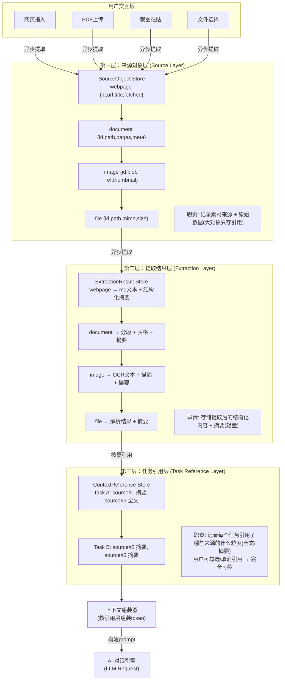

# 【月之暗面面经】多模态输入同时有网页、文档和本地截图时，桌面端该怎样做上下文管理？

## 核心问题

桌面端 AI 产品面临的典型场景：用户同时拖入一个网页链接、一份 PDF 文档、两张本地截图，然后让 AI "结合这些资料总结一下"。此时前端必须回答——**这些多模态素材从哪来（来源）、提取出了什么（结果）、当前对话正在引用哪些（任务引用）**，三层如果混在一起，就会出现上下文膨胀、引用不可控、用户不知道 AI "看"了什么的问题。

核心设计原则：**上下文不是一个大数据池，而是一个分层引用系统。**

---

## 一、三层架构设计

### 1.1 上下文管理架构图



### 1.2 三层职责拆分

| 层级 | 职责 | 存储内容 | 生命周期 |
|------|------|---------|---------|
| **来源对象层** | 记录素材从哪来 | URL/文件路径 + 元数据 + 原始数据引用（大对象不拷贝，存 blob 引用或临时路径） | 全局持久，用户手动删除 |
| **提取结果层** | 存储提取后的内容 | 结构化文本 + 表格 + 图片描述 + **摘要** | 随来源对象存活 |
| **任务引用层** | 记录当前任务引用了哪些素材 | 引用 ID + 引用粒度（全文/摘要/片段）+ 引用顺序 | 随任务/对话存活 |

**关键设计决策：**

1. **大对象不重复拷贝**：一张 10MB 的截图，来源层只存 `blob://` 引用和缩略图（~50KB）；提取层存 OCR 文本（~2KB）；引用层只存 ID 和摘要（~200B）。三层都没有持有原始 blob 的拷贝，内存占用极低。

2. **粒度可控**：用户可以为每个任务勾选"用全文"还是"只用摘要"。默认引用摘要，减少 token 消耗；用户明确需要时展开全文。

3. **可见性**：前端面板实时展示"当前 AI 正在引用哪些素材"——绿色高亮表示被引用，灰色表示未引用。

---

## 二、Vue 代码实现

### 2.1 TypeScript 类型定义

```typescript
// types/context.ts

/** 模态类型 */
type Modality = 'webpage' | 'document' | 'image' | 'file' | 'audio'

/** 来源对象 — 第一层 */
interface SourceObject {
  id: string
  modality: Modality
  title: string
  // 原始数据引用（不持有blob本体，只存引用路径）
  rawRef: string          // blob:// / file:// / https://
  thumbnailRef?: string   // 缩略图引用（轻量预览）
  meta: {
    url?: string          // 网页URL
    mimeType?: string     // 文件MIME类型
    size: number          // 原始大小（字节）
    createdAt: number     // 获取时间戳
    sourceApp?: string    // 来源应用（如浏览器/截图工具）
  }
  extractionStatus: 'pending' | 'extracting' | 'done' | 'failed'
}

/** 提取结果 — 第二层 */
interface ExtractionResult {
  sourceId: string        // 关联来源对象
  // 轻量结构化内容
  content: {
    text?: string         // 提取的文本（可能被截断）
    tables?: TableData[]  // 提取的表格
    imageDesc?: string    // 图片描述/OCR结果
    structured?: Record<string, unknown>  // 结构化数据
  }
  summary: string         // 摘要（核心！大文档压缩成200-500字）
  summaryEmbedding?: Float32Array  // 摘要向量（用于检索）
  tokenCount: number      // 提取内容的token数
  extractedAt: number
}

/** 引用粒度 */
type ReferenceGranularity = 'summary' | 'fulltext' | 'fragment'

/** 任务引用 — 第三层 */
interface ContextReference {
  id: string
  taskId: string          // 关联任务
  sourceId: string        // 关联来源
  granularity: ReferenceGranularity  // 引用粒度
  fragmentRange?: {       // 片段引用时的范围
    start: number
    end: number
  }
  includeOrder: number    // 引用顺序（影响prompt组装）
  isActive: boolean       // 用户可随时取消引用
}
```

### 2.2 Pinia Store 实现三层分离

```typescript
// stores/context.store.ts
import { defineStore } from 'pinia'
import { ref, computed, shallowRef } from 'vue'
import type { SourceObject, ExtractionResult, ContextReference } from '@/types/context'

/** 第一层：来源对象 Store */
export const useSourceStore = defineStore('context-source', () => {
  // shallowRef 避免大对象深度响应式开销
  const sources = shallowRef<Map<string, SourceObject>>(new Map())
  // blob引用表：id → Blob对象（真正的原始数据，不进响应式系统）
  const blobRegistry = new Map<string, Blob>()

  /** 注册来源对象（不拷贝blob） */
  function registerSource(source: Omit<SourceObject, 'id'>, blob?: Blob): string {
    const id = `src_${Date.now()}_${Math.random().toString(36).slice(2, 8)}`
    const sourceObj: SourceObject = { ...source, id }

    if (blob) {
      // 生成blob引用URL，不拷贝数据
      const blobUrl = URL.createObjectURL(blob)
      sourceObj.rawRef = blobUrl
      blobRegistry.set(id, blob)
    }

    const newMap = new Map(sources.value)
    newMap.set(id, sourceObj)
    sources.value = newMap  // 触发浅层更新

    return id
  }

  /** 获取缩略图（延迟生成） */
  async function getThumbnail(sourceId: string): Promise<string | null> {
    const source = sources.value.get(sourceId)
    if (!source) return null
    if (source.thumbnailRef) return source.thumbnailRef

    // 延迟生成缩略图
    const blob = blobRegistry.get(sourceId)
    if (!blob) return null
    const thumbnail = await generateThumbnail(blob) // 压缩到200x200
    const thumbUrl = URL.createObjectURL(thumbnail)
    source.thumbnailRef = thumbUrl
    return thumbUrl
  }

  /** 清理：释放blob引用 */
  function removeSource(sourceId: string) {
    const source = sources.value.get(sourceId)
    if (source?.rawRef.startsWith('blob:')) {
      URL.revokeObjectURL(source.rawRef)
    }
    blobRegistry.delete(sourceId)
    const newMap = new Map(sources.value)
    newMap.delete(sourceId)
    sources.value = newMap
  }

  return { sources, registerSource, getThumbnail, removeSource }
})

/** 第二层：提取结果 Store */
export const useExtractionStore = defineStore('context-extraction', () => {
  const results = ref<Map<string, ExtractionResult>>(new Map())

  /** 异步提取（在Web Worker中执行） */
  async function extract(sourceId: string, source: SourceObject) {
    updateStatus(sourceId, 'extracting')

    try {
      const result = await runExtractionWorker(source)
      results.value.set(sourceId, result)
      updateStatus(sourceId, 'done')
    } catch (e) {
      updateStatus(sourceId, 'failed')
      console.error('Extraction failed:', e)
    }
  }

  /** 获取摘要（供引用层使用） */
  function getSummary(sourceId: string): string | null {
    return results.value.get(sourceId)?.summary ?? null
  }

  function updateStatus(sourceId: string, status: string) {
    // 更新来源对象的提取状态
    const sourceStore = useSourceStore()
    const source = sourceStore.sources.get(sourceId)
    if (source) source.extractionStatus = status as SourceObject['extractionStatus']
  }

  return { results, extract, getSummary }
})

/** 第三层：任务引用 Store */
export const useContextReferenceStore = defineStore('context-reference', () => {
  const references = ref<ContextReference[]>([])

  /** 当前任务激活的引用（按顺序） */
  const activeReferences = computed(() =>
    references.value
      .filter(r => r.isActive)
      .sort((a, b) => a.includeOrder - b.includeOrder)
  )

  /** 添加引用（默认用摘要粒度） */
  function addReference(taskId: string, sourceId: string,
                         granularity: ReferenceGranularity = 'summary') {
    const order = references.value.filter(r => r.taskId === taskId).length
    references.value.push({
      id: `ref_${Date.now()}`,
      taskId, sourceId, granularity,
      includeOrder: order,
      isActive: true
    })
  }

  /** 切换引用粒度（摘要 ↔ 全文） */
  function toggleGranularity(refId: string) {
    const ref = references.value.find(r => r.id === refId)
    if (!ref) return
    ref.granularity = ref.granularity === 'summary' ? 'fulltext' : 'summary'
  }

  /** 组装上下文（核心：按引用层构建prompt内容） */
  function assembleContext(taskId: string): AssembledContext {
    const extractionStore = useExtractionStore()
    const sourceStore = useSourceStore()

    const taskRefs = activeReferences.value.filter(r => r.taskId === taskId)
    const parts: ContextPart[] = []

    for (const ref of taskRefs) {
      const source = sourceStore.sources.get(ref.sourceId)
      const extraction = extractionStore.results.get(ref.sourceId)
      if (!source || !extraction) continue

      if (ref.granularity === 'summary') {
        // 只发摘要（省token）
        parts.push({
          sourceId: ref.sourceId,
          title: source.title,
          content: extraction.summary,
          tokenCount: Math.ceil(extraction.summary.length / 2) // 粗估
        })
      } else {
        // 全文（用户明确需要）
        parts.push({
          sourceId: ref.sourceId,
          title: source.title,
          content: extraction.content.text ?? extraction.summary,
          tokenCount: extraction.tokenCount
        })
      }
    }

    return { parts, totalTokens: parts.reduce((s, p) => s + p.tokenCount, 0) }
  }

  return { references, activeReferences, addReference, toggleGranularity, assembleContext }
})
```

### 2.3 上下文面板组件

```vue
<!-- components/ContextPanel.vue -->
<script setup lang="ts">
import { useSourceStore, useExtractionStore, useContextReferenceStore } from '@/stores/context.store'

const sourceStore = useSourceStore()
const extractionStore = useExtractionStore()
const refStore = useContextReferenceStore()

const props = defineProps<{ taskId: string }>()

// 当前任务的引用列表（带来源信息）
const taskSources = computed(() => {
  return refStore.activeReferences
    .filter(r => r.taskId === props.taskId)
    .map(ref => {
      const source = sourceStore.sources.get(ref.sourceId)
      const extraction = extractionStore.results.get(ref.sourceId)
      return {
        ref,
        source,
        summary: extraction?.summary ?? '提取中...',
        status: source?.extractionStatus
      }
    })
})

// 上下文token用量
const totalTokens = computed(() =>
  refStore.assembleContext(props.taskId).totalTokens
)
</script>

<template>
  <div class="context-panel">
    <div class="panel-header">
      <h3>📌 上下文素材</h3>
      <span class="token-badge" :class="{ warning: totalTokens > 8000 }">
        {{ totalTokens }} / 12000 tokens
      </span>
    </div>

    <TransitionGroup name="source-list" tag="div" class="source-list">
      <div v-for="item in taskSources" :key="item.ref.id"
           class="source-card"
           :class="{ inactive: !item.ref.isActive }">

        <!-- 来源类型图标 -->
        <div class="source-icon" :data-modality="item.source?.modality">
          {{ modalityIcon(item.source?.modality) }}
        </div>

        <!-- 来源信息 -->
        <div class="source-info">
          <span class="source-title">{{ item.source?.title }}</span>
          <span class="source-status" :data-status="item.status">
            {{ statusLabel(item.status) }}
          </span>
        </div>

        <!-- 粒度切换 -->
        <button class="granularity-toggle"
                @click="refStore.toggleGranularity(item.ref.id)">
          {{ item.ref.granularity === 'summary' ? '📄 摘要' : '📖 全文' }}
        </button>

        <!-- 启用/禁用引用 -->
        <button class="toggle-btn"
                @click="item.ref.isActive = !item.ref.isActive">
          {{ item.ref.isActive ? '✅' : '⬜' }}
        </button>
      </div>
    </TransitionGroup>

    <!-- token预警 -->
    <div v-if="totalTokens > 10000" class="token-warning">
      ⚠️ 上下文接近上限，建议部分素材切换为"摘要"模式
    </div>
  </div>
</template>
```

---

## 三、关键设计决策详解

### 3.1 为什么不把三层合并？

如果只有一个 `context[]` 数组把所有东西塞进去：

```
// ❌ 反模式：扁平池子
context = [
  { type: 'webpage', url: '...', fullHtml: '<50KB HTML>', title: '...' },
  { type: 'pdf', pages: [...100页...], text: '<200KB>' },
  { type: 'image', base64: '<5MB base64>', ocr: '...' },
]
```

问题：
- **内存爆炸**：大对象全部进响应式系统，Vue 深度代理开销巨大
- **重复拷贝**：同一个 PDF 在两个任务中引用 → 两份拷贝
- **不可见**：用户不知道 AI 实际"看"了哪些
- **不可控**：无法按任务裁剪引用范围

三层分离后，每个来源只注册一次，多个任务通过 ID 引用，内存恒定。

### 3.2 大对象存储策略

| 对象类型 | 大小 | 来源层存储 | 提取层存储 |
|---------|------|-----------|-----------|
| 网页HTML | 50-200KB | URL + 抓取时间 | Markdown文本(去标签) + 摘要 |
| PDF文档 | 1-50MB | 文件路径 + 页数 | 分段文本 + 摘要 |
| 截图 | 1-10MB | `blob://` 引用 + 缩略图(50KB) | OCR文本 + 描述 + 摘要 |
| 音频 | 5-100MB | 文件路径 | 转录文本 + 摘要 |

**核心：原始 blob 放在 `blobRegistry`（普通 Map，非响应式），Vue 组件只通过 `rawRef` 字符串引用。** 用 `shallowRef` 包裹 sources Map 避免深度响应式。

### 3.3 上下文版本管理

当用户修改引用（增/删/切粒度），保存一个快照：

```typescript
interface ContextSnapshot {
  taskId: string
  version: number
  references: ContextReference[]  // 深拷贝
  timestamp: number
}

// 用户可回退到历史版本
function rollback(taskId: string, version: number) {
  const snapshot = snapshots.find(s => s.taskId === taskId && s.version === version)
  if (snapshot) {
    references.value = references.value
      .filter(r => r.taskId !== taskId)
      .concat(structuredClone(snapshot.references))
  }
}
```

---

## 四、面试高频追问点

### Q1: 上下文满了怎么提示用户？

**答：** 三级策略：
1. **预警线（70% token）**：面板右上角 token 计数变黄，建议"切换部分素材为摘要模式"
2. **危险线（90%）**：红色警告 + 自动折叠低优先级素材为摘要
3. **硬上限（100%）**：阻止发送，必须裁剪后才能提交

优先级排序：用户最后操作/最近引用的素材优先级最高；自动抓取的网页优先级低于手动上传的文档。

### Q2: 不同模态的优先级怎么排？

**答：** 用户**主动上传**的 > **拖拽引用**的 > **自动抓取**的。同一优先级内，按引用时间倒序。面试中强调：优先级不是写死的，而是通过引用层的 `includeOrder` 字段动态调整，用户可以拖拽排序。

### Q3: 多任务并行时上下文怎么隔离？

**答：** 第三层 `ContextReference` 以 `taskId` 隔离——每个任务有自己的引用列表，互不干扰。但来源对象和提取结果是**共享的**（同一份 PDF 不需要重复提取）。这就是三层分离的最大价值：来源和提取只做一次，多个任务按需引用。

### Q4: Web Worker 在提取层的角色？

**答：** PDF 解析、OCR、HTML 清洗都是 CPU 密集任务，必须在 Web Worker（或 Electron 主进程）中执行，避免阻塞渲染线程。提取完成后通过 `postMessage` 将结果传回渲染进程写入 Store。如果提取失败，引用层仍可降级使用来源层的元数据（标题、URL）作为最简上下文。

---

## 五、实战经验

1. **分层是核心洞察**：面试中一句话点睛——"桌面AI的上下文管理不是存什么的问题，而是**引用什么的问题**"。来源→提取→引用三层分离让多模态输入变得可控、可见、可裁剪。

2. **blob 引用是工程关键**：千万不要把 base64 或 ArrayBuffer 直接塞进响应式 Store。用 `URL.createObjectURL` + `shallowRef` 是 Electron/Vue 环境下的标准做法，内存占用降低 90%+。

3. **摘要不是可选的**：大文档不提取摘要就直接发全文，很快就会打满 token 上限。摘要层是**成本控制的核心**——默认发摘要（200字），用户需要时一键展开全文。

4. **可见性即信任**：用户最焦虑的不是 AI 做得好不好，而是"AI 到底看了我的哪些资料"。上下文面板的实时高亮（绿色=被引用，灰色=未引用）是建立信任的关键 UX。

## 记忆要点

- 核心原则：上下文不是大数据池，而是分层引用系统
- 三层架构：来源对象层(存引用)、提取结果层(存文本/OCR/摘要)、任务引用层(挂载到对话)
- 异步处理：大文件先存引用，后台异步提取，避免阻塞UI交互


## 苏格拉底式面试追问

> 这组追问模拟面试官层层逼问，每一问先回答"为什么"，再回答"怎么做"，最后回答"如何证明"。

### 第一层：目标与动机

**Q：多模态上下文你做三层架构（来源/提取/引用），为什么不直接把所有素材"喂"给 AI，让它自己处理？**

直接喂有三个问题：一、上下文爆炸——PDF 可能几 MB，截图 base64 后更大，全塞进 prompt 超过模型窗口（如 128k token），AI 截断丢失信息；二、成本——每 token 计费，大文件每次对话都重发，成本飙升；三、不可见——用户不知道 AI"看"了哪些素材，AI 引用错误时无法定位（是哪份资料说的？）。三层架构解决：来源层存引用（不重复拷贝大对象）、提取层存文本/OCR 摘要（AI 实际用的内容）、引用层挂载到对话（用户可见 AI 用了什么）。本质是"AI 用摘要而非原文 + 用户可见引用链"，兼顾成本、窗口和可解释性。

### 第二层：证据与定位

**Q：用户说"AI 回答时引用了错误的截图"，你怎么定位是引用追踪 bug 还是 AI 幻觉？**

看引用层的元数据。每个 AI 回答应携带引用标记（如 [cite:img-3]），前端渲染时高亮对应素材。定位：一、如果 AI 回答带了 [cite:img-3] 但内容描述的是 img-1 的事——是 AI 幻觉（引用标记对，内容错），需优化 prompt 或换模型；二、如果引用标记本身就错（AI 说 img-1 但实际该引用 img-3）——是引用追踪 bug，看引用挂载逻辑（是否把正确的素材挂到了对话）。证据：对话日志里 AI 的引用标记 vs 素材实际内容，交叉验证。常见根因：OCR 提取层把多张截图内容混了（如 img-1 和 img-3 的文本被拼接到一个 chunk），导致 AI 引用时混淆。

### 第三层：根因深挖

**Q：上下文满了（token 超 128k）你怎么提示用户，而不是直接报错让用户重新开始？**

直接报错是最差的体验（用户工作丢失）。正确做法：一、实时 token 计数——前端每添加素材或发消息时算 token（用 tiktok 或模型 tokenizer），接近阈值（如 90%）时提示"上下文即将满"；二、可视化占用——用进度条或饼图展示各素材的 token 占比（PDF 60%、对话 20%、截图 10%），让用户知道"是谁占了空间"；三、建议裁剪——AI 建议"截图 img-1 已 5 轮未引用，可移除"或"PDF 可切换为摘要（从 50k token 降到 2k）"。本质是"主动管理上下文而非被动等满"，把 token 管理变成用户可控的操作。

**Q：那为什么不自动裁剪上下文（如 LRU 淘汰最久没引用的素材），让用户无感？**

自动裁剪有风险：一、误删重要素材——LRU 基于"最近引用"，但用户可能"暂时不问"某素材，不等于"不需要"（如关键证据 PDF，用户过会儿要引用）；二、上下文断裂——AI 的回答基于某素材，裁剪后 AI"忘了"自己说过什么，后续对话矛盾；三、不可解释——用户不知道哪些被裁了，AI 回答突兀（"为什么 AI 不记得那个 PDF 了"）。所以自动裁剪要"保守"：只裁剪明确的临时素材（如粘贴的短文本），重要素材（用户主动添加的文件）必须用户显式移除。折中方案：自动"归档"（不删除，从活跃上下文移到归档区，用户可重新激活），而非删除。

### 第四层：方案权衡

**Q：提取层你用 OCR 把截图转文本，但图表类截图 OCR 效果差，为什么不用多模态模型（如 GPT-4V）直接"看"图？**

OCR vs 多模态模型各有利弊：OCR 优势是便宜（每次调用几分钱）、快（毫秒级）、文本可检索（全文搜索）；劣势是图表/手写识别差。多模态模型优势是理解能力强（能描述图表含义）、准确；劣势是贵（每次调用几毛钱）、慢（秒级）、输出是描述而非原文（无法精确引用）。权衡：一、文档类截图（文字为主）用 OCR，成本低且文本可检索；二、图表/截图类用多模态模型描述，存描述到提取层；三、混合——先 OCR 提文字，如果识别置信度低（如检测到图表区域），再调多模态模型补充。所以不是二选一，是"按内容类型路由"，OCR 为主、多模态为辅，成本和质量兼顾。

**Q：为什么不把多模态模型的"看图"结果直接传给 AI（每次对话带图），而是存到提取层？**

每次对话带图有两个问题：一、成本爆炸——同一张图每轮对话都重新传（模型不缓存），10 轮对话传 10 次，每次几毛钱；二、延迟——多模态输入处理慢（秒级），每轮对话都等。提取层方案：图只"看"一次（提取时），结果存文本描述，后续对话用文本描述（便宜、快）。代价是"描述可能丢失细节"（如用户问图上某具体数字，描述里没提）。折中：提取层存"文本描述 + 图引用"，AI 默认用描述，需要细节时（用户问具体内容）才重新传图。这是"懒加载"思路——默认用摘要，按需加载原图。

### 第五层：验证与沉淀

**Q：你怎么验证三层上下文架构比"直接喂"更优？**

对比指标：一、成本——三层架构 vs 直接喂，每次对话的 token 消耗对比（三层应低 60%+，因为用摘要不用原文）；二、响应延迟——三层架构 AI 首字节延迟（应更低，输入 token 少）；三、用户满意度——问卷问"AI 是否准确引用了你的素材"（三层应更高，引用可见）；四、上下文利用率——统计"用户添加的素材被 AI 实际引用的比例"（三层应更高，因为引用可见用户会主动管理）。A/B 测试两组用户，跑 1-2 周看指标差异。

**Q：这道题沉淀出什么可复用的多模态上下文设计经验？**

四条原则：一、分层引用——来源（引用）、提取（摘要）、引用（挂载）三层分离，AI 用摘要不用原文，省成本省窗口；二、用户可见——AI 每次回答携带引用标记，用户能追溯"AI 依据哪份素材"；三、主动管理——实时 token 计数 + 可视化占用 + 建议裁剪，把上下文管理变成用户可控操作；四、按需加载——OCR 为主、多模态为辅，默认摘要、按需加载原图。核心洞察："多模态上下文的本质是'引用系统'而非'数据池'，借鉴 OS 的文件系统（引用 + 按需读取）而非数据库（全量加载）。"


## 结构化回答

**30 秒电梯演讲：** 把来源对象、提取结果和当前任务引用拆开，用户能看到哪些素材正在被消费，大对象优先存引用和摘要。打个比方，就像厨师备菜台——食材来源(冰箱/市场/菜园)、处理状态(洗好/切好)、正在做哪道菜(任务引用)，三层分开管理。

**展开框架：**
1. **核心原则** — 上下文不是大数据池，而是分层引用系统
2. **三层架构** — 来源对象层(存引用)、提取结果层(存文本/OCR/摘要)、任务引用层(挂载到对话)
3. **异步处理** — 大文件先存引用，后台异步提取，避免阻塞UI交互

**收尾：** 这块我踩过坑——要不要深入聊：上下文满了怎么提示用户？

## 视频脚本

> 预计时长：4 分钟 | 由浅入深

| 时间 | 画面/字幕 | 口播台词 | 讲解要点 |
|------|----------|----------|----------|
| 0:00 | 标题卡 | "AI-Native桌面一句话：把来源对象、提取结果和当前任务引用拆开，用户能看到哪些素材正在被消费，大对象优先存引用和摘要。" | 开场钩子 |
| 0:15 | 架构示意图 | "核心原则：上下文不是大数据池，而是分层引用系统" | 核心原则 |
| 1:08 | 架构示意图分步演示 | "三层架构：来源对象层(存引用)、提取结果层(存文本/OCR/摘要)、任务引用层(挂载到对话)" | 三层架构 |
| 2:01 | 关键代码/伪代码片段 | "异步处理：大文件先存引用，后台异步提取，避免阻塞UI交互" | 异步处理 |
| 2:54 | 对比表格 | "来源对象/提取结果/任务引用三层拆开" | 来源对象/提取结果/任务 |
| 3:50 | 总结卡 | "核心抓住这条主线，下期咱们接着聊：上下文满了怎么提示用户。" | 收尾 |
