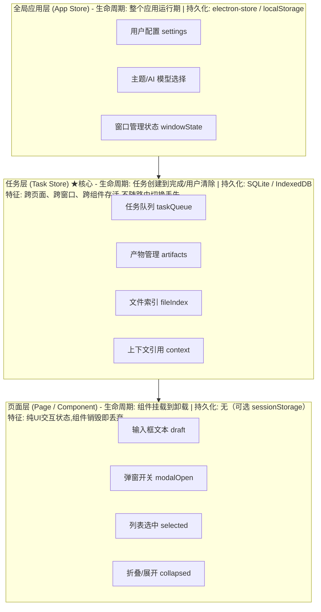

# 【月之暗面面经】Vue 做桌面 AI 产品时，哪些状态应该在页面层，哪些要上升到任务层？

## 核心问题

桌面端 AI 产品有一个独特的架构痛点：**长任务的生命周期远超单页面组件**。用户发起一个文档分析任务（可能跑 3-5 分钟），然后切到另一个页面做别的事——如果任务状态绑定在发起页面的组件上，组件卸载时状态就丢了。

这道题的本质是：**状态的生命周期决定它的归属层级。** 组件销毁就消失的 → 页面层；跨组件/跨窗口/跨会话存活的 → 任务层。

---

## 一、状态分层架构总览

### 1.1 三层状态架构图



### 1.2 分层判据：一张决策表

| 状态类型 | 生命周期 | 是否跨组件 | 是否需持久化 | 归属层级 | 示例 |
|---------|---------|-----------|------------|---------|------|
| 输入框草稿 | 组件内 | 否 | 否（可选） | **页面层** | `ref('')` |
| 弹窗/抽屉开关 | 组件内 | 否 | 否 | **页面层** | `ref(false)` |
| 列表选中/筛选 | 页面内 | 可能 | 否 | **页面层** | `ref([])` |
| 表单临时数据 | 页面内 | 否 | 否 | **页面层** | `reactive({})` |
| **任务执行状态** | **跨页面** | **是** | **是** | **任务层** | TaskStore |
| **任务产物结果** | **跨页面** | **是** | **是** | **任务层** | ArtifactStore |
| **文件/素材索引** | **跨页面** | **是** | **是** | **任务层** | FileIndexStore |
| **上下文引用关系** | **跨页面** | **是** | **是** | **任务层** | ContextStore |
| 用户偏好/主题 | 应用级 | 是 | 是 | **全局层** | AppStore |

**一句话原则：如果一个状态在用户切走页面后还需要回来看到 → 它属于任务层，不属于页面层。**

---

## 二、Pinia Store 分层设计

### 2.1 Store 依赖关系

```
                    ┌──────────────┐
                    │  useAppStore │ (全局配置)
                    └──────┬───────┘
                           │
           ┌───────────────┼───────────────┐
           ▼               ▼               ▼
    ┌────────────┐  ┌────────────┐  ┌──────────────┐
    │useTaskStore│  │useFileStore│  │useContextStore│ (任务层)
    │  ★核心     │  │  素材索引   │  │  上下文引用   │
    └──────┬─────┘  └─────┬──────┘  └──────┬───────┘
           │               │                │
           └───────────────┼────────────────┘
                           │ (页面层通过composable消费)
                           ▼
              ┌─────────────────────────┐
              │   useTaskPanel()        │ (页面层组合式函数)
              │   useDraftInput()       │
              │   useModalState()       │
              └─────────────────────────┘
```

### 2.2 TypeScript 类型定义

```typescript
// types/state.ts

// ============ 任务层类型 ============

/** 任务状态枚举 */
type TaskStatus =
  | 'pending'       // 等待中（排队）
  | 'running'       // 执行中
  | 'paused'        // 暂停（等待用户确认）
  | 'completed'     // 已完成
  | 'failed'        // 失败
  | 'cancelled'     // 用户取消

/** 任务类型 */
type TaskType = 'chat' | 'doc_analysis' | 'image_gen' | 'code_gen' | 'data_extract'

/** 任务实体 */
interface Task {
  id: string
  type: TaskType
  status: TaskStatus
  title: string                 // 用户可读标题
  prompt: string                // 原始指令
  progress: number              // 0-100
  createdAt: number
  updatedAt: number
  startedAt?: number
  completedAt?: number
  error?: string                // 失败原因
  retryCount: number            // 重试次数
  // 关联ID
  contextRefIds: string[]       // 引用的上下文素材
  artifactIds: string[]         // 产出的结果
  // 断点续传
  checkpoint?: TaskCheckpoint   // 检查点（用于断点续传）
}

/** 任务断点（用于失败后恢复） */
interface TaskCheckpoint {
  stepIndex: number             // 执行到第几步
  intermediateData?: string     // 中间数据引用
  savedAt: number
}

/** 任务产物 */
interface Artifact {
  id: string
  taskId: string
  type: 'text' | 'markdown' | 'image' | 'file' | 'json'
  title: string
  content: string               // 文本内容 / blob引用
  meta: {
    format: string
    size: number
    createdAt: number
  }
}

/** 文件索引条目 */
interface FileEntry {
  id: string
  sourcePath: string            // 原始路径
  displayName: string
  mimeType: string
  size: number
  taskId?: string               // 关联任务
  addedAt: number
  status: 'indexed' | 'processing' | 'ready'
}

// ============ 页面层类型 ============

/** 页面UI状态（不持久化） */
interface PageUIState {
  draftInput: string            // 输入框草稿
  isSettingsModalOpen: boolean  // 设置弹窗
  selectedTaskIds: string[]     // 任务列表选中项
  expandedTaskId: string | null // 展开的任务卡片
  sortBy: 'created' | 'updated' // 排序方式
  filterStatus: TaskStatus | 'all' // 筛选状态
}
```

### 2.3 任务层 Store 实现

```typescript
// stores/task.store.ts
import { defineStore } from 'pinia'
import { ref, computed } from 'vue'
import type { Task, TaskStatus, Artifact, FileEntry } from '@/types/state'

/** ★ 核心：任务管理 Store — 跨页面存活 */
export const useTaskStore = defineStore('task', () => {
  // ---- 状态 ----
  const tasks = ref<Map<string, Task>>(new Map())
  const artifacts = ref<Map<string, Artifact>>(new Map())
  const fileEntries = ref<FileEntry[]>([])

  // ---- 计算属性 ----
  const runningTasks = computed(() =>
    [...tasks.value.values()].filter(t => t.status === 'running')
  )

  const pendingTasks = computed(() =>
    [...tasks.value.values()].filter(t => t.status === 'pending')
  )

  const sortedTasks = computed(() => {
    const all = [...tasks.value.values()]
    return all.sort((a, b) => b.updatedAt - a.updatedAt)
  })

  /** 某个任务的完整快照（含产物和引用） */
  function getTaskSnapshot(taskId: string) {
    const task = tasks.value.get(taskId)
    if (!task) return null

    return {
      task,
      artifacts: task.artifactIds
        .map(id => artifacts.value.get(id))
        .filter(Boolean) as Artifact[],
      files: fileEntries.value.filter(f => f.taskId === taskId)
    }
  }

  // ---- 动作 ----

  /** 创建任务 */
  function createTask(data: Pick<Task, 'type' | 'title' | 'prompt' | 'contextRefIds'>): string {
    const id = `task_${Date.now()}_${Math.random().toString(36).slice(2, 8)}`
    const now = Date.now()

    tasks.value.set(id, {
      id, ...data,
      status: 'pending',
      progress: 0,
      createdAt: now,
      updatedAt: now,
      retryCount: 0,
      artifactIds: []
    })
    return id
  }

  /** 更新任务状态（核心：任务状态变更不依赖任何组件） */
  function updateTaskStatus(taskId: string, status: TaskStatus, error?: string) {
    const task = tasks.value.get(taskId)
    if (!task) return

    task.status = status
    task.updatedAt = Date.now()
    task.error = error

    if (status === 'running' && !task.startedAt) task.startedAt = Date.now()
    if (status === 'completed') task.completedAt = Date.now()

    // 触发响应式更新
    tasks.value = new Map(tasks.value)
  }

  /** 添加产物 */
  function addArtifact(taskId: string, artifact: Omit<Artifact, 'id' | 'taskId'>) {
    const id = `art_${Date.now()}`
    const fullArtifact: Artifact = { ...artifact, id, taskId }
    artifacts.value.set(id, fullArtifact)

    const task = tasks.value.get(taskId)
    if (task) task.artifactIds.push(id)
  }

  /** 重试任务（断点续传） */
  function retryTask(taskId: string) {
    const task = tasks.value.get(taskId)
    if (!task) return
    task.retryCount++
    task.error = undefined
    updateTaskStatus(taskId, 'pending')
    // 触发任务执行引擎重新拾取
  }

  /** 持久化到 IndexedDB（防刷新丢失） */
  async function persist() {
    const db = await openDB('task-store', 1)
    await db.put('meta', JSON.stringify([...tasks.value]), 'tasks')
    await db.put('meta', JSON.stringify([...artifacts.value]), 'artifacts')
  }

  /** 从 IndexedDB 恢复 */
  async function restore() {
    const db = await openDB('task-store', 1)
    const taskData = await db.get('meta', 'tasks')
    if (taskData) tasks.value = new Map(JSON.parse(taskData))
    const artData = await db.get('meta', 'artifacts')
    if (artData) artifacts.value = new Map(JSON.parse(artData))
  }

  return {
    tasks, artifacts, fileEntries,
    runningTasks, pendingTasks, sortedTasks,
    getTaskSnapshot, createTask, updateTaskStatus,
    addArtifact, retryTask, persist, restore
  }
})
```

### 2.4 页面层状态：组合式函数（不进 Store）

```typescript
// composables/usePageUI.ts
import { ref, reactive } from 'vue'

/**
 * 页面层UI状态 — 通过组合式函数管理，不进入全局Store
 * 组件卸载即销毁，不持久化
 */
export function useTaskPageUI() {
  // 输入框草稿（仅当前页面有效）
  const draftInput = ref('')

  // 设置弹窗
  const isSettingsOpen = ref(false)

  // 任务列表选中/展开
  const selectedTaskIds = ref<string[]>([])
  const expandedTaskId = ref<string | null>(null)

  // 筛选/排序（纯UI偏好，刷新即重置）
  const sortBy = ref<'created' | 'updated'>('updated')
  const filterStatus = ref<TaskStatus | 'all'>('all')

  // 拖拽中的素材（临时状态）
  const draggingFile = ref<FileEntry | null>(null)

  return {
    draftInput, isSettingsOpen,
    selectedTaskIds, expandedTaskId,
    sortBy, filterStatus, draggingFile
  }
}
```

### 2.5 组件中使用两层状态

```vue
<!-- views/TaskCenter.vue -->
<script setup lang="ts">
import { useTaskStore } from '@/stores/task.store'
import { useTaskPageUI } from '@/composables/usePageUI'

// ★ 任务层状态（来自全局Store，跨页面存活）
const taskStore = useTaskStore()

// ★ 页面层状态（来自组合式函数，组件卸载即销毁）
const { draftInput, isSettingsOpen, expandedTaskId, filterStatus } = useTaskPageUI()

// 提交任务：页面层 → 任务层
function submitTask() {
  if (!draftInput.value.trim()) return

  taskStore.createTask({
    type: 'chat',
    title: draftInput.value.slice(0, 50),
    prompt: draftInput.value,
    contextRefIds: []
  })

  draftInput.value = ''  // 清空输入框（页面层状态）
}

onMounted(() => taskStore.restore())  // 从持久化恢复
watch(() => taskStore.tasks, () => taskStore.persist(), { deep: true })
</script>

<template>
  <div class="task-center">
    <!-- 任务列表来自任务层Store -->
    <div v-for="task in taskStore.sortedTasks" :key="task.id">
      <TaskCard :task="task" :expanded="expandedTaskId === task.id"
                @click="expandedTaskId = task.id" />
    </div>

    <!-- 输入框是页面层状态 -->
    <input v-model="draftInput" @keyup.enter="submitTask" />
  </div>
</template>
```

---

## 三、核心决策：什么状态不该上升？

### 3.1 反模式：什么都塞进 Store

```typescript
// ❌ 反模式：把输入框草稿也放全局Store
const useBadStore = defineStore('bad', () => {
  const inputDraft = ref('')  // 错！输入框文本是纯UI状态
  const modalOpen = ref(false) // 错！弹窗开关是页面级状态
  // ... 这些状态污染了全局store，且组件销毁后还在内存中
})
```

**问题：**
- 全局 Store 膨胀，难以维护
- UI 状态被全局化 → 每个页面打开都共享同一个草稿（跨页面串台）
- 性能：全局响应式追踪范围过大

### 3.2 判据清单

在决定状态归属时，问三个问题：

```
Q1: 用户离开当前页面再回来，这个状态还需要吗？
    → 是 → 任务层
    → 否 → 页面层

Q2: 这个状态需要在另一个窗口中看到吗？
    → 是 → 任务层（+ 跨窗口同步）
    → 否 → 页面层

Q3: 应用重启后这个状态需要恢复吗？
    → 是 → 任务层（+ 持久化）
    → 否 → 页面层
```

### 3.3 灰色地带处理

| 状态 | 分析 | 结论 |
|------|------|------|
| 搜索关键词 | 切走再回来需要？可能。 | **页面层** + sessionStorage（短暂保留） |
| 对话历史 | 跨页面？是。 | **任务层**（每个对话=一个Task） |
| 加载动画 | UI 临时 | **页面层** |
| 任务进度条数值 | 跨页面需要 | **任务层**（task.progress） |
| 当前选中的AI模型 | 全局偏好 | **全局层**（AppStore） |
| 表单未提交数据 | 离开即丢 | **页面层**（或 sessionStorage） |

---

## 四、跨窗口状态同步（Electron 特有）

桌面端可能有多个窗口（主窗口 + 迷你悬浮窗 + 设置窗口），任务层状态需要跨窗口共享：

```typescript
// services/crossWindowSync.ts

/** 跨窗口状态同步：通过IPC事件广播 */
export function setupCrossWindowSync(taskStore: ReturnType<typeof useTaskStore>) {
  const { ipcRenderer } = window.electron

  // 窗口A更新任务 → 广播 → 所有窗口同步
  taskStore.$subscribe((mutation, state) => {
    ipcRenderer.send('task-state-broadcast', {
      type: mutation.type,
      storeId: mutation.storeId,
      // 只传变更的delta，不传全量
      payload: extractDelta(mutation)
    })
  })

  // 接收其他窗口的广播 → 更新本窗口Store
  ipcRenderer.on('task-state-update', (_event, data) => {
    applyDeltaToStore(taskStore, data)
  })
}

/** 主进程作为消息中继 */
// main.ts (Electron主进程)
ipcMain.on('task-state-broadcast', (event, data) => {
  // 广播给除发送者外的所有窗口
  BrowserWindow.getAllWindows().forEach(win => {
    if (win.webContents.id !== event.sender.id) {
      win.webContents.send('task-state-update', data)
    }
  })
})
```

---

## 五、面试高频追问点

### Q1: Pinia 和 Vuex 在桌面端怎么选？

**答：** 毫不犹豫选 Pinia。原因：(1) 组合式 API 天然契合 Vue 3 setup 语法；(2) 支持 TypeScript 类型推断，Vuex 的类型体操痛苦；(3) Pinia 支持模块化拆分（每个 Store 独立），天然适配三层架构；(4) 体积更小。Vuex 是 Vue 2 时代的遗产，新项目不应再选。

### Q2: 任务层状态怎么持久化？

**答：** 分级持久化策略：
- **任务列表 + 元数据** → SQLite（Electron 环境 `better-sqlite3`），结构化查询高效
- **任务产物（大文本/图片）** → 文件系统 + 索引（SQLite 存路径），不存进数据库
- **上下文引用关系** → 随任务一起存入 SQLite JSON 字段
- **用户偏好** → `electron-store`（底层是 JSON 文件）

关键：持久化是**异步的**，不能阻塞 UI。用 debounce + Web Worker（或主进程）执行写入。

### Q3: 为什么不把所有状态都放 Pinia？

**答：** 全局 Store 不是越满越好。纯 UI 状态放 Store 有三个代价：(1) 响应式追踪开销——每个 Store 状态变更都会通知所有订阅者；(2) 跨页面串台——A 页面修改了 `modalOpen`，B 页面的弹窗也变了；(3) 心智负担——开发者不知道某个状态在哪个 Store 里。**页面层状态用 `ref`/`reactive` 在组件内管理，是 Vue 的设计意图。**

### Q4: 长任务执行时，用户关闭了发起页面怎么办？

**答：** 这正是分层设计的核心价值——任务执行逻辑在后端/Worker 中运行，状态在 `useTaskStore` 中。页面组件卸载不影响 Store。用户关闭页面后：(1) 任务继续在后台运行；(2) 系统通知推送结果；(3) 用户重新打开任务中心，`taskStore.restore()` 从持久化恢复所有任务状态。**任务的生命周期独立于任何 UI 组件——这是架构设计的底线。**

---

## 六、实战经验

1. **分层的第一判据：生命周期**。面试中用一句话总结——"状态跟着谁活就归谁管"。组件销毁就死的归页面，跨组件跨窗口活的归任务层。

2. **Pinia Store 不是越多越好**。任务层建议 2-3 个 Store（TaskStore + FileStore + ContextStore），不要按页面拆 Store。全局层 1 个 AppStore 足够。

3. **组合式函数是页面层的最佳实践**。`useTaskPageUI()` 这种 composable 既隔离了页面状态，又比 Store 轻量。多个组件共享页面状态时，composable 单例模式（模块级 `ref`）即可。

4. **持久化是任务层的隐性要求**。桌面端用户可能直接关窗口甚至关应用。任务层状态必须持久化到磁盘（SQLite/IndexedDB），重启后恢复。这不是可选功能，是桌面产品的基本要求。

## 记忆要点

- 核心判据：状态在用户切走页面后还需看到，就属于任务层
- 页面层存短暂UI状态：如草稿、弹窗开关、折叠状态，组件卸载即丢弃
- 任务层存跨页/长生命状态：如任务队列、文件索引、上下文，需持久化


## 苏格拉底式面试追问

> 这组追问模拟面试官层层逼问，每一问先回答"为什么"，再回答"怎么做"，最后回答"如何证明"。

### 第一层：目标与动机

**Q：Vue 桌面 AI 产品你做状态分层（页面层 vs 任务层），但 Web 端 AI 产品（如 ChatGPT 网页版）也是 Vue/React，为什么桌面端必须分层而 Web 端可以混在一起？**

Web 端 AI 产品的会话生命周期和页面生命周期基本一致——用户在一个标签页里对话，关标签页就结束（或刷新后从服务端恢复）。桌面端不同：一、长任务跨页面——用户在 A 页面发起任务，切到 B 页面做别的事，任务还在跑，状态不能随 A 页面组件卸载而消失；二、多窗口——桌面端可能开多个窗口（主窗口 + 产物预览窗口），任务状态要跨窗口共享；三、后台执行——窗口最小化任务仍在跑，状态必须独立于 UI 存活。所以 Web 端"状态绑页面"够用，桌面端"状态必须上升任务层"才能支撑长任务和多窗口。判据：状态生命周期是否超出单页面组件——超出则上升。

### 第二层：证据与定位

**Q：用户反馈"切页面回来任务进度没了"，你怎么定位是状态分层没做还是持久化没做？**

两类问题：一、状态分层没做——任务状态存在页面组件的 data 里（如 `this.taskProgress`），组件卸载（切页面）状态丢，回来是空的；二、分层做了但持久化没做——任务状态在 Pinia store 里（不随组件卸载丢），但没写磁盘，应用重启后丢。定位：一、切页面再切回来——如果进度没了，是分层没做（store 里没状态）；二、重启应用再打开——如果进度没了，是持久化没做（store 有但磁盘没）。修复对应：分层问题把状态从组件 data 移到 Pinia store；持久化问题给 store 加持久化（如 pinia-plugin-persistedstate 写 localStorage/IndexedDB，或 Electron 主进程写文件）。

### 第三层：根因深挖

**Q：任务层状态你用 Pinia store，但发现 store 更新后页面没重渲染，根因可能是什么？**

Pinia 响应式失效的常见根因：一、直接替换整个对象——`store.task = newTask`（newTask 是普通对象），如果 task 是 reactive 的，替换后新对象没被代理，失去响应式；要用 `store.$patch({ task: newTask })` 或保证 newTask 是 reactive；二、用 markRaw 标记了——之前为优化性能用 `markRaw(task)`，导致 task 不被代理，更新不触发渲染；三、解构丢失响应式——`const { taskProgress } = store` 解构后 taskProgress 是普通值，要用 `storeToRefs(store)` 解构保持响应式。定位：Vue Devtools 的 Components 面板看 store 状态是否更新（如果 store 更新了但组件没渲染，是组件订阅问题；如果 store 没更新，是 mutation 问题）。

**Q：那为什么不直接用 Vue 的 provide/inject 跨组件共享任务状态，还要引入 Pinia？**

provide/inject 是组件树内的依赖注入，适合"父组件给后代组件传数据"，但有局限：一、只能向下传——祖先 provide，后代 inject，兄弟组件或跨树组件拿不到；二、无 devtools 支持——状态变化不可追踪，调试困难；三、无持久化/插件生态——Pinia 有持久化插件、时间旅行调试、SSR 支持等。Pinia 是全局 store，任何组件都能订阅，有完整的 devtools 集成。所以 provide/inject 适合"局部、树内"的状态共享（如某表单组件内部），Pinia 适合"全局、跨树"的任务状态。AI 桌面产品的任务状态是多页面/多窗口共享的全局状态，必须 Pinia（或类似全局 store）。

### 第四层：方案权衡

**Q：跨窗口状态同步你用 Electron IPC + Pinia，但为什么不直接用 SharedArrayBuffer（共享内存），性能更好？**

SharedArrayBuffer 允许多个上下文（如 worker）共享同一段内存，读写无需序列化，性能最好。但 Electron 的多窗口是不同渲染进程，每个渲染进程是独立的 JS 上下文，SharedArrayBuffer 在渲染进程间不可直接共享（受同源策略和 COOP/COEP 头限制，且 Electron 的渲染进程隔离比 Web 更严格）。所以跨窗口共享必须走 IPC（序列化 + 主进程中转）。代价是序列化开销（大对象 IPC 慢）。优化：一、增量同步——只同步变化的部分（如任务的 progress 字段变了，只传 progress）；二、订阅模式——窗口只订阅它关心的状态（如产物预览窗口只订阅产物状态，不订阅任务队列），减少传输量。所以 SharedArrayBuffer 不可用，IPC + 增量同步是 Electron 跨窗口的务实方案。

**Q：为什么不把任务状态完全放到主进程（Electron main），渲染进程只做展示，状态天然单点？**

把状态放主进程的好处是天然单点（所有窗口共享），但问题是：一、主进程阻塞——主进程是 Electron 的"大脑"，管理窗口生命周期，如果状态逻辑重（如大对象处理）会阻塞主进程，导致所有窗口卡顿；二、响应式丢失——主进程是 Node.js 环境，没有 Vue 响应式，状态变化要手动 IPC 通知渲染进程，渲染进程再触发重渲染，链路长；三、开发体验差——状态逻辑在主进程（Node 环境），不能用 Vue devtools，调试不便。所以分工是：主进程做"持久化和窗口管理"（轻量），渲染进程的 Pinia 做"状态管理和响应式"（业务逻辑）。主进程是存储后端，渲染进程是状态前端，IPC 是通道。

### 第五层：验证与沉淀

**Q：你怎么验证状态分层架构正确（没有状态泄漏或丢失）？**

场景测试覆盖：一、切页面测试——发起长任务，切到其他页面，再切回来，任务进度应连续（页面层不应持有任务状态）；二、多窗口测试——主窗口发起任务，开产物预览窗口，两个窗口的任务状态应实时同步（如进度条一致）；三、重启测试——任务进行中关闭应用，重新打开，任务状态应恢复（持久化有效）；四、内存泄漏测试——频繁切页面、开关窗口，用 Chrome DevTools Memory 面板看堆内存是否持续增长（组件卸载应释放，任务状态在 store 不应泄漏）。自动化：写 E2E 测试（如 Playwright）覆盖这些场景，CI 里跑。

**Q：这道题沉淀出什么可复用的 Vue 桌面状态分层经验？**

四条原则：一、生命周期判据——状态是否需要跨页面/跨窗口/跨会话存活，是则上升任务层；二、Pinia 做全局 store——页面层用组件 data，任务层用 Pinia store，不用 provide/inject（局部）；三、主进程持久化——任务状态用 Pinia + 持久化插件（IndexedDB/文件），主进程管理存储，渲染进程管响应式；四、跨窗口增量同步——IPC 同步只传变化部分，窗口订阅关心的状态。核心洞察："桌面 AI 产品的状态分层本质是'按生命周期分类存储'——短命状态随组件，长命状态上升全局，持久状态落盘，借鉴 OS 进程管理（进程内/进程间/文件系统）而非 Web 单页面。"


## 结构化回答

**30 秒电梯演讲：** 输入框/浮层/选中态留页面层，任务状态/产物状态/文件索引上升到任务层。打个比方，就像公司管理——日常事务(页面层)各组自己管，但项目进度/交付物/资源分配(任务层)必须统一管理。

**展开框架：**
1. **核心判据** — 状态在用户切走页面后还需看到，就属于任务层
2. **页面层存短暂UI状态** — 如草稿、弹窗开关、折叠状态，组件卸载即丢弃
3. **任务层存跨页/长生命状态** — 如任务队列、文件索引、上下文，需持久化

**收尾：** 这块我踩过坑——要不要深入聊：Pinia和Vuex在桌面端怎么选？

## 视频脚本

> 预计时长：4 分钟 | 由浅入深

| 时间 | 画面/字幕 | 口播台词 | 讲解要点 |
|------|----------|----------|----------|
| 0:00 | 标题卡 | "AI-Native桌面一句话：输入框/浮层/选中态留页面层，任务状态/产物状态/文件索引上升到任务层。长任务不绑组件生命周期。" | 开场钩子 |
| 0:15 | B+ 树索引结构图 | "核心判据：状态在用户切走页面后还需看到，就属于任务层" | 核心判据 |
| 1:08 | B+ 树索引结构图分步演示 | "页面层存短暂UI状态：如草稿、弹窗开关、折叠状态，组件卸载即丢弃" | 页面层存短暂UI状态 |
| 2:01 | 关键代码/伪代码片段 | "任务层存跨页/长生命状态：如任务队列、文件索引、上下文，需持久化" | 任务层存跨页/长生命状态 |
| 2:54 | 对比表格 | "输入框/浮层/选中态留页面层" | 输入框/浮层/选中态留页 |
| 3:50 | 总结卡 | "核心抓住这条主线，下期咱们接着聊：Pinia和Vuex在桌面端怎么选。" | 收尾 |
