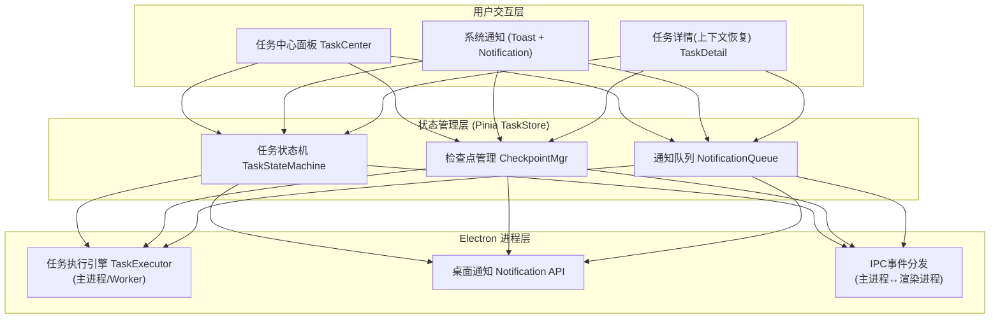

# 【月之暗面面经】桌面端长任务执行时，前端怎样做通知、回看和继续执行？

## 核心问题

桌面端 AI 产品的一个高频场景：用户发起一个文档分析任务（耗时 2-5 分钟），不可能盯着进度条死等。正确的产品体验应该是——**发起 → 用户离开做别的事 → 任务完成时系统通知 → 用户点通知回到原任务查看结果 → 如果失败，可以补充材料后继续跑**。

这要求前端构建一个完整的"离开—通知—回来—继续"闭环，涉及四个子系统：**任务中心**（统一管理所有任务状态）、**通知系统**（关键节点推送桌面通知）、**上下文恢复**（点通知回到原始任务的完整上下文）、**断点续传**（失败后从检查点恢复执行）。

核心设计原则：**长任务的核心是让用户可以离开再回来。** 任务的执行、状态、上下文必须独立于任何 UI 组件存活。

---

## 一、整体架构：四子系统协同

### 1.1 系统架构图



### 1.2 四子系统职责

| 子系统 | 职责 | 关键设计 |
|--------|------|---------|
| **任务中心** | 统一展示所有任务（进行中/已完成/失败），提供入口 | 不依赖任何页面组件，独立存活于 TaskStore |
| **通知系统** | 任务状态变更时推送桌面通知 | 只推关键节点（完成/失败/待确认），不打扰中间过程 |
| **上下文恢复** | 用户点通知/任务卡片 → 恢复原始上下文 | 序列化任务快照（prompt + 引用素材 + 中间产物） |
| **断点续传** | 失败后从检查点恢复，不从头跑 | 每步执行后存 checkpoint，恢复时从最近 checkpoint 继续 |

---

## 二、任务状态机设计

### 2.1 状态机流转图

```
                        ┌──────────┐
            创建任务 ──► │ pending  │ (排队等待)
                        └────┬─────┘
                             │ 调度执行
                             ▼
                   ┌──────────────┐
            ┌──────│   running    │◄──────────┐
            │      └──────┬───────┘           │
            │             │                   │
            │     ┌───────┼───────┐           │ 恢复执行
            │     ▼       ▼       ▼           │
            │  ┌──────┐ ┌────┐ ┌────────┐    │
            │  │paused│ │done│ │ failed │    │
            │  └──┬───┘ └────┘ └───┬────┘    │
            │     │                 │         │
            │   用户确认            用户补充材料 │
            │     │                 │ + 重试   │
            │     └────────┬────────┘         │
            │              ▼                   │
            │      ┌──────────────┐            │
            └─────►│  recovering  │────────────┘
                   │  (恢复检查点)  │
                   └──────────────┘
```

### 2.2 状态机 TypeScript 实现

```typescript
// types/task.ts

/** 任务状态 */
type TaskState =
  | 'pending'        // 排队中
  | 'running'        // 执行中
  | 'paused'         // 暂停（等待用户确认/输入）
  | 'completed'      // 成功完成
  | 'failed'         // 执行失败
  | 'cancelled'      // 用户取消
  | 'recovering'     // 断点恢复中

/** 合法状态转换映射 */
const VALID_TRANSITIONS: Record<TaskState, TaskState[]> = {
  pending:    ['running', 'cancelled'],
  running:    ['paused', 'completed', 'failed', 'cancelled'],
  paused:     ['running', 'cancelled'],
  completed:  [],                           // 终态
  failed:     ['recovering', 'cancelled'],
  cancelled:  [],                           // 终态
  recovering: ['running', 'failed'],
}

/** 任务检查点（断点续传核心） */
interface TaskCheckpoint {
  taskId: string
  stepIndex: number                    // 当前执行到第几步
  totalSteps: number                   // 总步数
  intermediateResults: string[]        // 各步中间产物（引用ID）
  contextSnapshot: ContextSnapshot     // 上下文快照
  savedAt: number
}

/** 上下文快照（用于恢复时重建引用关系） */
interface ContextSnapshot {
  prompt: string                       // 原始指令
  sourceIds: string[]                  // 引用的来源素材ID
  granularity: Record<string, 'summary' | 'fulltext'>  // 每个素材的引用粒度
  conversationHistory?: ChatMessage[]  // 对话历史（多轮任务）
}

/** 任务实体 */
interface LongTask {
  id: string
  type: 'doc_analysis' | 'image_gen' | 'code_gen' | 'data_extract'
  state: TaskState
  title: string
  prompt: string
  progress: number                     // 0-100
  currentStep?: string                 // 当前步骤描述（给用户看）
  checkpoint?: TaskCheckpoint          // 最近检查点
  result?: TaskResult                  // 完成后的产物
  error?: TaskError                    // 失败信息
  notificationSent: boolean            // 是否已发通知
  createdAt: number
  updatedAt: number
}

interface TaskError {
  code: string                         // 错误码（可分类处理）
  message: string                      // 用户可读信息
  retryable: boolean                   // 是否可重试
  failedAtStep: number                 // 在第几步失败
  suggestion?: string                  // 补救建议
}
```

### 2.3 状态机引擎（XState 风格）

```typescript
// services/task-state-machine.ts
import type { TaskState, LongTask } from '@/types/task'

export class TaskStateMachine {
  private task: LongTask

  constructor(task: LongTask) {
    this.task = task
  }

  /** 安全状态转换（校验合法性） */
  transition(to: TaskState): boolean {
    const allowed = VALID_TRANSITIONS[this.task.state]
    if (!allowed.includes(to)) {
      console.warn(`非法状态转换: ${this.task.state} → ${to}`)
      return false
    }
    this.task.state = to
    this.task.updatedAt = Date.now()
    return true
  }

  /** 判断是否应触发通知 */
  shouldNotify(): boolean {
    // 只在关键节点通知：完成、失败、暂停（需用户介入）
    const notifyStates: TaskState[] = ['completed', 'failed', 'paused']
    return notifyStates.includes(this.task.state) && !this.task.notificationSent
  }
}
```

---

## 三、通知系统实现

### 3.1 通知策略：分级通知

通知不是每次状态变化都弹——那会造成通知轰炸。原则是**只在用户需要行动时通知**：

| 场景 | 通知级别 | 通知方式 |
|------|---------|---------|
| 任务完成 | 结果通知 | 桌面通知 + 任务中心角标 |
| 任务失败 | 异常通知 | 桌面通知 + 震动/声音 |
| 需要用户确认 | 交互通知 | 桌面通知（带操作按钮） |
| 进度更新（50%/90%） | 静默更新 | 仅更新任务中心进度条，不弹通知 |
| 任务开始执行 | 不通知 | 仅任务中心状态变更 |

### 3.2 Electron 桌面通知 + 点击回看

```typescript
// services/notification.service.ts
import { ipcRenderer } from 'electron'

/** 通知类型 */
type NotificationType = 'completed' | 'failed' | 'action_required'

interface TaskNotification {
  type: NotificationType
  taskId: string
  title: string
  body: string
  actionLabel?: string       // 操作按钮文字（如"查看结果"/"补充材料"）
}

class NotificationService {
  private sentNotifications = new Set<string>()  // 去重

  /** 发送桌面通知（Electron Notification API） */
  async notify(notification: TaskNotification) {
    const key = `${notification.taskId}_${notification.type}`
    if (this.sentNotifications.has(key)) return  // 同一任务同一事件只通知一次
    this.sentNotifications.add(key)

    // 通过 IPC 调用主进程的系统通知
    ipcRenderer.send('show-notification', {
      title: notification.title,
      body: notification.body,
      // 关键：通知携带 taskId，点击后恢复任务上下文
      data: { taskId: notification.taskId, type: notification.type },
      actions: notification.actionLabel
        ? [{ type: 'button', text: notification.actionLabel }]
        : [],
      closeButtonText: '忽略'
    })
  }

  /** 根据任务状态生成通知内容 */
  buildNotification(task: LongTask): TaskNotification | null {
    switch (task.state) {
      case 'completed':
        return {
          type: 'completed',
          taskId: task.id,
          title: `✅ ${task.title} 已完成`,
          body: this.summarizeResult(task.result),
          actionLabel: '查看结果'
        }
      case 'failed':
        return {
          type: 'failed',
          taskId: task.id,
          title: `❌ ${task.title} 执行失败`,
          body: task.error?.message ?? '未知错误',
          actionLabel: task.error?.retryable ? '补充材料重试' : '查看详情'
        }
      case 'paused':
        return {
          type: 'action_required',
          taskId: task.id,
          title: `⏸️ ${task.title} 需要确认`,
          body: task.currentStep ?? '请返回任务确认',
          actionLabel: '去处理'
        }
      default:
        return null  // running/pending 不通知
    }
  }

  /** 结果摘要（通知不塞细节，只给一句话概要） */
  private summarizeResult(result?: TaskResult): string {
    if (!result) return '点击查看详细结果'
    if (result.type === 'text') return result.preview.slice(0, 100) + '...'
    if (result.type === 'image') return '已生成 1 张图片'
    if (result.type === 'file') return `已生成 ${result.fileCount} 个文件`
    return '点击查看结果'
  }
}
```

### 3.3 Electron 主进程：系统通知 + 点击回调

```typescript
// electron/main.ts (主进程)
import { Notification, ipcMain, BrowserWindow, shell } from 'electron'

ipcMain.on('show-notification', (_event, data) => {
  const notification = new Notification({
    title: data.title,
    body: data.body,
    actions: data.actions,         // macOS/Windows 操作按钮
    closeButtonText: data.closeButtonText,
  })

  // ★ 核心：点击通知 → 恢复任务上下文
  notification.on('click', () => {
    // 方案A：聚焦主窗口并发送导航指令
    const mainWindow = BrowserWindow.getAllWindows()[0]
    if (mainWindow) {
      if (mainWindow.isMinimized()) mainWindow.restore()
      mainWindow.focus()
      // 向渲染进程发送"打开任务详情"指令
      mainWindow.webContents.send('notification-clicked', {
        taskId: data.data.taskId,
        type: data.data.type
      })
    }
  })

  // 操作按钮点击（如"补充材料"）
  notification.on('action', (_e, index) => {
    const action = data.actions[index]
    const mainWindow = BrowserWindow.getAllWindows()[0]
    if (mainWindow) {
      mainWindow.focus()
      mainWindow.webContents.send('notification-action', {
        taskId: data.data.taskId,
        action: action.text
      })
    }
  })

  notification.show()
})
```

---

## 四、上下文恢复：点通知回到原任务

### 4.1 恢复流程

```
用户点击通知
    │
    ▼
主进程聚焦窗口 + IPC 发送 { taskId, action }
    │
    ▼
渲染进程路由到 /task/:taskId
    │
    ▼
TaskStore.loadTaskContext(taskId)
    │  ├── 恢复 prompt（原始指令）
    │  ├── 恢复 sourceIds（引用的素材）
    │  ├── 恢复 conversationHistory（对话历史）
    │  └── 恢复 intermediateResults（中间产物）
    │
    ▼
渲染 TaskDetail 组件 → 完整上下文重建
```

### 4.2 上下文恢复实现

```typescript
// stores/task.store.ts
import { defineStore } from 'pinia'
import { ref, computed } from 'vue'
import type { LongTask, TaskCheckpoint, ContextSnapshot } from '@/types/task'

export const useTaskStore = defineStore('task', () => {
  const tasks = ref<Map<string, LongTask>>(new Map())
  const currentTaskId = ref<string | null>(null)
  const restoredContext = ref<RestoredContext | null>(null)

  /** 当前查看的任务（含完整上下文） */
  const currentTask = computed(() => {
    if (!currentTaskId.value) return null
    return tasks.value.get(currentTaskId.value) ?? null
  })

  /** 进行中的任务数（角标） */
  const activeTaskCount = computed(() =>
    [...tasks.value.values()].filter(
      t => t.state === 'running' || t.state === 'pending'
    ).length
  )

  /** 需要注意的任务数（失败/待确认） */
  const attentionTaskCount = computed(() =>
    [...tasks.value.values()].filter(
      t => t.state === 'failed' || t.state === 'paused'
    ).length
  )

  /** ★ 核心：从通知点击恢复任务上下文 */
  async function loadTaskContext(taskId: string): Promise<void> {
    const task = tasks.value.get(taskId)
    if (!task) {
      // 任务不在内存 → 从持久化层恢复
      const persisted = await loadFromDB(taskId)
      if (!persisted) throw new Error('任务不存在')
      tasks.value.set(taskId, persisted)
    }

    currentTaskId.value = taskId

    // 从检查点恢复上下文快照
    const checkpoint = task.checkpoint
    if (checkpoint) {
      restoredContext.value = await restoreContext(checkpoint.contextSnapshot)
    }
  }

  /** 从快照重建上下文 */
  async function restoreContext(snapshot: ContextSnapshot): Promise<RestoredContext> {
    const sourceStore = useSourceStore()
    const extractionStore = useExtractionStore()

    // 按快照中的 sourceIds 重新加载素材
    const sources = snapshot.sourceIds.map(id => sourceStore.sources.get(id))
    // 按快照中的粒度设置恢复引用
    const references = snapshot.sourceIds.map(id => ({
      sourceId: id,
      granularity: snapshot.granularity[id] ?? 'summary'
    }))

    return {
      prompt: snapshot.prompt,
      sources: sources.filter(Boolean),
      references,
      conversationHistory: snapshot.conversationHistory ?? []
    }
  }

  /** 通知点击入口（从 IPC 接收） */
  function handleNotificationClick(taskId: string, type: string) {
    // 路由到任务详情页
    router.push(`/task/${taskId}`)
    loadTaskContext(taskId)
  }

  return {
    tasks, currentTaskId, currentTask, restoredContext,
    activeTaskCount, attentionTaskCount,
    loadTaskContext, handleNotificationClick
  }
})
```

---

## 五、断点续传：失败后从检查点恢复

### 5.1 检查点策略

长任务（如多步文档分析）拆分为多个步骤，每步执行后存检查点：

```
步骤1: 解析PDF        → checkpoint(stepIndex=1)
步骤2: OCR图片        → checkpoint(stepIndex=2)
步骤3: 提取表格       → checkpoint(stepIndex=3)
步骤4: LLM总结        → ❌ 失败
                         ↓
恢复时：从 stepIndex=3 继续，跳过已完成的步骤1-3
```

### 5.2 任务执行器（主进程）

```typescript
// electron/task-executor.ts (主进程)
import { ipcMain } from 'electron'

/** 任务执行步骤定义 */
interface TaskStep {
  index: number
  name: string
  execute: (input: any, checkpoint: TaskCheckpoint) => Promise<any>
}

/** 多步任务执行器（带断点续传） */
class TaskExecutor {
  private steps: TaskStep[]

  constructor(steps: TaskStep[]) {
    this.steps = steps
  }

  /** 执行任务（支持从检查点恢复） */
  async run(
    taskId: string,
    input: any,
    fromCheckpoint?: TaskCheckpoint
  ): Promise<void> {
    const startStep = fromCheckpoint?.stepIndex ?? 0

    // 从检查点恢复中间数据
    let currentInput = fromCheckpoint
      ? { ...input, ...this.restoreIntermediate(fromCheckpoint) }
      : input

    for (let i = startStep; i < this.steps.length; i++) {
      const step = this.steps[i]

      // 通知渲染进程：当前步骤 + 进度
      this.sendProgress(taskId, {
        step: step.name,
        progress: Math.round((i / this.steps.length) * 100),
        stepIndex: i
      })

      try {
        currentInput = await step.execute(currentInput, {
          taskId,
          stepIndex: i,
          totalSteps: this.steps.length,
          intermediateResults: [],
          contextSnapshot: {} as ContextSnapshot,
          savedAt: Date.now()
        })

        // ★ 每步成功后存检查点
        await this.saveCheckpoint(taskId, {
          taskId,
          stepIndex: i + 1,           // 下次从 i+1 开始
          totalSteps: this.steps.length,
          intermediateResults: this.extractRefs(currentInput),
          contextSnapshot: this.buildSnapshot(taskId),
          savedAt: Date.now()
        })

      } catch (error) {
        // 失败：记录失败步骤 + 通知渲染进程
        this.sendFailed(taskId, {
          code: 'STEP_FAILED',
          message: `步骤"${step.name}"执行失败: ${error.message}`,
          retryable: true,
          failedAtStep: i,
          suggestion: this.buildSuggestion(error, step)
        })
        return  // 停止执行，等待用户操作
      }
    }

    // 全部完成
    this.sendCompleted(taskId, currentInput)
  }

  /** 从检查点恢复中间数据 */
  private restoreIntermediate(checkpoint: TaskCheckpoint): any {
    // 从 IndexedDB/文件系统 恢复中间产物
    return checkpoint.intermediateResults.reduce((acc, refId) => {
      acc[refId] = loadFromStorage(refId)
      return acc
    }, {} as Record<string, any>)
  }

  private sendProgress(taskId: string, data: any) {
    const win = BrowserWindow.getAllWindows()[0]
    win?.webContents.send('task:progress', { taskId, ...data })
  }

  private sendFailed(taskId: string, error: any) {
    const win = BrowserWindow.getAllWindows()[0]
    win?.webContents.send('task:failed', { taskId, error })
  }

  private sendCompleted(taskId: string, result: any) {
    const win = BrowserWindow.getAllWindows()[0]
    win?.webContents.send('task:completed', { taskId, result })
  }
}
```

### 5.3 渲染进程：IPC 事件监听 + 状态更新

```typescript
// composables/useTaskEngine.ts
import { onMounted, onUnmounted } from 'vue'
import { ipcRenderer } from 'electron'

/** 任务引擎：监听主进程事件，更新 Store + 触发通知 */
export function useTaskEngine() {
  const taskStore = useTaskStore()
  const notificationService = new NotificationService()

  function onProgress(_e: any, { taskId, step, progress }: any) {
    const task = taskStore.tasks.get(taskId)
    if (task) {
      task.progress = progress
      task.currentStep = step
      // 进度更新不弹通知，只更新任务中心
    }
  }

  function onFailed(_e: any, { taskId, error }: any) {
    const task = taskStore.tasks.get(taskId)
    if (!task) return

    task.error = error
    task.state = 'failed'

    // ★ 触发通知
    const notif = notificationService.buildNotification(task)
    if (notif) notificationService.notify(notif)

    // 角标更新
    updateDockBadge(taskStore.attentionTaskCount)
  }

  function onCompleted(_e: any, { taskId, result }: any) {
    const task = taskStore.tasks.get(taskId)
    if (!task) return

    task.result = result
    task.state = 'completed'
    task.progress = 100

    // ★ 触发通知
    const notif = notificationService.buildNotification(task)
    if (notif) notificationService.notify(notif)
  }

  /** 用户点击"补充材料重试" */
  async function retryWithMaterials(taskId: string, newMaterials: string[]) {
    const task = taskStore.tasks.get(taskId)
    if (!task) return

    task.state = 'recovering'
    task.error = undefined

    // 从检查点恢复 + 补充新材料
    const checkpoint = task.checkpoint
    ipcRenderer.send('task:retry', {
      taskId,
      additionalMaterials: newMaterials,
      fromCheckpoint: checkpoint   // 断点续传
    })
  }

  // 生命周期绑定
  onMounted(() => {
    ipcRenderer.on('task:progress', onProgress)
    ipcRenderer.on('task:failed', onFailed)
    ipcRenderer.on('task:completed', onCompleted)
    ipcRenderer.on('notification-clicked', (_e, data) => {
      taskStore.handleNotificationClick(data.taskId, data.type)
    })
  })

  onUnmounted(() => {
    ipcRenderer.removeListener('task:progress', onProgress)
    ipcRenderer.removeListener('task:failed', onFailed)
    ipcRenderer.removeListener('task:completed', onCompleted)
  })

  return { retryWithMaterials }
}
```

---

## 六、任务中心面板（Vue 组件）

```vue
<!-- components/TaskCenter.vue -->
<script setup lang="ts">
import { useTaskStore } from '@/stores/task.store'
import { useTaskEngine } from '@/composables/useTaskEngine'

const taskStore = useTaskStore()
useTaskEngine()  // 绑定 IPC 事件监听

// 按状态分组
const runningTasks = computed(() =>
  taskStore.sortedTasks.filter(t => t.state === 'running' || t.state === 'pending')
)
const attentionTasks = computed(() =>
  taskStore.sortedTasks.filter(t => t.state === 'failed' || t.state === 'paused')
)
const completedTasks = computed(() =>
  taskStore.sortedTasks.filter(t => t.state === 'completed')
)

function openTask(taskId: string) {
  router.push(`/task/${taskId}`)
  taskStore.loadTaskContext(taskId)
}
</script>

<template>
  <div class="task-center">
    <!-- 需要注意的任务（置顶） -->
    <div v-if="attentionTasks.length" class="section attention">
      <h3>⚠️ 需要处理 ({{ attentionTasks.length }})</h3>
      <TaskCard
        v-for="task in attentionTasks" :key="task.id"
        :task="task"
        @click="openTask(task.id)"
        @retry="retryWithMaterials(task.id, $event)"
      />
    </div>

    <!-- 进行中 -->
    <div v-if="runningTasks.length" class="section">
      <h3>⏳ 进行中 ({{ runningTasks.length }})</h3>
      <TaskCard
        v-for="task in runningTasks" :key="task.id"
        :task="task"
        @click="openTask(task.id)"
      />
    </div>

    <!-- 已完成 -->
    <div v-if="completedTasks.length" class="section">
      <h3>✅ 已完成 ({{ completedTasks.length }})</h3>
      <TaskCard
        v-for="task in completedTasks" :key="task.id"
        :task="task"
        @click="openTask(task.id)"
      />
    </div>

    <!-- 空状态 -->
    <div v-if="!taskStore.sortedTasks.length" class="empty-state">
      暂无任务，在左侧输入框开始
    </div>
  </div>
</template>
```

---

## 七、面试高频追问点

### Q1: 任务中断后怎么恢复上下文？

**答：** 通过检查点机制。每个长任务拆成多个步骤，每步执行后存一个 `TaskCheckpoint`，包含 `stepIndex`（执行到第几步）、`intermediateResults`（中间产物引用）和 `contextSnapshot`（上下文快照：prompt + 引用素材ID + 粒度配置）。恢复时 `loadTaskContext(taskId)` 从检查点重建完整上下文——素材通过 ID 从 SourceStore 找回，不需要重新提取。

### Q2: 多个长任务并行怎么管理？

**答：** 任务中心面板按状态分组展示：**需要处理**（失败/待确认）置顶，**进行中**居中，**已完成**折叠。角标数字提示待处理数量。并发控制上，主进程的任务执行器维护一个队列（如最多 3 个并发），超出排队为 `pending`。用户可以在任务中心拖拽调整优先级。

### Q3: 任务进度条怎么设计才不焦虑？

**答：** 三个原则：(1) **分步进度优于百分比**——显示"步骤2/4: OCR识别中"比"52%"更安心；(2) **不确定性进度**——LLM 调用无法精确预估时，用不确定进度条（动画但不给数字）+ 当前步骤文字说明；(3) **静默更新**——进度变化只更新任务中心面板，不弹通知，避免通知轰炸。只在完成/失败时才通知用户。

### Q4: Electron 关闭应用后任务还在跑吗？

**答：** 取决于架构选择。如果任务执行在**主进程**中，关闭窗口不退出应用（如托盘驻留模式），任务继续跑。如果应用完全退出，任务状态已持久化到 SQLite，重启后从检查点恢复——用户打开应用时弹"检测到未完成的任务，是否继续？"。这也是断点续传的核心价值：**不丢已经完成的工作**。

---

## 八、实战经验

1. **通知克制是关键 UX**。桌面通知泛滥是用户卸载应用的第一大原因。原则：只通知"需要用户行动"的事件（完成查看、失败处理、确认操作），中间进度走静默更新。面试中强调"通知不是状态变更的映射，而是用户行动的触发器"。

2. **检查点的粒度决定恢复体验**。检查点太粗（只在任务开始存）→ 失败后必须从头跑；太细（每行代码存）→ IO 开销过大。实践中每完成一个语义步骤（如"PDF解析完成"、"OCR完成"）存一次检查点，是最佳平衡点。

3. **上下文恢复 ≠ 重新渲染页面**。恢复上下文不是简单地跳回之前的 URL，而是要重建**完整的工作状态**：原始 prompt、引用的素材（按原始粒度）、对话历史、中间产物。这些信息必须在任务创建时就序列化进检查点，而不是事后再拼凑。

4. **"离开—通知—回来—继续"是桌面 AI 的核心体验差异**。Web 端 AI 产品受限于浏览器标签页，用户切走就失联。桌面端通过系统通知 + 任务中心 + 检查点续传，让用户可以自由切换上下文而不丢失工作进度——这是桌面端 AI 产品的护城河。

## 记忆要点

- 核心目标：长任务执行时，必须让用户能放心离开再无缝回来
- 四子系统协同：任务中心(看全局)、通知系统(知节点)、上下文恢复(回现场)、断点续传(接着跑)
- 状态独立：任务状态与上下文必须脱离UI组件，存活于独立Store中


## 苏格拉底式面试追问

> 这组追问模拟面试官层层逼问，每一问先回答"为什么"，再回答"怎么做"，最后回答"如何证明"。

### 第一层：目标与动机

**Q：长任务你做"通知 + 回看 + 继续执行"闭环，但 Web 端 AI（如 ChatGPT）的长任务（如生成长文）只是页面内等待，为什么桌面端必须做这个闭环？**

Web 端的长任务是"同步等待型"——用户盯着页面，任务跑完页面刷新结果，关页面任务中断（或服务端继续但用户不知道）。桌面端的场景不同：一、任务更长——AI Agent 任务（分析文档、生成站点）可能 5-10 分钟，用户不可能干等；二、可后台执行——桌面端进程持续运行（不像 Web 关标签页就断），任务能在后台跑；三、多任务并行——用户可能同时发起多个任务，需要统一管理。所以桌面端必须支持"离开—通知—回来"，让用户发起任务后做别的事，完成时通知，点通知回到原任务现场。本质是"异步任务管理"而非"同步等待"，借鉴 IDE 的后台编译（编译时用户继续写代码，完成通知）。

### 第二层：证据与定位

**Q：用户说"点通知没回到正确的任务"，你怎么定位是通知参数 bug 还是上下文恢复 bug？**

通知点击后的链路：点击通知 → Electron notification 的 click 事件携带 taskId → 路由跳转到任务页 → 根据 taskId 恢复上下文。定位分段：一、通知参数——日志看 click 事件收到的 taskId 是否正确（如果错了，是通知构造时 taskId 绑错）；二、路由跳转——看 URL 是否正确（如 /task/:taskId），如果 URL 对但页面显示错，是恢复逻辑 bug；三、上下文恢复——任务页根据 taskId 从 store 加载任务数据，看 store 里有没有该 taskId（如果没有，是任务状态没持久化或被清理）。常见根因：通知构造时用了旧 taskId（任务重生成后 id 变了，通知还是旧的）。

### 第三层：根因深挖

**Q：任务失败后你支持"补充材料继续跑"，但"继续"是从头跑还是从断点跑，怎么决策？**

从头 vs 断点取决于任务的"幂等性"和"检查点"。一、幂等任务（如分析文档生成摘要）——从头跑没成本（结果一样），断点恢复复杂（要存中间状态），从头跑更简单；二、非幂等任务（如爬取网页生成站点，已爬的页面不应重复）——从头跑浪费（重新爬），断点跑省时，但要存检查点（已爬 URL 列表）。决策依据：任务耗时和检查点成本。短任务（< 1 分钟）从头跑，用户等待可接受；长任务（> 5 分钟）必须断点跑，否则重跑成本高。技术实现：断点跑需要任务执行时定期存检查点（如每步完成存 checkpoint 到磁盘），恢复时加载检查点从上次位置继续。

**Q：那为什么不所有任务都做断点续传，保证不浪费？**

断点续传的实现成本高：一、检查点设计——每个任务步骤要设计可序列化的检查点（什么状态足够恢复？中间产物存哪？），不同任务逻辑不同，通用性差；二、一致性——检查点存到一半任务崩了，恢复时状态不一致（如存了"已完成步骤 3"但步骤 3 的产物没存完），需要事务保证；三、存储管理——检查点占用磁盘，任务完成后要清理，否则泄漏。所以断点续传要"按需"：长任务（分钟级以上）和高价值任务（重跑成本高）做断点，短任务从头跑。这类似数据库的 WAL（Write-Ahead Log）——不是所有操作都记 WAL，只对关键操作记，权衡一致性和性能。

### 第四层：方案权衡

**Q：通知你用 Electron 的 Notification API（系统通知），但为什么不直接在应用内做通知中心（如侧栏红点 + Toast）？**

系统通知 vs 应用内通知各有优劣：系统通知优势是"应用最小化也能看到"（桌面右上角弹通知，用户不用切回应用）、符合用户习惯（和其他 App 通知一致）；劣势是"易被忽略"（用户通知疲劳，无脑划掉）、不可定制 UI（只能标题+正文）。应用内通知优势是"UI 可控"（可加按钮"查看"/"重跑"）、不会被忽略（用户在应用内一定能看到）；劣势是"应用最小化时看不到"。所以两者互补：关键结果（任务完成、失败）用系统通知（确保用户看到），辅助操作（如"产物已更新"）用应用内通知。最佳实践：系统通知 + 点击跳转应用内通知中心（应用内通知中心是完整列表，系统通知是实时推送）。

**Q：为什么不所有任务完成都发系统通知，让用户实时知道？**

通知疲劳。如果每个任务完成都弹系统通知，用户发起 10 个任务就收 10 条通知，麻木后会无脑忽略，重要通知（如失败需补充材料）也被错过。所以要分级：一、成功任务——不弹系统通知（应用内通知中心记录即可，用户回来时看到），除非是"用户明确等待的关键任务"（如用户盯着生成站点）；二、失败任务——弹系统通知（需要用户介入，如补充材料）；三、部分完成——弹系统通知（如"10 个子任务完成了 5 个，可先看结果"）。分级原则："需要用户决策的发系统通知，纯信息记录的用应用内通知"，避免通知疲劳。

### 第五层：验证与沉淀

**Q：你怎么验证"通知-回看-继续"闭环真的提升了用户体验？**

核心指标是"任务完成率"和"用户回看率"。一、任务完成率——发起的任务中，用户最终看到结果的比例（闭环做得好，完成率应高，因为用户不会"忘了任务"）；二、回看率——任务完成后，用户点通知或去任务中心查看结果的比例（应高，说明通知有效）；三、续跑率——失败任务中用户选择"补充材料继续"而非放弃的比例（应高，说明续跑设计降低了挫败感）；四、时间指标——从任务完成到用户查看的延迟（应短，说明通知及时）。A/B 测试：有通知闭环 vs 无（只页面内等待），对比指标。

**Q：这道题沉淀出什么可复用的长任务 UX 设计经验？**

四条原则：一、异步优先——长任务支持后台执行，用户可离开，完成时通知（系统通知 + 应用内通知中心）；二、上下文恢复——通知携带 taskId，点击回到任务完整现场（输入、中间产物、进度）；三、断点续传按需——长任务和高价值任务做检查点，短任务从头跑；四、通知分级——需用户决策的（失败、需补充）发系统通知，纯信息的用应用内通知，避免疲劳。核心洞察："长任务 UX 本质是'异步任务管理'，借鉴 IDE 后台编译/构建工具——用户继续干活，完成通知，失败可重试，而非 Web 的同步等待。"


## 结构化回答

**30 秒电梯演讲：** 任务中心统一管理进行中/待确认/已完成，系统通知只提示关键结果，用户点回通知能回到原任务和上下文。打个比方，就像快递App——下单后不是盯着页面等，而是收到通知'已到驿站'，点进去查看包裹，有问题可以补充信息重新投递。

**展开框架：**
1. **核心目标** — 长任务执行时，必须让用户能放心离开再无缝回来
2. **四子系统协同** — 任务中心(看全局)、通知系统(知节点)、上下文恢复(回现场)、断点续传(接着跑)
3. **状态独立** — 任务状态与上下文必须脱离UI组件，存活于独立Store中

**收尾：** 这块我踩过坑——要不要深入聊：任务中断后怎么恢复上下文？

## 视频脚本

> 预计时长：3 分钟 | 由浅入深

| 时间 | 画面/字幕 | 口播台词 | 讲解要点 |
|------|----------|----------|----------|
| 0:00 | 标题卡 | "AI-Native桌面一句话：任务中心统一管理进行中/待确认/已完成，系统通知只提示关键结果，用户点回通知能回到原任务和上下文。" | 开场钩子 |
| 0:15 | 架构示意图 | "核心目标：长任务执行时，必须让用户能放心离开再无缝回来" | 核心目标 |
| 1:06 | 架构示意图分步演示 | "四子系统协同：任务中心(看全局)、通知系统(知节点)、上下文恢复(回现场)、断点续传(接着跑)" | 四子系统协同 |
| 1:57 | 关键代码/伪代码片段 | "状态独立：任务状态与上下文必须脱离UI组件，存活于独立Store中" | 状态独立 |
| 2:50 | 总结卡 | "核心抓住这条主线，下期咱们接着聊：任务中断后怎么恢复上下文。" | 收尾 |
