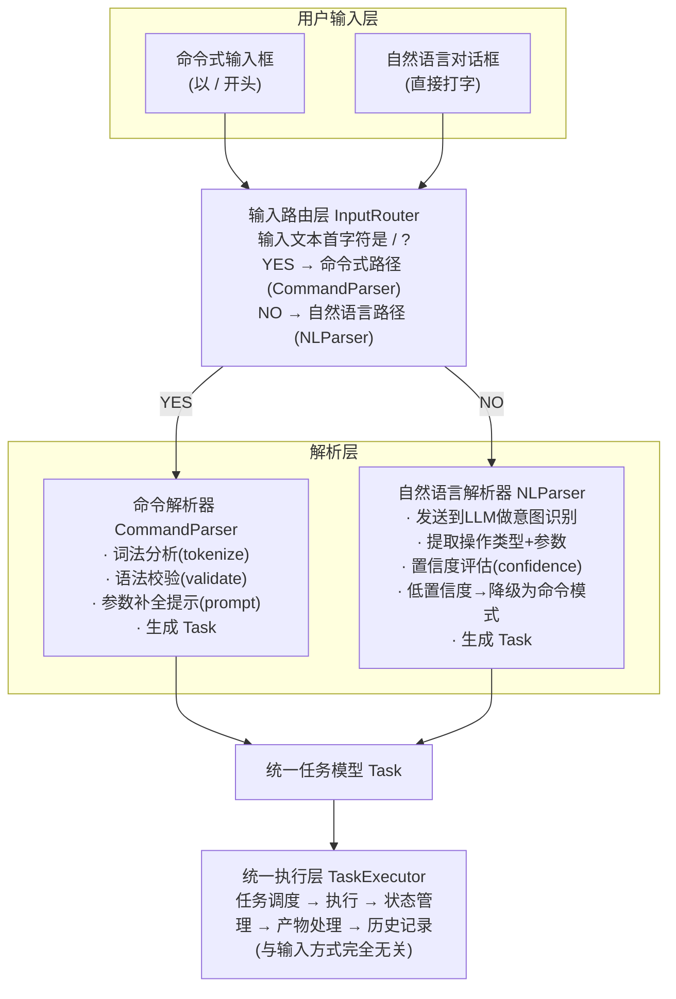

# 【月之暗面面经】如果产品要支持命令式输入和自然语言输入并存，前端会怎么做？

## 核心问题

桌面端 AI 产品面临一个用户分层问题：**新手用户**更喜欢用自然语言（"帮我把这个 PDF 里的表格提取出来做成 Excel"），而**老手用户**更偏好命令式输入（`/extract --source=file.pdf --format=xlsx`），追求精确、高效和可复现。

两类输入看似完全不同，但本质上都代表同一个意图——**用户想让 AI 执行一个任务**。因此核心设计思路是：**输入方式是多面，任务执行是核心**。将两类输入通过各自的解析层，统一映射到同一个 `Task` 模型，再走同一条执行路径。

这种设计的核心优势：

1. **输入层解耦**：新增第三种输入方式（如语音、拖拽）只需新增解析器，不影响执行层
2. **执行层统一**：无论输入方式如何，任务调度、状态管理、产物处理完全一致
3. **历史可回放**：无论用哪种方式发起的任务，历史记录中都可以看到统一格式，且支持两种方式重新触发

---

## 一、双模输入架构总览

### 1.1 架构分层图



### 1.2 核心设计原则

| 原则 | 说明 |
|------|------|
| **统一 Task 模型** | 无论哪种输入，最终都生成同一结构的 Task 对象 |
| **差异化解析** | 命令式走本地词法/语法分析（快、精确），自然语言走 LLM 意图识别（灵活、智能） |
| **降级机制** | 自然语言解析置信度低时，自动降级为命令模式让用户确认 |
| **双向互通** | 命令式任务在历史记录中可展开为自然语言描述；自然语言任务也可显示等价命令 |

---

## 二、统一任务模型

### 2.1 Task 接口定义

```typescript
// types/task.ts

/** 统一任务模型——命令式和自然语言最终都映射到这个结构 */
interface Task {
  id: string
  // —— 意图层（两种输入共享）——
  action: TaskAction            // 操作类型（extract / summarize / translate / generate ...）
  params: TaskParams            // 操作参数（来源、格式、选项等）

  // —— 输入溯源（区分来源）——
  inputMode: 'command' | 'natural'
  rawInput: string              // 原始输入文本（用于历史回放和审计）
  parsedConfidence?: number     // 解析置信度（仅自然语言有，0-1）

  // —— 执行层（统一）——
  state: TaskState              // pending / running / completed / failed
  result?: TaskResult
  createdAt: number
  updatedAt: number
}

/** 操作类型枚举——命令式和自然语言解析的公共目标 */
type TaskAction =
  | 'extract'       // 提取（表格/图片/文本）
  | 'summarize'     // 总结
  | 'translate'     // 翻译
  | 'generate'      // 生成
  | 'analyze'       // 分析
  | 'convert'       // 格式转换
  | 'compare'       // 对比

/** 任务参数——命令式直接填充，自然语言由LLM提取 */
interface TaskParams {
  source?: string[]             // 来源文件/URL
  target?: string               // 目标格式/语言
  options?: Record<string, unknown>  // 额外选项
  scope?: 'all' | 'page' | 'range'   // 处理范围
}
```

### 2.2 命令注册表

命令式输入需要一个**命令注册表**来定义合法命令、参数 schema 和补全规则：

```typescript
// config/command-registry.ts

interface CommandSpec {
  name: string                       // 命令名（不含/）
  alias?: string[]                   // 别名
  description: string                // 描述（补全提示用）
  action: TaskAction                 // 映射的任务操作
  params: CommandParamSpec[]         // 参数定义
  examples: string[]                 // 示例
}

interface CommandParamSpec {
  name: string                       // 参数名
  flag: string                       // 命令行flag（如 --source）
  shorthand?: string                 // 短flag（如 -s）
  type: 'string' | 'number' | 'boolean' | 'file'
  required: boolean
  default?: unknown
  description: string
  enumValues?: string[]              // 可选值（下拉补全用）
}

/** 全局命令注册表 */
const COMMAND_REGISTRY: CommandSpec[] = [
  {
    name: 'extract',
    alias: ['ext'],
    description: '从文档中提取表格、图片或文本',
    action: 'extract',
    params: [
      { name: 'source', flag: '--source', shorthand: '-s', type: 'file',
        required: true, description: '来源文件路径' },
      { name: 'format', flag: '--format', shorthand: '-f', type: 'string',
        required: false, default: 'xlsx',
        enumValues: ['xlsx', 'csv', 'json'],
        description: '输出格式' },
      { name: 'scope', flag: '--scope', type: 'string',
        required: false, default: 'all',
        enumValues: ['all', 'page', 'range'],
        description: '提取范围' }
    ],
    examples: ['/extract --source report.pdf --format xlsx']
  },
  {
    name: 'summarize',
    alias: ['sum'],
    description: '总结文档内容',
    action: 'summarize',
    params: [
      { name: 'source', flag: '--source', shorthand: '-s', type: 'file',
        required: true, description: '来源文件' },
      { name: 'length', flag: '--length', shorthand: '-l', type: 'string',
        required: false, default: 'medium',
        enumValues: ['short', 'medium', 'long'],
        description: '总结长度' }
    ],
    examples: ['/summarize --source report.pdf --length short']
  }
]

/** 查找命令（支持别名） */
function findCommand(name: string): CommandSpec | undefined {
  return COMMAND_REGISTRY.find(
    cmd => cmd.name === name || cmd.alias?.includes(name)
  )
}
```

---

## 三、命令式解析器（CommandParser）

### 3.1 解析流程

```
/extract --source report.pdf --format xlsx --scope page
   │
   ▼
步骤1: 词法分析 → tokenize
  [
    { type: 'command', value: 'extract' },
    { type: 'flag',    value: '--source' },
    { type: 'value',   value: 'report.pdf' },
    { type: 'flag',    value: '--format' },
    { type: 'value',   value: 'xlsx' },
    { type: 'flag',    value: '--scope' },
    { type: 'value',   value: 'page' }
  ]
   │
   ▼
步骤2: 查命令注册表 → 找到 extract 的 CommandSpec
   │
   ▼
步骤3: 语法校验 → 必填参数是否齐全？类型是否正确？
  · source: ✅ report.pdf (file类型)
  · format: ✅ xlsx (在 enumValues 中)
  · scope:  ✅ page (在 enumValues 中)
   │
   ▼
步骤4: 映射到 Task
  {
    action: 'extract',
    params: { source: ['report.pdf'], target: 'xlsx', scope: 'page' },
    inputMode: 'command',
    rawInput: '/extract --source report.pdf --format xlsx --scope page'
  }
```

### 3.2 CommandParser 实现

```typescript
// services/command-parser.ts

import { findCommand, CommandSpec, CommandParamSpec } from '@/config/command-registry'
import type { Task, TaskAction, TaskParams } from '@/types/task'

interface Token {
  type: 'command' | 'flag' | 'value'
  value: string
}

interface ParseResult {
  ok: boolean
  task?: Partial<Task>
  errors?: ParseError[]
  missingParams?: CommandParamSpec[]   // 缺失的必填参数（用于补全提示）
}

interface ParseError {
  param: string
  message: string
}

export class CommandParser {
  /** 主解析入口 */
  parse(input: string): ParseResult {
    // 1. 词法分析
    const tokens = this.tokenize(input)

    // 2. 第一个token必须是命令名
    const cmdToken = tokens[0]
    if (!cmdToken || cmdToken.type !== 'command') {
      return { ok: false, errors: [{ param: '', message: '无效的命令格式' }] }
    }

    // 3. 查注册表
    const spec = findCommand(cmdToken.value)
    if (!spec) {
      return {
        ok: false,
        errors: [{ param: '', message: `未知命令: /${cmdToken.value}` }]
      }
    }

    // 4. 解析参数
    const { params, errors, missingParams } = this.parseParams(tokens.slice(1), spec)

    // 5. 校验必填参数
    const missing = spec.params.filter(p =>
      p.required && !(p.name in params)
    )

    if (missing.length > 0) {
      return {
        ok: false,
        missingParams: missing,
        errors: missing.map(p => ({
          param: p.name,
          message: `缺少必填参数: ${p.flag} (${p.description})`
        }))
      }
    }

    if (errors.length > 0) {
      return { ok: false, errors }
    }

    // 6. 填充默认值
    for (const paramSpec of spec.params) {
      if (!(paramSpec.name in params) && paramSpec.default !== undefined) {
        params[paramSpec.name] = paramSpec.default
      }
    }

    // 7. 映射到统一 Task
    return {
      ok: true,
      task: {
        action: spec.action,
        params: this.normalizeParams(params, spec),
        inputMode: 'command',
        rawInput: input,
      }
    }
  }

  /** 词法分析 */
  private tokenize(input: string): Token[] {
    const tokens: Token[] = []
    // 去掉开头的 /
    const text = input.startsWith('/') ? input.slice(1) : input
    // 按空格分割，支持引号包裹的值
    const parts = this.smartSplit(text)

    parts.forEach((part, i) => {
      if (i === 0) {
        tokens.push({ type: 'command', value: part })
      } else if (part.startsWith('--') || part.startsWith('-')) {
        tokens.push({ type: 'flag', value: part })
      } else {
        tokens.push({ type: 'value', value: part })
      }
    })

    return tokens
  }

  /** 智能分割（支持引号包裹的带空格参数值） */
  private smartSplit(text: string): string[] {
    const result: string[] = []
    let current = ''
    let inQuotes = false

    for (let i = 0; i < text.length; i++) {
      const char = text[i]
      if (char === '"') {
        inQuotes = !inQuotes
      } else if (char === ' ' && !inQuotes) {
        if (current) result.push(current)
        current = ''
      } else {
        current += char
      }
    }
    if (current) result.push(current)
    return result
  }

  /** 解析 flag → value 映射 */
  private parseParams(
    tokens: Token[],
    spec: CommandSpec
  ): { params: Record<string, unknown>; errors: ParseError[]; missingParams: CommandParamSpec[] } {
    const params: Record<string, unknown> = {}
    const errors: ParseError[] = []

    // 建立 flag → paramSpec 的索引
    const flagIndex = new Map<string, CommandParamSpec>()
    for (const p of spec.params) {
      flagIndex.set(p.flag, p)
      if (p.shorthand) flagIndex.set(p.shorthand, p)
    }

    let i = 0
    while (i < tokens.length) {
      const token = tokens[i]
      if (token.type === 'flag') {
        const paramSpec = flagIndex.get(token.value)
        if (!paramSpec) {
          errors.push({ param: token.value, message: `未知参数: ${token.value}` })
          i++
          continue
        }
        // 下一个 token 是值
        const valueToken = tokens[i + 1]
        if (valueToken && valueToken.type === 'value') {
          // 类型校验
          const validated = this.validateValue(valueToken.value, paramSpec)
          if (validated.ok) {
            params[paramSpec.name] = validated.value
          } else {
            errors.push({ param: paramSpec.name, message: validated.error! })
          }
          i += 2
        } else if (paramSpec.type === 'boolean') {
          params[paramSpec.name] = true
          i++
        } else {
          errors.push({ param: paramSpec.name, message: `参数 ${paramSpec.flag} 缺少值` })
          i++
        }
      } else {
        i++
      }
    }

    return { params, errors, missingParams: [] }
  }

  /** 值类型校验 */
  private validateValue(
    raw: string,
    spec: CommandParamSpec
  ): { ok: boolean; value?: unknown; error?: string } {
    // enum 校验
    if (spec.enumValues && !spec.enumValues.includes(raw)) {
      return {
        ok: false,
        error: `无效值: ${raw}，可选: ${spec.enumValues.join(', ')}`
      }
    }
    // 类型转换
    switch (spec.type) {
      case 'number':
        const num = Number(raw)
        if (isNaN(num)) return { ok: false, error: `${raw} 不是有效数字` }
        return { ok: true, value: num }
      case 'boolean':
        return { ok: true, value: raw === 'true' }
      default:
        return { ok: true, value: raw }
    }
  }

  /** 将解析后的参数规范化为 TaskParams */
  private normalizeParams(
    params: Record<string, unknown>,
    spec: CommandSpec
  ): TaskParams {
    const sourceParam = spec.params.find(p => p.name === 'source')
    const result: TaskParams = {}

    if (sourceParam && params[sourceParam.name]) {
      const val = params[sourceParam.name]
      result.source = Array.isArray(val) ? val : [String(val)]
    }
    if ('format' in params || 'target' in params) {
      result.target = String(params.format ?? params.target)
    }
    if ('scope' in params) result.scope = params.scope as TaskParams['scope']

    // 其余参数放入 options
    const knownKeys = new Set(['source', 'format', 'target', 'scope'])
    result.options = {}
    for (const [k, v] of Object.entries(params)) {
      if (!knownKeys.has(k)) result.options[k] = v
    }

    return result
  }
}
```

---

## 四、自然语言解析器（NLParser）

### 4.1 解析流程

```
"帮我把 report.pdf 里的表格提取出来，做成 Excel 格式，只要第3页的"
   │
   ▼
发送到 LLM（意图识别 + 参数提取 Prompt）
   │
   ▼
LLM 返回结构化结果:
  {
    "action": "extract",
    "params": {
      "source": ["report.pdf"],
      "target": "xlsx",
      "scope": "page",
      "options": { "pageNumber": 3 }
    },
    "confidence": 0.92
  }
   │
   ▼
置信度评估:
  · confidence >= 0.85 → 直接生成 Task，执行
  · 0.6 <= confidence < 0.85 → 生成 Task 但要求用户确认（展示解析结果）
  · confidence < 0.6 → 降级：建议用户用命令模式重试
   │
   ▼
映射到 Task (与命令式完全相同的结构)
```

### 4.2 NLParser 实现

```typescript
// services/nl-parser.ts

import type { Task, TaskAction, TaskParams } from '@/types/task'

interface NLParseResult {
  ok: boolean
  task?: Partial<Task>
  confidence: number
  errors?: string[]
  degraded?: boolean         // 是否降级
  suggestion?: string        // 降级时的命令建议
}

/** LLM 返回的意图识别结果 */
interface IntentRecognition {
  action: string
  params: Record<string, unknown>
  confidence: number
  reasoning?: string
}

export class NLParser {
  private llmEndpoint: string

  constructor(llmEndpoint: string) {
    this.llmEndpoint = llmEndpoint
  }

  async parse(input: string): Promise<NLParseResult> {
    // 1. 调用 LLM 做意图识别
    const intent = await this.recognizeIntent(input)

    // 2. 置信度评估 → 决定后续行为
    if (intent.confidence < 0.6) {
      // 低置信度 → 降级为命令模式建议
      return {
        ok: false,
        confidence: intent.confidence,
        degraded: true,
        suggestion: this.buildCommandSuggestion(intent, input),
        errors: ['无法准确理解您的意图，建议使用命令模式']
      }
    }

    // 3. 映射到统一 Task
    const task: Partial<Task> = {
      action: intent.action as TaskAction,
      params: this.normalizeParams(intent.params),
      inputMode: 'natural',
      rawInput: input,
      parsedConfidence: intent.confidence
    }

    return {
      ok: true,
      confidence: intent.confidence,
      task
    }
  }

  /** 调用 LLM 做意图识别 */
  private async recognizeIntent(input: string): Promise<IntentRecognition> {
    const systemPrompt = `你是一个桌面AI助手的意图识别模块。
用户会用自然语言描述需求，你需要将其解析为结构化任务。

可用的操作类型(action):
- extract: 从文档提取数据(表格/图片/文本)
- summarize: 总结文档
- translate: 翻译文本
- generate: 生成内容
- analyze: 分析数据
- convert: 格式转换

返回 JSON 格式:
{
  "action": "操作类型",
  "params": { "source": [], "target": "", "scope": "", "options": {} },
  "confidence": 0.0-1.0,
  "reasoning": "简短推理过程"
}`

    const response = await fetch(this.llmEndpoint, {
      method: 'POST',
      headers: { 'Content-Type': 'application/json' },
      body: JSON.stringify({
        messages: [
          { role: 'system', content: systemPrompt },
          { role: 'user', content: input }
        ],
        temperature: 0.1   // 低温度保证确定性
      })
    })

    const data = await response.json()
    const content = data.choices[0].message.content
    return JSON.parse(content)
  }

  /** 生成等价命令（降级建议 + 历史记录双向映射） */
  buildCommandSuggestion(intent: IntentRecognition, originalInput: string): string {
    const parts: string[] = [`/${intent.action}`]
    const params = intent.params

    if (params.source) {
      const sources = Array.isArray(params.source) ? params.source : [params.source]
      parts.push(`--source "${sources.join(',')}"`)
    }
    if (params.target) parts.push(`--format ${params.target}`)
    if (params.scope) parts.push(`--scope ${params.scope}`)

    return parts.join(' ')
  }

  /** 参数规范化 */
  private normalizeParams(params: Record<string, unknown>): TaskParams {
    const result: TaskParams = {}
    if (params.source) {
      result.source = Array.isArray(params.source)
        ? params.source as string[]
        : [String(params.source)]
    }
    if (params.target) result.target = String(params.target)
    if (params.scope) result.scope = params.scope as TaskParams['scope']
    if (params.options) result.options = params.options as Record<string, unknown>
    return result
  }
}
```

---

## 五、输入路由层：统一入口

### 5.1 InputRouter 实现

```typescript
// services/input-router.ts

import { CommandParser } from './command-parser'
import { NLParser } from './nl-parser'
import type { Task } from '@/types/task'

export class InputRouter {
  private commandParser: CommandParser
  private nlParser: NLParser
  private onTaskCreated: (task: Task) => void
  private onError: (error: InputError) => void
  private onMissingParams: (cmdName: string, missing: string[]) => void

  constructor(deps: {
    commandParser: CommandParser
    nlParser: NLParser
    onTaskCreated: (task: Task) => void
    onError: (error: InputError) => void
    onMissingParams: (cmdName: string, missing: string[]) => void
  }) {
    Object.assign(this, deps)
  }

  /** 统一入口 */
  async route(input: string): Promise<void> {
    // ★ 核心路由逻辑：首字符是 / → 命令式，否则 → 自然语言
    if (input.trim().startsWith('/')) {
      await this.routeCommand(input)
    } else {
      await this.routeNatural(input)
    }
  }

  /** 命令式路径 */
  private async routeCommand(input: string): Promise<void> {
    const result = this.commandParser.parse(input)

    if (!result.ok) {
      if (result.missingParams && result.missingParams.length > 0) {
        // 参数缺失 → 就地补全提示
        this.onMissingParams(
          input.split(' ')[0].slice(1),
          result.missingParams.map(p => p.name)
        )
      } else {
        this.onError({ message: result.errors![0].message, input })
      }
      return
    }

    // 生成完整 Task 并交给执行层
    const task = this.createTask(result.task!)
    this.onTaskCreated(task)
  }

  /** 自然语言路径 */
  private async routeNatural(input: string): Promise<void> {
    const result = await this.nlParser.parse(input)

    if (result.degraded) {
      // 降级：展示等价命令，建议用户用命令模式
      this.onError({
        message: `未能准确理解意图。建议使用命令: \n${result.suggestion}`,
        input,
        degraded: true,
        suggestion: result.suggestion
      })
      return
    }

    if (!result.ok) {
      this.onError({ message: result.errors![0], input })
      return
    }

    // 中等置信度 → 要求用户确认
    if (result.confidence < 0.85) {
      this.onError({
        message: `请确认理解是否正确: ${result.task?.action}`,
        input,
        needsConfirm: true,
        parsedTask: result.task
      })
      return
    }

    const task = this.createTask(result.task!)
    this.onTaskCreated(task)
  }

  /** 创建完整 Task（补充系统字段） */
  private createTask(partial: Partial<Task>): Task {
    return {
      id: crypto.randomUUID(),
      action: partial.action!,
      params: partial.params!,
      inputMode: partial.inputMode!,
      rawInput: partial.rawInput!,
      parsedConfidence: partial.parsedConfidence,
      state: 'pending',
      createdAt: Date.now(),
      updatedAt: Date.now()
    } as Task
  }
}

interface InputError {
  message: string
  input: string
  degraded?: boolean
  suggestion?: string
  needsConfirm?: boolean
  parsedTask?: Partial<Task>
}
```

---

## 六、Vue 组件实现

### 6.1 双模输入框组件

```vue
<!-- components/DualModeInput.vue -->
<script setup lang="ts">
import { ref, computed, watch, onMounted, onUnmounted } from 'vue'
import { InputRouter } from '@/services/input-router'
import { CommandParser } from '@/services/command-parser'
import { NLParser } from '@/services/nl-parser'
import { useTaskStore } from '@/stores/task.store'
import { COMMAND_REGISTRY } from '@/config/command-registry'
import type { CommandSpec } from '@/config/command-registry'

const props = defineProps<{
  placeholder?: string
}>()

const emit = defineEmits<{
  taskCreated: [taskId: string]
}>()

const taskStore = useTaskStore()

// —— 响应式状态 ——
const inputValue = ref('')
const showCommandList = ref(false)      // 命令补全面板
const showParamHint = ref(false)        // 参数补全提示
const paramHintMessage = ref('')
const errorMessage = ref('')
const confirmDialog = ref<{ visible: boolean; task?: Partial<Task> }>({
  visible: false
})
const isProcessing = ref(false)

// —— 输入模式检测 ——
const isCommandMode = computed(() => inputValue.value.trim().startsWith('/'))

const inputPlaceholder = computed(() =>
  props.placeholder ?? '输入指令（以 / 开头使用命令模式）或直接描述需求...'
)

// —— 命令补全 ——
const matchedCommands = computed<CommandSpec[]>(() => {
  if (!isCommandMode.value) return []
  const query = inputValue.value.trim().slice(1)  // 去掉 /
  if (!query) return COMMAND_REGISTRY
  return COMMAND_REGISTRY.filter(cmd =>
    cmd.name.startsWith(query) || cmd.alias?.some(a => a.startsWith(query))
  )
})

const selectedCommandIndex = ref(0)

// —— 初始化 InputRouter ——
let router: InputRouter

onMounted(() => {
  const commandParser = new CommandParser()
  const nlParser = new NLParser('/api/llm/chat')

  router = new InputRouter({
    commandParser,
    nlParser,
    onTaskCreated: (task) => {
      taskStore.addTask(task)
      emit('taskCreated', task.id)
      inputValue.value = ''
    },
    onError: (error) => {
      if (error.needsConfirm && error.parsedTask) {
        confirmDialog.value = { visible: true, task: error.parsedTask }
      } else if (error.degraded) {
        errorMessage.value = error.message
        // 如果有等价命令建议，填充到输入框
        if (error.suggestion) {
          // 用户可以按 Tab 接受建议
        }
      } else {
        errorMessage.value = error.message
      }
    },
    onMissingParams: (cmdName, missing) => {
      paramHintMessage.value = `/${cmdName} 缺少参数: ${missing.join(', ')}`
      showParamHint.value = true
    }
  })
})

// —— 输入处理 ——
watch(inputValue, (val) => {
  errorMessage.value = ''
  showParamHint.value = false

  // 命令模式下显示补全面板
  if (isCommandMode.value) {
    showCommandList.value = val.trim() === '/' || matchedCommands.value.length > 0
  } else {
    showCommandList.value = false
  }
})

// —— 补全面板键盘导航 ——
function onKeydown(e: KeyboardEvent) {
  if (showCommandList.value && matchedCommands.value.length > 0) {
    if (e.key === 'ArrowDown') {
      e.preventDefault()
      selectedCommandIndex.value = Math.min(
        selectedCommandIndex.value + 1,
        matchedCommands.value.length - 1
      )
    } else if (e.key === 'ArrowUp') {
      e.preventDefault()
      selectedCommandIndex.value = Math.max(selectedCommandIndex.value - 1, 0)
    } else if (e.key === 'Tab') {
      e.preventDefault()
      selectCommand(matchedCommands.value[selectedCommandIndex.value])
    } else if (e.key === 'Escape') {
      showCommandList.value = false
    }
  }

  if (e.key === 'Enter' && !e.shiftKey) {
    e.preventDefault()
    submit()
  }
}

// —— 选择命令（补全） ——
function selectCommand(cmd: CommandSpec) {
  inputValue.value = `/${cmd.name} `
  showCommandList.value = false
  selectedCommandIndex.value = 0
}

// —— 提交 ——
async function submit() {
  if (!inputValue.value.trim() || isProcessing.value) return

  isProcessing.value = true
  showCommandList.value = false
  try {
    await router.route(inputValue.value)
  } catch (err) {
    errorMessage.value = `处理失败: ${(err as Error).message}`
  } finally {
    isProcessing.value = false
  }
}

// —— 确认自然语言解析结果 ——
function confirmParsedTask() {
  if (confirmDialog.value.task) {
    const task = router['createTask']
      ? router['createTask'](confirmDialog.value.task)
      : null
    if (task) {
      taskStore.addTask(task)
      emit('taskCreated', task.id)
    }
  }
  confirmDialog.value.visible = false
  inputValue.value = ''
}

function cancelConfirm() {
  confirmDialog.value.visible = false
  errorMessage.value = '已取消，请修改描述后重试或使用命令模式'
}
</script>

<template>
  <div class="dual-mode-input">
    <!-- 输入框 -->
    <div class="input-wrapper" :class="{ 'command-mode': isCommandMode }">
      <span v-if="isCommandMode" class="mode-badge">CMD</span>
      <span v-else class="mode-badge natural">NL</span>

      <input
        v-model="inputValue"
        :placeholder="inputPlaceholder"
        :class="{ 'is-command': isCommandMode }"
        @keydown="onKeydown"
      />

      <button
        class="submit-btn"
        :disabled="!inputValue.trim() || isProcessing"
        @click="submit"
      >
        {{ isProcessing ? '解析中...' : '发送' }}
      </button>
    </div>

    <!-- 命令补全面板 -->
    <div v-if="showCommandList" class="command-autocomplete">
      <div
        v-for="(cmd, index) in matchedCommands"
        :key="cmd.name"
        class="command-item"
        :class="{ active: index === selectedCommandIndex }"
        @click="selectCommand(cmd)"
        @mouseenter="selectedCommandIndex = index"
      >
        <span class="cmd-name">/{{ cmd.name }}</span>
        <span v-if="cmd.alias" class="cmd-alias">({{ cmd.alias.map(a => '/' + a).join(', ') }})</span>
        <span class="cmd-desc">{{ cmd.description }}</span>
      </div>
    </div>

    <!-- 参数缺失提示 -->
    <div v-if="showParamHint" class="param-hint">
      ⚠️ {{ paramHintMessage }}
    </div>

    <!-- 错误提示 -->
    <div v-if="errorMessage" class="error-message">
      {{ errorMessage }}
    </div>

    <!-- 自然语言解析确认对话框 -->
    <div v-if="confirmDialog.visible" class="confirm-overlay">
      <div class="confirm-dialog">
        <h3>请确认任务理解</h3>
        <div class="confirm-body" v-if="confirmDialog.task">
          <p><strong>操作:</strong> {{ confirmDialog.task.action }}</p>
          <p><strong>参数:</strong> {{ JSON.stringify(confirmDialog.task.params) }}</p>
          <p class="confidence" v-if="confirmDialog.task.parsedConfidence">
            置信度: {{ (confirmDialog.task.parsedConfidence * 100).toFixed(0) }}%
          </p>
        </div>
        <div class="confirm-actions">
          <button class="btn-confirm" @click="confirmParsedTask">确认执行</button>
          <button class="btn-cancel" @click="cancelConfirm">修改</button>
        </div>
      </div>
    </div>
  </div>
</template>

<style scoped>
.dual-mode-input {
  position: relative;
  width: 100%;
}

.input-wrapper {
  display: flex;
  align-items: center;
  gap: 8px;
  padding: 8px 12px;
  border: 2px solid #e0e0e0;
  border-radius: 8px;
  transition: border-color 0.2s;
}

.input-wrapper.command-mode {
  border-color: #4f46e5;
  background: #f5f3ff;
}

.mode-badge {
  font-size: 11px;
  font-weight: 600;
  padding: 2px 6px;
  border-radius: 4px;
  background: #4f46e5;
  color: white;
}

.mode-badge.natural {
  background: #10b981;
}

.input-wrapper input {
  flex: 1;
  border: none;
  outline: none;
  font-size: 14px;
  background: transparent;
}

.command-autocomplete {
  position: absolute;
  top: 100%;
  left: 0;
  right: 0;
  max-height: 240px;
  overflow-y: auto;
  border: 1px solid #e0e0e0;
  border-radius: 8px;
  background: white;
  z-index: 100;
  box-shadow: 0 4px 12px rgba(0, 0, 0, 0.1);
}

.command-item {
  display: flex;
  align-items: center;
  gap: 8px;
  padding: 10px 12px;
  cursor: pointer;
  font-size: 13px;
}

.command-item.active {
  background: #f5f3ff;
}

.command-item .cmd-name {
  font-weight: 600;
  color: #4f46e5;
  min-width: 100px;
}

.command-item .cmd-alias {
  color: #9ca3af;
  font-size: 12px;
}

.command-item .cmd-desc {
  color: #6b7280;
  margin-left: auto;
}

.param-hint {
  margin-top: 6px;
  padding: 6px 10px;
  font-size: 12px;
  color: #d97706;
  background: #fffbeb;
  border-radius: 4px;
}

.error-message {
  margin-top: 6px;
  padding: 6px 10px;
  font-size: 12px;
  color: #dc2626;
  background: #fef2f2;
  border-radius: 4px;
  white-space: pre-line;
}

.confirm-overlay {
  position: fixed;
  inset: 0;
  background: rgba(0, 0, 0, 0.4);
  display: flex;
  align-items: center;
  justify-content: center;
  z-index: 200;
}

.confirm-dialog {
  background: white;
  border-radius: 12px;
  padding: 24px;
  width: 400px;
  max-width: 90vw;
}

.confirm-dialog h3 {
  margin: 0 0 16px;
  font-size: 16px;
}

.confirm-body p {
  margin: 6px 0;
  font-size: 14px;
}

.confirm-body .confidence {
  color: #d97706;
  font-size: 13px;
}

.confirm-actions {
  display: flex;
  gap: 12px;
  margin-top: 20px;
  justify-content: flex-end;
}

.btn-confirm {
  padding: 8px 20px;
  background: #4f46e5;
  color: white;
  border: none;
  border-radius: 6px;
  cursor: pointer;
  font-size: 14px;
}

.btn-cancel {
  padding: 8px 20px;
  background: #f3f4f6;
  color: #374151;
  border: none;
  border-radius: 6px;
  cursor: pointer;
  font-size: 14px;
}

.submit-btn {
  padding: 6px 16px;
  background: #4f46e5;
  color: white;
  border: none;
  border-radius: 6px;
  cursor: pointer;
  font-size: 13px;
  white-space: nowrap;
}

.submit-btn:disabled {
  background: #c7d2fe;
  cursor: not-allowed;
}
</style>
```

---

## 七、历史记录的双模统一管理

### 7.1 统一历史记录结构

```typescript
// types/history.ts

interface TaskHistoryItem {
  id: string
  task: Task                      // 完整 Task（含原始输入模式）

  // —— 双模展示字段 ——
  displayTitle: string            // 统一的显示标题
  commandEquivalent?: string      // 等价命令（自然语言任务的命令表达）
  naturalLanguageEquivalent?: string  // 等价自然语言（命令式任务的自然语言描述）

  // —— 回放支持 ——
  replayable: boolean
  executedAt: number
  resultSummary?: string
}
```

### 7.2 历史记录展示组件

```vue
<!-- components/TaskHistory.vue -->
<script setup lang="ts">
import { computed } from 'vue'
import { useTaskStore } from '@/stores/task.store'
import { InputRouter } from '@/services/input-router'

const taskStore = useTaskStore()

const historyItems = computed(() => taskStore.historyItems)

/** 回放任务——根据原始输入模式重建输入 */
function replay(item: TaskHistoryItem) {
  // 自然语言任务：用等价命令回放（更精确）
  // 命令式任务：直接用 rawInput 回放
  const replayInput = item.commandEquivalent ?? item.task.rawInput
  // 发送到 InputRouter 重新执行
  taskStore.replayTask(replayInput)
}

/** 切换展示模式（命令 ↔ 自然语言） */
function toggleView(item: TaskHistoryItem) {
  item.showAsCommand = !item.showAsCommand
}
</script>

<template>
  <div class="task-history">
    <div v-for="item in historyItems" :key="item.id" class="history-item">
      <div class="item-header">
        <span class="mode-tag" :class="item.task.inputMode">
          {{ item.task.inputMode === 'command' ? '⌘ 命令' : '💬 自然语言' }}
        </span>
        <span class="item-title">{{ item.displayTitle }}</span>
      </div>

      <!-- 双模切换展示 -->
      <div class="item-content">
        <code v-if="item.showAsCommand && item.commandEquivalent" class="code-block">
          {{ item.commandEquivalent }}
        </code>
        <span v-else class="natural-text">
          {{ item.naturalLanguageEquivalent ?? item.task.rawInput }}
        </span>
        <button
          v-if="item.commandEquivalent"
          class="toggle-btn"
          @click="toggleView(item)"
        >
          {{ item.showAsCommand ? '查看自然语言' : '查看命令' }}
        </button>
      </div>

      <div class="item-footer">
        <button class="replay-btn" @click="replay(item)">↻ 重新执行</button>
        <span class="time">{{ new Date(item.executedAt).toLocaleString() }}</span>
      </div>
    </div>
  </div>
</template>
```

---

## 八、关键设计决策总结

### 8.1 为什么不把两类输入合并成一个超级解析器？

| 方案 | 优点 | 缺点 |
|------|------|------|
| **分开解析器**（本方案） | 各自优化：命令式零延迟纯本地，自然语言用 LLM | 两套解析逻辑 |
| 合并超级解析器 | 代码统一 | 命令式也要走 LLM（慢、贵），或自然语言也限制为固定语法（不灵活） |

结论：**解析层差异化，执行层统一**，这是最优解。

### 8.2 降级策略设计

```
自然语言输入
    │
    ▼
LLM 解析 → confidence >= 0.85 ──► 直接执行
    │
    ├── 0.6 ~ 0.85 ──► 展示解析结果，用户确认后执行
    │
    └── < 0.6 ──► 降级为命令模式
                    │
                    ├── 生成等价命令建议
                    ├── 填充到输入框
                    └── 用户修改参数后提交
```

### 8.3 回答追问

**Q1: 命令补全怎么做？**
通过 `COMMAND_REGISTRY` 驱动，用户输入 `/` 后展示所有可用命令；输入 `/ext` 后过滤匹配的命令（支持别名）；Tab 键自动补全命令名；命令名后展示参数提示（required 参数高亮）。参数值如果是 `enumValues` 类型则提供下拉选项。

**Q2: 自然语言解析出错怎么降级到命令模式？**
NLParser 的 `confidence < 0.6` 时自动触发降级：调用 `buildCommandSuggestion()` 生成等价命令，填入输入框，用户只需修改参数即可提交。整个过程对用户透明——不需要手动切换模式。

**Q3: 两种输入的历史记录怎么统一管理？**
每条历史记录存储完整 `Task`（含 `inputMode` 和 `rawInput`），额外计算 `commandEquivalent`（自然语言→命令转换）。展示时支持双模切换（查看命令表达或自然语言描述），回放时优先使用命令格式（更精确、不依赖 LLM 重新解析）。

## 记忆要点

- 核心思路：输入方式是多面，任务执行是核心
- 路由分发：以 / 开头走命令解析，否则走自然语言LLM解析
- 底层统一：无论哪种输入，最终都映射为同一个Task对象走相同执行链路


## 苏格拉底式面试追问

> 这组追问模拟面试官层层逼问，每一问先回答"为什么"，再回答"怎么做"，最后回答"如何证明"。

### 第一层：目标与动机

**Q：双模输入你设计成"/ 开头走命令解析，否则走自然语言 LLM 解析"，但这两类输入的"解析成本"差很多（命令是正则解析毫秒级，自然语言是 LLM 调用秒级），为什么不强制用户只用一种？**

强制单模会牺牲用户分层。新手用户不记命令（如不知道 `/extract`），只能用自然语言（"帮我把 PDF 表格提取出来"），强制命令式会把新手挡在门外；老手用户追求效率，自然语言每次要等 LLM 解析（秒级延迟）且可能解析错（歧义），命令式精确且快（毫秒级本地解析）。所以双模是"覆盖不同用户群体"的必要设计。成本权衡：命令式零 LLM 成本（本地解析），自然语言有 LLM 成本（每次解析调用模型）。优化：自然语言解析结果可缓存（相同或相似输入复用解析结果），降低重复成本。

### 第二层：证据与定位

**Q：用户用自然语言输入"提取表格"，但 AI 执行了错误的命令（如提取了所有文本而非表格），你怎么定位是解析层错还是执行层错？**

分段定位：一、解析层——看自然语言解析出的 Task 对象是什么（如 `{command: "extract", args: {target: "table"}}`），如果解析出的 command 或 args 错（如 args.target 解析成 "text"），是解析层 bug（LLM 理解错）；二、执行层——如果 Task 对象正确（target 是 table）但执行结果错，是执行层 bug（命令执行逻辑错）。前端要"解析结果可见"——自然语言解析后先展示给用户确认（如"我理解你要：提取表格，对吗？"），用户确认后才执行。这样解析错误在执行前就被拦截，也便于定位（用户说"理解错了"就是解析层问题）。

### 第三层：根因深挖

**Q：命令式输入你说支持参数补全（如 `/extract --source=` 后补全文件列表），但补全数据量大（如万级文件）时输入卡顿，根因是什么？**

根因是补全列表渲染未做优化。一、全量渲染——万级文件一次性渲染为 DOM 节点，浏览器卡（DOM 节点爆炸）；二、同步搜索——用户每输一个字符，同步遍历万级文件做过滤，阻塞主线程；三、响应式触发——每次输入触发组件重渲染，如果补全列表是 reactive 的，每次都重新计算。修复：一、虚拟滚动——只渲染可视区的补全项（如 20 个），用 vue-virtual-scroller；二、防抖 + 异步搜索——输入防抖 200ms 后异步搜索（用 Web Worker 或 setTimeout 不阻塞主线程）；三、限制结果数——补全最多显示 50 条，多余的提示"更多结果请细化搜索"；四、缓存——相同输入复用搜索结果。

**Q：那为什么不直接用浏览器原生 `<datalist>`（input 的原生补全），而要自研补全组件？**

`<datalist>` 的局限：一、样式不可控——原生 datalist 的 UI 各浏览器不一致（macOS 和 Windows 不同），无法定制（如加图标、分组、高亮匹配）；二、性能差——大数据量（> 1000 项）渲染卡顿，不支持虚拟滚动；三、交互弱——不支持键盘上下选择（部分浏览器支持但行为不一）、不支持分组（如按文件类型分组）、不支持异步加载（必须预填所有 option）；四、过滤逻辑固定——原生是"包含匹配"，不能自定义（如模糊匹配、拼音首字母）。AI 命令补全需要：文件图标、类型分组、模糊匹配、异步加载、虚拟滚动，这些 datalist 都不支持，必须自研组件。

### 第四层：方案权衡

**Q：双模输入的历史记录你统一存储，但命令式和自然语言的"重放"语义不同（命令可精确重放，自然语言重放可能结果不同），怎么处理？**

历史记录统一存储（Task 对象），但重放策略不同：一、命令式重放——参数确定，直接重放（如 `/extract --source=a.pdf` 重放结果一致），适合"批量重复操作"（如对多个文件执行相同命令）；二、自然语言重放——语义重放（用原输入重新解析+执行，结果可能因 LLM 随机性不同），适合"类似任务复用"（如改个文件名重跑）。UI 区分：命令式历史旁边显示"重放"按钮（精确），自然语言历史显示"基于此重跑"按钮（语义重放，提示"结果可能不同"）。所以历史记录是统一存储，但重放交互按输入类型差异化，尊重两类输入的语义差异。

**Q：为什么不把自然语言输入自动转换为命令式（后台 LLM 解析后存命令），历史记录只存命令，保证重放一致？**

自动转换有问题：一、转换不一定准确——LLM 把自然语言解析成命令可能错（如"提取表格"解析成 extract --target=text），存了错的命令重放更错；二、丢失原始意图——用户自然语言输入可能含模糊意图（"帮我整理下这个文档"），转成命令（如 `/summarize`）后丢失模糊性，用户想改意图时找不到原始输入；三、转换成本——每次自然语言输入都要 LLM 解析存命令，增加延迟和成本。所以两者并存存储，自然语言保留原文（用户可编辑重跑），命令式存解析后的 Task（可精确重放）。折中：自然语言解析后的 Task 也存储（作为"解析快照"），用户可选择"按原自然语言重跑"或"按解析的命令重放"。

### 第五层：验证与沉淀

**Q：你怎么验证双模输入设计比单模（只自然语言或只命令）更优？**

分用户群体 A/B 测试：一、新手组——给只自然语言 vs 双模，测"首次完成任务成功率"（双模应不劣于自然语言，新手主要用自然语言）和"学习成本"（双模是否让新手逐渐尝试命令）；二、老手组——给只命令 vs 双模，测"任务完成速度"（双模应不劣于命令，老手主要用命令）和"灵活任务比例"（双模是否让老手在复杂任务时用自然语言）；三、迁移率——新手随时间使用命令的比例（双模应促进迁移，说明命令入口被接受）。核心指标："两类用户的满意度都高"（双模覆盖广），而非单模的"某类用户极满意、另一类极不满"。

**Q：这道题沉淀出什么可复用的双模输入设计经验？**

四条原则：一、统一 Task 模型——两类输入解析到同一个 Task 对象，执行路径统一，降低复杂度；二、解析结果可见——自然语言解析后展示给用户确认，拦截解析错误，建立信任；三、补全性能优化——大数据量用虚拟滚动 + 防抖 + 异步搜索，不用原生 datalist；四、历史差异化重放——命令精确重放、自然语言语义重跑，尊重两类输入语义差异。核心洞察："双模输入本质是'同一任务系统的多入口'——输入是面子（适应不同用户），Task 是里子（统一执行），借鉴 IDE（GUI + 命令面板 + 快捷键多入口操作同一编辑器）。"


## 结构化回答

**30 秒电梯演讲：** 命令式适合高频老用户(效率)，自然语言适合探索和复杂请求(灵活)。两类输入映射到同一任务模型。打个比方，就像VS Code——可以用GUI点击(自然语言)，也可以用命令面板Ctrl+P(命令式)，两种方式操作同一个编辑器。

**展开框架：**
1. **核心思路** — 输入方式是多面，任务执行是核心
2. **路由分发** — 以 / 开头走命令解析，否则走自然语言LLM解析
3. **底层统一** — 无论哪种输入，最终都映射为同一个Task对象走相同执行链路

**收尾：** 这块我踩过坑——要不要深入聊：命令补全怎么做？

## 视频脚本

> 预计时长：3 分钟 | 由浅入深

| 时间 | 画面/字幕 | 口播台词 | 讲解要点 |
|------|----------|----------|----------|
| 0:00 | 标题卡 | "AI-Native桌面一句话：命令式适合高频老用户(效率)，自然语言适合探索和复杂请求(灵活)。两类输入映射到同一任务模型。" | 开场钩子 |
| 0:15 | 架构示意图 | "核心思路：输入方式是多面，任务执行是核心" | 核心思路 |
| 1:06 | 架构示意图分步演示 | "路由分发：以 / 开头走命令解析，否则走自然语言LLM解析" | 路由分发 |
| 1:57 | 关键代码/伪代码片段 | "底层统一：无论哪种输入，最终都映射为同一个Task对象走相同执行链路" | 底层统一 |
| 2:50 | 总结卡 | "核心抓住这条主线，下期咱们接着聊：命令补全怎么做。" | 收尾 |
