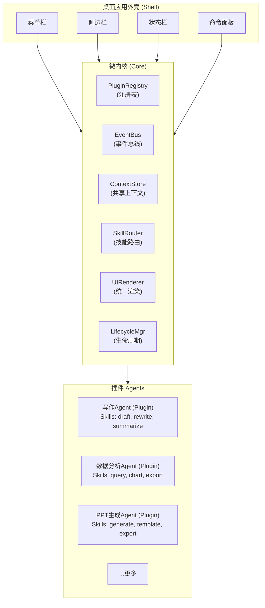

# 【月之暗面面经】如果产品要加更多 Agent，前端怎样保持扩展能力而不是越做越重？

## 一、问题背景

AI 桌面产品从 MVP 起步通常只有 1-2 个 Agent（比如写作 Agent + 对话 Agent）。但随着产品发展，产品经理会说："加一个 PPT 生成 Agent"、"加一个数据分析 Agent"、"加一个代码审查 Agent"……

如果每个 Agent 都在前端代码里硬编码——加菜单项、加路由、加组件、加状态管理——很快代码就会变成一个无法维护的庞然大物。每次新增 Agent，都要改核心代码，违反**开闭原则（OCP）**：对扩展开放，对修改封闭。

答案的核心思想是：**微内核架构（Microkernel Architecture）**——保持核心极简稳定，所有 Agent 能力都作为插件，通过标准接口和注册表机制动态接入。

## 二、微内核架构全景图



### 各层职责

| 层 | 职责 | 稳定性 |
|---|------|-------|
| **Shell（外壳）** | 窗口管理、菜单、导航、全局快捷键 | 高（极少改动） |
| **Core（微内核）** | 插件注册表、事件总线、技能路由、统一 UI 渲染 | 高（接口稳定） |
| **Plugin（Agent 插件）** | 各 Agent 的具体能力、UI 面板、数据处理 | 低（频繁增删改） |

**关键：新增 Agent 时，Shell 和 Core 完全不需要改动。**

## 三、Skill 接口标准化

每个 Agent 插件通过实现统一的 `Skill` 接口接入系统。这是扩展性的根基。

### 3.1 Skill 接口定义

```typescript
/**
 * Skill —— Agent能力的标准描述
 * 一个Agent可以注册多个Skill
 */
interface Skill {
  // === 元信息 ===
  id: string;                          // 全局唯一，如 'writing.draft'
  name: string;                        // 显示名，如 '撰写草稿'
  agentId: string;                     // 所属Agent，如 'writing'
  icon: string;                        // 图标
  description: string;                 // 描述（用于命令面板搜索）
  version: string;                     // 版本号

  // === 能力声明 ===
  inputSchema: JSONSchema;             // 输入参数的JSON Schema
  outputType: SkillOutputType;         // 输出类型: text | file | stream | ui
  category: SkillCategory;             // 分类: create | edit | analyze | export

  // === 执行入口 ===
  execute: (input: SkillInput, ctx: SkillContext) => Promise<SkillOutput>;

  // === UI声明（可选）===
  uiComponent?: React.LazyExoticComponent<ComponentType<SkillUIProps>>;

  // === 生命周期钩子 ===
  onActivate?: () => void;             // 插件激活时
  onDeactivate?: () => void;           // 插件卸载时
}

// 执行上下文——注入内核能力，而非让插件直接访问全局
interface SkillContext {
  eventBus: EventBus;                  // 发布/订阅事件
  contextStore: ContextStore;          // 读写共享上下文
  logger: Logger;                      // 日志
  httpClient: HttpClient;              // 受控的网络请求
  fileSystem: FileSystem;              // 受控的文件操作
  toast: (msg: string) => void;        // 通知
}

type SkillOutput =
  | { type: 'text'; content: string }
  | { type: 'file'; path: string }
  | { type: 'stream'; stream: ReadableStream }
  | { type: 'ui'; component: ReactNode };
```

### 3.2 一个具体的 Skill 实现

```typescript
// 写作Agent的"撰写草稿"技能
const draftSkill: Skill = {
  id: 'writing.draft',
  name: '撰写草稿',
  agentId: 'writing',
  icon: '✍️',
  description: '根据大纲或提示词撰写文章草稿',
  version: '1.2.0',

  inputSchema: {
    type: 'object',
    properties: {
      topic: { type: 'string', description: '文章主题' },
      outline: { type: 'array', items: { type: 'string' } },
      style: { type: 'string', enum: ['正式', '口语', '学术'] }
    },
    required: ['topic']
  },

  outputType: 'stream',
  category: 'create',

  async execute(input, ctx) {
    // 通过受控的方式调用后端API
    const stream = await ctx.httpClient.post('/api/writing/draft', input);
    return { type: 'stream', stream };
  },

  uiComponent: lazy(() => import('./DraftPanel')),
};
```

## 四、插件注册表（Plugin Registry）

注册表是微内核的心脏——管理所有 Agent 插件的注册、查询、启用/禁用。

### 4.1 Registry 实现

```typescript
class PluginRegistry {
  private skills = new Map<string, Skill>();
  private agents = new Map<string, AgentManifest>();
  private hooks = new Map<string, HookHandler[]>();  // 扩展点

  // === 注册 ===
  registerSkill(skill: Skill): void {
    if (this.skills.has(skill.id)) {
      console.warn(`Skill ${skill.id} already registered, overwriting`);
    }
    this.skills.set(skill.id, skill);
    this.emit('skill:registered', skill);
  }

  // 批量注册一个Agent的所有能力
  registerAgent(manifest: AgentManifest): void {
    this.agents.set(manifest.id, manifest);
    manifest.skills.forEach(skill => this.registerSkill(skill));

    // 注册扩展点（菜单项、命令面板项等）
    manifest.contributes?.menuItems?.forEach(item => {
      this.registerHook('menu:item', item);
    });
    manifest.contributes?.commands?.forEach(cmd => {
      this.registerHook('command:palette', cmd);
    });

    manifest.onActivate?.();
  }

  // === 查询 ===
  getSkill(id: string): Skill | undefined {
    return this.skills.get(id);
  }

  querySkills(filter?: {
    agentId?: string;
    category?: SkillCategory;
  }): Skill[] {
    let results = Array.from(this.skills.values());
    if (filter?.agentId) {
      results = results.filter(s => s.agentId === filter.agentId);
    }
    if (filter?.category) {
      results = results.filter(s => s.category === filter.category);
    }
    return results;
  }

  // === 卸载 ===
  unregisterAgent(agentId: string): void {
    const agent = this.agents.get(agentId);
    if (!agent) return;

    agent.skills.forEach(skill => {
      this.skills.delete(skill.id);
    });
    agent.onDeactivate?.();
    this.agents.delete(agentId);
    this.emit('agent:unregistered', agentId);
  }

  // === 扩展点机制 ===
  registerHook(name: string, handler: HookHandler): void {
    if (!this.hooks.has(name)) this.hooks.set(name, []);
    this.hooks.get(name)!.push(handler);
    this.emit('hook:changed', name);
  }

  getHooks(name: string): HookHandler[] {
    return this.hooks.get(name) ?? [];
  }

  private emit(event: string, data?: unknown): void {
    // 委托给EventBus
  }
}

// 单例
export const registry = new PluginRegistry();
```

### 4.2 Agent Manifest（Agent 清单文件）

每个 Agent 插件通过一个清单文件声明自己的能力、贡献点和依赖：

```typescript
interface AgentManifest {
  id: string;                    // 'writing'
  name: string;                  // '写作助手'
  version: string;
  author: string;

  skills: Skill[];               // 核心能力列表

  contributes?: {                // 向外壳贡献的UI入口
    menuItems?: MenuItem[];
    commands?: Command[];
    sidebarPanels?: Panel[];
    settings?: SettingSection[];
  };

  dependencies?: string[];       // 依赖的其他Agent插件

  onActivate?: () => void;
  onDeactivate?: () => void;
}
```

```typescript
// writing-agent/manifest.ts —— 新增Agent只需要写这一个文件
export const writingAgentManifest: AgentManifest = {
  id: 'writing',
  name: '写作助手',
  version: '1.3.0',
  author: 'team-writing',

  skills: [draftSkill, rewriteSkill, summarizeSkill],

  contributes: {
    menuItems: [
      { id: 'writing.new', label: '新建文章', shortcut: 'Cmd+N' }
    ],
    commands: [
      { id: 'writing.draft', title: '写作: 撰写草稿' },
      { id: 'writing.rewrite', title: '写作: 改写' }
    ],
    sidebarPanels: [
      { id: 'writing.outline', title: '大纲', component: lazy(() => import('./OutlinePanel')) }
    ],
    settings: [
      { id: 'writing.style', label: '默认风格', type: 'select', options: ['正式', '口语', '学术'] }
    ]
  },

  onActivate() {
    console.log('Writing Agent activated');
  }
};
```

## 五、动态加载与 Skill 路由

### 5.1 插件加载流程

```typescript
// 应用启动时，从配置加载插件清单
async function bootstrapPlugins(config: PluginConfig[]) {
  for (const cfg of config) {
    // 动态import——代码分割，按需加载
    const module = await import(/* webpackChunkName: "agent-[request]" */
      `./agents/${cfg.id}/manifest`
    );
    registry.registerAgent(module.default);
  }
}

// 配置驱动：哪些Agent启用、什么顺序
// plugin.config.json
[
  { "id": "writing", "enabled": true, "order": 1 },
  { "id": "analytics", "enabled": true, "order": 2 },
  { "id": "ppt", "enabled": false, "order": 3 }
]
```

### 5.2 SkillRouter —— 统一的技能调度

```typescript
class SkillRouter {
  constructor(private registry: PluginRegistry) {}

  // 用户在命令面板输入或点击菜单 → 路由到对应Skill
  async execute(skillId: string, input: SkillInput, ctx: SkillContext) {
    const skill = this.registry.getSkill(skillId);
    if (!skill) {
      throw new Error(`Skill not found: ${skillId}`);
    }

    // 参数校验（基于JSON Schema）
    const valid = validate(input, skill.inputSchema);
    if (!valid.success) {
      throw new ValidationError(valid.errors);
    }

    try {
      const output = await skill.execute(input, ctx);
      ctx.eventBus.emit('skill:completed', { skillId, output });
      return output;
    } catch (err) {
      ctx.eventBus.emit('skill:error', { skillId, error: err });
      throw err;
    }
  }
}
```

### 5.3 命令面板自动聚合所有插件命令

```tsx
function CommandPalette({ registry }: { registry: PluginRegistry }) {
  const [query, setQuery] = useState('');

  // 自动收集所有插件贡献的命令
  const commands = useMemo(() => {
    const allCommands = registry.getHooks('command:palette');
    return allCommands.filter(cmd =>
      cmd.title.toLowerCase().includes(query.toLowerCase())
    );
  }, [query, registry]);

  return (
    <CommandPaletteUI
      query={query}
      onQueryChange={setQuery}
      items={commands.map(cmd => ({
        id: cmd.id,
        label: cmd.title,
        onSelect: () => skillRouter.execute(cmd.id, getUserInput(), ctx)
      }))}
    />
  );
}
```

## 六、扩展点（Extension Points）机制

微内核架构的关键是**预定义扩展点**——内核声明"我允许插件在以下位置插入内容"，插件通过 `contributes` 向扩展点贡献内容。

```typescript
// 内核预定义的扩展点
type ExtensionPoint =
  | 'menu:item'           // 菜单项
  | 'command:palette'     // 命令面板命令
  | 'sidebar:panel'       // 侧边栏面板
  | 'toolbar:action'      // 工具栏按钮
  | 'context:menu'        // 右键菜单
  | 'settings:section'    // 设置页分区
  | 'editor:widget';      // 编辑器内嵌组件

// 内核在渲染这些位置时，查询注册表中所有贡献
function MenuBar({ registry }: { registry: PluginRegistry }) {
  // 自动聚合所有插件贡献的菜单项
  const items = registry.getHooks('menu:item');
  return (
    <nav>
      {items.map(item => <MenuItem key={item.id} {...item} />)}
    </nav>
  );
}
```

## 七、插件间通信

Agent 之间需要协作（比如写作 Agent 的产物传给 PPT Agent），但不能直接引用，需通过事件总线和共享上下文解耦：

```typescript
// 事件总线——发布订阅模式
class EventBus {
  private listeners = new Map<string, Set<EventHandler>>();

  on(event: string, handler: EventHandler): () => void {
    if (!this.listeners.has(event)) this.listeners.set(event, new Set());
    this.listeners.get(event)!.add(handler);
    return () => this.listeners.get(event)?.delete(handler);  // 返回取消函数
  }

  emit(event: string, data?: unknown): void {
    this.listeners.get(event)?.forEach(h => h(data));
  }
}

// 共享上下文——Agent之间共享数据
class ContextStore {
  private store = new Map<string, unknown>();

  set(key: string, value: unknown): void {
    this.store.set(key, value);
    eventBus.emit(`context:changed:${key}`, value);
  }

  get<T>(key: string): T | undefined {
    return this.store.get(key) as T;
  }
}

// 示例：写作Agent产出文章 → PPT Agent监听并提示"转成PPT？"
// writing plugin
ctx.contextStore.set('writing.currentDoc', { title, content });

// ppt plugin
ctx.eventBus.on('context:changed:writing.currentDoc', (doc) => {
  ctx.toast(`检测到新文章"${doc.title}"，要转成PPT吗？`);
});
```

## 八、总结：新增一个 Agent 的完整流程

```
Step 1: 创建插件目录
  src/agents/data-analysis/
    ├── manifest.ts        ← Agent清单（声明能力、贡献点）
    ├── skills/            ← Skill实现
    │   ├── query.ts
    │   └── chart.ts
    ├── panels/            ← UI面板
    │   └── AnalysisPanel.tsx
    └── index.ts

Step 2: 编写 manifest.ts（实现AgentManifest接口）
Step 3: 在 plugin.config.json 中添加一行配置
Step 4: 完成——内核自动加载，菜单/命令面板/侧边栏自动出现入口
```

**不需要改动任何核心代码。** 这就是微内核架构的威力：

| 设计原则 | 具体体现 |
|---------|---------|
| **开闭原则** | 新增 Agent 只加文件不改核心 |
| **依赖倒置** | 核心定义接口，插件实现接口 |
| **单一职责** | 每个 Agent 只管自己的领域 |
| **配置驱动** | `plugin.config.json` 控制启用/禁用/顺序 |
| **动态加载** | 代码分割 + 懒加载，不影响首屏性能 |

这套架构的前端落地参考包括：VS Code 的 Extension API、Eclipse 的 Plugin 体系、Figma 的 Plugin 系统。核心共性都是：**最小化内核 + 标准化接口 + 注册表管理 + 扩展点机制**。

当产品经理下次说"再加一个 Agent"时，开发只需要创建一个插件目录，写一个 manifest，改一行配置——而不是动核心代码。

## 记忆要点

- 核心思想微内核架构：保持核心极简稳定，Agent 均作为插件动态接入
- 标准接入三件套：插件提供标准 Schema，通过注册表挂载，用 EventBus 通信
- 单一职责原则：微内核只管调度与渲染，业务逻辑全下沉至 Agent 插件
- 路由动态化：技能路由根据用户意图智能分发，彻底避免硬编码


## 苏格拉底式面试追问

> 这组追问模拟面试官层层逼问，每一问先回答"为什么"，再回答"怎么做"，最后回答"如何证明"。

### 第一层：目标与动机

**Q：Agent 扩展你用微内核架构（核心稳定 + 插件化），但为什么不直接"内聚式"开发（每个 Agent 代码写在主项目里），简单直接？**

内聚式开发的问题：违反开闭原则（OCP）。每加一个 Agent 要改核心代码（加菜单、路由、组件、状态管理），核心代码越来越臃肿，维护成本高。且 Agent 之间耦合（如写作 Agent 和对话 Agent 共享代码），改一个影响其他。微内核架构解决：一、开闭原则——新增 Agent = 新增插件（不改核心代码），核心稳定；二、解耦——每个 Agent 是独立插件，内部逻辑自治，通过标准接口通信，改一个不影响其他；三、可扩展——第三方开发者可开发 Agent 插件（如 VS Code 插件生态），产品能力无限扩展。类比 VS Code——核心是编辑器（微内核），所有语言支持都是插件（Python、Java、Go），加语言不改核心。AI 桌面产品的 Agent 扩展同理。

### 第二层：证据与定位

**Q：用户说"新装的 Agent 插件加载失败"，你怎么定位是插件 bug 还是核心加载逻辑 bug？**

分段定位：一、插件 schema——查插件的 manifest（如 plugin.json）是否符合 schema（如缺字段、字段类型错），核心加载时会校验 schema，不符则拒绝加载；二、插件依赖——查插件的依赖（如依赖某库版本），如果依赖未满足（如版本冲突），加载失败；三、插件代码——如果 schema 和依赖 OK，查插件的入口代码（如 main.js）执行是否报错（如 JS 异常），用 try-catch 包裹插件加载，捕获异常；四、核心加载逻辑——如果以上都 OK，可能是核心的加载逻辑 bug（如插件注册表更新时机错）。定位手段：核心加载时打详细日志（"校验 schema → 检查依赖 → 执行入口代码 → 注册到注册表"），看停在哪一步。

### 第三层：根因深挖

**Q：插件之间有依赖（如 PPT Agent 依赖文件读取 Agent），你用依赖图管理，但循环依赖（A 依赖 B，B 依赖 A）怎么检测和处理？**

循环依赖检测：加载插件时构建依赖图，用拓扑排序（topological sort）检测环——如果拓扑排序失败（存在环），说明有循环依赖。处理：一、加载时拒绝——检测到循环依赖，拒绝加载并报错（"插件 A 和 B 存在循环依赖，请修复"），防止运行时问题；二、设计规范——插件依赖应该是"单向的"（如 PPT Agent 依赖文件读取，反过来不该），设计时明确依赖方向（基础 Agent 不依赖业务 Agent）；三、重构解耦——如果确实有循环需求（A 要用 B 的功能，B 也要用 A 的），说明设计有问题（职责不清），应抽取公共部分为 C（A 和 B 都依赖 C，A 和 B 不互相依赖）。核心："加载时检测循环依赖 + 拒绝加载 + 设计时单向依赖"，而非运行时处理（复杂且不可控）。

**Q：那为什么不直接把所有插件代码打包到主应用（编译时依赖），而要运行时动态加载？**

打包到主应用（编译时依赖）的问题：一、体积大——所有 Agent 打包，主应用几 MB 甚至几十 MB，用户下载慢；二、不可扩展——第三方无法开发插件（所有插件都在主应用里编译），失去生态扩展能力；三、更新成本高——某插件更新要重新打包整个主应用、用户重新下载，更新慢。运行时动态加载（如 require 动态 import、script 标签注入）的优势：一、按需加载——用户用到某 Agent 时才加载（懒加载），减小初始体积；二、可扩展——第三方开发插件（独立文件），用户安装即可用，不改主应用；三、独立更新——插件更新只重新下载插件，不重新下载主应用。所以动态加载是"可扩展 + 按需 + 独立更新"，匹配插件化架构的需求。

### 第四层：方案权衡

**Q：插件你用 EventBus 通信（发布订阅），但为什么不直接用函数调用（插件 A 直接调用插件 B 的方法），更直接？**

直接函数调用的问题：一、强耦合——插件 A 要 import 插件 B 的方法，编译时绑定，如果 B 不存在或改名，A 报错；二、依赖时序——A 调用 B 时 B 必须已加载，加载顺序复杂；三、不可替换——A 硬依赖 B，无法用 C 替换 B（如用户装了替代插件）。EventBus 的优势：一、松耦合——A 发布事件（如"需要读取文件"），不关心谁处理（可能是 B 或 C），插件可替换；二、解耦时序——A 发布事件即使 B 未加载也不报错（事件排队或丢弃），加载顺序灵活；三、多对多——多个插件可订阅同一事件（如"文件读取完成"后多个插件响应），函数调用难实现。所以 EventBus 是"松耦合 + 解耦时序 + 多对多"，适合插件化架构。代价是调试难（事件流向不直观），要靠日志追踪。

**Q：为什么不限制插件权限（任何插件都能调用任何能力），而要设计权限系统（如文件读写、网络访问分别授权）？**

不限制权限的安全风险：恶意插件（或被注入的插件）可读取敏感文件、发送网络请求泄露数据。AI 桌面产品处理用户敏感数据（文档、密码），插件权限失控是重大隐患。权限系统的价值：一、最小权限——插件只能用声明的权限（如文件读取插件只能读不能写，网络插件只能访问白名单域名），降低损害；二、用户知情——安装插件时展示权限清单（如"此插件需要读取文件、访问网络"），用户决定是否信任；三、沙箱——高危插件在沙箱运行（如 Web Worker 或 iframe），限制对主应用的访问。借鉴浏览器扩展的权限模型（Chrome 扩展安装时声明权限）。所以权限系统是"插件生态安全的底线"，没有权限控制的插件化是"方便但不安全"，不可接受。

### 第五层：验证与沉淀

**Q：你怎么验证微内核架构真的保持了扩展性（新增 Agent 不改核心代码）？**

架构验证：一、新增 Agent 测试——让开发者新增一个 Agent（如"数据分析 Agent"），全程不改核心代码（只加插件文件 + 注册），如果能实现，说明扩展性达标；二、核心代码稳定性——统计版本迭代中核心代码的改动频率（应低，大部分改动在插件层），如果核心代码频繁改，说明抽象不够；三、插件独立测试——每个插件可独立测试（不依赖主应用运行），如果插件测试必须启动主应用，说明耦合高；四、第三方插件开发——邀请外部开发者开发插件（无核心代码访问权），如果他们能独立开发，说明接口标准化达标。核心指标："新增 Agent 时核心代码改动行数 ≈ 0"。

**Q：这道题沉淀出什么可复用的微内核架构设计经验？**

四条原则：一、微内核 + 插件化——核心极简稳定（只管调度和渲染），所有 Agent 作为插件动态加载，遵循开闭原则；二、标准接口 + EventBus——插件提供标准 schema（manifest），通过注册表挂载，用 EventBus 松耦合通信（不用函数调用的强耦合）；三、运行时动态加载——插件按需加载（懒加载）、独立更新（不重新打包主应用）、支持第三方扩展；四、权限系统——插件声明权限（文件、网络），用户授权，最小权限原则，沙箱运行高危插件。核心洞察："Agent 扩展性本质是'微内核架构'——借鉴 VS Code（核心编辑器 + 插件生态）、Eclipse（RCP 微内核），核心稳定、能力插件化、接口标准化，让产品能力无限扩展而不臃肿。"


## 结构化回答

**30 秒电梯演讲：** 用插件化架构：Agent能力标准化为插件(Skill接口)，前端通过注册表动态加载，新增Agent就是新增插件不改主架构。打个比方，就像VS Code插件——核心编辑器不变，装一个插件就多一种语言支持。新增Agent就像装插件。

**展开框架：**
1. **核心思想微内核架构** — 保持核心极简稳定，Agent 均作为插件动态接入
2. **标准接入三件套** — 插件提供标准 Schema，通过注册表挂载，用 EventBus 通信
3. **单一职责原则** — 微内核只管调度与渲染，业务逻辑全下沉至 Agent 插件

**收尾：** 这块我踩过坑——要不要深入聊：Agent之间的依赖关系怎么管理？

## 视频脚本

> 预计时长：4 分钟 | 由浅入深

| 时间 | 画面/字幕 | 口播台词 | 讲解要点 |
|------|----------|----------|----------|
| 0:00 | 标题卡 | "AI-Native桌面一句话：用插件化架构：Agent能力标准化为插件(Skill接口)，前端通过注册表动态加载…。" | 开场钩子 |
| 0:15 | 浏览器渲染流程图 | "核心思想微内核架构：保持核心极简稳定，Agent 均作为插件动态接入" | 核心思想微内核架构 |
| 1:08 | 浏览器渲染流程图分步演示 | "标准接入三件套：插件提供标准 Schema，通过注册表挂载，用 EventBus 通信" | 标准接入三件套 |
| 2:01 | 关键代码/伪代码片段 | "单一职责原则：微内核只管调度与渲染，业务逻辑全下沉至 Agent 插件" | 单一职责原则 |
| 2:54 | 对比表格 | "路由动态化：技能路由根据用户意图智能分发，彻底避免硬编码" | 路由动态化 |
| 3:50 | 总结卡 | "核心抓住这条主线，下期咱们接着聊：Agent之间的依赖关系怎么管理。" | 收尾 |
