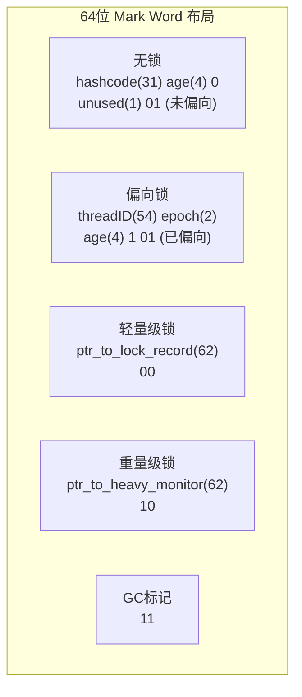

# 【拼多多 Java服务端】synchronized锁升级过程，每个状态的标志位在对象头哪里？

> 来源：拼多多211本硕Java服务端面经（已OC）（小红书）

## 一、对象头 Mark Word 结构（64位JVM）



## 二、锁升级全流程

```
          ┌──────────┐
          │   无锁    │  Mark Word: hashcode + age + 001
          │ (初始状态) │  没有任何线程访问同步块
          └─────┬─────┘
                │ 线程A第一次进入同步块
                │ CAS将线程ID写入Mark Word
                ▼
          ┌──────────┐
          │  偏向锁   │  Mark Word: threadID + epoch + 101
          │ (Biased)  │  只有一个线程访问，零开销(连CAS都不需要)
          └─────┬─────┘
                │ 线程B尝试进入，发现threadID≠自己
                │ 暂停在安全点，撤销偏向锁
                ▼
          ┌──────────┐
          │ 轻量级锁  │  Mark Word: ptr_to_lock_record + 000
          │ (Thin)    │  CAS竞争Lock Record，失败则自旋等待
          └─────┬─────┘
                │ 自旋超过阈值(~10次) 或 有第三个线程等待
                │ 锁膨胀（Inflation）
                ▼
          ┌──────────┐
          │ 重量级锁  │  Mark Word: ptr_to_monitor + 010
          │ (Inflated)│  依赖OS Mutex，未获锁线程进入BLOCKED状态
          └──────────┘
```

## 三、各阶段详解

### 3.1 偏向锁（Biased Locking）

```java
// 偏向锁获取流程
synchronized(obj) {
    // 1. 检查Mark Word是否为当前线程的偏向锁
    //    threadID == 当前线程ID → 直接进入（零开销）
    //    threadID == 空 → CAS设置threadID → 进入
    
    // 2. 如果threadID != 当前线程 → 偏向撤销
    //    等待全局安全点(Safepoint)
    //    检查原持有线程是否在同步块中
    //      不在 → 撤销偏向，设为无锁 → 重新竞争
    //      在   → 升级为轻量级锁
}
```

**JDK15+ 变化**：偏向锁默认关闭（JEP 374）。原因：
- 维护成本高（需要Safepoint撤销）
- 现代应用竞争场景增多，偏向锁收益下降
- CAS指令在现代CPU上已经很廉价

### 3.2 轻量级锁（Thin Lock）

```
┌────────────────────────────────────────────────────┐
│  轻量级锁加锁过程                                    │
│                                                     │
│  线程栈帧              对象头                        │
│  ┌──────────┐        ┌──────────┐                  │
│  │Lock Record│←──CAS──│ Mark Word │                 │
│  │  ┌───────┤  替换   │ (指向LR)  │                 │
│  │  │displaced│       └──────────┘                  │
│  │  │ Mark   │──保存─→ 原Mark Word                  │
│  │  │ Word   │        (hashcode+age)               │
│  │  └───────┤                                       │
│  └──────────┘                                       │
│                                                     │
│  CAS成功 → 获得锁                                   │
│  CAS失败 → 自旋等待(自适应自旋)                      │
│           自旋超过阈值 → 升级重量级锁                │
└────────────────────────────────────────────────────┘
```

### 3.3 重量级锁（Heavyweight Lock）

```
┌────────────────────────────────────────────────────┐
│  ObjectMonitor 结构 (HotSpot源码)                   │
│                                                     │
│  ┌─────────────────────────────────────┐           │
│  │  ObjectMonitor                       │           │
│  │    ├── _owner    → 持有锁的线程       │           │
│  │    ├── _EntryList → 阻塞等待队列      │           │
│  │    ├── _WaitSet   → wait()等待集合    │           │
│  │    ├── _count    → 重入计数          │           │
│  │    └── _recursions → 递归次数        │           │
│  └─────────────────────────────────────┘           │
│                                                     │
│  加锁: pthread_mutex_lock (Linux)                  │
│  线程状态: RUNNABLE → BLOCKED                       │
│  代价: 内核态切换 ~1-3μs                            │
└────────────────────────────────────────────────────┘
```

## 四、验证代码：观察锁状态

```java
import org.openjdk.jol.info.ClassLayout;

public class LockUpgradeDemo {
    static final Object lock = new Object();

    public static void main(String[] args) throws InterruptedException {
        // 打印对象头（无锁状态）
        System.out.println("=== 无锁 ===");
        System.out.println(ClassLayout.parseInstance(lock).toPrintable());

        // 偏向锁（JDK15前）
        synchronized (lock) {
            System.out.println("=== 偏向锁 ===");
            System.out.println(ClassLayout.parseInstance(lock).toPrintable());
        }

        // 轻量级锁（多线程竞争但不激烈）
        Thread t = new Thread(() -> {
            synchronized (lock) {
                System.out.println("=== 轻量级锁 ===");
                System.out.println(ClassLayout.parseInstance(lock).toPrintable());
            }
        });
        t.start();
        t.join();
    }
}
// JVM参数: -XX:+UseBiasedLocking -XX:BiasedLockingStartupDelayMillis=0
```

## 五、面试加分点

1. **锁升级不可逆**：一旦升级到重量级锁就不会降级（JVM没有实现降级逻辑），除非GC回收对象
2. **自适应自旋**：JVM根据历史成功率动态调整自旋次数——上次自旋成功就多旋几次，失败就少旋或不旋
3. **批量重偏向（Bulk Rebias）**：同一类的对象撤销偏向超过阈值（默认20次）后，JVM批量重偏向到新线程
4. **批量撤销（Bulk Revoke）**：撤销超过40次后，该类所有对象禁用偏向锁
5. **synchronized vs ReentrantLock**：synchronized是JVM层面（monitorenter/monitorexit），ReentrantLock是API层面（AQS + CAS）


## 结构化回答

**30 秒电梯演讲：** synchronized锁升级是JVM自适应性优化——从无锁到偏向锁到轻量级锁到重量级锁，根据竞争程度逐步升级，不可降级（JDK15前可批量撤销偏向）。

**展开框架：**
1. **Mark Word存储锁** — Mark Word存储锁状态标志位：01(无锁/偏向) 00(轻量级) 10(重量级)
2. **偏向锁→记录线程ID到** — 偏向锁→记录线程ID到Mark Word，不加锁不CAS
3. **轻量级锁→CAS替换** — 轻量级锁→CAS替换Mark Word为指向Lock Record的指针

**收尾：** 这块我踩过坑——要不要深入聊：JDK15为什么默认禁用偏向锁？（Hint: 维护成本、CAS指令开销增加）？

## 视频脚本

> 预计时长：3 分钟 | 由浅入深

| 时间 | 画面/字幕 | 口播台词 | 讲解要点 |
|------|----------|----------|----------|
| 0:00 | 标题卡 | "并发一句话：synchronized锁升级是JVM自适应性优化——从无锁到偏向锁到轻量级锁到重量级锁…。" | 开场钩子 |
| 0:15 | 加锁/解锁时序图 | "Mark Word存储锁状态标志位：01(无锁/偏向) 00(轻量级) 10(重量级)" | Mark Word存储锁 |
| 1:06 | 加锁/解锁时序图分步演示 | "偏向锁到记录线程ID到Mark Word，不加锁不CAS" | 偏向锁→记录线程ID到 |
| 1:57 | 关键代码/伪代码片段 | "轻量级锁到CAS替换Mark Word为指向Lock Record的指针" | 轻量级锁→CAS替换 |
| 2:50 | 总结卡 | "核心抓住这条主线，下期咱们接着聊：JDK15为什么默认禁用偏向锁？（Hint: 维护成本、CAS指令开销增加）。" | 收尾 |

## 苏格拉底式面试追问

| 追问层级 | 面试官可能这样问 | 高分回答方向 |
|----------|------------------|--------------|
| 目标追问 | synchronized锁升级想达到什么目的？ | 自适应优化——根据竞争激烈程度用最轻量的锁，无竞争用偏向锁、轻度竞争用轻量级锁、重度竞争才升级重量级锁，降低同步开销 |
| 证据追问 | 每个锁状态在对象头哪里存储？你怎么定位标志位？ | 对象头Mark Word：偏向锁存线程ID和epoch、轻量级锁存指向栈中Lock Record的指针、重量级锁存指向ObjectMonitor的指针 |
| 边界追问 | 什么条件下锁会升级？什么条件下会降级？ | 升级：偏向锁遇第二个线程CAS失败→轻量级；轻量级自旋失败（CAS超过阈值）→重量级。降级：一般情况下不可降级（GC safepoint可能批量重偏向） |
| 反例追问 | 偏向锁是不是总比轻量级锁好？什么场景偏向锁反而是负担？ | 不是。多线程交替访问（无真正并发但有竞争）场景，偏向锁撤销和重偏向的开销比直接轻量级锁更大，JDK15默认禁用偏向锁 |
| 风险追问 | 锁升级到重量级锁后有什么后果？ | 进入ObjectMonitor的EntryList阻塞，涉及内核态切换和park/unpark，性能大幅下降；还会触发线程上下文切换 |
| 验证追问 | 怎么确认代码运行时锁处于哪个状态？ | 用JOL打印对象头布局、jstack看线程是否BLOCKED在monitor、JFR看锁竞争事件 |
| 沉淀追问 | 理解锁升级对写代码有什么实际指导？ | 指导：缩短同步块、避免锁不同的对象、热路径用Lock-free数据结构、JDK15+不用再为偏向锁优化代码 |

### 现场对话示例
**面试官**：synchronized锁升级过程讲一下，每个状态的标志位在对象头哪里？
**候选人**：Mark Word存锁状态：无锁→偏向锁存线程ID→轻量级锁存Lock Record指针→重量级锁存ObjectMonitor指针，按竞争激烈度升级。
**面试官**：什么条件触发升级？能降级吗？
**候选人**：偏向锁遇第二个线程CAS失败升轻量级，轻量级自旋超过阈值升重量级；一般不可降级，只有批量重偏向是特例。
**面试官**：偏向锁一定比轻量级锁好吗？
**候选人**：不一定。多线程交替访问场景偏向锁撤销重偏向开销更大，所以JDK15默认禁用偏向锁，权衡维护成本和收益。
