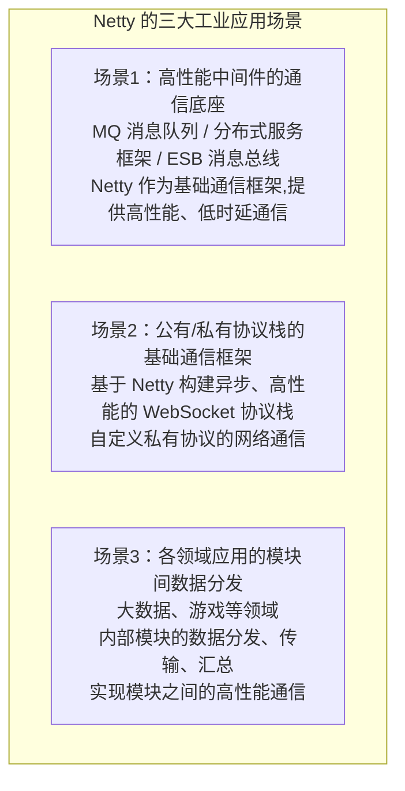

# Netty 在工业界的应用场景？

## 一、Netty 是 Java 网络通信的事实标准

PPT slide89-91 明确指出：Netty 的设计理念源自 Mina（slide89），并在工业界被广泛采用。下面是它的应用全景。

---

## 二、三大应用场景（PPT slide91）



---

## 三、典型用户与项目（PPT slide90）

| 公司 / 项目 | 用途 |
|------------|------|
| **Apache** | 多个基础通信组件 |
| **Twitter** | 后端内部 RPC（Finagle 底层） |
| **Facebook** | 后端高性能通信 |
| **Cassandra** | 分布式数据库节点间通信 |
| **Elasticsearch** | Transport 层节点间通信 |
| **Spark** | 大数据集群模块间数据传输 |
| **Alibaba Dubbo** | RPC 框架默认通信层 |
| **JD JSF** | 京东自研 RPC 框架 |
| **...** | 还有更多 |

---

## 四、场景一详解：中间件通信底座

这是 Netty 最核心的应用——几乎所有高性能 Java 中间件都用 Netty 做通信：

### 1. RPC 框架（Dubbo / JSF）
```
服务消费者 ──[Netty长连接]──► 服务提供者
  ↓ 调用方法                    ↑ 执行方法
  序列化请求 ──────────────────► 反序列化执行
  ◄────────────────────────── 序列化响应
```
- Dubbo 默认使用 Netty 作为通信框架（`dubbo-remoting-netty`）
- 长连接复用、多路复用、异步调用都基于 Netty 实现

### 2. 消息队列（RocketMQ / Kafka Java Client）
```
Producer ──[Netty]──► Broker ──[Netty]──► Consumer
```
- RocketMQ 的 Remoting 层完全基于 Netty
- 高吞吐、低延迟的网络通信由 Netty 保障

### 3. ESB / 服务网关
- 高并发请求转发、协议转换都依赖 Netty 的非阻塞能力

---

## 五、场景二详解：协议栈实现

Netty 自带大量协议 Handler，可直接构建协议服务器：

### 1. WebSocket 服务器
```java
pipeline.addLast(new HttpServerCodec());
pipeline.addLast(new HttpObjectAggregator(64*1024));
pipeline.addLast(new WebSocketServerProtocolHandler("/ws"));
pipeline.addLast(new WebSocketFrameHandler());
// 一个高性能 WebSocket 服务就搭好了
```

### 2. 自定义私有协议
- 游戏服务器：基于 Netty 实现自定义二进制协议
- 物联网：MQTT 等协议的 Java 实现
- IM 即时通讯：长连接消息推送

---

## 六、场景三详解：大数据与游戏

### 1. 大数据（Spark）
- Spark 节点间 shuffle 数据传输基于 Netty
- 大规模数据的分发、汇总走 Netty 高速通道

### 2. 游戏服务器
- 长连接管理（玩家在线状态）
- 实时消息推送（战斗同步、聊天）
- 自定义游戏协议编解码

### 3. 物联网
- 海量设备接入（MQTT、CoAP）
- 设备状态实时上报

---

## 七、Mina 与 Netty（PPT slide89）

PPT slide89 提到"Mina Netty 设计理念"——两者同源：

| 维度 | Mina | Netty |
|------|------|-------|
| 作者 | Trustin Lee | Trustin Lee（同一人） |
| 关系 | Netty 的前身 | Mina 的演进 |
| 设计 | 早期架构 | 更现代，API 更简洁 |
| 生态 | 逐渐式微 | 主流，社区活跃 |
| Thrread 模型 | 较简单 | 更灵活（主从 Reactor） |

> 同一作者先做了 Mina，吸取经验后做了更优秀的 Netty。所以 Netty 的设计理念是对 Mina 的继承和超越。

---

## 八、为什么大家都选 Netty？（面试加分点）

1. **性能极致**：零拷贝、池化 ByteBuf、无锁化串行设计
2. **API 友好**：异步事件驱动，业务与网络解耦
3. **协议丰富**：内置 HTTP/SSL/WebSocket/粘包等 Handler
4. **生产验证**：全球顶级公司海量验证，稳定可靠
5. **社区活跃**：持续演进，问题响应快
6. **生态统一**：大家都用，互通性好

---

## 九、扩展：如何用 Netty 构建一个 RPC 框架

这是 Netty 最经典的综合应用：

```
RPC 核心要素：
1. 网络通信 → Netty（长连接 + 异步）
2. 序列化 → PB/Hessian/JSON
3. 服务注册发现 → Zookeeper/Nacos
4. 负载均衡 → 轮询/随机/一致性哈希
5. 动态代理 → 屏蔽网络调用细节（消费者像调本地方法）

Dubbo 的架构就是这套思路的成熟实现，Netty 是它的通信基石。
```

> **面试记忆口诀**：**"中间件通信底座（MQ/RPC/ESB），协议栈实现（WebSocket/私有协议），各领域数据分发（大数据/游戏）"**——这是 Netty 三大战场。Apache、Twitter、Facebook、Dubbo、Spark、ES 全在用，Mina 是它的"前世"。

## 苏格拉底式面试追问

> 这组追问模拟面试官层层逼问，每一问先回答"为什么"，再回答"怎么做"，最后回答"如何证明"。

### 第一层：目标与动机

**Q：Netty 在工业界的应用你列举了 Dubbo、RocketMQ、Spark、Elasticsearch 等，它们为什么都选 Netty 而不是自己写网络层？**

选 Netty 的核心动机是"不重复造轮子 + 高性能成熟"。一、性能——Netty 的 NIO + EventLoop + 池化 ByteBuf 已经压榨到极致，自研很难超过；二、成熟稳定——Netty 经过 10+ 年生产验证，bug 修复及时（如 epoll 空轮询），自研要踩同样的坑；三、生态丰富——Netty 自带几十种编解码器（HTTP、Protobuf、Redis 协议），自研要自己写；四、社区支持——Netty 社区活跃，文档丰富，遇到问题能快速找到答案。所以 Dubbo/RocketMQ 等聚焦"业务逻辑"（RPC、消息队列），把"网络通信"交给 Netty。这是"分层关注"的工程哲学——基础库（Netty）管通用能力、业务框架（Dubbo）管领域逻辑。例外：性能极致的场景（如高频交易、内核旁路）会自研网络层（用 DPDK/io_uring 绕过 Netty），但 99% 的业务用 Netty 够用。

### 第二层：证据与定位

**Q：Dubbo 用 Netty 做 RPC 通信，你怎么定位"Dubbo 调用超时"是 Netty 层慢还是业务慢？**

分层排查：一、Dubbo 监控——看 Dubbo 的 Monitor 数据，对比"provider 端处理耗时"和"consumer 端调用耗时"，差值是网络+序列化耗时；二、Netty 层——provider 端的 Netty Handler 打日志（channelRead 到业务处理的时间、业务完成到 write 的时间），如果 channelRead 后立即处理（Netty 不慢）、业务处理耗时长（业务慢）；三、网络层——ping/traceroute 看网络延迟，tcpdump 抓包看 TCP 握手和数据传输耗时；四、序列化——对比不同序列化（如 Hessian vs Protobuf）的耗时，序列化慢可能是数据量大。常见根因：业务慢（DB 查询、下游调用）、网络延迟（跨机房）、序列化大对象、Netty EventLoop 阻塞（业务在 EventLoop 跑了耗时操作）。用 Dubbo 的 invoke 链路追踪（如 SkyWalking）能看到各段耗时分解。

### 第三层：根因深挖

**Q：Netty 在 Spark/Akka 里做"分布式 RPC"，跟 Dubbo 的 RPC 用法有什么本质区别？**

本质都是"远程方法调用"，但场景不同。Dubbo 是"服务化 RPC"——服务注册发现（Zookeeper/Nacos）、负载均衡（客户端选 provider）、服务治理（限流、降级），面向"微服务架构"。Spark/Akka 的 RPC 是"计算框架内部通信"——driver 和 executor 之间传任务、actor 之间发消息，无需服务发现（框架知道节点地址），面向"分布式计算"。所以 Dubbo 的 RPC 配套重（注册中心、治理）、Spark 的 RPC 轻量（点对点）。Netty 在两者都是"传输层"——负责字节传输，上层逻辑（服务发现、消息路由）由 Dubbo/Spark 自己实现。Netty 的角色是"通用网络框架"，被不同场景的上层框架使用。所以"Netty 在工业界的应用"要看"上层框架是什么"，Netty 提供能力，框架定义语义。

**Q：那为什么 Elasticsearch 不用 Dubbo 的 RPC，而用 Netty 自己实现 REST + Transport？**

场景差异。Elasticsearch 是"搜索引擎 + 数据存储"，通信模式：一、对外 REST（HTTP）——客户端用 HTTP API 查询（标准、跨语言）；二、内部 Transport（自定义 TCP）——集群节点间通信（选主、分片复制、查询聚合），高性能低延迟。ES 不用 Dubbo 因为：一、ES 是多语言客户端（Java/Python/JS），REST 跨语言友好（Dubbo 主要 Java）；二、ES 内部通信有特殊需求（如分片查询聚合、节点发现），自定义协议更灵活；三、ES 历史早于 Dubbo 普及，自己实现 Transport（基于 Netty）满足需求。所以 ES 用 Netty（传输层）+ 自定义协议（应用层），是"通用传输 + 专用协议"的组合。这体现了"Netty 是传输框架，上层协议由业务定义"的灵活性。

### 第四层：方案权衡

**Q：自己用 Netty 实现一个 RPC 框架，和直接用 Dubbo 相比，什么时候值得自研？**

自研 RPC 的价值场景：一、特殊协议需求——如二进制协议（Protobuf/FlatBuffers）+ 自定义分帧，Dubbo 默认用 Hessian，自定义要扩展 Dubbo（成本不低）；二、性能极致——Dubbo 有抽象层开销（Filter 链、代理），自研精简协议能快 10-30%（但对大多数业务不明显）；三、特殊通信模式——如流式 RPC（gRPC）、双向流（不像 Dubbo 的请求-响应模型）；四、学习/掌控——团队想完全掌控网络层（避免黑盒）。不值得自研的场景：一、标准服务化 RPC（服务发现、负载均衡、治理）——Dubbo 已成熟，自研要重造这些轮子；二、团队规模小——自研要持续投入维护（协议演进、bug 修复），不如用 Dubbo 社区版。所以 99% 的 Java RPC 场景用 Dubbo/gRPC，自研只在特殊需求（如定制协议、极致性能、内部框架）时。

**Q：为什么 gRPC 比 Dubbo 更流行（跨语言），但 Java 圈 Dubbo 仍占主流？**

gRPC 的跨语言优势在"多语言微服务"场景——Java 服务调 Go 服务、Python 服务，gRPC 用 Protobuf 定义 IDL，各语言生成 stub，天然跨语言。Dubbo 主要 Java（有 Dubbo-go 等扩展但生态弱）。Java 圈 Dubbo 占主流因为：一、历史——阿里贡献，国内大厂普遍使用，生态成熟（注册中心、治理、监控）；二、Java 生态——Dubbo 与 Spring/Spring Boot 集成深，Java 开发者友好；三、性能——Dubbo 的 Hessian 序列化在纯 Java 场景比 Protobuf 更灵活（不需 IDL，直接传 Java 对象）；四、治理完善——Dubbo 的路由、限流、降级等治理能力成熟。所以"跨语言选 gRPC、纯 Java 选 Dubbo"是常见策略。两者都基于 Netty（传输层），上层语义不同。

### 第五层：验证与沉淀

**Q：你怎么验证用 Netty 实现的网络层在生产中达到工业级（稳定、高性能）？**

三类验证：一、稳定性——长时间运行（7×24 小时压测），无内存泄漏（jmap 看堆稳定）、无连接泄漏（Channel 数稳定）、无 FD 泄漏（`ls /proc/<pid>/fd | wc -l` 稳定）、无 CPU 异常（无线程空轮询）；二、性能——压测吞吐（如 10 万+ QPS）、延迟（P99 < 毫秒级）、连接数（支持百万连接，调优后）；三、故障恢复——网络抖动（断网重连）、对端慢（背压生效）、大量连接（C10K/C10M）。验证手段：用 Chaos Engineering 注入故障（kill 对端、网络延迟）、JMH 压测、Prometheus 监控。线上监控：连接数、IO 吞吐、EventLoop 任务积压、ByteBuf 内存占用，异常告警。这些验证确保 Netty 应用达到工业级，不只是"能跑"。

**Q：这道题做完，你沉淀出了什么可复用的 Netty 工业应用经验？**

五条经验：一、聚焦业务，网络用 Netty——除非特殊需求（如极致性能、定制协议），不要自研网络层，Netty 够用；二、选对上层框架——RPC 用 Dubbo/gRPC、消息用 RocketMQ、搜索用 ES，这些框架基于 Netty 且各自领域成熟；三、监控 Netty 指标——连接数、EventLoop 任务、ByteBuf 内存，异常是问题信号；四、性能调优——EventLoop 不阻塞、池化 ByteBuf、合理 Option（SO_BACKLOG、TCP_NODELAY）；五、故障预案——断线重连、心跳超时、背压，防止网络异常导致服务不可用。核心："Netty 是经过工业验证的网络框架，正确使用（配置 + 监控 + 调优）能支撑高并发高可用服务，错误使用（阻塞 EventLoop、资源泄漏）会导致线上问题。"


## 结构化回答

**30 秒电梯演讲：** Netty 是 Java 高性能网络通信的事实标准——几乎所有需要"高性能、低时延通信"的中间件都建立在它之上。

**展开框架：**
1. **三大场景** — ①高性能低时延中间件通信底座(MQ/分布式服务/ESB) ②公有/私有协议栈(WebSocket) ③各领域应用模块数据分发(大数据/游戏)
2. **代表用户** — Apache、Twitter、Facebook、Cassandra、Elasticsearch、Spark、Alibaba(Dubbo)、JD(JSF)
3. **设计理念** — Mina 和 Netty 同源（同一作者主导）

**收尾：** 这块我踩过坑——要不要深入聊：Dubbo 为什么选择 Netty 作为默认通信框架？

## 视频脚本

> 预计时长：2 分钟 | 由浅入深

| 时间 | 画面/字幕 | 口播台词 | 讲解要点 |
|------|----------|----------|----------|
| 0:00 | 标题卡 | "Netty一句话：Netty 是 Java 高性能网络通信的事实标准——几乎所有需要'高性能…。" | 开场钩子 |
| 0:15 | Netty Reactor 线程模型图 | "三大场景：①高性能低时延中间件通信底座(MQ/分布式服务/ESB) ②公有/私有协议栈(WebSocket) ③各领…" | 三大场景 |
| 1:02 | Netty Reactor 线程模型图分步演示 | "代表用户：Apache、Twitter、Facebook、Cassandra、Elasticsearch、Spark…" | 代表用户 |
| 1:50 | 总结卡 | "核心抓住这条主线，下期咱们接着聊：Dubbo 为什么选择 Netty 作为默认通信框架。" | 收尾 |
