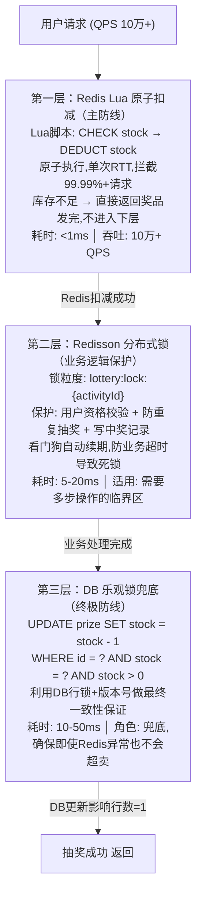

# 【滴滴面经】抽奖场景里，奖品库存超卖是怎么控制的？

## 一、超卖问题的本质

在抽奖系统中，超卖是最致命的并发问题。它的本质非常清晰：**检查（check）和扣减（deduct）是两个独立的操作，在并发环境下会产生竞态条件（Race Condition）**。

```
时间线   线程A                    线程B
  |        |                        |
  |   读取库存 stock=1              |
  |        |                  读取库存 stock=1
  |   判断 stock>0 ✓               |
  |        |                  判断 stock>0 ✓
  |   扣减 stock=0                 |
  |        |                  扣减 stock=-1  ← 超卖！
```

这就是经典的 **TOCTOU（Time-Of-Check-To-Time-Of-Use）** 问题。根本解法只有一条路：**让 check 和 deduct 变成一个不可分割的原子操作**。

---

## 二、防超卖三层防御架构

在实际生产中，我们采用 **三层防御** 架构，从快到慢、从上游到下游逐层拦截：



三层各司其职：

| 层级 | 技术 | 职责 | 性能 | 适用场景 |
|------|------|------|------|----------|
| 第一层 | Redis Lua | 原子扣减库存，拒绝无库存请求 | 极快 (<1ms) | 纯库存扣减 |
| 第二层 | Redisson锁 | 保护多步业务逻辑的临界区 | 中等 (5-20ms) | 资格校验+记录写入 |
| 第三层 | DB乐观锁 | 最终兜底，保证数据一致性的最后一道关卡 | 较慢 (10-50ms) | Redis异常时的安全网 |

---

## 三、第一层：Redis Lua 原子扣减（核心实现）

### 3.1 为什么用 Lua？

Redis 执行 Lua 脚本时保证 **原子性**——整个脚本作为一个整体执行，中间不会被其他命令插入。这意味着 check 和 deduct 在 Lua 脚本中是不可分割的，从根本上消除了竞态窗口。

此外 Lua 脚本还有一个巨大优势：**单次 RTT（Round Trip Time）**。如果用 Java 先 GET 再 SET，需要两次网络往返；Lua 脚本只需一次。

### 3.2 Lua 脚本代码

```lua
-- KEYS[1]: 库存key，如 "prize:stock:10001"
-- ARGV[1]: 扣减数量，通常为 1
-- 返回值: 1=扣减成功, 0=库存不足

local stock = tonumber(redis.call('GET', KEYS[1]))
if stock == nil then
    -- key不存在，库存未初始化
    return -1
end

if stock >= tonumber(ARGV[1]) then
    redis.call('DECRBY', KEYS[1], ARGV[1])
    return 1   -- 扣减成功
else
    return 0   -- 库存不足
end
```

### 3.3 Java 调用代码（Spring Boot + RedisTemplate）

```java
@Service
public class StockService {

    @Autowired
    private StringRedisTemplate redisTemplate;

    /**
     * Lua脚本：原子检查+扣减库存
     * 返回 1=成功, 0=库存不足, -1=key不存在
     */
    private static final String DEDUCT_STOCK_LUA =
        "local stock = tonumber(redis.call('GET', KEYS[1]))\n" +
        "if stock == nil then return -1 end\n" +
        "if stock >= tonumber(ARGV[1]) then\n" +
        "    redis.call('DECRBY', KEYS[1], ARGV[1])\n" +
        "    return 1\n" +
        "else\n" +
        "    return 0\n" +
        "end";

    private final DefaultRedisScript<Long> deductScript;

    @PostConstruct
    public void init() {
        deductScript = new DefaultRedisScript<>();
        deductScript.setScriptText(DEDUCT_STOCK_LUA);
        deductScript.setResultType(Long.class);
    }

    /**
     * 原子扣减库存
     * @param prizeId 奖品ID
     * @return true=扣减成功, false=库存不足
     */
    public boolean deductStock(Long prizeId) {
        String stockKey = "prize:stock:" + prizeId;
        Long result = redisTemplate.execute(
            deductScript,
            Collections.singletonList(stockKey),
            "1"  // 扣减数量
        );

        if (result == null || result == -1) {
            log.warn("库存key不存在, prizeId={}", prizeId);
            // 触发库存预热补偿
            return false;
        }

        return result == 1;
    }

    /**
     * 库存预热：活动开始前将DB库存同步到Redis
     */
    public void preheatStock(Long prizeId) {
        Integer dbStock = prizeMapper.getStockById(prizeId);
        if (dbStock != null && dbStock > 0) {
            redisTemplate.opsForValue().set(
                "prize:stock:" + prizeId,
                String.valueOf(dbStock)
            );
            log.info("库存预热完成, prizeId={}, stock={}", prizeId, dbStock);
        }
    }
}
```

### 3.4 Lua 扣减失败时的处理

Lua 返回 0（库存不足）时，直接给用户返回「奖品已抢完」，**不需要回滚**，因为扣减操作从未发生。返回 -1（key不存在）时，说明库存未预热，触发补偿逻辑从 DB 加载后重试。

---

## 四、第三层：DB 乐观锁兜底

### 4.1 为什么还需要 DB 层？

Redis 是内存数据库，存在宕机、主从切换丢数据的可能。虽然概率极低，但在涉及钱的系统中，**任何超卖都是不可接受的**。DB 乐观锁作为终极防线，确保即使 Redis 彻底失效，数据层面也不会超卖。

### 4.2 乐观锁实现（版本号 + 条件更新）

```sql
-- 方式一：利用 stock 字段本身做条件（简洁版）
UPDATE prize
SET stock = stock - 1,
    update_time = NOW()
WHERE id = #{prizeId}
  AND stock > 0;
-- 影响行数=1 → 扣减成功；影响行数=0 → 库存不足
```

```sql
-- 方式二：利用 version 版本号（标准乐观锁）
UPDATE prize
SET stock = stock - 1,
    version = version + 1,
    update_time = NOW()
WHERE id = #{prizeId}
  AND version = #{expectedVersion}
  AND stock > 0;
-- 影响行数=1 → 成功；影响行数=0 → 版本冲突或库存不足
```

### 4.3 Java 兜底代码

```java
@Service
public class PrizeDbService {

    @Autowired
    private PrizeMapper prizeMapper;

    /**
     * DB乐观锁扣减库存（兜底防线）
     * 利用 UPDATE ... WHERE stock > 0 的行级排他锁
     */
    @Transactional(rollbackFor = Exception.class)
    public boolean deductStockByDb(Long prizeId) {
        int affectedRows = prizeMapper.deductStockWithOptimisticLock(prizeId);
        if (affectedRows == 0) {
            log.warn("DB库存扣减失败(库存不足), prizeId={}", prizeId);
            return false;
        }
        return true;
    }
}
```

```java
// MyBatis Mapper
@Mapper
public interface PrizeMapper {

    @Update("UPDATE prize SET stock = stock - 1, update_time = NOW() " +
            "WHERE id = #{prizeId} AND stock > 0")
    int deductStockWithOptimisticLock(@Param("prizeId") Long prizeId);
}
```

> **面试加分点**：MySQL InnoDB 的 UPDATE 语句会自动加行级排他锁（X-Lock），所以 `WHERE stock > 0` 的判断和 `SET stock = stock - 1` 的修改也是原子的。这是 DB 层面天然的并发安全保证。

---

## 五、第二层：Redisson 分布式锁

### 5.1 Lua 和锁各解决什么问题？

Lua 脚本解决的是**纯库存数字的原子扣减**。但抽奖不只扣库存——还需要校验用户资格（是否已抽过、黑名单）、写中奖记录、发券等。这些多步操作需要一个更大的临界区保护，这就是 Redisson 分布式锁的职责。

> 关于 incr 与 Redisson 锁的详细对比，见 [note-dd-lt-002](./note-dd-lt-002.md)。

### 5.2 Redisson 代码实现

```java
@Service
public class LotteryService {

    @Autowired
    private RedissonClient redissonClient;

    @Autowired
    private StockService stockService;

    @Autowired
    private PrizeDbService prizeDbService;

    /**
     * 完整抽奖流程（三层防御完整版）
     */
    public LotteryResult doLottery(Long userId, Long activityId) {

        // ========== 第一层：Redis Lua 原子扣减 ==========
        // 快速拦截无库存请求，不持锁，性能最高
        Long prizeId = selectPrize(activityId); // 选中奖品
        if (!stockService.deductStock(prizeId)) {
            return LotteryResult.fail("奖品已抢完");
        }

        // ========== 第二层：Redisson 分布式锁 ==========
        // 保护用户级业务逻辑（防重复抽奖、写记录）
        String lockKey = "lottery:lock:" + userId;
        RLock lock = redissonClient.getLock(lockKey);

        try {
            // tryLock: 最多等待3秒，持有锁最多10秒
            // Redisson看门狗(watchdog)会在锁快到期时自动续期
            boolean locked = lock.tryLock(3, 10, TimeUnit.SECONDS);
            if (!locked) {
                // 获取锁失败 → 归还Redis库存
                stockService.restoreStock(prizeId);
                return LotteryResult.fail("操作太频繁，请稍后重试");
            }

            // --- 临界区：多步业务操作 ---
            // 1. 检查用户是否已抽过
            if (hasPlayed(userId, activityId)) {
                stockService.restoreStock(prizeId);
                return LotteryResult.fail("您已参与过本次抽奖");
            }

            // 2. 写中奖记录
            lotteryRecordMapper.insert(new LotteryRecord(userId, prizeId));

            // 3. 发奖（异步）
            mqProducer.sendPrizeMessage(userId, prizeId);

            // ========== 第三层：DB 乐观锁兜底 ==========
            if (!prizeDbService.deductStockByDb(prizeId)) {
                // DB兜底失败 → 极端情况，回滚所有操作
                stockService.restoreStock(prizeId);
                lotteryRecordMapper.deleteByUserAndActivity(userId, activityId);
                throw new RuntimeException("库存扣减异常");
            }

            return LotteryResult.success(prizeId);

        } catch (InterruptedException e) {
            Thread.currentThread().interrupt();
            stockService.restoreStock(prizeId);
            return LotteryResult.fail("系统繁忙");
        } finally {
            if (lock.isHeldByCurrentThread()) {
                lock.unlock();
            }
        }
    }

    private boolean hasPlayed(Long userId, Long activityId) {
        String key = "lottery:played:" + userId + ":" + activityId;
        return redisTemplate.opsForValue().setIfAbsent(key, "1", 24, TimeUnit.HOURS) == null;
    }
}
```

### 5.3 Redisson 看门狗机制

Redisson 的 `tryLock` 在不显式指定 leaseTime（或设为 -1）时，会启动**看门狗（Watchdog）**：

- 默认锁超时 30 秒，每 10 秒（超时的 1/3）检查一次
- 如果持锁线程仍然存活，自动续期到 30 秒
- 如果持锁线程崩溃，锁会在 30 秒后自动释放，**避免死锁**

> 显式指定了 leaseTime（如上面的 10 秒）时，看门狗不会启动。**生产建议不指定 leaseTime**，让看门狗管理续期。

---

## 六、库存回滚与一致性保证

扣减成功后如果后续业务失败（如写DB失败、发MQ失败），需要归还 Redis 库存：

```java
/**
 * 库存归还（业务失败时调用）
 */
public void restoreStock(Long prizeId) {
    String stockKey = "prize:stock:" + prizeId;
    redisTemplate.opsForValue().increment(stockKey);
    log.info("库存归还, prizeId={}", prizeId);
}
```

**核心原则**：Redis 库存扣减在最前面（快速拦截），DB 扣减在最后面（兜底保证）。如果中间任何环节失败，归还 Redis 库存即可，DB 层面尚未发生任何变更。

---

## 七、边界场景与应对

| 场景 | 应对策略 |
|------|----------|
| **Redis 宕机** | 降级走 DB 乐观锁（QPS下降但不会超卖），同时启动 Redis 恢复流程 |
| **主从切换丢数据** | DB 乐观锁兜底；关键场景可用 RedLock 算法（多节点过半数确认）|
| **库存预热时已有请求进来** | Lua 返回 -1 触发补偿，同步从 DB 加载并重试 |
| **Lua 脚本执行超时** | Redis 单线程模型不会"执行一半"，超时即完全未执行，安全 |
| **大量库存归还导致超发** | 归还操作记录日志 + 异步对账，发现差异时人工介入 |

---

## 八、总结

防超卖的核心思路是**分层防御、各司其职**：

1. **Redis Lua 原子扣减**——第一道也是最重要的一道防线，单次 RTT 完成原子 check + deduct，拦截 99.99%+ 的无效请求，QPS 可达 10 万+
2. **Redisson 分布式锁**——保护库存扣减之外的复杂业务逻辑（用户资格校验、防重复、写记录），看门狗机制保证不死锁
3. **DB 乐观锁兜底**——终极安全网，利用 MySQL 行锁 + 条件 UPDATE 保证即使 Redis 全部失效也不会超卖

三者不是冗余，而是**不同层面的安全保障**：Lua 管 Redis 层原子性，Redisson 管业务层一致性，DB 乐观锁管数据层兜底。在面试中，能讲清楚「为什么要三层」以及「每层各防什么问题」，就能体现对高并发系统的深度理解。

## 记忆要点

- 超卖本质：因为并发下检查与扣减分离（TOCTOU），所以必须实现操作原子性。
- 第一层防线：Redis Lua脚本合并检查与扣减，单次RTT拦截99.99%的高并发请求。
- 第二层防重：Redisson分布式锁保护多步临界区业务（如防重复抽奖、写记录）。
- 第三层兜底：DB乐观锁（WHERE stock>0）利用行锁保证系统最终一致性。


## 苏格拉底式面试追问

> 这组追问模拟面试官层层逼问，每一问先回答"为什么"，再回答"怎么做"，最后回答"如何证明"。

### 第一层：目标与动机

**Q：防超卖你为什么用 Redis Lua 脚本，而不是直接用 Java 的 synchronized 或 ReentrantLock？**

因为单机锁撑不住分布式部署。抽奖服务是多实例部署（扛高 QPS），synchronized 只锁单个 JVM，实例 A 扣减库存时实例 B 看不到锁，照样超卖。Redis Lua 脚本把"检查 stock > 0 + 扣减 stock - 1"合并为一次原子操作，在 Redis 单线程模型里串行执行，所有实例共享同一把"锁"。决策依据：服务实例数 > 1，就必须分布式方案；单机锁只在单实例时有意义。

### 第二层：证据与定位

**Q：上线后还是收到用户反馈"抽到了奖品但显示库存不足"，你怎么确认是超卖还是库存预热问题？**

查两层证据：
1. Redis Lua 执行日志——看扣减时的 stock 值，如果 stock 已经是负数才返回失败，是超卖（Lua 脚本有 bug，check 和 deduct 没真正原子）。如果 stock > 0 但返回失败，是业务逻辑问题（比如用户资格校验在 Lua 之后）。
2. 库存预热时间线——看活动开始时 Redis 里的 stock 是否正确初始化。如果 DB 库存 1000 但 Redis 预热时只写了 100，用户抽到第 101 个就提示不足，是预热 bug 不是超卖。

### 第三层：根因深挖

**Q：Lua 脚本逻辑正确（check stock > 0 再 deduct），但高并发下还是出现 stock = -3，根因是什么？**

最可能是 Lua 脚本里用了非原子的 Redis 命令组合。比如脚本里先 `GET stock` 赋给局部变量，判断后再 `DECR stock`，虽然脚本本身是原子的，但如果中间调用了 `redis.call` 访问其他 key 且这些 key 被其他脚本修改，可能引入竞态。更常见的根因是——Lua 脚本执行期间 Redis 发生了主从切换，主库的扣减还没同步到从库，读请求被路由到从库拿到旧 stock。要看 Lua 脚本源码和 Redis 集群拓扑，确认读写都走主库。

**Q：为什么不直接用 SELECT FOR UPDATE 在 DB 层加锁防超卖，一步到位？**

因为 DB 锁扛不住高 QPS。抽奖峰值万级 QPS，SELECT FOR UPDATE 加行锁，并发请求排队等锁，TPS 从理论值压到几百，数据库连接池瞬间打满，服务雪崩。Redis Lua 是内存操作，单实例 10W+ QPS，把 99% 的并发挡在 DB 之前。DB 只做最终落库（异步 + 乐观锁 WHERE stock > 0 兜底）。用 DB 锁防超卖是把"热路径"压到最慢的存储上，架构上是大忌。

### 第四层：方案权衡

**Q：Redis Lua 防住了 99.99% 的超卖，剩下 0.01% 你用什么兜底？**

三层兜底：
1. DB 乐观锁——异步落库时 `UPDATE prize SET stock = stock - 1 WHERE id = ? AND stock > 0`，影响行数为 0 说明库存不足，回滚 Redis 扣减（补偿）。这层拦截 Redis 与 DB 不一致的极端 case。
2. 库存对账——定时任务每分钟对账 Redis stock 与 DB stock，差异超阈值告警，人工介入。
3. 兜底保险——活动总库存设硬上限（比如奖品总量 1000，Redis 初始化 1000，DB 也是 1000），即使所有防线都失效，最多发 1000 件不会无限超发。权衡点：每多一层兜底多一份复杂度，但资损（多发奖品）是不可逆的，宁可过度防御。

**Q：为什么不直接用消息队列串行化扣减（所有扣减请求进队列，单消费者处理），彻底无并发？**

因为延迟扛不住。万级 QPS 进队列，单消费者串行处理，每个请求 1ms，处理速度 1000/s，队列瞬间堆积到几十万，用户等几秒才出抽奖结果，体验崩了。串行化适合"对一致性要求极高 + 吞吐低"的场景（如金融转账），抽奖是"高吞吐 + 可容忍极低概率不一致"，Redis Lua + 异步兜底是最优解。消息队列在抽奖里用在"异步发奖"（扣减成功后异步发货），不是扣减本身。

### 第五层：验证与沉淀

**Q：你怎么证明防超卖方案真的生效，没有一笔超卖？**

三层验证：
1. 压测验证——模拟 10 倍峰值 QPS 压测，库存设 1000，发 10000 次请求，确认成功数 = 1000，失败数 = 9000，无一超卖。
2. 线上对账——每次活动结束后，Redis 扣减总数 vs DB 实际发出奖品数 vs 物流发货数，三方必须一致。
3. 监控告警——实时监控 stock 异常（负值、突降），触发即告警 + 自动暂停活动。

**Q：防超卖方案怎么沉淀成团队能力？**

1. Lua 脚本模板化——把"原子检查扣减"封装成通用 Redis 工具（stockDeduct 方法），其他库存类场景（秒杀、抢红包）直接调用。
2. 压测平台化——把"超卖压测"纳入上线 checklist，任何涉及库存的服务上线前必须跑超卖压测。
3. 故障复盘——把这次"主从切换导致 0.01% 超卖"写入知识库，沉淀"Redis 读写主库强制路由"的规范。


## 结构化回答

**30 秒电梯演讲：** 用 Redis Lua 脚本实现检查库存+扣减库存的原子操作，从根源杜绝超卖。打个比方，就像超市最后一件商品——如果10个人同时抢，你必须在仓库门上加一把锁，保证只有第一个人能拿到。

**展开框架：**
1. **超卖本质** — 因为并发下检查与扣减分离（TOCTOU），所以必须实现操作原子性。
2. **第一层防线** — Redis Lua脚本合并检查与扣减，单次RTT拦截99.99%的高并发请求。
3. **第二层防重** — Redisson分布式锁保护多步临界区业务（如防重复抽奖、写记录）。

**收尾：** 这块我踩过坑——要不要深入聊：Lua脚本扣减失败时怎么处理？

## 视频脚本

> 预计时长：4 分钟 | 由浅入深

| 时间 | 画面/字幕 | 口播台词 | 讲解要点 |
|------|----------|----------|----------|
| 0:00 | 标题卡 | "高并发一句话：用 Redis Lua 脚本实现检查库存+扣减库存的原子操作，从根源杜绝超卖。" | 开场钩子 |
| 0:15 | Redis Lua 脚本执行截图 | "超卖本质：因为并发下检查与扣减分离（TOCTOU），所以必须实现操作原子性。" | 超卖本质 |
| 1:08 | Redis Lua 脚本执行截图分步演示 | "第一层防线：Redis Lua脚本合并检查与扣减，单次RTT拦截99.99%的高并发请求。" | 第一层防线 |
| 2:01 | 关键代码/伪代码片段 | "第二层防重：Redisson分布式锁保护多步临界区业务（如防重复抽奖、写记录）。" | 第二层防重 |
| 2:54 | 对比表格 | "第三层兜底：DB乐观锁（WHERE stock>0）利用行锁保证系统最终一致性。" | 第三层兜底 |
| 3:50 | 总结卡 | "核心抓住这条主线，下期咱们接着聊：Lua脚本扣减失败时怎么处理。" | 收尾 |
