# 【滴滴面经】如果后面不是加一个规则，而是连续加十几个规则，会不会越来越乱？

## 一、问题的本质：线性责任链的退化

面试中被问到这个问题，面试官其实是在考察你对**复杂度治理**的认知。当一个系统中规则从 3 个增长到 15 个甚至更多时，最朴素的写法——线性责任链或 `if-else` 瀑布——会出现以下退化：

| 维度 | 3-5 个规则 | 15+ 个规则 |
|------|-----------|------------|
| 可读性 | 一眼看懂 | 需要滚动多屏才能理解全貌 |
| 维护成本 | 加一个类就行 | 改一条规则可能影响后续链路 |
| 执行效率 | 全量执行也快 | 大量无效匹配浪费 CPU |
| 可测试性 | 单元测试简单 | 规则之间存在隐式依赖，难以隔离测试 |
| 可配置性 | 硬编码尚可 | 必须动态配置否则每次改代码都需发版 |

**核心结论：规则超过 10 个时，必须从线性结构升级为树/分组结构。** 这不是一个选择题，而是一个工程必然。

## 二、架构演进路径：从链到树

### 2.1 规则树架构图

```mermaid
flowchart TD
    IN["RuleEngine 入口<br/>接收RuleContext,返回RuleResult"]
    ROUTER["RuleGroupRouter (分组路由)<br/>按 category(风控/营销/准入) 路由到不同规则组"]
    subgraph RISK["RiskGroup<br/>优先级: HIGH<br/>短路策略: 命中即返回"]
        R1["黑名单规则"]
        R2["频次规则"]
        R3["设备规则"]
    end
    subgraph MKT["MarketingGroup<br/>优先级: MEDIUM<br/>聚合策略: 多规则加权"]
        M1["VIP规则"]
        M2["优惠券规则"]
    end
    subgraph ACC["AccessGroup<br/>优先级: LOW<br/>短路策略: 全部通过才放行"]
        A1["年龄规则"]
        A2["信用规则"]
    end

    IN --> ROUTER
    ROUTER --> RISK
    ROUTER --> MKT
    ROUTER --> ACC
```



每个规则组内部维护一个**优先级队列**，组与组之间通过**策略模式**决定执行顺序和短路逻辑。

### 2.2 核心代码实现

```java
/**
 * 规则上下文 —— 所有规则的输入
 */
@Data
@Builder
public class RuleContext {
    private String userId;
    private BigDecimal amount;
    private String deviceId;
    private String ip;
    private int userAge;
    private Map<String, Object> extData;
}

/**
 * 规则结果
 */
@Data
@Builder
public class RuleResult {
    private boolean hit;           // 是否命中
    private String ruleName;       // 命中的规则名
    private String action;         // 动作：BLOCK / PASS / TAG
    private int priority;          // 优先级
    private String reason;         // 命中原因
}

/**
 * 规则抽象 —— 单条规则的最小单元
 */
public interface Rule {
    RuleResult evaluate(RuleContext ctx);
    int getPriority();
    String getGroup();
    default String getName() { return this.getClass().getSimpleName(); }
}

/**
 * 规则组 —— 一组规则的容器，内部定义执行策略
 */
public abstract class RuleGroup {

    private final List<Rule> rules;

    protected RuleGroup(List<Rule> rules) {
        this.rules = rules.stream()
                .sorted(Comparator.comparingInt(Rule::getPriority).reversed())
                .collect(Collectors.toList());
    }

    public abstract List<RuleResult> execute(RuleContext ctx);

    protected List<Rule> getRules() { return rules; }
}

/**
 * 短路型规则组 —— 命中任意一条就返回（适合风控场景）
 */
public class ShortCircuitRuleGroup extends RuleGroup {

    public ShortCircuitRuleGroup(List<Rule> rules) { super(rules); }

    @Override
    public List<RuleResult> execute(RuleContext ctx) {
        for (Rule rule : getRules()) {           // 按优先级从高到低
            RuleResult result = rule.evaluate(ctx);
            if (result.isHit()) {
                return List.of(result);           // 短路：立即返回
            }
        }
        return Collections.emptyList();
    }
}

/**
 * 聚合型规则组 —— 所有规则都执行，汇总结果（适合营销场景）
 */
public class AggregationRuleGroup extends RuleGroup {

    public AggregationRuleGroup(List<Rule> rules) { super(rules); }

    @Override
    public List<RuleResult> execute(RuleContext ctx) {
        List<RuleResult> results = new ArrayList<>();
        for (Rule rule : getRules()) {
            results.add(rule.evaluate(ctx));     // 不短路，全部执行
        }
        return results;
    }
}
```

### 2.3 规则引擎入口：策略模式路由

```java
@Component
public class RuleEngine {

    private final Map<String, RuleGroup> groupMap;

    // Spring 自动注入所有 RuleGroup 实现
    public RuleEngine(List<RuleGroup> groups) {
        this.groupMap = groups.stream()
                .collect(Collectors.toMap(g -> g.getClass().getSimpleName(), g -> g));
    }

    /**
     * 按组执行：先执行风控组（短路），再执行营销组（聚合）
     */
    public EngineResult evaluate(RuleContext ctx) {
        // 第一层：风控规则（短路型，一票否决）
        List<RuleResult> riskResults = groupMap.get("RiskGroup").execute(ctx);
        if (riskResults.stream().anyMatch(r -> "BLOCK".equals(r.getAction()))) {
            return EngineResult.block(riskResults);   // 风控拦截，直接返回
        }

        // 第二层：准入规则（短路型，全部通过才放行）
        List<RuleResult> accessResults = groupMap.get("AccessGroup").execute(ctx);

        // 第三层：营销规则（聚合型，收集所有命中）
        List<RuleResult> marketingResults = groupMap.get("MarketingGroup").execute(ctx);

        return EngineResult.pass(riskResults, accessResults, marketingResults);
    }
}
```

## 三、为什么用规则树而不是线性链

### 3.1 规则树 vs 线性责任链

| 维度 | 线性责任链 | 规则树（分组+优先级） |
|------|-----------|---------------------|
| 时间复杂度 | O(n)，必须遍历所有节点 | O(log n)，分组路由快速定位 |
| 短路能力 | 链路中途可中断 | 分组级别短路 + 组内短路，双重优化 |
| 可维护性 | 改一条规则需理解全链路 | 改一组规则只需理解组内逻辑 |
| 可扩展性 | 新增规则插入位置敏感 | 新增规则归入对应组即可 |
| 规则独立性 | 规则之间隐式耦合 | 规则与组弱耦合，可独立测试 |

### 3.2 规则树 vs 决策树

面试追问「规则树和决策树有什么区别」时，可以这样回答：

- **决策树（Decision Tree）**：是 ML 算法或 `if-else` 二叉结构，节点是条件判断，叶子是结论。一次请求只走一条路径，路径互斥。
- **规则树（Rule Tree / AST）**：是规则的组合结构，节点可以是规则、规则组或逻辑组合（AND/OR/NOT）。多条路径可以同时命中，需要冲突解决。

规则树更接近 **AST（抽象语法树）**，可以表达任意复杂的逻辑组合：

```
    AND                        // 根节点：逻辑组合
   /   \
  OR    NOT                    // 中间节点：逻辑操作符
 / \    |
R1 R2  R3                      // 叶子节点：具体规则
```

```java
/** AST 节点：逻辑组合节点 */
public class CompositeRule implements Rule {

    private final List<Rule> children;
    private final LogicOperator operator;  // AND / OR / NOT

    @Override
    public RuleResult evaluate(RuleContext ctx) {
        return switch (operator) {
            case AND -> children.stream().allMatch(r -> r.evaluate(ctx).isHit())
                    ? RuleResult.hit("AND全部命中")
                    : RuleResult.miss("AND未全部命中");
            case OR  -> children.stream().anyMatch(r -> r.evaluate(ctx).isHit())
                    ? RuleResult.hit("OR部分命中")
                    : RuleResult.miss("OR全部未命中");
            case NOT -> !children.get(0).evaluate(ctx).isHit()
                    ? RuleResult.hit("NOT取反命中")
                    : RuleResult.miss("NOT取反未命中");
        };
    }
}
```

## 四、与 Drools 规则引擎的对比

面试官很可能追问「Drools 了解吗」。Drools 是业界最成熟的规则引擎之一，使用 **DRL（Drools Rule Language）** 和 **RETE 算法**：

```drl
// Drools DRL 示例
rule "Blacklist Block"
    salience 100                    // 优先级
    when
        $ctx : RuleContext(blacklisted == true)
    then
        $ctx.setAction("BLOCK");
end
```

| 维度 | 自研规则树 | Drools |
|------|-----------|--------|
| 适用规模 | 10-50 条规则 | 数百至数万条规则 |
| 学习成本 | 低（Java 代码，团队熟悉） | 高（DRL 语法 + RETE 理论） |
| 性能调优 | 直观可控 | RETE 网络复杂，需经验 |
| 灵活性 | 中等（需自己实现 DSL） | 高（内置 DSL + 决策表） |
| 运维成本 | 低 | 中高（依赖重，版本升级风险） |
| 动态配置 | 需自研 | 内置 KieSession 热加载 |

**选型建议**：规则量 < 50 且团队 Java 能力强 → 自研规则树；规则量 > 100 或需要业务方自己配置 → Drools 或 Aviator/QLExpress 等轻量表达式引擎。

## 五、面试加分点

### 5.1 规则依赖可视化

> 「如何可视化规则之间的依赖关系？」

可以将规则树序列化为 **DAG（有向无环图）**，用 Mermaid 或 Graphviz 可视化：

```java
public String toDotGraph() {
    StringBuilder sb = new StringBuilder("digraph RuleTree {\n");
    sb.append("  rankdir=TB;\n");
    sb.append("  Engine [shape=box, style=filled, color=lightblue];\n");
    for (RuleGroup group : groupMap.values()) {
        sb.append(String.format("  Engine -> %s;\n", group.getClass().getSimpleName()));
        for (Rule rule : group.getRules()) {
            sb.append(String.format("  %s -> %s;\n",
                    group.getClass().getSimpleName(), rule.getName()));
        }
    }
    sb.append("}");
    return sb.toString();
}
```

### 5.2 规则数量治理的量化指标

- **规则覆盖率**：每条规则在一定时间内的命中率。命中率 < 0.01% 的规则应评估是否删除。
- **规则冲突率**：同一请求命中互斥规则的比例。持续为正说明优先级定义有漏洞。
- **规则执行耗时 P99**：单条规则从 evaluate 到返回的时间。超过 50ms 的规则需优化。

### 5.3 渐进式演进策略

不要一步到位，而是分三阶段：

1. **阶段一（3-10 个规则）**：责任链 + 优先级注解（`@Order`），代码可控。
2. **阶段二（10-30 个规则）**：分组管理 + 策略模式，引入 RuleGroup 抽象。
3. **阶段三（30+ 个规则）**：DSL 配置化 + 热更新 + 可视化管理台。

## 六、总结回答模板（面试口述版）

> 「会越来越乱，但这是可控的。我的做法是分三步走：
>
> 第一步，**分组**——把十几个规则按业务域分成风控组、营销组、准入组，每组内部用优先级排序。这样把 O(n) 的全量遍历变成了组内遍历，组间可以短路。
>
> 第二步，**策略模式**——不同组有不同的执行策略。风控组用短路型（命中即返回），营销组用聚合型（全部执行加权汇总）。通过接口隔离，新增规则不影响其他组。
>
> 第三步，**AST 组合**——当规则之间有复杂的 AND/OR 逻辑时，用 CompositeRule 组合成树结构，而不是线性链。这样规则之间的依赖关系一目了然。
>
> 如果规则量继续增长到百级别，再考虑引入 Drools 或自研 DSL 配置化方案，实现规则与代码解耦。」

## 记忆要点

- 数量阈值：规则超10个线性链必乱，需升级树或分组结构
- 架构演进：通过责任链路由分组，组内按优先级，组间用策略模式短路
- 治理核心：将硬编码改为动态配置，提升可读性、可测性与执行效率


## 苏格拉底式面试追问

> 这组追问模拟面试官层层逼问，每一问先回答"为什么"，再回答"怎么做"，最后回答"如何证明"。

### 第一层：目标与动机

**Q：你说规则超过 10 个要升级为规则树，为什么是 10 这个阈值？**

不是绝对数字，是经验阈值。线性责任链的问题在规则数多时暴露——链太长导致执行慢（每条规则都跑一遍）、顺序难维护（10+ 个 @Order 值容易配错）、可读性差（看代码看不出规则间的分组和优先级关系）。10 个是"人脑能直观管理的上限"（米勒定律 7±2 的延伸）。超过这个数，应该用分组（把规则按功能分组：风控组、营销组）或树（按条件分支，命中某分支只执行子规则集）来降复杂度。决策依据是团队维护成本——如果 8 个规则团队已经觉得难管，就升级；15 个还能管，说明规则简单，可以不升级。

### 第二层：证据与定位

**Q：规则从 5 个涨到 15 个后，抽奖接口 TP99 从 5ms 涨到 20ms，你怎么定位是规则数导致的？**

在规则链加监控：
1. 每条规则的执行耗时——统计各规则的 P99 耗时，找出慢规则。可能是某条规则查了 DB 或远程接口（如风控规则查黑名单库），单条就要 5ms。
2. 链路总耗时——确认是"15 条规则累加"（每条 1ms × 15 = 15ms）还是"某条规则特别慢"（1 条 15ms + 其他 14 条 0.1ms）。
3. 短路率——统计有多少请求在某条规则就终止了（短路了不用跑后续）。如果短路率低（90% 请求跑完全链），总耗时自然高。

### 第三层：根因深挖

**Q：15 条规则每条就 0.5ms，加起来 7.5ms 但 TP99 是 20ms，根因是什么？**

最可能是规则内有重复的远程调用。比如 3 条规则都要查用户信息（isVip、riskLevel、region），如果每条规则各自查一次 Redis/DB，就是 3 次远程调用 × 1ms = 3ms，加上 15 条规则的逻辑执行，TP99 飙升。根因是规则间没有共享上下文——应该抽奖开始时一次性加载用户上下文（vip、risk、region）到 Context 对象，规则从 Context 读，避免重复查询。这是"规则引擎的 Context 预加载"模式，用一次查询服务多个规则。

**Q：为什么不直接并行执行所有规则（CompletableFuture 并行），15 条并行总耗时 = 最慢的那条，不是更快吗？**

因为规则之间有依赖和顺序。黑名单规则必须先于 VIP 规则执行（短路语义），不能并行。即使没有短路依赖，并行执行引入线程切换开销（每条规则 < 1ms，线程切换可能 0.5ms，并行反而慢）。而且并行规则共享 Context 要加锁（并发修改 Context），又引入竞争。并行只适合"规则独立、耗时较长（> 10ms）、互不依赖"的场景（如并行调用多个外部服务）。抽奖的规则是"轻量 + 有依赖"，串行更合适。优化方向是"分组并行 + 组内串行"——风控组和营销组互不依赖可并行，组内规则串行。

### 第四层：方案权衡

**Q：规则树（AST）和分组责任链，你怎么选？**

看规则的"条件分支"复杂度：
1. 如果规则是"满足条件 A 的用户才执行规则 1、2、3；满足条件 B 的执行规则 4、5"——这是典型的树结构，用 AST 规则树，按条件路由到子树，只执行命中的分支。
2. 如果规则是"所有用户都过风控组（3 条）和营销组（5 条），只是组内顺序不同"——用分组责任链，组间有明确边界但都执行。

权衡：规则树适合"互斥分支多"（不同用户走不同规则集），分组链适合"规则共享但有分类"。抽奖场景两者都可能用——按用户类型（新/老/VIP）路由到不同规则子树（树），子树内规则按功能分组（链）。两者不是非此即彼，可以组合。

**Q：为什么不直接上 Drools（成熟规则引擎），它天然支持规则树和复杂冲突解决？**

因为 Drools 的运维成本和学习曲线陡。Drools 用 DRL 语法，团队要学新 DSL；规则在 KIE Workbench 管理，要部署额外服务；版本管理、灰度发布要适配 Drools 的机制。15 条规则用 Drools 是"杀鸡用牛刀"——自研分组链 + 策略模式几百行搞定，可控性强。Drools 适合"规则数百条、非开发人员（业务分析师）配置规则、规则变更极频繁"的企业级场景（银行风控、保险核保）。互联网 C 端抽奖，自研更敏捷。

### 第五层：验证与沉淀

**Q：你怎么证明规则引擎从线性链升级到分组/树后，维护性真的提升？**

定性 + 定量：
1. 定量——新增一条规则的开发工时、规则变更的配置时间、规则相关 bug 数，升级前后对比。
2. 定性——团队反馈（规则的可读性、定位问题的速度）。发问卷或复盘讨论，"能在 10 分钟内说清楚某条规则的执行路径"说明架构清晰。
3. 执行效率——规则分组成树后，单个请求执行的规则数应减少（只执行命中分支的规则），TP99 应下降。

**Q：复杂度治理怎么沉淀？**

1. 规则分组规范——制定"风控组、营销组、体验组"的分组标准，新规则必须归组，不允许"游离规则"。
2. 规则上限预警——监控每个活动的规则数，超过 10 条触发"架构 review"，强制评估是否要分组或优化。
3. 规则依赖图——开发工具可视化规则间的执行顺序和依赖关系，方便新人理解链路全貌。


## 结构化回答

**30 秒电梯演讲：** 线性责任链在规则过多时会退化，需要引入分组、优先级、短路评估等策略。打个比方，就像公司管理层级——3个人可以直接汇报，但30个人就需要分组、设优先级。

**展开框架：**
1. **数量阈值** — 规则超10个线性链必乱，需升级树或分组结构
2. **架构演进** — 通过责任链路由分组，组内按优先级，组间用策略模式短路
3. **治理核心** — 将硬编码改为动态配置，提升可读性、可测性与执行效率

**收尾：** 这块我踩过坑——要不要深入聊：规则树和决策树有什么区别？

## 视频脚本

> 预计时长：4 分钟 | 由浅入深

| 时间 | 画面/字幕 | 口播台词 | 讲解要点 |
|------|----------|----------|----------|
| 0:00 | 标题卡 | "微服务一句话：线性责任链在规则过多时会退化，需要引入分组、优先级、短路评估等策略。" | 开场钩子 |
| 0:15 | 架构示意图 | "数量阈值：规则超10个线性链必乱，需升级树或分组结构" | 数量阈值 |
| 1:08 | 架构示意图分步演示 | "架构演进：通过责任链路由分组，组内按优先级，组间用策略模式短路" | 架构演进 |
| 2:01 | 关键代码/伪代码片段 | "治理核心：将硬编码改为动态配置，提升可读性、可测性与执行效率" | 治理核心 |
| 2:54 | 对比表格 | "规则分组管理" | 规则分组管理 |
| 3:50 | 总结卡 | "核心抓住这条主线，下期咱们接着聊：规则树和决策树有什么区别。" | 收尾 |
