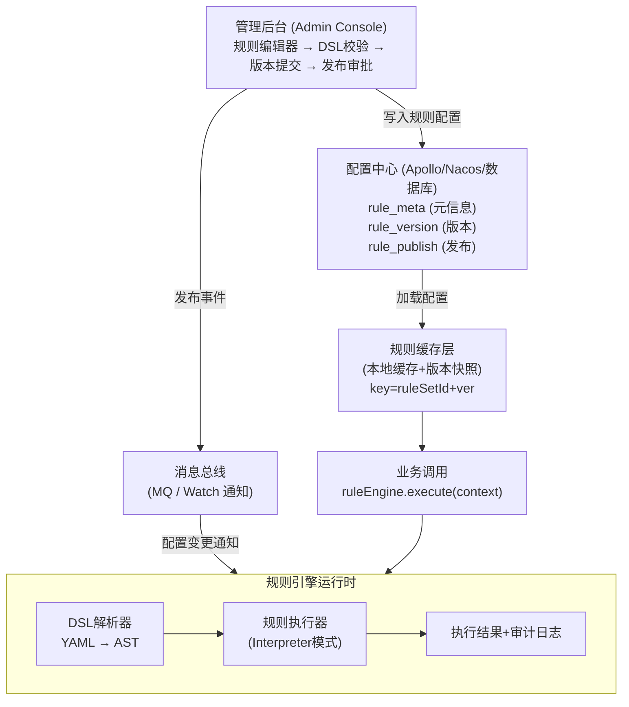

# 【滴滴面经】如果规则引擎要做成动态可配置的，你觉得应该怎么设计？

## 一、问题本质与设计目标

规则引擎动态可配置的核心目标是：**将业务规则从代码中抽离为数据配置，通过解析器解释执行，并支持不重启服务即可热更新。** 本质上就是把硬编码的 `if-else` 逻辑提升为可动态管理的数据。

设计目标拆解：

| 目标 | 说明 |
|------|------|
| **配置化** | 规则以 JSON/YAML DSL 描述，而非写死在 Java 代码中 |
| **热更新** | 修改配置后不重启服务，秒级生效 |
| **版本管理** | 每次修改产生新版本，支持灰度发布和一键回滚 |
| **可观测** | 规则执行过程可追踪、可审计、可灰度验证 |
| **高性能** | 规则编译后缓存，避免每次请求重新解析 |

---

## 二、整体架构



---

## 三、DSL 设计（YAML 格式）

采用 YAML 格式作为规则 DSL，兼顾可读性和结构化表达能力。每条规则由**条件（Condition）**和**动作（Action）**组成，规则集（RuleSet）是规则的有序集合。

### 3.1 完整 DSL 配置示例

```yaml
# rule-set: 滴滴出行价格补贴规则
meta:
  id: "rs-order-subsidy-001"
  name: "订单补贴规则集"
  version: "2.1.0"
  tenant: "didi-express"
  description: "根据城市、时段、用户等级计算订单补贴"
  status: "active"

# 规则集级别的上下文参数定义
context_schema:
  fields:
    - name: "city"
      type: "string"
      required: true
    - name: "hour"
      type: "integer"
      source: "time.hour()"
    - name: "user_level"
      type: "enum"
      values: ["bronze", "silver", "gold", "platinum"]
    - name: "order_amount"
      type: "decimal"
    - name: "is_peak"
      type: "boolean"
      source: "time.isPeakHour()"

# 规则列表（按优先级从高到低匹配，命中即返回）
rules:
  # 规则1: 早高峰金牌用户大单补贴
  - id: "rule-001"
    name: "早高峰金牌大单补贴"
    priority: 100
    enabled: true
    condition:
      logic: "AND"
      conditions:
        - field: "city"
          operator: "IN"
          values: ["北京", "上海", "深圳"]
        - field: "is_peak"
          operator: "EQ"
          value: true
        - field: "user_level"
          operator: "EQ"
          value: "platinum"
        - field: "order_amount"
          operator: "GTE"
          value: 50.00
    actions:
      - type: "SET"
        field: "subsidy_type"
        value: "peak_platinum_bonus"
      - type: "CALC"
        field: "subsidy_amount"
        formula: "order_amount * 0.15 + 10"
      - type: "LOG"
        level: "info"
        message: "命中早高峰金牌大单补贴规则"

  # 规则2: 晚高峰银牌用户补贴
  - id: "rule-002"
    name: "晚高峰银牌补贴"
    priority: 90
    enabled: true
    condition:
      logic: "AND"
      conditions:
        - field: "hour"
          operator: "BETWEEN"
          range: [17, 20]
        - field: "user_level"
          operator: "IN"
          values: ["silver", "gold"]
    actions:
      - type: "CALC"
        field: "subsidy_amount"
        formula: "order_amount * 0.08"
      - type: "SET"
        field: "subsidy_type"
        value: "evening_silver_bonus"

  # 规则3: 兜底规则——所有用户基础补贴
  - id: "rule-999"
    name: "基础补贴兜底"
    priority: 1
    enabled: true
    condition:
      logic: "ALWAYS"  # 永远命中
    actions:
      - type: "SET"
        field: "subsidy_amount"
        value: 0
      - type: "SET"
        field: "subsidy_type"
        value: "none"
```

### 3.2 DSL 设计要点

- **逻辑操作符**：支持 `AND`/`OR`/`NOT` 嵌套，形成条件树
- **比较操作符**：`EQ`/`NE`/`GT`/`GTE`/`LT`/`LTE`/`IN`/`NOT_IN`/`BETWEEN`/`CONTAINS`
- **动作类型**：`SET`（赋值）、`CALC`（计算）、`LOG`（日志）、`REJECT`（拒绝）、`CALL`（调用外部接口）
- **优先级**：数字越大优先级越高，默认 `first-match` 策略，也支持 `all-match`

---

## 四、规则解析器核心代码（解释器模式）

### 4.1 DSL 模型定义

```java
/**
 * 规则集模型
 */
@Data
public class RuleSet {
    private RuleSetMeta meta;
    private ContextSchema contextSchema;
    private List<Rule> rules;

    /** 按优先级降序排列 */
    public List<Rule> getSortedRules() {
        return rules.stream()
            .filter(Rule::isEnabled)
            .sorted(Comparator.comparing(Rule::getPriority).reversed())
            .collect(Collectors.toList());
    }
}

@Data
public class Rule {
    private String id;
    private String name;
    private int priority;
    private boolean enabled;
    private Condition condition;
    private List<Action> actions;
}

/**
 * 条件节点 —— 支持 AND / OR / NOT 嵌套
 */
@Data
public class Condition {
    private String logic;           // AND | OR | NOT | ALWAYS | LEAF
    private List<Condition> conditions;  // 子条件（AND/OR/NOT 时使用）

    // 叶子条件字段
    private String field;
    private String operator;        // EQ | GT | IN | BETWEEN ...
    private Object value;
    private List<Object> values;
    private Object[] range;
}

/**
 * 动作定义
 */
@Data
public class Action {
    private String type;    // SET | CALC | LOG | REJECT | CALL
    private String field;
    private Object value;
    private String formula; // CALC 类型用
    private String level;   // LOG 类型用
    private String message;
}
```

### 4.2 条件解释器（Interpreter 模式）

```java
/**
 * 条件解释器接口 —— 解释器模式核心
 */
public interface ConditionInterpreter {
    boolean interpret(RuleContext context);
}

/**
 * 叶子条件解释器：处理单个 field OP value
 */
public class LeafConditionInterpreter implements ConditionInterpreter {
    private final Condition condition;

    public LeafConditionInterpreter(Condition condition) {
        this.condition = condition;
    }

    @Override
    public boolean interpret(RuleContext context) {
        Object fieldValue = context.get(condition.getField());
        String op = condition.getOperator();

        return switch (op) {
            case "EQ"    -> Objects.equals(fieldValue, condition.getValue());
            case "NE"    -> !Objects.equals(fieldValue, condition.getValue());
            case "GT"    -> compare(fieldValue, condition.getValue()) > 0;
            case "GTE"   -> compare(fieldValue, condition.getValue()) >= 0;
            case "LT"    -> compare(fieldValue, condition.getValue()) < 0;
            case "LTE"   -> compare(fieldValue, condition.getValue()) <= 0;
            case "IN"    -> condition.getValues().contains(fieldValue);
            case "NOT_IN"-> !condition.getValues().contains(fieldValue);
            case "BETWEEN" -> {
                Object[] range = condition.getRange();
                yield compare(fieldValue, range[0]) >= 0
                   && compare(fieldValue, range[1]) <= 0;
            }
            case "CONTAINS" -> String.valueOf(fieldValue)
                                       .contains(String.valueOf(condition.getValue()));
            default -> throw new RuleEngineException("不支持的操作符: " + op);
        };
    }

    @SuppressWarnings({"rawtypes", "unchecked"})
    private int compare(Object a, Object b) {
        return ((Comparable) a).compareTo(b);
    }
}

/**
 * AND 逻辑解释器
 */
public class AndInterpreter implements ConditionInterpreter {
    private final List<ConditionInterpreter> children;

    public AndInterpreter(List<ConditionInterpreter> children) {
        this.children = children;
    }

    @Override
    public boolean interpret(RuleContext context) {
        return children.stream().allMatch(c -> c.interpret(context));
    }
}

/**
 * OR 逻辑解释器
 */
public class OrInterpreter implements ConditionInterpreter {
    private final List<ConditionInterpreter> children;

    public OrInterpreter(List<ConditionInterpreter> children) {
        this.children = children;
    }

    @Override
    public boolean interpret(RuleContext context) {
        return children.stream().anyMatch(c -> c.interpret(context));
    }
}

/**
 * NOT 逻辑解释器
 */
public class NotInterpreter implements ConditionInterpreter {
    private final ConditionInterpreter child;

    public NotInterpreter(ConditionInterpreter child) {
        this.child = child;
    }

    @Override
    public boolean interpret(RuleContext context) {
        return !child.interpret(context);
    }
}

/**
 * ALWAYS 解释器（兜底规则用）
 */
public class AlwaysTrueInterpreter implements ConditionInterpreter {
    @Override
    public boolean interpret(RuleContext context) {
        return true;
    }
}
```

### 4.3 条件解析器工厂 —— 将 DSL 节点编译为解释器树

```java
/**
 * 条件解析器：将 Condition DSL 递归编译为解释器树（AST）
 */
public class ConditionParser {

    public ConditionInterpreter parse(Condition condition) {
        if (condition == null) {
            return new AlwaysTrueInterpreter();
        }

        String logic = condition.getLogic();

        if ("ALWAYS".equals(logic) || logic == null) {
            return new AlwaysTrueInterpreter();
        }

        return switch (logic) {
            case "AND" -> new AndInterpreter(
                condition.getConditions().stream()
                    .map(this::parse)
                    .collect(Collectors.toList())
            );
            case "OR" -> new OrInterpreter(
                condition.getConditions().stream()
                    .map(this::parse)
                    .collect(Collectors.toList())
            );
            case "NOT" -> new NotInterpreter(
                parse(condition.getConditions().get(0))
            );
            case "LEAF" -> new LeafConditionInterpreter(condition);
            default     -> new LeafConditionInterpreter(condition);
        };
    }
}
```

### 4.4 规则引擎核心执行器

```java
/**
 * 规则引擎核心
 */
@Slf4j
public class RuleEngine {

    private final RuleSetCache ruleSetCache;
    private final ConditionParser conditionParser = new ConditionParser();
    private final ActionExecutor actionExecutor = new ActionExecutor();
    private final RuleAuditLogger auditLogger;

    /**
     * 执行规则集
     * @param ruleSetId  规则集ID
     * @param version    版本号（null 表示当前生效版本）
     * @param input      输入上下文
     * @return           规则执行结果
     */
    public RuleResult execute(String ruleSetId, String version,
                              Map<String, Object> input) {
        // 1. 加载规则集（从缓存或配置中心）
        CompiledRuleSet compiled = ruleSetCache.get(ruleSetId, version);
        if (compiled == null) {
            throw new RuleEngineException("规则集不存在: " + ruleSetId);
        }

        // 2. 构建运行时上下文
        RuleContext context = new RuleContext(input);

        // 3. 遍历规则（已按优先级排序）
        for (CompiledRule rule : compiled.getCompiledRules()) {
            boolean matched = rule.getConditionInterpreter().interpret(context);
            if (matched) {
                // 执行动作
                actionExecutor.execute(rule.getActions(), context);
                // 审计日志
                auditLogger.log(ruleSetId, compiled.getVersion(),
                                rule.getId(), context, true);
                // first-match 策略：命中即返回
                return RuleResult.matched(rule.getId(),
                                          context.getResultMap());
            }
        }

        // 无规则命中
        auditLogger.log(ruleSetId, compiled.getVersion(),
                        null, context, false);
        return RuleResult.notMatched(context.getResultMap());
    }
}

/**
 * 编译后的规则（将 Condition 预编译为解释器树，避免每次请求重新解析）
 */
@Data
public class CompiledRule {
    private String id;
    private String name;
    private int priority;
    private ConditionInterpreter conditionInterpreter;
    private List<Action> actions;
}

/**
 * 编译后的规则集
 */
@Data
public class CompiledRuleSet {
    private String version;
    private List<CompiledRule> compiledRules; // 已排序+已编译
    private long compileTimestamp;
}
```

---

## 五、热更新机制

### 5.1 配置中心监听 + 本地缓存替换

热更新的核心是**配置变更通知 → 重新编译规则 → 原子替换缓存**。

```java
/**
 * 规则集缓存管理 —— 支持热更新
 */
@Slf4j
@Component
public class RuleSetCacheManager {

    // key = ruleSetId, value = 当前生效的编译后规则集
    private final ConcurrentHashMap<String, CompiledRuleSet> activeCache
        = new ConcurrentHashMap<>();

    // 历史版本快照（用于回滚）
    private final Map<String, TreeMap<String, CompiledRuleSet>> versionSnapshots
        = new ConcurrentHashMap<>();

    private final RuleConfigLoader configLoader;
    private final ConditionParser conditionParser;

    /**
     * 初始化：注册配置变更监听器
     */
    @PostConstruct
    public void init() {
        // 监听配置中心的规则变更（以 Nacos 为例）
        configLoader.addListener(ruleSetId -> {
            log.info("检测到规则集 {} 配置变更，开始热更新...", ruleSetId);
            hotReload(ruleSetId);
        });
    }

    /**
     * 热更新：重新加载 → 编译 → 原子替换
     */
    private void hotReload(String ruleSetId) {
        try {
            // 1. 从配置中心拉取最新配置
            RuleSet ruleSet = configLoader.loadLatest(ruleSetId);
            if (ruleSet == null) return;

            // 2. DSL 校验（语法、字段引用、公式合法性）
            ValidationResult validation = validate(ruleSet);
            if (!validation.isValid()) {
                log.error("规则集 {} DSL 校验失败: {}", ruleSetId,
                          validation.getErrors());
                // 发告警，不替换旧版本
                alertService.send("规则热更新校验失败", validation.getErrors());
                return;
            }

            // 3. 编译为执行树
            CompiledRuleSet compiled = compile(ruleSet);

            // 4. 保存版本快照
            versionSnapshots
                .computeIfAbsent(ruleSetId, k -> new TreeMap<>())
                .put(compiled.getVersion(), compiled);

            // 5. 原子替换缓存（ConcurrentHashMap.put 是原子操作）
            CompiledRuleSet old = activeCache.put(ruleSetId, compiled);
            log.info("规则集 {} 热更新成功: {} -> {}",
                     ruleSetId,
                     old != null ? old.getVersion() : "null",
                     compiled.getVersion());

        } catch (Exception e) {
            log.error("规则集 {} 热更新异常，保持旧版本", ruleSetId, e);
            // 异常时不清除旧缓存，保证服务可用
        }
    }

    /**
     * 编译规则集：Condition → 解释器树
     */
    private CompiledRuleSet compile(RuleSet ruleSet) {
        List<CompiledRule> compiledRules = ruleSet.getSortedRules()
            .stream()
            .map(rule -> {
                CompiledRule cr = new CompiledRule();
                cr.setId(rule.getId());
                cr.setName(rule.getName());
                cr.setPriority(rule.getPriority());
                // 核心：将 Condition DSL 预编译为解释器树
                cr.setConditionInterpreter(conditionParser.parse(rule.getCondition()));
                cr.setActions(rule.getActions());
                return cr;
            })
            .collect(Collectors.toList());

        CompiledRuleSet result = new CompiledRuleSet();
        result.setVersion(ruleSet.getMeta().getVersion());
        result.setCompiledRules(compiledRules);
        result.setCompileTimestamp(System.currentTimeMillis());
        return result;
    }
}
```

### 5.2 热更新时正在执行的规则怎么办？

这是一个关键问题，采用**版本快照引用**策略：

```
正在执行中的请求 → 继续使用旧版本快照（引用不变）
新进来的请求    → 使用新版本（缓存已替换）
```

```java
/**
 * 每次请求获取的是编译后规则集的引用快照
 * 热更新替换的是缓存中的引用，正在执行的请求持有旧引用不受影响
 */
public RuleResult execute(String ruleSetId, Map<String, Object> input) {
    // 获取当前快照（此时拿到的是一个不可变的 CompiledRuleSet 引用）
    CompiledRuleSet snapshot = ruleSetCache.get(ruleSetId);
    // 后续执行都基于这个 snapshot，即使缓存被替换也不受影响
    return doExecute(snapshot, input);
}
```

`CompiledRuleSet` 是**不可变对象**（Immutable），热更新时创建新对象替换引用，不影响正在使用旧引用的请求。

---

## 六、版本管理与灰度发布

### 6.1 数据模型

```sql
-- 规则集元信息
CREATE TABLE rule_set_meta (
    id           VARCHAR(64) PRIMARY KEY,
    name         VARCHAR(128) NOT NULL,
    tenant       VARCHAR(64)  NOT NULL,
    description  TEXT,
    created_at   DATETIME     DEFAULT CURRENT_TIMESTAMP,
    updated_at   DATETIME     DEFAULT CURRENT_TIMESTAMP ON UPDATE CURRENT_TIMESTAMP
);

-- 规则版本表（每次修改产生新版本）
CREATE TABLE rule_version (
    id            BIGINT AUTO_INCREMENT PRIMARY KEY,
    rule_set_id   VARCHAR(64)  NOT NULL,
    version       VARCHAR(32)  NOT NULL,       -- 语义化版本号 1.0.0
    content       LONGTEXT     NOT NULL,       -- DSL YAML 原文
    status        VARCHAR(20)  DEFAULT 'DRAFT',-- DRAFT/REVIEWING/PUBLISHED/ROLLBACK
    changelog     TEXT,                        -- 变更说明
    created_by    VARCHAR(64),
    created_at    DATETIME     DEFAULT CURRENT_TIMESTAMP,
    published_at  DATETIME,
    UNIQUE KEY uk_set_version (rule_set_id, version)
);

-- 规则发布表（记录当前生效版本、灰度配置）
CREATE TABLE rule_publish (
    id            BIGINT AUTO_INCREMENT PRIMARY KEY,
    rule_set_id   VARCHAR(64)  NOT NULL,
    version       VARCHAR(32)  NOT NULL,
    strategy      VARCHAR(20)  NOT NULL,  -- FULL（全量）/ GRAY（灰度）/ AB_TEST
    gray_config   JSON,                   -- 灰度配置：按城市、用户ID取模等
    status        VARCHAR(20)  NOT NULL,  -- ACTIVE / INACTIVE
    operator      VARCHAR(64),
    created_at    DATETIME     DEFAULT CURRENT_TIMESTAMP,
    INDEX idx_set_active (rule_set_id, status)
);
```

### 6.2 灰度发布策略

```yaml
# 灰度发布配置示例
publish_strategy:
  type: "GRAY"
  rules:
    # 按城市灰度：先在北京验证
    - dimension: "city"
      values: ["北京"]
      percent: 100          # 北京100%流量使用新版本

    # 按用户ID取模灰度：5%用户先体验
    - dimension: "user_id_hash"
      mod: 100
      range: [0, 5]         # hash(userId) % 100 < 5 的用户使用新版本
```

灰度路由逻辑：

```java
public CompiledRuleSet resolveVersion(String ruleSetId,
                                       RuleContext context) {
    RulePublish publish = publishDao.findActive(ruleSetId);
    if (publish.getStrategy() == StrategyType.GRAY) {
        // 检查当前请求是否命中灰度
        if (grayRouter.shouldUseNewVersion(publish.getGrayConfig(), context)) {
            return cache.get(ruleSetId, publish.getVersion());
        }
        // 未命中灰度，使用上一个稳定版本
        return cache.get(ruleSetId, publish.getPreviousStableVersion());
    }
    // 全量发布
    return cache.get(ruleSetId, publish.getVersion());
}
```

### 6.3 版本回滚

```java
/**
 * 一键回滚到指定版本
 */
public void rollback(String ruleSetId, String targetVersion) {
    // 1. 校验目标版本存在且不是当前版本
    CompiledRuleSet target = versionSnapshots.get(ruleSetId).get(targetVersion);
    if (target == null) {
        // 从数据库重新加载
        target = reloadFromDb(ruleSetId, targetVersion);
    }

    // 2. 原子替换缓存
    activeCache.put(ruleSetId, target);

    // 3. 更新发布记录
    publishDao.updateStatus(ruleSetId, "ACTIVE", targetVersion);
    publishDao.insertHistory(ruleSetId, targetVersion, "ROLLBACK");

    log.warn("规则集 {} 回滚到版本 {}", ruleSetId, targetVersion);
}
```

---

## 七、完整工作流总结

```
┌──────────┐    ┌──────────┐    ┌──────────┐    ┌──────────┐
│ 1.编辑DSL │ -> │ 2.校验   │ -> │ 3.提交   │ -> │ 4.审批   │
│ (管理后台)│    │(语法检查) │    │ (新版本) │    │ (人工)   │
└──────────┘    └──────────┘    └──────────┘    └────┬─────┘
                                                     │
┌──────────┐    ┌──────────┐    ┌──────────┐         │
│ 8.监控   │ <- │ 7.全量   │ <- │ 6.灰度   │ <───────┘
│ (执行统计)│    │ 发布     │    │ 验证     │    (5.发布)
└──────────┘    └──────────┘    └──────────┘
     │
     ▼ 支持回滚到任意历史版本
┌──────────┐
│ 9.回滚   │
│ (一键回滚)│
└──────────┘
```

**关键设计决策总结**：

| 决策点 | 方案 | 理由 |
|--------|------|------|
| DSL 格式 | YAML | 可读性好，支持注释，运维和业务都能看懂 |
| 执行模式 | 解释器模式 + 编译缓存 | 兼顾灵活性和性能（编译只做一次） |
| 热更新 | 配置中心 Watch + 原子替换 | 不停机、秒级生效、失败自动保留旧版本 |
| 并发安全 | 不可变对象 + CAS 替换 | 正在执行的请求不受影响 |
| 版本管理 | 语义化版本 + DB 持久化 | 全量历史可追溯、一键回滚 |
| 灰度发布 | 多维度灰度路由 | 降低规则变更风险 |

## 记忆要点

- 核心目标：规则抽离代码转DSL，依托配置中心实现热更新
- 运行机制：DSL解析转AST语法树，编译结果缓存兼顾灵活性性能
- 架构闭环：后台管理配置版本，监听变更，本地缓存加速执行


## 苏格拉底式面试追问

> 这组追问模拟面试官层层逼问，每一问先回答"为什么"，再回答"怎么做"，最后回答"如何证明"。

### 第一层：目标与动机

**Q：动态规则引擎你为什么用 DSL（JSON/YAML）而不是直接用 Java 代码 + 动态编译（Groovy/Aviator）？**

因为 DSL 更安全、更可控。Groovy/Aviator 脚本是"代码"，可以写任意逻辑（循环、调用系统命令），存在注入风险——运营写错脚本可能导致 OOM 或死循环。而且 Groovy 动态编译有 ClassLoader 泄漏问题（每次编译生成新 Class，长期运行 PermGen 溢出）。DSL 是"数据"——只能描述"条件 → 动作"的结构，由解析器（解释器模式）执行，运营写错最多是规则不生效，不会搞挂系统。决策依据：规则编写者是运营/产品（非开发），DSL 的表达能力够用且安全，代码级脚本风险太高。

### 第二层：证据与定位

**Q：规则热更新后，部分请求还是按旧规则执行，你怎么定位？**

查配置传播链路：
1. 配置中心推送——确认 Nacos/Apollo 是否推送了新配置到所有实例（看各实例的配置监听日志）。
2. 本地缓存更新——实例收到配置变更事件后是否重建了规则解析结果（AST 缓存）。如果事件监听器异常，本地还是旧缓存。
3. 长连接请求——正在执行的抽奖请求可能用的是旧规则（请求开始时加载的规则版本），热更新对"进行中的请求"不生效，只对新请求生效。

### 第三层：根因深挖

**Q：配置推送成功了、本地缓存也更新了，但规则执行结果还是旧的，根因是什么？**

最可能是 DSL 解析结果缓存没失效。动态规则引擎为了性能，通常把 DSL 解析成 AST 后缓存（避免每次重新解析）。如果配置变更时只更新了"原始 DSL 文本"但没清"AST 缓存"，执行时用的还是旧 AST。根因是缓存的 key 没包含版本号，或缓存失效逻辑遗漏。另一种可能是 DSL 语法错误——新配置的 DSL 有语法问题，解析失败默默回退到旧规则（fail-safe 设计）。要看解析日志是否有 parse error。

**Q：为什么不直接每次规则执行都重新解析 DSL，不就不用管缓存失效了？**

因为性能扛不住。DSL 解析（JSON → AST）是相对重的操作（JSON 反序列化 + 语法树构建），单次可能 0.5-1ms。万级 QPS 下每秒万次解析，CPU 占用高。抽奖是热路径，规则执行必须 < 1ms 总耗时，解析占了大头不行。正确做法是"解析一次、缓存 AST、热更新时重建"——解析是低频的（配置变更时），执行是高频的（每次抽奖），用缓存把高频执行的代价降到最低（AST 执行只需遍历树，纳秒级）。这是经典的"编译期 vs 运行期"分离。

### 第四层：方案权衡

**Q：DSL 你用 JSON，为什么不用 YAML（更简洁）或自定义语法（更强大）？**

各有优劣：
1. JSON——通用性强、解析库多、前后端一致（前端也能处理），缺点是冗长（括号多）。
2. YAML——简洁（缩进表示结构），缺点是缩进敏感容易写错、解析库不如 JSON 通用。
3. 自定义 DSL（如 `WHEN user.isVip THEN boost 1.2`）——表达力强、非技术人员易读，缺点是要写词法/语法分析器（ANTLR），开发和维护成本高。

权衡：JSON 是"通用 + 够用"的折中。规则结构简单（条件 + 动作），JSON 的冗长可以接受。如果运营要直接编辑规则（不通过前端表单），自定义 DSL 更友好，但要投入开发成本。大多数团队先用 JSON + 后台表单（表单生成 JSON，运营点选不手写），既安全又易用。

**Q：为什么不直接用开源规则引擎（Drools/QLExpress）的 DSL，而要自己设计 JSON DSL？**

因为开源 DSL 的学习成本和定制性。Drools 的 DRL 语法强大但复杂，运营学不会，还是要开发翻译。QLExpress 是阿里开源的轻量脚本引擎，语法接近 Java，适合开发用但不适合运营。自研 JSON DSL 配合可视化后台（运营点选条件 + 动作，系统生成 JSON），运营零学习成本。而且自研 DSL 可以针对业务定制（预定义"用户属性""奖品""加权"等领域词汇），表达更精准。开源引擎适合"通用规则 + 开发配置"，自研适合"垂直领域 + 运营配置"。

### 第五层：验证与沉淀

**Q：你怎么证明规则热更新是安全的（不会因为错误配置搞挂系统）？**

三层保障：
1. 语法校验——配置发布前校验 DSL 语法（JSON schema + 业务规则校验，如概率和 = 100%），校验失败拒绝发布。
2. 灰度发布——新规则先对 1% 流量生效，观察 10 分钟无异常再全量。
3. 版本回滚——规则配置有版本历史，一键回滚到上一版本，秒级生效。

验证手段：发布前在"规则沙箱"环境跑一遍测试用例，确认输出符合预期才允许生产发布。

**Q：动态规则引擎怎么沉淀？**

1. 规则 DSL 标准化——定义公司级的规则 DSL 规范（JSON schema），跨业务复用（抽奖、营销、风控）。
2. 可视化后台——运营友好的规则编辑器（拖拽条件、点选动作），降低出错率。
3. 规则版本治理——规则配置纳入版本控制（Git 或类似），变更走审批流，每次变更记录"谁改了什么、为什么改"，可追溯。


## 结构化回答

**30 秒电梯演讲：** 动态规则引擎 就是 DSL + 规则解析器 + 热更新机制，实现不改代码即可调整规则。打个比方，就像乐高积木——你不重新开模，只需按说明书拼装不同积木就能搭出各种造型。

**展开框架：**
1. **核心目标** — 规则抽离代码转DSL，依托配置中心实现热更新
2. **运行机制** — DSL解析转AST语法树，编译结果缓存兼顾灵活性性能
3. **架构闭环** — 后台管理配置版本，监听变更，本地缓存加速执行

**收尾：** 这块我踩过坑——要不要深入聊：DSL用什么格式最好？

## 视频脚本

> 预计时长：4 分钟 | 由浅入深

| 时间 | 画面/字幕 | 口播台词 | 讲解要点 |
|------|----------|----------|----------|
| 0:00 | 标题卡 | "微服务一句话：动态规则引擎 就是 DSL + 规则解析器 + 热更新机制，实现不改代码即可调整规则。" | 开场钩子 |
| 0:15 | 架构示意图 | "核心目标：规则抽离代码转DSL，依托配置中心实现热更新" | 核心目标 |
| 1:08 | 架构示意图分步演示 | "运行机制：DSL解析转AST语法树，编译结果缓存兼顾灵活性性能" | 运行机制 |
| 2:01 | 关键代码/伪代码片段 | "架构闭环：后台管理配置版本，监听变更，本地缓存加速执行" | 架构闭环 |
| 2:54 | 对比表格 | "JSON/YAML DSL" | JSON/YAML |
| 3:50 | 总结卡 | "核心抓住这条主线，下期咱们接着聊：DSL用什么格式最好。" | 收尾 |
