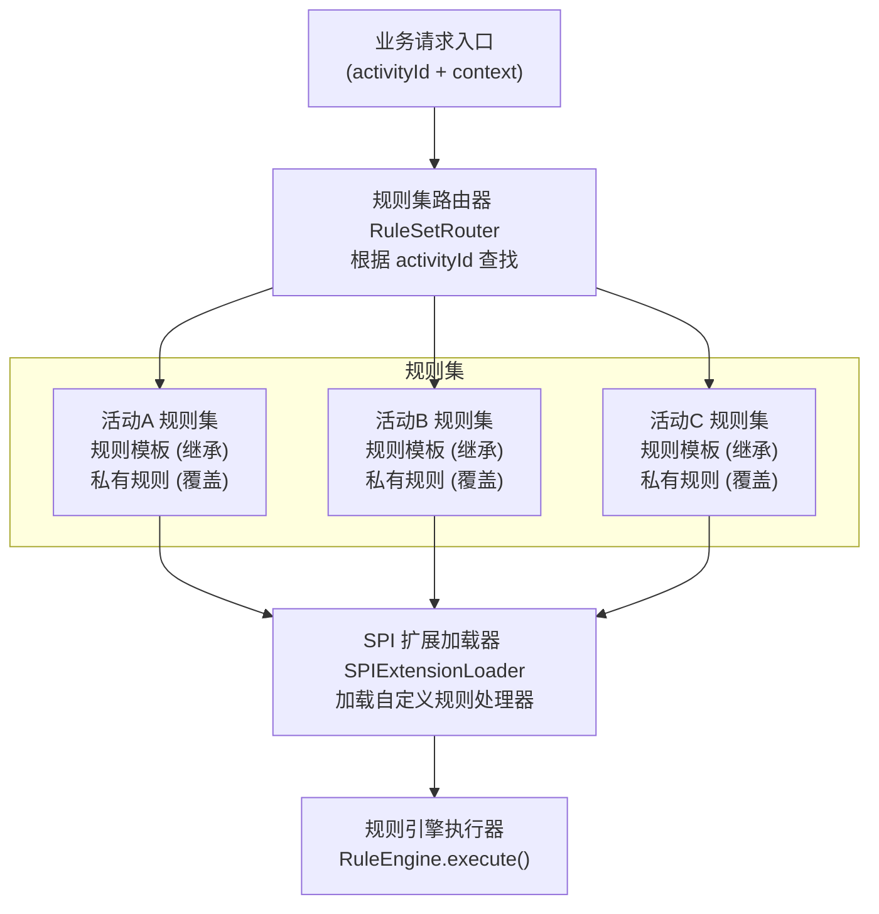

# 【滴滴面经】如果不同活动下规则组合不一样，系统要怎么支持？

## 一、问题分析

滴滴出行场景中，同时存在多种活动：**新年红包活动、周末打车折扣、拼车优惠、会员日福利**等。每种活动的规则组合各不相同：

- **新年红包活动**：校验红包有效期 → 计算红包抵扣金额 → 叠加平台补贴
- **周末打车折扣**：判断是否周末 → 按城市档位打折 → 限制折扣上限
- **拼车优惠**：匹配拼成人数 → 计算拼车折扣 → 校验最低消费门槛

如果为每个活动写一套 `if-else`，代码会爆炸式增长，且每次新增活动都要改代码发版。**核心解法是将规则集抽象化，通过活动绑定 + 规则继承 + SPI 扩展机制，实现多活动的灵活组合。**

---

## 二、多租户规则架构设计

### 2.1 整体架构图



### 2.2 核心概念

| 概念 | 说明 | 类比 |
|------|------|------|
| **规则集模板（RuleSet Template）** | 通用的规则集合，多个活动可继承使用 | 面向对象的父类 |
| **活动绑定（Activity Binding）** | 每个活动关联一个或多个规则集 | 接口与实现的绑定 |
| **规则继承（Rule Inheritance）** | 子规则集继承父模板的规则，并可覆盖 | 子类继承父类方法 |
| **规则覆盖（Override）** | 子规则集覆盖父模板中同ID的规则 | 方法重写 |
| **SPI 扩展** | 通过 Java SPI 机制加载自定义规则处理器 | 策略模式的动态实现 |

---

## 三、规则集模板与继承机制

### 3.1 规则集继承 DSL

```yaml
# ============ 父模板：通用补贴规则模板 ============
meta:
  id: "tpl-base-subsidy"
  name: "通用补贴基础模板"
  type: "TEMPLATE"          # TEMPLATE 表示可被继承
  abstract: true            # 抽象模板，不能直接执行

rules:
  # 基础规则1：校验城市是否在活动范围内
  - id: "check_city"
    name: "城市白名单校验"
    priority: 200
    condition:
      logic: "AND"
      conditions:
        - field: "city"
          operator: "IN"
          values: ["北京", "上海", "广州", "深圳", "杭州", "成都"]
    actions:
      - type: "PASS"        # 通过，继续后续规则

  # 基础规则2：用户黑名单拦截
  - id: "check_blacklist"
    name: "黑名单用户拦截"
    priority: 190
    condition:
      logic: "AND"
      conditions:
        - field: "is_blacklisted"
          operator: "EQ"
          value: true
    actions:
      - type: "REJECT"
        message: "用户在黑名单中，不参与活动"

  # 基础规则3：补贴上限控制
  - id: "subsidy_cap"
    name: "补贴金额上限"
    priority: 10
    condition:
      logic: "LEAF"
      field: "subsidy_amount"
      operator: "GT"
      value: 100.00
    actions:
      - type: "SET"
        field: "subsidy_amount"
        value: 100.00

# ============ 子规则集：新年红包活动（继承父模板）============
meta:
  id: "rs-newyear-hongbao"
  name: "新年红包活动规则集"
  type: "RULE_SET"
  extends: "tpl-base-subsidy"    # 继承父模板
  tenant: "didi-marketing"
  version: "1.2.0"

# 继承策略配置
inheritance:
  strategy: "MERGE"              # MERGE(合并) | OVERRIDE_ONLY(仅覆盖) | EXTEND(追加)
  override_rules:                # 覆盖父模板中的规则
    - id: "check_city"           # 覆盖城市白名单
      override:
        condition:
          conditions:
            - field: "city"
              operator: "IN"
              values: ["北京", "上海", "深圳"]  # 新年活动只在三个城市

    - id: "subsidy_cap"          # 覆盖补贴上限
      override:
        condition:
          field: "subsidy_amount"
          operator: "GT"
          value: 200.00          # 新年活动补贴上限提高到200
        actions:
          - type: "SET"
            field: "subsidy_amount"
            value: 200.00

# 新年活动独有的规则（追加到继承的规则之后）
rules:
  - id: "newyear_red_packet"
    name: "新年红包计算"
    priority: 150
    condition:
      logic: "AND"
      conditions:
        - field: "activity_type"
          operator: "EQ"
          value: "newyear_hongbao"
        - field: "red_packet_amount"
          operator: "GT"
          value: 0
    actions:
      - type: "CALC"
        field: "subsidy_amount"
        formula: "red_packet_amount + order_amount * 0.05"
      - type: "SET"
        field: "subsidy_type"
        value: "newyear_hongbao"

  # SPI 扩展规则：调用自定义处理器
  - id: "newyear_lucky_draw"
    name: "新年抽奖资格"
    priority: 50
    condition:
      logic: "SPI"
      spi: "com.didi.rules.spi.NewYearLuckyDrawCondition"  # SPI 实现
    actions:
      - type: "SPI"
        spi: "com.didi.rules.spi.NewYearLuckyDrawAction"

# ============ 子规则集：周末折扣活动（继承父模板）============
meta:
  id: "rs-weekend-discount"
  name: "周末打车折扣规则集"
  type: "RULE_SET"
  extends: "tpl-base-subsidy"
  version: "2.0.0"

inheritance:
  strategy: "MERGE"
  override_rules:
    - id: "subsidy_cap"
      override:
        condition:
          field: "subsidy_amount"
          operator: "GT"
          value: 50.00          # 周末折扣上限50元
        actions:
          - type: "SET"
            field: "subsidy_amount"
            value: 50.00

rules:
  - id: "weekend_discount_calc"
    name: "周末折扣计算"
    priority: 150
    condition:
      logic: "AND"
      conditions:
        - field: "is_weekend"
          operator: "EQ"
          value: true
        - field: "city"
          operator: "IN"
          values: ["北京", "上海", "广州", "深圳"]
    actions:
      - type: "CALC"
        field: "discount_rate"
        formula: "city == '北京' ? 0.15 : 0.10"  # 北京15折, 其他10折
      - type: "CALC"
        field: "subsidy_amount"
        formula: "order_amount * discount_rate"
```

---

## 四、活动绑定机制

### 4.1 活动-规则集绑定数据模型

```sql
-- 活动表
CREATE TABLE marketing_activity (
    id           BIGINT AUTO_INCREMENT PRIMARY KEY,
    activity_id  VARCHAR(64)  UNIQUE NOT NULL,
    name         VARCHAR(128) NOT NULL,
    status       VARCHAR(20)  DEFAULT 'CREATED',  -- CREATED/ACTIVE/PAUSED/ENDED
    start_time   DATETIME,
    end_time     DATETIME,
    created_at   DATETIME     DEFAULT CURRENT_TIMESTAMP
);

-- 活动-规则集绑定表（多对多）
CREATE TABLE activity_rule_binding (
    id            BIGINT AUTO_INCREMENT PRIMARY KEY,
    activity_id   VARCHAR(64)  NOT NULL,
    rule_set_id   VARCHAR(64)  NOT NULL,
    rule_set_version VARCHAR(32),    -- 绑定到特定版本，NULL=跟随最新
    execution_order INT DEFAULT 1,   -- 一个活动可绑定多个规则集，按顺序执行
    is_enabled    TINYINT(1)   DEFAULT 1,
    UNIQUE KEY uk_binding (activity_id, rule_set_id),
    INDEX idx_activity (activity_id, is_enabled)
);
```

### 4.2 规则集路由器

```java
/**
 * 规则集路由器：根据活动ID查找绑定的规则集
 * 这是多活动规则支持的核心入口
 */
@Slf4j
@Component
public class RuleSetRouter {

    @Autowired
    private ActivityRuleBindingDao bindingDao;

    @Autowired
    private RuleSetCacheManager ruleSetCache;

    @Autowired
    private RuleInheritanceResolver inheritanceResolver;

    /**
     * 根据活动ID解析规则集列表
     */
    public List<CompiledRuleSet> resolve(String activityId) {
        // 1. 查询活动绑定的规则集列表
        List<ActivityRuleBinding> bindings =
            bindingDao.findByActivityId(activityId);
        if (bindings.isEmpty()) {
            log.warn("活动 {} 未绑定任何规则集", activityId);
            return Collections.emptyList();
        }

        // 2. 按 execution_order 排序
        bindings.sort(Comparator.comparing(ActivityRuleBinding::getExecutionOrder));

        // 3. 逐个解析规则集（处理继承关系）
        List<CompiledRuleSet> ruleSets = new ArrayList<>();
        for (ActivityRuleBinding binding : bindings) {
            if (!binding.isEnabled()) continue;

            CompiledRuleSet compiled = resolveWithInheritance(
                binding.getRuleSetId(),
                binding.getRuleSetVersion()
            );
            ruleSets.add(compiled);
        }
        return ruleSets;
    }

    /**
     * 解析规则集，处理继承与覆盖
     */
    private CompiledRuleSet resolveWithInheritance(String ruleSetId,
                                                    String version) {
        // 获取当前规则集配置
        RuleSet ruleSet = ruleSetCache.loadRuleSet(ruleSetId, version);

        // 如果没有继承关系，直接编译返回
        if (ruleSet.getMeta().getExtends() == null) {
            return compileRuleSet(ruleSet);
        }

        // 有继承关系：递归解析父模板，再合并覆盖
        return inheritanceResolver.resolve(ruleSet);
    }
}
```

---

## 五、规则继承与覆盖实现

### 5.1 继承解析器

```java
/**
 * 规则继承解析器
 * 递归加载父模板，合并规则，处理覆盖逻辑
 */
@Slf4j
@Component
public class RuleInheritanceResolver {

    @Autowired
    private RuleSetCacheManager ruleSetCache;

    @Autowired
    private ConditionParser conditionParser;

    /**
     * 解析继承关系，返回合并后的编译规则集
     */
    public CompiledRuleSet resolve(RuleSet childRuleSet) {
        String parentId = childRuleSet.getMeta().getExtends();
        log.debug("规则集 {} 继承自 {}", childRuleSet.getMeta().getId(), parentId);

        // 1. 递归解析父模板（父模板可能也有父模板）
        RuleSet parentRuleSet = ruleSetCache.loadRuleSet(parentId, null);
        List<Rule> parentRules = new ArrayList<>();
        if (parentRuleSet.getMeta().getExtends() != null) {
            // 递归解析
            CompiledRuleSet grandParent = resolve(parentRuleSet);
            parentRules.addAll(extractRules(grandParent));
        } else {
            parentRules.addAll(parentRuleSet.getRules());
        }

        // 2. 根据继承策略处理
        InheritanceConfig inheritance = childRuleSet.getInheritance();
        List<Rule> mergedRules = switch (inheritance.getStrategy()) {
            case MERGE          -> mergeRules(parentRules, childRuleSet);
            case OVERRIDE_ONLY  -> overrideOnly(parentRules, inheritance);
            case EXTEND         -> extendRules(parentRules, childRuleSet);
        };

        // 3. 重新排序并编译
        RuleSet merged = new RuleSet();
        merged.setRules(mergedRules);
        merged.setMeta(childRuleSet.getMeta());
        return compileRuleSet(merged);
    }

    /**
     * MERGE 策略：父规则 + 子覆盖 + 子新增
     */
    private List<Rule> mergeRules(List<Rule> parentRules, RuleSet child) {
        // 以父规则为基础，key=ruleId
        Map<String, Rule> ruleMap = new LinkedHashMap<>();
        for (Rule r : parentRules) {
            ruleMap.put(r.getId(), r);
        }

        // 处理子规则集中的覆盖
        InheritanceConfig inheritance = child.getInheritance();
        if (inheritance != null && inheritance.getOverrideRules() != null) {
            for (OverrideConfig override : inheritance.getOverrideRules()) {
                Rule parentRule = ruleMap.get(override.getId());
                if (parentRule != null) {
                    // 合并覆盖：字段级覆盖（只覆盖配置了的字段）
                    Rule overridden = applyOverride(parentRule, override.getOverride());
                    ruleMap.put(override.getId(), overridden);
                    log.debug("规则 {} 被子规则集覆盖", override.getId());
                }
            }
        }

        // 追加子规则集独有的规则
        if (child.getRules() != null) {
            for (Rule r : child.getRules()) {
                ruleMap.put(r.getId(), r);  // 同ID则覆盖，不同ID则新增
            }
        }

        return new ArrayList<>(ruleMap.values());
    }

    /**
     * 字段级覆盖：只覆盖子规则集中指定的字段
     */
    private Rule applyOverride(Rule parent, Rule override) {
        Rule merged = deepCopy(parent);
        if (override.getCondition() != null) {
            merged.setCondition(override.getCondition());
        }
        if (override.getActions() != null) {
            merged.setActions(override.getActions());
        }
        if (override.getPriority() != 0) {
            merged.setPriority(override.getPriority());
        }
        if (override.getName() != null) {
            merged.setName(override.getName());
        }
        return merged;
    }
}
```

---

## 六、SPI 扩展机制

当 DSL 无法表达的复杂逻辑（如调用外部风控接口、复杂的多步计算），通过 **Java SPI（Service Provider Interface）** 机制动态加载自定义处理器。

### 6.1 SPI 接口定义

```java
/**
 * 规则条件 SPI 接口 —— 用于自定义复杂条件判断
 */
@SPI("ruleCondition")
public interface RuleConditionSPI {
    /**
     * 自定义条件判断
     * @param context 规则上下文
     * @return 是否满足条件
     */
    boolean evaluate(RuleContext context);
}

/**
 * 规则动作 SPI 接口 —— 用于自定义复杂动作执行
 */
@SPI("ruleAction")
public interface RuleActionSPI {
    /**
     * 自定义动作执行
     */
    void execute(RuleContext context);
}
```

### 6.2 SPI 实现示例

```java
/**
 * 新年抽奖资格判断 —— SPI 实现
 * 调用抽奖服务判断用户是否有抽奖资格
 */
@SPIActivate("newyear_lucky_draw")
public class NewYearLuckyDrawCondition implements RuleConditionSPI {

    @Autowired
    private LuckyDrawService luckyDrawService;

    @Override
    public boolean evaluate(RuleContext context) {
        String userId = context.get("user_id");
        String activityId = context.get("activity_id");

        // 调用抽奖服务判断资格
        LuckyDrawQualifyResult result =
            luckyDrawService.checkQualify(userId, activityId);

        context.set("has_lucky_draw", result.isQualified());
        return result.isQualified();
    }
}

/**
 * 新年抽奖执行 —— SPI 实现
 */
@SPIActivate("newyear_lucky_draw")
public class NewYearLuckyDrawAction implements RuleActionSPI {

    @Autowired
    private LuckyDrawService luckyDrawService;

    @Override
    public void execute(RuleContext context) {
        String userId = context.get("user_id");
        int luckyCount = context.getInt("lucky_draw_count");

        // 发放抽奖券
        luckyDrawService.grantLuckyTickets(userId, luckyCount);
        context.set("subsidy_type", "newyear_lucky_draw");
    }
}
```

### 6.3 SPI 加载器

```java
/**
 * SPI 扩展加载器
 * 基于 Java ServiceLoader + 自定义注解实现
 */
@Component
@Slf4j
public class SPIExtensionLoader {

    // SPI 实例缓存：spiName -> 实例
    private final Map<String, RuleConditionSPI> conditionCache = new ConcurrentHashMap<>();
    private final Map<String, RuleActionSPI> actionCache = new ConcurrentHashMap<>();

    @PostConstruct
    public void init() {
        // 加载所有条件 SPI 实现
        ServiceLoader<RuleConditionSPI> conditionLoader =
            ServiceLoader.load(RuleConditionSPI.class);
        for (RuleConditionSPI impl : conditionLoader) {
            SPIActivate annotation = impl.getClass()
                .getAnnotation(SPIActivate.class);
            if (annotation != null) {
                String name = annotation.value();
                conditionCache.put(name, impl);
                log.info("加载条件SPI实现: {} -> {}",
                         name, impl.getClass().getSimpleName());
            }
        }

        // 加载所有动作 SPI 实现
        ServiceLoader<RuleActionSPI> actionLoader =
            ServiceLoader.load(RuleActionSPI.class);
        for (RuleActionSPI impl : actionLoader) {
            SPIActivate annotation = impl.getClass()
                .getAnnotation(SPIActivate.class);
            if (annotation != null) {
                String name = annotation.value();
                actionCache.put(name, impl);
                log.info("加载动作SPI实现: {} -> {}",
                         name, impl.getClass().getSimpleName());
            }
        }
    }

    /**
     * 获取条件 SPI 实现
     */
    public RuleConditionSPI getConditionSPI(String name) {
        RuleConditionSPI spi = conditionCache.get(name);
        if (spi == null) {
            throw new RuleEngineException("未找到条件SPI实现: " + name);
        }
        return spi;
    }

    /**
     * 获取动作 SPI 实现
     */
    public RuleActionSPI getActionSPI(String name) {
        RuleActionSPI spi = actionCache.get(name);
        if (spi == null) {
            throw new RuleEngineException("未找到动作SPI实现: " + name);
        }
        return spi;
    }
}
```

SPI 配置文件 `META-INF/services/com.didi.rules.spi.RuleConditionSPI`：

```
com.didi.rules.spi.impl.NewYearLuckyDrawCondition
com.didi.rules.spi.impl.WeekendSpecialCondition
com.didi.rules.spi.impl.MembershipDayCondition
```

### 6.4 规则执行器集成 SPI

```java
/**
 * 支持 SPI 的条件解释器
 */
public class SPIConditionInterpreter implements ConditionInterpreter {
    private final SPIExtensionLoader spiLoader;
    private final String spiName;

    public SPIConditionInterpreter(SPIExtensionLoader spiLoader, String spiName) {
        this.spiLoader = spiLoader;
        this.spiName = spiName;
    }

    @Override
    public boolean interpret(RuleContext context) {
        RuleConditionSPI spi = spiLoader.getConditionSPI(spiName);
        return spi.evaluate(context);
    }
}

/**
 * 支持 SPI 的动作执行器
 */
public class SPIActionExecutor implements ActionExecutor {
    private final SPIExtensionLoader spiLoader;

    @Override
    public void execute(Action action, RuleContext context) {
        if ("SPI".equals(action.getType())) {
            String spiName = action.getSpi();
            RuleActionSPI spi = spiLoader.getActionSPI(spiName);
            spi.execute(context);
        }
        // ... 其他 action 类型处理
    }
}
```

---

## 七、多活动规则执行流程

### 7.1 完整调用链

```java
/**
 * 多活动规则执行入口
 */
@RestController
@RequestMapping("/api/rule")
public class RuleController {

    @Autowired
    private RuleSetRouter ruleSetRouter;

    @Autowired
    private RuleEngine ruleEngine;

    @Autowired
    private SPIExtensionLoader spiLoader;

    /**
     * 执行活动规则
     */
    @PostMapping("/execute")
    public RuleResult execute(@RequestBody RuleExecuteRequest request) {
        String activityId = request.getActivityId();
        Map<String, Object> input = request.getContext();

        // 1. 路由：根据 activityId 查找绑定的规则集列表
        List<CompiledRuleSet> ruleSets = ruleSetRouter.resolve(activityId);

        if (ruleSets.isEmpty()) {
            return RuleResult.notMatched(input);
        }

        // 2. 依次执行每个规则集（按 binding 中的 execution_order 顺序）
        RuleContext context = new RuleContext(input);
        context.set("activity_id", activityId);

        for (CompiledRuleSet ruleSet : ruleSets) {
            RuleResult result = ruleEngine.execute(ruleSet, context);
            if (result.isRejected()) {
                // 某个规则集拒绝了，直接返回
                return result;
            }
            // 将结果合并到上下文，供下一个规则集使用
            context.merge(result.getOutput());
        }

        return RuleResult.success(context.getResultMap());
    }
}
```

### 7.2 执行流程图

```
请求: { activityId: "newyear_2024", context: { city: "北京", ... } }
                              │
                              ▼
              ┌───────────────────────────┐
              │  1. RuleSetRouter.resolve  │
              │  activityId → 查绑定表      │
              │  → [rs-newyear-hongbao]    │
              └──────────────┬────────────┘
                             │
                             ▼
              ┌───────────────────────────┐
              │  2. InheritanceResolver    │
              │  加载 tpl-base-subsidy     │
              │  合并父规则 + 子覆盖 + 子新增│
              └──────────────┬────────────┘
                             │
                             ▼
              ┌───────────────────────────┐
              │  3. RuleEngine.execute     │
              │  按优先级执行规则:           │
              │  check_city(被覆盖) ✓      │
              │  check_blacklist ✓         │
              │  newyear_red_packet ✓      │
              │  newyear_lucky_draw(SPI) ✓ │
              │  subsidy_cap(被覆盖) ✓     │
              └──────────────┬────────────┘
                             │
                             ▼
              ┌───────────────────────────┐
              │  4. 返回执行结果             │
              │  subsidy_amount: 35.00     │
              │  subsidy_type: newyear_... │
              │  has_lucky_draw: true      │
              └───────────────────────────┘
```

---

## 八、设计要点总结

### 8.1 关键决策

| 决策点 | 方案 | 解决的问题 |
|--------|------|------------|
| **规则集模板** | 抽象模板 + `extends` 继承 | 复用公共规则，避免每个活动重复定义 |
| **继承策略** | MERGE / OVERRIDE_ONLY / EXTEND | 灵活的继承组合方式 |
| **活动绑定** | `activity_rule_binding` 表解耦 | 活动↔规则集多对多绑定，新增活动不改代码 |
| **规则覆盖** | 字段级覆盖（非整体替换） | 只覆盖需要改的字段，其他保持父模板逻辑 |
| **SPI 扩展** | Java SPI + 自定义注解 | DSL 无法表达的复杂逻辑用代码扩展 |

### 8.2 与 005 题（动态可配置规则引擎）的关系

本题建立在 005 题的基础之上：

```
005 题（基础层）              006 题（扩展层）
┌──────────────┐            ┌──────────────────┐
│ DSL + 解析器  │  ────────▶ │ 规则集模板 + 继承  │
│ 热更新       │            │ 活动绑定          │
│ 版本管理     │            │ SPI 扩展          │
└──────────────┘            └──────────────────┘
单规则集的动态配置             多活动的规则组合管理
```

005 题解决了「单规则集如何动态配置」，006 题在此基础上解决「多个活动如何复用和组合不同的规则集」。两者结合，构成了完整的**营销活动规则引擎架构**。

### 8.3 生产环境注意事项

1. **性能**：规则集继承合并后缓存编译结果，避免每次请求递归解析；SPI 实现需注意线程安全
2. **灰度**：新活动规则集上线时支持灰度绑定（部分流量先验证）
3. **监控**：按 `activityId + ruleSetId` 维度监控规则命中率、执行耗时、异常率
4. **隔离**：不同活动的规则执行结果需做上下文隔离，避免规则间意外影响
5. **测试**：提供规则集试跑（Dry Run）能力，在线上数据副本上验证规则配置正确性

## 记忆要点

- 核心方案：规则集模板化，各活动绑定独立规则集实现解耦
- 灵活扩展：私有规则可覆盖模板，结合SPI加载定制化逻辑
- 路由机制：以活动ID为Key，动态路由并装载对应规则组合


## 苏格拉底式面试追问

> 这组追问模拟面试官层层逼问，每一问先回答"为什么"，再回答"怎么做"，最后回答"如何证明"。

### 第一层：目标与动机

**Q：不同活动规则不同，你为什么用"规则集模板 + 活动绑定"而不是每个活动独立写一套规则代码？**

因为规则会复用。新年红包、周末折扣、拼车优惠这些活动虽然组合不同，但基础规则（用户资格校验、风控黑名单、库存检查）是共享的。每个活动独立写一套 = 代码重复 + 维护成本爆炸（改一条基础规则要改 N 个活动）。规则集模板把"通用规则"沉淀为基类模板，各活动绑定模板 + 活动私有规则，复用 + 差异化兼得。决策依据：规则复用率 > 50%（基础规则共享），就必须抽象模板。

### 第二层：证据与定位

**Q：活动上线后，部分用户反馈"享受不到折扣"，你怎么定位是规则集绑定错误还是规则没命中？**

查活动与规则的绑定链路：
1. 活动规则集配置——查后台这个活动绑定的规则集 ID 是什么，规则集里包含哪些规则。
2. 规则命中日志——抽奖时的规则执行 trace，看折扣规则是否被加载、是否命中条件（如"周末"判断、"拼车"判断）。
3. 用户与活动的匹配——确认用户是否满足活动参与条件（地域、时段、用户类型）。如果用户不在活动目标范围，即使规则集正确也不会命中。

### 第三层：根因深挖

**Q：活动规则集配置正确，但折扣规则没执行，根因是什么？**

最可能是规则集的加载缓存没更新。活动规则集通常在活动开始时加载到内存（规则引擎缓存），如果运营临时改了规则集（加折扣规则）但没触发缓存刷新，活动跑的还是旧规则集。另一种可能是规则的"生效时段"配置错——折扣规则设了 `effectiveTime: 周六日`，但今天是周五，规则不生效。要看规则集的缓存版本和规则的生效条件。根因要区分"规则没加载"vs"规则加载了但条件不满足"。

**Q：为什么不直接每个活动硬编码一套规则，反正活动就几个？**

因为活动会增长且会变更。今天 3 个活动，半年后可能 10 个，每年大促还要临时加活动。硬编码每加一个活动要开发 + 测试 + 发版，周期长（几天）。规则集模板化后，新活动 = 后台配置规则集 + 绑定活动，运营自助完成，不用开发参与，上线从几天缩短到小时级。而且活动的规则会频繁调整（折扣力度、生效条件），硬编码改一次发版一次，模板化改配置即可。决策依据：活动数量增长趋势 + 规则变更频率，预期会增长就必须抽象。

### 第四层：方案权衡

**Q：规则集模板你说支持"继承覆盖"，具体怎么实现？私有规则怎么覆盖模板规则？**

用"模板 + Override"机制：
1. 模板规则集——定义基础规则（资格校验、风控、库存），所有活动默认继承。
2. 活动私有规则——活动可定义自己的规则（如"新年活动加红包规则"），追加到模板之后。
3. 覆盖机制——如果私有规则与模板规则"同名/同 ID"，私有规则覆盖模板（类似类继承的 override）。用规则的唯一 ID 作为覆盖判断依据。

权衡点：覆盖 vs 追加。覆盖适合"私有规则要替换模板规则"（如某个活动不用标准风控，用自己的特殊风控）；追加适合"私有规则补充模板"。覆盖要慎用（可能破坏基础保障），默认追加、显式覆盖。

**Q：为什么不直接用策略模式——每个活动一个策略类（NewYearStrategy、WeekendStrategy），不也挺清晰吗？**

因为策略模式在活动多时会"类爆炸"。10 个活动 = 10 个策略类，每个策略类里硬编码规则组合，改一个活动的规则要改代码。策略模式适合"算法可切换且数量有限"（如排序策略：快排、归并），不适合"组合频繁变更"（活动的规则组合运营天天改）。规则集模板化是"数据驱动"——规则组合是配置数据，运营改不改代码，策略模式是"代码驱动"——组合写死在策略类里。活动场景的数据驱动特性，决定了用规则集模板更合适。

### 第五层：验证与沉淀

**Q：你怎么证明多活动规则隔离的正确性（A 活动的规则不影响 B 活动）？**

测试 + 监控：
1. 隔离测试——构造"A 活动的规则集"和"B 活动的规则集"，分别用相同用户跑，确认结果符合各自活动规则，不串扰。
2. 线上监控——按活动维度统计抽奖结果（中奖率、各奖品分布），如果某活动的指标异常（如中奖率突变为另一个活动的值），可能是规则集串了。
3. 规则集版本审计——每次活动规则集变更记录 diff，review 是否误改了其他活动的规则。

**Q：多活动规则架构怎么沉淀？**

1. 规则集管理平台——运营可视化创建活动、配置规则集、绑定规则，不用开发介入。
2. 规则复用库——把通用规则（资格校验、风控、库存）做成"标准规则库"，新活动直接引用，避免重复定义。
3. 活动规则隔离规范——制定"规则集命名规范""规则 ID 全局唯一""规则集变更审批流"，防止误操作影响其他活动。


## 结构化回答

**30 秒电梯演讲：** 不同活动的规则组合是典型的多租户场景，需要规则集隔离+活动绑定+策略选择三层设计。打个比方，就像餐饮菜单系统——麦当劳和肯德基的套餐不同，但都运行在同一个点餐系统上。

**展开框架：**
1. **核心方案** — 规则集模板化，各活动绑定独立规则集实现解耦
2. **灵活扩展** — 私有规则可覆盖模板，结合SPI加载定制化逻辑
3. **路由机制** — 以活动ID为Key，动态路由并装载对应规则组合

**收尾：** 这块我踩过坑——要不要深入聊：规则集模板的粒度怎么定？

## 视频脚本

> 预计时长：4 分钟 | 由浅入深

| 时间 | 画面/字幕 | 口播台词 | 讲解要点 |
|------|----------|----------|----------|
| 0:00 | 标题卡 | "微服务一句话：不同活动的规则组合是典型的多租户场景，需要规则集隔离+活动绑定+策略选择三层设计。" | 开场钩子 |
| 0:15 | 架构示意图 | "核心方案：规则集模板化，各活动绑定独立规则集实现解耦" | 核心方案 |
| 1:08 | 架构示意图分步演示 | "灵活扩展：私有规则可覆盖模板，结合SPI加载定制化逻辑" | 灵活扩展 |
| 2:01 | 关键代码/伪代码片段 | "路由机制：以活动ID为Key，动态路由并装载对应规则组合" | 路由机制 |
| 2:54 | 对比表格 | "规则集模板" | 规则集模板 |
| 3:50 | 总结卡 | "核心抓住这条主线，下期咱们接着聊：规则集模板的粒度怎么定。" | 收尾 |
