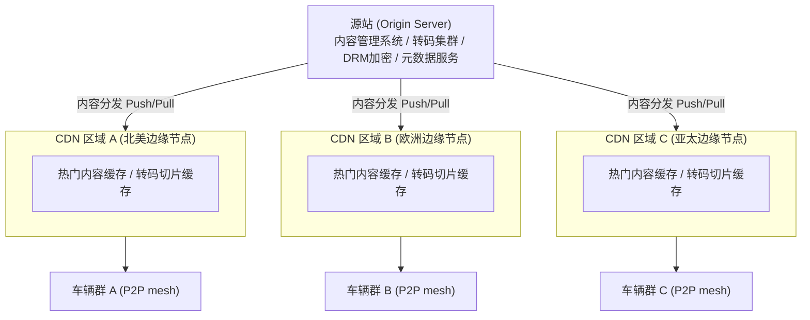

# 千万辆车辆同步使用车载娱乐功能（音乐、视频），如何设计后端架构，保证流媒体播放流畅，无卡顿且节省车载流量？

## 🎯 本质

**核心矛盾**：千万级车辆并发访问 vs 车载网络带宽有限（4G/5G）+ 中心服务器带宽不足。

**关键指标**：
| 指标 | 目标值 |
|------|--------|
| 首帧延迟 | < 2s |
| 卡顿率 | < 1% |
| 带宽节省 | P2P 辅助降低 30%+ |
| 画质自适应 | 5 档码率无缝切换 |

---

## 🧒 类比

想象一个全国连锁奶茶店（Netflix模式）：
1. **中央厨房**只做配方和少量核心原料（源站服务器）
2. 每个**城市配送中心**提前备好热门饮品（CDN边缘缓存）
3. 顾客下单时**自动选杯型**：路堵的拿小杯（低码率），路通的拿大杯（高码率）
4. 常喝的饮品**提前装好放冰箱**（预加载）
5. 邻居之间可以**互相交换**口味（P2P辅助）

---

## 📊 整体架构图



---

## 🔧 详解

### 1. CDN 多级缓存架构

| 层级 | 职责 | 技术 |
|------|------|------|
| 源站 | 原始内容存储 + 转码 + DRM | AWS S3 + FFmpeg 转码集群 |
| 中心 CDN | 全球内容调度 | Akamai / Cloudflare / 自建 |
| 区域边缘 | 就近缓存热门内容 | Nginx 缓存 + SSD |
| 车载本地缓存 | 离线播放 / 预加载 | 车机本地 SSD 1-5GB |

**缓存策略**：
- **热门内容**：Push 到边缘节点（99% 命中率）
- **冷门内容**：按需 Pull，LRU 淘汰
- **预热机制**：新内容发布前，提前 Push 到全球边缘

### 2. ABR 自适应码率（核心）

```
播放流程：
车辆请求视频
  → CDN 返回 manifest 文件（HLS/DASH），列出多档码率
  → 车端播放器根据当前网络 RTT / 带宽 / 丢包率
  → 自动选择最佳码率档位
  → 网络好 → 升档（1080p → 4K）
  → 网络差 → 降档（4K → 720p），无缝切换
```

| 码率档位 | 分辨率 | 码率 | 适用场景 |
|----------|--------|------|----------|
| 极速 | 240p | 300kbps | 弱信号隧道 |
| 流畅 | 480p | 800kbps | 4G 偏弱 |
| 高清 | 720p | 2.5Mbps | 4G 良好 |
| 超清 | 1080p | 5Mbps | 5G |
| 蓝光 | 4K | 15Mbps | WiFi 停车场 |

### 3. 智能预加载策略

```
策略 A：顺序预加载
  当前播放到第 3 分钟 → 预加载第 3-5 分钟内容（2 分钟 buffer）

策略 B：预测预加载
  基于用户习惯：每天 8:00 上班听同一歌单 → 提前缓存

策略 C：地理预加载
  车辆即将进入隧道（地图数据预判）→ 提前加载 5 分钟内容
```

### 4. P2P 辅助分发（省带宽关键）

```java
// P2P 辅助分发核心思路
public class P2PAssistant {
    // 车辆之间组成 mesh 网络，互相分享已缓存的切片
    // 仅限同一基站覆盖范围内的车辆

    public Chunk getChunk(String contentId, int segmentIndex) {
        // 1. 先查本地缓存
        if (localCache.has(contentId, segmentIndex)) {
            return localCache.get(contentId, segmentIndex);
        }
        // 2. 查 P2P 邻居（同基站车辆）
        Chunk peer = p2pNetwork.requestFromPeers(contentId, segmentIndex);
        if (peer != null) {
            localCache.put(contentId, segmentIndex, peer);
            return peer;  // 省 CDN 带宽！
        }
        // 3. 回源 CDN
        return cdnClient.fetchChunk(contentId, segmentIndex);
    }
}
```

### 5. 流量节省方案

| 方案 | 节省比例 | 说明 |
|------|----------|------|
| ABR 自适应码率 | 40-60% | 弱网自动降码率，不浪费带宽 |
| P2P 辅助 | 20-40% | 同区域车辆共享缓存 |
| 预加载 + 离线缓存 | 10-20% | WiFi 环境预下载 |
| 内容压缩（AV1/Opus） | 30-50% | 比H.264/AAC省一半带宽 |
| 智能跳过（片头/广告） | 5-10% | 跳过不需要的内容 |

---

## 💻 核心代码示例

### HLS 自适应码率播放器（Android/Java）

```java
public class AdaptiveStreamingPlayer {

    private ExoPlayer player;
    private BandwidthMeter bandwidthMeter;

    public void initPlayer(Context context) {
        // 1. 带宽检测器：实时监测网络质量
        bandwidthMeter = new DefaultBandwidthMeter.Builder(context)
            .setInitialBitrateEstimate(2_000_000) // 初始预估 2Mbps
            .build();

        // 2. 自适应轨道选择器
        TrackSelection.Factory trackFactory = new AdaptiveTrackSelection.Factory(
            bandwidthMeter,
            2000,           // 最大初始码率
            1000,           // 最小初始码率
            5_000_000,      // 最大视频码率
            0.75f           // 带宽利用率（保留 25% 余量）
        );

        // 3. 创建播放器
        player = new ExoPlayer.Builder(context)
            .setTrackSelector(new DefaultTrackSelector(context, trackFactory))
            .setLoadControl(buildLoadControl()) // buffer 控制
            .build();

        // 4. 加载 HLS 流
        MediaItem mediaItem = MediaItem.fromUri(
            "https://cdn.tesla.com/media/" + contentId + "/playlist.m3u8"
        );
        player.setMediaItem(mediaItem);
        player.prepare();
    }

    // Buffer 控制：平衡首帧速度和卡顿率
    private DefaultLoadControl buildLoadControl() {
        return new DefaultLoadControl.Builder()
            .setBufferDurationsMs(
                1500,    // minBuffer: 最小 1.5s
                30000,   // maxBuffer: 最大 30s
                1000,    // 播放缓冲不足时等待
                3000     // rebuffer: 重新缓冲需要 3s
            )
            .setTargetBufferBytes(20 * 1024 * 1024) // 20MB 最大 buffer
            .build();
    }
}
```

### 后端内容转码服务

```java
@Service
public class TranscodingService {

    // 新内容上传后，自动转码为多档码率
    public void transcodeContent(String sourceUrl, String contentId) {
        List<Resolution> targets = List.of(
            new Resolution(240, 300_000),
            new Resolution(480, 800_000),
            new Resolution(720, 2_500_000),
            new Resolution(1080, 5_000_000)
        );

        // 并行转码
        targets.parallelStream().forEach(res -> {
            String cmd = String.format(
                "ffmpeg -i %s -vf scale=-2:%d -b:v %d -c:v libx264 " +
                "-c:a aac -b:a 128k -f hls -hls_time 6 " +
                "-hls_playlist_type vod -hls_segment_filename " +
                "\"%s/segment_%%05d.ts\" \"%s/playlist.m3u8\"",
                sourceUrl, res.height, res.bitrate,
                getOutputPath(contentId, res.height),
                getOutputPath(contentId, res.height)
            );
            executeCommand(cmd);
        });

        // 生成主 manifest（多码率索引）
        generateMasterPlaylist(contentId, targets);

        // 通知 CDN 预热
        cdnService.warmup(contentId);
    }
}
```

---

## ❓ 发散追问

### Q1：车辆在高速移动中切换基站，如何保证流媒体不中断？

**关键**：足够的 buffer + 快速重连。

1. **维持 10-30s buffer**：切换基站期间用本地 buffer 播放，不卡顿
2. **预注册多连接**：切换前同时建立新旧两个 TCP 连接
3. **QUIC/HTTP3**：基于 UDP，连接迁移无需重建 TCP 握手
4. **地理预判**：结合地图数据，在进入信号盲区前加载充足内容

### Q2：如何防止内容被盗链？

1. **DRM 加密**：Widevine / FairPlay，切片内容加密
2. **Token 鉴权**：CDN URL 带时效性签名（防直接盗链）
3. **设备绑定**：token 与车辆 VIN 绑定，换设备失效

### Q3：如何帮用户省流量？

1. **ABR 自适应**：自动选合适码率，不浪费带宽
2. **WiFi 自动缓存**：检测到 WiFi 时自动预下载歌单
3. **仅音频模式**：视频内容可切为纯音频，节省 80%+ 流量
4. **数据用量提醒**：超套餐时自动降为低码率

## 记忆要点

- 核心矛盾：千万级车辆并发请求，而车端带宽有限，需结合CDN边缘缓存与P2P辅助降载
- CDN多级缓存：源站转码切片，主动预热热门内容到边缘节点，拦截99%的回源流量
- 自适应码率(ABR)：因为车机网络波动大，所以需根据实时带宽无缝切换多档码率防卡顿
- 智能预加载：顺序预加载后续片段或基于用户习惯预测，保障首帧<2s且流畅


## 苏格拉底式面试追问

> 这组追问模拟面试官层层逼问，每一问先回答"为什么"，再回答"怎么做"，最后回答"如何证明"。

### 第一层：目标与动机

**Q：千万辆车并发听歌看视频，你为什么第一反应是用 CDN 而不是扩源站带宽？**

因为核心矛盾是带宽×延迟的物理限制。按估算千万车 × 2Mbps = 20Tbps 出口需求，单数据中心最大约 100Gbps，需要 200 个数据中心，自建成本爆炸。CDN（Akamai/Cloudflare 数十万边缘节点）已经把内容推到离车最近的位置，回源率压到 1% 以下，本质是用空间换时间。源站扩带宽是线性成本，CDN 是边际递减成本，所以 CDN 是第一选择。

### 第二层：证据与定位

**Q：用户反馈"车载视频频繁卡顿"，你怎么定位是 CDN 回源、ABR 切档还是车机解码的问题？**

三路证据交叉验证：
1. CDN 侧看边缘节点命中率——如果命中率从 99% 掉到 80%，说明热门内容没预热或节点宕机，回源带宽打满。
2. 车端上报 ABR 切档日志——如果短时间内 1080P→480P→1080P 反复跳，是网络抖动导致码率震荡，不是 CDN 问题。
3. 车机解码帧率（FPS）+ 缓冲区水位——如果缓冲区满但 FPS 低，是解码能力不够（老车型 SoC 算力弱），跟网络无关。

### 第三层：根因深挖

**Q：CDN 命中率正常、ABR 也没震荡，但卡顿率从 0.5% 升到 3%，你怎么继续挖？**

看回源链路和切片质量。先查源站转码队列是不是积压——新歌上线时转码没跟上，切片缺失导致边缘节点回源 404。再看 P2P 辅助分发的命中率，P2P 节点（其他车）如果离线率高（凌晨场景），辅助降载失效。最后看跨区域调度日志——是否把欧洲用户调度到了亚洲节点，RTT 300ms 必然卡顿。

**Q：为什么不直接把所有内容都预加载到车机本地，彻底杜绝卡顿？**

不现实。车载存储一般 64-128GB，全量音乐库几 TB，装不下。而且预加载会抢占车载流量套餐，用户不买账。预加载只能针对"高频内容"——用户收藏的歌单、常听电台、个性化推荐 Top100，靠行为预测做精准预加载，命中率 70%+，而不是全量灌盘。

### 第四层：方案权衡

**Q：你说用 ABR 自适应码率，但用户投诉"明明 5G 信号却播 480P"，你怎么权衡画质和稳定？**

ABR 算法过于保守导致码率爬坡慢。解法是调整 ABR 的吞吐估计算法——把 BOLA 或 throughput-based 换成 hybrid（MPC 模型预测控制），结合缓冲区水位和网络 RTT 做决策。同时引入"码率粘性"——已选 1080P 时，只有带宽持续低于阈值 10 秒才降档，避免瞬时抖动误降。权衡点：宁可偶尔卡顿 0.5s 也要保画质，还是宁可降档也要不卡，取决于业务定位（高端车型偏画质，入门车型偏流畅）。

**Q：为什么不直接给所有车辆推 4K，反正 5G 带宽够？**

5G 理论带宽够，但实际车载场景：高速移动信号衰减、基站切换丢包、地下车库无信号。而且 4K 码率 25Mbps，一辆车一部片就是 25Mbps，千万并发就是 250Tbps，CDN 也扛不住。ABR 的存在就是因为"带宽永远不够"，必须按实时质量动态分配。

### 第五层：验证与沉淀

**Q：你怎么证明 CDN + ABR 优化后卡顿率真的降了，而不是那几天开车的人少？**

上线前后各采 2 周数据，做归一化对比：
1. 卡顿率 = 卡顿播放时长 / 总播放时长（不是卡顿次数 / 请求数，避免长短片混淆）。
2. 按流量分层对比——高峰时段（通勤 7-9 点、18-20 点）的卡顿率单独统计，消除低峰期数据稀释。
3. A/B 灰度——10% 车辆走新策略，90% 走老策略同时段对比，排除天气、节假日等外部因素。

**Q：这套流媒体架构怎么沉淀成可复用的能力？**

把 CDN 调度、ABR 算法、预加载策略抽象成"车载流媒体中间件"：
1. ABR 算法插件化——不同车型（算力差异）可挂不同档位策略。
2. 预加载模型沉淀——用户行为特征工程（收藏/历史/时段）训练预测模型，命中率作为模型指标迭代。
3. 故障预案文档化——CDN 节点宕机的降级链路（多 CDN 厂商容灾 + 源站直连兜底）写入 runbook，新车型接入直接复用。


## 结构化回答

**30 秒电梯演讲：** 千万辆车同时听歌看视频，核心矛盾是"海量并发"vs"车载带宽有限"。解法：把内容推到离车最近的边缘节点(CDN)，让车按网络质量自适应选清晰度(ABR)，用预加载减少卡顿，用量化压缩节省流量。

**展开框架：**
1. **核心矛盾** — 千万级车辆并发请求，而车端带宽有限，需结合CDN边缘缓存与P2P辅助降载
2. **CDN多级缓存** — 源站转码切片，主动预热热门内容到边缘节点，拦截99%的回源流量
3. **自适应码率(ABR)** — 因为车机网络波动大，所以需根据实时带宽无缝切换多档码率防卡顿

**收尾：** 这块我踩过坑——要不要深入聊：车辆在高速移动中切换基站，如何保证流媒体不中断？

## 视频脚本

> 预计时长：4 分钟 | 由浅入深

| 时间 | 画面/字幕 | 口播台词 | 讲解要点 |
|------|----------|----------|----------|
| 0:00 | 标题卡 | "高并发一句话：千万辆车同时听歌看视频，核心矛盾是'海量并发'vs'车载带宽有限'。解法：把内容推到离车最近的边缘节点(CDN)…。" | 开场钩子 |
| 0:15 | 缓存读写策略流程图 | "核心矛盾：千万级车辆并发请求，而车端带宽有限，需结合CDN边缘缓存与P2P辅助降载" | 核心矛盾 |
| 1:08 | 缓存读写策略流程图分步演示 | "CDN多级缓存：源站转码切片，主动预热热门内容到边缘节点，拦截99%的回源流量" | CDN多级缓存 |
| 2:01 | 关键代码/伪代码片段 | "自适应码率(ABR)：因为车机网络波动大，所以需根据实时带宽无缝切换多档码率防卡顿" | 自适应码率(ABR) |
| 2:54 | 对比表格 | "智能预加载：顺序预加载后续片段或基于用户习惯预测，保障首帧<2s且流畅" | 智能预加载 |
| 3:50 | 总结卡 | "核心抓住这条主线，下期咱们接着聊：车辆在高速移动中切换基站，如何保证流媒体不中断。" | 收尾 |
