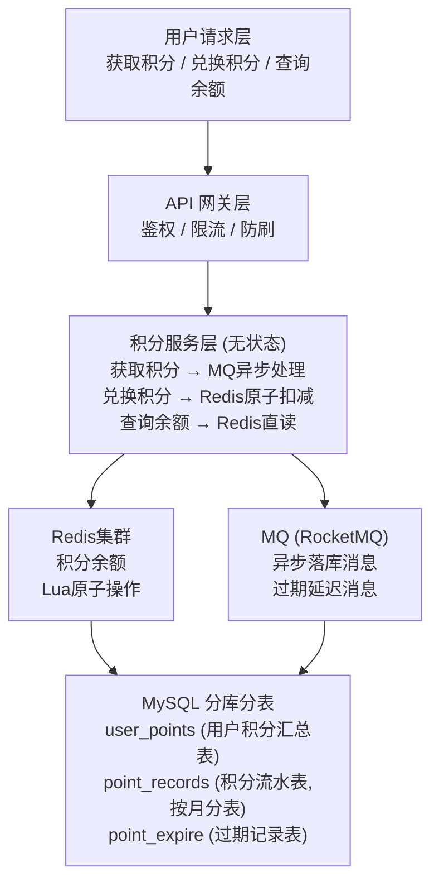

# 亿级车主积分获取、兑换、过期管理，如何设计后端架构，保证积分计算准确，支持高并发兑换且实时同步状态？

## 🎯 本质

| 核心挑战 | 说明 |
|----------|------|
| **高并发兑换** | 促销活动期间峰值 QPS 万级 |
| **绝对准确** | 积分=钱，不能算错 |
| **亿级存储** | 亿级用户 × 多年记录 |
| **过期管理** | 需要精准触发过期时间 |
| **实时同步** | 兑换后立即反映最新余额 |

---

## 🧒 类比

想象一家全球连锁银行的积分系统：
1. **柜台（Redis）**：客户来兑换时实时扣减，速度快，用保险箱锁住防超扣
2. **金库（MySQL）**：每天晚上统一把柜台数据搬回金库存储
3. **审计员（对账系统）**：定期核对柜台和金库是否一致
4. **闹钟（延迟队列）**：积分快过期时自动提醒用户

---

## 📊 整体架构图



---

## 🔧 详解

### 1. 积分数据模型

```sql
-- 用户积分汇总表（分库分表，按 userId 取模）
CREATE TABLE user_points (
    user_id     BIGINT PRIMARY KEY,
    total       BIGINT NOT NULL DEFAULT 0,    -- 总积分
    available   BIGINT NOT NULL DEFAULT 0,    -- 可用积分
    frozen      BIGINT NOT NULL DEFAULT 0,    -- 冻结积分（兑换中）
    expired     BIGINT NOT NULL DEFAULT 0,    -- 已过期积分
    version     INT NOT NULL DEFAULT 0,       -- 乐观锁版本号
    updated_at  TIMESTAMP DEFAULT NOW()
);

-- 积分流水表（按月分表，记录每一笔变动）
CREATE TABLE point_records (
    id          BIGINT AUTO_INCREMENT PRIMARY KEY,
    user_id     BIGINT NOT NULL,
    change_type ENUM('earn', 'redeem', 'expire', 'adjust'),
    amount      INT NOT NULL,          -- 正=获取, 负=消耗
    balance     BIGINT NOT NULL,       -- 变动后余额（快照）
    source      VARCHAR(64),           -- 来源（充电/推荐/活动）
    biz_id      VARCHAR(128),          -- 业务流水号（幂等）
    created_at  TIMESTAMP DEFAULT NOW(),
    INDEX idx_user_time (user_id, created_at)
);
```

### 2. Redis 原子扣减（防超扣核心）

```lua
-- redeem_points.lua
local key = KEYS[1]           -- points:available:{userId}
local amount = tonumber(ARGV[1])
local bizId = ARGV[2]         -- 幂等键

-- 1. 幂等检查
if redis.call('SISMEMBER', key .. ':biz', bizId) == 1 then
    return -3  -- 重复请求
end

-- 2. 检查余额
local current = tonumber(redis.call('GET', key) or '0')
if current < amount then
    return -1  -- 余额不足
end

-- 3. 原子扣减
redis.call('DECRBY', key, amount)
redis.call('SADD', key .. ':biz', bizId)
return current - amount  -- 返回新余额
```

### 3. 积分过期延迟队列

```java
@Service
public class PointsExpireService {

    @Autowired private RocketMQTemplate mq;

    // 积分获取时，设置过期时间（如2年）
    public void earnPoints(Long userId, int amount, String source) {
        // ... 写入积分 ...

        // 发送延迟消息，到过期日触发扣减
        long expireDelay = 2 * 365 * 24 * 60 * 60 * 1000L; // 2年
        PointsExpireMessage msg = new PointsExpireMessage(userId, amount, recordId);

        // RocketMQ 18个延迟级别，选最接近的
        // Level 18 = 2h，需要自定义延迟
        // 生产环境用 Redisson 延迟队列或时间轮
        msg.delayLevel = calculateDelayLevel(expireDelay);
        mq.asyncSend("points-expire-topic", msg, ...);
    }
}

// 过期消费者
@RocketMQMessageListener(topic = "points-expire-topic")
public class PointsExpireConsumer implements RocketMQListener<PointsExpireMessage> {
    @Override
    public void onMessage(PointsExpireMessage msg) {
        // 将可用积分减去过期数量，记入已过期
        pointsService.expirePoints(msg.getUserId(), msg.getAmount());
        // 发送过期通知
        notifyService.send(msg.getUserId(), "您有" + msg.getAmount() + "积分已过期");
    }
}
```

### 4. 定时对账（保证数据一致）

```java
@Scheduled(cron = "0 0 3 * * ?") // 每天凌晨3点
public void dailyReconcile() {
    // 1. 取昨天有变动的所有用户
    List<Long> userIds = getActiveUserIds(yesterday());

    for (Long userId : userIds) {
        // 2. Redis余额 vs DB余额
        long redisBalance = redis.get("points:available:" + userId);
        long dbBalance = pointsMapper.getAvailable(userId);

        if (redisBalance != dbBalance) {
            // 3. 以DB流水为准，重算正确余额
            long correctBalance = recalculateFromRecords(userId);

            // 4. 修正Redis
            redis.set("points:available:" + userId, correctBalance);

            // 5. 记录对账差异，人工审核大额差异
            if (Math.abs(redisBalance - correctBalance) > 1000) {
                alertService.send("积分对账异常: user=" + userId
                    + " redis=" + redisBalance + " db=" + correctBalance);
            }
        }
    }
}
```

---

## 💻 核心代码：兑换积分完整流程

```java
@Service
public class PointsService {

    @Autowired private StringRedisTemplate redis;
    @Autowired private RocketMQTemplate mq;

    private static final DefaultRedisScript<Long> REDEEM_SCRIPT;
    static {
        REDEEM_SCRIPT = new DefaultRedisScript<>();
        REDEEM_SCRIPT.setLocation(new ClassPathResource("redeem_points.lua"));
        REDEEM_SCRIPT.setResultType(Long.class);
    }

    @Transactional
    public RedeemResult redeem(Long userId, int amount, String bizId) {
        String key = "points:available:" + userId;

        // ① Redis 原子扣减（检查余额 + 扣减 + 幂等）
        Long result = redis.execute(
            REDEEM_SCRIPT,
            Collections.singletonList(key),
            String.valueOf(amount), bizId
        );

        if (result == -1) return RedeemResult.fail("积分不足");
        if (result == -3) return RedeemResult.fail("请勿重复提交");

        // ② 发送 MQ 异步落库
        PointRecordMessage msg = new PointRecordMessage(
            userId, "redeem", -amount, result, bizId
        );
        mq.asyncSend("points-record-topic", msg, ...);

        return RedeemResult.success(result);
    }
}

// MQ消费者：异步写入DB
@RocketMQMessageListener(topic = "points-record-topic")
public class PointsRecordConsumer implements RocketMQListener<PointRecordMessage> {

    @Override
    public void onMessage(PointRecordMessage msg) {
        // 幂等：检查biz_id是否已处理
        if (recordMapper.existsByBizId(msg.getBizId())) return;

        // 写入流水表
        PointRecord record = new PointRecord();
        record.setUserId(msg.getUserId());
        record.setChangeType(msg.getChangeType());
        record.setAmount(msg.getAmount());
        record.setBalance(msg.getBalance());
        record.setBizId(msg.getBizId());
        recordMapper.insert(record);

        // 更新汇总表（乐观锁防并发）
        pointsMapper.updateAvailable(msg.getUserId(), msg.getAmount());
    }
}
```

---

## ❓ 发散追问

### Q1：积分被恶意刷取怎么办？

- **频率限制**：单个用户获取积分有日上限和频率限制
- **行为分析**：异常获取模式（如短时间内大量充电）触发风控
- **延迟入账**：获取的积分先冻结 24h，风控通过后才可用
- **审计追溯**：每笔积分有完整流水，可追溯到业务来源

### Q2：Redis和DB数据不一致怎么处理？

1. **以DB流水为准**：Redis只做缓存，DB是source of truth
2. **定时对账**：每天凌晨全量比对，发现差异自动修正
3. **实时监控**：Redis操作后异步发MQ，消费失败进入重试队列
4. **补偿机制**：Redis宕机恢复后，从DB重建缓存

### Q3：积分过期机制如何设计更精准？

- **FIFO过期**：按获取时间先进先出，先获取的先过期
- **批次管理**：每笔积分独立记录过期时间，过期时精确扣减对应批次
- **提前提醒**：过期前7天/1天/当天多轮推送提醒

## 记忆要点

- 模型分离：汇总表存总余额，流水表(按月分表)记明细，因为亿级流水必须按时间归档
- 高并发兑换：因为积分等于钱不能错，所以用Redis+Lua原子扣减防超卖，MQ异步落库
- 最终一致：异步落库必有延迟风险，所以必须定时对账核对Redis与MySQL数据
- 过期管理：积分精准过期，通过延迟队列触发到期时间点，主动扣减并通知


## 苏格拉底式面试追问

> 这组追问模拟面试官层层逼问，每一问先回答"为什么"，再回答"怎么做"，最后回答"如何证明"。

### 第一层：目标与动机

**Q：积分系统为什么不能直接用 MySQL 扣减，非要加 Redis 前置？**

积分等于钱，错了就是资损。但亿级用户 × 日均 10 次变动 = 日 10 亿次操作 ≈ 10K+ QPS。MySQL 单机写入上限约 5K TPS，行锁在高并发扣减时排队严重，TPS 上不去。Redis 单实例 10W+ QPS + Lua 脚本原子扣减，能把高并发挡在 DB 之前。决策依据不是拍脑袋，是先算 QPS 再算 DB 承载，差一个量级就必须加缓存。

### 第二层：证据与定位

**Q：用户投诉"兑换时提示积分不足，但我明明有 5000 分"，你怎么定位？**

查三条链路对账：
1. Redis 里的实时余额——`GET user:points:{uid}` 看是不是真的不足（可能 MQ 异步落库延迟导致 DB 显示 5000 但 Redis 已扣）。
2. 流水表最近记录——查 `point_flow` 表看是否有未授权的扣减（被盗刷、重复消费 MQ 导致重复扣）。
3. 对账差异——跑定时对账任务比对 Redis 与 MySQL 余额，如果差异 > 0，说明 MQ 消费失败或 Lua 脚本异常。

### 第三层：根因深挖

**Q：对账发现 Redis 比 MySQL 少了 200 分，根因可能是什么？**

最可能是 MQ 消息丢失或重复消费。先看 MQ 消费日志——如果"扣减成功"消息消费了两次（重复扣），Redis 扣了两次但 DB 幂等只扣一次，Redis 会偏少。如果消息丢了（MQ 宕机未持久化），Redis 扣了但 DB 没落，Redis 偏少。还有种可能是 Lua 脚本里扣减后 Redis 主从切换，从库数据未同步就升主，丢了一笔。要定位得看 MQ 投递日志 + Redis 主从切换时间点。

**Q：为什么不直接用 MySQL 的 SELECT FOR UPDATE 强一致扣减，这样不就没不一致问题了？**

强一致是靠性能换的。SELECT FOR UPDATE 加行锁，高并发下锁等待把 TPS 从 5K 压到几百，积分兑换高峰直接雪崩。积分场景追求的是"实时原子防超扣（Redis）+ 最终一致落库（MQ+对账）"，而不是全程强一致。用对账兜底比用锁兜底便宜得多——对账是离线批处理，锁是在线阻塞。

### 第四层：方案权衡

**Q：你说积分过期用延迟队列，但亿级积分如果同时过期，延迟队列扛得住吗？**

扛不住。亿级积分集中在月底过期，Redis ZSet 或 RabbitMQ 延迟队列瞬间百万级到期任务，消费跟不上会堆积。解法是"分散过期 + 批量处理"：
1. 过期时间打散——不在月末统一过期，而是按获取时间 +30 天逐条过期，平滑峰值。
2. 批量消费——到期任务按 uid 分桶，每个消费者一次处理 1000 个 uid，Lua 批量扣减。
3. 降级预案——堆积超阈值时，改用离线对账扫描"已过期但未扣减"的记录补扣，不依赖实时队列。

**Q：为什么不用定时任务全表扫描过期，反而搞延迟队列那么复杂？**

全表扫描亿级积分表，单次扫描几十分钟，扫描期间用户看到的余额还是旧的，体验差。而且扫描会打满 DB IO 影响在线交易。延迟队列是事件驱动——到期瞬间触发，实时扣减并通知用户"您的 XX 积分已过期"，体验和准确性都更好。全表扫描只能做兜底对账，不能做主流程。

### 第五层：验证与沉淀

**Q：你怎么证明积分系统账实相符，没有资损？**

建立三级对账体系：
1. 实时对账——每笔扣减后，Redis 与 DB 差异写入对账表，差异超 1 元告警。
2. 日终对账——每天凌晨跑全量对账，Redis 余额 vs MySQL 汇总表 vs 流水表 sum，三方一致才算平账。
3. 财务对账——每月与财务系统对账，积分兑换对应的现金券、实物，金额必须吻合。资损率指标 = 差异金额 / 总流水，要求 < 0.001%。

**Q：这套积分架构怎么避免下次踩坑？**

沉淀机制：
1. 幂等设计——所有积分变动带 bizId（业务流水号），Redis Lua 和 DB 落库都按 bizId 去重，防止重复消费。
2. 对账平台化——把对账逻辑抽成通用组件（输入两张表 + 对账字段，输出差异报表），其他计数类业务（余额、券）直接复用。
3. 故障复盘——记录这次"MQ 重复消费导致多扣"的根因，把"消费端必须幂等"写入 Code Review 检查项。


## 结构化回答

**30 秒电梯演讲：** 亿级车主积分的核心矛盾是"高并发读写"vs"数据绝对准确"。解法：热数据放Redis（实时扣减原子性），冷数据放DB（分库分表存储），通过MQ异步同步保证最终一致。打个比方，像大型商场的会员积分卡——收银台（Redis）实时扣减积分保证不超扣，每天晚上后台（DB）统一对账同步。这样收银快又不丢数据。

**展开框架：**
1. **模型分离** — 汇总表存总余额，流水表(按月分表)记明细，因为亿级流水必须按时间归档
2. **高并发兑换** — 因为积分等于钱不能错，所以用Redis+Lua原子扣减防超卖，MQ异步落库
3. **最终一致** — 异步落库必有延迟风险，所以必须定时对账核对Redis与MySQL数据

**收尾：** 这块我踩过坑——要不要深入聊：积分被恶意刷取怎么办？

## 视频脚本

> 预计时长：4 分钟 | 由浅入深

| 时间 | 画面/字幕 | 口播台词 | 讲解要点 |
|------|----------|----------|----------|
| 0:00 | 标题卡 | "高并发一句话：亿级车主积分的核心矛盾是'高并发读写'vs'数据绝对准确'。解法：热数据放Redis（实时扣减原子性）…。" | 开场钩子 |
| 0:15 | Redis Lua 脚本执行截图 | "模型分离：汇总表存总余额，流水表(按月分表)记明细，因为亿级流水必须按时间归档" | 模型分离 |
| 1:08 | Redis Lua 脚本执行截图分步演示 | "高并发兑换：因为积分等于钱不能错，所以用Redis+Lua原子扣减防超卖，MQ异步落库" | 高并发兑换 |
| 2:01 | 关键代码/伪代码片段 | "最终一致：异步落库必有延迟风险，所以必须定时对账核对Redis与MySQL数据" | 最终一致 |
| 2:54 | 对比表格 | "过期管理：积分精准过期，通过延迟队列触发到期时间点，主动扣减并通知" | 过期管理 |
| 3:50 | 总结卡 | "核心抓住这条主线，下期咱们接着聊：积分被恶意刷取怎么办。" | 收尾 |
