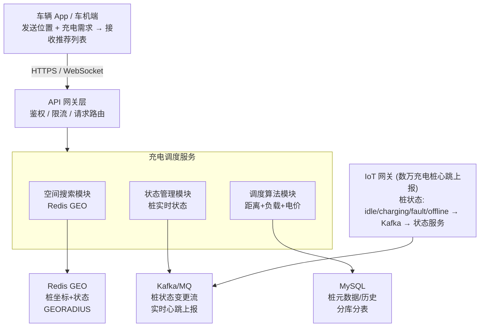

# 全球数万座充电桩实时调度，如何设计后端架构，实现用户就近分配充电桩，提升充电桩整体利用率？

## 🎯 本质

```
输入：用户位置(lat,lng) + 充电需求(功率/时长)
处理：空间搜索(附近桩) + 状态过滤(空闲?) + 调度决策(推荐哪个)
输出：推荐充电桩列表 + 预估等待时间 + 实时电价
```

---

## 🧒 类比

把充电桩调度想象成一个**智能停车场引导系统**：
1. 车辆到达入口 → 系统扫描全停车场（空间搜索）
2. 显示哪些区域有空位（状态过滤）
3. 推荐"最近+最空闲"的区域（调度决策）
4. 到达前自动预约一个车位（防超分配）

---

## 📊 整体架构图



---

## 🔧 详解

### 1. Redis GEO 空间索引（核心）

```bash
# 初始化：将充电桩坐标写入 Redis GEO
GEOADD chargers:region:us  -122.0312 37.3318 "station_001"
GEOADD chargers:region:us  -122.0421 37.3325 "station_002"
# ...

# 搜索：找附近 5km 内的充电桩，按距离排序
GEOSEARCH chargers:region:us
  FROMLONLAT -122.0312 37.3318
  BYRADIUS 5 km
  ASC                     # 按距离升序
  COUNT 20                # 最多返回20个
  WITHCOORD WITHDIST      # 返回坐标和距离
```

### 2. 充电桩实时状态管理

```java
// 桩状态数据模型
public enum ChargerStatus {
    IDLE,       // 空闲可用
    OCCUPIED,   // 被占用（正在充电）
    RESERVED,   // 已预约
    FAULT,      // 故障
    OFFLINE     // 离线
}

// 状态同步：充电桩通过IoT网关上报心跳
@Service
public class ChargerStatusService {

    // 心跳超时检测：30s无心跳 → 标记OFFLINE
    @Scheduled(fixedRate = 10000)
    public void checkHeartbeat() {
        long threshold = System.currentTimeMillis() - 30_000;
        // 扫描Redis中所有桩的最后心跳时间
        Set<String> staleChargers = redis.zrangeByScore(
            "chargers:heartbeat", 0, threshold
        );
        for (String chargerId : staleChargers) {
            updateStatus(chargerId, ChargerStatus.OFFLINE);
            alertService.send("充电桩离线: " + chargerId);
        }
    }

    // 状态写入Redis（实时查询用）+ MySQL（持久化用）
    public void updateStatus(String chargerId, ChargerStatus status) {
        // Redis: Hash存储实时状态
        redis.opsForHash().put("chargers:status", chargerId, status.name());
        // Redis: 按状态分集合，加速过滤
        if (status == ChargerStatus.IDLE) {
            redis.opsForSet().add("chargers:idle", chargerId);
        } else {
            redis.opsForSet().remove("chargers:idle", chargerId);
        }
    }
}
```

### 3. 调度算法（距离 + 负载 + 电价）

```java
@Service
public class ChargerDispatchService {

    public List<ChargerRecommendation> recommend(
            double lat, double lng, double powerKW) {

        // ① Redis GEO 搜索附近 10km 桩
        List<GeoResult> nearby = redis.geoSearch(
            "chargers:region", lat, lng, 10, KM, 50
        );

        // ② 过滤：只保留空闲桩 + 功率匹配
        List<ChargerInfo> candidates = nearby.stream()
            .filter(g -> getStatus(g.getId()) == IDLE)
            .filter(g -> getPower(g.getId()) >= powerKW)
            .collect(toList());

        // ③ 综合评分排序
        return candidates.stream()
            .map(c -> score(c, lat, lng))
            .sorted(Comparator.comparingDouble(ChargerRecommendation::getScore).reversed())
            .limit(10)
            .collect(toList());
    }

    // 综合评分 = 距离分 × 0.5 + 负载分 × 0.3 + 电价分 × 0.2
    private ChargerRecommendation score(ChargerInfo c, double lat, double lng) {
        double distScore = 1.0 / (1 + c.getDistanceKm());  // 越近分越高
        double loadScore = 1.0 - c.getQueueCount() * 0.2;  // 排队少分高
        double priceScore = 1.0 / (1 + c.getPricePerKWh()); // 电价低分高

        double total = distScore * 0.5 + loadScore * 0.3 + priceScore * 0.2;
        return new ChargerRecommendation(c, total, distScore, loadScore, priceScore);
    }
}
```

### 4. 防超分配：预约锁

```java
// 用户选择充电桩后，发起预约（15分钟内有效）
@Service
public class ReservationService {

    public ReserveResult reserve(String userId, String chargerId) {
        String lockKey = "charger:reserve:" + chargerId;

        // ① 分布式锁（Redisson），防多用户同时预约同一桩
        RLock lock = redisson.getLock(lockKey);
        if (!lock.tryLock()) {
            return ReserveResult.fail("该充电桩正在被预约，请稍后重试");
        }

        try {
            // ② 检查状态是否仍为空闲
            ChargerStatus status = getStatus(chargerId);
            if (status != ChargerStatus.IDLE) {
                return ReserveResult.fail("充电桩已被占用");
            }

            // ③ 预约：状态改为 RESERVED，设置15分钟超时
            updateStatus(chargerId, ChargerStatus.RESERVED);
            redis.setex("reserve:" + chargerId, 900, userId);

            // ④ 发送延迟消息：15分钟后自动释放
            mq.sendDelay("reserve-timeout", chargerId, 15, TimeUnit.MINUTES);

            return ReserveResult.success(chargerId);
        } finally {
            lock.unlock();
        }
    }
}
```

---

## 💻 数据模型 + 利用率分析

```sql
-- 充电桩元数据
CREATE TABLE charger_station (
    id              VARCHAR(32) PRIMARY KEY,
    name            VARCHAR(128),
    lat             DECIMAL(10, 7),
    lng             DECIMAL(10, 7),
    power_kw        INT,              -- 充电功率
    connector_type  VARCHAR(16),      -- CCS/NACS/Tesla
    region          VARCHAR(32),
    price_per_kwh   DECIMAL(6, 2)
);

-- 充电会话记录（用于利用率分析）
CREATE TABLE charging_session (
    id              BIGINT AUTO_INCREMENT PRIMARY KEY,
    charger_id      VARCHAR(32) NOT NULL,
    user_id         BIGINT NOT NULL,
    start_time      TIMESTAMP,
    end_time        TIMESTAMP,
    energy_kwh      DECIMAL(10, 2),
    cost            DECIMAL(10, 2),
    INDEX idx_charger_time (charger_id, start_time)
);
```

```java
// 利用率分析：每小时统计各桩使用率
@Scheduled(cron = "0 0 * * * ?")
public void calculateUtilization() {
    // 利用率 = 充电时长 / 总时长
    // 目标：提升整体利用率 > 60%
    String sql = """
        SELECT charger_id,
               SUM(TIMESTAMPDIFF(MINUTE, start_time, end_time)) / 60.0 as hours_used
        FROM charging_session
        WHERE start_time >= DATE_SUB(NOW(), INTERVAL 1 HOUR)
        GROUP BY charger_id
        """;
    // 将利用率写入Redis，供调度算法参考
    // 低利用率桩 → 调度算法提升权重，引导用户前往
}
```

---

## ❓ 发散追问

### Q1：多个用户同时抢占同一个充电桩怎么办？

1. **分布式锁**：Redisson 互斥锁，同一时刻只有一个请求能修改桩状态
2. **状态机校验**：预约前必须检查状态 == IDLE，用 Lua 脚本保证原子性
3. **乐观锁**：CAS 更新（`UPDATE ... WHERE status='IDLE' AND version=?`）

### Q2：如何在用电高峰期做动态电价？

- **实时电价引擎**：基于电网负荷数据，峰时加价、谷时降价
- **Redis 缓存电价**：每15分钟更新一次，毫秒级查询
- **引导调度**：低价时段调度算法提升该桩权重，吸引用户错峰充电

### Q3：如何提升偏远地区充电桩利用率？

1. **动态折扣**：低利用率桩自动降价，通过 App 推送优惠
2. **路径规划引导**：长途出行时推荐沿途充电站
3. **超充网络规划**：基于历史充电数据优化选址

## 记忆要点

- 空间索引：Redis GEO存储坐标，用GEORADIUS快速圈出附近桩，天然支持距离排序
- 实时状态：充电桩心跳上报到MQ，消费后更新Redis状态，保证调度的实时准确性
- 调度策略：不仅看距离，还需结合桩实时负载与电价，综合计算推荐最优解
- 防超分配：分配瞬间通过分布式锁/状态校验占位，防止多车抢夺同一空闲桩


## 苏格拉底式面试追问

> 这组追问模拟面试官层层逼问，每一问先回答"为什么"，再回答"怎么做"，最后回答"如何证明"。

### 第一层：目标与动机

**Q：充电桩调度你为什么用 Redis GEO 而不是 MySQL 的空间索引或 PostGIS？**

核心是查询性能。Redis GEO 基于 GeoHash 有序集合，GEORADIUS 复杂度 O(logN+M)，数万桩查询 0.1ms 级。MySQL 空间索引（R-Tree）在亿级坐标时查询要 10ms+，而且每次请求都查 DB 会把连接池打满。充电调度是高频实时场景（用户打开 APP 立即要结果），必须把空间索引放内存。PostGIS 功能强但部署重，调度场景只需要"圈范围+排序"，Redis GEO 足够轻量。

### 第二层：证据与定位

**Q：用户反馈"推荐的充电桩到了发现是坏的"，你怎么定位是状态同步延迟还是调度逻辑问题？**

查两条链路：
1. 桩状态时间线——充电桩心跳每 10s 上报到 MQ，看那台桩最后一次心跳时间。如果心跳断了几分钟但 Redis 里状态还是"空闲"，是状态同步延迟（MQ 堆积或消费者挂了）。
2. 调度时刻快照——看调度时该桩的 Redis 状态是不是"空闲"。如果是"空闲"但实际坏了，是心跳没及时更新；如果当时已经是"故障"但仍被推荐，是调度逻辑没过滤状态字段。

### 第三层：根因深挖

**Q：心跳正常但 Redis 状态还是旧值，根因是什么？**

最可能是心跳消费链路积压。心跳上报链路：桩 → MQTT 网关 → Kafka → 消费者 → 写 Redis。如果 Kafka 消费者处理慢（比如每条心跳还顺带写 DB 落库），消费延迟从秒级涨到分钟级，Redis 状态就滞后。解法是把"写 Redis"（热路径）和"写 DB"（冷路径）拆开，热路径只更新 Redis 保证调度实时，冷路径异步落库。根因是消费逻辑耦合了快慢操作。

**Q：为什么不直接让充电桩每次心跳都同步调接口更新状态，还要走 MQ 绕一圈？**

直连接口在数万桩并发心跳下会把接口服务打爆（数万 QPS 的同步写入）。MQ 做削峰填谷——心跳先进 Kafka 缓冲，消费者按自己的节奏消费，保护下游。而且 MQ 支持多消费者并行处理（一个更新 Redis，一个写 DB 落库，一个触发告警），解耦清楚。直连是同步阻塞，MQ 是异步解耦，高并发场景必须用 MQ。

### 第四层：方案权衡

**Q：多个用户同时抢同一个空闲桩，你说用分布式锁，会不会导致排队严重？**

会，所以锁的粒度要精细。分布式锁加在"桩 ID"上（`lock:pile:{pileId}`），只阻塞抢同一桩的用户，不同桩互不影响。锁持有时间要短——"占位"成功立即返回（锁 TTL 5s），之后用户确认订单走正常流程释放锁。如果用户 5s 内没确认，锁自动过期释放给其他用户。权衡点：锁等待时间 vs 超卖风险，TTL 设 5s 是经验值——够用户点确认，又不会长时间占位。

**Q：为什么不用乐观锁（CAS）而用分布式锁？乐观锁性能更好吧？**

乐观锁要重试，充电桩场景重试成本高——用户抢不到这个桩就要重新搜附近、重新决策，体验差。分布式锁是"先到先得"，抢不到立即返回让用户选别的桩，符合业务语义。而且充电桩状态频繁变化（空闲→占用），CAS 的 version 冲突率高，重试多次还不如直接锁。乐观锁适合冲突少的场景，充电桩调度是典型的冲突多场景。

### 第五层：验证与沉淀

**Q：你怎么证明调度优化后充电桩利用率真的提升了？**

定义清晰的利用率指标 = 日均充电时长 / (桩数量 × 24h)。对比方式：
1. 按区域对比——优化前后同区域的利用率，偏远地区利用率提升说明调度算法把用户引导过去了。
2. 用户侧指标——"推荐桩到到达桩的转化率"和"用户平均寻桩距离"，转化率提升 + 距离下降说明调度更准。
3. A/B 测试——新算法只对 20% 用户生效，与老算法同时段对比利用率，排除季节性波动。

**Q：这套调度架构怎么沉淀？**

1. 调度策略插件化——距离权重、电价权重、负载权重做成可配置，不同城市（一线地贵、三四线电贵）用不同策略。
2. 空间索引通用化——Redis GEO 的封装抽成"附近搜索"组件，换电、换电站、服务中心等其他场景复用。
3. 心跳链路监控——Kafka 消费延迟、Redis 状态新鲜度（最近心跳时间）设告警，延迟超 30s 自动触发"桩状态降级为未知"，避免推荐僵尸桩。


## 结构化回答

**30 秒电梯演讲：** 数万充电桩实时调度的本质是"空间搜索+资源分配"问题。核心：用GeoHash/Redis GEO快速找到附近的空闲桩，用调度算法（贪心/二分匹配）实现就近分配+负载均衡。

**展开框架：**
1. **空间索引** — Redis GEO存储坐标，用GEORADIUS快速圈出附近桩，天然支持距离排序
2. **实时状态** — 充电桩心跳上报到MQ，消费后更新Redis状态，保证调度的实时准确性
3. **调度策略** — 不仅看距离，还需结合桩实时负载与电价，综合计算推荐最优解

**收尾：** 这块我踩过坑——要不要深入聊：多个用户同时抢占同一个充电桩怎么办？

## 视频脚本

> 预计时长：4 分钟 | 由浅入深

| 时间 | 画面/字幕 | 口播台词 | 讲解要点 |
|------|----------|----------|----------|
| 0:00 | 标题卡 | "分布式一句话：数万充电桩实时调度的本质是'空间搜索+资源分配'问题。核心：用GeoHash/Redis GEO快速找到附近的空闲桩…。" | 开场钩子 |
| 0:15 | Redis Lua 脚本执行截图 | "空间索引：Redis GEO存储坐标，用GEORADIUS快速圈出附近桩，天然支持距离排序" | 空间索引 |
| 1:08 | Redis Lua 脚本执行截图分步演示 | "实时状态：充电桩心跳上报到MQ，消费后更新Redis状态，保证调度的实时准确性" | 实时状态 |
| 2:01 | 关键代码/伪代码片段 | "调度策略：不仅看距离，还需结合桩实时负载与电价，综合计算推荐最优解" | 调度策略 |
| 2:54 | 对比表格 | "防超分配：分配瞬间通过分布式锁/状态校验占位，防止多车抢夺同一空闲桩" | 防超分配 |
| 3:50 | 总结卡 | "核心抓住这条主线，下期咱们接着聊：多个用户同时抢占同一个充电桩怎么办。" | 收尾 |
