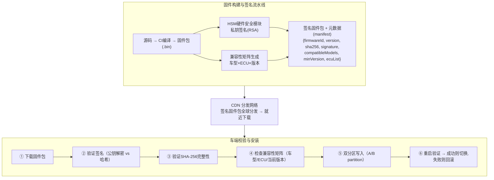

# 车载固件多版本迭代，如何设计后端校验架构，验证固件完整性、兼容性，避免异常固件导致车辆故障？

## 🎯 本质

| 校验维度 | 目的 | 技术手段 |
|----------|------|----------|
| **来源可信** | 确保固件来自Tesla官方 | RSA/ECDSA 数字签名 |
| **内容完整** | 固件包未被篡改/损坏 | SHA-256 哈希校验 |
| **版本兼容** | 适配车辆硬件/软件版本 | 版本兼容矩阵 |
| **灰度安全** | 控制故障影响范围 | 分批发布 + 自动回滚 |

---

## 🧒 类比

固件校验就像**快递验货流程**：
1. **检查发件人**：确认是官方旗舰店发的，不是骗子（数字签名）
2. **检查包裹**：外包装完好没拆过，封条没破（哈希完整性）
3. **检查型号**：确认这个配件适配你的车型（兼容性检查）
4. **先试装一台**：不是百万台一起装，先装1000台跑跑看（灰度发布）
5. **有问题退货**：装完发现问题，立即恢复原厂件（自动回滚）

---

## 📊 整体架构图



---

## 🔧 详解

### 1. 固件 Manifest 元数据

```json
{
  "firmwareId": "fw-2024.12.1-model3",
  "version": "2024.12.1",
  "previousMinVersion": "2024.8.0",
  "releaseDate": "2024-06-15T00:00:00Z",
  "compatibleModels": ["model3", "modelY"],
  "ecuTargets": ["autopilot", "infotainment", "bms"],
  "fileSize": 1850000000,
  "sha256": "a3f5e8b2c1d4...",
  "signature": "base64encodedRSA4096signature...",
  "signatureAlgorithm": "RSA-SHA256",
  "rolloutPercent": 1,
  "rollbackAllowed": true
}
```

### 2. 服务端灰度发布控制

```java
@Service
public class FirmwareRolloutService {

    // 灰度发布：逐步扩大推送范围
    public boolean canPush(String firmwareId, String vehicleId) {
        FirmwareManifest fw = getManifest(firmwareId);
        VehicleInfo vehicle = getVehicle(vehicleId);

        // ① 兼容性检查
        if (!fw.getCompatibleModels().contains(vehicle.getModel())) {
            return false;  // 车型不匹配
        }
        if (compareVersion(vehicle.getCurrentVersion(),
                          fw.getPreviousMinVersion()) < 0) {
            return false;  // 当前版本太旧，不支持直接升级
        }

        // ② 灰度百分比检查
        // 用 vehicleId 的哈希值取模，确定性地分配到灰度批次
        int hash = Math.abs(vehicleId.hashCode()) % 100;
        if (hash >= fw.getRolloutPercent()) {
            return false;  // 还没轮到这辆车
        }

        // ③ 区域分批：先推送非核心区域
        if (fw.getRolloutPercent() < 10
            && vehicle.getRegion().equals("core_market")) {
            return false;  // 前10%只推非核心市场
        }

        return true;
    }

    // 监控灰度指标，自动扩大或回滚
    @Scheduled(fixedRate = 60000)
    public void monitorRollout() {
        double errorRate = getInstallErrorRate(currentFirmwareId);
        double crashRate = getPostUpdateCrashRate(currentFirmwareId);

        if (errorRate > 0.05 || crashRate > 0.01) {
            // 错误率超阈值 → 暂停 + 全局回滚
            pauseRollout();
            triggerGlobalRollback(currentFirmwareId);
            alertService.send("CRITICAL: 固件异常, 启动全局回滚");
        } else if (errorRate < 0.001 && currentBatchComplete()) {
            // 指标健康 → 扩大灰度范围
            increaseRolloutPercent();
        }
    }
}
```

### 3. 车端校验流程（核心安全逻辑）

```java
// 车端固件校验器（C/C++/Rust实现，这里是Java伪码）
public class FirmwareVerifier {

    // Tesla 根公钥（出厂时烧录在安全芯片中）
    private static final PublicKey TESLA_ROOT_PUBKEY = loadFromHSM();

    public VerifyResult verify(byte[] firmwareData, FirmwareManifest manifest) {

        // ① 验证签名：用公钥验签
        boolean sigValid = verifySignature(
            firmwareData,
            manifest.getSha256(),    // 实际验的是哈希的签名
            manifest.getSignature(),
            TESLA_ROOT_PUBKEY
        );
        if (!sigValid) {
            return VerifyResult.reject("签名验证失败：固件可能被篡改");
        }

        // ② 验证完整性：重新计算哈希比对
        String actualHash = sha256(firmwareData);
        if (!actualHash.equals(manifest.getSha256())) {
            return VerifyResult.reject("哈希不匹配：固件数据损坏");
        }

        // ③ 兼容性检查
        if (!isCompatible(manifest, getCurrentVehicleInfo())) {
            return VerifyResult.reject("固件不兼容当前车辆配置");
        }

        return VerifyResult.pass();
    }

    private boolean verifySignature(byte[] data, String hash,
            String signature, PublicKey pubkey) {
        try {
            Signature sig = Signature.getInstance("SHA256withRSA");
            sig.initVerify(pubkey);
            sig.update(hexToBytes(hash));
            return sig.verify(base64Decode(signature));
        } catch (Exception e) {
            return false;  // 任何异常都视为验签失败
        }
    }
}
```

### 4. A/B 双分区安全安装

```
车辆存储分区设计：
┌────────────────┬────────────────┬──────────────┐
│  Partition A   │  Partition B   │  Recovery    │
│  (当前活跃)     │  (备用/升级用)  │  (恢复分区)   │
│  fw-2024.8.0   │  (空或旧版本)   │  最小系统     │
└────────────────┴────────────────┴──────────────┘

升级流程：
1. 新固件写入 Partition B（不影响当前运行的 A）
2. 写入完成后校验签名+哈希
3. 重启 → 引导程序尝试从 B 启动
4. B 启动成功 → 标记 B 为活跃，A 为备用
5. B 启动失败/崩溃 → 引导程序自动回退到 A
```

---

## ❓ 发散追问

### Q1：如何防止固件被逆向工程篡改？

1. **安全启动链**：从 BootROM → Bootloader → 内核，每一级验证下一级签名
2. **硬件安全模块（HSM）**：私钥存储在专用安全芯片中，不可读取
3. **代码混淆 + 加密**：固件代码加密存储，运行时解密
4. **防回滚计数器**：硬件计数器防降级到已知有漏洞的旧版本

### Q2：灰度发布发现问题如何快速回滚百万辆车？

- **A/B 分区回滚**：只需切换活跃分区，秒级回退
- **全局回滚指令**：通过蜂窝网络向所有车辆推送紧急回滚命令
- **分优先级**：故障车辆优先回滚，正常车辆排队处理
- **目标时间**：关键安全修复在24h内覆盖99%车辆

### Q3：OTA过程中车辆断电怎么办？

1. **原子写入**：写入B分区过程中断电，A分区不受影响，车辆正常从A启动
2. **断点续传**：固件下载支持断点续传，重新联网后从断点继续
3. **写入校验**：重启后验证B分区完整性，不完整则重新下载

## 记忆要点

- 核心四要素：来源数字签名验，内容哈希校验，版本靠矩阵，安全靠灰度+回滚
- 构建与分发：构建时HSM私钥签名生成manifest，CDN全球分发固件包
- 车端校验流：验签名→校哈希→查兼容→双分区(A/B)写入→重启验证，自动回滚保平安


## 苏格拉底式面试追问

> 这组追问模拟面试官层层逼问，每一问先回答"为什么"，再回答"怎么做"，最后回答"如何证明"。

### 第一层：目标与动机

**Q：固件校验你为什么强调要"车端+服务端双重校验"，服务端校验过不就行了吗？**

因为信任链必须在车端闭环。固件从源站到车端经过 CDN、代理、运营商网关多个中间节点，任何一环都可能被篡改（中间人攻击）。服务端校验只保证"发出去时是对的"，不保证"到达车端时还是对的"。车端用预置的公钥（烧录在硬件安全模块 HSM 里）验签名，才能确认这个包真的来自官方且未被篡改。这是零信任原则——不信任传输链路，只信任密码学验证。

### 第二层：证据与定位

**Q：灰度发布时 1% 的车升级后出现异常重启，你怎么快速定位是固件 bug 还是校验逻辑问题？**

看车端上报的诊断日志：
1. 校验阶段日志——如果验签名失败、哈希不匹配，是分发或校验问题（固件被截断、CDN 缓存错误版本）。
2. 安装阶段日志——如果校验通过但安装后启动失败，是固件本身的 bug（兼容性问题、驱动崩溃）。
3. A/B 分区状态——双分区设计下，新固件启动失败会自动回滚到旧分区。看 boot 分区切换次数，频繁切换说明新固件不稳定。

### 第三层：根因深挖

**Q：固件校验都通过了，但升级后车辆报"转向助力异常"，根因可能是什么？**

最可能是版本兼容矩阵遗漏。固件 v2.5 改了转向控制器的通信协议，但某些老款车型的转向控制器固件是 v1.0，协议不兼容。校验只查了"主固件签名正确"，没查"主固件与子控制器固件的兼容性"。根因是兼容矩阵维护不全——新固件发布前要列出所有依赖的子控制器版本，矩阵里漏了老款车型的转向控制器版本。需要补全矩阵并加入 CI 门禁。

**Q：为什么不直接强制全车所有控制器一起升级，避免兼容问题？**

不行。整车控制器几十个（刹车、转向、ADAS、座舱、电池管理），一次性全升级风险极大——任何一个控制器升级失败都可能导致车辆无法启动。必须"主固件 + 关键控制器分批升级"，每个控制器独立校验、独立回滚。而且不同控制器的固件发布节奏不同（ADAS 高频更新、刹车系统极少更新），强制同步升级会拖慢迭代。兼容矩阵就是为了解决"不同版本组合"的问题。

### 第四层：方案权衡

**Q：你说灰度发布先 1% 再 10% 再全量，但发现问题要回滚百万辆车，怎么权衡速度和安全？**

回滚策略分级：
1. 车端自动回滚——A/B 双分区，新固件启动失败 3 次自动切回旧分区，秒级恢复，不需要服务端干预。
2. 服务端熔断——监控异常率超阈值（如 0.1%）自动停止灰度推送，已升级的车辆通过控制指令触发回滚。
3. CDN 撤包——从 CDN 删除新固件 manifest，未升级的车辆拉不到新版本自然停推。权衡点：回滚速度 vs 回滚准确性。自动回滚快但可能误判（临时网络问题误判为固件故障），所以要结合异常特征（转向异常 vs 网络超时）做精准触发。

**Q：为什么不直接把固件签名算法从 RSA 换成 ECDSA，公钥更小签名更快？**

不是"为什么不"，而是"已经在换"。RSA-2048 签名 256 字节，ECDSA-P256 签名 64 字节，车端存储和传输都更省。但换算法是大工程——车端要同时支持新旧算法验签（过渡期），公钥要重新烧录或 OTA 更新（鸡生蛋问题）。所以做法是新车型直接用 ECDSA，老车型保留 RSA 直到退役。纯技术角度 ECDSA 更优，落地要考虑存量设备兼容。

### 第五层：验证与沉淀

**Q：你怎么证明固件灰度发布的安全机制真的有效？**

三层验证：
1. 混沌测试——主动构造异常固件（篡改字节、伪造签名），验证车端能拒绝安装并上报。
2. 灰度指标看板——每个灰度批次的"启动成功率""异常重启率""回滚率"，全量发布前必须连续 3 天异常率 < 0.01%。
3. 回滚演练——定期（每季度）模拟一次"发布后强制回滚"，测量从触发到全量回滚完成的耗时，要求 < 30 分钟覆盖百万辆车。

**Q：固件校验体系怎么沉淀？**

1. 校验逻辑 SDK 化——签名验证、哈希校验、兼容检查抽成车端通用库，所有控制器团队接入。
2. 兼容矩阵自动化——CI/CD 里加"兼容性检查"阶段，新固件提交时自动扫描依赖的子控制器版本，缺失的阻止发布。
3. 安全事件复盘——把这次"兼容矩阵遗漏导致转向异常"写入知识库，建立"新固件发布 checklist"，包含所有依赖项核对。


## 结构化回答

**30 秒电梯演讲：** 固件校验的核心是"完整性验证+兼容性检查+安全签名"。每个固件包用数字签名证明来源可信，用哈希验证内容完整，用版本矩阵检查兼容性，用灰度发布控制风险范围。

**展开框架：**
1. **核心四要素** — 来源数字签名验，内容哈希校验，版本靠矩阵，安全靠灰度+回滚
2. **构建与分发** — 构建时HSM私钥签名生成manifest，CDN全球分发固件包
3. **车端校验流** — 验签名→校哈希→查兼容→双分区(A/B)写入→重启验证，自动回滚保平安

**收尾：** 这块我踩过坑——要不要深入聊：如何防止固件被逆向工程篡改？

## 视频脚本

> 预计时长：4 分钟 | 由浅入深

| 时间 | 画面/字幕 | 口播台词 | 讲解要点 |
|------|----------|----------|----------|
| 0:00 | 标题卡 | "分布式一句话：固件校验的核心是'完整性验证+兼容性检查+安全签名'。每个固件包用数字签名证明来源可信…。" | 开场钩子 |
| 0:15 | 架构示意图 | "核心四要素：来源数字签名验，内容哈希校验，版本靠矩阵，安全靠灰度+回滚" | 核心四要素 |
| 1:08 | 架构示意图分步演示 | "构建与分发：构建时HSM私钥签名生成manifest，CDN全球分发固件包" | 构建与分发 |
| 2:01 | 关键代码/伪代码片段 | "车端校验流：验签名到校哈希到查兼容到双分区(A/B)写入到重启验证，自动回滚保平安" | 车端校验流 |
| 2:54 | 对比表格 | "数字签名(RSA/ECDSA)验证固件来源" | 数字签名 |
| 3:50 | 总结卡 | "核心抓住这条主线，下期咱们接着聊：如何防止固件被逆向工程篡改。" | 收尾 |
