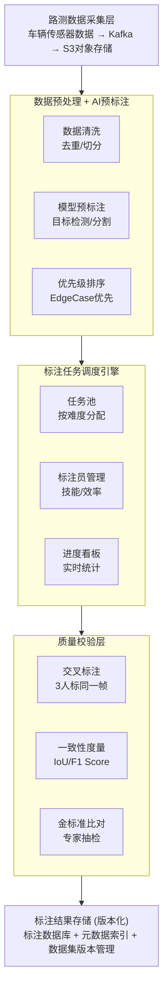

# PB级路测数据需人工+自动标注，如何设计后端架构，支持标注任务分配、进度跟踪与标注结果校验？

## 🎯 本质

| 挑战 | 量化 | 方案 |
|------|------|------|
| **存储** | PB级视频/图片 | S3分层存储(热/温/冷) |
| **吞吐** | 日处理百万条 | AI预标注 + 人工修正 |
| **调度** | 千名标注员并行 | 工作流引擎 + 负载均衡 |
| **质量** | 标注准确率>95% | 交叉标注 + 一致性检验 |

---

## 🧒 类比

把标注系统想象成**工厂流水线**：
1. **原料仓库**（S3）：海量原材料按品类存放
2. **AI预处理车间**（自动标注）：机器先做粗加工
3. **人工精加工车间**（标注员）：工人修正机器的半成品
4. **质检站**（质量校验）：抽查 + 复检
5. **成品仓库**（标注数据库）：合格的标注数据入库

---

## 📊 整体架构图



---

## 🔧 详解

### 1. PB级数据分层存储

```java
// 存储分层策略：根据数据访问频率自动迁移
public class DataTieringService {

    // S3生命周期规则
    // Hot  (S3 Standard)    : 0-30天    高频访问（正在标注的）
    // Warm (S3 IA)          : 30-90天   低频访问（已标注的）
    // Cold (S3 Glacier)     : 90-365天  归档（训练用的）
    // Archive(Glacier Deep) : 365天+    长期归档

    @Scheduled(cron = "0 0 2 * * ?")
    public void migrateColdData() {
        // 90天未访问的数据 → 迁移到Glacier（成本降低90%）
        String sql = """
            UPDATE annotation_tasks
            SET storage_class = 'GLACIER'
            WHERE status = 'COMPLETED'
              AND updated_at < DATE_SUB(NOW(), INTERVAL 90 DAY)
              AND storage_class = 'STANDARD'
            """;
        // ...
    }
}
```

### 2. AI预标注 + 人工修正流水线

```python
# AI预标注服务（Python/PyTorch）
class AutoAnnotator:
    def __init__(self):
        self.detector = load_model('yolo_v8_finetuned.pt')  # 目标检测
        self.segmentor = load_model('sam_segmentation.pt')   # 图像分割

    def pre_annotate(self, frame_data):
        """
        对一帧路测数据做自动标注
        输出预标注结果，人工只需修正错误
        """
        results = {
            'boxes': [],    # 检测框 [x,y,w,h,class,confidence]
            'masks': [],    # 分割掩码
            'lanes': [],    # 车道线
            'traffic_signs': []  # 交通标志
        }

        # 1. 目标检测：行人/车辆/障碍物
        detections = self.detector(frame_data)
        for det in detections:
            if det.confidence > 0.5:
                results['boxes'].append(det.to_dict())

        # 2. 车道线检测
        lanes = detect_lanes(frame_data)
        results['lanes'] = lanes

        # 3. 交通标志分类
        signs = classify_signs(frame_data)
        results['traffic_signs'] = signs

        # 自动标注置信度评分
        # 低置信度的标记为"需要人工审核"
        results['auto_confidence'] = calculate_confidence(results)
        results['needs_human'] = results['auto_confidence'] < 0.8

        return results
```

### 3. 标注任务调度引擎

```java
@Service
public class AnnotationTaskScheduler {

    // 任务分配策略：根据标注员技能 + 任务难度 + 负载均衡
    public AnnotationTask assignNextTask(String annotatorId) {
        AnnotatorProfile profile = getProfile(annotatorId);

        // ① 优先分配紧急任务（EdgeCase高优先级）
        AnnotationTask urgent = taskPool.getHighestPriority(
            profile.getSkillLevel()
        );
        if (urgent != null) return claimTask(urgent, annotatorId);

        // ② 按技能匹配分配
        List<AnnotationTask> candidates = taskPool.findMatching(
            profile.getSkills(),
            profile.getDifficultyRange(),
            10  // 取10个候选
        );

        // ③ 负载均衡：选择积压最少的任务批次
        AnnotationTask best = candidates.stream()
            .min(Comparator.comparingInt(AnnotationTask::getPendingCount))
            .orElse(null);

        return best != null ? claimTask(best, annotatorId) : null;
    }

    // 进度跟踪
    public ProgressReport getProgress(String batchId) {
        return ProgressReport.builder()
            .total(taskMapper.countByBatch(batchId))
            .completed(taskMapper.countByBatchAndStatus(batchId, "COMPLETED"))
            .inProgress(taskMapper.countByBatchAndStatus(batchId, "IN_PROGRESS"))
            .avgTimePerTask(taskMapper.avgTimeByBatch(batchId))
            .qualityScore(qualityService.getBatchScore(batchId))
            .build();
    }
}
```

### 4. 交叉标注 + 一致性校验

```java
@Service
public class QualityAssuranceService {

    // 交叉标注：同一帧数据分配给3个标注员独立标注
    public void createCrossAnnotationTasks(FrameData frame) {
        List<String> annotators = selectAnnotators(3);  // 随机选3人
        for (String annotatorId : annotators) {
            AnnotationTask task = new AnnotationTask();
            task.setFrameId(frame.getId());
            task.setAnnotatorId(annotatorId);
            task.setPreAnnotation(frame.getAutoResult()); // 带预标注
            task.setCrossCheckGroup(frame.getId());       // 同一组
            taskMapper.insert(task);
        }
    }

    // 一致性校验：计算3人标注结果的一致性
    public QualityResult evaluateConsistency(String frameId) {
        List<Annotation> annotations = getAnnotations(frameId);

        if (annotations.size() < 2) {
            return QualityResult.insufficient();
        }

        // 计算两两IoU（Intersection over Union）
        double avgIoU = calculatePairwiseIoU(annotations);

        if (avgIoU > 0.9) {
            return QualityResult.consistent(annotations.get(0)); // 高一致 → 直接采纳
        } else if (avgIoU > 0.7) {
            return QualityResult.needReview(); // 中一致 → 需专家仲裁
        } else {
            return QualityResult.reject("标注不一致，需重新标注"); // 低一致 → 打回重做
        }
    }

    private double calculatePairwiseIoU(List<Annotation> annotations) {
        double sum = 0;
        int count = 0;
        for (int i = 0; i < annotations.size(); i++) {
            for (int j = i + 1; j < annotations.size(); j++) {
                sum += IoU(annotations.get(i), annotations.get(j));
                count++;
            }
        }
        return sum / count;
    }
}
```

---

## ❓ 发散追问

### Q1：自动标注准确率不够怎么办？

- **主动学习**：模型置信度低的样本优先分配人工标注，反馈给模型再训练
- **人机协作**：AI负责粗标（画框），人工负责精修（调整边界）
- **渐进提升**：随着人工标注数据积累，模型逐步提升预标注准确率

### Q2：如何管理数千名标注员的工作效率？

- **技能分级**：初级标简单目标，高级标EdgeCase
- **实时看板**：每人完成量、平均耗时、质量分数一目了然
- **激励机制**：高质量标注给予奖金，低质量降低分配优先级
- **疲劳检测**：连续标注超时强制休息，避免质量下降

### Q3：标注数据如何防泄露？

1. **标注平台无下载**：标注员只能在线标注，不能导出原始图片
2. **水印 + 追溯**：每帧数据嵌入隐形水印，泄露可追溯到人
3. **DLP 数据防泄露**：监控异常行为（如截屏/拍照频率过高）
4. **权限分级**：不同标注员只能看到分配给自己的数据

## 记忆要点

- 存算降本：S3分层存PB级数据，AI预标注提效减负，人工仅做边缘精修
- 任务调度：按难度和标注员技能动态分配，可视化看板实时跟踪进度
- 质量校验：3人交叉标注算IoU，结合专家金标准抽检，保95%准确率


## 苏格拉底式面试追问

> 这组追问模拟面试官层层逼问，每一问先回答"为什么"，再回答"怎么做"，最后回答"如何证明"。

### 第一层：目标与动机

**Q：PB 级数据标注你为什么用 AI 预标注 + 人工修正，而不是纯人工或纯自动？**

纯人工扛不住量。1PB ≈ 1 亿条数据，每条 30s，人工要 9500 万年。纯自动又达不到自动驾驶训练所需的准确率（95%+），模型预标注的边缘 case（遮挡、长尾场景）准确率只有 70-80%。所以用 AI 预标注把人工工作量降到 10%——模型标好 90% 的明确目标，人工只修正边缘 case，效率提升 10 倍。这是人机协同的最优解，不是技术偷懒。

### 第二层：证据与定位

**Q：标注质量下降，模型训练后路测里程指标（MPI，每英里接管次数）变差，你怎么定位是哪批标注数据的问题？**

按批次追溯：
1. 数据版本溯源——模型训练用的数据集有版本号，反查这个版本包含哪些标注批次。
2. 标注员一致性——查这批数据的标注员交叉一致性（IoU），如果某批 IoU 从 0.9 掉到 0.6，是这批标注质量差。
3. 类别分布——查这批数据是否引入了类别错误（比如把"摩托车"标成"自行车"），导致模型分类混乱。用 confusion matrix 定位错误集中的类别对。

### 第三层：根因深挖

**Q：发现某批数据的 IoU 普遍偏低，根因是标注员水平还是标注规范问题？**

先看是不是规范歧义。如果多个标注员在同一场景标注结果差异大，但每个人自己的历史一致性正常，说明是规范定义不清（比如"被遮挡 30% 的车要不要标"没说清）。如果某个标注员自己的历史 IoU 就低，是他个人水平问题（新人没培训好）。区分方法：把同一批数据让不同标注员重标，统计"标注员间一致性"vs"标注员内一致性"，前者低是规范问题，后者低是个人问题。

**Q：为什么不直接用最先进的自动标注模型（比如 SAM、GroundingDINO），彻底替代人工？**

因为自动驾驶的长尾场景模型也搞不定。自动模型在"清晰车道线、完整车辆"场景准确率 95%+，但在"暴雨中部分遮挡的施工车""夜间反光的临时路障"这种长尾 case 准确率骤降。而自动驾驶恰恰是这些长尾 case 决定了安全性（90% 场景做对了，10% 长尾出错就是事故）。所以人工的价值在于处理模型不确定的边缘场景，模型负责量大面广的常规场景。全自动化是目标，但在安全攸关场景，人工兜底不可省。

### 第四层：方案权衡

**Q：你说交叉标注（多人标同一份数据）保质量，但这样成本翻 3 倍，怎么权衡？**

不是全量交叉，是"抽样交叉 + 金标准"。策略：
1. 金标准集——专家标注 1% 的数据作为"标准答案"，这批数据只给标注员标，算准确率，不用于训练。
2. 抽样交叉——普通数据只标一次，但随机抽 10% 让第二人重标，算 IoU 监控质量，不一致的触发仲裁（第三人或专家裁决）。
3. 难度分级——简单数据（高速直道）标 1 次，复杂数据（城区复杂路口）标 3 次取多数。成本只增加 30%，质量接近全量交叉。

**Q：为什么不直接把标注众包出去（像 Amazon Mechanical Turk），成本最低？**

自动驾驶数据是核心机密 + 安全攸关。众包标注员身份不可控，可能泄露路测数据（包含真实路况、人脸车牌），而且众包质量参差不齐，无法保证 95% 准确率。必须用受控的标注团队（签 NDA、经过培训、有质量考核）。成本高但数据和质量的保障不可替代。众包适合"图片分类、情感分析"这种低敏感低精度任务，不适合自动驾驶。

### 第五层：验证与沉淀

**Q：你怎么证明标注质量真的达标（95%+ 准确率）？**

建立质量度量体系：
1. 金标准准确率——标注员在金标准集上的准确率，必须 > 95% 才算合格。
2. 标注员间 IoU——同一数据多人标注的 IoU 均值，目标 > 0.85（目标检测）。
3. 下游验证——标注数据训练出的模型在测试集上的指标（mAP、MPI），如果指标下降，反推标注质量有问题。三方指标交叉验证，单看任何一个都不够。

**Q：标注体系怎么沉淀？**

1. 标注规范版本化——规范文档纳入 Git 管理，每次更新记录变更原因和影响范围，便于追溯历史标注用的是哪版规范。
2. 预标注模型迭代闭环——模型训练 → 预标注新数据 → 人工修正 → 修正后的数据反哺训练，形成数据飞轮，模型越用越准。
3. 标注员管理系统——技能标签（擅长车道线/行人/交通标志）、质量评分、产能统计，任务调度引擎按技能和质量动态分配，新人不分配复杂任务。


## 结构化回答

**30 秒电梯演讲：** PB级数据标注的核心是"海量存储+任务调度+质量校验"。存储用对象存储(S3/HDFS)+元数据库；任务调度用工作流引擎分配标注任务；质量校验用交叉标注+一致性度量保证准确率。

**展开框架：**
1. **存算降本** — S3分层存PB级数据，AI预标注提效减负，人工仅做边缘精修
2. **任务调度** — 按难度和标注员技能动态分配，可视化看板实时跟踪进度
3. **质量校验** — 3人交叉标注算IoU，结合专家金标准抽检，保95%准确率

**收尾：** 这块我踩过坑——要不要深入聊：自动标注准确率不够怎么办？

## 视频脚本

> 预计时长：4 分钟 | 由浅入深

| 时间 | 画面/字幕 | 口播台词 | 讲解要点 |
|------|----------|----------|----------|
| 0:00 | 标题卡 | "分布式一句话：PB级数据标注的核心是'海量存储+任务调度+质量校验'。存储用对象存储(S3/HDFS)+元数据库…。" | 开场钩子 |
| 0:15 | 架构示意图 | "存算降本：S3分层存PB级数据，AI预标注提效减负，人工仅做边缘精修" | 存算降本 |
| 1:08 | 架构示意图分步演示 | "任务调度：按难度和标注员技能动态分配，可视化看板实时跟踪进度" | 任务调度 |
| 2:01 | 关键代码/伪代码片段 | "质量校验：3人交叉标注算IoU，结合专家金标准抽检，保95%准确率" | 质量校验 |
| 2:54 | 对比表格 | "S3/HDFS对象存储管理PB级原始数据" | S3/HDFS对象存储管 |
| 3:50 | 总结卡 | "核心抓住这条主线，下期咱们接着聊：自动标注准确率不够怎么办。" | 收尾 |
