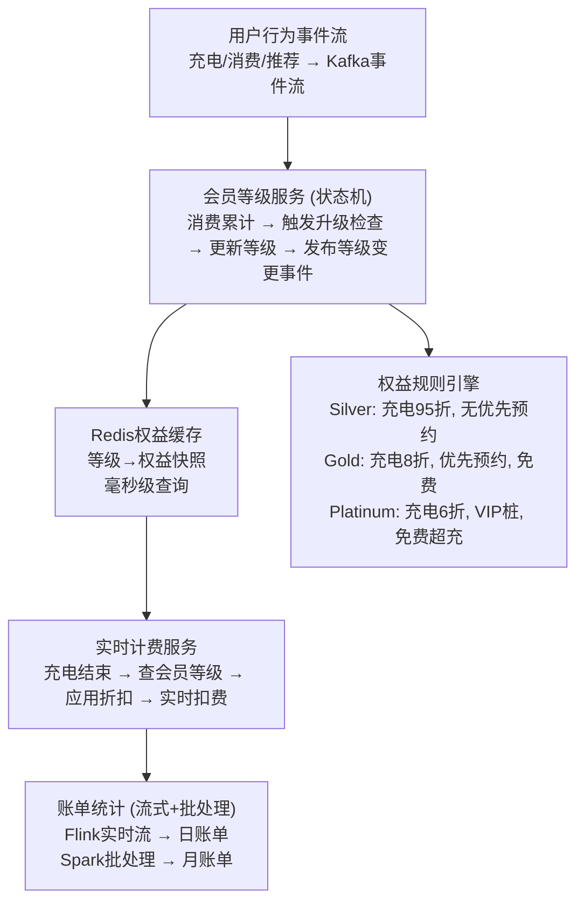

# 会员享受充电折扣、优先预约等权益，如何设计后端架构，支持会员等级管理、权益实时生效与账单统计？

## 🎯 本质

```
会员系统 = 等级管理(状态机) + 权益管理(规则引擎) + 计费系统(实时+批处理)
```

| 模块 | 职责 | 关键挑战 |
|------|------|----------|
| **等级管理** | 升降级规则 | 跨周期升降级 |
| **权益管理** | 等级→权益映射 | 实时生效 |
| **实时计费** | 充电时应用折扣 | 并发扣费准确性 |
| **账单统计** | 月度/年度汇总 | 海量交易聚合 |

---

## 🧒 类比

想象一个**航空公司常旅客计划**：
1. 飞够里程升级银卡/金卡/白金卡（等级状态机）
2. 不同等级享受不同权益：休息室/优先登机/额外行李（权益映射）
3. 买票时自动应用里程折扣（实时计费）
4. 每月发送里程对账单（账单统计）

---

## 📊 整体架构图



---

## 🔧 详解

### 1. 会员等级状态机

```java
public enum MemberTier {
    SILVER(1),    // 银卡
    GOLD(2),      // 金卡
    PLATINUM(3);  // 白金卡

    public final int level;
    MemberTier(int level) { this.level = level; }
}

@Service
public class MembershipService {

    // 消费事件触发等级检查
    @KafkaListener(topics = "charging-completed")
    public void onChargingCompleted(ChargingEvent event) {
        // ① 更新累计消费
        membershipMapper.addSpending(event.getUserId(), event.getAmount());

        // ② 检查是否触发升级
        Membership membership = getMembership(event.getUserId());
        MemberTier newTier = calculateTier(membership.getTotalSpending());

        if (newTier.level > membership.getTier().level) {
            // ③ 升级！
            membershipMapper.updateTier(event.getUserId(), newTier);

            // ④ 刷新权益缓存
            refreshBenefitsCache(event.getUserId(), newTier);

            // ⑤ 发布升级事件 → 推送通知 + 权益立即生效
            eventBus.publish(new TierUpgradedEvent(event.getUserId(), newTier));
        }
    }

    private MemberTier calculateTier(double totalSpending) {
        if (totalSpending >= 10000) return MemberTier.PLATINUM;
        if (totalSpending >= 3000) return MemberTier.GOLD;
        return MemberTier.SILVER;
    }
}
```

### 2. 权益规则引擎

```java
// 权益定义（配置化，不改代码就能调整）
public class BenefitRule {
    private MemberTier minTier;           // 最低等级要求
    private String benefitType;           // 权益类型
    private BigDecimal discountRate;      // 折扣率
    private Integer priorityLevel;        // 优先预约等级
    private Integer freeChargingMinutes;  // 免费充电分钟数
    private boolean vipChargerAccess;     // VIP桩权限
}

// 权益配置存储（DB/配置中心）
@Service
public class BenefitRuleService {

    @Cacheable(value = "benefits", key = "#tier")
    public BenefitRule getBenefits(MemberTier tier) {
        // 从DB加载该等级的权益配置
        return benefitRuleMapper.findByTier(tier);
    }

    // 权益变更时刷新缓存
    public void refreshBenefitsCache(Long userId, MemberTier tier) {
        BenefitRule benefits = getBenefits(tier);
        // 写入Redis，充电服务直接读Redis
        redis.opsForValue().set(
            "member:benefits:" + userId,
            JSON.toJSONString(benefits),
            7, TimeUnit.DAYS
        );
    }
}
```

### 3. 实时计费（充电结束时应用折扣）

```java
@Service
public class ChargingBillService {

    public Bill calculateBill(String userId, ChargingSession session) {
        // ① 查会员权益（从Redis，毫秒级）
        BenefitRule benefits = getBenefitsFromCache(userId);

        // ② 计算基础费用
        BigDecimal energyCost = session.getEnergyKwh()
            .multiply(session.getPricePerKwh());

        // ③ 应用会员折扣
        BigDecimal discountRate = benefits.getDiscountRate();
        BigDecimal discountedCost = energyCost.multiply(discountRate);

        // ④ 扣减免费充电额度
        BigDecimal finalCost = discountedCost;
        if (benefits.getFreeChargingMinutes() > 0) {
            int freeMinutes = Math.min(
                benefits.getFreeChargingMinutes(),
                session.getDurationMinutes()
            );
            BigDecimal freeAmount = calculateFreeAmount(freeMinutes, session);
            finalCost = finalCost.subtract(freeAmount).max(BigDecimal.ZERO);
        }

        // ⑤ 扣费（原子操作）
        paymentService.charge(userId, finalCost);

        return new Bill(session, energyCost, discountRate, finalCost);
    }
}
```

### 4. 账单统计（流式 + 批处理）

```java
// 日账单：Flink实时流计算
public class DailyBillingJob {

    // 每小时汇总一次当日充电消费
    @Scheduled(cron = "0 0 * * * ?")
    public void aggregateDailyBills() {
        // 按用户聚合当日所有充电消费
        String sql = """
            INSERT INTO daily_bill (user_id, bill_date, total_amount,
                                   discount_amount, final_amount, charge_count)
            SELECT user_id, DATE(created_at) as bill_date,
                   SUM(original_amount) as total_amount,
                   SUM(discount_amount) as discount_amount,
                   SUM(final_amount) as final_amount,
                   COUNT(*) as charge_count
            FROM charging_bill
            WHERE created_at >= CURDATE()
            GROUP BY user_id, DATE(created_at)
            ON DUPLICATE KEY UPDATE
                total_amount = VALUES(total_amount),
                final_amount = VALUES(final_amount)
            """;
        billMapper.upsertDailyBills(sql);
    }
}

// 月账单：月底批量生成
@Scheduled(cron = "0 0 3 1 * ?") // 每月1号凌晨3点
public void generateMonthlyBills() {
    // 汇总上月所有日账单 → 月账单
    // 包含：总消费/总折扣/充电次数/会员权益使用情况
}
```

---

## ❓ 发散追问

### Q1：会员刚升级，权益如何秒级生效？

1. **事件驱动**：升级事件发布后，消费者立即刷新Redis缓存
2. **充电前实时校验**：即使缓存未更新，充电服务也会查一次最新等级
3. **用户侧推送**：升级后App立即收到通知，权益状态实时更新

### Q2：权益被滥用怎么办？

- **使用上限**：免费充电有月度上限（如每月300分钟）
- **频率限制**：优先预约每天限2次
- **异常检测**：高频使用触发风控审核
- **权益回收**：退订/降级时自动回收未使用权益

### Q3：跨国会员如何处理汇率和税费？

- **多币种计费**：按充电站所在地货币计价，会员折扣率通用
- **汇率转换**：账单按用户主货币展示，实时汇率换算
- **税费合规**：不同国家税率不同，计费引擎按地区加载税率规则

## 记忆要点

- 架构三模块：等级状态机管升降，规则引擎配权益，实时+批处理管账单
- 事件驱动：消费Kafka触发升级，等级变更后同步Redis毫秒级生效权益
- 计费统计：充电结算实时算折扣，Flink算日账单，Spark汇月账单


## 苏格拉底式面试追问

> 这组追问模拟面试官层层逼问，每一问先回答"为什么"，再回答"怎么做"，最后回答"如何证明"。

### 第一层：目标与动机

**Q：会员权益为什么用规则引擎（Drools/自研）而不是直接 if-else 写在代码里？**

因为权益规则会频繁变。新车型上市加权益、促销活动临时调折扣、不同地区权益不同，如果硬编码每次改都要发版。规则引擎把"等级→权益"的映射做成配置，运营在后台改规则即时生效，不动代码。而且规则会越来越复杂（金卡 + 北京用户 + 工作日 = 折扣 8 折），if-else 嵌套到几百行没法维护。决策依据：规则变更频率 > 每月 2 次，就必须规则引擎。

### 第二层：证据与定位

**Q：用户反馈"我是金卡会员但充电没打折"，你怎么定位？**

查权益生效链路三段：
1. 会员等级——查 Redis `member:level:{uid}` 是不是 Gold，如果 DB 是 Gold 但 Redis 不是，是升级事件没同步缓存。
2. 权益规则——查规则引擎当前对 Gold 等级的充电折扣配置，是不是被运营误改（比如折扣改成 1.0 即不打折）。
3. 计费时刻——充电结算时拿的等级快照，可能充电过程中等级刚过期（金卡降银卡），结算用的是降级后的权益。

### 第三层：根因深挖

**Q：会员升级了，DB 已更新但 Redis 还是旧等级，根因是什么？**

最可能是升级事件链路断了。升级流程：行为触发（如累计消费达标）→ 等级计算服务更新 DB → 发 Kafka 事件 → 缓存同步服务消费事件更新 Redis。如果 Kafka 消息丢了（生产端发送失败未重试）或消费端处理失败（Redis 写入异常被吞），缓存就不更新。另一种可能是 Redis 主从延迟——写了主库但读的是从库，刚写完立即读不到。要看 Kafka 消费日志和 Redis 读写时间戳。

**Q：为什么不直接每次查权益都查 DB，保证强一致，还要搞缓存同步那么复杂？**

充电结算 QPS 高（千万会员，峰值万级并发结算），每次查 DB 等级 + 权益 + 折扣要 50ms+，高并发下 DB 连接池打满。Redis 查询 1ms，差 50 倍。而且权益变更频率低（会员等级不是每秒都变），缓存命中率 > 99%，缓存是性能和一致性的最优解。强一致用"双写 + 缓存失效"兜底——升级时同时写 DB 和失效 Redis，下次读触发回填，几毫秒不一致窗口可接受。

### 第四层：方案权衡

**Q：权益"实时生效"你用事件驱动，但如果 Kafka 积压，生效延迟到分钟级，用户感知到怎么办？**

分级保障：
1. 关键权益（充电折扣）——双写 DB + Redis 强制同步，不走 Kafka 异步，保证秒级生效。
2. 非关键权益（优先预约）——走 Kafka 异步，分钟级延迟可接受。
3. 兜底——结算时如果 Redis 权益与 DB 不一致，以 DB 为准（实时查 DB 兜底），代价是偶尔慢一点但权益不错。权衡点：高频权益用强一致保体验，低频权益用最终一致保性能。

**Q：为什么不直接给所有权益都用强一致（双写），反正也不会错？**

性能扛不住。双写意味着每次权益查询都要 DB + Redis 双读比对，DB 的 QPS 直接翻倍。千万会员的权益查询 QPS 万级，全走 DB 会把会员服务打挂。而且大多数权益对一致性不敏感——"会员专享壁纸"晚 1 分钟解锁用户无感，"充电折扣"才算错钱。按业务影响分级，把强一致用在刀刃上，是成本和体验的平衡。

### 第五层：验证与沉淀

**Q：你怎么证明权益生效的实时性和准确性？**

两类指标：
1. 实时性——升级事件时间戳 vs Redis 更新时间戳，差值 P99 < 1s（关键权益）/< 60s（普通权益）。
2. 准确性——每天对账：随机抽 1 万笔充电订单，核对"结算时用的权益"vs"用户当时应有的权益"，不一致率 < 0.01%。不一致订单触发补偿（退还多收费用）。

**Q：会员系统怎么沉淀？**

1. 权益规则可视化——运营后台可视化配置规则（等级 + 条件 → 权益），不用开发改代码，规则变更走审批流留痕。
2. 计费引擎复用——把"查权益→算折扣→生成账单"抽成计费 SDK，充电、超充、换电等业务复用，新业务接入只配规则不改代码。
3. 升级链路监控——Kafka 消费延迟、Redis 与 DB 差异率告警，延迟超阈值自动触发"强制回源查 DB"降级，避免用户拿不到权益。


## 结构化回答

**30 秒电梯演讲：** 会员系统的本质是"等级状态机+权益规则引擎+实时计费"。核心：用户充值/行为升级会员等级（状态机），等级映射权益（规则引擎），充电时实时应用折扣（计费引擎）。

**展开框架：**
1. **架构三模块** — 等级状态机管升降，规则引擎配权益，实时+批处理管账单
2. **事件驱动** — 消费Kafka触发升级，等级变更后同步Redis毫秒级生效权益
3. **计费统计** — 充电结算实时算折扣，Flink算日账单，Spark汇月账单

**收尾：** 这块我踩过坑——要不要深入聊：会员刚升级，权益如何秒级生效？

## 视频脚本

> 预计时长：3 分钟 | 由浅入深

| 时间 | 画面/字幕 | 口播台词 | 讲解要点 |
|------|----------|----------|----------|
| 0:00 | 标题卡 | "高并发一句话：会员系统的本质是'等级状态机+权益规则引擎+实时计费'。核心：用户充值/行为升级会员等级（状态机）…。" | 开场钩子 |
| 0:15 | 缓存读写策略流程图 | "架构三模块：等级状态机管升降，规则引擎配权益，实时+批处理管账单" | 架构三模块 |
| 1:06 | 缓存读写策略流程图分步演示 | "事件驱动：消费Kafka触发升级，等级变更后同步Redis毫秒级生效权益" | 事件驱动 |
| 1:57 | 关键代码/伪代码片段 | "计费统计：充电结算实时算折扣，Flink算日账单，Spark汇月账单" | 计费统计 |
| 2:50 | 总结卡 | "核心抓住这条主线，下期咱们接着聊：会员刚升级，权益如何秒级生效。" | 收尾 |
