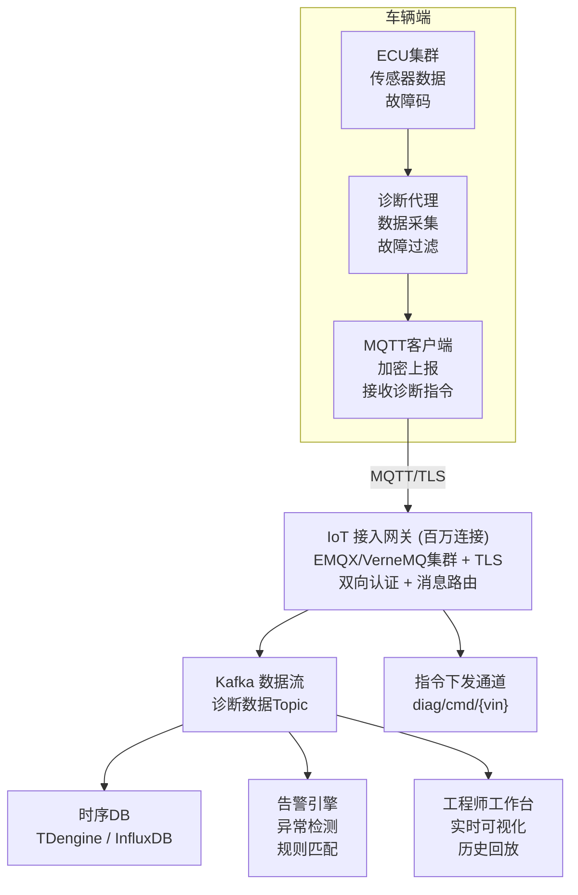

# 工程师远程诊断车辆故障，如何设计后端架构，支持实时获取车载故障数据、远程调试且不影响车辆行驶？

## 🎯 本质

| 维度 | 挑战 | 方案 |
|------|------|------|
| **数据采集** | 千万辆车持续上报 | MQTT + Kafka 流式处理 |
| **实时性** | 故障数据毫秒级延迟 | WebSocket + 时序数据库 |
| **安全性** | 诊断通道不能控制行驶 | 网关隔离 + 权限分级 |
| **可用性** | 不影响正常行驶 | 异步非阻塞 + 降级机制 |

---

## 🧒 类比

把远程诊断想象成**ICU远程监护系统**：
1. **智能手环**（车载ECU）：实时采集生命体征 → 上传到监护仪
2. **监护仪**（MQTT/Kafka）：汇总展示所有病人的数据
3. **医生工作站**（工程师工作台）：远程查看异常病人的详细数据
4. **远程医嘱**（诊断指令）：医生发送"测一下血糖"指令 → 手环执行
5. **安全门**（安全网关）：医嘱只能"检查"不能"手术"（只读+非安全操作）

---

## 📊 整体架构图



---

## 🔧 详解

### 1. MQTT 双向通信通道

```java
// 车端诊断代理（Java伪码）
public class VehicleDiagnosticAgent {

    private MqttClient mqttClient;

    // 启动：连接IoT网关，订阅诊断指令Topic
    public void start(String vin) {
        mqttClient = new MqttClient(
            "ssl://iot-gateway.tesla.com:8883",
            "vehicle-" + vin
        );

        MqttConnectOptions opts = new MqttConnectOptions();
        opts.setSocketFactory(SSLContextFactory.getMutualTLS());
        opts.setKeepAliveInterval(30);
        opts.setAutomaticReconnect(true);

        mqttClient.connect(opts);

        // 订阅本车诊断指令Topic
        mqttClient.subscribe("diag/cmd/" + vin, (topic, msg) -> {
            handleDiagnosticCommand(msg);
        });

        // 启动定期数据上报
        startPeriodicReport(vin);
    }

    // 上报诊断数据
    private void reportDiagnosticData(String vin, DiagnosticData data) {
        String topic = "diag/data/" + vin;
        String payload = JSON.toJSONString(data);
        MqttMessage msg = new MqttMessage(payload.getBytes());
        msg.setQos(1);  // 至少一次，保证不丢
        mqttClient.publish(topic, msg);
    }

    // 处理远程诊断指令（安全沙箱执行）
    private void handleDiagnosticCommand(MqttMessage msg) {
        DiagnosticCommand cmd = JSON.parseObject(msg.getPayload(), DiagnosticCommand.class);

        // 安全检查：只允许只读/非安全相关指令
        if (!cmd.isSafeCommand()) {
            reportSecurityViolation(cmd);
            return;
        }

        switch (cmd.getType()) {
            case READ_DTC:        // 读取故障码
                reportDiagnosticData(vin, ecuReader.readDTCs());
                break;
            case READ_FREEZE_FRAME: // 读取冻结帧数据
                reportDiagnosticData(vin, ecuReader.readFreezeFrame(cmd.getEcuId()));
                break;
            case RUN_SELF_TEST:   // 执行自检
                reportDiagnosticData(vin, ecuReader.runSelfTest(cmd.getEcuId()));
                break;
            // 禁止：任何影响刹车/转向/动力的写操作
        }
    }
}
```

### 2. 时序数据库存储

```sql
-- TDengine/InfluxDB 时序表设计
-- 超级表：每辆车一个子表，按时间存储诊断数据
CREATE STABLE vehicle_diagnostics (
    ts          TIMESTAMP,          -- 时间戳
    vin         BINARY(17),         -- 车辆识别号
    ecu_id      BINARY(32),         -- ECU标识
    dtc_code    BINARY(16),         -- 故障码
    severity    TINYINT,            -- 严重程度 1-5
    sensor_val  FLOAT,              -- 传感器数值
    status      TINYINT             -- 状态码
) TAGS (
    model       BINARY(16),         -- 车型
    region      BINARY(32)          -- 地区
);

-- 查询：某辆车最近1小时的所有故障数据
SELECT * FROM vehicle_diagnostics
WHERE vin = '5YJSA1E47MF123456'
  AND ts > NOW - 1h
ORDER BY ts DESC;

-- 查询：某批次车辆的特定故障码统计
SELECT COUNT(*) as cnt, vin
FROM vehicle_diagnostics
WHERE dtc_code = 'P0301'
  AND ts > NOW - 24h
GROUP BY vin
ORDER BY cnt DESC;
```

### 3. 工程师工作台

```java
// WebSocket推送实时诊断数据到工程师浏览器
@ServerEndpoint("/ws/diagnostic/{vin}")
@Component
public class DiagnosticWebSocket {

    private static final Map<String, Session> sessions = new ConcurrentHashMap<>();

    @OnOpen
    public void onOpen(@PathParam("vin") String vin, Session session) {
        sessions.put(vin, session);
        // 订阅Kafka中该车的诊断数据流
        kafkaConsumer.subscribe("diag-data-" + vin);
    }

    // 实时推送诊断数据到工程师界面
    public void pushDiagnosticData(String vin, DiagnosticData data) {
        Session session = sessions.get(vin);
        if (session != null && session.isOpen()) {
            session.getAsyncRemote().sendText(JSON.toJSONString(data));
        }
    }

    // 工程师下发诊断指令
    @OnMessage
    public void onCommand(String message, @PathParam("vin") String vin) {
        DiagnosticCommand cmd = JSON.parseObject(message, DiagnosticCommand.class);
        cmd.setVin(vin);
        cmd.setEngineerId(SecurityContext.getCurrentEngineerId());
        cmd.setTimestamp(System.currentTimeMillis());

        // 权限校验 + 安全审计
        if (permissionService.canExecute(cmd.getEngineerId(), cmd.getType())) {
            // 通过MQTT下发到车辆
            mqttGateway.publish("diag/cmd/" + vin, JSON.toJSONString(cmd));
            auditLog.record(cmd);  // 审计日志
        }
    }
}
```

### 4. 安全隔离架构

```
车辆网络安全分区：
┌────────────────────────────────────────────────────┐
│                  诊断网络 (只读隔离)                  │
│   ┌──────┐  ┌──────┐  ┌──────┐                    │
│   │诊断代理│  │数据上报│  │指令接收│                   │
│   └──────┘  └──────┘  └──────┘                    │
│         ↕ 只读桥接（硬件隔离）                        │
├────────────────────────────────────────────────────┤
│                  安全关键网络 (禁止外部访问)           │
│   ┌──────┐  ┌──────┐  ┌──────┐                    │
│   │刹车ECU│  │转向ECU│  │ADAS  │                    │
│   └──────┘  └──────┘  └──────┘                    │
└────────────────────────────────────────────────────┘
```

---

## ❓ 发散追问

### Q1：诊断通道如何避免被黑客利用控制车辆？

1. **网络隔离**：诊断网络和安全控制网络物理隔离（网关硬件隔离）
2. **指令白名单**：只允许只读/自检类指令，禁止任何控制类操作
3. **双向TLS认证**：车辆和云端双向证书认证，防止中间人攻击
4. **操作审计**：每个诊断指令记录工程师ID+时间+内容，可追溯

### Q2：千万辆车同时上报数据如何处理？

- **MQTT百万连接**：EMQX集群支持千万级MQTT连接
- **Kafka分流**：按地区/车型分Partition，并行消费
- **数据采样**：正常状态低频上报（1次/分钟），异常状态高频上报
- **边缘计算**：车端先做异常检测，只有异常时才上报

### Q3：诊断过程中网络断了怎么办？

1. **本地缓存**：车端缓存最近N条诊断数据，网络恢复后补传
2. **离线诊断**：工程师可提前下发诊断脚本，车辆离线执行后上报结果
3. **渐进恢复**：网络恢复后按优先级补传（严重故障优先）

## 记忆要点

- 高并发双通道：MQTT百万级长连接接入，Kafka做海量诊断数据流缓冲
- 极速可视化：时序DB(TDengine)存高频传感器数据，工作台WebSocket实时回放
- 行车绝对安全：IoT网关鉴权隔离，诊断通道只读，控制指令需极严安全校验


## 苏格拉底式面试追问

> 这组追问模拟面试官层层逼问，每一问先回答"为什么"，再回答"怎么做"，最后回答"如何证明"。

### 第一层：目标与动机

**Q：远程诊断为什么用 MQTT 而不是 HTTP 或 WebSocket？**

因为千万辆车的诊断数据是海量低频小包。HTTP 是请求-响应模式，每次上报要建连接（或 keep-alive），千万并发连接 HTTP 服务端扛不住。MQTT 是发布订阅 + 长连接，协议头部仅 2 字节（HTTP 头部几百字节），单 EMQ 集群能撑千万级长连接。而且 MQTT 有 QoS 分级（0 最多一次、1 至少一次、2 恰好一次），诊断数据用 QoS1 保证不丢，控制指令用 QoS2 保证不重复。WebSocket 虽然也长连接，但没有发布订阅和 QoS 语义，要自己造轮子。

### 第二层：证据与定位

**Q：工程师反馈"诊断工作台看不到某辆车的实时数据"，你怎么定位？**

查数据上报链路四段：
1. 车端——车辆是否在线（MQTT 连接状态），传感器采集任务是否运行。
2. 接入层——MQTT broker 是否收到这辆车的消息（看 subscription 和 message rate）。
3. 缓冲层——Kafka 是否堆积（消费者跟不上），topic 的 consumer lag。
4. 存储——时序数据库（TDengine）是否写入成功，查询时用的 vin 和时间范围对不对。

### 第三层：根因深挖

**Q：车端在线、MQTT 也收到了消息，但 Kafka 消费延迟从秒级涨到分钟级，根因是什么？**

最可能是消费端处理慢。诊断数据从 MQTT bridge 到 Kafka 后，下游消费者写时序数据库。如果 TDengine 写入慢（磁盘 IO 打满、批量写入没合并），消费者反压导致 Kafka 堆积。另一种可能是消费并发不够——分区数是 16 但消费者实例只有 4 个，每个消费者处理 4 个分区跟不上。要看消费者处理的 records/sec 和 TDengine 写入耗时，定位瓶颈在消费算力还是存储 IO。

**Q：为什么不直接把诊断数据从 MQTT 写入时序数据库，中间加 Kafka 不是多此一举？**

Kafka 起削峰和解耦作用。千万辆车峰值每秒百万条诊断消息，如果直写 TDengine，写入 QPS 打爆集群（即使时序库也扛不住突发）。Kafka 做缓冲，消费端按 TDengine 的承受能力匀速消费。而且解耦——MQTT broker 只管接入，不管存储；多个下游（时序库、实时告警、离线分析）各自从 Kafka 订阅，互不影响。直连是耦合，加 Kafka 是解耦，海量数据场景必须缓冲。

### 第四层：方案权衡

**Q：诊断指令下发到车辆，你说要"安全隔离"，具体怎么隔离诊断通道和行驶控制通道？**

物理 + 逻辑双重隔离：
1. 物理隔离——诊断指令走独立的 CAN 总线或独立 ECU 网关，与刹车、转向等安全控制总线物理分开（车载以太网的 VLAN 隔离）。
2. 逻辑隔离——诊断通道默认只读（查状态、读故障码），写操作（清故障码、刷配置）需要工程师二次鉴权 + 车主授权确认。任何影响行驶的控制指令（如限制车速）走另一套更高安全级别的 OTA 控制通道，诊断通道无权下发。权衡点：诊断便利性 vs 行驶安全，安全永远优先，诊断通道宁可功能受限也不能越权。

**Q：为什么不直接给诊断通道开放全部权限，反正都是内部工程师在用？**

因为内部工程师账号可能被盗。工程师 token 泄露后，如果诊断通道能控制刹车，就是远程致命攻击面。零信任原则——不信任任何通道，只授予最小权限。诊断通道只读是默认，写操作要"双人授权 + 操作审计 + 车端二次确认"。便利性损失（多几步确认）远小于安全收益（避免远程控制车辆）。汽车安全是生命攸关，不能用"内部可信"做假设。

### 第五层：验证与沉淀

**Q：你怎么证明远程诊断系统的实时性和可靠性？**

两类指标：
1. 实时性——数据端到端延迟：车端采集时间戳 vs 工程师工作台显示时间戳，P99 < 2s（实时诊断）。
2. 可靠性——指令到达率：下发的诊断指令 vs 车端确认执行的指令，到达率 > 99.99%（QoS1 + 重试兜底）。丢指令会导致诊断结论错误，所以必须用消息确认 + 补偿重发机制。

**Q：远程诊断架构怎么沉淀？**

1. 诊断协议标准化——统一诊断数据格式（UDS 协议封装）、统一指令下发接口，新车型接入只适配协议不改平台。
2. 安全网关复用——把"鉴权 + 指令过滤 + 审计"抽成通用 IoT 安全网关，OTA、远程诊断、车机推送共用。
3. 故障案例库——每次诊断的故障特征、解决步骤录入知识库，下次类似故障 AI 自动推荐历史方案，降低对资深工程师的依赖。


## 结构化回答

**30 秒电梯演讲：** 远程诊断的核心是"实时数据采集+安全通道传输+工程师实时操作"。车辆通过MQTT长连接持续上报诊断数据，工程师通过安全通道下发诊断指令，全程不影响行驶安全。

**展开框架：**
1. **高并发双通道** — MQTT百万级长连接接入，Kafka做海量诊断数据流缓冲
2. **极速可视化** — 时序DB(TDengine)存高频传感器数据，工作台WebSocket实时回放
3. **行车绝对安全** — IoT网关鉴权隔离，诊断通道只读，控制指令需极严安全校验

**收尾：** 这块我踩过坑——要不要深入聊：诊断通道如何避免被黑客利用控制车辆？

## 视频脚本

> 预计时长：4 分钟 | 由浅入深

| 时间 | 画面/字幕 | 口播台词 | 讲解要点 |
|------|----------|----------|----------|
| 0:00 | 标题卡 | "分布式一句话：远程诊断的核心是'实时数据采集+安全通道传输+工程师实时操作'。车辆通过MQTT长连接持续上报诊断数据…。" | 开场钩子 |
| 0:15 | 消息队列架构图 | "高并发双通道：MQTT百万级长连接接入，Kafka做海量诊断数据流缓冲" | 高并发双通道 |
| 1:08 | 消息队列架构图分步演示 | "极速可视化：时序DB(TDengine)存高频传感器数据，工作台WebSocket实时回放" | 极速可视化 |
| 2:01 | 关键代码/伪代码片段 | "行车绝对安全：IoT网关鉴权隔离，诊断通道只读，控制指令需极严安全校验" | 行车绝对安全 |
| 2:54 | 对比表格 | "MQTT长连接实时采集诊断数据" | MQTT长连接实时采集诊 |
| 3:50 | 总结卡 | "核心抓住这条主线，下期咱们接着聊：诊断通道如何避免被黑客利用控制车辆。" | 收尾 |
