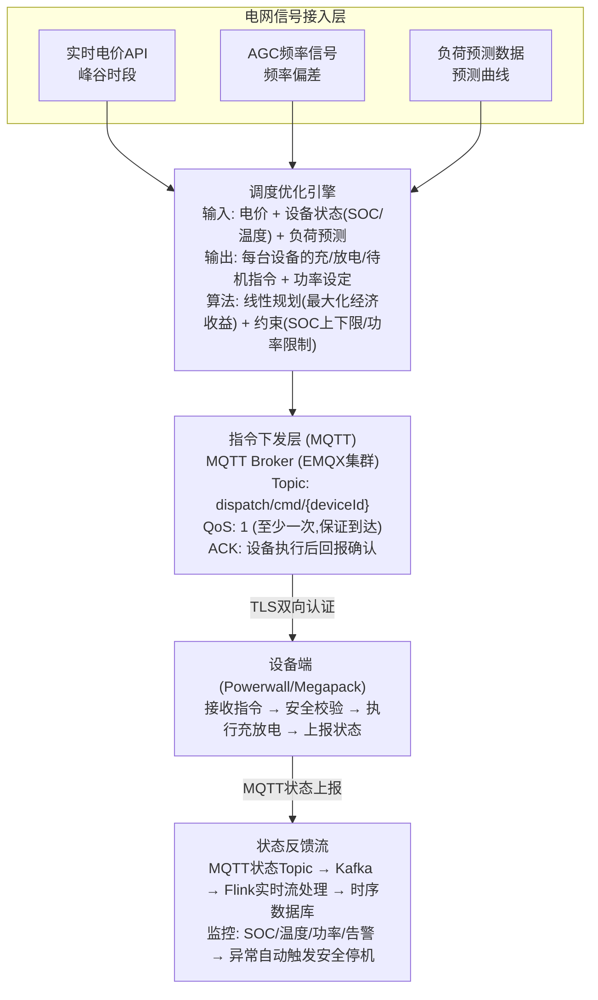

# 数十万套储能设备根据电网需求充放电，如何设计后端架构，实现调度指令精准下发、状态实时反馈？

## 🎯 本质

| 挑战 | 量化 | 方案 |
|------|------|------|
| **指令下发** | 30万设备毫秒级 | MQTT QoS1 + 批量下发 |
| **状态反馈** | 30万设备每秒上报 | Kafka流 + 时序数据库 |
| **调度优化** | 最大化收益+保护设备 | 线性规划/动态规划 |
| **安全保护** | 防过充/过放/过温 | 硬件保护+软件双重校验 |

---

## 🧒 类比

把储能调度想象成**智能水库管理系统**：
1. **天气预报**（电网信号）：知道明天要下大雨（风电过剩）还是干旱（用电高峰）
2. **水库管理员**（调度引擎）：提前决定什么时候开闸放水（放电）还是蓄水（充电）
3. **水管阀门**（指令通道）：把"开闸"命令发给每个水库（设备）
4. **水位计**（状态反馈）：每个水库实时汇报水位（SOC电量）
5. **安全堤坝**（保护层）：水位超高线自动溢洪（过充保护）

---

## 📊 整体架构图



---

## 🔧 详解

### 1. 调度优化引擎

```java
@Service
public class DispatchOptimizationEngine {

    /**
     * 核心优化：在电价约束下，最大化充放电收益
     * 
     * 目标函数: max Σ (放电价格 × 放电量 - 充电价格 × 充电量)
     * 约束条件:
     *   1. SOC_min ≤ SOC(t) ≤ SOC_max    (电量上下限)
     *   2. -P_max ≤ P(t) ≤ P_max          (功率限制)
     *   3. SOC(24) = SOC(0)               (日终回到初始电量)
     *   4. T(t) ≤ T_max                    (温度安全)
     */
    public DispatchPlan optimize(DeviceState state, GridSignal grid) {
        // 将24小时分为48个时间段(每30分钟一个)
        int slots = 48;

        // 获取未来24h电价预测
        double[] prices = grid.getPriceForecast(slots);

        // 动态规划求最优充放电序列
        double[][] dp = new double[slots + 1][101]; // SOC 0-100%
        int[][] action = new int[slots][101];       // 动作记录

        // ... DP求解过程（略）...

        // 生成调度计划
        DispatchPlan plan = new DispatchPlan();
        for (int t = 0; t < slots; t++) {
            DispatchCommand cmd = new DispatchCommand();
            cmd.setSlot(t);
            cmd.setPower(action[t][currentState.getSoc()]);
            cmd.setMode(cmd.getPower() > 0 ? "DISCHARGE" : "CHARGE");
            plan.addCommand(cmd);
        }

        // 预估收益
        plan.setEstimatedRevenue(calculateRevenue(plan, prices));
        return plan;
    }
}
```

### 2. MQTT 指令下发（可靠投递）

```java
@Service
public class CommandDispatchService {

    @Autowired private MqttGateway mqttGateway;

    public void sendCommand(DispatchCommand cmd, String deviceId) {
        String topic = "dispatch/cmd/" + deviceId;
        String payload = JSON.toJSONString(cmd);

        // QoS 1: 保证至少一次到达
        MqttMessage msg = new MqttMessage(payload.getBytes());
        msg.setQos(1);
        msg.setId(cmd.getCommandId().intValue()); // 消息ID

        mqttGateway.publish(topic, msg);

        // 设置ACK超时检查
        redis.setex("dispatch:pending:" + deviceId + ":" + cmd.getCommandId(),
                    10, payload); // 10秒未ACK则重发

        // 延迟检查ACK
        mq.sendDelay("dispatch-check-ack",
                     deviceId + ":" + cmd.getCommandId(),
                     10, TimeUnit.SECONDS);
    }

    // ACK超时重发
    @KafkaListener(topics = "dispatch-check-ack")
    public void onAckTimeout(String key) {
        String[] parts = key.split(":");
        String deviceId = parts[0];
        String cmdId = parts[1];

        if (redis.exists("dispatch:pending:" + key)) {
            // 设备未ACK → 重发指令
            DispatchCommand cmd = getCommand(cmdId);
            sendCommand(cmd, deviceId);

            // 记录重试次数，超过3次 → 标记设备离线
            int retries = incrementRetry(key);
            if (retries > 3) {
                markDeviceOffline(deviceId);
            }
        }
    }
}
```

### 3. 实时状态监控

```java
// Kafka流处理：实时监控所有设备状态
@Service
public class DeviceStatusStream {

    @KafkaListener(topics = "dispatch-status")
    public void onStatusUpdate(DeviceStatus status) {
        // ① 写入时序数据库
        tsdbService.insert(status);

        // ② 实时安全检查
        if (status.getTemperature() > 60) {
            // 过温保护 → 紧急停机
            emergencyStop(status.getDeviceId());
            alertService.send("设备过温: " + status.getDeviceId()
                + " 温度=" + status.getTemperature());
        }

        if (status.getSoc() < 5 || status.getSoc() > 95) {
            // SOC越界 → 告警
            alertService.send("SOC异常: " + status.getDeviceId()
                + " SOC=" + status.getSoc());
        }

        // ③ 聚合统计：当前总充/放电功率
        metricsService.record("total_charge_power",
            status.isCharging() ? status.getPower() : 0);
        metricsService.record("total_discharge_power",
            status.isDischarging() ? status.getPower() : 0);
    }
}
```

### 4. 安全保护双层架构

```
软件保护层（后端）:
┌─────────────────────────────────────┐
│ 1. 指令预校验：下发前检查            │
│    - 目标SOC是否在安全范围 [5%, 95%] │
│    - 充电功率是否超过额定值           │
│    - 设备温度是否已超标               │
│ 2. 异常自动停机：检测到过温/过流      │
│ 3. 指令签名：防止伪造指令             │
└──────────────────────┬──────────────┘
                       │
硬件保护层（设备端）:
┌──────────────────────▼──────────────┐
│ 1. BMS硬件保护：不可被软件覆盖       │
│    - 过压/欠压保护                    │
│    - 过流保护                         │
│    - 过温保护（热熔断器）             │
│ 2. 本地安全控制器：独立于主控        │
│ 3. 即使收到恶意指令，硬件层拒绝执行  │
└─────────────────────────────────────┘
```

---

## ❓ 发散追问

### Q1：如何保证充放电指令100%到达每个设备？

- **MQTT QoS1**：至少一次投递 + ACK确认
- **重试机制**：超时未ACK自动重发，最多3次
- **本地缓存**：设备断网时缓存指令，上线后补发
- **批量ACK**：多个指令可批量确认，减少通信开销

### Q2：大规模设备同时充/放电会不会冲击电网？

1. **分批调度**：30万设备分10批，每批间隔1分钟启动
2. **功率爬坡**：每台设备功率缓启动（30秒爬到目标功率）
3. **区域协调**：与电网公司协商，按区域分配充放电时段

### Q3：如何防止恶意指令导致设备过充爆炸？

- **指令签名**：每条指令用RSA签名，设备验签后才执行
- **设备端校验**：即使签名正确，设备也会检查指令合理性（SOC>90%不允许继续充电）
- **硬件BMS**：电池管理系统硬件级保护，软件无法绕过

## 记忆要点

- 核心三步走：采集电网信号 → 调度引擎算最优指令(线性规划) → MQTT精准下发
- 实时反馈：设备状态经MQTT上报，Kafka+Flink流式聚合写时序DB
- 双重防过载：调度算经济最大化，设备端软硬结合防过充/过放/过温保护


## 苏格拉底式面试追问

> 这组追问模拟面试官层层逼问，每一问先回答"为什么"，再回答"怎么做"，最后回答"如何证明"。

### 第一层：目标与动机

**Q：储能调度为什么要做"优化"，直接电网说什么就充什么不行吗？**

因为充放电涉及经济收益。电网高峰电价高（放电赚钱）、低谷电价低（充电省钱），调度算法要在电价最低时充电、最高时放电，收益最大化。而且设备有循环寿命（每天充放次数有限），要权衡"今天多赚一点 vs 电池寿命损耗"。直接执行电网指令是被动响应，优化调度是主动决策，一套 30 万套设备的系统，优化后日收益能差几十万。决策依据：电价差 + 设备规模 + 寿命成本，三者权衡的线性规划问题。

### 第二层：证据与定位

**Q：电网下发"紧急放电支援"指令，但部分设备没响应，你怎么定位？**

查指令链路：
1. 指令下发——MQTT 是否把指令推到设备（看 broker 的 message delivery 状态，QoS1 要确认）。
2. 设备接收——设备是否在线、是否收到指令（设备日志的 command received 记录）。
3. 设备执行——设备收到但没执行，可能是安全保护触发（过温、过放保护锁死）或硬件故障。看设备上报的状态码（fault code）。

### 第三层：根因深挖

**Q：设备在线、指令也收到了，但放电功率远低于预期，根因是什么？**

最可能是 SOC（电池电量）不足或温度保护。调度算法下发指令时假设设备有 80% 电量，但实际只有 30%（状态数据延迟），放电功率被 BMS（电池管理系统）限制。也可能是环境温度过高——锂电池高温下放电会触发过温保护，BMS 主动降功率保安全。根因是调度决策时的"设备状态快照"过时——调度引擎用的 SOC、温度数据是几分钟前的，实际已经变了。需要缩短状态采集间隔或加预测模型。

**Q：为什么不直接让设备满充满放，收益不是最大吗？**

因为会损害电池寿命。锂电池满充满放（0%→100%）的循环寿命约 2000 次，浅充浅放（20%→80%）约 6000 次。每次满充放赚 10 元但损耗 0.5% 寿命，浅充放赚 6 元但损耗 0.1% 寿命，长期算浅充放收益更高。调度算法必须把"电池寿命损耗成本"纳入目标函数，不是单次收益最大化，是全生命周期收益最大化。这是工程优化与短视贪婪的区别。

### 第四层：方案权衡

**Q：数十万套设备同时放电支援电网，你说怕冲击电网，怎么权衡响应速度和电网安全？**

分层错峰放电：
1. 地理分层——按区域（省/市）分批放电，每批间隔 1-2 秒，避免同一变电站瞬时负荷暴涨。
2. 功率渐升——单设备放电不是瞬间满功率，而是 5 秒线性渐升到目标功率，给电网调整时间。
3. 与电网协调——调度指令包含"最大允许同时放电设备数"，调度引擎按此限制选择设备子集。权衡点：电网需要秒级响应（频率调节），但不能瞬时冲击，所以用"快速但平滑"的策略——总响应 < 10s 但功率曲线平滑上升。

**Q：为什么不直接用集中式调度（一个大脑算所有设备的指令），而要分布式？**

集中式有单点瓶颈和风险。30 万套设备的优化问题是大规模线性规划，集中式求解要几分钟，跟不上电网秒级响应需求。而且集中式调度中心宕机，全网瘫痪。分布式调度——每个区域有边缘调度节点，负责本区域几千台设备的优化，秒级出结果；中心只下发"区域总功率目标"，不细化到单设备。权衡：集中式全局最优但慢且脆弱，分布式近似最优但快且健壮，实时调度选分布式。

### 第五层：验证与沉淀

**Q：你怎么证明调度算法真的实现了收益最大化？**

做 A/B 对照：
1. 基线组——10% 设备用"被动响应"策略（电网指令来了就执行，不优化）。
2. 实验组——90% 设备用优化调度。对比单位时间的"充放电收益 - 寿命损耗成本"，实验组应该显著高于基线组。
3. 归一化——收益除以设备数量和运行时长（元/台/天），消除规模差异。如果优化组每台每天多赚 2 元，30 万台就是日多赚 60 万，ROI 清晰。

**Q：储能调度架构怎么沉淀？**

1. 调度策略可配置——充放电阈值、寿命权重、电价曲线做成配置，不同地区（峰谷价差不同）用不同策略，不改代码。
2. 安全保护 SDK 化——过充/过放/过温保护的判断逻辑抽成设备端通用库，所有储能产品（Powerwall、Megapack）复用，安全标准统一。
3. 调度模型迭代——用历史数据离线训练更优的调度模型（强化学习），上线前用影子模式跑 2 周对比，确认更优再切换。


## 结构化回答

**30 秒电梯演讲：** 储能调度的核心是"电网需求感知+充放电指令精准下发+状态实时反馈"。系统根据电网负荷信号（峰谷电价/频率调节需求），向数十万设备下发充/放电指令，设备执行后秒级上报状态。

**展开框架：**
1. **核心三步走** — 采集电网信号 → 调度引擎算最优指令(线性规划) → MQTT精准下发
2. **实时反馈** — 设备状态经MQTT上报，Kafka+Flink流式聚合写时序DB
3. **双重防过载** — 调度算经济最大化，设备端软硬结合防过充/过放/过温保护

**收尾：** 这块我踩过坑——要不要深入聊：如何保证充放电指令100%到达每个设备？

## 视频脚本

> 预计时长：4 分钟 | 由浅入深

| 时间 | 画面/字幕 | 口播台词 | 讲解要点 |
|------|----------|----------|----------|
| 0:00 | 标题卡 | "分布式一句话：储能调度的核心是'电网需求感知+充放电指令精准下发+状态实时反馈'。系统根据电网负荷信号（峰谷电价/频率调节需求）…。" | 开场钩子 |
| 0:15 | JVM 内存模型与 GC 流程图 | "核心三步走：采集电网信号 到 调度引擎算最优指令(线性规划) 到 MQTT精准下发" | 核心三步走 |
| 1:08 | JVM 内存模型与 GC 流程图分步演示 | "实时反馈：设备状态经MQTT上报，Kafka+Flink流式聚合写时序DB" | 实时反馈 |
| 2:01 | 关键代码/伪代码片段 | "双重防过载：调度算经济最大化，设备端软硬结合防过充/过放/过温保护" | 双重防过载 |
| 2:54 | 对比表格 | "电网需求信号接入(AGC/峰谷电价/频率调节)" | 电网需求信号接入 |
| 3:50 | 总结卡 | "核心抓住这条主线，下期咱们接着聊：如何保证充放电指令100%到达每个设备。" | 收尾 |
