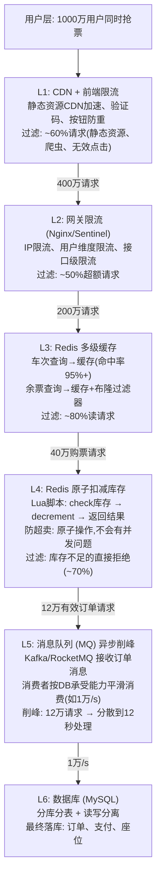

# 【系统设计】如何设计12306抢票系统，支持百万并发？

> 来源：12306抢票系统怎么抗住百万并发？（小红书）

## 一、系统整体架构：分层削峰漏斗模型



## 二、核心模块设计

### 2.1 余票查询优化（L2-L3）

```
┌──────────────────────────────────────────────────┐
│  余票查询三级缓存策略                                │
│                                                   │
│  请求: "北京→上海 G101 2026-02-15"                │
│       │                                           │
│       ▼                                           │
│  L1: Nginx本地缓存 (proxy_cache)                  │
│      TTL: 3秒 → 同一车次3秒内只查一次后端           │
│      命中: 90%+ 请求在此返回                        │
│       │ 未命中                                     │
│       ▼                                           │
│  L2: Redis集群缓存                                 │
│      Key: ticket:{date}:{train}:{from}:{to}      │
│      TTL: 5秒 → 聚合查询结果                       │
│      命中: 8% 请求在此返回                          │
│       │ 未命中                                     │
│       ▼                                           │
│  L3: 布隆过滤器 → 防穿透                           │
│      检查车次是否存在，不存在的直接拒绝              │
│      避免恶意查询打穿到数据库                        │
│       │ 通过                                      │
│       ▼                                           │
│  DB: MySQL余票表 (定时预计算)                      │
│      定时任务每10秒刷新Redis缓存                    │
│      余票数据不需要实时精确，可容忍秒级延迟          │
└──────────────────────────────────────────────────┘
```

### 2.2 Redis原子扣减库存（L4）

```lua
-- Redis Lua脚本: 原子扣减库存，防超卖
-- KEYS[1] = 库存key (ticket_stock:{train}:{date})
-- ARGV[1] = 扣减数量
-- ARGV[2] = 用户ID (防重复购买)

local stock = tonumber(redis.call('GET', KEYS[1]))
local userId = ARGV[2]

-- 检查是否已购买(防重复)
if redis.call('SISMEMBER', KEYS[1] .. ':users', userId) == 1 then
    return -2  -- 已购买
end

-- 检查库存
if stock == nil or stock < tonumber(ARGV[1]) then
    return -1  -- 库存不足
end

-- 原子扣减
redis.call('DECRBY', KEYS[1], ARGV[1])
redis.call('SADD', KEYS[1] .. ':users', userId)

return 1  -- 成功
```

```java
// Java调用Lua脚本
@Service
public class TicketStockService {
    @Autowired
    private StringRedisTemplate redisTemplate;
    
    private final DefaultRedisScript<Long> stockScript;
    
    @PostConstruct
    public void init() {
        stockScript = new DefaultRedisScript<>();
        stockScript.setScriptSource(new ResourceScriptSource(
            new ClassPathResource("lua/deduct_stock.lua")));
        stockScript.setResultType(Long.class);
    }
    
    public boolean deductStock(String trainNo, String date, 
                                int quantity, String userId) {
        String key = "ticket_stock:" + trainNo + ":" + date;
        Long result = redisTemplate.execute(stockScript,
            Collections.singletonList(key),
            String.valueOf(quantity), userId);
        return result != null && result == 1;
    }
}
```

### 2.3 MQ异步削峰（L5）

```
┌──────────────────────────────────────────────────────────┐
│  消息队列削峰架构                                          │
│                                                          │
│  抢票成功(Redis扣减成功)                                  │
│       │                                                  │
│       ▼                                                  │
│  ┌─────────────┐                                        │
│  │ Producer     │  发送订单消息到Kafka                    │
│  │ OrderService │  topic: ticket_orders                  │
│  └──────┬──────┘                                        │
│         │                                               │
│         ▼                                               │
│  ┌─────────────────────────────────────┐               │
│  │ Kafka (消息队列)                      │               │
│  │ 分区: 64 partitions                  │               │
│  │ 堆积: 最高百万级消息(短暂堆积OK)      │               │
│  └──────┬──────────────────────────────┘               │
│         │                                               │
│         ▼                                               │
│  ┌─────────────────────────────────────┐               │
│  │ Consumer Group (按DB能力消费)         │               │
│  │ 消费速率: 1万/s (DB可承受)            │               │
│  │ 消费逻辑:                             │               │
│  │   1. 落库(订单表)                    │               │
│  │   2. 锁定座位                        │               │
│  │   3. 发送支付链接(15分钟超时)         │               │
│  │   4. 失败→回滚Redis库存→通知用户     │               │
│  └─────────────────────────────────────┘               │
│                                                          │
│  用户侧体验:                                             │
│  点击抢票 → "正在为您排队..." → 收到排队号                │
│  → 排队成功 → "请在15分钟内完成支付"                     │
│  → 超时未支付 → 库存回滚 → 释放给其他用户                │
└──────────────────────────────────────────────────────────┘
```

### 2.4 超时未支付的库存回滚

```java
// 支付超时 → 库存回滚
@Component
public class OrderTimeoutHandler {
    
    @Scheduled(fixedRate = 5000)  // 每5秒扫描
    public void scanTimeoutOrders() {
        List<Order> timeouts = orderMapper
            .findTimeoutOrders(LocalDateTime.now().minusMinutes(15));
        
        for (Order order : timeouts) {
            // 1. Redis库存回补
            String key = "ticket_stock:" + order.getTrainNo() 
                       + ":" + order.getDate();
            redisTemplate.opsForValue().increment(key, order.getQuantity());
            
            // 2. 移除用户购买记录
            redisTemplate.opsForSet()
                .remove(key + ":users", order.getUserId());
            
            // 3. 更新订单状态为超时取消
            orderMapper.updateStatus(order.getId(), 
                OrderStatus.TIMEOUT_CANCELLED);
            
            // 4. 通知用户
            notificationService.send(order.getUserId(), 
                "您的订单已超时取消，请重新抢票");
        }
    }
}
```

## 三、关键技术选型

| 组件 | 技术 | 选型理由 |
|------|------|---------|
| CDN | 阿里云CDN/腾讯云CDN | 静态资源就近访问，拦截60%+流量 |
| 网关 | Nginx + Sentinel | 多维度限流，IP/用户/接口级别 |
| 缓存 | Redis Cluster | 原子操作防超卖，高可用分片集群 |
| MQ | Kafka/RocketMQ | 百万级消息堆积能力，高吞吐削峰 |
| 数据库 | MySQL分库分表 | 订单表按用户ID分片，读写分离 |
| 监控 | Prometheus + Grafana | QPS/RT/库存实时监控告警 |

## 四、面试加分点

1. **余票预计算**：12306实际采用定时任务预计算余票，写入Redis而非实时查询。余票数据可容忍秒级延迟，不需要实时精确
2. **候补购票机制**：抢票失败的用户可加入候补队列，有退票/超时释放时自动匹配，通过MQ通知用户——这是2019年后12306的核心创新
3. **数据分片策略**：订单表按用户ID取模分片（而非按车次分片），避免热门车次导致的写热点
4. **实际数据规模**：春运期间12306峰值QPS约80万，日订单量超1500万，是全球最大的票务系统。架构从最初的Oracle单库→读写分离→分库分表→微服务化→云原生，经历了10年演进
5. **防黄牛策略**：设备指纹+行为分析+验证码+实名认证+限频，多维度防控刷票脚本


## 结构化回答

**30 秒电梯演讲：** 12306抢票系统的核心是'漏斗式分层削峰'——从外到内层层过滤：CDN+缓存拦截读流量→Redis原子扣减防超卖→MQ异步削峰保护数据库→最终一致性保障。

**展开框架：**
1. **核心架构** — 分层削峰(CDN→缓存→Redis→MQ→DB)
2. **超卖防控** — Redis Lua原子扣减 + 分布式锁
3. **异步削峰** — MQ(Kafka/RocketMQ)平滑消费

**收尾：** 这块我踩过坑——要不要深入聊：12306的余票查询如何实现低延迟？（Hint: 多级缓存+余票预计算+ES）？

## 视频脚本

> 预计时长：4 分钟 | 由浅入深

| 时间 | 画面/字幕 | 口播台词 | 讲解要点 |
|------|----------|----------|----------|
| 0:00 | 标题卡 | "高并发一句话：12306抢票系统的核心是'漏斗式分层削峰'——从外到内层层过滤：CDN+缓存拦截读流量→Red…。" | 开场钩子 |
| 0:15 | Redis Lua 脚本执行截图 | "核心架构：分层削峰(CDN到缓存到Redis到MQ到DB)" | 核心架构 |
| 1:08 | Redis Lua 脚本执行截图分步演示 | "超卖防控：Redis Lua原子扣减 + 分布式锁" | 超卖防控 |
| 2:01 | 关键代码/伪代码片段 | "异步削峰：MQ(Kafka/RocketMQ)平滑消费" | 异步削峰 |
| 2:54 | 对比表格 | "最终一致：异步落库+定时对账+补偿机制" | 最终一致 |
| 3:50 | 总结卡 | "核心抓住这条主线，下期咱们接着聊：12306的余票查询如何实现低延迟？（Hint: 多级缓存+余票预计算+ES）。" | 收尾 |

## 苏格拉底式面试追问

| 追问层级 | 面试官可能这样问 | 高分回答方向 |
|----------|------------------|--------------|
| 目标追问 | 12306抢票系统的核心挑战是什么？ | 百万并发+瞬时峰值+库存一致性+防黄牛——核心是漏斗式分层削峰，从外到内层层过滤流量 |
| 证据追问 | 漏斗式分层具体怎么分？每层职责？ | CDN+缓存拦截读流量（90%查询）、Redis预扣库存扛写流量、MQ削峰异步化、DB最终一致扣减 |
| 边界追问 | 为什么不能直接打到DB？ | DB扛不住百万并发（连接/锁/IO）、库存行锁竞争严重；要用缓存预扣+MQ削峰保护DB |
| 反例追问 | 纯Redis扣减库存够吗？ | 不够。Redis宕机会丢数据、内存有限、不是最终账本；要Redis预扣+DB最终扣减+对账兜底 |
| 风险追问 | 抢票系统的风险？ | 缓存DB不一致、Redis热点、MQ积压、超卖、黄牛刷票、宕机 |
| 验证追问 | 怎么验证扛得住百万并发？ | 全链路压测、故障注入、库存对账、限流降级测试、监控各层拦截率 |
| 沉淀追问 | 抢票架构怎么沉淀？ | 规范：分层削峰+缓存预扣+MQ异步+DB最终一致+对账兜底+防刷策略 |

### 现场对话示例
**面试官**：如何设计12306抢票系统支持百万并发？
**候选人**：漏斗式分层削峰：CDN+缓存拦截读流量、Redis预扣库存扛写流量、MQ削峰异步化、DB最终一致扣减，对账兜底防超卖。
**面试官**：为什么不能直接打DB？
**候选人**：DB扛不住百万并发、库存行锁竞争严重，要用缓存预扣+MQ削峰层层保护DB，Redis预扣+DB最终扣减+对账。
**面试官**：纯Redis扣减够吗？
**候选人**：不够，Redis宕机会丢数据、内存有限不是最终账本，要Redis预扣+DB最终扣减+对账兜底保证一致性。
