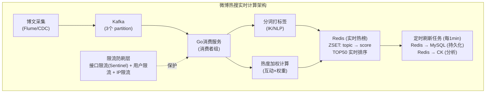

# 从零设计微博热搜实时计算服务

## 整体架构



## 微服务拆分

| 服务 | 职责 | 技术 |
|------|------|------|
| **博文采集** | CDC/爬虫采集全网博文 | Canal + Kafka |
| **分词服务** | 博文分词、实体识别、话题提取 | Go + IK分词 + NLP模型 |
| **热度计算** | 实时加权(转发×5 + 评论×3 + 点赞×1) | Go + Kafka Streams |
| **榜单服务** | TOP50维护、定时刷新 | Go + Redis ZSET |
| **API服务** | 对外提供热搜查询 | Go + Gin |
| **防刷服务** | 异常检测、限流 | Go + 规则引擎 |

## 存储选型

| 存储 | 数据 | 选型理由 |
|------|------|---------|
| **Redis** | 实时热榜(TOP50) | ZSET天然排序, O(logN)更新 |
| **Kafka** | 博文事件流 | 高吞吐、解耦、回溯 |
| **MySQL** | 历史榜单、配置 | 持久化、关系查询 |
| **ClickHouse** | 热度趋势分析 | 列存, 聚合查询快 |

## 热度计算逻辑

```go
func calculateHotness(post Post) float64 {
    // 热度 = 转发×5 + 评论×3 + 点赞×1 + 原创加成
    base := float64(post.Retweets)*5 +
            float64(post.Comments)*3 +
            float64(post.Likes)*1

    // 原创博文加权
    if post.IsOriginal {
        base *= 1.5
    }

    // 时间衰减(牛顿冷却定律)
    hoursSincePost := time.Since(post.CreatedAt).Hours()
    decay := math.Exp(-0.1 * hoursSincePost)

    // 话题热度累加
    for _, topic := range post.Topics {
        score := base * decay
        redis.ZIncrBy("hot_topics", score, topic)
    }

    return base * decay
}
```

## 限流防刷设计

```go
// 三级限流
type RateLimiter struct {
    // 1. 接口限流: 每秒最多10万次请求
    apiLimit   *tokenBucket  // 100000/s

    // 2. 用户限流: 单用户每小时最多发50条带话题博文
    userLimit  *slidingWindow // 50/hour/user

    // 3. IP限流: 单IP每分钟最多100次操作
    ipLimit    *slidingWindow // 100/min/ip
}

// 异常检测: 识别刷量
func detectAbuse(userID string, topic string) bool {
    // 规则1: 同一用户同一话题短时间内大量发文
    count := redis.Get(fmt.Sprintf("abuse:%s:%s", userID, topic))
    if count > 10 { // 1分钟内>10条
        return true
    }

    // 规则2: 新注册账号(注册<7天)参与热搜互动
    userAge := getUserAge(userID)
    if userAge < 7*24*3600 {
        // 降权处理而非直接封禁
        return true
    }

    return false
}
```

## 突发流量10x应对

```go
// 1. 弹性扩容: Kafka消费者自动扩缩
func autoScale() {
    lag := getConsumerLag()
    if lag > 100000 {
        k8sClient.ScaleDeployment("hot-search-consumer", currentReplicas*3)
    }
}

// 2. 降级策略: 突发时降低计算精度
func degradedCalc(post Post) {
    if underHighLoad {
        // 跳过NLP分词，用简单关键词匹配
        return simpleKeywordMatch(post)
    }
    return fullNLPCalc(post)
}

// 3. 积压告警
// Kafka lag > 50万 → P1告警 → 自动扩容
// Kafka lag > 200万 → P0告警 → 人工介入
```

## 缓存一致性

```go
// 热搜榜单更新策略: 定时刷新 + 双缓冲
func refreshLeaderboard() {
    // 每1分钟:
    // 1. 从计算结果生成新榜单
    newBoard := buildLeaderboard()

    // 2. 双缓冲切换(原子操作)
    redis.Set("hot_search:new", serialize(newBoard))
    redis.Rename("hot_search:new", "hot_search:current")

    // 3. 设置缓存过期时间(容灾)
    redis.Expire("hot_search:current", 120*time.Second)
    // 如果刷新任务挂了, 2分钟后缓存过期, 触发重新计算
}
```

## 记忆要点

- 核心数据流：CDC采集 → Kafka缓冲 → Go服务分词 → 加权计分(转5评3赞1)
- 实时排名：Redis ZSET维护TOP50热榜，TTL防旧榜，1分钟定时持久化
- 防刷保稳：Sentinel做接口/用户/IP多维限流，计算层过滤异常互动数据


## 苏格拉底式面试追问

> 这组追问模拟面试官层层逼问，每一问先回答"为什么"，再回答"怎么做"，最后回答"如何证明"。

### 第一层：目标与动机

**Q：微博热搜你为什么用流式计算（Flink/Kafka + Go 消费）而不是批量计算（每小时跑一次 MapReduce）？**

因为热搜要求实时性。突发热点（如明星官宣、突发事件）要在几分钟内登上热搜榜，用户刷新就能看到。批量计算每小时跑一次，热点要等 1 小时才上榜，时效性差。流式计算——博文实时入 Kafka，消费者实时分词 + 计算热度 + 更新 Redis ZSet，从博文发布到上榜延迟 < 1 分钟。决策依据：热搜的差异化价值就是"快"，批量计算做不了实时。代价是流式计算的资源成本高（常驻消费服务），但热搜是核心功能值得投入。

### 第二层：证据与定位

**Q：用户反馈"某热点话题刷屏了但热搜榜没有"，怎么定位是计算没跟上还是过滤掉了？**

查数据流：
1. Kafka 消费延迟——ConsumerLag 是否很大，如果博文积压了几百万没消费，是计算跟不上（消费者处理慢或挂了）。
2. 分词和打标签——这个话题的关键词是否被正确分词和匹配到已有话题。如果是新话题（词库没有），可能被当作"无主题博文"丢弃。
3. 热度计算——这个话题的热度分是否进了 Redis ZSet 但排名不在 Top 50（第 51 名上不了榜单）。

### 第三层：根因深挖

**Q：话题热度很高（互动量大）但进不了 Top 50，根因是什么？**

最可能是热度加权算法的问题。热度 = 博文数 × 权重 + 转发 × 权重 + 评论 × 权重。如果这个话题的"博文数"多但"转发/评论"少（水军刷发博但没有互动），按当前权重算总分低。另一种可能是"防刷降权"——系统检测到这个话题有异常互动（刷量），自动降权或过滤。还有"时间衰减"——ZSet 的 score 如果用了时间衰减（老话题分数下降），新话题刚起来分数还没积累。要看热度计算公式和这个话题的各项指标。

**Q：为什么不直接用"博文数量"做热搜排名（谁发得多谁上榜），简单直接？**

因为会被刷量操纵。如果按博文数量排名，水军用机器人发几万条带某话题的博文就能刷上榜，污染热搜。真实热搜要反映"用户的真实关注度"——转发、评论、点赞代表真实互动，单纯发博不代表关注（水军能发博但模拟不了真实互动的分布）。所以热度公式要加权互动（如转发 × 5 + 评论 × 3 + 点赞 × 1），并配合防刷（过滤异常账号的互动、限制单账号的贡献上限）。纯数量排名是给水军开后门，加权 + 防刷才是真实热搜。

### 第四层：方案权衡

**Q：热搜榜单你用 Redis ZSet 存储，为什么不用 MySQL ORDER BY 排序？**

因为实时排序的性能。Redis ZSet 是跳表结构，ZADD 插入 + ZREVRANGE 取 Top N 都是 O(log N)，毫秒级。热搜要实时更新（每秒可能多次热度变化），ZSet 的增量更新高效。MySQL 的 ORDER BY 是"查询时排序"（扫描全表 + 排序），即使有索引，几万话题的排序也要几十毫秒，且每次查询都重复计算。ZSet 是"写入时维护排序"（插入即有序），查询时直接取。而且热搜要支撑百万用户同时查看榜单，Redis 的 10 万+ QPS 远超 MySQL。

**Q：为什么不用 ClickHouse 做实时热搜（它也是为实时分析设计的）？**

因为 ClickHouse 的查询延迟不如 Redis 稳定。ClickHouse 是列式 OLAP 数据库，适合"批量聚合分析"（如统计某话题的小时趋势），但"实时取 Top 50 排名"的查询要扫描 + 排序，P99 延迟可能几十到几百毫秒（数据量大时）。Redis ZSet 是内存中的预排序结构，ZREVRANGE 0 50 是 O(log N + 50)，亚毫秒级。正确分工：Redis 存实时榜单（用户查看），ClickHouse 存历史数据（分析趋势、回溯）。两者配合：Go 服务实时算热度写 Redis（用户看），同时写 ClickHouse（分析师用）。

### 第五层：验证与沉淀

**Q：你怎么证明热搜的实时性和防刷有效？**

两类指标：
1. 实时性——从"话题首次出现"到"登上热搜榜"的延迟，P50 < 1 分钟、P99 < 5 分钟。突发热点的上榜速度是热搜的核心体验。
2. 防刷有效率——人工审核"被降权/过滤的话题"中，有多少是真实刷量（精准拦截）、多少是误杀（正常话题被误降）。防刷的目标是"拦截水军 + 不误杀正常话题"。

**Q：热搜架构怎么沉淀？**

1. 实时计算引擎——把"Kafka 消费 + 分词 + 热度计算 + Redis 更新"封装成通用流式计算框架，其他实时榜单（如热门视频、热门搜索词）复用。
2. 防刷平台——把"异常账号识别 + 互动去重 + 频率限制"沉淀为防刷平台，复用于评论、点赞等所有 UGC 场景。
3. 降级预案——突发 10 倍流量时，自动降级（降低计算精度、跳过防刷的深度校验、增大刷新间隔），保住核心的"榜单可用"而非"计算完整"。


## 结构化回答

**30 秒电梯演讲：** 微博热搜实时计算是流式处理+实时聚合+定时刷新的架构，核心挑战是突发流量10x扩容和防刷。打个比方，像一个实时股票行情系统——全网博文是交易数据，热度计算是股价计算，榜单是涨跌幅排行，突发热点就是涨停。

**展开框架：**
1. **核心数据流** — CDC采集 → Kafka缓冲 → Go服务分词 → 加权计分(转5评3赞1)
2. **实时排名** — Redis ZSET维护TOP50热榜，TTL防旧榜，1分钟定时持久化
3. **防刷保稳** — Sentinel做接口/用户/IP多维限流，计算层过滤异常互动数据

**收尾：** 这块我踩过坑——要不要深入聊：突发热点怎么检测？10倍流量怎么扛？

## 视频脚本

> 预计时长：4 分钟 | 由浅入深

| 时间 | 画面/字幕 | 口播台词 | 讲解要点 |
|------|----------|----------|----------|
| 0:00 | 标题卡 | "实时计算一句话：微博热搜实时计算是流式处理+实时聚合+定时刷新的架构，核心挑战是突发流量10x扩容和防刷。" | 开场钩子 |
| 0:15 | Redis Lua 脚本执行截图 | "核心数据流：CDC采集 到 Kafka缓冲 到 Go服务分词 到 加权计分(转5评3赞1)" | 核心数据流 |
| 1:08 | Redis Lua 脚本执行截图分步演示 | "实时排名：Redis ZSET维护TOP50热榜，TTL防旧榜，1分钟定时持久化" | 实时排名 |
| 2:01 | 关键代码/伪代码片段 | "防刷保稳：Sentinel做接口/用户/IP多维限流，计算层过滤异常互动数据" | 防刷保稳 |
| 2:54 | 对比表格 | "数据源: 全网博文实时入库 到 Kafka" | 数据源 |
| 3:50 | 总结卡 | "核心抓住这条主线，下期咱们接着聊：突发热点怎么检测？10倍流量怎么扛。" | 收尾 |
